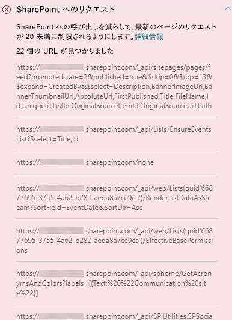

# SharePoint Online の最新および従来の発行サイト ページでページ呼び出しを最適化する

SharePoint Online の最新の発行サイトと従来の発行サイトには、SharePoint 機能および CDN からデータを読み込む (またはを呼び出す) リンクが含まれています。 ページからの呼び出しが多くなるほど、ページの読み込みには時間がかかります。 これは、**エンドユーザーが認識する遅延**、または **EUPL (end user perceived latency)** として知られています。

この記事は、最新および従来の発行サイト ページから外部エンドポイントへの呼び出しの数と影響を判断する方法、およびエンドユーザーが認識する遅延への影響を制限する方法を理解するのに役立ちます。

>[!NOTE]
>Sharepoint Online の最新ポータルでのパフォーマンスの詳細については、「[SharePoint のモダン エクスペリエンスにおけるパフォーマンス](https://docs.microsoft.com/sharepoint/modern-experience-performance)」を参照してください。

## SharePoint 用ページ診断ツールを使用してページ呼び出しを分析する

SharePoint 用ページ診断ツールは、新しい Microsoft Edge (https://www.microsoft.com/edge)) と Chrome のブラウザー拡張機能であり、SharePoint Online の最新ポータルと従来の発行サイト ページの両方を分析します。 このツールでは、定義されている一連のパフォーマンス条件に対するページのパフォーマンスを示す分析済みの各ページのレポートが作成されます。 SharePoint 用ページ診断ツールのインストール方法と詳細については、「[SharePoint Online 用ページ診断ツールを使用する](page-diagnostics-for-spo.md)」を参照してください。

>[!NOTE]
>ページ診断ツールは SharePoint Online でのみ機能し、SharePoint システム ページでは使用できません。

SharePoint のサイト ページを SharePoint 用ページ診断ツールを使用して分析すると、[_診断テスト_] ウィンドウの [**SharePoint へのリクエスト**] 結果に外部呼び出しに関する情報が表示されます。 サイト ページに含まれるコールの数がベースライン数より少ない場合、線は緑色で表示され、ページがベースライン数を超える場合は赤色で表示されます。 クラシック サイト ページは HTTP1.1 を使用し、モダン ページは HTTP2.0 を使用するため、ベースライン数はモダン ページとクラシック ページで異なります。

- 最新のサイト ページには **25** を超える呼び出しは含めないでください。
- 従来の発行ページには **6** を超える呼び出しは含めないでください。

考えられる結果は次のとおりです。

- **要注意** (赤): ページが呼び出しのベースライン数を超えています
- **操作は不要** (緑): ページに含まれる呼び出しがベースライン数より少ないです

[**SharePoint へのリクエスト**] の結果が [**要注意**] セクションに表示されている場合は、結果をクリックして、ページ上の呼び出しの総数や URL のリストなどの詳細を確認できます。

## ページ上の呼び出しが多すぎることに関連するパフォーマンスの問題を修復する

ページに含まれる呼び出しが多すぎる場合、[**SharePoint へのリクエスト**] の結果の URL のリストを使用して、繰り返しの呼び出し、バッチ処理する必要のある呼び出し、またはキャッシュする必要のあるデータを返す呼び出しがあるかどうかを判断できます。

**REST 呼び出しのバッチ処理**が、パフォーマンスのオーバーヘッド削減に役立ちます。 API 呼び出しのバッチ処理の詳細については、「[REST API によりバッチ要求を発行する](https://docs.microsoft.com/sharepoint/dev/sp-add-ins/make-batch-requests-with-the-rest-apis)」をご覧ください。

**キャッシュを使用**して API 呼び出しの結果を保存すると、以降のページの読み込みごとに追加の呼び出しを行う代わりに、クライアントがキャッシュ データを使用できるようになるため、ウォーム リクエストのパフォーマンスが向上します。 ビジネス要件に応じて、このソリューションにアプローチする方法は複数あります。 通常、データがすべてのユーザーで同じ場合、ユーザーは SPO から直接ではなくキャッシュ サービスからデータを要求するため、[_Azure Redis_ キャッシュ](https://azure.microsoft.com/services/cache/)などの中間層キャッシュ サービスを使用することは、サイトに対する API トラフィックを大幅に削減する優れたオプションです。 必要な SPO 呼び出しは、中間層のキャッシュを更新することだけです。 データが個々のユーザーごとに変動する場合は、LocalStorage や Cookie などのクライアント側キャッシュを実装するのが最善かもしれません。 これにより、キャッシュ期間中に同じユーザーによって行われる後続のリクエストが排除されるため呼び出しの量は減少しますが、専用のキャッシュ サービスよりも効率が低下します。 PnP を使用すると、追加の開発をほとんど必要とせずに LocalStorage を使用できます。

パフォーマンスの問題を修復するためにページを修正する前に、分析結果のページ読み込み時間をメモしてください。 修正後にツールをもう一度実行して新しい結果がベースライン基準内にあるかどうかを確認し、新しいページ読み込み時間をチェックして改善されたかどうかを確認します。

>[!NOTE]
>ページ読み込み時間は、ネットワーク負荷、時間帯、その他の一時的な状態など、さまざまな要素によって異なります。 結果を平均化するために、変更の前後に数回に渡ってページ読み込み時間をテストする必要があります。

## 関連項目

[SharePoint Online のパフォーマンスをチューニングする](tune-sharepoint-online-performance.md)

[Office 365 のパフォーマンスをチューニングする](tune-office-365-performance.md)

[SharePoint のモダン エクスペリエンスにおけるパフォーマンス](https://docs.microsoft.com/sharepoint/modern-experience-performance)

[コンテンツ配信ネットワーク](content-delivery-networks.md)

[SharePoint Online での Office 365 コンテンツ配信ネットワーク (CDN) の使用](use-office-365-cdn-with-spo.md)
