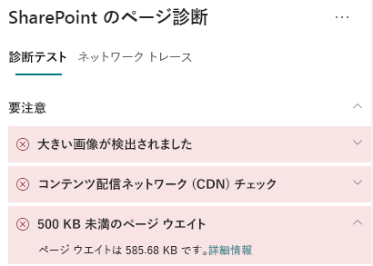

# SharePoint Online の最新のサイト ページでページのウエイトを最適化するOptimize page weight in SharePoint Online modern site pages

SharePoint Online の最新のサイト ページには、ページのコンテンツをレンダリングするのに必要なシリアル番号が含まれています。これには、ナビゲーション バーやコマンド バーと、ページの枠組みを構成するその他の HTML コードの下のコンテンツ領域にある画像、テキスト、オブジェクトが含まれます。SharePoint Online modern site pages contain serialized code that is required to render page content of the page, including images, text, objects in the content area underneath navigation/command bars and other HTML code that forms the framework of the page. ページのウエイトはこの HTML コードの測定値であり、ページの読み込み時間が最適になるように制限する必要があります。Page weight is a measurement of this HTML code, and should be limited to ensure optimal page load times.

この記事では、最新のサイト ページでページのウエイトを減らす方法について説明します。This article will help you understand how to reduce page weight in your modern site pages.

>[!NOTE]
>Sharepoint Online の最新ポータルでのパフォーマンスの詳細については、「[SharePoint のモダン エクスペリエンスにおけるパフォーマンス](https://docs.microsoft.com/sharepoint/modern-experience-performance)」を参照してください。For more information about performance in SharePoint Online modern portals, see [Performance in the modern SharePoint experience](https://docs.microsoft.com/sharepoint/modern-experience-performance).

## SharePoint 用ページ診断ツールを使用してページのウエイトを分析するUse the Page Diagnostics for SharePoint tool to analyze page weight

**SharePoint 用ページ診断ツール**は、Chrome と [Microsoft Edge バージョン 77 以降](https://www.microsoftedgeinsider.com/download?form=MI13E8&OCID=MI13E8)のブラウザー拡張機能であり、SharePoint の最新版と従来版両方の発行サイト ページを使用できます。The **Page Diagnostics for SharePoint tool** is a browser extension for Chrome and [Microsoft Edge version 77 or later](https://www.microsoftedgeinsider.com/download?form=MI13E8&OCID=MI13E8) you can use to analyze SharePoint both modern and classic publishing site pages. このツールでは、定義されている一連のパフォーマンス条件に対するページのパフォーマンスを示す分析済みの各ページのレポートが作成されます。The tool provides a report for each analyzed page showing how the page performs against a defined set of performance criteria. SharePoint 用ページ診断ツールのインストール方法と詳細については、「[SharePoint Online 用ページ診断ツールを使用する](page-diagnostics-for-spo.md)」を参照してください。To install and learn about the Page Diagnostics for SharePoint tool, visit [Use the Page Diagnostics tool for SharePoint Online](page-diagnostics-for-spo.md).

SharePoint のサイト ページを SharePoint 用ページ診断ツールを使用して分析すると、[_診断テスト_] ウィンドウの [**500 KB 未満のページのウエイト**] 結果にページに関する情報が表示されます。When you analyze a SharePoint site page with the Page Diagnostics for SharePoint tool, you can see information about page in the **Page weight under 500KB** result of the _Diagnostic tests_ pane. 結果は、ページのウエイトがベースライン値を下回る場合は緑色で、ページのウエイトが基準値を超える場合は赤色で表示されます。The result will appear in green if the page weight is under the baseline value, and red if the page weight exceeds the baseline value.

考えられる結果は次のとおりです。Possible results include:

- **要注意** (赤): ページのウエイトが 500 KB を超えています**Attention required** (red): Page weight exceeds 500KB
- **操作は不要** (緑): ページのウエイトが 500 KB を下回っています**No action required** (green): Page weight is under 500KB

[**500 KB 未満のページのウエイト**] の結果が [**要注意**] セクションに表示された場合、結果をクリックして詳細を確認できます。If the **Page weight under 500KB** result appears in the **Attention required** section, you can click the result for details.

## ページのウエイトの問題を修復するRemediate page weight issues

ページのウエイトが 500 KB を超える場合は、Web パーツの数を減らし、適度にページのコンテンツを制限することで、ページの読み込み時間全体を改善できます。If page weight exceeds 500KB, you can improve overall page load time by reducing the number of web parts and limiting page content to an appropriate degree.

ページのウエイトを減らすための一般的なガイダンスは以下のとおりです。General guidance for reducing page weight includes:

- ページのコンテンツを妥当な量まで制限し、関連するコンテンツには複数のページを使用します。Limit the page content to a reasonable amount and use multiple pages for related content.
- 大きなプロパティ バッグがある Web パーツの使用を最小限に抑えます。Minimize the use of web parts that have large property bags.
- 可能な場合は、非対話型ロールアップ ビューを使用します。Use non-interactive rollup views when possible.
- 画像のサイズを最適化するには、画像のサイズを適度に変更し、圧縮された画像形式を使用して、CDN からダウンロードできるようにします。Optimize image sizes by sizing images appropriately, using compressed image formats and ensuring that they are downloaded from a CDN.

ページのウエイトを制限に関する追加のガイダンスについては、次の記事を参照してください。You can find additional guidance for limiting page weight in the following article:

- [SharePoint でページ パフォーマンスを最適化するOptimize page performance in SharePoint](https://docs.microsoft.com/sharepoint/dev/general-development/optimize-page-performance-in-sharepoint)

ページの変更を行ってパフォーマンスの問題を修復する前に、分析結果のページの読み込み時間をメモします。Before you make page revisions to remediate performance issues, make a note of the page load time in the analysis results. 修正後にツールをもう一度実行して新しい結果がベースライン基準内にあるかどうかを確認し、新しいページ読み込み時間をチェックして改善されたかどうかを確認します。Run the tool again after your revision to see if the new result is within the baseline standard, and check the new page load time to see if there was an improvement.

>[!NOTE]
>ページ読み込み時間は、ネットワーク負荷、時間帯、その他の一時的な状態など、さまざまな要素によって異なります。Page load time can vary based on a variety of factors such as network load, time of day, and other transient conditions. 結果を平均化するために、変更の前後に数回に渡ってページ読み込み時間をテストする必要があります。You should test page load time a few times before and after making changes to help you average the results.

## 関連項目Related topics

[SharePoint Online のパフォーマンスをチューニングするTune SharePoint Online performance](tune-sharepoint-online-performance.md)

[Office 365 のパフォーマンスをチューニングするTune Office 365 performance](tune-office-365-performance.md)

[SharePoint のモダン エクスペリエンスにおけるパフォーマンスPerformance in the modern SharePoint experience](https://docs.microsoft.com/sharepoint/modern-experience-performance.md)

[コンテンツ配信ネットワークContent delivery networks](content-delivery-networks.md)

[SharePoint Online での Office 365 コンテンツ配信ネットワーク (CDN) の使用Use the Office 365 Content Delivery Network (CDN) with SharePoint Online](use-office-365-cdn-with-spo.md)
