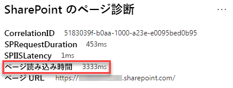

# SharePoint Online の最新のサイト ページでページのウエイトを最適化する

SharePoint Online の最新のサイト ページには、ページのコンテンツをレンダリングするのに必要なシリアル番号が含まれています。これには、ナビゲーション バーやコマンド バーと、ページの枠組みを構成するその他の HTML コードの下のコンテンツ領域にある画像、テキスト、オブジェクトが含まれます。 ページのウエイトはこの HTML コードの測定値であり、ページの読み込み時間が最適になるように制限する必要があります。

この記事では、最新のサイト ページでページのウエイトを減らす方法について説明します。

>[!NOTE]
>Sharepoint Online の最新ポータルでのパフォーマンスの詳細については、「[SharePoint のモダン エクスペリエンスにおけるパフォーマンス](https://docs.microsoft.com/ja-JP/sharepoint/modern-experience-performance)」を参照してください。

## SharePoint 用ページ診断ツールを使用してページのウエイトを分析する

**SharePoint 用ページ診断ツール**は、Chrome と [Microsoft Edge バージョン 77 以降](https://www.microsoftedgeinsider.com/en-us/download?form=MI13E8&OCID=MI13E8)のブラウザー拡張機能であり、SharePoint の最新版と従来版両方の発行サイト ページを使用できます。 このツールでは、定義されているパフォーマンス条件のセットに対してページがどのように実行されるかを示す分析済みの各ページのレポートが作成されます。 SharePoint 用ページ診断ツールのインストール方法と詳細については、「[SharePoint Online 用ページ診断ツールを使用する](page-diagnostics-for-spo.md)」を参照してください。

SharePoint のサイト ページを SharePoint 用ページ診断ツールを使用して分析すると、[_診断テスト_] ウィンドウの [**500 KB 未満のページのウエイト**] 結果にページに関する情報が表示されます。 結果は、ページのウエイトがベースライン値を下回る場合は緑色で、ページのウエイトが基準値を超える場合は赤色で表示されます。

考えられる結果は次のとおりです。

- **要注意** (赤): ページのウエイトが 500 KB を超えています
- **操作は不要** (緑): ページのウエイトが 500 KB を下回っています

[**500 KB 未満のページのウエイト**] の結果が [**要注意**] セクションに表示された場合、結果をクリックして詳細を確認できます。

## ページのウエイトの問題を修復する

ページのウエイトが 500 KB を超える場合は、Web パーツの数を減らし、適度にページのコンテンツを制限することで、ページの読み込み時間全体を改善できます。

ページのウエイトを減らすための一般的なガイダンスは以下のとおりです。

- ページのコンテンツを妥当な量まで制限し、関連するコンテンツには複数のページを使用します。
- 大きなプロパティ バッグがある Web パーツの使用を最小限に抑えます。
- 可能な場合は、非対話型ロールアップ ビューを使用します。
- 画像のサイズを最適化するには、画像のサイズを適度に変更し、圧縮された画像形式を使用して、CDN からダウンロードできるようにします。

ページのウエイトを制限に関する追加のガイダンスについては、次の記事を参照してください。

- [SharePoint でページ パフォーマンスを最適化する](https://docs.microsoft.com/ja-JP/sharepoint/dev/general-development/optimize-page-performance-in-sharepoint)

ページの変更を行ってパフォーマンスの問題を修復する前に、分析結果のページの読み込み時間をメモします。 変更後にツールをもう一度実行して新しい結果がベースライン基準にあるかどうかを確認し、新しいページの読み込み時間を確認して改善されたかどうかを確認します。

>[!NOTE]
>ページの読み込み時間は、ネットワークの負荷、時間帯、その他の一時的な状態など、さまざまな要素によって異なります。 結果の平均値を求めるのに役立つよう変更を加える前と後に、ページの読み込み時間を数回テストする必要があります。

## 関連トピック

[SharePoint Online のパフォーマンスを調整する](tune-sharepoint-online-performance.md)

[Office 365 のパフォーマンスを調整する](tune-office-365-performance.md)

[SharePoint のモダン エクスペリエンスにおけるパフォーマンス](https://docs.microsoft.com/ja-JP/sharepoint/modern-experience-performance.md)

[コンテンツ配信ネットワーク](content-delivery-networks.md)

[SharePoint Online での Office 365 コンテンツ配信ネットワーク (CDN) の使用](use-office-365-cdn-with-spo.md)
