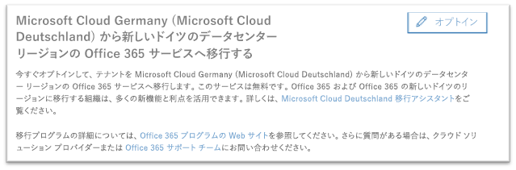
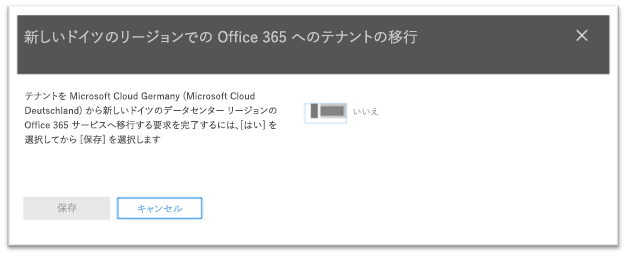
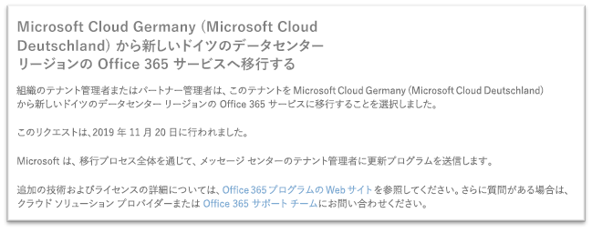

# Microsoft Cloud Germany (Microsoft Cloud Deutschland) から新しいドイツのデータセンター リージョンの Office 365 サービスへの移行をオプトインする方法

>[!Note]
>この記事は、該当する Microsoft Cloud Germany/Deutschland のお客様にのみ適用されます。
>

## 移行を要求する方法

Microsoft Cloud German でプロビジョニングされたサービスをご利用のお客様には、Microsoft 365 管理センターに、お客様のテナント管理者が移行をオプトインできるページが表示されます。

Microsoft 365 管理センター のページにアクセスするには、左側のナビゲーション ウィンドウで [**設定**] を展開し、[**組織プロファイル**] をクリックします。

[**組織プロファイル**] ページで、「**Microsoft Cloud Germany (Microsoft Cloud Deutschland) から新しいドイツのデータセンター リージョンの Office 365 サービスへの移行**」セクションにスクロールします。

組織が Microsoft Cloud Germany (Microsoft Cloud Deutschland) から新しいドイツのデータセンター リージョンの Office 365 サービスに移行する場合は、[**オプトイン**] をクリックします。
 

新しいセクションが画面の右側に表示され、確認を受け入れます。 トグル ボタンを [**はい**] に選択し、[**保存**] をクリックします。
 

管理者がテナントに代わってオプトインすると、すべての管理者は、「**Microsoft Cloud Germany (Microsoft Cloud Deutschland) から新しいドイツのデータセンター リージョンの Office 365 サービスへの移行**」セクションでオプトインの日付を含む確認を確認できます。 管理者は、Microsoft 365 管理センターのメッセージ センターでも確認できます。 
 

## 移行をオプトインした後はどうなりますか?

Microsoft 主導のアプローチにオプトインした組織の場合、2020 年に移行が行われる予定です。  移行の結果、主要な顧客データおよびサブスクリプションは新しいドイツ リージョンへと移動します。  Microsoft は、メッセージ センターの移行プロセス全体を通じて更新プログラムを送信します。

## 詳細情報

- [https://aka.ms/germanymigrateassist](https://aka.ms/germanymigrateassist) での Microsoft Cloud Deutschland 移行アシスタント
- [https://aka.ms/office365germanymove](https://aka.ms/office365germanymove) での Office 365 移行 
- [https://aka.ms/d365ceoptin](https://aka.ms/d365ceoptin) での Dynamics 365 の移行
- [https://aka.ms/pbioptin](https://aka.ms/pbioptin) での Power BI の移行
- 「ヘルプが必要ですか?」を使用して質問を送信する [Microsoft 365 管理センター](https://portal.office.de/)のリンクです。
