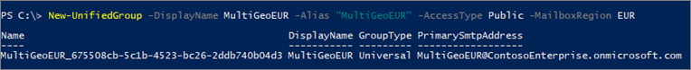

# <a name="create-an-office-365-group-with-a-specific-pdl"></a><span data-ttu-id="3906f-103">特定 PDL で Office 365 グループを作成する</span><span class="sxs-lookup"><span data-stu-id="3906f-103">Create an Office 365 Group with a specific PDL</span></span>

<span data-ttu-id="3906f-104">複数地域環境のユーザーが Office 365 グループを作成すると、グループ優先データの場所は自動的にそのユーザーの場所に設定されます。</span><span class="sxs-lookup"><span data-stu-id="3906f-104">When users in a multi-geo environment create an Office 365 Group, the group preferred data location is automatically set to that of the user.</span></span> <span data-ttu-id="3906f-105">特定 PDL でグループを作成する必要がある場合は、Exchange Online New-unifiedgroup Microsoft PowerShell コマンドレットを使用して作成できます。</span><span class="sxs-lookup"><span data-stu-id="3906f-105">If you need to create a group with a specific PDL, you can do that using the Exchange Online New-UnifiedGroup Microsoft PowerShell cmdlet.</span></span> <span data-ttu-id="3906f-106">これを実行すると、グループ メールボックスとグループに関連付けられている SharePoint サイトは両方とも、指定 PDL でプロビジョニングされます。</span><span class="sxs-lookup"><span data-stu-id="3906f-106">When you do this, both the group mailbox and SharePoint site associated with the group will be provisioned in the specified PDL.</span></span>

<span data-ttu-id="3906f-107">これを実行するのは、全体管理者、SharePoint Online 管理者、Exchange Online 管理者のいずれかである必要があります。</span><span class="sxs-lookup"><span data-stu-id="3906f-107">You must be a global administrator or a SharePoint Online or Exchange Online administrator to do this.</span></span>

<span data-ttu-id="3906f-108">指定した PDL を使用して Office 365 グループを作成するのには、Exchange Online PowerShell に接続して、パラメーター *-MailBoxRegion* を地域の場所コードとともに渡します。</span><span class="sxs-lookup"><span data-stu-id="3906f-108">To create an Office 365 Group with the PDL that you specify, connect to Exchange Online PowerShell and pass the parameter *-MailBoxRegion* with the geo location code.</span></span>

<span data-ttu-id="3906f-109">次に例を示します。</span><span class="sxs-lookup"><span data-stu-id="3906f-109">For example:</span></span> 

```PowerShell
New-UnifiedGroup -DisplayName MultiGeoEUR -Alias "MultiGeoEUR" -AccessType Public -MailboxRegion EUR 
```



<span data-ttu-id="3906f-111">SharePoint グループのサイト プロビジョニングがオンデマンドであることに注意してください。</span><span class="sxs-lookup"><span data-stu-id="3906f-111">Note that SharePoint group site provisioning is on-demand.</span></span> <span data-ttu-id="3906f-112">サイトは、グループの所有者またはメンバーが初めてアクセスを試みたときにプロビジョニングされます。</span><span class="sxs-lookup"><span data-stu-id="3906f-112">The site will be provisioned the first time a group owner or member attempts to access it.</span></span>

## <a name="geo-location-codes"></a><span data-ttu-id="3906f-113">地域の場所コード</span><span class="sxs-lookup"><span data-stu-id="3906f-113">Geo location codes</span></span>

[!INCLUDE [Office 365 Multi-Geo locations](includes/office-365-multi-geo-locations.md)]

## <a name="see-also"></a><span data-ttu-id="3906f-114">関連項目</span><span class="sxs-lookup"><span data-stu-id="3906f-114">See also</span></span>

[<span data-ttu-id="3906f-115">Exchange Online PowerShell への接続</span><span class="sxs-lookup"><span data-stu-id="3906f-115">Connect to Exchange Online PowerShell</span></span>](https://docs.microsoft.com/powershell/exchange/exchange-online/connect-to-exchange-online-powershell/connect-to-exchange-online-powershell)