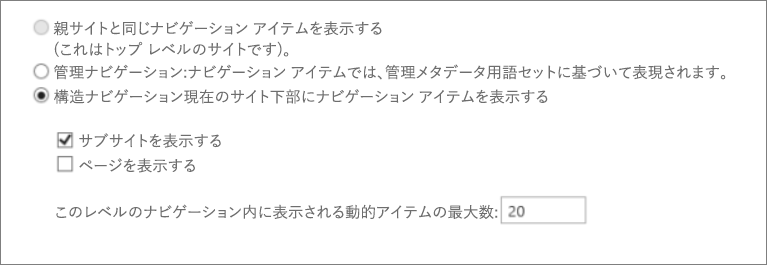
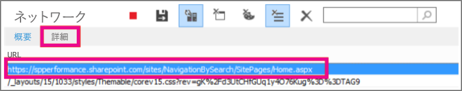
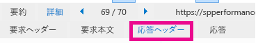

# <a name="navigation-options-for-sharepoint-online"></a><span data-ttu-id="99cad-104">SharePoint Online のナビゲーション オプション</span><span class="sxs-lookup"><span data-stu-id="99cad-104">Navigation options for SharePoint Online</span></span>

<span data-ttu-id="99cad-p102">SharePoint Online で有効にし、SharePoint 発行のナビゲーション オプションのサイトについて説明します。選択とナビゲーションの構成は、パフォーマンスとスケーラビリティは、SharePoint Online サイトを大幅に影響します。</span><span class="sxs-lookup"><span data-stu-id="99cad-p102">This article describes navigation options sites with SharePoint Publishing enabled in SharePoint Online. The choice and configuration of navigation significantly impacts the performance and scalability of sites in SharePoint Online.</span></span>

## <a name="overview"></a><span data-ttu-id="99cad-107">概要</span><span class="sxs-lookup"><span data-stu-id="99cad-107">Overview</span></span>

<span data-ttu-id="99cad-p103">ナビゲーション プロバイダーの構成は、サイト全体のパフォーマンスに大きく影響し、SharePoint サイトの要件に効果的にスケーリングするための構成とナビゲーション プロバイダーを選択するのには注意を払う必要があります。カスタム ナビゲーションの実装と同様に、2 つのボックスのナビゲーション プロバイダーがあります。</span><span class="sxs-lookup"><span data-stu-id="99cad-p103">Navigation provider configuration can significantly impact performance for the entire site, and careful consideration must be taken to pick a navigation provider and configuration that scales effectively for the requirements of a SharePoint site. There are two out-of-the-box navigation providers, as well as custom navigation implementations.</span></span>

<span data-ttu-id="99cad-p104">最初のオプションでは、[**マネージ (メタデータ) のナビゲーション**](#using-managed-navigation-and-metadata-in-sharepoint-online)をお勧めし、SharePoint online は既定のオプションの 1 つただし、必要な場合を除き、セキュリティ トリミングが無効にするをお勧めします。このナビゲーション プロバイダーのセキュリティで保護された既定の設定としてセキュリティ トリミングが有効になっています。ただし、多くのサイトには、セキュリティ トリミングのナビゲーション要素が多くの場合は、サイトのすべてのユーザーに対して一貫したためのオーバーヘッドは不要です。セキュリティ トリミングを無効にするのには推奨される構成、このナビゲーション プロバイダー サイトの構造体を列挙する必要はなく、、許容可能なパフォーマンスへの影響、拡張性の高い。</span><span class="sxs-lookup"><span data-stu-id="99cad-p104">The first option, [**Managed (Metadata) navigation**](#using-managed-navigation-and-metadata-in-sharepoint-online), is recommended, and is one of the default options in SharePoint Online; however, we recommend that security trimming be disabled unless required. Security trimming is enabled as a secure-by-default setting for this navigation provider; however, many sites do not require the overhead of security trimming since navigation elements often are consistent for all users of the site. With the recommended configuration to disable security trimming, this navigation provider does not require enumerating site structure and is highly scalable with acceptable performance impact.</span></span>

<span data-ttu-id="99cad-p105">2 番目オプション、[**構造的なナビゲーション**](#using-structural-navigation-in-sharepoint-online)では、 **SharePoint Online のナビゲーションの推奨されるオプションではないのです**。このナビゲーション プロバイダーは、設置型のトポロジには、SharePoint Online でのサポートが限られているために設計されました。いくつか追加の機能とその他のナビゲーション オプションのセットが用意されています、セキュリティによるトリミングとサイト構造の列挙型を含む、これらの機能はコストがかかるサーバーに過度な呼び出しと影響のスケーラビリティとパフォーマンスの使用されている場合。Structed のナビゲーションを使用して、過剰なリソースを消費するサイトは、調整される場合があります。</span><span class="sxs-lookup"><span data-stu-id="99cad-p105">The second option, [**Structural navigation**](#using-structural-navigation-in-sharepoint-online), **is NOT a recommended navigation option in SharePoint Online**. This navigation provider was designed for an on-premises topology has limited support in SharePoint Online. While it provides some additional set of capabilities versus other navigation options, these features, including security trimming and site structure enumeration, comes at a cost of excessive server calls and impacts scalability and performance when it is used. Sites using structed navigation that consume excessive resources may be subject to throttling.</span></span>

<span data-ttu-id="99cad-p106">だけでなく、標準のナビゲーション プロバイダーでは、多くのお客様が別のユーザー設定のナビゲーションの実装を実装しました。カスタム ナビゲーションの実装の 1 つの一般的なクラスでは、ナビゲーション ノードのローカル キャッシュを格納するクライアントに表示されるデザイン パターンを採用します。(参照**[検索ベースのクライアント側のスクリプト](#using-search-driven-client-side-scripting)** の「)。</span><span class="sxs-lookup"><span data-stu-id="99cad-p106">In addition to the out-of-the-box navigation providers, many customers have successfully implemented alternative custom navigation implementations. One common class of custom navigation implementations embraces client-rendered design patterns that store a local cache of navigation nodes. (See **[Search-driven client-side scripting](#using-search-driven-client-side-scripting)** in this article.)</span></span>

<span data-ttu-id="99cad-120">これらのナビゲーション プロバイダーには、いくつかの重要な利点があります。</span><span class="sxs-lookup"><span data-stu-id="99cad-120">These navigation providers have a couple of key advantages:</span></span> 
- <span data-ttu-id="99cad-121">一般に応答性の高いページ デザインでうまく動作します。</span><span class="sxs-lookup"><span data-stu-id="99cad-121">They generally work well with responsive page designs.</span></span>
- <span data-ttu-id="99cad-122">非常にスケーラブルな高性能なレンダリングされることができますのでとしないリソースのコスト (タイムアウトの後、バック グラウンドで更新)。</span><span class="sxs-lookup"><span data-stu-id="99cad-122">They are extremely scalable and performant because they can render with no resource cost (and refresh in the background after a timeout).</span></span> 
- <span data-ttu-id="99cad-123">ナビゲーション プロバイダーは、単純な静的な構成からさまざまな動的なデータ プロバイダーに至るまで、さまざまな方法を使用してナビゲーション データを取得できます。</span><span class="sxs-lookup"><span data-stu-id="99cad-123">These navigation providers can retrieve navigation data using various strategies, ranging from simple static configurations to various dynamic data providers.</span></span> 

<span data-ttu-id="99cad-124">データ プロバイダーの例では、**検索方式のナビゲーション**、ナビゲーション ノードを列挙して、セキュリティ トリミングを効率的に処理の柔軟性を許可するを使用します。</span><span class="sxs-lookup"><span data-stu-id="99cad-124">An example of a data provider is to use a **Search-driven navigation**, which allows flexibility for enumerating navigation nodes and handling security trimming efficiently.</span></span> 

<span data-ttu-id="99cad-p107">**カスタム ナビゲーション プロバイダー**を構築する一般的なその他のオプションがあります。カスタム ナビゲーション プロバイダーの構築のための[SharePoint Online ポータルのナビゲーション ソリューション](https://docs.microsoft.com/sharepoint/dev/solution-guidance/portal-navigation)を参照してください。</span><span class="sxs-lookup"><span data-stu-id="99cad-p107">There are other popular options to build **Custom navigation providers**. Please review [Navigation solutions for SharePoint Online portals](https://docs.microsoft.com/sharepoint/dev/solution-guidance/portal-navigation) for further guidance on building a Custom navigation provider.</span></span>
  
## <a name="pros-and-cons-of-sharepoint-online-navigation-options"></a><span data-ttu-id="99cad-127">ナビゲーション オプションの長所と SharePoint Online の短所</span><span class="sxs-lookup"><span data-stu-id="99cad-127">Pros and Cons of SharePoint Online navigation options</span></span>

<span data-ttu-id="99cad-128">次の表は、長所と短所の各オプションをまとめたものです。</span><span class="sxs-lookup"><span data-stu-id="99cad-128">The following table summarizes the pros and cons of each option.</span></span> 


|<span data-ttu-id="99cad-129">管理ナビゲーション</span><span class="sxs-lookup"><span data-stu-id="99cad-129">Managed navigation</span></span>  |<span data-ttu-id="99cad-130">構造ナビゲーション</span><span class="sxs-lookup"><span data-stu-id="99cad-130">Structural navigation</span></span>  |<span data-ttu-id="99cad-131">検索駆動型ナビゲーション</span><span class="sxs-lookup"><span data-stu-id="99cad-131">Search-driven navigation</span></span>  |<span data-ttu-id="99cad-132">カスタム ナビゲーション プロバイダー</span><span class="sxs-lookup"><span data-stu-id="99cad-132">Custom-navigation provider</span></span>  |
|---------|---------|---------|---------|
|<span data-ttu-id="99cad-133">長所:</span><span class="sxs-lookup"><span data-stu-id="99cad-133">Pros:</span></span><br/><br/><span data-ttu-id="99cad-134">メンテナンスしやすい</span><span class="sxs-lookup"><span data-stu-id="99cad-134">Easy to maintain</span></span><br/><span data-ttu-id="99cad-135">推奨オプション</span><span class="sxs-lookup"><span data-stu-id="99cad-135">Recommended option</span></span><br/>     |<span data-ttu-id="99cad-136">長所:</span><span class="sxs-lookup"><span data-stu-id="99cad-136">Pros:</span></span><br/><br/><span data-ttu-id="99cad-137">構成しやすい</span><span class="sxs-lookup"><span data-stu-id="99cad-137">Easy to configure</span></span><br/><span data-ttu-id="99cad-138">セキュリティによるトリミング</span><span class="sxs-lookup"><span data-stu-id="99cad-138">Security trimmed</span></span><br/><span data-ttu-id="99cad-139">コンテンツが追加されると自動的に更新されます。</span><span class="sxs-lookup"><span data-stu-id="99cad-139">Automatically updates as content is added</span></span><br/>|<span data-ttu-id="99cad-140">長所:</span><span class="sxs-lookup"><span data-stu-id="99cad-140">Pros:</span></span><br/><br/><span data-ttu-id="99cad-141">セキュリティによるトリミング</span><span class="sxs-lookup"><span data-stu-id="99cad-141">Security trimmed</span></span><br/><span data-ttu-id="99cad-142">サイトが追加されると自動的に更新する</span><span class="sxs-lookup"><span data-stu-id="99cad-142">Automatically updates as sites are added</span></span><br/><span data-ttu-id="99cad-143">読み込み時間が短く、ナビゲーション構造がローカルにキャッシュされている</span><span class="sxs-lookup"><span data-stu-id="99cad-143">Fast loading time and locally cached navigation structure</span></span><br/>|<span data-ttu-id="99cad-144">長所:</span><span class="sxs-lookup"><span data-stu-id="99cad-144">Pros:</span></span><br/><br/><span data-ttu-id="99cad-145">使用可能なオプションの選択の幅</span><span class="sxs-lookup"><span data-stu-id="99cad-145">Wider choice of options available</span></span><br/><span data-ttu-id="99cad-146">正しく使用されてキャッシュする場合の高速読み込み</span><span class="sxs-lookup"><span data-stu-id="99cad-146">Fast loading when caching is used correctly</span></span><br/><span data-ttu-id="99cad-147">多くのオプションで問題なく動作応答性の高いページ デザイン</span><span class="sxs-lookup"><span data-stu-id="99cad-147">Many options work well with responsive page design</span></span><br/>|
|<span data-ttu-id="99cad-148">短所:</span><span class="sxs-lookup"><span data-stu-id="99cad-148">Cons:</span></span><br/><br/><span data-ttu-id="99cad-149">サイト構造を反映するように自動的に更新されない</span><span class="sxs-lookup"><span data-stu-id="99cad-149">Not automatically updated to reflect site structure</span></span><br/><span data-ttu-id="99cad-150">セキュリティ トリミングが有効になっている場合は、パフォーマンスに与える影響</span><span class="sxs-lookup"><span data-stu-id="99cad-150">Impacts performance if security trimming is enabled</span></span><br/>|<span data-ttu-id="99cad-151">短所:</span><span class="sxs-lookup"><span data-stu-id="99cad-151">Cons:</span></span><br/><br/><span data-ttu-id="99cad-152">**非推奨**</span><span class="sxs-lookup"><span data-stu-id="99cad-152">**Not recommended**</span></span><br/><span data-ttu-id="99cad-153">**パフォーマンスに与える影響と拡張性**</span><span class="sxs-lookup"><span data-stu-id="99cad-153">**Impacts performance and scalability**</span></span><br/><span data-ttu-id="99cad-154">**調整の対象となります。**</span><span class="sxs-lookup"><span data-stu-id="99cad-154">**Subject to throttling**</span></span><br/>|<span data-ttu-id="99cad-155">短所:</span><span class="sxs-lookup"><span data-stu-id="99cad-155">Cons:</span></span><br/><br/><span data-ttu-id="99cad-156">サイトを簡単に並べ替えられない</span><span class="sxs-lookup"><span data-stu-id="99cad-156">No ability to easily order sites</span></span><br/><span data-ttu-id="99cad-157">マスター ページのカスタマイズが必要 (技術的なスキルが必要)</span><span class="sxs-lookup"><span data-stu-id="99cad-157">Requires customization of the master page (technical skills required)</span></span><br/>|<span data-ttu-id="99cad-158">短所:</span><span class="sxs-lookup"><span data-stu-id="99cad-158">Cons:</span></span><br/><br/><span data-ttu-id="99cad-159">カスタム開発が必要</span><span class="sxs-lookup"><span data-stu-id="99cad-159">Custom development is required</span></span><br/><span data-ttu-id="99cad-160">外部データ ソース キャッシュの保存が必要なと Azure など</span><span class="sxs-lookup"><span data-stu-id="99cad-160">External data source / cache stored is needed e.g. Azure</span></span><br/>|

<span data-ttu-id="99cad-p108">サイトの最適なオプションと技術的な機能をサイトの要件に依存します。スケーラブルな標準のナビゲーション プロバイダーを設定する場合、セキュリティ トリミングが無効になっていると、管理ナビゲーションは非常に良いオプションです。</span><span class="sxs-lookup"><span data-stu-id="99cad-p108">The most appropriate option for your site will depend on your site requirements and on your technical capability. If you want a scalable out-of-the-box navigation provider, then Managed navigation with security trimming disabled is a very good option.</span></span> 

<span data-ttu-id="99cad-p109">管理ナビゲーションのオプションを維持できる構成では、コードのカスタマイズ ファイルは関与しませんし、構造的なナビゲーションよりも大幅に高速ですが。カスタム マスター ページを使用しても問題は、セキュリティによるトリミングを必要として、SharePoint Online の既定のマスター ページで発生する変更内容を維持するために組織の一部の機能がある、[検索ベース] オプションがありますより良いユーザー エクスペリエンスです。複雑な要件がある場合、カスタム ナビゲーション プロバイダー可能性があります、最適な選択肢です。構造のナビゲーションはお勧めしません。</span><span class="sxs-lookup"><span data-stu-id="99cad-p109">The Managed navigation option can be maintained through configuration, does not involve code customization files, and it is significantly faster than structural navigation. If you require security trimming and are comfortable using a custom master page and have some capability in the organization to maintain the changes that may occur in the default master page for SharePoint Online, then the Search-driven option may produce a better user experience. If you have more complex requirements, then a custom navigation provider may be the right choice. Structural navigation is NOT recommended.</span></span>

<span data-ttu-id="99cad-p110">最後に、SharePoint が追加のナビゲーション プロバイダーと統合された複数のサイト階層とハブ サイトのハブ アンド スポーク モデルを活用し最新の SharePoint サイトのアーキテクチャの機能を追加することに注意する重要です。これにより、さまざまなシナリオを実現するのには SharePoint 発行機能の使用を必要としないし、これらのナビゲーション構成は、拡張性と SharePoint Online 内での待機時間を最適化されました。フラットな構造では、SharePoint 発行サイトの全体的な構造を簡略化の同じ原則を適用する全体的なパフォーマンスでは、多くの場合に注意してくださいし、も拡大または縮小します。つまり単一のサイト コレクション数百のサイト (サブ) の代わりに、適切なアプローチが非常にいくつかサブサイト (サブ web) の多くのサイト コレクションにします。</span><span class="sxs-lookup"><span data-stu-id="99cad-p110">Finally, it’s important to note that SharePoint is adding additional navigation providers and functionality for modern SharePoint site architectures leveraging a more flattened site hierarchy and a hub-and-spoke model with SharePoint hub sites. This allows many scenarios to be achieved that do NOT require the use of SharePoint Publishing feature, and these navigation configurations are optimized for scalability and latency within SharePoint Online. Note that applying the same principle - simplifying the overall structure of your SharePoint Publishing site to a flatter structure, often helps with overall performance and scale as well. What this means is that instead of having a single Site Collection with hundreds of sites (subwebs), a better approach is to have many site collections with very few subsites (subwebs).</span></span>


## <a name="using-managed-navigation-and-metadata-in-sharepoint-online"></a><span data-ttu-id="99cad-171">SharePoint Online のナビゲーションを管理し、メタデータを使用します。</span><span class="sxs-lookup"><span data-stu-id="99cad-171">Using managed navigation and metadata in SharePoint Online</span></span>

<span data-ttu-id="99cad-p111">管理ナビゲーションは、構造的なナビゲーションと同じ機能のほとんどを再作成に使用できるもう 1 つのボックスのオプションです。管理されたメタデータは、セキュリティ トリミングを有効または無効にして構成できます。セキュリティ トリミングが無効に設定されている場合、管理ナビゲーションは非常に効率的なサーバー呼び出しの数が一定のすべてのナビゲーション リンクが読み込まれます。ただし、セキュリティ トリミングを有効にすると、ナビゲーションの管理の利点の一部を無効にし、最適なパフォーマンスとスケーラビリティのカスタム ナビゲーション ソリューションのいずれかを確認していただくことがあります。</span><span class="sxs-lookup"><span data-stu-id="99cad-p111">Managed navigation is another out-of-the-box option that you can use to recreate most of the same functionality as structural navigation. Managed metadata can be configured to have security trimming enabled or disabled. When configured with security trimming disabled, managed navigation is fairly efficient as it loads all the navigation links with a constant number of server calls. Enabling security trimming, however, negates some of the advantages of managed navigation, and customers may choose to explore one of the custom navigation solutions for optimal performance and scalability.</span></span>

<span data-ttu-id="99cad-p112">多くのサイトでは、ナビゲーション構造は、サイトのすべてのユーザーに対して一貫性のある、多くの場合、セキュリティ トリミングは必要ありません。セキュリティ トリミングが無効になっているし、すべてのユーザー アクセス権を持つナビゲーションにリンクを追加、リンクは表示されますが、アクセス拒否のメッセージに 。コンテンツへの偶発的なアクセスのリスクはありません。</span><span class="sxs-lookup"><span data-stu-id="99cad-p112">Many sites do not require security trimming, as the navigation structure is often consistent for all users of the site. If security trimming is disabled and a link is added to navigation that not all users have access to, the link will still show but will lead to an access denied message. There is no risk of inadvertent access to the content.</span></span>

### <a name="how-to-implement-managed-navigation-and-the-results"></a><span data-ttu-id="99cad-179">管理ナビゲーションと結果を実装する方法</span><span class="sxs-lookup"><span data-stu-id="99cad-179">How to implement managed navigation and the results</span></span>

<span data-ttu-id="99cad-180">上にあるいくつかの記事 Docs.Microsoft.com、ナビゲーションの管理の詳細については、 [SharePoint サーバーの管理ナビゲーションの概要](https://docs.microsoft.com/sharepoint/administration/overview-of-managed-navigation)を参照してください。</span><span class="sxs-lookup"><span data-stu-id="99cad-180">There are several articles on Docs.Microsoft.com about the details of managed navigation, for example, see [Overview of managed navigation in SharePoint Server](https://docs.microsoft.com/sharepoint/administration/overview-of-managed-navigation).</span></span>

<span data-ttu-id="99cad-p113">管理ナビゲーションを実装するために条件を設定する Url を持つサイトのナビゲーション構造に対応します。管理ナビゲーションでも、多くの場合、構造的なナビゲーションを置き換える curated 手動でことができます。例えば：</span><span class="sxs-lookup"><span data-stu-id="99cad-p113">In order to implement managed navigation, you set up terms with URLs corresponding to the navigation structure of  the site. Managed navigation can even be manually curated to replace structural navigation in many cases. For example:</span></span>


<span data-ttu-id="99cad-185">次の例は、管理ナビゲーションを使用した複雑なナビゲーションのパフォーマンスを示しています。</span><span class="sxs-lookup"><span data-stu-id="99cad-185">The following example shows the performance of the complex navigation using managed navigation.</span></span>


<span data-ttu-id="99cad-187">一貫して管理されたナビゲーションを使用すると、ナビゲーションの構造的なアプローチと比較してパフォーマンスが向上します。</span><span class="sxs-lookup"><span data-stu-id="99cad-187">Using managed navigation consistently improves performance compared to the structural navigation approach.</span></span>
  
## <a name="using-structural-navigation-in-sharepoint-online"></a><span data-ttu-id="99cad-188">SharePoint Online で構造ナビゲーションを使用する</span><span class="sxs-lookup"><span data-stu-id="99cad-188">Using structural navigation in SharePoint Online</span></span>

<span data-ttu-id="99cad-p114">これは、既定で使用される、標準のナビゲーションと最も簡単なソリューションが、コスト パフォーマンスのトレードオフが。カスタマイズする必要がないと非技術的なユーザーことができますも簡単に項目を追加、アイテムを非表示しナビゲーションの設定] ページから管理します。ただしもパフォーマンスの向上することも簡単に管理および制御にもと管理のナビゲーションとナビゲーションの管理を使用することを推奨するための true です。</span><span class="sxs-lookup"><span data-stu-id="99cad-p114">This is the out-of-the-box navigation used by default and is the most straightforward solution but as such has an expensive performance trade-off. It does not require any customization and a non-technical user can also easily add items, hide items, and manage the navigation from the settings page. This is however also true for Managed Navigation so it is recommended to use Managed Navigation as that can also be easily managed and controlled as well with improved performance.</span></span>


  
### <a name="turning-on-structural-navigation-in-sharepoint-online"></a><span data-ttu-id="99cad-193">SharePoint Online で構造ナビゲーションを有効にする</span><span class="sxs-lookup"><span data-stu-id="99cad-193">Turning on structural navigation in SharePoint Online</span></span>

<span data-ttu-id="99cad-p115">構造のナビゲーションと表示する場合は、標準的な SharePoint Online ソリューションのパフォーマンスでのオプションのサブサイトを説明するために有効にします。[**サイトの設定**] ページの設定のスクリーン ショットを次に示します\>**ナビゲーション**します。</span><span class="sxs-lookup"><span data-stu-id="99cad-p115">To illustrate how the performance in a standard SharePoint Online solution with structural navigation and the show subsites option turned on. Below is a screenshot of settings found on the page **Site Settings** \> **Navigation**.</span></span>
  

  
### <a name="analyzing-structural-navigation-performance-in-sharepoint-online"></a><span data-ttu-id="99cad-197">SharePoint Online で構造ナビゲーションのパフォーマンスを分析する</span><span class="sxs-lookup"><span data-stu-id="99cad-197">Analyzing structural navigation performance in SharePoint Online</span></span>

<span data-ttu-id="99cad-198">SharePoint ページのパフォーマンスを分析するには、Internet Explorer で、F12 開発者ツールの [**ネットワーク**] タブを使用します。</span><span class="sxs-lookup"><span data-stu-id="99cad-198">To analyze the performance of a SharePoint page, use the **Network** tab of the F12 developer tools in Internet Explorer.</span></span> 
  
![F12 開発者ツールの [ネットワーク] タブが表示されているスクリーンショット](media/SPONavOptionsNetworks.png)
  
1. <span data-ttu-id="99cad-200">**[ネットワーク]** タブで、読み込まれている .aspx ページ、**[詳細]** タブの順にクリックします。</span><span class="sxs-lookup"><span data-stu-id="99cad-200">On the **Network** tab, click on the .aspx page that is being loaded and then click on the **Details** tab.</span></span><br/> <span data-ttu-id="99cad-201">![[詳細] タブが表示されているスクリーンショット](media/ad85cefb-7bc5-4932-b29c-25f61b4ceeb2.png)</span><span class="sxs-lookup"><span data-stu-id="99cad-201"></span></span><br/>
2. <span data-ttu-id="99cad-202">**[応答ヘッダー]** をクリックします。</span><span class="sxs-lookup"><span data-stu-id="99cad-202">Click **Response headers**.</span></span> <br/><span data-ttu-id="99cad-203">![[詳細] タブのスクリーンショット](media/c47770ac-5b2b-4941-9830-c57565dec4cc.png)</span><span class="sxs-lookup"><span data-stu-id="99cad-203"></span></span><br/><span data-ttu-id="99cad-204">SharePoint では、その応答のヘッダーにいくつかの有益な診断情報を返します。</span><span class="sxs-lookup"><span data-stu-id="99cad-204">SharePoint returns some useful diagnostic information in its response headers.</span></span> 
3. <span data-ttu-id="99cad-p116">要求でサーバー上のプロセスにかかる時間 (ミリ秒単位) の値である**SPRequestDuration**は、最も有用な情報の 1 つ。次のスクリーン ショットで**サブサイトを表示する**ナビゲーション構造のチェックはありません。これは、グローバル ナビゲーションにサイト コレクションのリンクがあることを意味します。</span><span class="sxs-lookup"><span data-stu-id="99cad-p116">One of the most useful pieces of information is **SPRequestDuration** which is the value, in milliseconds, of how long a request took to process on the server. In the following screenshot **show subsites** is unchecked for the structural navigation. This means that there is only the site collection link in the global navigation:</span></span><br/><span data-ttu-id="99cad-208"></span><span class="sxs-lookup"><span data-stu-id="99cad-208"></span></span><br/>
4. <span data-ttu-id="99cad-p117">**SPRequestDuration**キーには、245 のミリ秒単位の値があります。これは、要求を取得するにかかった時間を表します。サイトのナビゲーション アイテムを 1 つだけなので、これは、SharePoint Online を実行する方法なく大量のナビゲーションのための良いベンチマークです。次のスクリーン ショットでは、サブサイトに追加すると、このキーにどのように影響する方法を示します。</span><span class="sxs-lookup"><span data-stu-id="99cad-p117">The **SPRequestDuration** key has a value of 245 milliseconds. This represents the time it took to return the request. Since there is only one navigation item on the site, this is a good benchmark for how SharePoint Online performs without heavy navigation. The next screen shot shows how adding in the subsites affects this key.</span></span><br/><span data-ttu-id="99cad-213"></span><span class="sxs-lookup"><span data-stu-id="99cad-213"></span></span><br/>
  
<span data-ttu-id="99cad-p118">サブサイトを追加するこの比較的簡単なサンプル サイトのページ要求を返すまでの時間が大幅に増加します。ページのナビゲーション、および他の構成とトポロジ オプションを含む、複雑なサイトの階層では、この影響は、さらに大幅に向上します。</span><span class="sxs-lookup"><span data-stu-id="99cad-p118">Adding the subsites has significantly increased the time it takes to return the page request for this relatively simple sample site. Complex site hierarchies, including pages in navigation, and other configuration and topology options can dramatically increase this impact even further.</span></span>

## <a name="using-search-driven-client-side-scripting"></a><span data-ttu-id="99cad-216">検索駆動のクライアント側スクリプトを使用する</span><span class="sxs-lookup"><span data-stu-id="99cad-216">Using Search-driven client-side scripting</span></span>

<span data-ttu-id="99cad-p119">検索の使用継続的なクロールを使用してバック グラウンドで組み込まれているインデックスを活用できます。検索結果が検索インデックスから引き出され、結果は、セキュリティ トリミングします。セキュリティによるトリミングが必要な場合、標準のナビゲーション プロバイダーよりも一般に高速です。構造を移動するための検索を使用すると、特に、複雑なサイトの構造がある場合を高速化ページの読み込み時間を大幅。このナビゲーションの管理上の主な利点は、セキュリティによるトリミングを享受することです。</span><span class="sxs-lookup"><span data-stu-id="99cad-p119">Using search you can leverage the indexes that are built up in the background using continuous crawl. The search results are pulled from the search index and the results are security-trimmed. This is generally faster than out-of-the-box navigation providers when security trimming is required. Using search for structural navigation, especially if you have a complex site structure, will speed up page loading time considerably. The main advantage of this over managed navigation is that you benefit from security trimming.</span></span>

<span data-ttu-id="99cad-p120">このアプローチには、カスタム マスター ページを作成して、html 形式のカスタムのボックスのナビゲーション コードを置き換えることが含まれます。この手順でファイル内のナビゲーションのコードを置換する例を次に記載されている`seattle.html`。この例では開く、`seattle.html`ファイルし、全体の要素を置換`id=”DeltaTopNavigation”`カスタム HTML コードとします。</span><span class="sxs-lookup"><span data-stu-id="99cad-p120">This approach involves creating a custom master page and replacing the out-of-the-box navigation code with custom HTML. Follow this procedure outlined in the following example to replace the navigation code in the file `seattle.html`. In this example, you will open the `seattle.html` file and replace the whole element `id=”DeltaTopNavigation”` with custom HTML code.</span></span>

### <a name="example-replace-the-out-of-the-box-navigation-code-in-a-master-page"></a><span data-ttu-id="99cad-225">例: マスター ページで、標準のナビゲーション コードを置換します。</span><span class="sxs-lookup"><span data-stu-id="99cad-225">Example: Replace the out-of-the-box navigation code in a master page</span></span>

1.  <span data-ttu-id="99cad-226">[サイト設定] ページに移動します。</span><span class="sxs-lookup"><span data-stu-id="99cad-226">Navigate to the Site Settings page.</span></span>
2.  <span data-ttu-id="99cad-227">**[マスター ページ]** をクリックして、マスター ページ ギャラリーを開きます。</span><span class="sxs-lookup"><span data-stu-id="99cad-227">Open the master page gallery by clicking **Master Pages**.</span></span>
3.  <span data-ttu-id="99cad-228">ここから、ライブラリ内を移動してファイルをダウンロード`seattle.master`。</span><span class="sxs-lookup"><span data-stu-id="99cad-228">From here you can navigate through the library and download the file `seattle.master`.</span></span>
4.  <span data-ttu-id="99cad-229">テキスト エディターでコードを編集し、次のスクリーン ショットにあるコード ブロックを削除します。</span><span class="sxs-lookup"><span data-stu-id="99cad-229">Edit the code using a text editor and delete the code block in the following screen shot.</span></span><br/><br/>
5. <span data-ttu-id="99cad-231">間のコードを削除する、`<SharePoint:AjaxDelta id=”DeltaTopNavigation”>`と`<\SharePoint:AjaxDelta>`タグし、次のスニペットに置き換えます。</span><span class="sxs-lookup"><span data-stu-id="99cad-231">Remove the code between the `<SharePoint:AjaxDelta id=”DeltaTopNavigation”>` and `<\SharePoint:AjaxDelta>` tags and replace it with the following snippet:</span></span><br/>

```
<div id="loading">
  <!--Replace with path to loading image.-->
  <div style="background-image: url(''); height: 22px; width: 22px; ">
  </div>
</div>
<!-- Main Content-->
<div id="navContainer" style="display:none">
    <div data-bind="foreach: hierarchy" class="noindex ms-core-listMenu-horizontalBox">
        <a class="dynamic menu-item ms-core-listMenu-item ms-displayInline ms-navedit-linkNode" data-bind="attr: { href: item.Url, title: item.Title }">
            <span class="menu-item-text" data-bind="text: item.Title">
            </span>
        </a>
        <ul id="menu" data-bind="foreach: $data.children" style="padding-left:20px">
            <li class="static dynamic-children level1">
                <a class="static dynamic-children menu-item ms-core-listMenu-item ms-displayInline ms-navedit-linkNode" data-bind="attr: { href: item.Url, title: item.Title }">
               
                 <!-- ko if: children.length > 0-->
                    <span aria-haspopup="true" class="additional-background ms-navedit-flyoutArrow dynamic-children">
                        <span class="menu-item-text" data-bind="text: item.Title">
                        </span>
                    </span>
                <!-- /ko -->
                <!-- ko if: children.length == 0-->   
                    <span aria-haspopup="true" class="ms-navedit-flyoutArrow dynamic-children">
                        <span class="menu-item-text" data-bind="text: item.Title">
                        </span>
                    </span>
                <!-- /ko -->   
                </a>
               
                <!-- ko if: children.length > 0-->                                                       
                <ul id="menu"  data-bind="foreach: children;" class="dynamic  level2" >
                    <li class="dynamic level2">
                        <a class="dynamic menu-item ms-core-listMenu-item ms-displayInline  ms-navedit-linkNode" data-bind="attr: { href: item.Url, title: item.Title }">
         
          <!-- ko if: children.length > 0-->
          <span aria-haspopup="true" class="additional-background ms-navedit-flyoutArrow dynamic-children">
           <span class="menu-item-text" data-bind="text: item.Title">
           </span>
          </span>
           <!-- /ko -->
          <!-- ko if: children.length == 0-->
          <span aria-haspopup="true" class="ms-navedit-flyoutArrow dynamic-children">
           <span class="menu-item-text" data-bind="text: item.Title">
           </span>
          </span>                 
          <!-- /ko -->   
                        </a>
          <!-- ko if: children.length > 0-->
         <ul id="menu" data-bind="foreach: children;" class="dynamic level3" >
          <li class="dynamic level3">
           <a class="dynamic menu-item ms-core-listMenu-item ms-displayInline ms-navedit-linkNode" data-bind="attr: { href: item.Url, title: item.Title }">
            <span class="menu-item-text" data-bind="text: item.Title">
            </span>
           </a>
          </li>
         </ul>
           <!-- /ko -->
                    </li>
                </ul>
                <!-- /ko -->
            </li>
        </ul>
    </div>
</div>
```
<br/>
6. <span data-ttu-id="99cad-p121">読み込まれる URL を交換してイメージを読み込み、サイト コレクションのイメージへのリンクで、最初にアンカー タグです。変更を行った後は、ファイルの名前を変更し、マスター ページ ギャラリーにアップロードしています。新しい .master ファイルが生成されます。</span><span class="sxs-lookup"><span data-stu-id="99cad-p121">Replace the URL in the loading image anchor tag at the beginning, with a link to a loading image in your site collection. After you have made the changes, rename the file and then upload it to the master page gallery. This generates a new .master file.</span></span><br/>
7. <span data-ttu-id="99cad-p122">この HTML は、JavaScript コードから返された検索結果が表示されますが、基本的なマークアップです。ルートの var の値を変更するコードを編集する必要があります。 次のコード例に示すように"サイト コレクションの URL"を = します。</span><span class="sxs-lookup"><span data-stu-id="99cad-p122">This HTML is the basic markup that will be populated by the search results returned from JavaScript code. You will need to edit the code to change the value for var root = “site collection URL” as demonstrated in the following snippet:</span></span><br/>

```
var root = “https://spperformance.sharepoint.com/sites/NavigationBySearch”;
```
<br/>
8. <span data-ttu-id="99cad-p123">結果は、self.nodes 配列に割り当てられているし、linq.js は、配列 self.heirarchy への出力の割り当てを使用してオブジェクト階層を構築します。この配列は、HTML にバインドされているオブジェクトです。Self オブジェクトを ko.applyBinding() 関数に渡すことによって toggleView() 関数の中でこれです。</span><span class="sxs-lookup"><span data-stu-id="99cad-p123">The results are assigned to the self.nodes array and a hierarchy is built out of the objects using linq.js assigning the output to an array self.heirarchy. This array is the object that is bound to the HTML. This is done in the toggleView() function by passing the self object to the ko.applyBinding() function.</span></span><br/><span data-ttu-id="99cad-240">これは、し、次の HTML にバインドするのには階層構造の配列を発生します。</span><span class="sxs-lookup"><span data-stu-id="99cad-240">This then causes the hierarchy array to be bound to the following HTML:</span></span><br/>

```
<div data-bind=”foreach: hierarchy” class=”noindex ms-core-listMenu-horizontalBox”>
```

<span data-ttu-id="99cad-241">イベント ハンドラーで`mouseenter`と`mouseexit`のサブサイトのドロップ ダウン メニューを処理するために最上位レベルのナビゲーションに追加されます、`addEventsToElements()`関数です。</span><span class="sxs-lookup"><span data-stu-id="99cad-241">The event handlers for `mouseenter` and `mouseexit` are added to the top-level navigation to handle the subsite drop-down menus which is done in the `addEventsToElements()` function.</span></span>

<span data-ttu-id="99cad-242">この複雑なナビゲーションの例では、管理ナビゲーションのアプローチと同様の結果を取得するベンチマークの構造的なナビゲーションからサーバーに費やす時間が削減された番組をローカル キャッシュに新しいページを読み込みます。</span><span class="sxs-lookup"><span data-stu-id="99cad-242">In our complex navigation example, a fresh page load without the local caching shows the time spent on the server has been cut down from the benchmark structural navigation to get a similar result as the managed navigation approach.</span></span>

### <a name="about-the-javascript-file"></a><span data-ttu-id="99cad-243">JavaScript ファイルについて.</span><span class="sxs-lookup"><span data-stu-id="99cad-243">About the JavaScript file...</span></span>

<span data-ttu-id="99cad-244">JavaScript ファイル全体は次のとおりです。</span><span class="sxs-lookup"><span data-stu-id="99cad-244">The entire JavaScript file is as follows:</span></span>

```
//Models and Namespaces
var SPOCustom = SPOCustom || {};
SPOCustom.Models = SPOCustom.Models || {}
SPOCustom.Models.NavigationNode = function () {

    this.Url = ko.observable("");
    this.Title = ko.observable("");
    this.Parent = ko.observable("");

};

var root = "https://spperformance.sharepoint.com/sites/NavigationBySearch";
var baseUrl = root + "/_api/search/query?querytext=";
var query = baseUrl + "'contentClass=\"STS_Web\"+path:" + root + "'&trimduplicates=false&rowlimit=300";

var baseRequest = {
    url: "",
    type: ""
};


//Parses a local object from JSON search result.
function getNavigationFromDto(dto) {
    var item = new SPOCustom.Models.NavigationNode();
    if (dto != undefined) {

        var webTemplate = getSearchResultsValue(dto.Cells.results, 'WebTemplate');

        if (webTemplate != "APP") {
            item.Title(getSearchResultsValue(dto.Cells.results, 'Title')); //Key = Title
            item.Url(getSearchResultsValue(dto.Cells.results, 'Path')); //Key = Path
            item.Parent(getSearchResultsValue(dto.Cells.results, 'ParentLink')); //Key = ParentLink
        }

    }
    return item;
}

function getSearchResultsValue(results, key) {

    for (i = 0; i < results.length; i++) {
        if (results[i].Key == key) {
            return results[i].Value;
        }
    }
    return null;
}

//Parse a local object from the serialized cache.
function getNavigationFromCache(dto) {
    var item = new SPOCustom.Models.NavigationNode();

    if (dto != undefined) {

        item.Title(dto.Title);
        item.Url(dto.Url);
        item.Parent(dto.Parent);
    }

    return item;
}

/* create a new OData request for JSON response */
function getRequest(endpoint) {
    var request = baseRequest;
    request.type = "GET";
    request.url = endpoint;
    request.headers = { ACCEPT: "application/json;odata=verbose" };
    return request;
};

/* Navigation Module*/
function NavigationViewModel() {
    "use strict";
    var self = this;
    self.nodes = ko.observableArray([]);
    self.hierarchy = ko.observableArray([]);;
    self.loadNavigatioNodes = function () {
        //Check local storage for cached navigation datasource.
        var fromStorage = localStorage["nodesCache"];
        if (false) {
            var cachedNodes = JSON.parse(localStorage["nodesCache"]);

            if (cachedNodes && timeStamp) {
                //Check for cache expiration. Currently set to 3 hrs.
                var now = new Date();
                var diff = now.getTime() - timeStamp;
                if (Math.round(diff / (1000 * 60 * 60)) < 3) {

                    //return from cache.
                    var cacheResults = [];
                    $.each(cachedNodes, function (i, item) {
                        var nodeitem = getNavigationFromCache(item, true);
                        cacheResults.push(nodeitem);
                    });

                    self.buildHierarchy(cacheResults);
                    self.toggleView();
                    addEventsToElements();
                    return;
                }
            }
        }
        //No cache hit, REST call required.
        self.queryRemoteInterface();
    };

    //Executes a REST call and builds the navigation hierarchy.
    self.queryRemoteInterface = function () {
        var oDataRequest = getRequest(query);
        $.ajax(oDataRequest).done(function (data) {
            var results = [];
            $.each(data.d.query.PrimaryQueryResult.RelevantResults.Table.Rows.results, function (i, item) {

                if (i == 0) {
                    //Add root element.
                    var rootItem = new SPOCustom.Models.NavigationNode();
                    rootItem.Title("Root");
                    rootItem.Url(root);
                    rootItem.Parent(null);
                    results.push(rootItem);
                }
                var navItem = getNavigationFromDto(item);
                results.push(navItem);
            });
            //Add to local cache
            localStorage["nodesCache"] = ko.toJSON(results);

            localStorage["nodesCachedAt"] = new Date().getTime();
            self.nodes(results);
            if (self.nodes().length > 0) {
                var unsortedArray = self.nodes();
                var sortedArray = unsortedArray.sort(self.sortObjectsInArray);

                self.buildHierarchy(sortedArray);
                self.toggleView();
                addEventsToElements();
            }
        }).fail(function () {
            //Handle error here!!
            $("#loading").hide();
            $("#error").show();
        });
    };
    self.toggleView = function () {
        var navContainer = document.getElementById("navContainer");
        ko.applyBindings(self, navContainer);
        $("#loading").hide();
        $("#navContainer").show();

    };
    //Uses linq.js to build the navigation tree.
    self.buildHierarchy = function (enumerable) {
        self.hierarchy(Enumerable.From(enumerable).ByHierarchy(function (d) {
            return d.Parent() == null;
        }, function (parent, child) {
            if (parent.Url() == null || child.Parent() == null)
                return false;
            return parent.Url().toUpperCase() == child.Parent().toUpperCase();
        }).ToArray());

        self.sortChildren(self.hierarchy()[0]);
    };


    self.sortChildren = function (parent) {

        // sjip processing if no children
        if (!parent || !parent.children || parent.children.length === 0) {
            return;
        }

        parent.children = parent.children.sort(self.sortObjectsInArray2);

        for (var i = 0; i < parent.children.length; i++) {
            var elem = parent.children[i];

            if (elem.children && elem.children.length > 0) {
                self.sortChildren(elem);
            }
        }
    };

    // ByHierarchy method breaks the sorting in chrome and firefix 
    // we need to resort  as ascending
    self.sortObjectsInArray2 = function (a, b) {
        if (a.item.Title() > b.item.Title())
            return 1;
        if (a.item.Title() < b.item.Title())
            return -1;
        return 0;
    };


    self.sortObjectsInArray = function (a, b) {
        if (a.Title() > b.Title())
            return -1;
        if (a.Title() < b.Title())
            return 1;
        return 0;
    }
}

//Loads the navigation on load and binds the event handlers for mouse interaction.
function InitCustomNav() {
    var viewModel = new NavigationViewModel();
    viewModel.loadNavigatioNodes();
}

function addEventsToElements() {
    //events.
      $("li.level1").mouseover(function () {
          var position = $(this).position();
          $(this).find("ul.level2").css({ width: 100, left: position.left + 10, top: 50 });
      })
   .mouseout(function () {
     $(this).find("ul.level2").css({  left: -99999, top: 0 });
   
    });
   
     $("li.level2").mouseover(function () {
          var position = $(this).position();
          console.log(JSON.stringify(position));
          $(this).find("ul.level3").css({ width: 100, left: position.left + 95, top:  position.top});
      })
   .mouseout(function () {
     $(this).find("ul.level3").css({  left: -99999, top: 0 });
    });
} _spBodyOnLoadFunctionNames.push("InitCustomNav");

``` 

<span data-ttu-id="99cad-p124">上記のコードを要約する、`jQuery $(document).ready`関数がありますが、`viewModel object`を作成し、`loadNavigationNodes()`オブジェクトに対して関数が呼び出されます。この関数はクライアントのブラウザーの HTML5 のローカル ストレージに格納されている以前にビルドされたナビゲーション階層を読み込みますか、または関数を呼び出し、 `queryRemoteInterface()`。</span><span class="sxs-lookup"><span data-stu-id="99cad-p124">To summarize the code shown above in the `jQuery $(document).ready` function there is a `viewModel object` created and then the `loadNavigationNodes()` function on that object is called. This function either loads the previously built navigation hierarchy stored in the HTML5 local storage of the client browser or it calls the function `queryRemoteInterface()`.</span></span>

<span data-ttu-id="99cad-p125">`QueryRemoteInterface()`ビルドの要求を使用して、 `getRequest()` 、クエリ パラメーターを持つ関数を選択し、スクリプトの前半で定義されているサーバーからデータを返します。このデータは、基本的にはさまざまなプロパティを使用してデータ転送オブジェクトとして表されるサイト コレクション内のすべてのサイトの配列です。</span><span class="sxs-lookup"><span data-stu-id="99cad-p125">`QueryRemoteInterface()` builds a request using the `getRequest()` function with the query parameter defined earlier in the script and then returns data from the server. This data is essentially an array of all the sites in the site collection represented as data transfer objects with various properties.</span></span> 

<span data-ttu-id="99cad-249">このデータを解析し、以前に定義したに`SPO.Models.NavigationNode`を使用するオブジェクト`Knockout.js`で値のデータ バインディングの前に定義した HTML を使用するための観察可能なプロパティを作成します。</span><span class="sxs-lookup"><span data-stu-id="99cad-249">This data is then parsed into the previously defined `SPO.Models.NavigationNode` objects which use `Knockout.js` to create observable properties for use by data binding the values into the HTML that we defined earlier.</span></span> 

<span data-ttu-id="99cad-p126">オブジェクトは、結果の配列に出力されます。この配列はノックアウトを使用して JSON を解析し、将来のページの読み込みのパフォーマンスを向上させるブラウザーのローカル ストレージに格納されています。</span><span class="sxs-lookup"><span data-stu-id="99cad-p126">The objects are then put into a results array. This array is parsed into JSON using Knockout and stored in the local browser storage for improved performance on future page loads.</span></span>

### <a name="benefits-of-this-approach"></a><span data-ttu-id="99cad-252">このアプローチのメリット</span><span class="sxs-lookup"><span data-stu-id="99cad-252">Benefits of this approach</span></span>

<span data-ttu-id="99cad-p127">[このアプローチ](#example-replace-the-out-of-the-box-navigation-code-in-a-master-page)の主な利点の 1 つでは、HTML5 のローカル ストレージを使用すると、ナビゲーション格納されているローカル ユーザーのページを読み込み、次にします。構造的なナビゲーションの検索 API を使用する主要なパフォーマンスの向上が得します。ただし、実行し、この機能をカスタマイズするいくつかの技術的な能力を要する。</span><span class="sxs-lookup"><span data-stu-id="99cad-p127">One major benefit of [this approach](#example-replace-the-out-of-the-box-navigation-code-in-a-master-page) is that by using HTML5 local storage, the navigation is stored locally for the user the next time they load the page. We get major performance improvements from using the search API for structural navigation; however, it takes some technical capability to execute and customize this functionality.</span></span> 

<span data-ttu-id="99cad-p128">[実装の例](#example-replace-the-out-of-the-box-navigation-code-in-a-master-page)では、サイトをボックスの構造上のナビゲーションと同じように順序付けします。アルファベット順です。次の順序とは異なる場合は、開発および保守するより複雑ながあります。また、このアプローチには、サポートされているマスター ページから逸脱する必要があります。独自のマスター ページが維持されない場合、サイトに更新され、マイクロソフトでは、マスター ページに、強化された機能です。</span><span class="sxs-lookup"><span data-stu-id="99cad-p128">In the [example implementation](#example-replace-the-out-of-the-box-navigation-code-in-a-master-page), the sites are ordered in the same way as the out-of-the-box structural navigation; alphabetical order. If you wanted to deviate from this order, it would be more complicated to develop and maintain. Also, this approach requires you to deviate from the supported master pages. If the custom master page is not maintained, your site will miss out on updates and improvements that Microsoft makes to the master pages.</span></span>

<span data-ttu-id="99cad-259">[コードの上](#about-the-javascript-file)には、次の依存関係を持ちます。</span><span class="sxs-lookup"><span data-stu-id="99cad-259">The [above code](#about-the-javascript-file) has the following dependencies:</span></span>

- <span data-ttu-id="99cad-260">jQueryhttp://jquery.com/</span><span class="sxs-lookup"><span data-stu-id="99cad-260">jQuery - http://jquery.com/</span></span>
- <span data-ttu-id="99cad-261">KnockoutJS-http://knockoutjs.com/</span><span class="sxs-lookup"><span data-stu-id="99cad-261">KnockoutJS - http://knockoutjs.com/</span></span>
- <span data-ttu-id="99cad-262">Linq.js - http://linqjs.codeplex.com/、または github.com/neuecc/linq.js</span><span class="sxs-lookup"><span data-stu-id="99cad-262">Linq.js - http://linqjs.codeplex.com/, or github.com/neuecc/linq.js</span></span>

<span data-ttu-id="99cad-p129">LinqJS の現在のバージョンでは、上記のコードで使用されている ByHierarchy メソッドが含まれていないと、ナビゲーション コードが破損します。この問題を解決するのには、行の前に Linq.js ファイルに次のメソッドを追加します`Flatten: function ()`。</span><span class="sxs-lookup"><span data-stu-id="99cad-p129">The current version of LinqJS does not contain the ByHierarchy method used in the above code and will break the navigation code. To fix this, add the following method to the Linq.js file before the line `Flatten: function ()`.</span></span>

```
ByHierarchy: function(firstLevel, connectBy, orderBy, ascending, parent) {
     ascending = ascending == undefined ? true : ascending;
     var orderMethod = ascending == true ? 'OrderBy' : 'OrderByDescending';
     var source = this;
     firstLevel = Utils.CreateLambda(firstLevel);
     connectBy = Utils.CreateLambda(connectBy);
     orderBy = Utils.CreateLambda(orderBy);
    
     //Initiate or increase level
     var level = parent === undefined ? 1 : parent.level + 1;

    return new Enumerable(function() {
         var enumerator;
         var index = 0;

        var createLevel = function() {
                 var obj = {
                     item: enumerator.Current(),
                     level : level
                 };
                 obj.children = Enumerable.From(source).ByHierarchy(firstLevel, connectBy, orderBy, ascending, obj);
                 if (orderBy !== undefined) {
                     obj.children = obj.children[orderMethod](function(d) {
                         return orderBy(d.item); //unwrap the actual item for sort to work
                     });
                 }
                 obj.children = obj.children.ToArray();
                 Enumerable.From(obj.children).ForEach(function(child) {
                     child.getParent = function() {
                         return obj;
                     };
                 });
                 return obj;
             };

        return new IEnumerator(

        function() {
             enumerator = source.GetEnumerator();
         }, function() {
             while (enumerator.MoveNext()) {
                 var returnArr;
                 if (!parent) {
                     if (firstLevel(enumerator.Current(), index++)) {
                         return this.Yield(createLevel());
                     }

                } else {
                     if (connectBy(parent.item, enumerator.Current(), index++)) {
                         return this.Yield(createLevel());
                     }
                 }
             }
             return false;
         }, function() {
             Utils.Dispose(enumerator);
         })
     });
 },

```
  
## <a name="related-topics"></a><span data-ttu-id="99cad-265">関連項目</span><span class="sxs-lookup"><span data-stu-id="99cad-265">Related topics</span></span>

[<span data-ttu-id="99cad-266">SharePoint Server の管理ナビゲーションの概要</span><span class="sxs-lookup"><span data-stu-id="99cad-266">Overview of managed navigation in SharePoint Server</span></span>](https://docs.microsoft.com/sharepoint/administration/overview-of-managed-navigation)

