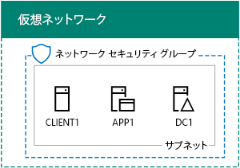
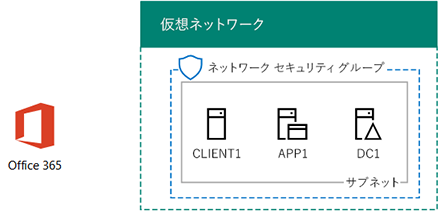

# <a name="office-365-devtest-environment"></a>Office 365 開発/テスト環境

 **の概要:**評価や開発/テスト用の Office 365 の試用版サブスクリプションを作成するのにには、このテスト ラボ ガイド 』 を使用します。
  
Office 365 試用版サブスクリプションを使用できます。また、アプリケーションの Office 365 開発/テスト環境を作成したり、Office 365 の機能をデモンストレーションすることができます。次の 2 つのバージョンがあります。
  
- ライトウェイトの Office 365 開発/テスト環境は、メイン コンピューターからアクセスする Office 365 試用版サブスクリプションで構成されています。
    
    機能を簡単にデモンストレーションする場合に、このような環境を使用します。軽量の Office 365 の開発/テスト環境では、この資料の 2 および 3 のフェーズのみを実行します。
    
- シミュレーションのエンタープライズ Office 365 開発/テスト環境は、Office 365 試用版サブスクリプションと、Microsoft Azure インフラストラクチャ サービスでホストされる、インターネットに接続されたシンプルな組織のイントラネットで構成されています。この構成は Microsoft クラウドで完全に構築できます。
    
    この環境は、インターネットに接続された一般的な組織ネットワークと類似した環境で機能またはアプリをデモンストレーションする場合や、この種類の環境を必要とする機能に使用してください。シミュレーションのエンタープライズ Office 365 開発/テスト環境の場合は、この記事のフェーズ 1、2、3 を完了します。
    
> [!NOTE]
> この記事を印刷しておき、30 日間の Office 365 試用版サブスクリプションの終了後にこの環境で必要になる特定の値を記録しておくことをお勧めします。試用版サブスクリプションは、追加で 30 日間まで簡単に延長できます。永続的な開発/テスト環境では、少数のライセンスを使用して新しい有料サブスクリプションを作成します。 
  

  
> [!TIP]
> 
            [ここ](http://aka.ms/catlgstack)をクリックして、One Microsoft Cloud のテスト ラボ ガイド スタックに含まれるすべての記事のビジュアル マップをご確認ください。
  
## <a name="phase-1-create-the-base-configuration-in-azure"></a>フェーズ 1:Azure に基本構成を作成する

[開発/テスト環境の基本構成](base-configuration-dev-test-environment.md)の指示に従います。
  
Azure サブスクリプションを必要があります。この構成では、 [Azure の無料試用版](https://azure.microsoft.com/pricing/free-trial/)を使用できます。MSDN または Visual Studio のサブスクリプションがある場合は、 [Visual Studio のサブスクライバーに対して毎月 Azure のクレジット](https://azure.microsoft.com/pricing/member-offers/msdn-benefits-details/)を参照してください。
  
最終的な構成は、次のようになります。
  

  
この構成は、Azure 仮想ネットワーク上の仮想マシン DC1、APP1、および CLIENT1 で成立します。
  
## <a name="phase-2-create-an-office-365-trial-subscription"></a>フェーズ 2:Office 365 試用版サブスクリプションを作成する

Office 365 E5 試用版サブスクリプションを開始するには、最初に、架空の会社名と新しい Microsoft アカウントが必要になります。
  
1. 必須ではありませんが、会社名は、Microsoft のコンテンツのサンプルで使用されている架空の会社である contoso 社の会社名のバリエーションを使用するをお勧めします。ここでは、架空の会社名を記録します。
    
2. 新しい Microsoft アカウントにサインアップするには[https://outlook.com](https://outlook.com)と、新しい電子メール アカウントとアドレスを持つアカウントを作成します。Office 365 にサインアップするには、このアカウントを使用します。
    
  - ここで新しいアカウントの姓と名を記録します。
    
  - 新しい電子メール アカウントのアドレスは、ここの記録: @outlook.com
    
### <a name="sign-up-for-an-office-365-e5-trial-subscription"></a>Office 365 E5 試用版サブスクリプションにサインアップする

1. 軽量の Office 365 の開発/テスト環境では、お使いのコンピューター上のインターネット ブラウザーを開くし、には、 [https://aka.ms/e5trial](https://aka.ms/e5trial)。 
    
    シミュレートされたエンタープライズ Office 365 の開発/テスト環境。
    
  - [Azure ポータル](https://portal.azure.com)では、CORP と CLIENT1 を接続\\User1 のアカウントです。
    
  - 管理者レベルの Windows PowerShell コマンド プロンプトを起動して、次に示すコマンドを実行します。
    
  ```
  Set-ItemProperty -Path "HKLM:\\SOFTWARE\\Microsoft\\Active Setup\\Installed Components\\{A509B1A7-37EF-4b3f-8CFC-4F3A74704073}" -Name "IsInstalled" -Value 0
Set-ItemProperty -Path "HKLM:\\SOFTWARE\\Microsoft\\Active Setup\\Installed Components\\{A509B1A8-37EF-4b3f-8CFC-4F3A74704073}" -Name "IsInstalled" -Value 0
Stop-Process -Name Explorer -Force
  ```

    > [!TIP]
    > クリックして[ここでは](https://gallery.technet.microsoft.com/PowerShell-commands-for-fe3d7a34)この資料ですべての PowerShell コマンドを含むテキスト ファイルを取得します。
  
  - 開始画面から、[ **Internet Explorer** ] をクリックし、 [https://aka.ms/e5trial](https://aka.ms/e5trial)。
    
2. [**ようこそ、認識するようにするを取得**] ページで次のコマンドを指定します。
    
  - 所在地
    
  - 新しい Microsoft アカウントの姓名
    
  - 新しい電子メール アドレス
    
  - 勤務先電話番号
    
  - 架空の会社名
    
  - 組織の規模に [250-999 人]
    
3. **1 つ以上のステップ**をクリックします。
    
4. **自分のユーザー ID の作成**] ページで、入力、次のように新しいメール アドレス、架空の会社の後にユーザー名、@ 記号 (名にスペースをすべて削除])、し、この新しい Office 365 のアカウント、パスワード (2 回)。
    
    入力したパスワードを安全な場所に記録してください。
    
    と**組織名**をここに参照される、架空の会社名を記録します。
    
5. **自分のアカウントを作成する**] をクリックします。
    
6. **で次のことを証明します。です。じゃない。A. ロボット**。ページで、テキストに対応した携帯電話の電話番号を入力し、**私のテキスト**] をクリックします。
    
7. 受信したテキスト メッセージを検証コードを入力し、[**次へ**] をクリックします。
    
8. サインイン ページの URL は、ここ (選択およびコピー) を記録します。
    
9. ユーザー id は、ここ (選択およびコピー): . onmicrosoft.com
    
    この値は、 **Office 365 の管理者がグローバルの名前**と呼びます。
    
10. **移動する準備が整ったら**が表示されたらをクリックします。
    
11. 次のページでは、Office 365 には、上の設定が完了すると、すべてのタイルが使用可能になるまで待機します。
    
Office 365 ポータルのメイン ページが表示されます。このページから、Office Online のサービスと Office 365 管理センターにアクセスできます。
  
シミュレーションのエンタープライズ Office 365 開発/テスト環境の、結果として得られる構成を次に示します。
  

  
この構成は、次の内容で成立します。  
  
- Azure 仮想ネットワークのサブネット上の仮想マシン DC1、APP1、および CLIENT1。
    
- Office 365 E5 試用版サブスクリプション。
    
## <a name="phase-3-configure-your-office-365-trial-subscription"></a>フェーズ 3: Office 365 試用版サブスクリプションを構成する

このフェーズでは、追加のユーザーと SharePoint Online のチーム サイトで Office 365 のサブスクリプションを構成します。
  
まず、4 人分の新しいユーザーを追加して、E5 ライセンスを割り当てます。
  
PowerShell モジュールをインストールしてから新しい Office 365 サービスに接続には、 [Office 365 の PowerShell への接続](https://technet.microsoft.com/library/dn975125.aspx)の手順を使用します。
  
- 自分のコンピューター (ライトウェイトの Office 365 開発/テスト環境の場合)。
    
- CLIENT1 仮想マシン (シミュレーションのエンタープライズ Office 365 開発/テスト環境の場合)。
    
 Windows PowerShell の資格情報の要求] ダイアログ ボックスで、Office 365 グローバル管理者名を入力します (例: jdoe@contosotoycompany.onmicrosoft.com) とパスワードです。
  
組織名 (例: contosotoycompany)、所属地域に該当する 2 文字の国別コードを入力して、Windows PowerShell 用 Windows Azure Active Directory モジュールのプロンプトから次のコマンドを実行します。
  
```
$orgName="<organization name>"
$loc="<two-character country code, such as US>"
$licAssignment= $orgName + ":ENTERPRISEPREMIUM"
$userName= "user2@" + $orgName + ".onmicrosoft.com"
New-MsolUser -DisplayName "User 2" -FirstName User -LastName 2 -UserPrincipalName $userName -UsageLocation $loc -LicenseAssignment $licAssignment
```

**新しい MsolUser**コマンドの表示から、生成されたアカウントのパスワード、ユーザー 2 に注意してくださいし、安全な場所に記録します。
  
次に示すコマンドを Windows PowerShell 用 Microsoft Azure Active Directory モジュールのプロンプトから実行します。
  
```
$userName= "user3@" + $orgName + ".onmicrosoft.com"
New-MsolUser -DisplayName "User 3" -FirstName User -LastName 3 -UserPrincipalName $userName -UsageLocation $loc -LicenseAssignment $licAssignment
```

**新規 MsolUser**コマンドの表示、3 のユーザー アカウントのパスワードが生成されたパスワードを確認し、安全な場所に記録します。
  
次に示すコマンドを Windows PowerShell 用 Microsoft Azure Active Directory モジュールのプロンプトから実行します。
  
```
$userName= "user4@" + $orgName + ".onmicrosoft.com"
New-MsolUser -DisplayName "User 4" -FirstName User -LastName 4 -UserPrincipalName $userName -UsageLocation $loc -LicenseAssignment $licAssignment
```

**新しい MsolUser**コマンドの表示、4 のユーザー アカウントのパスワードが生成されたパスワードを確認し、安全な場所に記録します。
  
次に示すコマンドを Windows PowerShell 用 Microsoft Azure Active Directory モジュールのプロンプトから実行します。
  
```
$userName= "user5@" + $orgName + ".onmicrosoft.com"
New-MsolUser -DisplayName "User 5" -FirstName User -LastName 5 -UserPrincipalName $userName -UsageLocation $loc -LicenseAssignment $licAssignment
```

**新規 MsolUser**コマンドの表示、5 のユーザー アカウントのパスワードが生成されたパスワードを確認し、安全な場所に記録します。
  
次に、Sales (販売)、Production (生産)、および Support (サポート) の各部門ために、新しい SharePoint Online チーム サイトを 3 つ作成します。
  
### <a name="create-three-new-sharepoint-online-team-sites"></a>新しい SharePoint Online チーム サイトを 3 つ作成する

1. [SharePoint のオンライン管理シェル](https://go.microsoft.com/fwlink/p/?LinkId=255251)をインストール (、x64 バージョン)。
    
2. [**スタート**] ボタン、 **sharepoint**を入力し、 **SharePoint のオンライン管理シェル**] をクリックします。
    
3. 組織名 (example: contosotoycompany) を入力し、SharePoint Online Management Shell プロンプトから次に示すコマンドを実行して、SharePoint Online サービスに接続します。
```
$orgName="<organization name>"
$spURL="https://" + $orgName + "-admin.sharepoint.com"
Connect-SPOService -Url $spURL
```

4. **Microsoft SharePoint のオンライン管理シェル**] ダイアログ ボックスで Office 365 のグローバル管理者名を入力します (例: jdoe@contosotoycompany.onmicrosoft.com) とパスワード、し、[**サインイン**] をクリックします。
    
5. 3 つの新しいチーム サイトを作成するのには、Office 365 のグローバル管理者名を入力 (販売、生産、およびサポート)、および SharePoint のオンライン管理シェル プロンプトから以下のコマンドを実行します。
    
  ```
  $owner = "<global administrator account name>"
$siteURL = "https://" + $orgName + ".sharepoint.com/sites/sales"
New-SPOSite -Url $siteURL -Owner $owner -StorageQuota 1000 -Title "Sales site collection" -Template "STS#0"
$siteURL = "https://" + $orgName + ".sharepoint.com/sites/production"
New-SPOSite -Url $siteURL -Owner $owner -StorageQuota 1000 -Title "Production site collection" -Template "STS#0"
$siteURL = "https://" + $orgName + ".sharepoint.com/sites/support"
New-SPOSite -Url $siteURL -Owner $owner -StorageQuota 1000 -Title "Support site collection" -Template "STS#0"
  ```

6. このコマンドを実行して、これら 3 つの新しいサイトの URL を一覧表示します。
    
  ```
  Get-SPOSite | Where URL -like "*/sites/*" | Sort URL | Select URL
  ```

7. Internet Explorer で、Production サイトの URL を入力して、Production 部門の既定の SharePoint Online チーム サイトを確認します。
    
## <a name="record-values-for-future-reference"></a>将来の参考のために値を記録する

この環境で作業する場合や、この環境に追加のテスト ラボ ガイドラインを展開するために、次に示す値を記録しておきます。
  
- Office 365 のグローバル管理者名: . onmicrosoft.com (から第 2 段階の手順 9.)
    
    このアカウントのパスワードも安全な場所に記録してください。
    
- 試用版サブスクリプション組織名:  (からのステップ 4 フェーズ 2)
    
- User 2、User 3、User 4、および User 5 のアカウントを一覧表示するには、次に示すコマンドを Windows PowerShell 用 Microsoft Azure Active Directory モジュールのプロンプトから実行します。
    
  ```
  Get-MSolUser | Sort UserPrincipalName | Select UserPrincipalName
  ```

    ここにアカウント名を記録してください:
    
  - 2 のユーザー アカウント名: @ user2. onmicrosoft.com
    
  - 3 のユーザー アカウント名: @ user3. onmicrosoft.com
    
  - 4 のユーザー アカウント名: @ user4. onmicrosoft.com
    
  - 5 のユーザー アカウント名: @ user5. onmicrosoft.com
    
    これらのアカウントのパスワードも安全な場所に記録してください。
    
- Sales、Production、および Support チーム サイトの URL を一覧表示するには、次に示すコマンドを SharePoint Online Management Shell プロンプトから実行します。
    
  ```
  Get-SPOSite | Where URL -like "*/sites/*" | Sort URL | Select URL
  ```

  - 本番サイトの URL: https://.sharepoint.com/sites/production
    
  - 販売サイトの URL: https://.sharepoint.com/sites/sales
    
  - サポート サイトの URL: https://.sharepoint.com/sites/support
    
## <a name="next-steps"></a>次の手順

Office 365 の開発/テスト環境を構築するのに、これらの追加記事を使用します。
  
- [Office 365 の開発/テスト環境のディレクトリの同期](dirsync-for-your-office-365-dev-test-environment.md)
    
- [Office 365 開発/テスト環境用の多要素認証](multi-factor-authentication-for-your-office-365-dev-test-environment.md)
    
- [Office 365 開発/テスト環境のフェデレーション ID](federated-identity-for-your-office-365-dev-test-environment.md)
    
- [Office 365 開発/テスト環境の Cloud App Security](cloud-app-security-for-your-office-365-dev-test-environment.md)
    
- [Office 365 開発/テスト環境の Advanced Threat Protection](advanced-threat-protection-for-your-office-365-dev-test-environment.md)
    
- [Office 365 の開発/テスト環境のアドバンスト eDiscovery](advanced-ediscovery-for-your-office-365-dev-test-environment.md)
    
- [Office 365 の開発/テスト環境での機密性の高いファイルの保護](sensitive-file-protection-in-the-office-365-dev-test-environment.md)
    
- [Office 365 開発/テスト環境での分離した SharePoint Online チーム サイト](isolated-sharepoint-online-team-site-dev-test-environment.md)
    
- [Office 365 開発/テスト環境でのデータ分類とラベルの作成](data-classification-and-labeling-in-the-office-365-dev-test-environment.md)
    
他の Microsoft クラウド製品を含むように、Office 365 の開発/テスト環境を拡張します。
  
- [Microsoft 365 Enterprise 開発/テスト環境](the-microsoft-365-enterprise-dev-test-environment.md)
    
- [Office 365 と Dynamics 365 の開発/テスト環境](office-365-and-dynamics-365-dev-test-environment.md)
    
## <a name="see-also"></a>関連項目

- [クラウド導入のテスト ラボ ガイド (TLG)](cloud-adoption-test-lab-guides-tlgs.md)
  
- [Office 365 と Dynamics 365 の開発/テスト環境](office-365-and-dynamics-365-dev-test-environment.md)
  
 - [クラウド導入およびハイブリッド ソリューション](cloud-adoption-and-hybrid-solutions.md)


