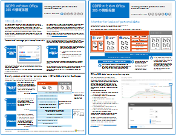

# GDPR の office 365 の情報の保護Office 365 Information Protection for GDPR

 **の概要:**このソリューションでは、Office 365 サービスに格納されている機密データを保護する方法を示します。**Summary:** This solution demonstrates how to protect sensitive data that is stored in Office 365 services.
  
このソリューションには、検出、分類、保護、および個人データを監視するための規範的な推奨事項が含まれています。このソリューションでは、例として、全般的なデータ保護規制 (GDPR) を使用しますが、他の多くの規制へのコンプライアンスを達成するために同じプロセスを適用することができます。This solution includes prescriptive recommendations for discovering, classifying, protecting, and monitoring personal data. This solution uses General Data Protection Regulation (GDPR) as an example, but you can apply the same process to achieve compliance with many other regulations.

  
[PDF](http://download.microsoft.com/download/E/C/D/ECD5A339-EF10-4420-B3A9-99098884D716/MSFT_Cloud_architecture_information protection for GDPR.pdf)  | [Visio](http://download.microsoft.com/download/E/C/D/ECD5A339-EF10-4420-B3A9-99098884D716/MSFT_Cloud_architecture_information protection for GDPR.vsdx)[PDF](http://download.microsoft.com/download/E/C/D/ECD5A339-EF10-4420-B3A9-99098884D716/MSFT_Cloud_architecture_information protection for GDPR.pdf)  | [Visio](http://download.microsoft.com/download/E/C/D/ECD5A339-EF10-4420-B3A9-99098884D716/MSFT_Cloud_architecture_information protection for GDPR.vsdx)
  

## See AlsoSee Also

[セキュリティ ソリューションSecurity solutions](security-solutions.md)
  
[選挙運動、非営利組織、およびその他のアジャイル組織のための Microsoft Security ガイダンスMicrosoft Security Guidance for Political Campaigns, Nonprofits, and Other Agile Organizations](microsoft-security-guidance-for-political-campaigns-nonprofits-and-other-agile-o.md)

