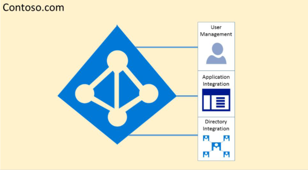

# Azure Active Directory での Microsoft 365 の分離とアクセス制御Microsoft 365 Isolation and Access Control in Azure Active Directory

Azure Active Directory (Azure AD) は、論理的なデータの分離を通じて、高度にセキュリティで保護された方法で複数のテナントをホストするように設計されています。Azure Active Directory (Azure AD) was designed to host multiple tenants in a highly secure way through logical data isolation. Azure AD へのアクセスは、承認層でゲートされます。Access to Azure AD is gated by an authorization layer. Azure AD は、テナントコンテナーをセキュリティ境界として使用することにより、ユーザーのコンテンツを保護し、共同テナントがコンテンツにアクセスしたり侵害したりできないようにします。Azure AD isolates customers using tenant containers as security boundaries to safeguard a customer's content so that the content cannot be accessed or compromised by co-tenants. Azure AD の承認レイヤーによって、次の3つのチェックが実行されます。Three checks are performed by Azure AD's authorization layer:

- プリンシパルは Azure AD テナントへのアクセスを有効にしていますか?Is the principal enabled for access to Azure AD tenant?
- プリンシパルはこのテナント内のデータへのアクセスを有効にしますか?Is the principal enabled for access to data in this tenant?
- 要求されたデータアクセスの種類に対して、このテナントのプリンシパルの役割は承認されていますか。Is the principal's role in this tenant authorized for the type of data access requested?

アプリケーション、ユーザー、サーバー、またはサービスは、適切な認証とトークンまたは証明書を使用せずに、Azure AD にアクセスできません。No application, user, server, or service can access Azure AD without the proper authentication and token or certificate. 適切な資格情報を伴わない場合、要求は拒否されます。Requests are rejected if they are not accompanied by proper credentials.

実際には、Azure AD は独自の保護されたコンテナー内の各テナントをホストし、テナントが所有し管理するだけのコンテナーに対するポリシーとアクセス許可を持っています。Effectively, Azure AD hosts each tenant in its own protected container, with policies and permissions to and within the container solely owned and managed by the tenant.
 

テナントコンテナーの概念は、ポータルから永続的な記憶域まで、すべての層のディレクトリサービスで深く ingrained されています。The concept of tenant containers is deeply ingrained in the directory service at all layers, from portals all the way to persistent storage. 複数の Azure AD テナントメタデータが同じ物理ディスクに格納されている場合でも、ディレクトリサービスによって定義されたコンテナー以外のコンテナー間には、テナント管理者によって定義された関係はありません。Even when multiple Azure AD tenant metadata is stored on the same physical disk, there is no relationship between the containers other than what is defined by the directory service, which in turn is dictated by the tenant administrator. 最初に承認層を経由せずに、要求しているアプリケーションまたはサービスから Azure AD ストレージへの直接接続を行うことはできません。There can be no direct connections to Azure AD storage from any requesting application or service without first going through the authorization layer.

次の例では、Contoso と Fabrikam の両方に独立した専用のコンテナーがありますが、それらのコンテナーはサーバーやストレージなどの同じ基礎インフラストラクチャの一部を共有していますが、それらは互いに分離され、相互に分離されており、承認とアクセス制御のレイヤーで区切られています。In the example below, Contoso and Fabrikam both have separate, dedicated containers, and even though those containers may share some of the same underlying infrastructure, such as servers and storage, they remain separate and isolated from each other, and gated by layers of authorization and access control.
 

さらに、Azure AD 内から実行できるアプリケーションコンポーネントはなく、1つのテナントが別のテナントの整合性を強制的に侵害したり、別のテナントの暗号化キーをアクセスしたり、サーバーから生データを読み取ったりすることはできません。In addition, there are no application components that can execute from within Azure AD, and it is not possible for one tenant to forcibly breach the integrity of another tenant, access encryption keys of another tenant, or read raw data from the server.

既定では、Azure AD は他のテナント内の id によって発行されたすべての操作を許可しません。By default, Azure AD disallows all operations issued by identities in other tenants. 各テナントは、クレームベースのアクセス制御によって Azure AD 内で論理的に分離されています。Each tenant is logically isolated within Azure AD through claims-based access controls. ディレクトリデータの読み取りおよび書き込みはテナントコンテナーを対象としており、内部アブストラクションレイヤーおよび役割ベースのアクセス制御 (RBAC) 層でゲートされます。これにより、テナントがセキュリティ境界として適用されます。Reads and writes of directory data are scoped to tenant containers, and gated by an internal abstraction layer and a role-based access control (RBAC) layer, which together enforce the tenant as the security boundary. すべてのディレクトリデータアクセス要求は、これらのレイヤーによって処理され、Microsoft 365 のすべてのアクセス要求は上記のロジックによって許可されます。Every directory data access request is processed by these layers and every access request in Microsoft 365 is policed by the logic above.

Azure AD には、北アメリカ、米国政府機関、欧州連合、ドイツ、およびワールドワイドパーティションがあります。Azure AD has North America, U.S. Government, European Union, Germany, and World Wide partitions. テナントは単一のパーティション内に存在し、パーティションに複数のテナントを含めることができます。A tenant exists in a single partition, and partitions can contain multiple tenants. パーティション情報はユーザーから抽象化されています。Partition information is abstracted away from users. 特定のパーティション (その中のすべてのテナントを含む) は、複数のデータセンターにレプリケートされます。A given partition (including all the tenants within it) is replicated to multiple datacenters. テナントのパーティションは、テナントのプロパティ (たとえば、国コード) に基づいて選択されます。The partition for a tenant is chosen based on properties of the tenant (e.g., the country code). 各パーティション内の機密情報は、専用キーを使用して暗号化されます。Secrets and other sensitive information in each partition is encrypted with a dedicated key. キーは、新しいパーティションが作成されるときに自動的に生成されます。The keys are generated automatically when a new partition is created.

Azure AD システムの機能は、各ユーザーセッションに対する一意のインスタンスです。Azure AD system functionalities are a unique instance to each user session. さらに、Azure AD では、暗号化テクノロジを使用して、共有されたシステムリソースをネットワークレベルで分離し、不正な情報の転送を防止します。In addition, Azure AD uses encryption technologies to provide isolation of shared system resources at the network level to prevent unauthorized and unintended transfer of information.
