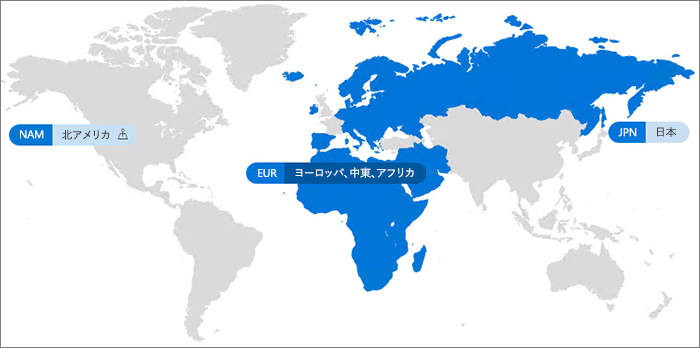

# Office 365 Multi-Geo

Office 365 Multi-Geo を使用すれば、組織はその組織の Office 365 のプレゼンスを、その既存のテナント内の複数の地域または国に対して展開することができます。 お客様の Microsoft アカウント チームと連絡を取って、Office 365 Multi-Geo を入手するためにお客様の多国籍の企業をサインアップしてください。
  
Office 365 Multi-Geo を使用すれば、データの常駐に関連する要件を満たすと同時に、モダンな生産性向上エクスペリエンスのグローバル展開を従業員が利用できるようにするために、選択した地理的な場所に保存 (休眠) データをプロビジョニングして蓄えることができます。

#### ビデオ: Office 365 Multi-Geo の紹介

> [!VIDEO https://www.microsoft.com/videoplayer/embed/RE1Yk6B?autoplay=false]

Multi-Geo 環境では、Office 365 テナントは中央の場所 (Office 365 サブスクリプションが最初にプロビジョニングされた場所) と 1 つ以上のサテライトの場所で構成されています。 複数地域テナント内では、地理的な場所、グループ、およびユーザー情報に関する情報が、Azure Active Directory (AAD) 内でマスター管理されます。 テナント情報が集中的にマスター管理され、個々の地理的な場所に同期されるので、その企業のすべてのユーザーが関わる共有とエクスペリエンスにグローバルな情報が含まれています。

Office 365 Multi-Geo は、パフォーマンスの最適化を主要目的とした設計ではなく、データの常駐に関する要件を満たすように設計されていることに注意してください。 Office 365 のパフォーマンスを最適化する方法については、「[Office 365 のネットワーク計画とパフォーマンス チューニング](https://support.office.com/article/e5f1228c-da3c-4654-bf16-d163daee8848)」を参照するか、サポート グループにお問い合わせください。

## 用語

Office 365 Multi-Geo の説明に使用される重要な用語を以下に示します。

- **中央の場所**のテナントが最初にプロビジョニングされた地域の場所です。
- **地域管理者** - 指定された 1 つ以上のサテライトの場所を管理できる管理者。
- **地域コード** - 特定の地域の場所を表す 3 文字のコード。
- **地域の場所** - Exchange メールボックス、OneDrive サイト、SharePoint サイトなど、データをホストする複数地域テナントで使用できる地理的な場所。
- **優先されるデータの場所 (PDL)** - 管理者が設定したユーザー プロパティであり、ユーザーの Exchange メールボックスと OneDrive がプロビジョニングされる地域の場所を示します。 PDL では、ユーザーによって作成された SharePoint サイトのプロビジョニング場所も決定されます。
- **サテライトの場所** - 地理機能に対応している Office 365 ワークロード (SharePoint、OneDrive、および Exchange) が複数地域テナントで有効になっている地域の場所。
- **テナント** - Office 365 における組織の表現。通常、1 つ以上のドメインが関連付けられています (例: contoso.com)。

## Office 365 Multi-Geo の利用可能地域

現在、Office 365 Multi-Geo は次の地域と国で提供されています。

[!INCLUDE [Office 365 Multi-Geo locations](includes/office-365-multi-geo-locations.md)]

## はじめに

以下の手順に従って複数地域を開始しましょう。

1. アカウント チームと協力して、_複数地域機能をOffice 365 の_サービス プランに追加します。 必要なライセンス数の追加方法を説明いたします。 Multi-Geo 機能は、500 以上の Office 365 サブスクリプションを使用しているお客様が利用できます。

   Office 365 Multi-Geo の使用を開始するには、事前に Microsoft が複数地域サポート用に Exchange Online テナントを構成する必要があります。 この 1 回限りの構成プロセスは、*Office 365 の複数地域機能*サービス プランを注文し、ライセンスがテナントに表示された後に開始されます。 Multi-Geo ライセンスが適用されると、[Office 365 メッセージ センター](https://support.office.com/article/38FB3333-BFCC-4340-A37B-DEDA509C2093)に通知が送信され、その後、Office 365 Multi-Geo 機能の設定と使用を開始できます。

2. 「[OneDrive for Business 複数地域の計画](plan-for-multi-geo.md)」を参照します。

3. [複数地域環境の管理](administering-a-multi-geo-environment.md)および[環境でのユーザー エクスペリエンス](multi-geo-user-experience.md)について確認します。

4. Office 365 Multi-Geo のセットアップ準備ができたら、[複数地域用のテナントを構成します](multi-geo-tenant-configuration.md)。

5. [検索を設定します](configure-search-for-multi-geo.md)。

## 関連項目

[Exchange OnlineとOneDriveでの複数地域機能](https://Aka.ms/GoMultiGeo)

[OneDrive および SharePoint Online の複数地域機能](https://docs.microsoft.com/office365/enterprise/multi-geo-capabilities-in-onedrive-and-sharepoint-online-in-office-365)

[Exchange Online の複数地域機能](https://docs.microsoft.com/office365/enterprise/multi-geo-capabilities-in-exchange-online)
