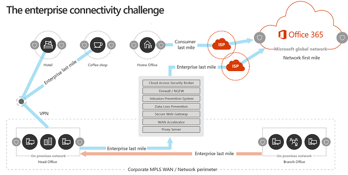

# Microsoft 365 ネットワーク接続の原則

*この記事は、Microsoft 365 Enterprise と Office 365 Enterprise の両方に適用されます。*

Microsoft 365 ネットワーク接続の計画を開始する前に、Microsoft 365 トラフィックを安全に管理し、最高のパフォーマンスを得るための接続の原則について理解することが重要です。 この記事は、Microsoft 365 ネットワーク接続を安全に最適化するための最新のガイダンスを理解するのに役立ちます。
  
従来のエンタープライズネットワークは主に、強力な境界セキュリティを使用して、企業の運用データセンターでホストされているアプリケーションおよびデータへのアクセスをユーザーに提供することを意図して設計 従来のモデルでは、ユーザーが企業ネットワーク境界内から、ブランチオフィスからの WAN リンク、または VPN 接続を介してリモートでアプリケーションとデータにアクセスすることを前提としています。
  
Microsoft 365 などの SaaS アプリケーションの導入により、サービスとデータの組み合わせがネットワーク境界の外に移動します。 最適化されていない場合、ユーザーと SaaS アプリケーション間のトラフィックは、パケット検査、ネットワークヘアピン、地理的に離れたエンドポイントへの不用意な接続による遅延の影響を受けます。 主要な最適化ガイドラインを理解し、実装することによって、Microsoft 365 の最高のパフォーマンスと信頼性を確保できます。
  
この記事では、次の内容について説明します。
  
- [Microsoft 365 のアーキテクチャ](office-365-network-connectivity-principles.md#BKMK_Architecture)は、クラウドへのお客様の接続に適用されます。
- [Microsoft 365 の接続の原則](office-365-network-connectivity-principles.md#BKMK_Principles)と、ネットワークトラフィックおよびエンドユーザーの作業を最適化するための戦略を更新しました。
- [Office 365 エンドポイント web サービス](office-365-network-connectivity-principles.md#BKMK_WebSvc)。これにより、ネットワーク管理者はネットワークの最適化で使用するために、構造化されたエンドポイントのリストを使用できるようになります。
- [新しい Office 365 エンドポイントのカテゴリ](office-365-network-connectivity-principles.md#BKMK_Categories)と最適化のガイダンス
- [ネットワーク境界セキュリティとエンドポイントセキュリティの比較](office-365-network-connectivity-principles.md#BKMK_SecurityComparison)
- Microsoft 365 トラフィックの[増分最適化](office-365-network-connectivity-principles.md#BKMK_IncOpt)オプション
- Microsoft [365 接続テスト](https://aka.ms/netonboard)(microsoft 365 への基本的な接続をテストするための新しいツール)

## Microsoft 365 アーキテクチャ

Microsoft 365 は、Exchange Online、SharePoint Online、Skype for Business Online、Microsoft Teams、Exchange Online Protection、ブラウザー内の Office など、さまざまなマイクロサービスやアプリケーションを使用して生産性とコラボレーションのシナリオを提供する、分散化されたソフトウェアとしてのサービス (SaaS) クラウドです。 特定の Microsoft 365 アプリケーションは、お客様のネットワークとクラウドへの接続に適用される独自の機能を持つことができますが、すべてのアプリケーションが主要なプリンシパル、目標、およびアーキテクチャパターンを共有している場合があります。 接続用のこれらのプリンシパルとアーキテクチャパターンは、他の多くの SaaS クラウドで一般的に使用されており、Microsoft Azure などのプラットフォームとしてのプラットフォームとしてのプラットフォームとしてのプラットフォームとしてのプラットフォームとしての一般的な展開モデルとは大きく異なります。
  
Microsoft 365 の最も重要なアーキテクチャ機能の1つは、ユーザーが接続する方法において、完全にグローバルに分散されたサービスであるということです。 ターゲットの Microsoft 365 テナントの場所は、顧客データがクラウド内に格納されている場所の局所性を理解するうえで重要ですが、Microsoft 365 のユーザー環境では、データを含むディスクへの直接接続は関係ありません。 Microsoft 365 (パフォーマンス、信頼性、その他の重要な品質特性を含む) のユーザー環境には、世界中の何百という Microsoft の場所でスケールアウトされている、高度に分散されたサービスのフロントドア経由の接続が含まれます。 多くの場合、顧客のネットワークでは、ユーザーの要求を、中央の場所または地域の出口にある Microsoft 365 に接続するのではなく、最も近い Microsoft 365 サービスエントリポイントにルーティングできるようにすることによって、最高のユーザー環境が実現されます。
  
ほとんどのお客様にとって、Microsoft 365 ユーザーは複数の場所に分散されています。 最良の結果を得るには、このドキュメントで説明されている原則をスケールアウト (スケールアップではない) 視点から見て、microsoft 365 テナントの地理的な場所ではなく、Microsoft グローバルネットワーク内の最も近いプレゼンスポイントへの接続を最適化することを重視する必要があります。 基本的には、Microsoft 365 テナントのデータが特定の地理的な場所に格納されている場合でも、そのテナントの Microsoft 365 の状態は分散されたままで、テナントが持つすべてのエンドユーザーの場所に近接している (ネットワークの) 近さに表示されることを意味します。
  
## Microsoft 365 の接続の原則

Microsoft では、最適な Microsoft 365 の接続性とパフォーマンスを実現するために、以下の原則が推奨されています。 これらの Microsoft 365 connectivity 原則を使用して、トラフィックを管理し、Microsoft 365 への接続時に最高のパフォーマンスを得ることができます。
  
ネットワーク設計の主な目標は、ネットワークからのラウンドトリップ時間 (RTT) を microsoft のグローバルネットワークにまで減らし、microsoft のパブリックネットワークバックボーンである microsoft のパブリックネットワークバックボーンを使用して、世界中に散在する Microsoft のすべてのデータセンターを低遅延およびクラウドアプリケーションエントリポイントで相互接続することです。 Microsoft グローバルネットワークの詳細については、 [microsoft が高速で信頼性の高いグローバルネットワークを構築する方法](https://azure.microsoft.com/blog/how-microsoft-builds-its-fast-and-reliable-global-network/)を参照してください。
  

### Microsoft 365 トラフィックを識別して区別する

  
Microsoft 365 ネットワークトラフィックを特定することは、そのトラフィックをインターネットにバインドされた一般的なネットワークトラフィックと区別できるようにするための最初の手順です。 Microsoft 365 の接続を最適化するには、ネットワークルートの最適化、ファイアウォールルール、ブラウザープロキシ設定、特定のエンドポイントのネットワーク検査デバイスのバイパスなどのアプローチの組み合わせを実装します。
  
以前の Microsoft 365 の最適化ガイダンスでは、Microsoft 365 エンドポイントを2つのカテゴリに分けています。**必須**で、**省略可能**です。 新しい Microsoft 365 サービスと機能をサポートするためにエンドポイントが追加されたので、Microsoft 365 エンドポイントを次の3つのカテゴリに再編成しました。 **Optimize**、 **Allow** 、 **Default**。 各カテゴリのガイドラインは、カテゴリ内のすべてのエンドポイントに適用されるので、簡単に理解して実装することができます。
  
Microsoft 365 エンドポイントカテゴリおよび最適化方法の詳細については、「[新しい Office 365 エンドポイントカテゴリ](office-365-network-connectivity-principles.md#BKMK_Categories)」セクションを参照してください。
  
Microsoft は、すべての Microsoft 365 エンドポイントを web サービスとして公開し、このデータの最適な使用方法に関するガイダンスを提供するようになりました。 Microsoft 365 エンドポイントをフェッチして操作する方法の詳細については、記事「 [Office 365 の url と IP アドレスの範囲](https://support.office.com/article/office-365-urls-and-ip-address-ranges-8548a211-3fe7-47cb-abb1-355ea5aa88a2?ui=en-US&amp;rs=en-US&amp;ad=US)」を参照してください。
  

### ネットワーク接続のローカルの出口を提供する

  
ローカル DNS とインターネット出口は、接続の待機時間を短縮し、Microsoft 365 サービスへの最も近いポイントにユーザーの接続が確立されることを保証するための重要な重要事項です。 複雑なネットワークトポロジでは、ローカル DNS とローカルインターネット出口の両方を同時に実装することが重要です。 Microsoft 365 が最も近いエントリポイントへのクライアント接続をルーティングする方法の詳細については、記事「[クライアント接続](https://support.office.com/article/client-connectivity-4232abcf-4ae5-43aa-bfa1-9a078a99c78b)」を参照してください。
  
Microsoft 365 などのクラウドサービスが導入される前は、ネットワークアーキテクチャの設計要因としてエンドユーザーのインターネット接続が比較的簡単でした。 インターネットサービスと web サイトが世界中に分散されている場合、企業の出口ポイントと特定の宛先エンドポイントとの間の待機時間は、主に地理的距離の機能によって異なります。
  
従来のネットワークアーキテクチャでは、すべての送信インターネット接続が企業ネットワークを通過し、中央の場所から出てきます。 Microsoft のクラウド製品が普及するにつれて、遅延に敏感なクラウドサービスをサポートするために、分散されたインターネット接続ネットワークアーキテクチャが重要になってきました。 Microsoft グローバルネットワークは、分散サービスのフロントドアインフラストラクチャとの間で待機時間の要件に対応するように設計されています。これは、着信クラウドサービス接続を最も近いエントリポイントにルーティングするグローバルエントリポイントの動的なファブリックです。 これは、顧客とクラウドの間のルートを効果的に短縮することで、Microsoft クラウドユーザーの "last マイル" の長さを短縮することを目的としています。
  
エンタープライズ Wan は、多くの場合、インターネットに出始める前に、1つ以上のプロキシサーバーを介して、ネットワークトラフィックを中央の企業の本社に向けて調査するように設計されています。 次の図は、このようなネットワークトポロジを示しています。
  

  
Microsoft 365 は、世界中のフロントエンドサーバーが含まれる Microsoft グローバルネットワーク上で実行されるため、多くの場合、ユーザーの場所に近いフロントエンドサーバーがあります。 ローカルのインターネット出口を提供することにより、Microsoft 365 エンドポイントのローカル名前解決を提供するように内部 DNS サーバーを構成することで、Microsoft 365 宛てのネットワークトラフィックは、可能な限り、ユーザーに対して Microsoft 365 フロントエンドサーバーに接続できます。 次の図は、主要なオフィス、支店、およびリモートの場所から接続するユーザーが最も近い Microsoft 365 エントリポイントに最短のルートをたどることができるようにするネットワークトポロジの例を示しています。
  

  
この方法で Microsoft 365 エントリポイントへのネットワークパスを短くすると、Microsoft 365 の接続のパフォーマンスとエンドユーザーの作業環境が向上し、Microsoft 365 のパフォーマンスと信頼性に関する今後の変更によるネットワークアーキテクチャへの影響を軽減することもできます。
  
また、DNS 要求は、応答している DNS サーバーが遠くまたはビジーの場合に遅延を発生させることがあります。 ブランチの場所にローカル DNS サーバーをプロビジョニングし、DNS レコードを適切にキャッシュするように構成されていることを確認することによって、名前解決の待機時間を最小限に抑えることができます。
  
地域外の出口は Microsoft 365 に適していますが、最適な接続モデルは、これが企業ネットワーク上にあるか、自宅、ホテル、コーヒーショップ、空港などのリモートの場所にあるかに関係なく、ユーザーの場所で常にネットワークを出口することになります。 このローカル直接出口モデルは、次の図で示されています。
  

  
Microsoft 365 を採用している企業では、microsoft のグローバルネットワークの分散サービスフロントドアアーキテクチャを活用できます。これにより、microsoft 365 へのユーザー接続は、最も近い Microsoft グローバルネットワークエントリポイントへの最短ルートを使用することができます。 ローカル出口ネットワークアーキテクチャは、ユーザーの場所に関係なく、Microsoft 365 トラフィックを最も近い出口でルーティングできるようにします。
  
従来のモデルに比べて、ローカル出口アーキテクチャには次のような利点があります。
  
- ルートの長さを最適化することで、最適な Microsoft 365 のパフォーマンスを提供します。 エンドユーザーの接続は、分散サービスのフロントドアインフラストラクチャによって、最も近い Microsoft 365 エントリポイントに動的にルーティングされます。
- ローカル出口を許可することにより、企業ネットワークインフラストラクチャの負荷を軽減します。
- クライアントエンドポイントのセキュリティ機能とクラウドセキュリティ機能を活用して、両端で接続をセキュリティで保護します。

### ネットワーク ヘアピンを回避する

  
一般的な経験則として、ユーザーと最も近い Microsoft 365 エンドポイントとの間の最も短い直接的なルートは、最高のパフォーマンスを提供します。 ネットワークヘアピンは、特定の宛先にバインドされた WAN または VPN トラフィックが、最初に別の中間場所 (セキュリティスタック、クラウドアクセスブローカー、クラウドベースの web ゲートウェイなど) に送られ、遅延が発生し、地理的に離れたエンドポイントにリダイレクトされる可能性がある場合に発生します。 ネットワークヘアピンは、ルーティング/ピア非効率性または最適でない (リモート) DNS 参照によって引き起こされることもあります。
  
ローカル出口の場合でも、Microsoft 365 接続がネットワークヘアピンの対象にならないようにするには、そのユーザーの場所に対してインターネット出口を提供するために使用される ISP が、その場所に近い場所にある Microsoft グローバルネットワークとの直接ピアリング関係を持つかどうかを確認します。 また、インターネットにバインドされたトラフィックを処理するサードパーティ製のクラウドまたはクラウドベースのネットワークセキュリティベンダーを経由したプロキシやトンネリングではなく、直接、信頼された Microsoft 365 トラフィックを送信するように出口ルーティングを構成することもできます。 Microsoft 365 エンドポイントのローカル DNS 名解決により、直接ルーティングに加えて、ユーザー接続に最も近い Microsoft 365 エントリポイントが使用されるようになります。
  
Microsoft 365 のトラフィックに対してクラウドベースのネットワークまたはセキュリティサービスを使用する場合は、ヘアピン効果が評価され、Microsoft 365 パフォーマンスへの影響を認識していることを確認してください。 これは、ブランチオフィスの数と Microsoft グローバルネットワークのピアリングポイント、サービスプロバイダーと ISP と Microsoft とのネットワークピアリング関係の品質、およびサービスプロバイダーインフラストラクチャの backhauling によるパフォーマンスへの影響に関して、トラフィックが転送されるサービスプロバイダーの場所の数と場所を調べることによって実現できます。
  
Microsoft 365 のエントリポイントと、エンドユーザーとの近接性を持つ分散された場所が多数あるため、サードパーティのネットワークまたはセキュリティプロバイダーへの Microsoft 365 トラフィックのルーティングは、プロバイダーネットワークが最適な Microsoft 365 ピアリングに対して構成されていない場合は、Microsoft 365 接続に悪影響を及ぼす可能性があります。
  

### プロキシのバイパス、トラフィック検査デバイス、および重複したセキュリティテクノロジを評価する

  
企業のお客様は、特に Microsoft 365 にバインドされたトラフィックに対するネットワークセキュリティとリスクの軽減方法を確認し、microsoft 365 のセキュリティ機能を使用して、Microsoft 365 ネットワークトラフィックに対する侵入、パフォーマンスへの影響、およびコストのかかるネットワークセキュリティテクノロジへの依存を軽減する必要があります。
  
ほとんどのエンタープライズネットワークは、プロキシ、SSL 検査、パケット検査、データ損失防止システムなどのテクノロジを使用して、インターネットトラフィックにネットワークセキュリティを適用します。 これらのテクノロジは、一般的なインターネット要求に対して重要なリスクを軽減しますが、Microsoft 365 エンドポイントに適用された場合、パフォーマンス、スケーラビリティ、およびエンドユーザー環境の品質を大幅に軽減することができます。
  

#### Office 365 エンドポイント web サービス

Microsoft 365 管理者は、スクリプトまたは REST 呼び出しを使用して、Office 365 Endpoints web サービスからのエンドポイントの構造化された一覧を使用し、境界ファイアウォールやその他のネットワークデバイスの構成を更新できます。 これにより、Microsoft 365 に対してバインドされたトラフィックが識別され、適切かつ適切に処理され、一般的でよく知られていないインターネット web サイト用のネットワークトラフィックとは異なる方法で管理されます。 Office 365 Endpoints web サービスの使用方法の詳細については、記事「 [office 365 の url と IP アドレスの範囲](https://support.office.com/article/office-365-urls-and-ip-address-ranges-8548a211-3fe7-47cb-abb1-355ea5aa88a2?ui=en-US&amp;rs=en-US&amp;ad=US)」を参照してください。
  
#### PAC (プロキシの自動構成) スクリプト

Microsoft 365 管理者は、ユーザーのコンピューターに WPAD または GPO 経由で配信できる PAC (プロキシ自動構成) スクリプトを作成できます。 PAC スクリプトを使用して、WAN または VPN ユーザーからの Microsoft 365 要求のプロキシをバイパスすることができます。これにより、Microsoft 365 のトラフィックで、企業ネットワークを通過するのではなく、直接インターネット接続を使用できるようになります。
  
#### Microsoft 365 セキュリティ機能

Microsoft は、Microsoft 365 サーバーとそれが表すネットワークエンドポイントに関するデータセンターセキュリティ、運用セキュリティ、およびリスク軽減に関して透過的です。 Microsoft 365 の組み込みのセキュリティ機能は、データ損失防止、ウイルス対策、多要素認証、カスタマーロックボックス、Advanced Threat Protection、Microsoft 365 脅威インテリジェンス、Microsoft 365 セキュリティスコア、Exchange Online Protection、ネットワーク DDOS セキュリティなどのネットワークセキュリティリスクを軽減するために使用できます。
  
Microsoft データセンターとグローバルネットワークのセキュリティの詳細については、 [Microsoft セキュリティセンター](https://www.microsoft.com/trustcenter/security)を参照してください。
  
## 新しい Office 365 エンドポイントのカテゴリ

Office 365 エンドポイントは、さまざまなネットワークアドレスとサブネットのセットを表します。 エンドポイントは、Url、IP アドレス、IP 範囲、一部のエンドポイントが特定の TCP/UDP ポートで一覧表示されます。 Url には、 *account.office.net*のような FQDN、または office365.com のようなワイルドカード URL を使用でき* \* ます。*
  
> [!NOTE]
> ネットワーク内の Office 365 エンドポイントの場所は、Microsoft 365 テナントデータの場所と直接関連していません。 このため、お客様は、Microsoft 365 を分散サービスとして使用し、地理的条件に基づいて Office 365 エンドポイントへのネットワーク接続をブロックしないようにする必要があります。
  
Microsoft 365 のトラフィックを管理するための以前のガイダンスでは、エンドポイントは2つのカテゴリに分類されていました。**必須**で、**省略可能**です。 各カテゴリ内のエンドポイントは、サービスの重要度に応じて異なる最適化を必要とし、多くのお客様は、同じネットワーク最適化のアプリケーションを Office 365 の Url と IP アドレスの完全なリストに正当化することについての課題に直面しています。
  
新しいモデルでは、エンドポイントは3つのカテゴリ、**最適化**、許可、および**既定**の3つのカテゴリに分けられています。優先度に基づくピボットを**使用**して、最適なパフォーマンス向上と投資収益率を実現するために、ネットワーク最適化の取り組みに焦点を当てることができます。 エンドポイントは、ネットワーク品質、規模、および実装の容易さに対して有効なユーザー操作性の感度に基づいて、上記のカテゴリに統合されています。 推奨される最適化は、指定したカテゴリのすべてのエンドポイントに同じ方法で適用できます。
  
- すべての Office 365 サービスへの接続に必要なエンドポイントを**最適化**し、office 365 の帯域幅、接続、ボリュームのデータの75% を表します。 これらのエンドポイントは、ネットワークのパフォーマンス、待機時間、および可用性に最も敏感な Office 365 のシナリオを表しています。 すべてのエンドポイントは、Microsoft データセンターでホストされます。 このカテゴリのエンドポイントに対する変更率は、他の2つのカテゴリのエンドポイントよりもはるかに低くなることが予想されます。 このカテゴリには、重要な Url のセットが非常に小さくなります。また、Exchange Online、SharePoint Online、Skype for Business Online、Microsoft Teams などのコア Office 365 ワークロード専用に定義された一連の IP サブネットが含まれています。

    適切に定義された重要なエンドポイントの縮小リストにより、これらの宛先への高価値のネットワーク最適化を迅速かつ容易に計画して実装するのに役立ちます。

    *最適化*エンドポイントの例 *https://outlook.office365.com* としては、 *https://、 \<tenant\> sharepoint.com* 、および*https:// \<tenant\> -my.sharepoint.com*があります。

    最適化の方法は次のとおりです。

  - バイパスまたはホワイトリストトラフィックの傍受、SSL 復号化、詳細なパケット検査、およびコンテンツフィルターを実行するネットワークデバイスおよびサービス上のエンドポイントを*最適化*します。
  - 一般的なインターネットブラウジングでよく使用される、オンプレミスのプロキシデバイスおよびクラウドベースのプロキシサービスをバイパスします。
  - これらのエンドポイントの評価は、ネットワークインフラストラクチャと境界システムによって完全に信頼されているものとして優先度を設定します。
  - WAN backhauling の削減または排除を優先して、これらのエンドポイントに対して直接分散されたインターネットベースの出口を、可能な限りユーザーやブランチの場所に近づけることが容易になります。
  - 分割トンネリングを実装することにより、VPN ユーザーに対するこれらのクラウドエンドポイントへの直接接続を容易にします。
  - DNS 名解決によって返される IP アドレスが、これらのエンドポイントのルーティング出力パスと一致するようにします。
  - これらのエンドポイントに優先度を設定して、Microsoft グローバルネットワークの最も近いインターネットピアリングポイントに、直接の最小待機時間のルーティングを行います。

- **許可**エンドポイントは、特定の Office 365 サービスおよび機能への接続に必要ですが、ネットワークパフォーマンスや待機時間の影響は、*最適化*カテゴリのエンドポイントと同じではありません。 これらのエンドポイントの全体的なネットワークフットプリントは、帯域幅と接続数の観点からも大幅に小さくなります。 これらのエンドポイントは Office 365 専用で、Microsoft データセンターでホストされています。 これらは、Office 365 マイクロサービスの広範なセットとそれらの依存関係 (Url が ~ 100) を表しており、[*最適化*] カテゴリより高い速度で変更することが予想されます。 このカテゴリのすべてのエンドポイントが、定義された専用 IP サブネットに関連付けられるわけではありません。

    エンドポイント*許可*のネットワーク最適化によって Office 365 ユーザーの作業が向上することがありますが、ネットワークへの変更を最小限に抑えるために、最適化の範囲を狭くすることをお客様が選択する場合があります。

    *許可*エンドポイントの例には、 * \* protection.outlook.com*との https://が含まれています。 *https://accounts.accesscontrol.windows.net*

    最適化の方法は次のとおりです。

  - バイパスまたはホワイトリストトラフィックの傍受、SSL 復号、詳細なパケット検査、およびコンテンツフィルターを実行するネットワークデバイスおよびサービス上のエンドポイントを*許可*します。
  - これらのエンドポイントの評価は、ネットワークインフラストラクチャと境界システムによって完全に信頼されているものとして優先度を設定します。
  - WAN backhauling の削減または排除を優先して、これらのエンドポイントに対して直接分散されたインターネットベースの出口を、可能な限りユーザーやブランチの場所に近づけることが容易になります。
  - DNS 名解決によって返される IP アドレスが、これらのエンドポイントのルーティング出力パスと一致するようにします。
  - これらのエンドポイントに優先度を設定して、Microsoft グローバルネットワークの最も近いインターネットピアリングポイントに、直接の最小待機時間のルーティングを行います。

- **既定**のエンドポイントは、Office 365 サービスと、最適化を必要としない依存関係を表します。これは、通常のインターネットバインドトラフィックとしてお客様のネットワークで扱うことができます。 このカテゴリの一部のエンドポイントは、Microsoft データセンターでホストされていない場合があることに注意してください。 例 *https://odc.officeapps.live.com* を示し *https://appexsin.stb.s-msn.com* ます。

Office 365 のネットワーク最適化手法の詳細については、記事「 [office 365 エンドポイントの管理](https://support.office.com/article/managing-office-365-endpoints-99cab9d4-ef59-4207-9f2b-3728eb46bf9a#ID0EAEAAA=0._Overview)」を参照してください。
  
## ネットワーク境界セキュリティとエンドポイントセキュリティの比較

従来のネットワークセキュリティの目的は、侵入や悪意のある攻略から企業ネットワークの境界を強化することです。 組織が Microsoft 365 を採用する際には、一部のネットワークサービスとデータが一部または完全にクラウドに移行されます。 ネットワークアーキテクチャには基本的な変更がありますが、このプロセスでは、新しい要因を考慮してネットワークセキュリティを再評価する必要があります。
  
- クラウドサービスが採用されるにつれて、ネットワークサービスとデータは社内データセンターとクラウドの間で分散され、境界セキュリティはそれ自体では十分ではなくなりました。
- リモートユーザーは、オンプレミスのデータセンターとクラウドの両方の企業リソースに、住宅、ホテル、コーヒーショップなどの非制御された場所から接続します。
- 用途に特化したセキュリティ機能がクラウドサービスに組み込まれ、既存のセキュリティシステムを補完または置換する可能性があります。

Microsoft は、microsoft 365 のセキュリティ機能を幅広く提供しており、セキュリティ上のベストプラクティスを採用するための規範的なガイダンスを提供しており、Microsoft 365 のデータとネットワークのセキュリティを確保するのに役立ちます。 推奨されるベストプラクティスは次のとおりです。
  
- **多要素認証 (MFA) を使用する**MFA は、パスワードを正確に入力した後に、スマートフォンでの通話、テキストメッセージ、またはアプリの通知の確認をユーザーに要求することで、強力なパスワード戦略に保護の層を追加します。

- **Microsoft Cloud App Security の使用**ポリシーを設定して異常なアクティビティを追跡し、処理を行います。 Microsoft Cloud App Security を使用して通知を設定します。管理者は、大量のデータのダウンロード、サインインに失敗した場合や、不明または危険な IP アドレスからの接続など、異常または危険なユーザーアクティビティを確認できます。

- **データ損失防止 (DLP) を構成する**DLP を使用すると、機密データを識別し、ポリシーを作成して、ユーザーが偶然または故意にデータを共有するのを防ぐのに役立ちます。 DLP は、Microsoft 365 (Exchange Online、SharePoint Online、OneDrive など) に対して機能するため、ユーザーはワークフローを中断することなく、準拠したままにすることができます。

- **カスタマーロックボックスを使用する**Microsoft 365 管理者は、カスタマーロックボックスを使用して、Microsoft サポートエンジニアがヘルプセッション中にデータにアクセスする方法を制御できます。 問題をトラブルシューティングして解決するために、エンジニアがデータへのアクセスを要求した場合、カスタマー ロックボックスを使用してアクセス権の要求を承認または拒否することができます。

- **Office 365 のセキュリティで保護されたスコアの使用**セキュリティで保護されたスコアは、リスクをさらに軽減するために推奨されるセキュリティ分析ツールです。 セキュリティで保護されたスコアは、Microsoft 365 の設定とアクティビティを調べて、Microsoft によって確立された基準と比較します。 最適なセキュリティプラクティスの調整に基づいて、スコアが得られます。

セキュリティを強化するための全体的なアプローチには、以下の点を考慮する必要があります。
  
- クラウドベースのセキュリティ機能と Office クライアントセキュリティ機能を適用して、境界セキュリティからエンドポイントセキュリティへの重点を移動します。
  - データセンターのセキュリティ境界を縮小する
  - Office 内またはリモートの場所にあるユーザーデバイスに対して、同等の信頼を有効にする
  - データの場所とユーザーの場所を保護することに重点を置いてください。
  - 管理対象ユーザーのコンピューターがエンドポイントのセキュリティと信頼度が高い
- 境界のみに焦点を絞ったすべての情報セキュリティ holistically を管理する
  - 信頼されたトラフィックがセキュリティデバイスをバイパスし、管理対象外のデバイスをゲスト Wi-fi ネットワークに分離できるようにして、WAN を再定義し、境界ネットワークのセキュリティを構築します。
  - 企業の WAN エッジのネットワークセキュリティ要件を軽減する
  - ファイアウォールなどの一部のネットワーク境界セキュリティデバイスは依然として必要ですが、負荷が短縮されます。
  - Microsoft 365 トラフィックに対してローカル出口を保証する
- [増分最適化](office-365-network-connectivity-principles.md#BKMK_IncOpt)のセクションで説明されているように、改善は段階的に解決できます。 最適化の手法によっては、ネットワークアーキテクチャによっては費用/利益率が高くなることがあり、組織にとって最適な最適化を選択する必要があります。

Microsoft 365 のセキュリティとコンプライアンスの詳細については、記事「 [Office 365 のセキュリティとコンプライアンスの概要](https://support.office.com/article/overview-of-security-and-compliance-in-office-365-dcb83b2c-ac66-4ced-925d-50eb9698a0b2?ui=en-US&amp;rs=en-US&amp;ad=US)」を参照してください。
  
## 増分最適化

この記事で前述した SaaS に最適なネットワーク接続モデルが提供されていますが、従来より複雑なネットワークアーキテクチャを使用している大規模な組織では、これらの変更を直接行うことは現実的ではありません。 このセクションでは、Microsoft 365 のパフォーマンスと信頼性を向上させるために役立ついくつかの増分変更について説明します。
  
Microsoft 365 のトラフィックを最適化するために使用する方法は、ネットワークトポロジおよび実装されているネットワークデバイスによって異なります。 多くの場所や複雑なネットワークセキュリティ慣行がある大規模企業では、「 [Microsoft 365 connectivity 原則](office-365-network-connectivity-principles.md#BKMK_Principles)」に記載されている原則の大部分またはすべてを含む戦略を開発する必要がありますが、小規模な組織では1つまたは2つしか検討する必要はありません。
  
各メソッドを連続的に適用する増分プロセスとして最適化をアプローチできます。 次の表に、主な最適化方法を、最大数のユーザーの待機時間と信頼性に影響を与える順に示します。
  
|**最適化方法**|**説明**|**影響**|
|:-----|:-----|:-----|
|ローカル DNS 解決とインターネット出口    |各場所にローカルの DNS サーバーを準備し、Microsoft 365 の接続が可能な限り、ユーザーの場所にできるだけ近くなるようにインターネットに接続していることを確認します。    | 遅延の最小化     最も近い Microsoft 365 エントリポイントへの確実な接続性を向上させる    |
|地域の出口ポイントを追加する    |企業ネットワークに複数の場所があり、出口ポイントが1つしかない場合は、ユーザーが最も近い Microsoft 365 エントリポイントに接続できるように、地域の出口を追加します。    | 遅延の最小化     最も近い Microsoft 365 エントリポイントへの確実な接続性を向上させる    |
|プロキシおよび検査デバイスをバイパスする    |Microsoft 365 要求を出口ポイントに直接送信する PAC ファイルを使用してブラウザーを構成します。    Microsoft 365 のトラフィックを検査なしで許可するようにエッジルーターとファイアウォールを構成します。    | 遅延の最小化     ネットワークデバイスの負荷を軽減する    |
|VPN ユーザーの直接接続を有効にする    |VPN ユーザーの場合、分割トンネリングを実装することによって、VPN トンネルを経由せずに、ユーザーのネットワークから直接接続するように Microsoft 365 接続を有効にします。    | 遅延の最小化     最も近い Microsoft 365 エントリポイントへの確実な接続性を向上させる    |
|従来の WAN から SD への移行-WAN    |SD-wan (ソフトウェア定義のワイドエリアネットワーク) は、従来の WAN ルーターを仮想アプライアンスと交換することで、WAN 管理を簡素化し、パフォーマンスを向上させます (仮想マシン (Vm) を使用したコンピューティングリソースの仮想化に似ています)。    | WAN トラフィックのパフォーマンスと管理性を向上させる     ネットワークデバイスの負荷を軽減する    |

## 関連項目

[Microsoft 365 のネットワーク接続の概要](office-365-networking-overview.md)

[Office 365 エンドポイントの管理](managing-office-365-endpoints.md)

[Office 365 の URL および IP アドレスの範囲](urls-and-ip-address-ranges.md)

[Office 365 IP アドレスと URL の Web サービス ](office-365-ip-web-service.md)

[Microsoft 365 ネットワーク接続の評価](assessing-network-connectivity.md)

[Microsoft 365 のネットワーク計画とパフォーマンス チューニング](network-planning-and-performance.md)

[ベースラインとパフォーマンス履歴を使用した、Office 365 のパフォーマンスのチューニング](performance-tuning-using-baselines-and-history.md)

[Office 365 のパフォーマンスに関するトラブルシューティングの計画](performance-troubleshooting-plan.md)

[Content Delivery Network](content-delivery-networks.md)

[Microsoft 365 の接続テスト](https://aka.ms/netonboard)

[Microsoft が高速で信頼性の高いグローバルネットワークを構築する方法](https://azure.microsoft.com/blog/how-microsoft-builds-its-fast-and-reliable-global-network/)

[Office 365 ネットワークのブログ](https://techcommunity.microsoft.com/t5/Office-365-Networking/bd-p/Office365Networking)
