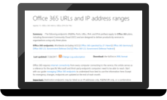
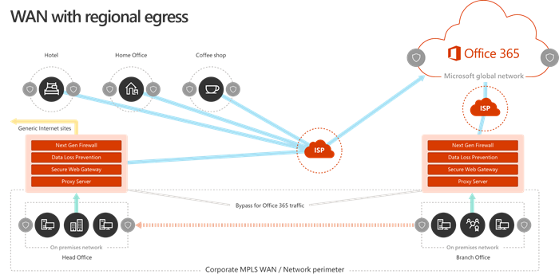

# Office 365 ネットワーク接続の原則Office 365 Network Connectivity Principles

Office 365 のネットワーク接続のネットワークの計画を開始する前には、Office 365 のトラフィックを安全に管理すると、最高のパフォーマンスを取得する接続性の原則について理解する必要があります。この資料では Office 365 のネットワーク接続を安全に最適化するため、最新のガイダンスを理解できます。Before you begin planning your network for Office 365 network connectivity, it is important to understand the connectivity principles for securely managing Office 365 traffic and getting the best possible performance. This article will help you understand the most recent guidance for securely optimizing Office 365 network connectivity.
  
従来のエンタープライズ ネットワークは、アプリケーションおよび厳密な境界部のセキュリティと運営会社のデータ センターでホストされているデータへのアクセスをユーザーに提供するには、主に設計されています。従来のモデルでは、ユーザー アクセスすることのアプリケーションと、企業ネットワーク境界の内部からのデータまたはリモート ブランチ オフィスの WAN リンク経由で、VPN 接続経由で前提としています。Traditional enterprise networks are designed primarily to provide users access to applications and data hosted in company operated datacenters with strong perimeter security. The traditional model assumes that users will access applications and data from inside the corporate network perimeter, over WAN links from branch offices, or remotely over VPN connections. 
  
Office 365 のように SaaS アプリケーションの導入は、サービスとネットワーク境界の外部からのデータの組み合わせを移動します。最適化には、SaaS アプリケーションのユーザーとの間のトラフィックは、パケットの検査、ネットワーク hairpins、地理的に離れた場所にあるエンドポイントに偶発的な接続およびその他の要因によって発生する待機時間が適用されます。Office 365 の最適なパフォーマンスと理解し、キーの最適化のガイドラインを実装することによって、信頼性を確認できます。Adoption of SaaS applications like Office 365 moves some combination of services and data outside the network perimeter. Without optimization, traffic between users and SaaS applications is subject to latency introduced by packet inspection, network hairpins, inadvertent connections to geographically distant endpoints and other factors. You can ensure the best Office 365 performance and reliability by understanding and implementing key optimization guidelines.
  
この記事では、について学習します。In this article, you will learn about:
  
- クラウドへの接続性をお客様に、 [office 365 のアーキテクチャ](office-365-network-connectivity-principles.md#BKMK_Architecture)に適用されます。[Office 365 architecture](office-365-network-connectivity-principles.md#BKMK_Architecture) as it applies to customer connectivity to the cloud
- 更新された[Office 365 の接続性の原則](office-365-network-connectivity-principles.md#BKMK_Principles)とネットワーク ・ トラフィックとエンド ユーザー エクスペリエンスを最適化するための戦略Updated [Office 365 connectivity principles](office-365-network-connectivity-principles.md#BKMK_Principles) and strategies for optimizing network traffic and the end user experience
- [Office 365 エンドポイントの web サービス](office-365-network-connectivity-principles.md#BKMK_WebSvc)、ネットワーク管理者は、ネットワークの最適化で使用するためのエンドポイントの構造化された一覧を使用できます。The [Office 365 Endpoints web service](office-365-network-connectivity-principles.md#BKMK_WebSvc), which allows network administrators to consume a structured list of endpoints for use in network optimization
- [新しい Office 365 エンドポイントのカテゴリ](office-365-network-connectivity-principles.md#BKMK_Categories)および最適化の方法[New Office 365 endpoint categories](office-365-network-connectivity-principles.md#BKMK_Categories) and optimization guidance
- [エンドポイント ・ セキュリティとネットワーク境界部のセキュリティを比較します。Comparing network perimeter security with endpoint security](office-365-network-connectivity-principles.md#BKMK_SecurityComparison)
- Office 365 のトラフィックの[増分の最適化](office-365-network-connectivity-principles.md#BKMK_IncOpt)オプション[Incremental optimization](office-365-network-connectivity-principles.md#BKMK_IncOpt) options for Office 365 traffic

## Office 365 のアーキテクチャOffice 365 architecture

Office 365 は、マイクロ サービスおよび Microsoft ビジネス オンラインの Exchange Online SharePoint Online では、Skype などのアプリケーションのさまざまな一連の生産性および共同作業シナリオを提供する分散型のソフトウェアとしてのサービス (SaaS) クラウドチーム、Exchange のオンライン保護、Office オンラインおよび他の多くのユーザーです。顧客ネットワークとクラウドへの接続に適用される、特定の Office 365 アプリケーションは、独自の機能を必要があります、中にすべてのいくつかのキーのプリンシパル、目標、およびアーキテクチャ パターンを共有します。これらのプリンシパルと接続するためのアーキテクチャ パターンは、一般的なは、他の多くの SaaS クラウドと同時に、サービスとしてのプラットフォームとサービスとしてのインフラストラクチャ クラウドには、Microsoft などの一般的な配置モデルとは大きく異なるAzure。Office 365 is a distributed Software-as-a-Service (SaaS) cloud that provides productivity and collaboration scenarios through a diverse set of micro-services and applications, such as Exchange Online, SharePoint Online, Skype for Business Online, Microsoft Teams, Exchange Online Protection, Office Online and many others. While specific Office 365 applications may have their unique features as it applies to customer network and connectivity to the cloud, they all share some key principals, goals and architecture patterns. These principals and architecture patterns for connectivity are typical for many other SaaS clouds and at the same time being quite different from the typical deployment models of Platform-as-a-Service and Infrastructure-as-a-Service clouds, such as Microsoft Azure.
  
Office 365 は多くの場合ミストかネットワーク プランナーが誤って解釈される) の最も重要なアーキテクチャの機能の 1 つは、ユーザーがそれに接続する方法のコンテキストでは、真にグローバル分散サービスであります。ターゲット Office 365 テナントの場所は、クラウド内の顧客データの保存場所の局所性を理解する必要が Office 365 でユーザーの操作性関係のないデータが含まれるディスクに直接接続します。(パフォーマンス、信頼性、およびその他の重要な品質特性を含む)、Office 365 のユーザー エクスペリエンスには、高度な分散サービスの前面ドアは、スケール アウト数百のマイクロソフトの場所の間で世界中を介した接続が含まれます。ほとんどの場合、中央の場所または地域で、出口のポイントから Office 365 に接続するのではなく、お客様の最も近い Office 365 サービスのエントリ ポイントをユーザーの要求をルーティングするネットワークを許可する最高のユーザー エクスペリエンスが実現されます。One of the most significant architectural features of Office 365 (that is often missed or misinterpreted by network planners) is that it is a truly global distributed service, in the context of how users connect to it. The location of the target Office 365 tenant is important to understand the locality of where customer data is stored within the cloud, but the user experience with Office 365 doesn't involve connecting directly to disks containing the data. The user experience with Office 365 (including performance, reliability and other important quality characteristics) involves connectivity through a highly distributed service front doors that are scaled out across hundreds of Microsoft locations worldwide. In the majority of cases, the best user experience is achieved by allowing the customer network to route user requests to the closest Office 365 service entry point, rather than connecting to Office 365 through an egress point in a central location or region.
  
ほとんどのお客様は、Office 365 のユーザーは多くの場所に分散されます。最良の結果を達成するためにこのドキュメントで説明した原則はで見る、スケール アウト (スケール アップのない) の観点から、マイクロソフトのグローバル ・ ネットワークでのプレゼンスの最も近い点にではなく、地理的に接続を最適化することに重点を置いてOffice 365 テナントの場所です。本質的に、つまり、場合でも、Office 365 のテナントのデータは、特定の地理的な場所に格納されている可能性があります、テナントにとっては、Office 365 は、分散と非常に近くに存在することができます (ネットワーク)、テナントがエンド ・ ユーザーのすべての場所の近く.For most customers, Office 365 users are distributed across many locations. To achieve the best results, the principles outlined in this document should be looked at from the scale-out (not scale-up) point of view, focusing on optimizing connectivity to the nearest point of presence in the Microsoft Global Network, not to the geographic location of the Office 365 tenant. In essence, this means that even though Office 365 tenant data may be stored in a specific geographic location, Office 365 experience for that tenant remains distributed and can be present in very close (network) proximity to every end user location that the tenant has.
  
## Office 365 の接続性の原則Office 365 connectivity principles

マイクロソフトでは、Office 365 の最適な接続性とパフォーマンスを達成するために次の原則をお勧めします。トラフィックを管理し、Office 365 に接続するときに、最高のパフォーマンスを取得するのには次の Office 365 の接続方針を使用します。Microsoft recommends the following principles to achieve optimal Office 365 connectivity and performance. Use these Office 365 connectivity principles to manage your traffic and get the best performance when connecting to Office 365.
  
ネットワーク設計の主な目的に Microsoft のグローバル ネットワーク、低レーテンシーとマイクロソフトのデータ センターのすべてを相互接続する Microsoft のパブリック ネットワークのバックボーン ネットワークの往復時間 (RTT) を減らすことで遅延を最小限にする必要があります。およびクラウド アプリケーションのエントリ ポイントが世界中に分散します。[マイクロソフトではどのように、高速かつ信頼性の高いグローバルなネットワークを構築するの](https://azure.microsoft.com/en-us/blog/how-microsoft-builds-its-fast-and-reliable-global-network/)に Microsoft のグローバル ネットワークの詳細を学びます。The primary goal in the network design should be to minimize latency by reducing the round-trip time (RTT) from your network into the Microsoft Global Network, Microsoft's public network backbone that interconnects all of Microsoft's datacenters with low latency and cloud application entry points spread around the world. You can learn more about the Microsoft Global Network at [How Microsoft builds its fast and reliable global network](https://azure.microsoft.com/en-us/blog/how-microsoft-builds-its-fast-and-reliable-global-network/).
  

### 識別し、Office 365 のトラフィックを区別します。Identify and differentiate Office 365 traffic

  
汎用のインターネットへのネットワーク トラフィックからのトラフィックを区別するためにできることの最初の手順は、Office 365 のネットワーク トラフィックを識別します。ネットワーク ルートの最適化、ファイアウォール規則、ブラウザーのプロキシの設定、および特定のエンドポイントの検査デバイスをネットワークのバイパスのようなアプローチの組み合わせを実装することにより、office 365 の接続性を最適化できます。Identifying Office 365 network traffic is the first step in being able to differentiate that traffic from generic Internet-bound network traffic. Office 365 connectivity can be optimized by implementing a combination of approaches like network route optimization, firewall rules, browser proxy settings, and bypass of network inspection devices for certain endpoints.
  
Office 365 の最適化の前のガイダンスには、**必須**および**オプション**の 2 つのカテゴリに Office 365 エンドポイントが分かれています。3 つのカテゴリに Office 365 エンドポイントを再構成新しい Office 365 のサービスおよび機能をサポートするためにエンドポイントが追加されたと:**最適化\*\*\*\*できるようにする\*\*\*\*既定値**です。各カテゴリのガイドラインは、カテゴリの理解と実装の最適化を容易にすべてのエンドポイントに適用されます。Previous Office 365 optimization guidance divided Office 365 endpoints into two categories, **Required** and **Optional**. As endpoints have been added to support new Office 365 services and features, we have reorganized Office 365 endpoints into three categories: **Optimize**, **Allow** and **Default**. Guidelines for each category applies to all endpoints in the category, making optimizations easier to understand and implement. 
  
Office 365 エンドポイントの分類と最適化の方法の詳細については、[新しい Office 365 エンドポイント [カテゴリ](office-365-network-connectivity-principles.md#BKMK_Categories)] セクションを参照してください。For more details on Office 365 endpoint categories and optimization methods, see the [New Office 365 endpoint categories](office-365-network-connectivity-principles.md#BKMK_Categories) section.
  
ここで、マイクロソフトは、Office 365 のすべてのエンドポイントを web サービスとして公開し、このデータを使用する最適な方法に関するガイダンスを示します。フェッチし、Office 365 エンドポイントを操作する方法の詳細については、「 [Office 365 の Url と IP アドレスの範囲](https://support.office.com/en-us/article/office-365-urls-and-ip-address-ranges-8548a211-3fe7-47cb-abb1-355ea5aa88a2?ui=en-US&amp;rs=en-US&amp;ad=US)」を参照してください。Microsoft now publishes all Office 365 endpoints as a web service and provides guidance on how best to use this data. For more information on how to fetch and work with Office 365 endpoints, see the article [Office 365 URLs and IP address ranges](https://support.office.com/en-us/article/office-365-urls-and-ip-address-ranges-8548a211-3fe7-47cb-abb1-355ea5aa88a2?ui=en-US&amp;rs=en-US&amp;ad=US).
  

### ネットワーク接続のローカルの出口を提供するEgress network connections locally

  
ローカル DNS とインターネットの出口では、接続の遅延時間を削減し、Office 365 サービスへのエントリの最も近いポイントへのユーザー接続が行われていることを確認の重要な要素です。複雑なネットワーク トポロジでは、ローカルの DNS およびローカルのインターネット出口の両方を一緒に実装するために重要ですが。エントリの最も近いポイントに、Office 365 がクライアントの接続をルーティングする方法の詳細については、「[クライアント接続](https://support.office.com/en-us/article/client-connectivity-4232abcf-4ae5-43aa-bfa1-9a078a99c78b)」を参照してください。Local DNS and Internet egress is of critical importance for reducing connection latency and ensuring that user connections are made to the nearest point of entry to Office 365 services. In a complex network topology, it is important to implement both local DNS and local Internet egress together. For more information about how Office 365 routes client connections to the nearest point of entry, see the article [Client Connectivity](https://support.office.com/en-us/article/client-connectivity-4232abcf-4ae5-43aa-bfa1-9a078a99c78b).
  
Office 365 などのクラウド サービスの導入により、前にエンド ・ ユーザーのネットワーク アーキテクチャの設計要因として、インターネット接続は、比較的単純なものでした。インターネット サービスおよび web サイトは世界中に分散している企業の出口のポイントと、指定された送信先のエンドポイント間の遅延時間は、地理的な距離の関数では主としてです。Prior to the advent of cloud services such as Office 365, end user Internet connectivity as a design factor in network architecture was relatively simple. When Internet services and web sites are distributed around the globe, latency between corporate egress points and any given destination endpoint is largely a function of geographical distance.
  
従来のネットワーク アーキテクチャでは、すべての送信インターネット接続は、企業ネットワークを通過し、中央の場所からの出口します。マイクロソフトのクラウド ソリューションが発達すると、レイテンシに敏感なクラウド サービスをサポートするための重要な分散型のインターネットに接続するネットワーク アーキテクチャになりました。マイクロソフトのグローバル ・ ネットワークは、サービス ・ フロント ・ ドアの分散インフラストラクチャ、クラウド サービスへの着信接続を最も近いエントリ ポイントにルーティングするグローバルのエントリ ポイントの動的なファブリックと待機時間の要件を満たすために設計されています。これは、「最終工程」の長さを減らすためにマイクロソフト クラウド ユーザー、顧客、およびクラウド間のルートを効果的に短縮することによってです。In a traditional network architecture, all outbound Internet connections traverse the corporate network, and egress from a central location. As Microsoft's cloud offerings have matured, a distributed Internet-facing network architecture has become critical for supporting latency-sensitive cloud services. The Microsoft Global Network was designed to accommodate latency requirements with the Distributed Service Front Door infrastructure, a dynamic fabric of global entry points that routes incoming cloud service connections to the closest entry point. This is intended to reduce the length of the "last mile" for Microsoft cloud customers by effectively shortening the route between the customer and the cloud.
  
エンタープライズ Wan は、backhaul ネットワークのトラフィックを 1 つまたは複数のプロキシ サーバー経由では通常、インターネットへの出口の前に検査の中心的な会社の本社に多くの場合設計されています。次の図は、このようなネットワーク トポロジを示しています。Enterprise WANs are often designed to backhaul network traffic to a central company head office for inspection before egress to the Internet, usually through one or more proxy servers. The diagram below illustrates such a network topology.
  

  
Office 365 は、世界中のフロント エンド サーバーが含まれている Microsoft のグローバル ネットワークで実行されるため多くの場合がありますユーザーの場所の近くにフロント エンド サーバーです。ローカルのインターネットの出口を提供することにより、Office 365 エンドポイントに対してローカルの名前解決を提供する内部の DNS サーバーを構成することによって、Office 365 に送信されるネットワーク トラフィックは、Office 365 のフロント エンド サーバーのユーザーにできるだけ近いに接続できます。次の図は、本社、支社オフィスとリモートの場所からの接続をユーザーに最も近い Office 365 のエントリ ポイントに最短ルートを許可するネットワーク トポロジの例を示します。Because Office 365 runs on the Microsoft Global Network, which includes front end servers around the world, there will often be a front-end server close to the user's location. By providing local Internet egress and by configuring internal DNS servers to provide local name resolution for Office 365 endpoints, network traffic destined for Office 365 can connect to Office 365 front end servers as close as possible to the user. The diagram below shows an example of a network topology that allows users connecting from main office, branch office and remote locations to follow the shortest route to the closest Office 365 entry point.
  

  
ネットワーク パスを短縮するエントリ ポイントをこの方法で Office 365 に接続のパフォーマンスを向上させることができ、エンド ・ ユーザーが、Office 365 で発生し、Office 365 のパフォーマンスのネットワーク アーキテクチャの将来の変更の影響を減らすためにも役立つことができ、信頼性です。Shortening the network path to Office 365 entry points in this way can improve connectivity performance and the end user experience in Office 365, and can also help to reduce the impact of future changes to the network architecture on Office 365 performance and reliability.
  
DNS 要求は、応答側 DNS サーバーは、離れた場所にあるか、ビジー状態である場合、遅延時間を導入できます。支店内のローカルの DNS サーバーをプロビジョニングして、DNS レコードのキャッシュを適切に構成されていることを確認して名前解決の遅延を最小限に抑えることができます。Also, DNS requests can introduce latency if the responding DNS server is distant or busy. You can minimize name resolution latency by provisioning local DNS servers in branch locations and making sure they are configured to cache DNS records appropriately.
  
にとって最適な接続モデルかどうかはでは、企業ネットワークまたはホーム、ホテル、喫茶店などのリモートの場所に関係なく、ユーザーの場所にあるネットワークの出口を常に提供すること中に、Office 365 に対しても動作しますが、地域の出口と空港です。このローカルの直接出口のモデルは、次の図で表されます。While regional egress can work well for Office 365, the optimum connectivity model would be to always provide network egress at the user's location, regardless of whether this is on the corporate network or remote locations such as home, hotels, coffee shops and airports. This local direct egress model is represented in the diagram below.
  

  
Office 365 を採用している企業を利用して Microsoft のグローバル ネットワークのサービス ・ フロント ・ ドアの分散アーキテクチャの近くのマイクロソフトのグローバル ネットワークのエントリを Office 365 にユーザーの接続が可能な最短のルートになることを確保することによりポイントです。ローカル出口のネットワーク アーキテクチャは、Office 365 ユーザーの場所に関係なく、最も近い出口を通過するトラフィックを許可します。Enterprises who have adopted Office 365 can take advantage of the Microsoft Global Network's Distributed Service Front Door architecture by ensuring that user connections to Office 365 take the shortest possible route to the nearest Microsoft Global Network entry point. The local egress network architecture does this by allowing Office 365 traffic to be routed over the nearest egress, regardless of user location.
  
ローカル出口のアーキテクチャでは、従来のモデルを次の利点があります。The local egress architecture has the following benefits over the traditional model:
  
- ルートの長さを最適化することにより、Office 365 の最適なパフォーマンスを提供します。サービス ・ フロント ・ ドアの分散インフラストラクチャでは、エンド ・ ユーザーの接続は動的に Office 365 のエントリの最も近い点にルーティングされます。Provides optimal Office 365 performance by optimizing route length. End user connections are dynamically routed to the nearest Office 365 entry point by the Distributed Service Front Door infrastructure.
- ローカルの出口を許可することで企業のネットワーク インフラストラクチャへの負荷が軽減されます。Reduces the load on corporate network infrastructure by allowing local egress.
- クライアント エンドポイント ・ セキュリティ、クラウドのセキュリティ機能を活用することにより、接続の両端を保護します。Secures connections on both ends by leveraging client endpoint security and cloud security features.

### ネットワーク ヘアピンを回避するAvoid network hairpins

  
一般則としてユーザーと Office 365 の最も近い端点の間でルートを最短で最も直接的に最高のパフォーマンスが提供されます。ネットワーク hairpin (セキュリティ スタックなど、クラウド ベースの web ゲートウェイのクラウド アクセス ブローカー)、別の中間の場所に特定の宛先が指示された最初の WAN や VPN トラフィックがバインドされたときの動作遅延時間とする潜在的なリダイレクトを導入すること、地理的に離れた場所にあるエンドポイントです。ネットワーク hairpins は、ルーティング ピアリングの非効率性、または最適ではない (リモート) の DNS 参照でもあります。As a general rule of thumb, the shortest, most direct route between user and closest Office 365 endpoint will offer the best performance. A network hairpin happens when WAN or VPN traffic bound for a particular destination is first directed to another intermediate location (such as security stack, cloud access broker, of cloud based web gateway), introducing latency and potential redirection to a geographically distant endpoint. Network hairpins can also be caused by routing/peering inefficiencies or suboptimal (remote) DNS lookups.
  
ローカル出口の場合でもネットワーク hairpins の対象となる Office 365 の接続がないことを確認を使用してユーザーの場所のインターネットの出口には、Microsoft グローバル ネットワークとの直接ピアリング関係を提供する ISP が閉じるかどうかその場所の近くです。出口を直接信頼されている Office 365 のトラフィックを送信するためのルーティングを構成することも、プロキシ、またはクラウド ベースのネットワーク ・ セキュリティ ・ ベンダー、サード ・ パーティ製クラウド経由のトンネリングではなく、インターネット経由のトラフィックを処理します。Office 365 エンドポイントのローカルの DNS 名前解決は、直接ルーティングの場合、だけでなく、最も近い Office 365 のエントリ ポイントが使用されているユーザー接続のことを確認するのに役立ちます。To ensure that Office 365 connectivity is not subject to network hairpins even in the local egress case, check whether the ISP that is used to provide Internet egress for the user location has a direct peering relationship with the Microsoft Global Network in close proximity to that location. You may also want to configure egress routing to send trusted Office 365 traffic directly, as opposed to proxying or tunneling through a third-party cloud or cloud-based network security vendor that processes your Internet-bound traffic. Local DNS name resolution of Office 365 endpoints helps to ensure that in addition to direct routing, the closest Office 365 entry points are being used for user connections.
  
クラウド ベースのネットワーク、または、Office 365 のトラフィックのセキュリティ サービスを使用する場合は、hairpinning 効果が評価され、Office 365 のパフォーマンスへの影響が理解できることを確認します。これの数と、ブランチ オフィスとのネットワークのピアリング関係の品質、マイクロソフトのグローバル ネットワーク ピアリング ポイントの数との関係で、トラフィックが転送されるサービス プロバイダーの場所の場所を調べることによってISP およびマイクロソフトでは、サービス プロバイダーのインフラストラクチャでの backhauling のパフォーマンスに与える影響とサービス ・ プロバイダーです。If you use cloud-based network or security services for your Office 365 traffic, ensure that the hairpinning effect is evaluated and its impact on Office 365 performance is understood. This can be done by examining the number and locations of service provider locations through which the traffic is forwarded in relationship to number of your branch offices and Microsoft Global Network peering points, quality of the network peering relationship of the service provider with your ISP and Microsoft, and the performance impact of backhauling in the service provider infrastructure.
  
Office 365 のエントリ ポイントとエンド ・ ユーザーに自分の近くに分散した場所の数が多いため、サード パーティ製のネットワークまたはセキュリティ プロバイダーに Office 365 のトラフィックをルーティングできます悪影響がない Office 365 の接続のプロバイダーのネットワークがない場合最適な Office 365 のピアリングを構成します。Due to the large number of distributed locations with Office 365 entry points and their proximity to end users, routing Office 365 traffic to any third party network or security provider can have an adverse impact on Office 365 connections if the provider network is not configured for optimal Office 365 peering.
  

### プロキシを使用しない、トラフィックの検査のデバイスと重複するセキュリティ テクノロジBypass proxies, traffic inspection devices and duplicate security technologies

  
企業のお客様は、ネットワークのセキュリティを確認する必要があり、Office 365 用に特別にリスクの軽減方法を選択し、トラフィックの侵入に依存している、パフォーマンスに影響を与えること、および高価なネットワークのセキュリティを減らすために Office 365 のセキュリティ機能を使用してネットワークのトラフィックを Office 365 の技術です。Enterprise customers should review their network security and risk reduction methods specifically for Office 365 bound traffic and use Office 365 security features to reduce their reliance on intrusive, performance impacting, and expensive network security technologies for Office 365 network traffic.
  
ほとんどの企業ネットワークでは、プロキシ、SSL の検査、パケットの検査、およびデータの損失防止システムなどのテクノロジを使用してインターネット トラフィックのネットワーク セキュリティを適用します。これらのテクノロジでは、汎用のインターネット要求の重要なリスクの軽減を提供しますが、パフォーマンス、スケーラビリティ、および Office 365 エンドポイントに適用する場合のエンド ユーザー エクスペリエンスの質を大幅に減らすことができます。Most enterprise networks enforce network security for Internet traffic using technologies like proxies, SSL inspection, packet inspection, and data loss prevention systems. These technologies provide important risk mitigation for generic Internet requests but can dramatically reduce performance, scalability and the quality of end user experience when applied to Office 365 endpoints.
  

#### Office 365 エンドポイントの web サービスOffice 365 Endpoints web service

Office 365 の管理者は、スクリプトを使用して、または Office 365 エンドポイントからエンドポイントの構造化された一覧を使用する他の呼び出しは、web サービスと、境界ファイアウォールの構成およびその他のネットワーク デバイスを更新します。これがいることを確認 Office 365 へのトラフィック識別、適切に扱われるジェネリックと多くの場合不明なインターネットの web サイトへのネットワーク トラフィックとは異なる方法で管理します。Web サービスを Office 365 のエンドポイントを使用する方法の詳細については、 [Office 365 の Url と IP アドレスの範囲](https://support.office.com/en-us/article/office-365-urls-and-ip-address-ranges-8548a211-3fe7-47cb-abb1-355ea5aa88a2?ui=en-US&amp;rs=en-US&amp;ad=US)の資料を参照してください。Office 365 administrators can use a script or REST call to consume a structured list of endpoints from the Office 365 Endpoints web service and update the configurations of perimeter firewalls and other network devices. This will ensure that traffic bound for Office 365 is identified, treated appropriately and managed differently from network traffic bound for generic and often unknown Internet web sites. For more information on how to use the Office 365 Endpoints web service, see the article [Office 365 URLs and IP address ranges](https://support.office.com/en-us/article/office-365-urls-and-ip-address-ranges-8548a211-3fe7-47cb-abb1-355ea5aa88a2?ui=en-US&amp;rs=en-US&amp;ad=US).
  
#### PAC (プロキシの自動構成) のスクリプトPAC (Proxy Automatic Configuration) scripts

Office 365 の管理者には、WPAD または GPO を使用してユーザーのコンピューターに配信することができます (プロキシの自動構成) の PAC スクリプトを作成できます。PAC スクリプトを使用して、企業ネットワーク上で転送するのではなく、インターネットに直接接続を使用する Office 365 のトラフィックを許可する、WAN や VPN のユーザーから Office 365 の要求に対してプロキシを迂回することができます。Office 365 administrators can create PAC (Proxy Automatic Configuration) scripts that can be delivered to user computers via WPAD or GPO. PAC scripts can be used to bypass proxies for Office 365 requests from WAN or VPN users, allowing Office 365 traffic to use direct Internet connections rather than traversing the corporate network.
  
#### Office 365 のセキュリティ機能Office 365 security features

マイクロソフトは、データ センターのセキュリティ、運用上のセキュリティ、および Office 365 のサーバーとそれが表すネットワーク エンドポイントのリスクの軽減については透過的です。Office 365 の組み込みセキュリティ機能は、データ損失の防止、ウイルス対策、多要素認証、ユーザーのロック ボックス、脅威保護の高度な Office 365 の脅威インテリジェンス、Office 365 のセキュリティ保護など、ネットワークのセキュリティ リスクを低減するために使用できます。スコア、Exchange のオンライン保護とネットワーク DDOS のセキュリティです。Microsoft is transparent about datacenter security, operational security and risk reduction around Office 365 servers and the network endpoints that they represent. Office 365 built-in security features are available for reducing network security risk, such as Data Loss Prevention, Anti-Virus, Multi-Factor Authentication, Customer Lock Box, Advanced Threat Protection, Office 365 Threat Intelligence, Office 365 Secure Score, Exchange Online Protection, and Network DDOS Security.
  
マイクロソフトのデータ センターとグローバル ・ ネットワークのセキュリティの詳細については、[マイクロソフトのセキュリティ センター](https://www.microsoft.com/en-us/trustcenter/security)を参照してください。For more information on Microsoft datacenter and Global Network security, see the [Microsoft Trust Center](https://www.microsoft.com/en-us/trustcenter/security).
  
## 新しい Office 365 エンドポイントのカテゴリNew Office 365 endpoint categories

Office 365 エンドポイントは、ネットワーク アドレスとサブネットのさまざまなセットを表します。エンドポイントの Url、可能性があります IP アドレスまたは IP 範囲といくつかの端点が特定の TCP または UDP ポートを一覧表示します。Url が*account.office.net*のような FQDN であることか、またはワイルドカード URL*\*です。 office365.com*。Office 365 endpoints represent a varied set of network addresses and subnets. Endpoints may be URLs, IP addresses or IP ranges, and some endpoints are listed with specific TCP/UDP ports. URLs can either be a FQDN like  *account.office.net*  , or a wildcard URL like  *\*.office365.com*.
  
> [!NOTE]
> ネットワーク内での Office 365 エンドポイントの場所が Office 365 のテナント データの場所に直接関連していません。このため、お客様は分散し、グローバル サービスとしての Office 365 を見てくださいし、を地理的な条件に基づいて、Office 365 エンドポイントへのネットワーク接続をブロックしないようにします。The locations of Office 365 endpoints within the network are not directly related to the location of the Office 365 tenant data. For this reason, customers should look at Office 365 as a distributed and global service and should not attempt to block network connections to Office 365 endpoints based on geographical criteria.
  
「前」の 3 Office 365 トラフィックを管理するためエンドポイントが、**必須**および**オプション**の 2 つカテゴリに編成しました。各カテゴリ内でエンドポイントが、サービスの重要度に応じて別の最適化を必要し、多くのお客様には、Office 365 の Url と IP アドレスの完全なリストに同じネットワーク最適化のアプリケーションの正当化に課題が直面しています。In our previous guidance for managing Office 365 traffic, endpoints were organized into two categories, **Required** and **Optional**. Endpoints within each category required different optimizations depending on the criticality of the service, and many customers faced challenges in justifying the application of the same network optimizations to the full list of Office 365 URLs and IP addresses. 
  
**最適化\*\*\*\*できるようにする\*\*\*\*既定**の優先度ベースのピボットを提供する最適なパフォーマンスの向上を実現し、返すフォーカス ネットワークの最適化を行った場所で、次の 3 つのカテゴリに、新しいモデルでは、エンドポイントの分離します。投資収益率です。端点は、上記のシナリオのネットワークの品質、ボリューム、およびパフォーマンスの封筒と実装の容易性に効果的なユーザー エクスペリエンスの感度に基づくカテゴリに統合されます。推奨される最適化には、カテゴリ内のすべてのエンドポイントに同じ方法を適用できます。In the new model, endpoints are segregated into three categories, **Optimize**, **Allow** and **Default**, providing a priority-based pivot on where to focus network optimization efforts to realize the best performance improvements and return on investment. The endpoints are consolidated in the above categories based on the sensitivity of the effective user experience to network quality, volume and performance envelope of scenarios and ease of implementation. Recommended optimizations can be applied the same way to all endpoints in a given category.
  
- **最適化**のエンドポイントは、すべての Office 365 サービスへの接続に必要なし、Office 365 の帯域幅、接続、およびデータの量の 75% を超える表現します。これらのエンドポイントは、最も機密性の高いネットワークのパフォーマンス、遅延時間、および可用性には、Office 365 シナリオを表しています。すべてのエンドポイントは、マイクロソフトのデータ センターでホストされています。このカテゴリ内のエンドポイントへの変更の頻度は、他の 2 つのカテゴリでのよりも小さく必要があります。このカテゴリには、Url と IP サブネットの定義済みセット専用の Exchange オンライン、SharePoint Online で Skype などのコア Office 365 のワークロードにビジネスをオンラインで、マイクロソフトのチームのキーの (10) の順序は非常に小さいセットが含まれています。**Optimize** endpoints are required for connectivity to every Office 365 service and represent over 75% of Office 365 bandwidth, connections and volume of data. These endpoints represent Office 365 scenarios that are the most sensitive to network performance, latency and availability. All endpoints are hosted in Microsoft datacenters. The rate of change to the endpoints in this category is expected to be much lower than for the endpoints in the other two categories. This category includes a very small (on the order of ~10) set of key URLs and a defined set of IP subnets dedicated to core Office 365 workloads such as Exchange Online, SharePoint Online, Skype for Business Online and Microsoft Teams.

    適切に定義された重要なエンドポイントのリストの要約は計画し、迅速かつ容易に、これらの宛先の値が大きいネットワークの最適化を実装する際に役立ちます。A condensed list of well defined critical endpoints should help you to plan and implement high value network optimizations for these destinations faster and easier.

    *最適化*のエンドポイントの例としては、 *https://outlook.office365.com* 、 *https://\<テナント\>です。 sharepoint.com*と*https://\<テナント\>-my.sharepoint.com* 。Examples of  *Optimize*  endpoints include  *https://outlook.office365.com*  ,  *https://\<tenant\>.sharepoint.com*  and  *https://\<tenant\>-my.sharepoint.com*  .

    最適化の方法は次のとおりです。Optimization methods include:

  - ネットワーク デバイスやトラフィックの傍受、SSL 暗号化の解除、詳細なパケット検査およびコンテンツ フィルタ リングを実行するサービスの*最適化*のエンドポイントのバイパスまたはホワイト リストBypass or whitelist  *Optimize*  endpoints on network devices and services that perform traffic interception, SSL decryption, deep packet inspection and content filtering.
  - プロキシ デバイスを設置し、一般に汎用的なインターネットの閲覧に使用するクラウド ベースのプロキシ サービスをバイパスします。Bypass on-premises proxy devices and cloud-based proxy services commonly used for generic Internet browsing.
  - これらのエンドポイント、ネットワーク インフラストラクチャおよび境界領域のシステムで完全に信頼されたものとしての評価を優先します。Prioritize the evaluation of these endpoints as fully trusted by your network infrastructure and perimeter systems.
  - WAN backhauling は、の削減または排除の優先順位を設定し、可能なユーザーや支店の場所にこれらのエンドポイントに直接の分散インターネット ベース出口を容易にします。Prioritize reduction or elimination of WAN backhauling, and facilitate direct distributed Internet based egress for these endpoints as close to users/branch locations as possible.
  - 分割トンネリングを実装することにより、VPN ユーザーに対してこれらのクラウドのエンドポイントに直接接続を容易になります。Facilitate direct connectivity to these cloud endpoints for VPN users by implementing split tunneling.
  - DNS 名の解決によって返される IP アドレスがこれらのエンドポイントにルーティングの出口パスと一致することを確認します。Ensure that IP addresses returned by DNS name resolution match the routing egress path for these endpoints.
  - 直接、最小限の遅延時間は、マイクロソフトのグローバル ・ ネットワークの最も近いインターネット ピアリング ポイントにルーティングするための SD WAN の統合のため、これらのエンドポイントを優先します。Prioritize these endpoints for SD-WAN integration for direct, minimal latency routing into the nearest Internet peering point of the Microsoft global network.

- **許可する**エンドポイントは、特定の Office 365 のサービスおよび機能への接続に必要なが、ネットワークのパフォーマンスと*最適化*のカテゴリとしての待機時間に影響はありません。全体的なネットワーク使用量の帯域幅と接続数の観点から、これらのエンドポイントは、大幅に小さくもできます。これらのエンドポイントでは、専用の Office 365 し、マイクロソフトのデータ センターでホストされています。Office 365 のマイクロ ・ サービスとその依存関係を (約 100 名の Url) の広範なセットを表す、[*最適化*] カテゴリよりも高速で変更する必要があります。このカテゴリ内のすべてのエンドポイントでは、専用の定義済みの IP サブネットに関連付けられます。**Allow** endpoints are required for connectivity to specific Office 365 services and features, but are not as sensitive to network performance and latency as those in the  *Optimize*  category. The overall network footprint of these endpoints from the standpoint of bandwidth and connection count is also significantly smaller. These endpoints are dedicated to Office 365 and are hosted in Microsoft datacenters. They represent a broad set of Office 365 micro-services and their dependencies (on the order of ~100 URLs) and are expected to change at a higher rate than those in the  *Optimize*  category. Not all endpoints in this category are associated with defined dedicated IP subnets.

    ネットワークの最適化を*許可する*エンドポイントの場合、Office 365 のユーザー エクスペリエンスを向上できますが、ネットワークへの変更を最小限に抑えるためには、狭い複数最適化はこれらの範囲をいくつかいただく場合があります。Network optimizations for  *Allow*  endpoints can improve the Office 365 user experience, but some customers may choose to scope those optimizations more narrowly to minimize changes to their network.

    *許可する*エンドポイントの例としては、 *https://\*です。 protection.outlook.com*と*https://accounts.accesscontrol.windows.net*。Examples of  *Allow*  endpoints include  *https://\*.protection.outlook.com*  and  *https://accounts.accesscontrol.windows.net*.

    最適化の方法は次のとおりです。Optimization methods include:

  - バイパスまたはホワイト リスト ネットワーク デバイスやトラフィックの傍受、SSL 暗号化の解除、詳細なパケット検査およびコンテンツ フィルタ リングを実行するサービスを*許可する*エンドポイント。Bypass or whitelist  *Allow*  endpoints on network devices and services that perform traffic interception, SSL decryption, deep packet inspection and content filtering.
  - これらのエンドポイント、ネットワーク インフラストラクチャおよび境界領域のシステムで完全に信頼されたものとしての評価を優先します。Prioritize the evaluation of these endpoints as fully trusted by your network infrastructure and perimeter systems.
  - WAN backhauling は、の削減または排除の優先順位を設定し、可能なユーザーや支店の場所にこれらのエンドポイントに直接の分散インターネット ベース出口を容易にします。Prioritize reduction or elimination of WAN backhauling, and facilitate direct distributed Internet based egress for these endpoints as close to users/branch locations as possible.
  - DNS 名の解決によって返される IP アドレスがこれらのエンドポイントにルーティングの出口パスと一致することを確認します。Ensure that IP addresses returned by DNS name resolution match the routing egress path for these endpoints.
  - 直接、最小限の遅延時間は、マイクロソフトのグローバル ・ ネットワークの最も近いインターネット ピアリング ポイントにルーティングするための SD WAN の統合のため、これらのエンドポイントを優先します。Prioritize these endpoints for SD-WAN integration for direct, minimal latency routing into the nearest Internet peering point of the Microsoft global network.

- **既定**のエンドポイントでは、Office 365 のサービスと依存関係すべての最適化を必要としないし、通常のインターネット トラフィックをバインドするようにお客様のネットワークで扱うことができますを表します。このカテゴリ内のいくつかのエンドポイントがマイクロソフトのデータ センターでホストされていない可能性があります注意してください。例としては、*https://odc.officeapps.live.com*と*https://appexsin.stb.s-msn.com*。**Default** endpoints represent Office 365 services and dependencies that do not require any optimization, and can be treated by customer networks as normal Internet bound traffic. Note that some endpoints in this category may not be hosted in Microsoft datacenters. Examples include  *https://odc.officeapps.live.com*  and  *https://appexsin.stb.s-msn.com*.

Office 365 のネットワーク最適化の手法の詳細については、「 [Office 365 の管理エンドポイント](https://support.office.com/en-us/article/managing-office-365-endpoints-99cab9d4-ef59-4207-9f2b-3728eb46bf9a#ID0EAEAAA=0._Overview)」を参照してください。For more information about Office 365 network optimization techniques, see the article [Managing Office 365 endpoints](https://support.office.com/en-us/article/managing-office-365-endpoints-99cab9d4-ef59-4207-9f2b-3728eb46bf9a#ID0EAEAAA=0._Overview).
  
## エンドポイント ・ セキュリティとネットワーク境界部のセキュリティを比較します。Comparing network perimeter security with endpoint security

従来のネットワーク セキュリティの目標は、侵入や悪意のある攻撃から企業ネットワークの境界を強化するためです。組織では、Office 365 を導入、ネットワーク サービスやデータの一部は、部分的または完全に移行クラウドに移行します。ネットワークのアーキテクチャを根本的な変更と、このプロセスには、新たな要因を考慮したネットワーク セキュリティの再評価が必要です。The goal of traditional network security is to harden the corporate network perimeter against intrusion and malicious exploits. As organizations adopt Office 365, some network services and data are partly or completely migrated to the cloud. As does any fundamental change to network architecture, this process requires a reevaluation of network security that takes emerging factors into account:
  
- クラウド サービスを採用すると、ネットワーク サービスとデータは、オンプレミス データ センターとクラウドの間で分散し、境界部のセキュリティが独自に十分ではありません。As cloud services are adopted, network services and data are distributed between on-premises datacenters and the cloud, and perimeter security is no longer adequate on its own.
- リモート ユーザーは、オンプレミス データ センターと自宅、ホテル、喫茶店などの制御されていない場所からクラウドの両方の企業のリソースに接続します。Remote users connect to corporate resources both in on-premises datacenters and in the cloud from uncontrolled locations such as homes, hotels and coffee shops.
- 特化したセキュリティ機能クラウド サービスに組み込まれてますますと可能性のある補足したり、既存のセキュリティ システムを交換できます。Purpose-built security features are increasingly built into cloud services and can potentially supplement or replace existing security systems.

マイクロソフトでは、広い範囲の Office 365 のセキュリティ機能を提供しを Office 365 のデータとネットワークのセキュリティを確保することができるセキュリティのベスト プラクティスを採用する規範的なガイダンスが用意されています。推奨されるベスト プラクティスを以下に示します。Microsoft offers a wide range of Office 365 security features and provides prescriptive guidance for employing security best practices that can help you to ensure data and network security for Office 365. Recommended best practices include the following:
  
- **多要素認証を使用する (MFA)** MFA では、電話、テキスト メッセージ、または自分のパスワードを正しく入力した後、スマート フォン上のアプリ通知を確認するユーザーを要求することによって強力なパスワード方式に追加の保護レイヤーを追加します。**Use multi-factor authentication (MFA)** MFA adds an additional layer of protection to a strong password strategy by requiring users to acknowledge a phone call, text message, or an app notification on their smart phone after correctly entering their password.

- **Office 365 のクラウド アプリケーションのセキュリティを使用します。** 異常なアクティビティを追跡し、それに基づいて行動するためのポリシーを設定します。サインイン試行失敗した複数の管理者が大量のデータのダウンロードなど、異常なまたは危険なユーザー アクティビティを確認するよう Office 365 のクラウド アプリケーションのセキュリティの警告を設定または不明なまたは危険な ip アドレスからの接続に対応します。**Use Office 365 Cloud App Security** Set up policies to track anomalous activity and act on it. Set up alerts with Office 365 Cloud App Security so that admins can review unusual or risky user activity, such as downloading large amounts of data, multiple failed sign-in attempts, or connections from a unknown or dangerous IP addresses.

- **データ損失防止 (DLP) を構成します。** DLP では、機密性の高いデータを識別し、ユーザーが誤ってまたは意図的にデータを共有することを防ぐためのポリシーを作成できます。DLP は、ユーザーは、ワークフローを中断することがなく準拠で維持できるようにするため Exchange Online、SharePoint Online では、および OneDrive を含む Office 365 の間で動作します。**Configure Data Loss Prevention (DLP)** DLP allows you to identify sensitive data and create policies that help prevent your users from accidentally or intentionally sharing the data. DLP works across Office 365 including Exchange Online, SharePoint Online, and OneDrive so that your users can stay compliant without interrupting their workflow.

- **お客様のロック ボックスを使用**Office 365 管理者の場合は、マイクロソフトのサポート エンジニアがヘルプ セッション中に、データにアクセスする方法を制御するのに顧客のロック ボックスを使用できます。エンジニアがトラブルシューティングし、問題を修正するのには、データへのアクセスを必要とする場合、お客様のロック ボックスを使用すると、承認またはアクセス権の要求を拒否できます。**Use Customer Lockbox** As an Office 365 admin, you can use Customer Lockbox to control how a Microsoft support engineer accesses your data during a help session. In cases where the engineer requires access to your data to troubleshoot and fix an issue, Customer Lockbox allows you to approve or reject the access request.

- **Office 365 のセキュリティで保護されたスコアを使用します。** セキュリティで保護されたスコアは、さらにリスクの軽減を行うことができることをお勧めするセキュリティ分析ツールです。セキュリティで保護されたスコアを使用して、Office 365 の設定と活動を調べ、マイクロソフトによって確立されたベースラインを比較します。調整方法に問題が、セキュリティのベスト プラクティスに基づくスコアが表示されます。**Use Office 365 Secure Score** Secure Score is a security analytics tool that recommends what you can do to further reduce risk. Secure Score looks at your Office 365 settings and activities and compares them to a baseline established by Microsoft. You'll get a score based on how aligned you are with best security practices.

セキュリティを強化する総合的なアプローチでは、次の考慮事項を含める必要があります。A holistic approach to enhanced security should include consideration of the following:
  
- クラウド ・ ベースを適用すると、エンドポイントのセキュリティと Office クライアントのセキュリティ機能の方向に境界部のセキュリティから重点をシフトします。Shift emphasis from perimeter security towards endpoint security by applying cloud-based and Office client security features.
  - データ ・ センターにセキュリティの境界を縮小します。Shrink the security perimeter to the datacenter
  - オフィス内または遠隔地のユーザーのデバイスと同等の信頼を有効にします。Enable equivalent trust for user devices inside the office or at remote locations
  - データの場所とユーザーの場所のセキュリティ保護に重点を置くFocus on securing the data location and the user location
  - 管理対象ユーザーのコンピューターがあるエンドポイントのセキュリティと信頼性の高いManaged user machines have higher trust with endpoint security
- すべての情報セキュリティを包括的に、管理境界だけに重点を置いていませんManage all information security holistically, not focusing solely on the perimeter
  - セキュリティ デバイスを回避するのには信頼されているトラフィックを許可して、ゲストの Wi-fi ネットワークを管理されていないデバイスを分離することによって、境界部ネットワークのセキュリティを構築し、WAN を再定義します。Redefine WAN and building perimeter network security by allowing trusted traffic to bypass security devices and separating unmanaged devices to guest Wi-Fi networks.
  - 企業 WAN エッジのネットワーク セキュリティの要件を削減します。Reduces network security requirements of the corporate WAN edge
  - いくつかのネットワーク境界セキュリティ デバイスなど、ファイアウォールが必要ですが、ロードが減少します。Some network perimeter security devices such as firewalls are still required, but load is decreased
  - Office 365 のトラフィックをローカルの出口を確保します。Ensures local egress for Office 365 traffic
- 改善が[増分の最適化](office-365-network-connectivity-principles.md#BKMK_IncOpt)] セクションで説明したように、段階的に対処できます。いくつかの最適化の手法によっては、ネットワーク アーキテクチャよりコスト/利点の比率を提供可能性があり、組織のほとんどの意味のある最適化を選択する必要があります。Improvements can be addressed incrementally as described in the [Incremental optimization](office-365-network-connectivity-principles.md#BKMK_IncOpt) section. Some optimization techniques may offer better cost/benefit ratios depending on your network architecture, and you should choose optimizations that make the most sense for your organization.

Office 365 のセキュリティとコンプライアンスの詳細については、「[セキュリティとコンプライアンスには、Office 365 の概要](https://support.office.com/en-us/article/overview-of-security-and-compliance-in-office-365-dcb83b2c-ac66-4ced-925d-50eb9698a0b2?ui=en-US&amp;rs=en-US&amp;ad=US)」を参照してください。For more information on Office 365 security and compliance, see the article [Overview of security and compliance in Office 365](https://support.office.com/en-us/article/overview-of-security-and-compliance-in-office-365-dcb83b2c-ac66-4ced-925d-50eb9698a0b2?ui=en-US&amp;rs=en-US&amp;ad=US).
  
## 差分最適化Incremental optimization

SaaS の理想的なネットワーク接続のモデルが示される、この資料の前半が、従来の複雑なネットワーク アーキテクチャを持つ大規模な組織に多くのことがないのすべてのこれらの変更を直接利用することは実用的です。このセクションでは、いくつかの Office 365 のパフォーマンスと信頼性を向上させることができます増分の変更について説明します。We have represented the ideal network connectivity model for SaaS earlier in this article, but for many large organizations with historically complex network architectures, it will not be practical to directly make all of these changes. In this section, we discuss a number of incremental changes that can help to improve Office 365 performance and reliability.
  
Office 365 のトラフィックを最適化するために使用する方法は、ネットワーク トポロジと実装しているネットワーク デバイスによって異なります。大企業の多くの場所で複雑なネットワーク ・ セキュリティ ・ プラクティスとして記載されている、 [Office 365 の接続性の原則](office-365-network-connectivity-principles.md#BKMK_Principles)、小規模な組織の場合のみ、基本原則のほとんどまたはすべてを含む戦略を開発する必要があります。1 つまたは 2 つを考慮する必要があります。The methods you will use to optimize Office 365 traffic will vary depending on your network topology and the network devices you have implemented. Large enterprises with many locations and complex network security practices will need to develop a strategy that includes most or all of the principles listed in the [Office 365 connectivity principles](office-365-network-connectivity-principles.md#BKMK_Principles) section, while smaller organizations might only need to consider one or two.
  
最適化は、各メソッドを連続して適用すること、インクリメンタルなプロセスとしてアプローチすることができます。次の表は、ユーザーの最大数の待機時間と信頼性に与える影響の順序でキーの最適化の方法を示します。You can approach optimization as an incremental process, applying each method successively. The following table lists key optimization methods in order of their impact on latency and reliability for the largest number of users.
  
|**最適化方法****Optimization method**|**説明****Description**|**影響****Impact**|
|:-----|:-----|:-----|
|ローカルの DNS 解決とインターネットの出口Local DNS resolution and Internet egress    |各場所でのローカルの DNS サーバーを準備し、インターネット ユーザーの場所にできるだけ近いように、Office 365 の接続の出口を確保します。Provision local DNS servers in each location and ensure that Office 365 connections egress to the Internet as close as possible to the user's location.    | 待機時間を最小限に抑えるMinimize latency     Office 365 のエントリの最も近い点に信頼性の高い接続性を向上させるImprove reliable connectivity to the closest Office 365 entry point    |
|地域の出口ポイントを追加します。Add regional egress points    |企業ネットワークに 1 つだけの出口ポイントが複数の場所がある場合は、Office 365 のエントリの最も近い点に接続するユーザーを有効にする地域の出口ポイントを追加します。If your corporate network has multiple locations but only one egress point, add regional egress points to enable users to connect to the closest Office 365 entry point.    | 待機時間を最小限に抑えるMinimize latency     Office 365 のエントリの最も近い点に信頼性の高い接続性を向上させるImprove reliable connectivity to the closest Office 365 entry point    |
|プロキシを使用しないとデバイスの検査Bypass proxies and inspection devices    |出口のポイントに直接 Office 365 の要求を送信する PAC ファイルを使用してブラウザーを構成します。Configure browsers with PAC files that send Office 365 requests directly to egress points.    エッジ ルーターおよび検査しなくても Office 365 のトラフィックを許可するファイアウォールを構成します。Configure edge routers and firewalls to permit Office 365 traffic without inspection.    | 待機時間を最小限に抑えるMinimize latency     ネットワーク デバイス上の負荷を軽減します。Reduce load on network devices    |
|VPN ユーザーの直接の接続を有効にします。Enable direct connection for VPN users    |VPN ユーザーの場合は、分割トンネリングを実装することにより、VPN トンネル経由ではなく、ユーザーのネットワークから直接を接続するための Office 365 の接続を有効にします。For VPN users, enable Office 365 connections to connect directly from the user's network rather than over the VPN tunnel by implementing split tunneling.    | 待機時間を最小限に抑えるMinimize latency     Office 365 のエントリの最も近い点に信頼性の高い接続性を向上させるImprove reliable connectivity to the closest Office 365 entry point    |
|従来の WAN から SD WAN への移行します。Migrate from traditional WAN to SD-WAN    |SD (ソフトウェア定義されたワイド エリア ネットワーク) を Wan では、WAN の管理を合理化し、仮想アプライアンス、仮想マシン (Vm) を使用してコンピューティング リソースの仮想化のような従来の WAN ルーターに置き換えることによってパフォーマンスが向上します。SD-WANs (Software Defined Wide Area Networks) simplify WAN management and improve performance by replacing traditional WAN routers with virtual appliances, similar to the virtualization of compute resources using virtual machines (VMs).    | パフォーマンスと WAN トラフィックの管理の容易性を向上します。Improve performance and manageability of WAN traffic     ネットワーク デバイス上の負荷を軽減します。Reduce load on network devices    |
