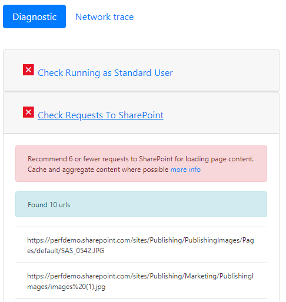
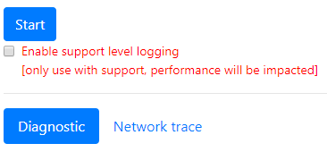

# SharePoint Online のページ診断ツールを使用する

この記事では、ページ診断ツールを使用して、従来のチームサイトにある従来の発行ページとページを分析する方法について説明し、 **SharePoint Online**の推奨されるプラクティスのサブセットについて説明します。 
  
公開が有効になっていないチームサイトは、CDNs を使用できませんが、残りのすべてのルールは適用可能です。 発行によってオーバーヘッドが増加するので、ページの読み込み時間に悪影響を及ぼすことがあるので、CDN 機能を取得するためだけに発行を有効にしないようにしてください。

**1.05 がリリースされていることに注意してください。拡張機能をインストールしている場合は、更新してください**。 使用しているバージョンがわからない場合は、[バージョン情報] リンクをクリックして確認してください。
  
> [!IMPORTANT]
> このツールは SharePoint サイトページをレビューするように設計されているため、ページ診断ツールはドキュメントライブラリまたはシステムページに対して実行されません。 *Allitems*ページはシステムページです。 システムページでツールを実行しようとすると、"このアプリケーションは SharePoint ページ上でのみ実行する必要があります" というメッセージが表示されます。    このツールでは、[ライブラリまたはシステムページの評価] に値がないため、このエラーは発生しません。 このツールを使用するには、システム以外の SharePoint ページに移動してください。 これが SharePoint ページで発生した場合は、お客様が sharepoint メタタグを削除した後、ページが SharePoint ページではなくなっていることを確認してください。 ツールに関するフィードバックをお寄せください。 [バージョン情報] タブをクリックして、[フィードバックの送信][リンク](https://go.microsoft.com/fwlink/?linkid=874109)に従います。 
  
## ページ診断ツールをインストールする

> [!IMPORTANT]
> Microsoft では、アクセスしたデータや web サイトを読み取ることはありません。このツールを使用して、個人情報、web サイト、ダウンロード情報を取得することはありません。 ツールによってログに記録される情報は、テナント名、ルールの数、およびツールの実行時に [サポートログ] オプションが使用されているかどうかです。 この情報は、Microsoft がお客様によってどのような課題が発生しているかを分析し、サポートログ機能が悪用されないようにするためのものです。

1. Chrome ブラウザーを使用して、[ツールへ](https://chrome.google.com/webstore/detail/inahogkhlkbkjkkaleonemeijihmfagi)の直接リンクを開くか、 [Chrome browser Webstore](https://chrome.google.com/webstore/search/page%20diagnostics%20for%20sharepoint)で検索を開き、ブラウザー拡張機能をインストールします。 ストアの [説明] ページで提供されるユーザーのプライバシーポリシーを確認してください。 このツールをブラウザーに追加すると、次のアクセス許可に関する通知が表示されます。     ページには、ページの web パーツとカスタマイズに応じて、SharePoint の外部にある場所のコンテンツが含まれている可能性があるため、この通知が行われます。 これは、ツールが実行されているアクティブな SharePoint タブでのみ [開始] ボタンがクリックされたときに、要求と応答を読み取ることを意味します。 この情報は web ブラウザーによってローカルにキャプチャされ、ツールの [JSON へのエクスポート] リンクを介して利用できます。 **情報は、Microsoft によって送信または取得されることはありません。** ([こ](https://go.microsoft.com/fwlink/p/?linkid=857875)のツールでは、Microsoft のプライバシーポリシーにアクセスできます)。  ツールの "JSON へのエクスポート" 機能も、"ダウンロードを管理する" アクセス許可が必要な理由になっています。 結果に Url が含まれており、PII (個人を特定できる情報) として分類できるため、組織の外部で JSON ファイルを共有する前に、会社のプライバシーガイドラインに従ってください。
    
2. (オプション)このツールを Chrome incognito モードで使用する場合は、拡張機能に移動して、 **incognito で [許可**] をクリックします。
    
3. 確認したい sharepoint Online の SharePoint の従来の発行ページに移動します。 ページ上のアイテムの "遅延読み込み" が許可されています。そのため、**ツールは自動的に停止しません**。 コレクションを停止するには、[**停止**] をクリックします。 (これは、すべてのページ読み込みシナリオを満たすように設計されています。)[**停止**] をクリックする前に、ネットワークトレースデータが完成していることを確認してください。 それ以外の場合は、一部のトレースがあります。 さらに、このツールはブラウザー拡張機能であり、複数のタブまたはウィンドウを開くと、ツールのアクティブなインスタンスが一度に1つだけ実行できるようになります。 これは、ブラウザーの拡張機能の制限事項です。 
  
4. 拡張機能ロゴをクリックします。  ツールを読み込むと、次の拡張子ポップアップウィンドウが表示されます。   開始および停止操作は、[開始] をクリックしたときの基本的な概念に従います。ページが再読み込みされ、コレクションが開始されます。

このツールで提供される情報の詳細については、以下のセクションを参照してください。

## ページ診断ツールに表示される内容
    
1. **About**リンクは、この記事へのリンクを含む、ツールに関する一般的なガイダンスと詳細情報を提供します。 また、SharePoint のパフォーマンスに関する推奨事項、サードパーティからの通知、ツールに関するフィードバックを提供するためのオプションへの直接リンクも含まれています。 
    
2. **関連付け ID、SPRequestDuration、Sprequestduration**、**ページ読み込み時間**、および**URL**の詳細は情報で、いくつかの目的に使用できます。 
    
  - **CorrelationID**は、Microsoft サポートチームと協力して、追加の診断データを取得することができる重要な要素です。 
    
  - **Sprequestduration**は、ページを処理するのにかかるサーバー時間です。 この時間が長い場合は、サーバーが正しく動作していないことを意味するわけではありませんが、ページによって呼び出された呼び出しの数を反映することもできます。構造ナビゲーション、大きい画像、多くの API 呼び出しが、サーバーの時間を長くする可能性があります。. 
    
  - **Spiislatency**は、Web フロントエンドサーバーがページの読み込み要求を受信したときに実行されたミリ秒単位の時間です。 これは、ページの処理を開始するまでの待機時間を示す指標で、web アプリケーションが応答するのにかかる時間は含まれません。 
    
  - [**ページの読み込み時間**] は、ブラウザーによって応答が受信された時点までの、要求の時間からページによって記録された時間です。 追加の時間は、コンピューターのパフォーマンスとブラウザーの読み込みにかかる時間によって変化します。 
    
  - **URL** (Uniform resource Locator) は、現在のページの web アドレスです。 
    
3. [ [**診断**] タブ](#how-to-use-the-diagnostic-tab)にはルールが一覧表示され、それらのいずれか赤い十字でマークされている場合は、ページ上で問題が特定されています。 各ルールには、アイテムが赤の場合にクリックする "詳細情報" リンクがあります。 これにより、そのルールの詳細と問題を修復する方法が得られます。 

4. [ [**ネットワークトレース**] タブ](#how-to-use-the-network-trace-tab)には、ページのビルド要求と応答に関する詳細が表示されます。

## [診断] タブの使用方法

1. **標準ユーザーとして実行を確認**する ページのパフォーマンスのチェックは、サービスアカウント、管理者またはサイトコレクションの管理者、または昇格した権限を持つ任意のアカウントとしてログインしている場合は実行しないでください。 そのような種類のアカウントには、特別なスクリプトと機能が組み込まれているため、ページのパフォーマンスが実際には表示されません。
    
2. **SharePoint への要求を確認する** サーバーに対して行われるデータと要求の量は、オーバーロードされたページのように制限する必要がありますが、パフォーマンスが低下します。 このチェックは、SharePoint に対して行われる要求の数を確認し、要求が6要求を超えたときに通知されます。 ほとんどの要求はキャッシュされる必要があるため、すべてのページ読み込みに対して呼び出されることはありません。 各ユーザーによるページへの呼び出しの量を減らすには、キャッシュを少なくとも15分でセットアップして使用する必要があります。 これは一般的な問題であり、ほとんどの場合、データのみが変更されますが、このページでは、各ユーザーのページごとに毎回データをチェックおよびフェッチする必要があります。
    
3. **CDNs の使用を確認する** コンテンツ配信ネットワーク (CDNs) は Microsoft によって提供されており、ここで参照されているものは SharePoint Online コンテンツ配信ネットワークです。 複数の種類があり、SharePoint CDNs などのさまざまな CDN サービス、Azure での CDNs などがあります。 [次のガイダンスを使用して](https://go.microsoft.com/fwlink/?linkid=873250)ください。
    
4. **画像のサイズが大きいかどうかを確認する** PNG などのより良い web の種類を利用することにより、画像を web 用に最適化する必要があります。 また、画像レンディションも使用する必要があり、SharePoint で直接利用できます。 100kb より大きい画像/イメージ表示は、web 用に最適化されていないと強調表示されます。 [画像を最適化するには、以下のガイダンスを使用](https://go.microsoft.com/fwlink/?linkid=873251)します。
    
5. **構造ナビゲーションを確認する** 構造ナビゲーションは、本来、オブジェクトキャッシュを利用できる SharePoint オンプレミスで使用するために設計されていました。 構造ナビゲーションは、SharePoint Online での使用は推奨されておらず、管理ナビゲーションまたはカスタムプロバイダーに変更する必要があります。 [ナビゲーションを最適化するには、以下のガイダンスを使用します。](https://go.microsoft.com/fwlink/?linkid=873247)
    
6. **CBQ WebPart を確認する**(CBQ-クエリ Web パーツのコンテンツ) コンテンツクエリ Web パーツは、各ユーザーについて、クエリ内のすべてのアイテムと各ページの読み込みをトラバースするため、高レベルの SQL ロードを生成します。 オンプレミスのインストールとは異なり、この Web パーツを設定するために必要なクエリの数を制限するために使用できるキャッシュはありません。 このような CBQ の実行には時間がかかり、ページの全体的なパフォーマンスが影響を受けるため、使用しないようにする必要があります。 コンテンツ検索 Web パーツ (CSWP) をコンテンツクエリ Web パーツの代替として使用してください。 [コンテンツ検索 Web パーツに関連する次のガイダンスを使用](https://go.microsoft.com/fwlink/?linkid=873245)します。

## [ネットワークトレース] タブの使用方法
    
[**ネットワークトレース**] タブには、ページを作成するための要求と受信した応答に関する詳細情報が表示されます。 

1. **赤としてフラグが付けられたアイテムの読み込み時刻を検索**します。 各要求と応答のパフォーマンスは、次のようにページ全体のパフォーマンスに与える影響に基づいて色分けされています。
- 緑: \< 500ms
- 黄: 500-1000 ミリ秒
- 赤: \> 1000 ミリ秒
   上記の図では、赤の項目が既定のページに関連しています。 ページが1000ミリ秒 (1 秒未満) \<で読み込まれない限り、常に赤で表示されます。

2. **テストアイテムの読み込み時間**。 アイテムはブラウザーによって既にキャッシュされているため、時間やカラーインジケーターが表示されない場合があります。 この問題を正しくテストするには、ページを開き、ブラウザーのキャッシュをクリアしてから [**開始**] をクリックします。これにより、ページの読み込みが強制的に "コールド" され、最初のページ読み込みが実際に反映されるようになります。 これは、ページ上でキャッシュされているアイテムを特定するのに役立つように、"ウォーム" ページ読み込みと比較する必要があります。 
    
3. **関連する詳細情報を他のユーザーと共有して、問題の調査に役立てることができ**ます。 ツールで提供される詳細または情報を開発者や技術サポート担当者と共有するには、[ **JSON へのエクスポート**] をクリックします (上記の図を参照)。 これにより、JSON ファイルビューアーを使用して、結果をダウンロードできるようになります。

> [!IMPORTANT]
> これらの結果には Url が含まれており、PII (個人を特定できる情報) として分類することができます。 その情報を配布する前に、組織のガイドラインに従っていることを確認してください。 

## Microsoft サポートへの協力
   
サポートが必要な場合にのみ、パフォーマンスを向上させるために使用する必要がある**Microsoft サポートレベルの機能**が含まれています。 この機能を利用することによって、サポートチームなしで使用する場合のメリットはありません。 実際には、ページのパフォーマンスが大幅に低下し、機能の継続的な使用がサービスの "誤用" と見なされることがあります。 この機能をツールで使用するときに、追加情報がサービスのログに追加されるため、追加情報はありません。 

変更は表示されません。ただし、有効になっていることが通知され、ページのパフォーマンスが大幅に低下するのは、有効になっている場合には、2-3 倍のパフォーマンス低下になります。 これは特定のページとアクティブなセッションにのみ関連しています。 このため、この方法は、サポートチームに積極的に従事している場合に限って使用する必要があります。

### Microsoft サポートレベル機能を有効にするには

1. ページ診断ツールを開きます。
2. キーボードで、ALT + Shift + L キーを押します。 これにより、**サポートレベルのログ出力**が表示されます。 
3. チェックボックスをオンにし、[**開始**] をクリックしてページを再読み込みし、分析のサポートのために詳細ログを生成します。 
  
このことは、サポートチームがその番号を利用して必要な情報を抽出することで、このための重要な要素となります。 CorrelationID (Page Diagnostics tool の上部にあります) をコピーして、完全な ID なしで必要な作業を行うことができないため、サポートするようにしてください。
    
## 関連項目

[SharePoint Online のパフォーマンスをチューニングする](tune-sharepoint-online-performance.md)

[Office 365 のパフォーマンスをチューニングする](tune-office-365-performance.md)

[コンテンツ配信ネットワーク](content-delivery-networks.md)
