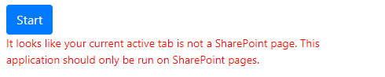
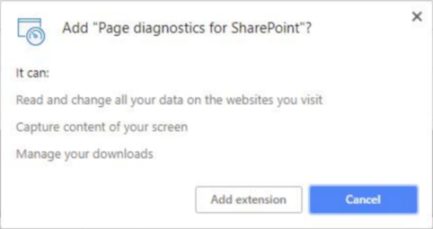

# SharePoint Online のページの診断ツールを使用してください。Use the Page Diagnostics tool for SharePoint Online

この資料では、従来のページを発行し、 **SharePoint Online**での推奨事項のサブセットに対して、従来のチーム サイト上のページを分析するため、ページの診断ツールを使用する方法について説明します。This article describes how you can use the Page Diagnostic tool to analyze your classic publishing pages and pages on classic team sites, against a subset of recommended practices in **SharePoint Online**. 
  
発行が有効になっている必要はありませんが、チーム サイトは、Cdn を使用することはできませんが、残りの規則のすべてに適用されます。発行は、発行ページの読み込み時間に悪影響を与えることと、CDN 機能を取得するだけで有効にしないように、追加のオーバーヘッドを追加します。Team sites that don't have Publishing enabled cannot make use of CDNs but all of the remaining rules are applicable. Publishing adds additional overhead so do not turn on Publishing just to get the CDN functionality as it will negatively impact page load times.
  
> [!IMPORTANT]
> ページの診断ツールはツールは、SharePoint サイトのページを確認したり、ドキュメント ライブラリまたはシステムのページに対しては実行されません。*Allitems.aspx*ページは、システム ページです。読み取ると、「このアプリケーションのみに対して実行してください SharePoint ページです」というメッセージが表示されます場合は、[システム] ページで、ツールを実行しようとすると、> The Page Diagnostics tool will not run against document libraries or system pages, as the tool is designed to review SharePoint site pages. An  *allitems.aspx*  page is a system page. If you attempt to run the tool on a system page, you will get a message that reads, "This application should only be run on SharePoint pages." > 
  
> ライブラリまたはシステムのページを評価する際の値がないため、ツールでのエラーはありません。ツールを使用してシステム以外の SharePoint ページに移動してください。に関するフィードバックを提供する必要がありますツール、[バージョン情報] タブをクリックしてください以下の[フィードバック] リンクを提供](https://go.microsoft.com/fwlink/?linkid=874109)する。This is not an error in the tool as there is no value in assessing libraries or system pages. Please navigate to a non-system SharePoint page to use the tool. Should you wish to give feedback about the tool please click the About tab and follow the [give feedback link](https://go.microsoft.com/fwlink/?linkid=874109). 
  
## ページの診断ツールを使用する方法How to use the Page Diagnostic tool

1. クロムのブラウザーを使用すると、[ツールへのリンク](https://chrome.google.com/webstore/detail/inahogkhlkbkjkkaleonemeijihmfagi)を直接開くまたは[クロム ブラウザー WebStore](https://chrome.google.com/webstore/search/page%20diagnostics%20for%20sharepoint)で検索を開くし、ブラウザー拡張機能をインストールします。Using a Chrome browser, open the [link to the tool](https://chrome.google.com/webstore/detail/inahogkhlkbkjkkaleonemeijihmfagi) directly or open the Search in the [Chrome Browser WebStore](https://chrome.google.com/webstore/search/page%20diagnostics%20for%20sharepoint) and install the browser extension. 
    
    ストア内の [説明] ページで指定されたユーザーのプライバシー ポリシーを確認してください。Please review the User Privacy Policy provided on the description page in the store.
    
    ツールをお使いのブラウザーに追加すると、表示されます、次のアクセス許可を確認します。When adding the tool to your browser, you will see the following permissions notice.
    
    
  
    この通知が設定されて、ページが web パーツとページのカスタマイズによって、SharePoint 以外の場所からコンテンツを含めることがあるためです。したがって、ツールは要求と応答 [スタート] ボタンがクリックされたときに、SharePoint のアクティブなタブに対してのみこのツールを実行しています。その情報は web ブラウザーでローカルにキャプチャされ、ツールでの JSON のリンクへのエクスポートで使用できます。**情報がないに送信または Microsoft によってキャプチャされます**。This notice is in place because a page may contain content from locations outside of SharePoint depending on the webparts and customizations on the page. This means that the tool will read the requests and responses when the start button is clicked and only for the active SharePoint tab where the tool is running. That information is captured locally by the web browser and is available to you via the Export to JSON link in the tool. **The information is not sent to or captured by Microsoft.**
    
    > [!IMPORTANT]
    > マイクロソフトは、アクセスした web サイトまたはデータを読み取れません、すべての個人情報、このツールを使用して web サイトまたはダウンロードの情報は収集しません。ツールによって記録された情報は、テナントの名前をルールの数、およびツールを実行するときにログ記録のサポート オプションを利用されているかどうか。この情報は、マイクロソフトとサポートのログ記録機能が悪用されないことを確認するのには、お客様にとってどのような課題が発生しているかを分析します。Microsoft does not read the data or websites you visit, and we do not capture any personal information, website or download information with this tool. The only information logged by the tool is the Tenant name, Rule count and whether the support logging option has been utilized when the tool is run. This information is for Microsoft to analyze what challenges are being experienced by our Customers and to ensure the Support logging capability is not being misused.
  
ツールは、マイクロソフトのプライバシー ポリシー アクセス[は、ここ](https://go.microsoft.com/fwlink/p/?linkid=857875)に努めています。The tool respects the Microsoft Privacy policy accessible [here](https://go.microsoft.com/fwlink/p/?linkid=857875). 
  
    The "Export to JSON" functionality in the tool is also why the "Manage your downloads" permission is needed. Please follow your Company's own Privacy guidelines before sharing the JSON file outside of your Company as it contains the URL's and they fall within PII (Personally Identifiable Information).
    
2. (省略可能)クロム incognito モードでツールを使用する場合は、拡張機能に移動し、"incognito を許可する] をクリックします。(Optional) If you want to use the tool in Chrome incognito mode, navigate to the extension and click "allow in incognito".
    
3. SharePoint Online のことを確認するには SharePoint のクラシック発行ページに移動します。Navigate to the SharePoint classic publishing page on SharePoint Online that you would like to review.
    
    > [!IMPORTANT]
    > 「遅延読み込み」のことが許可されているページ上の項目のそのため、**ツールは自動的に停止されません**。コレクションを停止する場合は、**停止**をクリックすることができます。(これは意図されたすべてのページ読み込みのシナリオに対応するために)We have allowed for "delay loading" of items on pages; therefore, the **tool will not stop automatically**. Should you wish to stop collection, you can click **Stop**. (This is by design to cater for all page load scenarios) 
  
**停止**] をクリックする前に、ネットワークのトレース データが終了したことを確認します。それ以外の場合、一部のトレースが得られます。Before you click **Stop**, make sure that the network trace data is complete. Otherwise, you will have a partial trace. 
  
このツールは、ブラウザー拡張、また、複数のタブやウィンドウを開くときのみを許可する同時に実行するツールの 1 つのアクティブなインスタンスです。これは、ブラウザーの拡張機能の制限です。Additionally, the tool is a Browser Extension, and opening multiple tabs or windows will only allow one active instance of the tool to be run at one time. This is a limitation of extensions in the browser. 
  
4. 拡張子のロゴをクリックします。Click on the Extension logo  次の拡張機能のポップアップ ウィンドウのツールとしてロードするが表示されます。to load the tool and you will be presented with the following extension popup window: 
    
    
  
    開始および停止操作後をクリックすると、ページが再読み込みを開始し、コレクションの基本的な概念が開始されます。Start and stop operations follow the basic concept of when you click start the page will reload and collection will begin.
    
5. 最初のリンクは、[**バージョン情報**] リンクであり、全般的なガイダンスが提供され、リンクを含むツールに関する詳細情報がこの資料に戻る。SharePoint のパフォーマンスの推奨事項、サード パーティ製の通知、およびツールに関するフィードバックを提供するためのオプションへの直接リンクも含まれています。The first link is the **About** link and will provide general guidance and details regarding the tool including a link back to this article. It also includes a direct link to SharePoint Performance recommendations, a Third Party notice and an option to provide feedback about the tool. 
    
6. **相関関係 ID、SPRequestDuration、SPIISLatency** **、ページのロード時間と URL**情報を確認します。(ここでは情報提供し、いくつかの目的で使用することができます)。Review the **Correlation ID, SPRequestDuration, SPIISLatency** **, Page load time and URL** information. (This section is informational and can be used for a few purposes.) 
    
  - **CorrelationID**は、追加の診断データを取得することが許可されているマイクロソフトのサポート チームと共同で作業するときの重要な要素です。**CorrelationID** is an important element when working with the Microsoft Support Teams as it allows them to pull additional diagnostic data. 
    
  - **SPRequestDuration**は、サーバーのページの処理にかかる時間です。この時間が長い場合は、それは必ずしも多くの API 呼び出しのすべて影響を受けますがサーバーの時間が長くなること、サーバーが実行していたも呼び出しの数を反映し、ページがサーバーにプッシュなど構造的なナビゲーションでは、大きいイメージの読み込み.**SPRequestDuration** is the server time taken to process the page. If this time is long, it does not necessarily mean that the server was performing badly but can also reflect the number of calls and load pushed by the page to the server e.g. Structural Navigation, large images, lots of API calls could all contribute to longer server time. 
    
  - **SPIISLatency**は、ページの読み込みに要求を受信したときに、Web フロント エンド サーバーで行われたミリ秒単位の時間です。これは、ページの処理を開始するのには遅延のインジケーターであり、web アプリケーションが応答するのにかかる時間は含まれません。**SPIISLatency** is the time in milliseconds taken on the Web Front End Server when it receives the request to load the page. This is an indicator of latency to start processing the page and does not include the time taken for the web application to respond. 
    
  - **ページの読み込み時間**は、応答が受信され、ブラウザーによって読み取られるときに、要求の時刻からのページで記録された時間です。追加の所要時間は、コンピューターおよびブラウザーをロードするのにかかる時間のパフォーマンスの影響を受けます。**Page load time** is the time recorded by the page from the time of the request to the time the response was received and read by the browser. Any additional time is affected by the performance of the computer and the time it takes for the browser to load. 
    
  - **URL** (汎用リソース ロケーター) は、現在のページの web アドレスです。The **URL** (Uniform Resource Locator) is the web address of the current page. 
    
7. [**診断] タブ**には、ルールが一覧表示され、いずれかのそれらが付いている赤い、ページ上の特定の問題があるし、します。The **Diagnostic tab** will list the rules and if any of them are marked with a red , then there are issues identified on the page.
    
    各ルールでは、赤のときにクリックした場合に独自の [詳細] リンクがあります。クリックすると、そのルールと、問題を修復する方法に関する背景情報です。Each rule has its own "more info" link if you click on it when it is red. That will take you to the details behind that rule and how to remediate the issue.
    
    
  
1. 標準的な実行しているユーザーを確認します。Check Running as Standard User
  
としてログインして、サービス アカウント、管理者またはサイト コレクションの管理者などアカウント特権を使用すると、ページのパフォーマンスのチェックを実行すべきです。追加のスクリプトと機能これらの種類のアカウント用に特別にロードされ、ページのパフォーマンスの表示方向を指定しません。Checking page performance should not be performed when logged in as a Service Account, Administrator or Site Collection Administrator i.e. an account with elevated privileges. Additional scripts and functionality is loaded specifically for those types of accounts and will not provide a true representation of the page performance.
    
2. SharePoint に要求数Check Requests to SharePoint
  
パフォーマンスの低下が発生する、オーバー ロードされたページと、データとサーバーへの要求の量を制限しなければなりません。このチェックでは、SharePoint に行われる要求の数を検証し、要求は 6 の要求を超えたときに指示が。ほとんどの要求はキャッシュされため、すべてのページの読み込みに対して呼び出されませんする必要があります。キャッシュでは、セットアップをする必要があり、各ユーザーのページへの呼び出しの量を減らすには、少なくとも 15 分に利用します。これは、一般的な問題とほとんどの場合データのみが変更された日ですが、ページがチェックされ、データを取得するには、各ページごとに各ユーザーは多くの場合に必要な時間です。The amount of data and requests made to the server should be limited as an overloaded page will experience poor performance. This check verifies the number of requests being made to SharePoint and will advise when the requests exceed 6 requests. Most requests should be cached and therefore not called for every page load. Cache should be setup and utilized for at least 15 minutes to reduce the amount of calls to a page by each and every User. This is a common problem and in most cases data only changes daily but the page checks and fetches data each time for each page for each user which is often unnecessary.
    
3. Cdn を使用して確認します。Check using CDNs
  
コンテンツ配信ネットワークは、ここでは、SharePoint のオンライン コンテンツ配信ネットワーク マイクロソフトと呼ばれるものが提供されています。SharePoint Cdn と、Azure で Cdn のような別の CDN サービス、および利用可能なは複数の種類があります。[次のガイダンスを使用](https://go.microsoft.com/fwlink/?linkid=873250)します。Content Delivery networks have been provided by Microsoft and the ones referred to here are the SharePoint Online Content Delivery Networks. There are multiple types available as well as different CDN services like SharePoint CDNs and then CDNs in Azure. [Use the following guidance](https://go.microsoft.com/fwlink/?linkid=873250).
    
4. 大きいイメージのサイズを確認します。Check for Large Image Sizes
  
PNG のようなより良い web の種類を使用することにより、web の画像を最適化してください。レンディションのイメージもを使用する必要があります、SharePoint で利用可能な直接。画像サイズ 100 kb が強調表示されますよりも大きなイメージのレンディションが web 用に最適化されていないとするとします。[画像の最適化は、次のガイダンスを使用](https://go.microsoft.com/fwlink/?linkid=873251)します。Images should be optimized for web by utilizing better web types like PNG. Image renditions should also be utilized and is available in SharePoint directly. Images / image renditions larger than 100kb will be highlighted as not optimized for web. [Use the following guidance for optimizing images](https://go.microsoft.com/fwlink/?linkid=873251).
    
5. 構造を移動するためのチェックCheck for Structural Navigation
  
構造のナビゲーションは、SharePoint の設置型オブジェクトのキャッシュを利用することで使用するためもともと。構造のナビゲーションは、SharePoint Online での使用はお勧めできませんし、管理ナビゲーション ウィンドウまたはカスタム プロバイダーを変更する必要があります。[ナビゲーションを最適化するため、次のガイダンスを使用します](https://go.microsoft.com/fwlink/?linkid=873247)。Structural Navigation was originally designed for use in SharePoint on-Premises where object cache could be utilized. Structural Navigation is not recommended for use in SharePoint Online and should be changed to Managed Navigation or a Custom Provider. [Use the following guidance for optimizing navigation.](https://go.microsoft.com/fwlink/?linkid=873247)
    
6. CBQ web パーツ (CBQ のコンテンツ クエリ web パーツ) のチェックCheck for CBQ WebPart (CBQ - Content by Query WebPart)
  
コンテンツ クエリ web パーツでは、ユーザーごとに、各ページの読み込みのクエリのすべてのアイテムを通過する、SQL の負荷が高いを生成します。オンプレミスのインストールとは異なりは、この web パーツを作成するために必要なクエリの数を制限する使用可能なキャッシュはありません。よう CBQ はパフォーマンスの低下と、それは使用されませんする必要がありますが全体のページのパフォーマンスに影響を与えます。コンテンツ クエリ web パーツの交換用としては、コンテンツ検索 web パーツ (CSWP) を使用してください。[コンテンツ検索 web パーツに関連する次のガイダンスを使用](https://go.microsoft.com/fwlink/?linkid=873245)します。The Content by Query WebPart generates a high SQL load as it traverses all items in the query for each and every page load, for each User. Unlike an on-Premises installation, there is no cache available to limit the number of queries needed to populate this WebPart. As such CBQ performs slowly and impacts overall page performance which is why it should not be utilized. Please use the Content Search WebPart (CSWP) as the replacement for the Content Query WebPart. [Use the following guidance related to the Content Search WebPart](https://go.microsoft.com/fwlink/?linkid=873245).
    
8. **ネットワーク トレース] タブ**が用意されています。 受信した応答と同様に、ページを作成する要求に関する詳細情報です。要求と応答のパフォーマンスは、色別コード付きページの全体的なパフォーマンスなどの緑に与える影響に基づいて\<500 ミリ秒、500、1000 ミリ秒と赤の黄色い\>1000 ミリ秒です。The **Network Trace tab** provides **** detailed information about the requests to build the page as well as the responses received. The performance of each request and response are color coded based on their impact on the overall page performance i.e. Green \< 500ms, Yellow 500-1000ms and Red \> 1000ms. 
    
    このタブでは、エクスポート オプションの JSON にする場合はダウンロードして、要求と応答の詳細を共有します。On this tab there is an Export to JSON option should you wish to download and share the request and response details.
    
    > [!IMPORTANT]
    > 短縮 URL の完全な URL を表示するのには上に置きます。Hover over the shortened URL to view the complete URL. 
  
    
  
    このイメージに赤いページ自体は、常に表示されます赤いでページが読み込まれる場合を除き、 \< 1000 ミリ秒 (1 秒など)。In this image the Red is the page itself and that will always show red unless the page loads in \< 1000ms (i.e. 1 second).
    
    いくつかの場合*があります時間または色指標を表示しない項目は、ブラウザーによって既にキャッシュされているため*です。正しくこれをテストするには、ページを開き、ブラウザーのキャッシュをオフにし、最初のページの読み込みの真の反射をして、「コールド」ページ読み込み強制的には、[**開始**] をクリックします。これは、必要がありますしと比較する [中] ページの読み込みページでキャッシュされてどのような項目を決定することができます。In some cases  *there will be no time or color indicator because the items have already been cached by the browser*  . To test this correctly, open the page, clear browser cache, and then click **Start** as that will force a "cold" page load and be a true reflection of the initial page load. This should then be compared to the "warm" page load as that will also help determine what items are being cached on the page. 
    
9. 開発者、またはサポート担当者に、これらの詳細や情報を共有する場合は、上のイメージに"JSON にエクスポート] をクリックすることができ、結果をダウンロードします。ファイル、開けることを JSON ファイル ビューアーを使用して注意してください。If you wish to share these details or information with your developers or a Support person then you can click "Export to JSON" as per the above image and that will download the results. Please note that the file can then be opened using a JSON file viewer.
    
    > [!IMPORTANT]
    > これらの結果の URL が含まれ、PII (個人情報) を含んでいるし、その情報を配布する前に、会社のガイドラインに従ってください。These results will contain the URL's and therefore contains PII (Personally Identifiable Information) and you should follow your Company guidelines before distributing that information. 
  
10. パフォーマンスのサポート案件を直接操作するときにのみ使用する必要がありますを**マイクロソフトのサポートのレベルの機能**が付属しています。この機能を利用するがメリットを得るない弊社サポート チームに使用するとします。大幅に時間がかかるページに実際にするには、「悪用」サービスの機能の継続的な使用を考慮する可能性があります。サービスのログに追加情報を追加すると、ツールでこの機能を使用すると、追加情報はありません。We have included a **Microsoft Support level feature** that should only be utilized when working directly on a Support Case for performance. Utilizing this feature will provide no benefit to you when used without our Support team. It will in fact make the page perform significantly slower and continued use of the feature may be considered "misuse" of the service. There is no additional information when using this feature in the tool as the additional information is added to the logging in the service. 
    
    変更が表示されていないことが通知されますを有効にして、ページのパフォーマンスが大幅に低下することを除いて 2-3 倍を有効にしつつ、パフォーマンスが低下します。特定のページとそのアクティブなセッションに関連することのみできます。このため、このときに限って使ってくださいと、サポート チームにアクティブな場合にのみ従事します。No change is visible except that you will be notified that you have enabled it and your page performance will be significantly degraded by 2-3 times slower performance whilst that is enabled. It will only be relevant for the particular page and that active session. For this reason, this should be used sparingly and only when actively engaged with our Support Team.
    
    有効に機能してくださいツールを開き、alt キーを押し、shift キーを押し-L が表示されますがの使用を有効にするサポートのレベルのログ記録」です。ページを再読み込みし、分析するためのサポートの詳細ログを生成する] チェック ボックスとをクリックしを開始するをクリックします。To enable the feature please open the tool and use ALT-Shift-L which will then display "Enable support level logging". Click the checkbox and then click start to reload the page and generate verbose logging for Support to analyze.
    
    
  
    サポート チームが必要な情報を抽出するには、その番号を利用し、これは重要な要素は、CorrelationID です。CorrelationID をコピーしてサポートを提供する包括的な ID に必要な作業を行うことができません。An important element for this is the CorrelationID as the Support team will then utilize that number to extract the information needed. Please copy the CorrelationID and provide that to Support as they cannot perform the required work without the complete ID.
    

