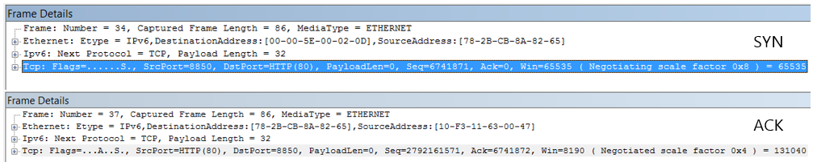
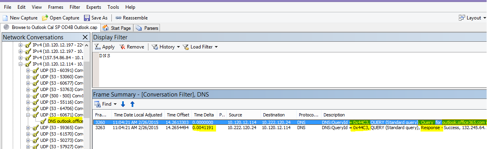

# Office 365 のパフォーマンスに関するトラブルシューティングの計画

特定し、遅れて、ハング、および SharePoint のオンラインのビジネス、Exchange Online では、Skype のビジネス オンラインでは、OneDrive、クライアント コンピューターの間でパフォーマンスの低下を解決するための手順を理解する必要がありますか。サポートに連絡する前に、Office 365 のパフォーマンスに関する問題のトラブルシューティングを行うし、もいくつかの最も一般的な問題を解決するをこの資料に役立ちます。
  
この資料では、実際にアクション計画の例ですので、パフォーマンスの問題に関する貴重なデータをキャプチャする使用することができますが発生します。いくつか上の問題は、この資料にも含まれます。
    
経験がない場合、ネットワーク パフォーマンスや、クライアント マシンと Office 365 の間のパフォーマンスを監視するための長期的な計画を作成するのに、 [Office 365 のパフォーマンスのチューニングとトラブルシューティングに管理者、IT プロフェッショナル](performance-tuning-using-baselines-and-history.md)を見てください。
  
## サンプル パフォーマンス トラブルシューティング ・ アクション ・ プラン

このアクション ・ プランには、ふたつの部分が含まれています。準備フェーズでは、およびログのフェーズです。今、パフォーマンスに問題があるデータのコレクションを実行する必要がある場合は、この計画をすぐに使用を開始できます。
  
 **クライアント コンピューターを準備します。**
  
- パフォーマンス上の問題を再現できるクライアント コンピューターを検索します。このコンピューターは、トラブルシューティングの過程で使用されます。
    
- テストするときに準備することで発生するパフォーマンスの問題を発生させる手順をメモします。
    
- 収集と情報を記録するためのツールをインストールします。
    
  - [ネットワーク モニターの 3.4](https://www.microsoft.com/en-us/download/details.aspx?id=4865)をインストール (または同等のネットワーク トレース ツールを使用)。 
    
  - [HTTPWatch](https://www.httpwatch.com/download/)の無料の基本的なエディションをインストール (または同等のネットワーク トレース ツールを使用)。 
    
  - 画面レコーダーを使用するかには、Windows vista 以降では、テスト中に実行する手順の記録を保持するためにステップ記録ツール (PSR.exe) を実行します。
    
 **ログ、パフォーマンスの問題**
  
- すべての不要なインターネット ブラウザーを閉じます。
    
- ステップ記録ツールで、または別の画面レコーダーを起動します。
    
- ネットワーク モニターのキャプチャ (またはネットワーク トレース ツール) を起動します。
    
- Ipconfig/flushdns を入力してコマンド ・ ラインからクライアント コンピューターの DNS キャッシュをクリアします。
    
- 新しいブラウザー セッションを開始し、HTTPWatch をオンにします。
    
- オプション: Exchange Online をテストするが場合、は、Office 365 の管理コンソールから Exchange クライアント パフォーマンス ・ アナライザー ツールを実行します。
    
- パフォーマンス問題が発生する正確な手順を再現します。
    
- ネットワーク モニター、またはその他のツールのトレースを停止します。
    
- コマンド ・ ラインで次のコマンドを入力し、し、ENTER キーを押して、Office 365 サブスクリプションの経路を追跡を実行します。
    
    `tracert \< *subscriptionname*  \>.onmicrosoft.com` 
    
- ステップ記録ツールを停止し、ビデオを保存します。キャプチャし、良くも悪くもパフォーマンスを説明するかどうかの日時を含めることを確認します。
    
- トレース ファイルを保存します。もう一度、必ず日付と時刻のキャプチャとするかどうか良くも悪くもパフォーマンスを示します。
    
この資料に記載されているツールを実行するに慣れていない場合は、心配するこれらの手順を次に提供されています。この種のネットワーク キャプチャを実行することに慣れて場合は、[ベースラインを収集する方法](performance-tuning-using-baselines-and-history.md#how-to-collect-baselines)、フィルタ リングとログの参照方法について説明を省略できます。 
  
## 最初に DNS キャッシュをフラッシュします。

なぜでしょうか。DNS キャッシュをフラッシュしてから、テストを開始しています。キャッシュをオフにしている、最新のエントリを DNS のリゾルバーの内容をリセットします。フラッシュにホスト ファイルのエントリが削除されないことに注意してください。ホスト ファイルのエントリを頻繁に使用する場合別のディレクトリ内のファイルにこれらのエントリをコピーし、ホスト ・ ファイルを空にしてください。
  
 **DNS リゾルバー キャッシュをフラッシュします。**
  
1. コマンド プロンプトを開きます (**スタート**か、 \> **を実行** \> **cmd**または**Windows キー** \> **cmd**)。
    
2. 次のコマンドを入力し、ENTER キーを押します。`ipconfig /flushdns`
    
## ネットワーク モニター

マイクロソフトのネットワーク監視ツール ([Netmon](https://www.microsoft.com/download/details.aspx?id=4865)) は、パケットは、ネットワーク上のコンピューター間を通過するトラフィックを分析します。Office 365 をキャプチャすることができます表示、トラフィックのトレースしパケットのヘッダーを読み取り、間にあるデバイスを識別する、ネットワークのハードウェア上で重要な設定を確認するには、ネットワーク モニターを使用して、ドロップされたパケットは、検索し、企業内のコンピューター間のトラフィック フローに従い、ネットワークと Office 365。トラフィックの実際の本文が暗号化されているので、つまり、(SSL や TLS を使用してポート 443 での旅を読むことができません、ファイルが送信されます。代わりに、パスに問題の現象を追跡することができますパケットがフィルター処理されていないトレースを取得します。
  
この時点でフィルターを適用しないことを確認します。代わりに、手順を実行し、トレースを停止して、保存する前に問題を再現します。
  
Netmon 3.4 をインストールすると、ツールを起動し、これらの手順を実行します。
  
 **Netmon トレースを実行し、問題を再現**
  
1. 3.4 のネットワーク モニターを起動します。
    
    **スタート**ページには 3 つのペインがあります:**最新のキャプチャ**、**ネットワークの選択]**、および Microsoft ネットワーク モニターの 3.4 の概要の**です。注意**。ネットワークの選択] パネルも提供されます一連の既定のネットワークをキャプチャすることができます。ネットワーク カードがここで選択されていることを確認します。
    
2. **新しいキャプチャ**を**開始**] ページの上部にあるをクリックします。**1 のキャプチャ**と呼ばれる、**スタート**ページ タブの横に新しいタブが追加されます。
    
    
  
3. 単純なキャプチャを実行するには、ツールバーの [**開始**] をクリックします。 
    
4. パフォーマンス上の問題を表示する手順を再現します。
    
5. [**停止**] をクリックして\>**ファイル** \> **として保存**します。日付とタイム ゾーンの時刻を指定して、不良であるか、または適切なパフォーマンスを示すかどうかは言うまでも注意してください。
    
## HTTPWatch

[HTTPWatch](https://www.httpwatch.com/download/)には、充電と無料版です。無料の基本的なエディションでは、このテストに必要なものすべてについて説明します。HTTPWatch モニターは、ブラウザー ウィンドウから直接トラフィックとページの読み込み時間をネットワークします。HTTPWatch は Internet Explorer のパフォーマンスを視覚的に説明するプラグインです。解析を保存して、HTTPWatch Studio で表示します。 
  
> [!NOTE]
> Google のクロム、Firefox などの別のブラウザーを使用する場合、または HTTPWatch を Internet Explorer にインストールできない場合は、新しいブラウザー ウィンドウを開くし、キーボードの f12 キーを押します。お使いのブラウザーの下部にあるポップアップの開発者ツールを参照してくださいする必要があります。Opera を使用する場合 Web インスペクターの CTRL + SHIFT + I を押して、 **[ネットワーク**] タブをクリックし、以下のテストが完了します。情報はわずかに異なるになりますが、読み込み時間をミリ秒単位で表示されます。> HTTPWatch は、SharePoint Online のページの読み込み時間の問題を非常に有用なもあります。 
  
 **HTTPWatch を実行し、問題を再現**
  
1. HTTPWatch はブラウザーのプラグイン、ブラウザーのツールを公開することは、Internet Explorer のバージョンごとに若干異なります。通常、Internet Explorer ブラウザーのコマンド バーの下、HTTPWatch を検索できます。 チェック、ブラウザーのバージョンでヘルプをクリックして、ブラウザー ウィンドウで、HTTPWatch プラグインが表示されない場合、\>歯車記号および Internet Explorer に関する、または、新しいバージョンの Internet Explorer で、] をクリックします。**コマンド**バーを起動するに Internet Explorer のメニュー バーを右クリックし、**コマンド バー**] をクリックします。以前は、HTTPWatch が関連付けられているコマンドと、エクスプ ローラー バーの両方で、1 回インストールすると、**ツール**、およびツールバー アイコンの確認 (コンピューターを再起動後もアイコンがすぐに表示されない場合。ツールバーをカスタマイズすることができます、オプションを追加できることに注意してください。 
    ![コマンド ツールバーを Internet Explorer の HTTPWatch] アイコンを表示します。](media/198590b0-d7b1-4bff-a6ad-e4ec3a1e83df.png)
  
2. HTTPWatch に Internet Explorer のブラウザー ウィンドウを起動します。ブラウザー ウィンドウの下部にドッキングされて表示されます。[**レコード**] をクリックします。
    
3. パフォーマンスの問題に関連する正確な手順を再現します。HTTPWatch に [**停止**] ボタンをクリックします。 
    
4. HTTPWatch または**電子メールで送信**、**保存**します。日付と時刻の情報と、ウォッチに良くも悪くもパフォーマンスのデモが含まれているかどうかを示す値を含むファイルの名前を覚えておいてください。 ![Office 365 ホームページのページ読み込み用の [ネットワーク] タブを示す HTTPWatch。](media/021a2c64-d581-49fd-adf4-4c364f589d75.PNG) 
    HTTPWatch のプロフェッショナル ・ バージョンは、このスクリーン ショットです。プロフェッショナル ・ バージョンと、コンピューターの基本的なバージョンからのトレースを表示でき、読み取ることがあります。余分な情報は、そのメソッドによって、トレースから使用可能な可能性があります。
    
## 問題ステップ記録ツール

ステップ記録ツール、または PSR.exe、発生時に問題を記録できます。非常に便利なツールは、実行するのには非常にシンプルです。
  
 **問題ステップ記録ツールの作業を記録する (PSR.exe) を実行します。**
  
1. **Start**を使用していずれかの\>**を実行** \> **PSR.exe**を入力\> **[ok]**、[ **Windows キー** ] をクリックして、または、 \> **PSR.exe**を入力\>し、ENTER キーを押します。 
    
2. PSR.exe 小さなウィンドウが表示されたら、**記録の開始**] をクリックし、パフォーマンスの問題を再現する手順を再現します。**コメントの追加**] をクリックして、必要に応じてコメントを追加することができます。
    
3. 手順が完了したら、 **[記録の停止**をクリックします。ページ レンダリングのパフォーマンスの問題が表示された場合、録画を停止する前にレンダリングするページを待ちます。 
    
4. **[保存]** をクリックします。
    

  
するには、日付と時刻が記録されます。これは、HTTPWatch、Netmon のトレースに、PSR を時にリンクし、精度のトラブルシューティングに役立ちます。日付と時刻を PSR のレコードの 1 分が渡されることを表示できます、ログイン名と URL と、サイト管理者の部分的なレンダリングの例を参照の間です。
  
## トレースを読み取り

他の記事を使用して把握する必要があり、ネットワークのパフォーマンスのトラブルシューティングに関するすべての講義を行うことはありません。経験と知識、ネットワークの動作し、通常の実行のパフォーマンスを適切に対処がかかります。切り上げるには一番上の問題の一覧と、どのツールしやすく最も一般的な問題を解決するを表示することができます。
  
Office 365 サイトのネットワーク トレースの読み取りのスキルを選択する場合は、定期的にページの読み込みのトレースを作成し、読み取ることの経験を積むよりも優れた先生はありません。などの可能性がある場合は、Office 365 サービスを読み込むし、プロセスをトレースします。DNS トラフィックの場合は、トレースをフィルター処理するか、参照するサービスの名前の FrameData を検索します。サービスが読み込まれるときに発生する手順を理解するためのトレースをスキャンします。これによって、どのような通常の学習ページを読み込む必要がありますようし、特に、パフォーマンス関連のトラブルシューティングの場合にトレースを比較することができますについて説明する多くします。
  
ネットワーク モニターは、[表示] フィルター フィールドの Microsoft Intellisense を使用します。Intellisense、または、インテリジェントなコード補完は、そのトリックの位置にピリオドを入力して、すべての利用可能なオプションは、ドロップダウン選択ボックスに表示されます。場合、たとえば、TCP ウィンドウ ・ スケーリングを心配は、フィルターする方法を検索できます (次のように`.protocol.tcp.window < 100`) この方法でします。
  
![Netmon のスクリーン ショットはことを示す表示フィルター] フィールドでは、intellisense を使用します。](media/75a56c11-9a60-47ee-a100-aabdfb1ba10f.PNG)
  
Netmon のトレースでは、それらの大量のトラフィックを持つことができます。それらを閲覧した経験がない場合に、トレースを最初に開くときに過負荷状態になりますが可能性があります。最初にすることは、トレースでは、バック グラウンド ノイズからの信号を分離します。、Office 365 を比較して表示するトラフィックであります。トレース内を移動するのにを使用した場合は、このリストをしない必要があります。
  
トラフィックの本文が暗号化され、汎用的なネットワーク モニターのトレースで読み取ることができないことを示します、TLS を使用して、クライアントと Office 365 の間のトラフィックを通過します。パフォーマンス分析、パケット内の情報の詳細を知る必要はありません。ただし、パケットのヘッダーとそれに含まれる情報に非常に関心があります。
  
 **正常なトレースを取得するためのヒント**
  
- クライアント コンピューターの IPv4 または IPv6 アドレスの値を知っています。コマンド プロンプトから**IPConfig**を入力し、し、ENTER キーを押して、これを取得できます。このアドレスを知ることがトレースでは、トラフィックが、クライアント コンピューターに直接関連するかどうかをひと目で判断できます。既知のプロキシがある場合は、に対して ping を実行しても、その IP アドレスを取得します。 
    
- DNS リゾルバー キャッシュをフラッシュし、可能であれば、テストを実行している 1 つを除くすべてのブラウザーを閉じます。これを行うことができない場合は、たとえば、サポートは、クライアント コンピューターのデスクトップを表示するいくつかのブラウザー ベースのツールを使用している場合、トレースにフィルターを適用する準備ができてあります。
    
- トレースのビジーでは、使用している Office 365 のサービスを探します。しないか、ほとんど見たことの前に、トラフィック、これが役に立つの手順を使用して他のネットワークのノイズとパフォーマンスの問題を分離すること。これを行ういくつかの方法があります。直接、テストの前にまたはを使用して ping、特定のサービスの URL に、PsPing (`ping outlook.office365.com`と`psping -4 microsoft-my.sharepoint.com:443`の例については)。簡単に検索することができます (プロセス名) を指定してネットワーク モニターのトレースでは、その PsPing。検索を開始する場所が提供されます。
    
    問題の時にのみネットワーク モニター トレースを使用している場合は問題ありませんが。たとえばのようなフィルターを使用して、`ContainsBin(FrameData, ASCII, "office")`または`ContainsBin(FrameData, ASCII, "outlook")`。トレース ファイルから、フレームの数を記録することができます。右側のフレームの概要ウィンドウをスクロールし、会話 ID] 列を検索することもできます。Id がこの特定の会話も記録して後で分離した状態で見ているが示された数値があります。その他のフィルターを適用する前にこのフィルターを削除してください。
    
> [!TIP]
> ネットワーク モニターは、多くの便利な組み込みのフィルターを持っています。**表示**フィルター] ペインの上部にある [フィルターの読み込み] ボタンを実行してください。 
  

  
![Netmon のトレースは、クライアントの TCP フィルターを同じ [PSPing] コマンドを表示します。Flags.Syn 1 を = =。](media/0ae7ef7d-e003-4d01-a006-dc49bd1fcef2.PNG)
  
トラフィックでは、慣れるし、必要な情報を検索する方法について説明します。たとえば、トレースにどのパケットのように"Outlook") を使用している Office 365 サービスが最初に参照を確認するについて説明します。
    
Office 365 Outlook オンラインを取る例として、トラフィックを以下のように開始します。
  
- DNS の標準的なクエリと QueryIDs が一致する outlook.office365.com の DNS 応答します。名前解決の要求を送信するこのターンのようにどこの世界で Office 365 のグローバル DNS の時間オフセットに注意する必要があります。理想的には、世界中に途中ではなく、可能なローカルにします。(いくつかでこの後にすることがあります DNS トラフィックのオンラインのログインです)。
    
- HTTP GET 要求ステータスが報告する移動完全に (301)
    
- RWS の接続を含む RWS のトラフィックでは、要求、応答を接続してください。(これは、リモート Winsock の接続を作成するためです)。
    
- TCP SYN と TCP SYN と ACK の会話です。このスレッドの設定の多くのパフォーマンスに影響を与えます。
    
- 一連の TLS:TLS のトラフィックは、TLS ハンドシェイクと TLS 証明書の会話を実行します。(データは、SSL や TLS を使用して暗号化を注意してください)。
    
トラフィックのすべての部分が重要であり、接続には、トレースの部分が小さいため、これらの分野に注目してパフォーマンスのトラブルシューティング、という点で特に重要な情報が含まれています。十分なトラブルシューティング一般的な問題のトップ 10 のリストをコンパイルするのにはマイクロソフトの Office 365 のパフォーマンスがやったのでこれらの問題について、次にそれらのルートにあるツールを使用する方法にフォーカスします。
  
それらをインストールしていない場合、すべて準備が次の表には、いくつかのツールを使用します。可能な場合です。インストール ポイントには、リンクが用意されています。一覧には、[ネットワーク モニター](https://www.microsoft.com/en-us/download/details.aspx?id=4865) [Wireshark](https://www.wireshark.org/)などの一般的なネットワーク トレース ツールが含まれますが、およびネットワーク トラフィックをフィルタ リングするのには慣れている、慣れている場合、トレース ツールを使用します。テストしているときに注意してください。
  
-  *ブラウザーを閉じるしテストを実行しているブラウザーを 1 つ*の全体的なトラフィックをキャプチャするが低きます。少ないトレースのほうです。 
    
-  *クライアント コンピューターでは、DNS リゾルバー キャッシュをフラッシュ*- これにより、白紙のキャプチャをクリーナーのトレースを開始するとします。 
    
## いくつか上の問題

いくつかの一般的な問題に直面することと、ネットワーク トレースでそれらを検索する方法です。

### TCP ウィンドウのスケーリング

SYN に SYN/確認のレガシ クライアントまたは古いハードウェアを使用にならない TCP ウィンドウのスケーリングを利用。 適切な TCP ウィンドウのスケーリングの設定をしなくても TCP ヘッダーの既定の 16 ビット バッファーをミリ秒単位で塗りつぶします。 トラフィックを受信したクライアントが元のデータが受信されたこと、遅延が発生するまで送信を続行できません。

#### ツール:

- ネットワーク モニター
- Wireshark 

#### 何を探しています。

ネットワーク トレースでは、トラフィックを SYN の SYN と ACK を探します。 ネットワーク モニターでのようなフィルターを使用して、 `tcp.flags.syn == 1`。このフィルターは、Wireshark で同じです。  

         
すべて SYN に対しては (SYN ACK)、関連する受信確認メッセージの宛先のポート (DstPort) に一致するソース (任意) のポート番号に注意してください。 

ネットワーク接続で使用されるウィンドウ ・ スケーリングの値を表示するには、最初の SYN を展開し展開関連の SYN/確認  

  

### TCP アイドル時間の設定

従来、一時的な接続、つまり、アイドル状態の接続が終了する通常のほとんどの境界領域ネットワークが構成されています。アイドル状態の TCP セッションを終了するには、プロキシやファイアウォールが 100 ~ 300 秒より大きい値にします。これは Outlook のオンラインの問題を作成し、長期的な接続を使用してがアイドル状態かどうかです。  

プロキシによって接続が終了するか、ファイアウォール デバイスが、クライアントは情報を入手するとオンラインの Outlook を使用しようとすると、クライアント コンピューターと、しようと、繰り返し、新しいを作成する前に接続を回復します。ページのロード時に、製品、プロンプト、またはパフォーマンスの低下にハングするを参照してください可能性があります。

#### ツール:

- ネットワーク モニター
- Wireshark

#### 何を検索するには。

ネットワーク モニターでのラウンドト リップ時間オフセット フィールドを見てください。ラウンドト リップは、クライアントがサーバーに要求を送信して、応答が戻るまでの時間です。クライアントと出口ポイントの確認 (例: クライアント--\>プロキシ)、または Office 365 クライアント (クライアント -\> Office 365)。これで多くの種類のパケットを表示できます。 

たとえば、ネットワーク モニターでフィルター次のように`.Protocol.IPv4.Address == 10.102.14.112 AND .Protocol.IPv4.Address == 10.201.114.12`、または、Wireshark、 `ip.addr == 10.102.14.112 &amp;&amp; ip.addr == 10.201.114.12`。  

> [!TIP]
> トレースでは、IP アドレスが DNS サーバーに属しているかわからないでしょうか。コマンド ・ ラインで検索してみてください。[**スタート**] ボタン\>**を実行** \> **cmd**を入力するか、 **Windows キー**を押すと\>、 **cmd**と入力します。プロンプトで次のように入力します。 `nslookup <the IP address from the network trace>`。テストするには、自分のコンピューターの IP アドレスを nslookup を使用します。> マイクロソフトの IP 範囲の一覧を表示するには、 [Office 365 の Url と IP アドレスの範囲](https://technet.microsoft.com/en-us/library/hh373144.aspx)を参照してください。 

問題がある場合の予想される長い時間のオフセット (Outlook オンライン)、ここでは、表示するのには特にアプリケーション ・ データの経過を表示する TLS:TLS パケット (など、ネットワーク モニターで表示を使用してアプリケーション データのパケット`.Protocol.TLS AND Description == "TLS:TLS Rec Layer-1 SSL Application Data"`)。セッション間で時間内のスムーズな進行を参照してくださいする必要があります。オンラインの Outlook を更新するときに時間がかかるが表示された場合のリセットが送信されている高度これによる可能性があります。 

### 遅延とラウンドが作動する時間 

待ち時間は、多くの変数、そのようなエイジングのデバイスをアップグレードする、ネットワーク、およびネットワーク接続では、他のタスクによって消費されている、全体的な帯域幅の割合に多数のユーザーを追加することによって大幅な変更がメジャーです。 

Office 365 の帯域幅の計算機は[このネットワークの計画と Office 365 のパフォーマンスの調整](network-planning-and-performance.md)] ページから利用可能です。  

接続、または、ISP への接続の帯域幅の速度を測定する必要がありますか。このサイト (またはそのようなサイト) を実行してください: [Speedtest の公式サイト](https://www.speedtest.net/)、および[Pingtest](http://www.pingtest.net/)。

#### ツール:

- Ping
- PsPing
- ネットワーク モニター
- Wireshark

#### 何を検索するには。

トレースでの待機時間を追跡するために利益が得られます Office 365 にクライアント コンピューターの IP アドレスと DNS サーバーの IP アドレスを記録することです。簡単なトレースのフィルター処理するためです。プロキシを介して接続すると、クライアント コンピューターの IP アドレス、プロキシ/出口となる IP アドレス、および Office 365 の DNS の IP アドレスで、作業を容易にする必要があります。  

Outlook.office365.com に送信される ping 要求が送信されますが、要求を受信するデータ センターの名前 ping の*場合があります*商標の連続した ICMP パケットを送信するのには接続できない場合でも。PsPing (ダウンロードできる無料のツール)、および特定のポート (443) を使用すると、おそらく IPv4 を使用する (-4) が表示されます、平均 round-trip 時パケットが送信されるのです。これがこれで Office 365 サービスでは、他の Url のような`psping -4 yourSite.sharepoint.com:443`。実際には、次のように、平均すると、モデムより大きなサンプルを取得するのには ping の数を指定できます: `psping -4 -n 20 yourSite-my.sharepoint.com:443`。  

> [!NOTE]
> PsPing では、ICMP パケットを送信しません。それに対して ping を実行 TCP パケットを特定のポート上でいずれかを開くことがわかってを使用できるようにします。Office 365 は、SSL や TLS を使用しているポートの接続を試してください: 443、PsPing にします。

        

ネットワーク トレースの実行中に低速の実行中の Office 365 ページをロードした場合のネットワーク モニターまたは Wireshark のトレースをフィルター処理する必要があります`DNS`。これは、探している ip アドレスのいずれかです。  

IP アドレスを取得 (および DNS の遅延時間を見て) に、Netmon をフィルター処理するための手順を次に示します。次の使用例は、outlook.office365.com を使用しますが、SharePoint Online テナント (たとえば hithere.sharepoint.com) の URL を使用することもできます。  

1. URL に ping を実行`ping outlook.office365.com`と、結果の中に ping 要求が送信された DNS サーバーの IP アドレスと名前を記録します。 
2. ネットワーク トレースのページを開くまたはアクションを実行により、パフォーマンス上の問題、または、ネットワークをトレースする場合は、それ自体には、ping の遅延時間が長いを参照してください。 
3. Dns とフィルターのネットワーク モニターでトレースを開く (このフィルターも Wireshark で動作するが、大文字と小文字を区別`-- dns`)。次のように複数の的確でネットワーク モニターを抽出する、ping から DNS サーバーの名前がわかっているためも可能性があります:`DNS AND ContainsBin(FrameData, ASCII, "namnorthwest")`のようなこの Wireshark の dns では、フレームには、"namnorthwest"が含まれています。 応答パケットを開き、ネットワーク モニターのフレームの詳細] ウィンドウで [DNS の詳細を展開する] をクリックします。DNS 情報を Office 365 - の要求にした DNS サーバーの IP アドレスを検索します次のステップ (PsPing ツール) の IP アドレスを必要することになります。フィルターを削除する、ネットワーク モニターのフレームの概要で DNS 応答を右クリックし\>会話の検索\>DNS は、DNS クエリと応答サイド バイ サイドを参照してください。 
4. ネットワーク モニターでも、DNS の要求と応答の間で時間のオフセットの列に注意してください。次の手順、簡単にインストール、および[PsPing](https://technet.microsoft.com/en-us/sysinternals/jj729731.aspx)を使用してツールには、非常に便利ですが、ICMP は多くの場合、ファイアウォールでブロックされているためと PsPing が洗練された方法にミリ秒単位の待機時間を追跡するための両方です。PsPing は、アドレスとポート番号 (このケース開いているポート 443) への TCP 接続を完了します。 
5. PsPing をインストールします。 
6. コマンド プロンプトを開き (開始\>実行\>cmd、または Windows キーを入力\>cmd と入力します)、PsPing コマンドを実行する PsPing をインストールしたディレクトリにディレクトリを変更します。私の例で c ドライブのルート上の 'パフォーマンス' フォルダーの内容を確認できます。すばやくアクセスできる同じを行うことができます。 
7. コマンドを入力して、以前のネットワーク モニターのトレースから Office 365 の DNS サーバーの IP アドレスに対して、PsPing を作成するように--ポート番号を追加することを忘れないでください。  つまり、 `psping -n 20 132.245.24.82:445`。20 の ping のサンプリングを使用すれば、PsPing が停止したときの遅延時間の平均します。 

しようとしている Office 365 プロキシ サーバーを介して場合の手順は多少異なります。プロキシ/出口とする時間をミリ秒で、平均待機時間の値を取得するのにはプロキシ サーバーに最初の PsPing の場合とし、PsPing を実行するか、プロキシで、または (1 つを元に戻すと、Office 365) 不足している値を取得するインターネットに直接接続を持つコンピューターにします。  

プロキシから PsPing を実行する場合は、2 つのミリ秒の値が必要があります: プロキシ サーバーまたは出口点、および Office 365 にプロキシ サーバーへのクライアント コンピューターです。いる!とにかく値を記録します。  

インターネットに直接接続されている別のクライアント コンピューターで PsPing を実行する場合は、プロキシを使用せずする必要が 2 つのミリ秒の値: クライアント コンピューターがプロキシ サーバーまたは出口点、および Office 365 クライアント コンピューターです。この例では、クライアント コンピューターの値をプロキシ サーバーまたは出口のポイントに Office 365 では、クライアント コンピューターの値から減算および RTT の番号は、クライアント コンピューターから、プロキシ サーバーまたは出口ポイントする必要があるプロキシ サーバーまたは出口をポイント Office 365 です。 

クライアント コンピューターは、直接接続されているか、またはプロキシをバイパスする脆弱性による影響の場所にあります場合するかどうか、問題を再現が最初を参照してくださいして、それ以降を使用してテストできます。 

遅延、Netmon のトレースに示すようにそれらの余分な (ミリ秒) を追加できます、任意指定のセッションでは、それらの十分な場合。  

![フレームの概要に Netmon の既定の [時間差] 列が追加された、Netmon の一般的な待ち時間。](media/7ad17380-8527-4bc2-9b9b-6310cf19ba6b.PNG)

> [!NOTE]
> あなたの IP アドレスは、ip アドレスの ping は、以上のような 157.56.0.0/16 または類似の範囲を返すことがあります、ここでは、表示とは異なる可能性があります。Office 365 で使用する範囲のリストは、 [Office 365 の Url と IP アドレスの範囲](https://technet.microsoft.com/en-us/library/hh373144.aspx)を確認してください。 

、たとえば、132.245 を検索する場合は、(ボタンがこれの上部にある) のすべてのノードを展開してください。

### プロキシ認証

これだけに適用 プロキシ サーバーを経由する場合。それ以外の場合は、次の手順をスキップすることができます。正常に動作するとプロキシの認証する必要があります実行ミリ秒単位で一貫しています。(例) 使用率のピーク時に断続的なパフォーマンスの低下は表示されません。  

プロキシ認証がある場合に、情報を取得するのには Office 365 に新しい TCP 接続を行うたびに、バック グラウンドでの認証プロセスを通過する必要があります。たとえば、Outlook のオンラインでのメールを予定表に切り替えると、を認証します。SharePoint online では、メディアまたは複数のサイトまたは場所からデータにページが表示される場合を認証する各別の TCP 接続のデータをレンダリングするために必要なのです。  

オンラインの Outlook の予定表と自分のメールボックスの間で切り替えるか、SharePoint Online で表示の遅いページが読み込まれるたびに、低速の読み込み時間があります。ただし、これには記載されていないその他の現象があります。 

プロキシ認証は、外部プロキシ サーバーの設定です。Office 365 で、パフォーマンスの問題の原因となって、ネットワーク チームを参照する必要があります。  

#### ツール: 

- ネットワーク モニター
- Wireshark 

#### 何を検索するには。

認証は、プロキシは、新しい TCP セッションがサーバーからファイルや情報を要求するには、一般的または情報を提供する、スピンする必要がありますたびに配置します。たとえば、HTTP GET または HTTP POST 要求をプロキシ認証を参照してください可能性があります。トレースでは、要求を認証するか、フレームを表示する場合は、Netmon に NTLMSSP 要約 ' 列を追加し、フィルター `.property.NTLMSSPSummary`。認証に時間がかかるを参照してください、時間デルタ] 列を追加します。 

Netmon に列を追加します。 
1. 説明などの列を右クリックします。 
2. 列を選択する] をクリックします。 
3. NTLMSSP の概要] および [時刻の差分リストで見つけて追加] をクリックします。 
4. 列を移動、新しい所定の位置にする前に、または [説明] 列の背後にある、サイド バイ サイドを読み取ることができます。
5. [OK] をクリックします。 

列を追加しない場合でも、ネットワーク モニターのフィルターは機能します。トラブルシューティングはであなたの認証には、どのようなステージを参照してください、ずっと使いやすくなります。 

インスタンスのプロキシの認証に NTLM チャレンジ、またはメッセージの認証をすべてのフレームを分析することを確認してを見て、存在します。必要に応じて、トラフィックおよび検索の会話の特定の部分を右クリックし\>TCP です。これらの会話の中にデルタ値を把握します。 

        

Wireshark に示すように、4 秒の遅延はプロキシへの認証。**表示される前のフレームから時間デルタ**] 列は、フレームの詳細にある同じ名前のフィールドを右クリックし、列として追加を選択することによって行われました。          

### DNS のパフォーマンス

最適な名前解決し、最速とその実行可能なクライアントの国にします。 

DNS 名前解決が行われて海外ではページの読み込みに秒を追加できます。理想的には、100 ミリ秒未満で名前解決が行われます。行う必要がない場合は、調査をさらにします。 

> [!TIP]
> Office 365 で動作するクライアントの接続方法はわからないでしょうか。クライアント接続の参照ドキュメントを見て[ここでは](https://technet.microsoft.com/en-us/library/dn741250.aspx)。           

#### ツール: 

- ネットワーク モニター
- Wireshark
- PsPing

#### 何を検索するには。
ネットワーク トレースは通常、別のジョブは、DNS のパフォーマンスを分析します。しかし、PsPing も、または、考えられる原因を取り除くことに役立ちます。 

DNS トラフィックが TCP と UDP の要求に基づいて、その特定の応答に特定の要求に一致するように役立つ ID を使用して応答することが明白です。DNS が表示されますと、たとえば、SharePoint Online を使用して、ネットワーク名または URL web ページ上のトラフィックします。として一般に、ゾーンを転送するときにドキュメントを除くため、ネットワーク トラフィックの大部分は、UDP 経由で実行されます。 

ネットワーク モニターと Wireshark、DNS トラフィックを確認することが最も基本的なフィルターは単に`dns`。フィルターを指定するときに、小文字を使用することを確認します。クライアント コンピューターに問題を再現する開始する前に、DNS リゾルバー キャッシュをフラッシュすることを忘れないでください。などのホーム ページの低速の SharePoint Online ページ読み込みの場合は、すべてのブラウザーを閉じて、新しいブラウザーを開いて、トレースを開始、DNS のリゾルバー キャッシュをフラッシュしてくださいに SharePoint Online サイトを参照します。ページ全体が解決した後、停止し、トレースを保存する必要があります。

オフセットをここでは時刻を確認するには。することができるように、次の手順を実行してネットワーク モニター**時間デルタ**] 列を追加するのには役に立つ場合があります。 
1. 説明などの列を右クリックします。 
2. 列を選択する] をクリックします。 
3. 一覧で時間デルタを見つけて、[追加] をクリックします。 
4. 新しい列に移動します場所の前に、または [説明] 列の背後にある、サイド バイ サイドを読み取ることができます。
5. [OK] をクリックします。 

目的のクエリを検索する場合は、フレームの詳細パネルで、**会話の検索**を選択するには、そのクエリを右クリックし、それを分離することを検討してください\> **DNS**です。ネットワーク会話パネルが UDP トラフィックの特定の会話をログに記録する権利をジャンプすることを確認します。 

        

Wireshark では、DNS に列を行うことができます。トレースを実行する (またはトレースを開く) Wireshark とフィルターで`dns`、または複数の確認、 `dns.time`。任意の DNS クエリをクリックし、[詳細を表示するパネルを展開、`Domain Name System (response)`の詳細です。時刻のフィールドが表示されます (たとえば、 ` [Time: 0.001111100 seconds] `。この時間を右クリックし、**列に適用**] を選択します。こう**時間**] 列には、トレースの並べ替えを高速にします。DNS 呼び出しを確認するための値を降順で並べ替えるには、新しい列をクリックしては、解決するために最も時間かかりました。 

[Wireshark で (小文字の) dns.time でフィルター処理し、詳細からの時間を列にして昇順で並べ替えた、SharePoint Online の参照。](media/1439dcc2-12ff-4ee2-9ef3-1484cf79c384.PNG)

DNS 解決の時間をさらに調査を行う場合は、TCP によって使用される DNS ポートに対して、PsPing を実行してください (たとえば、 `psping <IP address of DNS server>:53`)。パフォーマンス上の問題が引き続き発生するか場合は、問題が解決を行うにヒットしている DNS のアプリケーション固有の問題よりも広範なネットワークを発行する可能性が高い。意味がも、もう一度、こと outlook.office365.com への ping が表示されます、Outlook のオンラインの DNS 名前解決が行われる (たとえば、outlook の namnorthwest.office365.com)。  問題特定の DNS を使用する場合は、DNS の構成とさらにこの問題を調査するように DNS フォワーダーを検討する IT 部門に連絡する必要があります。 

### プロキシのスケーラビリティ

Outlook でオンラインに Office 365 のようなサービスは、複数の長期的な接続をクライアントに付与します。したがって、各ユーザーは、寿命の延長を必要とするより多くの接続を使用することがあります。  

> [!TIP]
> 多くのユーザーを Office 365 に追加しようとしているために、帯域幅の使用を計画する必要がありますか。[Office 365 のインターネット帯域幅の使用を計画](https://technet.microsoft.com/en-us/library/hh852542.aspx)してください。ある帯域幅の計算機があります。

#### ツール:
 
数値演算  

#### 何を検索するには。 

ネットワーク トレースまたはトラブルシューティングのツールに固有です。代わりに、制限事項とその他の変数を指定した帯域幅の計算に基づいています。  

### TCP 最大セグメント サイズ

-SYN SYN と確認でください。 TCP パケットが使用可能なデータの最大量を実行するために構成されていることを確認するのには作成した、パフォーマンスのネットワーク トレースでは、このチェックを実行します。 

目標では、データを送信するため、1,460 バイトの MSS を参照してください。あなたは、プロキシの背後にあるか、NAT を使用している場合は、クライアントが NAT またはプロキシ/出口とプロキシ/出口と NAT Office 365 に最適な結果を得るのためにこのテストを実行することを忘れないでください!これらは、別の TCP セッションです。

#### ツール: 

ネットワーク モニター

#### 何を検索するには。

TCP 最大セグメント サイズ (MSS) は、SYN の SYN と ACK パケットに必要なデータが見つかることを意味する、ネットワーク トレースに 3 ウェイ ハンドシェイクのもう 1 つのパラメーターです。MSS を参照してくださいするのには実に簡単です。 

パフォーマンスのネットワーク トレースを知り、接続を検索しているを開くか、パフォーマンスの問題を示しています。 

> [!NOTE]
> トレースを見ているし、会話に関連するトラフィックを検索する必要がありますが、クライアントの ip アドレスまたはプロキシ サーバーまたは出口のポイント、またはその両方の ip アドレスでフィルター処理します。直接か、によって、トレース、およびフィルターでは、Office 365 の IP アドレスをテストしている URL に ping を実行する必要があります。 

中古のトレースを検索しますか。自分の方向を設定するのにはフィルターを使用してください。ネットワーク モニターに次のように、URL に基づく検索を実行する`Containsbin(framedata, ascii, "sphybridExample")`、フレーム番号を書き留めます。 

Wireshark でを使用して、次のように`frame contains "sphybridExample"`。(に表示されることとして、[PSH、ACK] Wireshark で) リモート Winsock (RWS) トラフィックを見つけたことを確認する場合は、RWS が接続できないことを注意してください説明したように関連する SYN の SYN と Ack、直前に表示されます。 

この時点ですることができますフレーム番号を記録して、フィルターを削除に最も近い SYN. を見て、ネットワーク モニターでネットワークの会話ウィンドウ内のすべてのトラフィック] をクリックして 

重要なは、トレースの時に、IP アドレスの情報のいずれかを受信していない場合、URL の中の検索トレース (の一部では`sphybridExample-my.sharepoint.com`、たとえば)、によってフィルターを適用する IP アドレスが提供されます。 

興味を持ち始めているトレースの接続を検索します。いずれかが IP アドレス、ネットワーク モニターでネットワークの会話ウィンドウを使用して特定の会話 Id を選択して、フィルタ リングによって、トレースをスキャンすることによってこれを行うことができます。SYN パケットが決まったら、[TCP (Netmon) または (Wireshark) で、[フレームの詳細] パネルでの伝送制御プロトコルを展開します。TCP オプションと MaxSegementSize を展開します。関連の SYN ACK フレームと TCP オプションの展開と MaxSegmentSize を検索します。2 つの値の小さい方を最大セグメント サイズとなります。この図での TCP のトラブルシューティングを行うと呼ばれるネットワーク モニターでは、組み込みの列を使用します。  

組み込みの列では、**フレームの詳細**] パネルの上部にあります。(、標準表示に切り替えるには、列をもう一度クリックしてタイム ゾーンを選択し。) 

![TCP トラブルシューティング オプション (フレームの概要の最上部) の [列] ドロップダウンの場所。](media/64fd4baa-a872-4f07-b959-752d7d37fd62.PNG)           
Wireshark でフィルター処理されたトレースは、ここで。MSS の値に固有のフィルターが ( `tcp.options.mss`)。SYN、SYN と ACK、ACK ハンドシェイクのフレームは、フレームの詳細と同等の Wireshark の下部にあるリンク (そのためフレームの ACK が 47、46 SYN-ACK へのリンク、43 の SYN へのリンク) このような作業を容易にします。 

         
選択的確認応答を確認する必要がある場合 (この行列の次のトピック) をトレースを終了しないでください。

### 選択的確認応答

SYN と SYN/確認オプションを選択受信確認 (SACK) の両方のアクセス許可では、データ パケットの再送を滑らかにするか不足しているパケットに SYN の記載を報告する SYN と確認する必要があります。デバイスでは、パフォーマンス上の問題につながることが、この機能を無効にできます。 

あなたは、プロキシの背後にあるか、NAT を使用している場合は、クライアントが NAT またはプロキシ/出口とプロキシ/出口と NAT Office 365 に最適な結果を得るのためにこのテストを実行することを忘れないでください!これらは、別の TCP セッションです。

#### ツール: 

ネットワーク モニター 

#### 何を検索するには。

選択的受信確認 (SACK) とは、SYN-ACK SYN ハンドシェイクでもう 1 つのパラメーターです。SYN の SYN と ACK のさまざまな方法は、トレースをフィルター処理できます。 

興味のいずれかのトレースをスキャンすることで表示される IP アドレス、ネットワーク モニターでネットワークの会話ウィンドウを使用して、会話 ID をクリックして、フィルター処理されるトレース内で、接続を探します。SYN パケットを見つけたら、まずは、ネットワーク モニターで TCP またはフレームの詳細セクションで Wireshark での伝送制御プロトコルを展開します。TCP オプション] を展開し、SACK。関連する SYN ACK フレームおよび TCP オプションの展開とその SACK フィールドを検索します。SACK が SYN と SYN/確認の両方で許可されていることを確認します。ネットワーク モニターと Wireshark の両方に示すように、SACK の値をここでは。

                     

### DNS の地理位置情報 

世界では、Office 365 が解決を試みますが、DNS は、接続速度の効果を呼び出します。 

オンラインの Outlook の [最初の DNS 検索が完了したら、その DNS の場所は、最も近いデータ センターへの接続に使用されます。データが保存されているデータ センター (dC) に接続するためのバックボーン ネットワークを使用する Outlook のオンライン CA サーバーに接続されます。これは高速です。

本拠地での SharePoint Online を海外出張中のユーザーへのアクセスが表示されます、作業中のデータ センター - 場所は、SPO テナントに基づいてドメイン コント ローラーは、(そのため、アメリカ合衆国の dC 場合アメリカ合衆国ベースの場合、ユーザー)。     Lync オンライン時に、2 つ以上の dC でのアクティブ ノードには。要求は、Lync オンラインの場合、マイクロソフトのために送信 DNS は、世界中の要求の送信元、決定し、Lync オンラインは、アクティブな場所最も近い地域の dC からの IP アドレスを返します。 

> [!TIP]
> クライアントが Office 365 に接続する方法の詳細を知る必要があるでしょうか。[クライアント接続](https://technet.microsoft.com/en-us/library/dn741250.aspx)の参照資料 (とその役に立つ画像) を見てください。           
#### ツール:

- Ping
- PsPing

#### 何を検索するには。

Microsoft の DNS サーバーにクライアントの DNS サーバーから名前解決の要求は、Microsoft DNS の地域データ センター (dC) の IP アドレスを返すことでほとんどの場合の結果にする必要があります。どういうことするのでしょうか。本社は、インドのバンガロールに、お使いのブラウザーは、Outlook をオンラインで要求を行う場合、米国で移動している場合は、Microsoft の DNS サーバーする必要がある IP アドレスに渡す--米国の地域のデータ センターでのデータ センター。Outlook からメールが必要な場合そのデータ転送のクイックのバックボーン ネットワーク経由でデータ センター間で。

DNS は、できるだけユーザーの場所に名前解決が行われるときに最も機能します。ヨーロッパの場合はするには、ヨーロッパでは、Microsoft DNS (理想的に)、ヨーロッパのデータ センターを扱います。DNS およびアメリカのデータ センターにヨーロッパのクライアントからのパフォーマンスは遅くなります。

か、世界では、DNS 要求がルーティングされているかを確認するのには outlook.office365.com に対して Ping ツールを実行します。ヨーロッパの場合は、outlook emeawest.office365.com のようなものからの応答を参照してくださいする必要があります。南北アメリカでは、outlook namnorthwest.office365.com のようなものを期待します。 

クライアント コンピューターでコマンド プロンプトを開きます (スタートを使用して\>を実行\>cmd または Windows キー \> cmd と入力します)。Ping outlook.office365.com を入力し、ENTER キーを押します。、を IPv4 経由で ping を実行することを指定する場合は、-4 を指定してください。ICMP パケットからの応答の取得に失敗する可能性がありますが、要求のルーティングに DNS の名前を表示する必要があります。参照する場合は、この接続のレーテンシー値 ping によって返されるサーバーの IP アドレスを PsPing してみてください。  

           
           
### Office 365 アプリケーションのトラブルシューティング

#### ツール: 

- ネットワーク モニター
- HTTPWatch
- ブラウザーでコンソールを f12 キーを押す

説明されていないネットワークに固有の「アプリケーション固有トラブルシューティングに使用するツールです。リソースを検索しますが、[このページで](https://support.office.com/en-us/article/Network-planning-and-performance-tuning-for-Office-365-e5f1228c-da3c-4654-bf16-d163daee8848)使用*できます*。
   
## 関連項目

[Office 365 エンドポイントの管理](https://support.office.com/article/99cab9d4-ef59-4207-9f2b-3728eb46bf9a)
  
[Office 365 エンドポイントの FAQ](https://support.office.com/article/d4088321-1c89-4b96-9c99-54c75cae2e6d)
  

