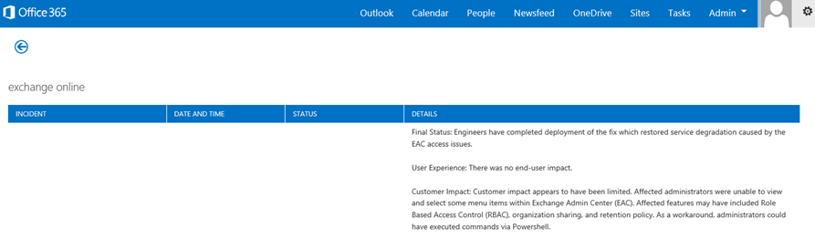

# ベースラインとパフォーマンス履歴を使用した、Office 365 のパフォーマンスのチューニングOffice 365 performance tuning using baselines and performance history

Office 365 との接続の大まかな基準を確立することがお客様のビジネスとの間の接続のパフォーマンスを確認するのにはいくつかの簡単な方法があります。コンピューターの接続、クライアントのパフォーマンスの履歴を知ることと、新たな問題を早期に検出、特定し、問題を予測することができます。There are some simple ways to check the connection performance between Office 365 and your business that will let you establish a rough baseline of your connectivity. Knowing the performance history of your client computer connections can help you detect emerging issues early, identify, and predict problems.
  
パフォーマンス上の問題での作業に使用しない場合この資料よう設計されていますを知る皆さんはこの問題は、パフォーマンス上の問題と、Office 365 サービスを受けていないようなよく寄せられる質問を検討するためでしょうか。計画方法、優れたパフォーマンスは、長期間でしょうか。パフォーマンスに目を保持するにはどうできますか。チームまたはクライアントが表示される、Office 365 を使用中にパフォーマンスの低下を気にするこれらの質問のいずれかの場合は、続けましょう。If you're not used to working on performance issues, this article is designed to help you consider some common questions, like How do you know the problem you're seeing is a performance issue and not an Office 365 service incident? How can you plan for good performance, long term? How can you keep an eye on performance? If your team or clients are seeing slow performance while using Office 365, and you wonder about any of these questions, read on.
  
> [!IMPORTANT]
> **今、クライアントと Office 365 の間でパフォーマンスの問題があるか?**[パフォーマンスのトラブルシューティング Office 365 のプラン](performance-troubleshooting-plan.md)に記載されている手順に従います。**Have a performance issue between your client and Office 365 right now?** Follow the steps outlined in the [Performance troubleshooting plan for Office 365](performance-troubleshooting-plan.md). 
    
## Office 365 のパフォーマンスについて何かを知る必要があります。Something you should know about Office 365 performance

Office 365、オートメーションではなく、実際の方が定常的に監視する能力の高い、専用の Microsoft ネットワーク内に存在します。Office 365 のクラウドを維持するための役割の一部は、ビルのパフォーマンスの調整であることを合理化することです。インターネット経由で接続するため、Office 365 のクラウドのクライアントが Office 365 サービス全体のパフォーマンスを微調整するのには継続的な努力があります。パフォーマンスの向上は、クラウドで実際に停止し、多くの正常な状態で高速にクラウドを保持することで蓄積された経験があります。場所から Office 365 への接続のパフォーマンスの問題が発生した場合、最適な開始あり、サポート ・ リクエストの待機します。代わりに、' 完全に ' からの問題を調査を開始する必要があります。ネットワーク内で起動し、理解したうえで Office 365 にします。Office 365 のサポート案件を開く前に、データを収集し、探索は、および問題が解決、アクションを実行します。Office 365 lives inside a high-capacity, dedicated Microsoft network that is steadily monitored not just by automation, but by real people. Part of the role of maintaining the Office 365 cloud is building-in performance tuning and streamlining where it's possible. Since clients of the Office 365 cloud have to connect across the Internet, there is a continuous effort to fine-tune the performance across Office 365 services too. Performance improvements never really stop in the cloud, and there is a lot of accumulated experience with keeping the cloud healthy and quick. Should you experience a performance issue connecting from your location to Office 365, it's best not to start with, and wait on, a Support case. Instead, you should begin investigating the problem from 'the inside out'. That is, start inside of your network, and work your way out to Office 365. Before you open a case with Office 365 Support, you can gather data and take actions that will explore, and may resolve, your problem.
  
> [!IMPORTANT]
> キャパシティ ・ プランニングと Office 365 の制限に注意します。その情報をインストールする曲線よりパフォーマンスの問題を解決しようとしています。ここでは、 [Office 365 のプラットフォーム サービスの説明](https://technet.microsoft.com/en-us/library/office-365-service-descriptions.aspx)へのリンクです。これは、中央のハブであり、ここから独自のサービスの説明へのリンクを Office 365 から提供されるすべてのサービスがあります。つまり、SharePoint Online の標準的な制限を確認する必要がある必要がありますなどと[SharePoint のオンライン サービスの説明](https://technet.microsoft.com/en-us/library/sharepoint-online-service-description.aspx)をクリックして、 [SharePoint のオンラインの制限] セクション](https://go.microsoft.com/fwlink/p/?LinkID=856113)に移動します。Be aware of capacity planning and limits in Office 365. That information will put you ahead of the curve when trying to resolve a performance issue. Here's a link to the [Office 365 Platform Service Description](https://technet.microsoft.com/en-us/library/office-365-service-descriptions.aspx). This is a central hub, and all the services offered by Office 365 have a link that goes to their own Service Descriptions from here. That means, should you need to see the standard limits for SharePoint Online, for example, you would click [SharePoint Online Service Description](https://technet.microsoft.com/en-us/library/sharepoint-online-service-description.aspx) and locate its [SharePoint Online Limits section](https://go.microsoft.com/fwlink/p/?LinkID=856113). 
  
理解したうえでトラブルシューティングを開始するかどうかを確認のパフォーマンスは、段階的の使用の値を実現し、恒久的に維持することはありません (これはの採用などの高帯域幅のたまと思われる場合、多数のユーザー、または、非常にストレスになります--ので予定はパフォーマンスへの影響を大規模なデータ移行を行う)。、して、パフォーマンスの目標について大まかに理解がある必要があります、ですが、変数の再生のパフォーマンスを、そのため、パフォーマンスの多くが異なります。パフォーマンスの性質です。Make sure you go into your troubleshooting with the understanding that performance is a sliding scale, it's not about achieving an idealized value and maintaining it permanently (if you believe this is so, then occasional high-bandwidth tasks like on-boarding a large number of users, or doing large data migrations will be very stressful -- so do plan for performance impacts then). You can, and should, have a rough idea of your performance targets, but a lot of variables play into performance, therefore, performance varies. That's the nature of performance. 
  
パフォーマンスのトラブルシューティングに関する特定の目標を達成されていないし、それらの数値を無期限に維持するには、すべての変数を指定した既存の活動を向上させるは。Performance troubleshooting isn't about meeting specific goals and maintaining those numbers indefinitely, it's about improving existing activities, given all the variables. 
  
## さぁ、何がパフォーマンス上の問題のようになりますでしょうか。Okay, what does a performance problem look like?

最初に、発生しているが実際にパフォーマンスの問題と、サービスを受けていないかどうかを確認する必要があります。パフォーマンス上の問題は、Office 365 のサービスのインシデントとは異なります。離れたことを確認する方法ここでは。First, you need to make sure that what you are experiencing is indeed a performance issue and not a service incident. A performance problem is different from a service incident in Office 365. Here's how to tell them apart.
  
Office 365 サービスで問題が発生している場合、サービスの問題です。Office 365 の管理センターでの**現在の状態**の下の赤または黄色のアイコンが表示されます、Office 365 に接続するクライアント コンピューターでパフォーマンスの低下を表示することもあります。たとえば、現在の稼働状態が赤のアイコンを報告すると、Exchange の横にある**Investigating**を参照してください、し、受け取ることも一連の呼び出しの Exchange Online を使用して、クライアントのメールボックスが正しく実行されていると文句を言う、組織の人からです。その場合は、するが妥当、オンラインの Exchange のパフォーマンスだけサービス内の問題の犠牲者になったことを想定しています。If the Office 365 service is having issues, that's a service incident. You will see red or yellow icons under **Current health** in the Office 365 admin center, you may also notice slow performance on client computers connecting to Office 365. For example, if Current health reports a red icon and you see **Investigating** beside Exchange, you might then also receive a bunch of calls from people in your organization who complain that client mailboxes that use Exchange Online are performing badly. In that case, it's reasonable to assume that your Exchange Online performance just became a victim of issues within the Service. 
  

  
この時点で、Office 365 の管理者、確認してください**現在状態**とし**詳細を表示し履歴**、多くの場合、システム上で実行してメンテナンスを最新の状態にします。**現在の稼働状態**のダッシュ ボードを変更して、サービスの問題に関する最新情報にしました。ノートと病歴、管理者、管理者に説明があるへの影響を測定するためにし、継続的な作業が投稿します。At this point, you, the Office 365 admin, should check **Current health** and then **View details and history**, frequently, to keep up to date on maintenance we perform on the system. The **Current health** dashboard was made to update you about changes to, and problems in, the service. The notes and explanations written to health history, admin to admin, are there to help you gauge your impact, and to keep you posted about ongoing work. 
  

  
パフォーマンス上の問題は場合でも、問題は性能が低下することができます、サービス ・ インシデントはありません。パフォーマンス上の問題は、次のようになります。A performance issue isn't a service incident, even though incidents can cause slow performance. A performance issue looks like this:
  
- パフォーマンス上の問題は、サービスのレポート作成は、Office 365 管理者センター**現在の稼働状態**に関係なく発生します。A performance issue occurs no matter what the Office 365 admin center **Current health** is reporting for the service. 
    
-  比較的シームレスに動作を完了するのには時間がかかるか、完了することはありません。A behavior that used to be relatively seamless takes a long time to complete or never completes. 
    
- すぎて、問題を複製することができますか、右の一連の手順を実行する場合に発生するがわかって、少なくとも。You can replicate the problem too, or, at least, you know it will happen if you do the right series of steps.
    
-  問題が断続的な場合は、まだパターンがあるなどと知っている 10時 00分 AM で、Office 365 を確実にアクセスできないユーザーからの呼び出しを持つ、正午の周り命を呼び出し。If the problem is intermittent, there is still a pattern, for example, you know that by 10:00 AM you will have calls from users who can't reliably access Office 365, and that the calls will die down around noon. 
    
これは、可能性がありますような。非常に理解します。これはパフォーマンスの問題がわかったら、質問になると、「どうすれば次にしますか?」この資料の残りの部分では、正確であると判断できます。This probably sounds familiar; maybe too familiar. Once you know it's a performance problem, the question becomes, "What do you do next?" The rest of this article helps you determine exactly that.
  
## 定義し、パフォーマンスの問題をテストする方法How to define and test the performance problem

実際の問題を定義するのには困難であることができますので、時間の経過と共にパフォーマンスの問題が浮上ことがよくあります。適切な問題の説明と、問題のコンテキストのことをお勧めを作成する必要があり、しする必要があります反復可能なテスト手順を実行する日に勝利します。それ以外の場合、独自の障害がない、使用するが失われます。なぜでしょうか。では、十分な情報が提供されない問題のステートメントの例をいくつか以下に示します。Performance issues often emerge over time, so it can be challenging to define the actual problem. You need to create a good problem statement and a good idea of issue context, and then you need to repeatable testing steps to win the day. Otherwise, through no fault of your own, you may be lost. Why? Well, here are some examples of problems statements that don't provide enough information:
  
- なんらかの表示がされていない、ために、受信トレイから個人用の予定表に切り替えると、休憩時間になっています。でく動作をするように使用されることと同じようにしますか。Switching from my Inbox to my Calendar used to be something I didn't notice, and now it's a coffee-break. Can you make it act like it used to?
    
- SharePoint Online に自分のファイルをアップロードしていますが永久にかかっています。なぜ、午後は他の任意の時間に時間がかかり、それが高速ですか?ことはできませんそれだけ高速ですか。Uploading my files to SharePoint Online is taking forever. Why is it slow in the afternoon, but any other time, it's fast? Can't it just be fast?
    
上記の問題のステートメントによってもたらされるいくつかの大きな課題があります。具体的に対処するためのあいまいさの多くがあります。例えば：There are several large challenges posed by the problem statements above. Specifically, there are a lot of ambiguities to deal with. for example:
  
- 明確ではありません受信トレイと予定表の間で切り替えを使用する方法、ラップトップ コンピューターで動作します。It's unclear how switching between Inbox and Calendar used to act on the laptop.
    
- ユーザーは、次の質問をすると「することはできませんそれだけ高速」、「高速」は何ですか。When the user says, "Can't it just be fast", what's "fast"?
    
- 期間「永久に」でしょうか。いくつかの秒または分、ことがユーザーには、昼食や、ユーザーが返された後、10 分をそれが完了するわけですか。How long is "forever"? Is that several seconds, or minutes, or could the user go to lunch and it would finish up ten minutes after the user got back?
    
管理とトラブルシューティング ツールを上記のような問題のステートメントからの多くの詳細に注意してくださいできないことを考慮することがなく、これだけです。たとえば、起動時の問題です。ホーム ネットワークの中に低速の切り替えが表示される、ユーザーが自宅からとだけ動作します。ユーザーがローカルのクライアントまたはユーザーにいくつか他のメモリ負荷の高いアプリケーションを実行する必要があります、古いオペレーティング システムを実行しているか、最新の更新プログラムを実行していません。All of this is without considering that the admin and troubleshooter can't be aware of many details from problem statements like these. For example, when the problem started happening; That the user works from home and only ever sees slow switching while on a home network; That the user must run several other RAM intensive applications on the local client, or the user is running an older operating system or hasn't run recent updates.
  
ユーザーは、パフォーマンスの問題を報告するときは、多くの情報を収集します。スコープの問題、または調査することと呼ばれるプロセスの一部は、この情報を収集します。に関するパフォーマンスの問題についての情報を収集するために使用することができます基本的なスコープの一覧を次に示します。このリストは網羅ではありませんが、独自のいずれかを開始する場所です。When users report a performance problem, there's a lot of information to collect. Collecting this information is part of a process called scoping the issue, or investigating it. The following is a basic scoping list you can use to collect information about your performance issue. This list is not exhaustive, but it's a place to start one of your own: 
  
- どの日に起こると昼夜を問わずにどのような問題をしましたか。On what date did the issue happen, and around what time of day or night?
    
- クライアント コンピューターの種類に使用していたとはそれに接続する方法、ビジネス ネットワーク (VPN、ワイヤード (有線)、ワイヤレス) でしょうか。What kind of client computer were you using, and how does it connect to the business network (VPN, Wired, Wireless)?
    
- 作業してリモートでオフィスにいたか。Were you working remotely or were you in the office?
    
- でした別のコンピューターで同じアクションを実行してくださいし、同じように動作しますか。Did you try the same actions on another computer and see the same behavior?
    
- 機能が提供されて、問題を実行する操作を記述することができるようにする手順を説明します。Walk through the steps that are giving you the trouble so that you can write the actions you take down.
    
- パフォーマンスは、数秒または数分でどのように時間がかかるのですか。How slow in seconds or minutes is the performance?
    
- 世界中のお客様の所在しますか。Where in the world are you located?
    
これらの質問のいくつかは、他のユーザーよりも明確です。トラブルシューティングには、問題を再現する正確な手順が必要なほとんど全ての人を理解できます。結局のところ、その他の方法を何が悪い、記録でき、その他の方法、問題が修正された場合にテストするか。にくいもののように"日付し、時刻の何を行いましたか問題を参照してくださいですか?」と世界ではどこに配置するか?"、2 人乗りで使用できる情報です。によって、ユーザーが機能していた、いくつかの時間の時間差がありますメンテナンスが既に実行中、会社のネットワークの一部で。など、社では、ハイブリッドの SharePoint の検索は、クエリを実行できるように、ハイブリッド実装 2013年インスタンスを SharePoint Online と設置型の SharePoint サーバーの両方の検索のインデックス、設置ファームの更新が進行していることがあります。クラウド内のすべての会社の場合は、追加または削除は、DNS、またはその他のコア ・ インフラストラクチャを会社全体、または、変更の更新プログラムを展開、ネットワークのハードウェア システムの保守が含まれます。Some of these questions are more obvious than others. Most everyone will understand a troubleshooter needs the exact steps to reproduce the issue. After all, how else can you record what's wrong, and how else can you test if the issue is fixed? Less obvious are things like "What date and time did you see the issue?", and "Where in the world are you located?", information that can be used in tandem. Depending on when the user was working, a few hours of time difference may mean maintenance is already underway on parts of your company's network. If, for example, your company has a hybrid implementation, like a hybrid SharePoint Search, which can query search indexes in both SharePoint Online and an On-premises SharePoint Server 2013 instance, updates may be underway in the on-premises farm. If your company is all in the cloud, system maintenance may include adding or removing network hardware, rolling out updates that are company-wide, or making changes to DNS, or other core infrastructure.
  
パフォーマンス上の問題をトラブルシューティングしているときに少し犯罪現場のように、正確な証拠から結論を観察する必要があります。これを行うには、証拠を収集することによって適切な問題のステートメントを取得する必要があります。コンピューターのコンテキスト、問題が発生した場合、ユーザーのコンテキスト、およびパフォーマンスの問題を公開する手順を正確に含める必要があります。この問題の説明する必要がありますは、常に、ノート内の一番上のページ。解像度で作業した後に、問題の説明をもう一度を歩いているをテストし、操作を実行すると問題が解決したかどうかを証明するための手順を実行します。これは、作業が終了すると知ることに重要です。When you're troubleshooting a performance problem, it's a bit like a crime scene, you need to be precise and observant to draw any conclusions from the evidence. In order to do this, you must get a good problem statement by gathering evidence. It should include the computer's context, the user's context, when the problem began, and the exact steps that exposed the performance issue. This problem statement should be, and stay, the topmost page in your notes. By walking through the problem statement again after you work on the resolution, you are taking the steps to test and prove whether the actions you take have resolved the issue. This is critical to knowing when your work, there, is done.
  
## 問題がなかった場合にパフォーマンスを使用する方法をご存知でしょうか。Do you know how performance used to look when it was good?

幸運されていない場合は、誰もが知っています。誰も番号が必要があります。ついて」の秒数を実行した Office 365 で、受信トレイを表示するために使用される"、または「どのくらいの期間を実行した、経営幹部がある、Lync オンライン会議のときに実行するために使用」、簡単な質問に答えることができます誰もことを意味する多くの企業の一般的なシナリオであります。If you're unlucky, nobody knows. Nobody had numbers. That means nobody can answer the simple question "About how many seconds did it used to take to bring up an Inbox in Office 365?", or "How long did it used to take when the Executives had a Lync Online meeting?", which is a common scenario for many companies.
  
不足しているパフォーマンスの基準値を次のとおりです。What's missing here is a performance baseline.
  
ベースラインによって、パフォーマンスのコンテキストがわかります。行う必要があるベースラインに場合によっては多くの場合、会社のニーズに応じて。大企業の場合は、運用チームは、オンプレミス環境のベースラインを既にかかる場合があります。などの第 3 月曜日に、月では、すべての SharePoint サーバーの最初の月曜日からのすべての Exchange サーバーのパッチを適用する場合、運用チームがタスクの一覧を持つ可能性がありますし、シナリオを実行することを証明する重要な機能の適用後運用します。たとえば、受信トレイを開く送受信] をクリックすると、フォルダーは、次の更新、または、サイトのメイン ページを参照して、SharePoint のエンタープライズ検索] ページに、検索の実行結果を返すことを確認します。Baselines give you a context for your performance. You should take a baseline occasionally to frequently, depending on the needs of your company. If you are a larger company, your Operations team may take baselines for your on-premises environment already. For example, if you patch all the Exchange servers on the first Monday of the month, and all your SharePoint servers on the third Monday, your Operations team probably has a list of tasks and scenarios it runs post-patching, to prove that critical functions are operational. For example, opening the Inbox, clicking Send/Receive, and making sure the folders update, or, in SharePoint, browsing the main page of the site, going into the enterprise Search page, and doing a search that returns results.
  
場合は、アプリケーションは、Office 365 では、実行できる最も基本的なベースラインのいくつかの時間 (ミリ秒単位)、ネットワーク内のクライアント コンピューターから、出口のポイント、または、ネットワークのままにし、Office 365 へのポイントを測定します。いくつか調査することが役に立つベースラインと記録を以下に示します。If your applications are in Office 365, some of the most fundamental baselines you can take measure the time (in milliseconds) from a client computer inside your network, to an egress point, or the point where you leave your network and go out to Office 365. Here are some helpful baselines that you can investigate and record:
  
- クライアント コンピューターとプロキシ サーバーなどの出口のポイントの間でデバイスを識別します。Identify the devices between your client computer and your egress point, for example, your proxy server.
    
  - コンテキストを持っているように、デバイスを認識する必要があります (IP アドレスの種類のデバイスでは、et cetera) が発生するパフォーマンスの問題です。You need to know your devices so that you have context (IP addresses, type of device, et cetera) for performance problems that arise.
    
  - プロキシ サーバーは共通の出口ポイントでは、web ブラウザーでどのようなプロキシ サーバーが存在する場合に使用するには設定されているを参照してくださいを確認することができます。Proxy servers are common egress points, so you can check your web browser to see what proxy server it is set to use, if any.
    
  - サード パーティ製ツールを検出し、ネットワークをマップすることができますが、デバイスを認識する方法が最も安全では、ネットワーク チームのメンバーに依頼します。There are third party tools that can discover and map your network, but the safest way to know your devices is to ask a member of your network team.
    
- インターネット サービス プロバイダー (ISP) を識別する、その連絡先の情報をメモして回線がある帯域幅の量が多くします。Identify your Internet service provider (ISP), write down their contact information, and ask how many circuits how much bandwidth you have.
    
- 社内では、クライアントと、出口ポイントの間でデバイスのリソースを識別するまたはネットワークの問題について説明する緊急連絡先を識別します。Inside your company, identify resources for the devices between your client and the egress point, or identify an emergency contact to talk to about networking issues.
    
ここでは、ツールを使用してテストする簡単ないくつかのベースラインが計算できます。Here are some baselines that simple testing with tools can calculate for you:
  
- クライアント コンピューターからの時間 (ミリ秒単位)、出口のポイントにTime from your client computer to your egress point in milliseconds
    
- 時間、出口ポイントから Office 365 にミリ秒単位でTime from your egress point to Office 365 in milliseconds
    
- 参照すると、Office 365 の URL を解決するサーバーの世界での場所Location in the world of the server that resolves the URLS for Office 365 when you browse
    
- パケット到着 (ネットワークのジッター) 内の不整合をミリ秒単位で、ISP の DNS の解決の速度のアップロードし、ダウンロード時間 (ミリ秒単位)The speed of your ISP's DNS resolution in milliseconds, inconsistencies in packet arrival (network jitter), upload and download times in milliseconds
    
これらの手順を実行する方法に慣れていない場合は、後ほどこの資料で詳しく説明します。If you're unfamiliar with how to carry out these steps, we'll go into more detail in this article. 
  
## 基準計画とは何ですか。What is a baseline?

おかしく、これは、パフォーマンスの履歴データがわからない場合に深刻になる可能性がありますのコンテキストを持っている可能性のある場合や、影響を把握します。基準計画なし、パズルを解決するためにキーの手掛かりがないこと、: パズル ボックスの画像です。パフォーマンスのトラブルシューティングで、*比較*のポイントを作成する必要があります。単純なパフォーマンスのベースラインは、実行することは困難はありません。運用チームは、これらのスケジュールの実行を担当できます。たとえば、次のように、接続とします。You'll know the impact when it goes bad, but if you don't know your historical performance data, it's not possible to have a context for how bad it may have become, and when. So without a baseline, you're missing the key clue to solve the puzzle: the picture on the puzzle box. In performance troubleshooting, you need a point of  *comparison*  . Simple performance baselines aren't difficult to take. Your Operations team can be tasked with carrying these out on a schedule. For example, let's say your connection looks like this: 
  

  
つまり、ネットワーク チームとチェックし、プロキシ サーバーを経由してインターネットの会社のままにし、そのプロキシは、クラウド、クライアント コンピューターに送信するすべての要求を処理するの項を参照しました。この例では、簡易版の間にあるすべてのデバイスの一覧が表示される、接続を描画する必要があります。ここで、クライアント (が最後に、ネットワーク、インターネットのため)、出口ポイントの間のパフォーマンスをテストするのにを使用することができますし、Office 365 のクラウド ツールを挿入します。That means you've checked with your network team and found out that you leave your company for the Internet through a proxy server, and that proxy handles all the requests your client computer sends to the cloud. In this case, you should draw a simplified version of your connection that lists all the intervening devices. Now, insert tools that you can use to test the performance between the client, the egress point (where you leave your network for the Internet), and the Office 365 cloud.
  

  
オプションは、パフォーマンス データを検索するために必要な知識量は少ないため、**単純な**[**詳細設定]** として表示されます。ネットワーク トレースには、多くの PsPing や TraceTCP のようなコマンド ライン ツールを実行すると比較して、時間がかかります。これら 2 つのコマンド ライン ツールが採用された理由として、Office 365 ではブロックされ、ICMP パケットを使用していないし、(アクセスの場合)、クライアント コンピューター、またはプロキシ サーバーのままにする時間 (ミリ秒単位) を提供するためにかかると、Office 365 に到着します。別の 1 台のコンピューターから個別の各ホップは最終的に、時刻の値とベースラインにとってすばらしいです。同様に重要なは、これらのコマンド ライン ツールでは、コマンドの上にポート番号を追加すること、これは、便利な Office 365 は、Secure Sockets Layer (SSL および TLS) のトランスポート層セキュリティを使用するポートは、ポート 443 を介して通信するためです。ただし、他のサードパーティ製のツールには、状況に応じてより優れたソリューションがあります。マイクロソフトは、これらのツールのすべてをサポートして、何らかの理由は、PsPing と、TraceTCP を入手できない場合は、移動ネットワーク モニターなどのツールでネットワーク トレースしません。The options are listed as **Simple** and **Advanced** because of the amount of expertise you need in order to find the performance data. A network trace will take a lot of time, compared to running command-line tools like PsPing and TraceTCP. These two command-line tools were chosen because they don't use ICMP packets, which will be blocked by Office 365, and because they give the time in milliseconds that it takes to leave the client computer, or proxy server (if you have access) and arrive at Office 365. Each individual hop from one computer to another will end up with a time value, and that's great for baselines! Just as importantly, these command-line tools allow you to add a port number onto the command, this is useful because Office 365 communicates over port 443, which is the port used by Secure Sockets Layer and Transport Layer Security (SSL and TLS). However, other third-party tools may be better solutions for your situation. Microsoft doesn't support all of these tools, so if, for some reason, you can't get PsPing and TraceTCP working, move on to a network trace with a tool like Netmon. 
  
基準計画を保存するため、頻繁に使用中にもう一度、営業時間前にし、時間後にもう一度。つまり、このような少し最後のフォルダー構造があります。You can take a baseline before business hours, again during heavy use, and then again after hours. This means you may have a folder structure that looks a bit like this in the end:
  

  
ファイルの名前付け規則を選択する必要がありますもします。いくつかの例を以下に示します。You should also pick a naming convention your files. Here are some examples:
  
- Feb_09_2015_9amPST_PerfBaseline_Netmon_ClientToEgress_NormalFeb_09_2015_9amPST_PerfBaseline_Netmon_ClientToEgress_Normal
    
- Jan_10_2015_3pmCST_PerfBaseline_PsPing_ClientToO365_bypassProxy_SLOWJan_10_2015_3pmCST_PerfBaseline_PsPing_ClientToO365_bypassProxy_SLOW
    
- Feb_08_2015_2pmEST_PerfBaseline_BADPerfFeb_08_2015_2pmEST_PerfBaseline_BADPerf
    
- Feb_08_2015_8 30amEST_PerfBaseline_GoodPerfFeb_08_2015_8-30amEST_PerfBaseline_GoodPerf
    
たくさん、これを行うさまざまな方法の形式を使用していますが、 \*\* \<dateTime\>\<テストで何が起こっているか\>\*\* を開始することをお勧めします。について入念にされていると、ずっと後で問題を解決しようとしているとき。以降では、ことができますと"良好なパフォーマンスと 1 つに示したいずれかの 2 月 8 日に 2 つのトレースを採用するそれらと比較できるように、不良を示した」。トラブルシューティングに非常に便利です。There are lots of different ways to do this, but using the format **\<dateTime\>\<what's happening in the test\>** is a good place to start. Being diligent about this will help a lot when you are trying to troubleshoot issues later. Later, you'll be able to say "I took two traces on February 8th, one showed good performance and one showed bad, so we can compare them". This is extremely helpful for troubleshooting. 
  
ベースラインを維持する適切な手段が必要です。この例では、簡単な方法は 3 つのコマンドライン出力を生成し、結果は、スクリーン ショットとして収集されたですが、ネットワーク キャプチャのファイルを代わりにする必要があります。自分にとって最適な方法を使用します。ベースラインを保存し、オンライン サービスの動作の変更を確認する時点でそれらを参照してください。You need to have an organized way to keep your historical baselines. In this example, the simple methods produced three command line outputs and the results were collected as screen shots, but you may have network capture files instead. Use the method that works best for you. Store your historical baselines and refer to them at points where you notice changes in the behavior of online services. 
  
## パイロットの中にパフォーマンス データを収集する理由Why collect performance data during a pilot?

良いまでベースラインよりも、Office 365 サービスのパイロットの中にはありません。オフィスには、数千のユーザーを必要があります、5、数百または数千の可能性がありますが、少数のユーザーでは、使用してもパフォーマンスの変動を測定するテストを行うことができます。、大企業の場合は Office 365 を操縦するいくつかの数百人のユーザーの代表的なサンプルを投影できます外側数千に発生前に問題が発生する可能性があることがわかるようにします。There is no better time to start making baselines than during a pilot of the Office 365 service. Your office may have thousands of users, hundreds of thousands, or it may have five, but even with a small number of users, you can perform tests to measure fluctuations in performance. In the case of a large company, a representative sample of several hundred users piloting Office 365 can be projected outward to several thousands so you know where issues might arise before they happen.
  
場所の採用、すべてのユーザーには、サービスを同時にパイロットは、小規模な会社の場合ににするためのデータを表示するすべてのユーザーが実行する操作のトラブルシューティングを行う必要があります、パフォーマンスの測定値を保持します。などですが、突然発生した場合、歩く時間中規模の画像をアップロードするのには非常にすばやく実行するために使用場所で、建物の周りです。In the case of a small company, where on-boarding means that all users go to the service at the same time and there is no pilot, keep performance measures so that you have data to show to anyone who may have to troubleshoot a badly performing operation. For example, if you notice that all of a sudden you can walk around your building in the time it takes to upload a medium-sized graphic where it used to happen very quickly.
  
## ベースラインを収集する方法How to collect baselines

トラブルシューティングのすべての計画には最低限これらのことを識別する必要があります。For all troubleshooting plans you need to identify these things at a minimum:
  
- クライアント コンピューター (コンピューターまたはデバイス、IP アドレス、および問題の原因となったアクションの種類) を使用しています。The client computer you're using (the type of computer or device, an IP address, and the actions that caused the issue)
    
- 世界中のクライアント コンピューターの場所 (たとえば、あるかどうか、リモートで作業して、ネットワークへの VPN または会社のイントラネット上でこのユーザ)Where the client computer is located in the world (for example, whether this user on a VPN to the network, working remotely, or on the company intranet)
    
- 出口ポイントのクライアント コンピューターがネットワークから使用 (するトラフィックが送信されるお客様のビジネス、ISP またはインターネットのポイント)The egress point the client computer uses from your network (the point at which traffic leaves your business for an ISP or the Internet)
    
 ネットワークのレイアウトは、ネットワーク管理者から調べることができます。小規模ネットワークの場合は、インターネットに接続するデバイスを見て、レイアウトに関する質問がある場合、ISP に問い合わせてください。最後のレイアウトを参照するためのグラフィックを作成します。You can find out the layout of your network from the network administrator. If you're on a small network, take a look at the devices connecting you to the Internet, and call your ISP if you have questions about the layout. Create a graphic of the final layout for your reference. 
  
ここで分割して単純なコマンド ライン ツールと方法、およびツールのオプションをより高度な。最初の簡単な方法を説明します。パフォーマンス上の問題は、今持っている、高度なメソッドにジャンプして、サンプル パフォーマンス トラブルシューティング ・ アクション ・ プランを試してみてくださいする必要があります。This section is broken into simple command-line tools and methods, and more advanced tools options. We'll cover simple methods first. But if you've got a performance problem right now, you should jump to advanced methods and try out the sample performance-troubleshooting action plan.
  
### 簡単な方法Simple methods

これらの単純なメソッドを理解、および Office 365 のパフォーマンスに関する報告をするため時間の経過と共に単純なパフォーマンスのベースラインを正しく保存する方法について説明します。前に説明したように単純、非常に単純な図がここでは。The objective of these simple methods is to learn to take, understand, and properly store simple performance baselines over time so that you are informed about Office 365 performance. Here's the very simple diagram for simple, as you've seen before:
  

  
> [!NOTE]
> TraceTCP は、この画面を表示するため、ミリ秒単位での要求にかかるプロセス、およびネットワーク ホップの数、または接続の数に、次の 1 台のコンピューターから要求が宛先に到達することの便利なツールであるために含まれています。TraceTCP では、ホップ数、サポートの Microsoft Office 365 のトラブルシューティングに役立つ可能性がある時に使用されるサーバーの名前を付けることもできます。> TraceTCP コマンドなど、非常に単純なことができます: > `tracetcp.exe outlook.office365.com:443`> コマンドでポート番号を含めることを忘れないでください!> [TraceTCP](http://simulatedsimian.github.io/tracetcp_download.html)は Wincap に依存していますが、無料でダウンロードします。Wincap は、また使用され、ネットワーク モニターがインストールされているツールです。高度な方法でネットワーク モニターを使用します。TraceTCP is included in this screen shot because it's a useful tool for showing, in milliseconds, how long a request takes to process, and how many network hops, or connections from one computer to the next, that the request takes to reach a destination. TraceTCP can also give the names of servers used during hops, which can be useful to a Microsoft Office 365 troubleshooter in Support. > TraceTCP commands can be very simple, such as: >  `tracetcp.exe outlook.office365.com:443`> Remember to include the port number in the command! > [TraceTCP](http://simulatedsimian.github.io/tracetcp_download.html) is a free download, but relies on Wincap. Wincap is a tool that is also used and installed by Netmon. We also use Netmon in the advanced methods section. 
  
 複数のオフィスがある場合は、それぞれの場所も同様に、クライアントからデータのセットを保持する必要があります。このテストは、Office 365 および Office 365 の要求に応答する要求を送信するクライアントの間の時間の量を表す数値をここでは、遅延を測定します。テスト クライアント コンピューターで、ドメイン内から発信されたし、内部ネットワークのラウンド トリップ Office 365 では、インターネット経由で、出口のポイントを測定し、バックアップします。If you have multiple offices, you'll need to keep a set of data from a client in each of those locations as well. This test measures latency, which, in this case, is a number value that describes the amount of time between a client sending a request to Office 365, and Office 365 responding to the request. The testing originates inside your domain on a client computer, and looks to measure a round trip from inside your network, out through an egress point, across the Internet to Office 365, and back. 
  
出口ポイント、ここでは、プロキシ サーバーで処理するのにはいくつかの方法があります。2 とし、2、3、1 からトレースするか、し、ネットワークの端に最終的な合計を表示するミリ秒単位の数値を追加できます。または、Office 365 のアドレスに対してプロキシをバイパスする接続を構成することができます。ファイアウォール、リバース プロキシ、または 2 つの組み合わせを持つ大規模なネットワークでは、Url の多くのトラフィックを許可するプロキシ サーバーの例外を作成する必要があります。Office 365 によって使用されるエンドポイントの一覧で、 [Office 365 の Url と IP アドレスの範囲](https://support.office.com/article/8548a211-3fe7-47cb-abb1-355ea5aa88a2)を参照してください。認証のプロキシを使っている場合は、次のような例外をテストすることによって開始します。There are a few ways to deal with the egress point, in this case, the proxy server. You can either trace from 1 to 2 and then 2 to 3, and then add the numbers in milliseconds to get a final total to the edge of your network. Or, you can configure the connection to bypass the proxy for Office 365 addresses. In a larger network with a firewall, reverse proxy, or some combination of the two, you may need to make exceptions on the proxy server that will allow traffic to pass for a lot of URLs. For the list of endpoints used by Office 365, see [Office 365 URLs and IP address ranges](https://support.office.com/article/8548a211-3fe7-47cb-abb1-355ea5aa88a2). If you have an authenticating proxy, begin by testing exceptions for the following:
  
- ポート 80 および 443Ports 80 and 443
    
- TCP および HTTPsTCP and HTTPs
    
- これらの Url のいずれかに送信される接続数:Connections that are outbound to any of these URLs:
    
- \*。 microsoftonline.com\*.microsoftonline.com
    
- \*.microsoftonline p.com\*.microsoftonline-p.com
    
- \*。 sharepoint.com\*.sharepoint.com
    
- \*。 outlook.com\*.outlook.com
    
- \*。 lync.com\*.lync.com
    
- osub.microsoft.comosub.microsoft.com
    
すべてのユーザーは、認証やプロキシの干渉することがなくこれらのアドレスを取得できるようにする必要があります。小規模なネットワークでは、web ブラウザーの一覧を使用しないこれらのプロキシを追加してください。All users need to be allowed to get to these addresses without any proxy interference or authentication. On a smaller network, you should add these to your proxy bypass list in your web browser. 
  
Internet Explorer でプロキシ バイ パス リストにこれらを追加するには、**ツール**に移動\>**インター ネット オプション** \> **接続** \> **LAN の設定** \> **詳細設定**します。詳細設定] タブも、プロキシ サーバーとプロキシ サーバーのポートを表示します。**[LAN にプロキシ サーバーを使用する**、**詳細設定**] ボタンにアクセスする] チェック ボックスをクリックする必要があります。**ローカル アドレスにプロキシ サーバーを使用しない**がチェックされているかどうかを確認します。**詳細設定**] をクリックすると、例外を入力できるテキスト ボックスが表示されます。上記のセミコロンで区切って、たとえばワイルドカード Url を分離します。To add these to your proxy bypass list in Internet Explorer, go to **Tools** \> **Internet Options** \> **Connections** \> **LAN settings** \> **Advanced**. The advanced tab is also where you will find your proxy server and proxy server port. You may need to click the checkbox **Use a proxy server for your LAN**, to access the **Advanced** button. You'll want to make sure that **Bypass proxy server for local addresses** is checked. Once you click **Advanced**, you'll see a text box where you can enter exceptions. Separate the wildcard URLs listed above with semi-colons, for example:
  
\*。 microsoftonline.com です。\*です sharepoint.com。\*.microsoftonline.com; \*.sharepoint.com
  
プロキシをバイパスすると、Office 365 の URL に直接 ping または PsPing を使用するはずです。Ping **outlook.office365.com**をテストするのには次の手順になります。または、PsPing または他のツールを使用する場合を使用すると、平均ラウンド トリップ時間 (ミリ秒単位) を表示するのには**portal.microsoftonline.com:443**と PsPing コマンドにポート番号を指定します。Once you bypass your proxy, you should be able to use ping or PsPing directly on an Office 365 URL. The next step will be to test ping **outlook.office365.com**. Or, if you're using PsPing or another tool that will let you supply a port number to the command, PsPing against **portal.microsoftonline.com:443** to see the average round trip time in milliseconds. 
  
往復応答時間、または、RTT は、outlook.office365.com のようにサーバーに HTTP 要求を送信し、同意するものとしたことをサーバーが認識できる応答を戻すにかかる時間を測定する数値値です。RTT と略記されますこれも表示されます。これは、比較的短い時間数でなければなりません。The round trip time, or RTT, is a number value that measures how long it takes to send a HTTP request to a server like outlook.office365.com and get a response back that acknowledges the server knows that you did it. You'll sometimes see this abbreviated as RTT. This should be a relatively short amount of time.
  
[PSPing](https://technet.microsoft.com/en-us/sysinternals/jj729731.aspx)またはこのテストを実行するために Office 365 によってブロックされている ICMP パケットを使用しない別のツールを使用する必要があります。You have to use [PSPing](https://technet.microsoft.com/en-us/sysinternals/jj729731.aspx) or another tool that does not use ICMP packets which are blocked by Office 365 in order to do this test. 
  
 **PsPing を使用して、Office 365 の URL から直接を全般的にミリ秒単位のラウンド トリップ時間を取得する方法****How to use PsPing to get an overall round trip time in milliseconds directly from an Office 365 URL**
  
1. これらの手順を実行して、管理者特権でコマンド プロンプトを実行します。Run an elevated command prompt by completing these steps:
    
1. [**開始**] をクリックします。Click **Start**.
    
2. **検索の開始**ボックスで、cmd と入力し、ctrl キーと SHIFT キーを押しながら ENTER キーを押します。In the **Start Search** box, type cmd, and then press CTRL+SHIFT+ENTER.
    
3. **[ユーザー アカウント制御]** ダイアログ ボックスが表示された場合、このボックスに希望する動作が表示されていることを確認し、**[継続]** をクリックします。If the **User Account Control** dialog box appears, confirm that the action it displays is what you want, and then click **Continue**.
    
2. (このケースの PsPing) で、ツールがインストールされているフォルダーに移動し、これらの Office 365 の Url をテストします。Navigate to the folder where the tool (in this case PsPing) is installed and test these Office 365 URLs:
    
  - psping portal.office.com:443psping portal.office.com:443
    
  - psping マイクロソフト ・ my.sharepoint.com:443psping microsoft-my.sharepoint.com:443
    
  - psping outlook.office365.com:443psping outlook.office365.com:443
    
  - psping www.yammer.com:443psping www.yammer.com:443
    
    
  
443 ポート番号を追加することを確認します。Office 365 は、暗号化されたチャネルで動作することを忘れないでください。かどうか、ポート番号のない PsPing、要求は失敗します。[短い形式] ボックスの一覧に ping を実行した後は、平均時間をミリ秒 (ms) でを確認します。記録する内容です。Be sure to include the port number of 443. Remember that Office 365 works on an encrypted channel. If you PsPing without the port number, your request will fail. Once you've pinged your short list, look for the Average time in milliseconds (ms). That is what you want to record!
  

  
した場合、プロキシ バイ パスに慣れていない方も順を追ってのことは、最初にプロキシ サーバーの名前を調べて必要があります。Internet Explorer の [**ツール**] に移動\>**インター ネット オプション** \> **接続** \> **LAN の設定** \> **詳細設定**します。[**詳細設定**] タブでは、プロキシ サーバーの一覧が表示されます。このタスクを完了してコマンド プロンプトでは、そのプロキシ サーバーに ping を実行します。If you're not familiar with proxy bypass, and prefer to take things step-by-step, you need to first find out the name of your proxy server. In Internet Explorer go to **Tools** \> **Internet Options** \> **Connections** \> **LAN settings** \> **Advanced**. The **Advanced** tab is where you will see your proxy server listed. Ping that proxy server at a command prompt by completing this task: 
  
 **プロキシ サーバーに対して ping を実行し、ステージ 1 ~ 2 のラウンド トリップの値をミリ秒単位で取得するには****To ping the proxy server and get a round trip value in milliseconds for stage 1 to 2**
  
1. これらの手順を実行して、管理者特権でコマンド プロンプトを実行します。Run an elevated command prompt by completing these steps:
    
1. [**開始**] をクリックします。Click **Start**.
    
2. **検索の開始**ボックスで、cmd と入力し、ctrl キーと SHIFT キーを押しながら ENTER キーを押します。In the **Start Search** box, type cmd, and then press CTRL+SHIFT+ENTER.
    
3. **[ユーザー アカウント制御]** ダイアログ ボックスが表示された場合、このボックスに希望する動作が表示されていることを確認し、**[継続]** をクリックします。If the **User Account Control** dialog box appears, confirm that the action it displays is what you want, and then click **Continue**.
    
2. 種類 ping\<プロキシ サーバーの名前、ブラウザーの使用方法、またはプロキシ サーバーの IP アドレス\>し、ENTER キーを押します。PsPing、またはがインストールされている、他のツールがある場合は、代わりにそのツールを使用することができます。Type ping \<the name of the proxy server your browser uses, or the IP address of the proxy server\> and then press ENTER. If you have PsPing, or some other tool, installed, you can choose to use that tool instead. 
    
    コマンドは、これらの例のいずれかのようになります。Your command may look like any of these examples: 
    
  - ourproxy.ourdomain.industry.business.com に ping を実行します。ping ourproxy.ourdomain.industry.business.com
    
  - ping 155.55.121.55ping 155.55.121.55
    
  - ourproxy に ping を実行します。ping ourproxy
    
  - psping ourproxy.ourdomain.industry.business.com:80psping ourproxy.ourdomain.industry.business.com:80
    
  - psping 155.55.121.55:80psping 155.55.121.55:80
    
  - psping ourproxy:80psping ourproxy:80
    
3. テスト パケットを送信するトレースが停止したとき、平均 (ミリ秒単位) を一覧表示し、目的の値が小さい概要が表示されます。プロンプトのスクリーン ショットを取るし、名前付け規則を使用して保存します。この時点で値を図に記入する、ことができます。When the trace stops sending test packets, you'll get a small summary that lists an average, in milliseconds, and that's the value you're after. Take a screen shot of the prompt and save it using your naming convention. At this point it may also help to fill in the diagram with the value.
    
おそらく早朝には、トレースを作成したし、クライアントがすぐのプロキシ (または、インターネットにどのような出口のサーバーが終了する) を取得できます。この例では、自分の番号が次に示します。Maybe you've taken a trace in the early morning, and your client can get to the proxy (or whatever egress server exits to the Internet) quickly. In this case, your numbers may look like this:
  

  
クライアント コンピューターがある場合、プロキシ (または出口) サーバーへのアクセス権を持つ選択のいくつかのいずれかを実行できますテストの次の区間、そのコンピューターにリモートで接続してそこから Office 365 の URL に PsPing をコマンド プロンプトを実行しています。そのコンピューターへのアクセスをお持ちでない場合次の区間のヘルプについては、ネットワーク リソースを連絡することができ、正確な取得方法の番号します。不可能な場合は、問題の Office 365 の URL に対して、PsPing に移動し、プロキシ サーバーに対して PsPing または Ping の時間と比較します。If your client computer is one of the select few with access to the proxy (or egress) server, you can run the next leg of the test by remotely connecting to that computer, running the command prompt to PsPing to an Office 365 URL from there. If you don't have access to that computer, you can contact your network resources for help with the next leg and get exact numbers that way. If that's not possible, take a PsPing against the Office 365 URL in question and compare it to the PsPing or Ping time against your proxy server. 
  
たとえば、51.84 時間 (ミリ秒)、クライアントから、Office 365 の URL があり、2.8 時間 (ミリ秒)、クライアントからプロキシ (または出口のポイント) がある場合、ある 49.04 時間 (ミリ秒)、出口から Office 365。同様の高さ、1 日と 62.01 時間 (ミリ秒)、クライアントから Office 365 の URL の中に、クライアントからプロキシに 12.25 時間をミリ秒単位の PsPing をした場合、Office 365 の URL をプロキシの出口の平均値、49.76 ミリ秒です。For example, if you have 51.84 milliseconds from the client to the Office 365 URL, and you have 2.8 milliseconds from the client to the proxy (or egress point), then you have 49.04 milliseconds from the egress to Office 365. Likewise, if you have a PsPing of 12.25 milliseconds from the client to the proxy during the height of the day, and 62.01 milliseconds from the client to the Office 365 URL, then your average value for the proxy egress to the Office 365 URL is 49.76 milliseconds.
  

  
トラブルシューティングの観点から場合がありますこれらのベースラインを維持するだけの意味のある処理です。などについて一般にあることを検索する場合は、40 ~ 59 プロキシまたは出口からの待機時間 (ミリ秒)、Office 365 の URL をポイントし、クライアントがプロキシまたは出口ポイントの待機時間約 3 ~ 7 ミリ秒にいる (量のネットワークによってトラフィックを seein をしています。その時間帯の g) はご存知ですが、最後の 3 つのクライアント プロキシまたは出口のベースラインには、45 ミリ秒の待機時間を表示すると問題が発生しています。In terms of troubleshooting, you may find something interesting just from keeping these baselines. For example, if you find that you generally have about 40 to 59 milliseconds of latency from the proxy or egress point to the Office 365 URL, and have a client to proxy or egress point latency of about 3 to 7 milliseconds (depending on the amount network traffic you're seeing during that time of day) then you will surely know something is problematic if your last three client to proxy or egress baselines show a latency of 45 milliseconds.
  
### 高度な方法Advanced methods

本当に起こっている、インターネット要求を Office 365 を知りたい場合は、ネットワーク トレースを理解する必要があります。これらのトレースでは、HTTPWatch、ネットワーク モニター、メッセージの分析、Wireshark、Fiddler では、開発者ダッシュ ボード ツールを使用するツールはありませんかとしてそのツールは、キャプチャし、ネットワーク トラフィックをフィルター処理を行うその他の。問題のより完全な画像を取得するこれらのツールの 1 つ以上を実行した方が有益であるこのセクションで表示されます。テストしているときにこれらのツールのいくつかもプロキシとして機能、独自の右にあります。[Netmon 3.4](https://www.microsoft.com/en-us/download/details.aspx?id=4865)、 [HTTPWatch](https://www.httpwatch.com/download/)、 [WireShark](https://www.wireshark.org/)など[のパフォーマンスのトラブルシューティング Office 365 のプラン](performance-troubleshooting-plan.md)は、コンパニオンの記事で使用するツールです。If you really want to know what is happening with your Internet requests to Office 365, you need to become familiar with network traces. It does not matter which tools you prefer for these traces, HTTPWatch, Netmon, Message Analyzer, Wireshark, Fiddler, Developer Dashboard tool or any other will do as long as that tool can capture and filter network traffic. You'll see in this section that it's beneficial to run more than one of these tools to get a more complete picture of the problem. When you're testing, some of these tools also act as proxies in their own right. Tools used in the companion article, [Performance troubleshooting plan for Office 365](performance-troubleshooting-plan.md), include [Netmon 3.4](https://www.microsoft.com/en-us/download/details.aspx?id=4865), [HTTPWatch](https://www.httpwatch.com/download/), or [WireShark](https://www.wireshark.org/).
  
パフォーマンスのベースラインは、このメソッドの単純な部分と、パフォーマンス問題をトラブルシューティングするときの手順の多くと同じです。パフォーマンスのベースラインを作成するより高度なメソッドでは、ネットワーク トレースを保存する必要があります。SharePoint Online では、この資料の例のほとんどを使用していますが、テストおよび記録する購読している Office 365 のサービス間で共通のアクションのリストを開発する必要があります。基準の例を以下に示します。Taking a performance baseline is the simple part of this method, and many of the steps are the same as when you troubleshoot a performance issue. The more advanced methods of creating baselines for performance requires you to take and store network traces. Most of the examples in this article use SharePoint Online, but you should develop a list of common actions across the Office 365 services to which you subscribe to test and record. Here is a baseline example:
  
- SPO - のベースラインのリスト \* \* 手順 1: \* \* SPO の web サイトとは、ネットワーク トレースのホーム ページを参照します。トレースを保存します。Baseline list for SPO - \*\* Step 1: \*\* Browse the home page of the SPO website and do a network trace. Save the trace. 
    
- SPO - の基準] ボックスの一覧**手順 2:** エンタープライズ検索とは、ネットワーク トレースを使用して、会社名などの用語を検索します。トレースを保存します。Baseline list for SPO - **Step 2:** Search for a term (such as your company name) via Enterprise Search and do a network trace. Save the trace. 
    
- SPO - の基準] ボックスの一覧**手順 3:** に、SharePoint Online のドキュメント ライブラリおよびネットワーク トレースでは、サイズの大きなファイルをアップロードします。トレースを保存します。Baseline list for SPO - **Step 3:** Upload a large file to a SharePoint Online document library and do a network trace. Save the trace. 
    
- SPO - の基準] ボックスの一覧**手順 4:** 、OneDrive の web サイトとは、ネットワーク トレースのホーム ページを参照します。トレースを保存します。Baseline list for SPO - **Step 4:** Browse the home page of the OneDrive website and do a network trace. Save the trace. 
    
このリストには、SharePoint Online を利用されている最も重要な一般的なアクションを含める必要があります。ビジネス用の OneDrive をトレースする最後のステップ、ビルドのビジネス ホーム ページで、カスタマイズは、ほとんどの SharePoint Online のホーム ページ (これは企業でカスタマイズした多くの場合) の負荷と OneDrive の間の比較を確認します。これは、SharePoint Online サイトの読み込みが遅く際に非常に基本的なテストです。テストには、この違いのレコードを構築できます。This list should include the most important common actions that users take against SharePoint Online. Notice that the last step, to trace going to OneDrive for Business, builds-in a comparison between the load of the SharePoint Online home page (which is often customized by companies) and OneDrive for Business home page, which is seldom customized. This is a very basic test when it comes to a slow-loading SharePoint Online site. You can build a record of this difference into your testing.
  
パフォーマンス上の問題の中央にする場合は、手順の多くと同じ基準計画を実行するときです。ネットワーク トレースは、重大になるので、*どのように*重要なトレースを次に実行する処理です。If you are in the middle of a performance problem, many of the steps are the same as when taking a baseline. Network traces become critical, so we'll handle  *how*  to take the important traces next. 
  
パフォーマンス上の問題を*今すぐ*に対応するパフォーマンスの問題が発生している時にトレースを取ることが必要です。適切なツールのログを収集するために使用する必要があり、できる最適な情報を収集するための措置をトラブルシューティングの一覧は、アクション ・ プランを作成する必要があります。最初にすることは、タイミングを反映するフォルダーにファイルを保存できるように、テストの日時を記録します。次に、絞り込む自体の問題の手順にします。これらは、テストに使用する正確な手順です。基本的なことを忘れないでください: Outlook でのみ問題がある場合を確認を記録する 1 つの Office 365 サービスで問題の現象が発生します。この問題の範囲を絞り込むと、重点を解決することに役立ちます。To tackle a performance problem,  *right now*  , you need to be taking a trace at the time you are experiencing the performance issue. You need to have the proper tools available to gather logs, and you need an action plan, that is, a list of troubleshooting actions to take to gather the best information that you can. The first thing to do is record the date and time of the test so that the files can be saved in a folder that reflect the timing. Next, narrow down to the problem steps themselves. These are the exact steps you will use for testing. Don't forget the basics: if the issue is only with Outlook, make sure to record that the problem behavior happens in only one Office 365 service. Narrowing down the scope of this issue will help you to focus on something you can resolve. 
  
## 関連項目See also

[Office 365 エンドポイントを管理するManaging Office 365 endpoints](https://support.office.com/article/99cab9d4-ef59-4207-9f2b-3728eb46bf9a)

