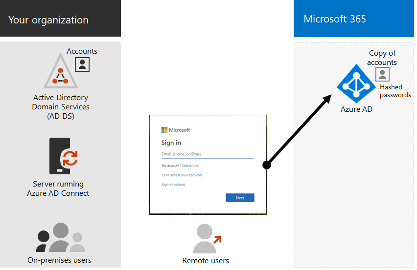

# Office 365 のハイブリッド id とディレクトリ同期Hybrid identity and directory synchronization for Office 365

*この記事は、Office 365 Enterprise および Microsoft 365 Enterprise の両方に適用されます。**This article applies to both Office 365 Enterprise and Microsoft 365 Enterprise.*

Office 365 を採用している企業のお客様にとっては、ビジネスニーズおよび技術的な要件に応じて、ハイブリッド id モデルとディレクトリ同期が最も一般的に選択されています。Depending on business needs and technical requirements, the hybrid identity model and directory synchronization is the most common choice for enterprise customers who are adopting Office 365. ディレクトリ同期を使用すると、Active Directory ドメインサービス (AD DS) 内の id を管理できます。また、ユーザーアカウント、グループ、および連絡先へのすべての更新は、Office 365 サブスクリプションの Azure Active Directory (Azure AD) テナントに同期されます。Directory synchronization allows you to manage identities in your Active Directory Domain Services (AD DS) and all updates to user accounts, groups, and contacts are synchronized to the Azure Active Directory (Azure AD) tenant of your Office 365 subscription.

>[!Note]
>AD DS ユーザーアカウントが初めて同期されると、Office 365 ライセンスが自動的に割り当てられることはなく、電子メールなどの Office 365 サービスにアクセスすることもできません。When AD DS user accounts are synchronized for the first time, they are not automatically assigned an Office 365 license and cannot access Office 365 services, such as email. これらのユーザーアカウントには、グループメンバーシップを使用して個別に、または動的にライセンスを割り当てる必要があります。You must assign a license to these user accounts, either individually or dynamically through group membership.
>

## ハイブリッド id の認証Authentication for hybrid identity

ハイブリッド id モデルを使用する場合は、次の2種類の認証があります。There are two types of authentication when using the hybrid identity model:

- 管理された認証Managed authentication

  Azure AD は、ローカルに保存されているハッシュバージョンのパスワードを使用して認証プロセスを処理するか、社内の AD DS によって認証されるように社内ソフトウェアエージェントに資格情報を送信します。Azure AD handles the authentication process by using a locally stored hashed version of the password or sends the credentials to an on-premises software agent to be authenticated by the on-premises AD DS.

- フェデレーション認証Federated authentication

  Azure AD は、別の id プロバイダーに接続するための認証を要求しているクライアントコンピューターをリダイレクトします。Azure AD redirects the client computer requesting authentication to contact another identity provider.

### 管理された認証Managed authentication

管理された認証には、次の2種類があります。There are two types of managed authentication:

- パスワードハッシュの同期 (PHS)Password hash synchronization (PHS)

  Azure AD は認証自体を実行します。Azure AD performs the authentication itself.

- パススルー認証 (PTA)Pass-through authentication (PTA)

  Azure AD は、AD DS で認証を実行しています。Azure AD has AD DS perform the authentication.

#### パスワード ハッシュ同期Password hash synchronization

パスワードハッシュ同期 (PHS) を使用すると、AD DS のユーザーアカウントを Office 365 と同期し、オンプレミスでユーザーを管理することができます。With password hash synchronization (PHS), you synchronize your AD DS user accounts with Office 365 and manage your users on-premises. ユーザーパスワードのハッシュは AD DS から Azure AD に同期されるため、ユーザーは社内とクラウドの両方で同じパスワードを使用できます。Hashes of user passwords are synchronized from your AD DS to Azure AD so that the users have the same password on-premises and in the cloud. これは、Azure AD で AD DS id の認証を有効にする最も簡単な方法です。This is the simplest way to enable authentication for AD DS identities in Azure AD. 

パスワードが変更されるか、オンプレミスでリセットされると、新しいパスワードハッシュが Azure AD に同期されるため、ユーザーは常にクラウドリソースとオンプレミスのリソースに対して同じパスワードを使用できます。When passwords are changed or reset on-premises, the new password hashes are synchronized to Azure AD so that your users can always use the same password for cloud resources and on-premises resources. ユーザーパスワードが Azure AD に送信されることや、クリアテキストで Azure AD に保存されることはありません。The user passwords are never sent to Azure AD or stored in Azure AD in clear text. Id 保護などの Azure AD の一部のプレミアム機能は、どの認証方法が選択されているかに関係なく、PHS を必要とします。Some premium features of Azure AD, such as Identity Protection, require PHS regardless of which authentication method is selected.
  
詳細については、「 [PHS の選択](https://docs.microsoft.com/azure/security/azure-ad-choose-authn)」を参照してください。See [choosing PHS](https://docs.microsoft.com/azure/security/azure-ad-choose-authn) to learn more.
  
#### パススルー認証Pass-through authentication

パススルー認証 (PTA) は、1つまたは複数のオンプレミスサーバー上で実行されているソフトウェアエージェントを使用して、AD DS に直接ユーザーを検証することにより、Azure AD 認証サービスの簡単なパスワード検証を提供します。Pass-through authentication (PTA) provides a simple password validation for Azure AD authentication services using a software agent running on one or more on-premises servers to validate the users directly with your AD DS. パススルー認証 (PTA) を使用して、AD DS のユーザーアカウントを Office 365 と同期し、オンプレミスでユーザーを管理します。With pass-through authentication (PTA), you synchronize AD DS user accounts with Office 365 and manage your users on-premises. 

PTA を使用すると、ユーザーはオンプレミスのアカウントとパスワードを使用して、オンプレミスと Office 365 の両方のリソースとアプリケーションの両方にサインインできます。PTA allows your users to sign in to both on-premises and Office 365 resources and applications using their on-premises account and password. この構成では、Azure AD にパスワードハッシュを保存せずに、ユーザーのパスワードをオンプレミスの AD DS に対して直接検証します。This configuration validates users passwords directly against your on-premises AD DS without storing password hashes in Azure AD. 

PTA は、組織に対して、オンプレミスのユーザーアカウントの状態、パスワードポリシー、およびログオン時間を即時に適用するセキュリティ要件を持つ組織のためにも使用されます。PTA is also for organizations with a security requirement to immediately enforce on-premises user account states, password policies, and logon hours. 
  
詳細については、「 [PTA の選択](https://docs.microsoft.com/azure/security/azure-ad-choose-authn)」を参照してください。See [choosing PTA](https://docs.microsoft.com/azure/security/azure-ad-choose-authn) to learn more.
  
### フェデレーション認証Federated authentication

フェデレーション認証は、主に、より複雑な認証要件を持つ大規模なエンタープライズ組織に適しています。Federated authentication is primarily for large enterprise organizations with more complex authentication requirements. AD DS id は Office 365 と同期され、ユーザーアカウントは社内で管理されます。AD DS identities are synchronized with Office 365 and users accounts are managed on-premises. フェデレーション認証では、ユーザーは社内とクラウドの両方で同じパスワードを使用しており、Office 365 を使用するために再度サインインする必要はありません。With federated authentication, users have the same password on-premises and in the cloud and they do not have to sign in again to use Office 365. 

フェデレーション認証は、スマートカードベースの認証、またはサードパーティの多要素認証などの追加の認証要件をサポートでき、組織が認証要件を持たない場合に通常は必要です。Azure AD でネイティブにサポートされています。Federated authentication can support additional authentication requirements, such as smartcard-based authentication or a third-party multi-factor authentication and is typically required when organizations have an authentication requirement not natively supported by Azure AD.
 
詳細については、「[フェデレーション認証の選択](https://docs.microsoft.com/azure/security/azure-ad-choose-authn)」を参照してください。See [choosing federated authentication](https://docs.microsoft.com/azure/security/azure-ad-choose-authn) to learn more.
  
#### サードパーティの認証および id プロバイダーThird-party authentication and identity providers

オンプレミスのディレクトリオブジェクトは Office 365 に同期され、クラウドリソースアクセスは主にサードパーティの id プロバイダー (IdP) によって管理されます。On-premises directory objects may be synchronized to Office 365 and cloud resource access is primarily managed by a third-party identity provider (IdP). 組織でサードパーティのフェデレーションソリューションを使用している場合は、サードパーティ製のフェデレーションソリューションが Azure AD と互換性があることを前提として、Office 365 でそのソリューションを使用してサインオンを構成できます。If your organization uses a third-party federation solution, you can configure sign-on with that solution for Office 365 provided that the third-party federation solution is compatible with Azure AD.
  
詳細については、「 [AZURE AD フェデレーション互換性](https://docs.microsoft.com/azure/active-directory/connect/active-directory-aadconnect-federation-compatibility)」を参照してください。See [Azure AD federation compatibility](https://docs.microsoft.com/azure/active-directory/connect/active-directory-aadconnect-federation-compatibility) to learn more.
  
## AD DS のクリーンアップAD DS Cleanup

同期を使用して Office 365 をシームレスに移行できるようにするには、Office 365 ディレクトリ同期の展開を開始する前に、AD DS フォレストを準備する必要があります。To help ensure a seamless transition to Office 365 by using synchronization, you must prepare your AD DS forest before you begin your Office 365 directory synchronization deployment.
  
[Office 365 でディレクトリ同期](set-up-directory-synchronization.md)をセットアップする場合の手順の1つとして、 [idfix ツールをダウンロードして実行](install-and-run-idfix.md)する方法があります。When you [set up directory synchronization in Office 365](set-up-directory-synchronization.md), one of the steps is to [download and run the IdFix tool](install-and-run-idfix.md). IdFix ツールを使用して、ディレクトリの[クリーンアップ](prepare-directory-attributes-for-synch-with-idfix.md)に役立てることができます。You can use the IdFix tool to help with [directory cleanup](prepare-directory-attributes-for-synch-with-idfix.md).
  
ディレクトリのクリーンアップでは、次のタスクに焦点を当てる必要があります。Your directory cleanup should focus on the following tasks:

- 重複している**proxyAddress**属性と**userPrincipalName**属性を削除します。Remove duplicate **proxyAddress** and **userPrincipalName** attributes.
- 空白および無効な**userprincipalname**属性を有効な**userprincipalname**属性で更新します。Update blank and invalid **userPrincipalName** attributes with valid **userPrincipalName** attributes.
- **GivenName**、姓 ( **Sn** )、 **sAMAccountName**、 **displayName**、 **mail**、 **proxyAddresses**、 **mailNickname**、および**userPrincipalName**の各属性の無効で問題のある文字を削除します。Remove invalid and questionable characters in the **givenName**, surname ( **sn** ), **sAMAccountName**, **displayName**, **mail**, **proxyAddresses**, **mailNickname**, and **userPrincipalName** attributes. 属性の準備の詳細については、「 [Azure Active Directory 同期ツールによって同期される属性の一覧](https://go.microsoft.com/fwlink/p/?LinkId=396719)」を参照してください。For details about preparing attributes, see [List of attributes that are synced by the Azure Active Directory Sync Tool](https://go.microsoft.com/fwlink/p/?LinkId=396719).

    > [!NOTE]
    > Azure AD Connect が同期するのと同じ属性です。These are the same attributes that Azure AD Connect synchronizes. 
  
## 複数フォレストの展開に関する考慮事項Multi-forest deployment considerations

複数のフォレストおよび SSO オプションでは、 [AZURE AD Connect のカスタムインストール](https://go.microsoft.com/fwlink/p/?LinkId=698430)を使用します。For multiple forests and SSO options, use [Custom Installation of Azure AD Connect](https://go.microsoft.com/fwlink/p/?LinkId=698430).
  
組織に認証用に複数のフォレストがある場合 (ログオンフォレスト)、次のことを強くお勧めします。If your organization has multiple forests for authentication (logon forests), we highly recommend the following:
  
- **フォレストを統合することを検討してください。****Consider consolidating your forests.** 一般に、複数のフォレストを維持するには、より多くのオーバーヘッドが必要になります。In general, there's more overhead required to maintain multiple forests. 個別のフォレストの必要性を判断するセキュリティ上の制約が組織にない限り、オンプレミスの環境を簡素化することを検討してください。Unless your organization has security constraints that dictate the need for separate forests, consider simplifying your on-premises environment.
- **プライマリのログオンフォレストでのみ使用します。****Use only in your primary logon forest.** Office 365 を最初に展開する場合は、プライマリのログオンフォレストにのみ Office 365 を展開することを検討してください。Consider deploying Office 365 only in your primary logon forest for your initial rollout of Office 365. 

複数フォレストの AD DS 展開を統合できない場合や、他のディレクトリサービスを使用して id を管理している場合は、Microsoft またはパートナーのヘルプと同期することができます。If you can't consolidate your multi-forest AD DS deployment or are using other directory services to manage identities, you may be able to synchronize these with the help of Microsoft or a partner.
  
詳細については、「[シングルサインオンシナリオでのマルチフォレストディレクトリ同期](https://go.microsoft.com/fwlink/p/?LinkId=525321)」を参照してください。See [Multi-forest Directory Sync with Single Sign-On Scenario](https://go.microsoft.com/fwlink/p/?LinkId=525321) for more information.
  
## ディレクトリ同期に依存する機能Features that are dependent on directory synchronization
  
次の機能には、ディレクトリ同期が必要です。Directory synchronization is required for the following features and functionality:
  
- Azure AD のシームレスなシングルサインオン (SSO)Azure AD Seamless Single Sign-On (SSO)
- Skype の共存Skype coexistence
- Exchange ハイブリッド展開 (次のものが含まれる)Exchange hybrid deployment, including:
  - オンプレミスの Exchange 環境と Office 365 間の完全に共有されたグローバルアドレス一覧 (GAL)。Fully shared global address list (GAL) between your on-premises Exchange environment and Office 365.
  - 別のメールシステムから GAL 情報を同期します。Synchronizing GAL information from different mail systems.
  - Office 365 サービスオファーリングにユーザーを追加したり、ユーザーを削除したりする機能。The ability to add users to and remove users from Office 365 service offerings. これには、次のものが必要です。This requires the following:
  - ディレクトリ同期のセットアップ中に、双ウェイの同期を構成する必要があります。Two-way synchronization must be configured during directory synchronization setup. 既定では、ディレクトリ同期ツールは、ディレクトリ情報をクラウドにのみ書き込みます。By default, directory synchronization tools write directory information only to the cloud. 双ウェイの同期を構成する場合は、制限された数のオブジェクト属性がクラウドからコピーされるように書き戻し機能を有効にしてから、ローカルの AD DS に書き戻します。When you configure two-way synchronization, you enable write-back functionality so that a limited number of object attributes are copied from the cloud, and then written them back to your local AD DS. 書き戻しは、Exchange ハイブリッドモードとも呼ばれます。Write-back is also referred to as Exchange hybrid mode. 
  - オンプレミスの Exchange ハイブリッド展開An on-premises Exchange hybrid deployment
  - 他のユーザーのメールボックスをオンプレミスに保持したまま、一部のユーザーメールボックスを Office 365 に移動する機能。The ability to move some user mailboxes to Office 365 while keeping other user mailboxes on-premises.
  - 社内の信頼できる差出人と受信拒否リストは、Office 365 に複製されます。Safe senders and blocked senders on-premises are replicated to Office 365.
  - 基本的な委任および代理送信電子メール機能。Basic delegation and send-on-behalf-of email functionality.
  - オンプレミスのスマートカードまたは多要素認証ソリューションが統合されている。You have an integrated on-premises smart card or multi-factor authentication solution.
- 写真、サムネイル、会議室、セキュリティグループの同期Synchronization of photos, thumbnails, conference rooms, and security groups

## 次の手順Next step

ハイブリッド id を展開する準備ができたら、「[ユーザーをプロビジョニングするための準備](prepare-for-directory-synchronization.md)」を参照してください。When you are ready to deploy hybrid identity, see [prepare to provision users](prepare-for-directory-synchronization.md).
  
## 関連項目See also

[Microsoft 365 Enterprise の概要Microsoft 365 Enterprise overview](https://docs.microsoft.com/microsoft-365/enterprise/microsoft-365-overview)

