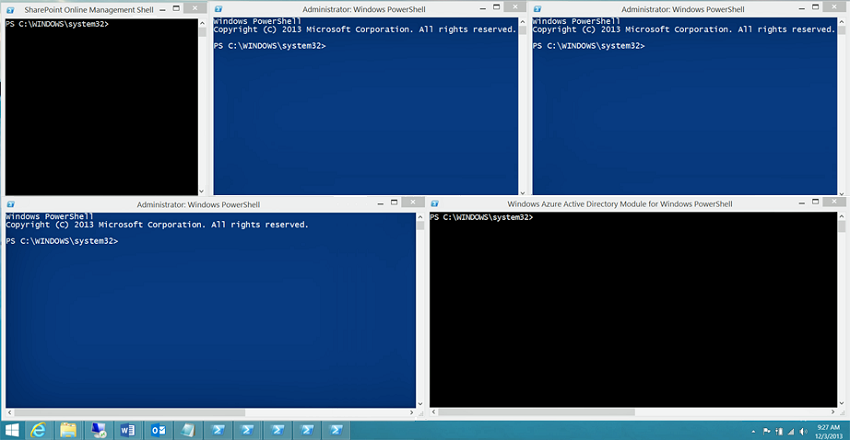

# <a name="connect-to-all-office-365-services-in-a-single-windows-powershell-window"></a><span data-ttu-id="24752-103">単一の Windows PowerShell ウィンドウですべての Office 365 サービスに接続する</span><span class="sxs-lookup"><span data-stu-id="24752-103">Connect to all Office 365 services in a single Windows PowerShell window</span></span>

 <span data-ttu-id="24752-104">**概要:** 別々の PowerShell コンソール ウィンドウで各種 Office 365 サービスを管理するのではなく、1 つのコンソール ウィンドウからすべての Office 365 サービスに接続して管理できます。</span><span class="sxs-lookup"><span data-stu-id="24752-104">**Summary:** Instead of managing different Office 365 services in separate PowerShell console windows, you can connect to all Office 365 services and manage them from single console window.</span></span>
  
<span data-ttu-id="24752-p101">PowerShell を使用して Office 365 を管理する場合は、最大 5 つの異なる Windows PowerShell セッション (Office 365 管理センター、SharePoint Online、Exchange Online、Skype for Business Online、およびセキュリティ/コンプライアンス センターに対応する) を同時に開くことができます。別々の Windows PowerShell セッションで 5 つの異なる接続方法を使用すると、デスクトップは以下のようになります。</span><span class="sxs-lookup"><span data-stu-id="24752-p101">When you use PowerShell to manage Office 365, it is possible to have up to five different Windows PowerShell sessions open at the same time corresponding to Office 365 admin center, SharePoint Online, Exchange Online, Skype for Business Online, and the Security &amp; Compliance Center. With five different connection methods in separate Windows PowerShell sessions, your desktop could look like this:</span></span>
  

  
<span data-ttu-id="24752-p102">これは Office 365 の管理に最適な状況ではありません。サービス間管理のために 5 つのウィンドウ間でデータを交換できないからです。このトピックでは、Office 365、Skype for Business Online、Exchange Online、SharePoint Online、および セキュリティ センターとコンプライアンス センター を管理する Windows PowerShell のインスタンスを使用する方法について説明します。</span><span class="sxs-lookup"><span data-stu-id="24752-p102">This is not optimal for managing Office 365 because you can't exchange data among those five windows for cross-service management. This topic describes how to use a single instance of Windows PowerShell from which you can manage Office 365, Skype for Business Online, Exchange Online, SharePoint Online, and the Security &amp; Compliance Center.</span></span>

## <a name="before-you-begin"></a><span data-ttu-id="24752-110">はじめに</span><span class="sxs-lookup"><span data-stu-id="24752-110">Before you begin</span></span>

<span data-ttu-id="24752-111">Windows PowerShell の単一のインスタンスからすべての Office 365 を管理する前に、次の前提条件を考慮してください。</span><span class="sxs-lookup"><span data-stu-id="24752-111">Before you can manage all of Office 365 from a single instance of Windows PowerShell, consider the following prerequisites:</span></span>
  
- <span data-ttu-id="24752-p103">これらの手順に使用する Office 365職場または学校のアカウント は、Office 365 管理者役割のメンバーである必要があります。詳細については、「[Office 365 の管理者の役割](https://go.microsoft.com/fwlink/p/?LinkId=532367)」を参照してください。これは Office 365 PowerShell の要件であり、他のすべての Office 365 サービスについては必ずしも当てはまりません。</span><span class="sxs-lookup"><span data-stu-id="24752-p103">The Office 365 work or school account that you use for these procedures needs to be a member of an Office 365 admin role. For more information, see [About Office 365 admin roles](https://go.microsoft.com/fwlink/p/?LinkId=532367). This a requirement for Office 365 PowerShell, not necessarily for all other Office 365 services.</span></span>
    
- <span data-ttu-id="24752-115">次の Windows の 64 ビット バージョンを使用できます。</span><span class="sxs-lookup"><span data-stu-id="24752-115">You can use the following 64-bit versions of Windows:</span></span>
    
  - <span data-ttu-id="24752-116">Windows 10</span><span class="sxs-lookup"><span data-stu-id="24752-116">Windows 10</span></span>
    
  - <span data-ttu-id="24752-117">Windows 8.1 または Windows 8</span><span class="sxs-lookup"><span data-stu-id="24752-117">Windows 8.1 or Windows 8</span></span>
    
  - <span data-ttu-id="24752-118">Windows Server 2019</span><span class="sxs-lookup"><span data-stu-id="24752-118">Windows Server 2019</span></span>
    
  - <span data-ttu-id="24752-119">Windows Server 2016</span><span class="sxs-lookup"><span data-stu-id="24752-119">Windows Server 2016</span></span>
    
  - <span data-ttu-id="24752-120">Windows Server 2012 R2 または Windows Server 2012</span><span class="sxs-lookup"><span data-stu-id="24752-120">Windows Server 2012 R2 or Windows Server 2012</span></span>
    
  - <span data-ttu-id="24752-121">Windows 7 Service Pack 1 (SP1)\*</span><span class="sxs-lookup"><span data-stu-id="24752-121">Windows 7 Service Pack 1 (SP1)\*</span></span>
    
  - <span data-ttu-id="24752-122">Windows Server 2008 R2 SP1\*</span><span class="sxs-lookup"><span data-stu-id="24752-122">Windows Server 2008 R2 SP1\*</span></span>
    
    <span data-ttu-id="24752-p104">\*Microsoft.NET Framework 4.5 をインストールする必要があります。*x*とし、いずれかの Windows Management Framework 3.0 または Windows Management Framework 4.0 です。詳細については、 [ [.NET Framework をインストールして](https://go.microsoft.com/fwlink/p/?LinkId=257868)Windows Management Framework 3.0](https://go.microsoft.com/fwlink/p/?LinkId=272757)または[4.0 の Windows Management Framework](https://go.microsoft.com/fwlink/p/?LinkId=391344)を参照してください。</span><span class="sxs-lookup"><span data-stu-id="24752-p104">\* You need to install the Microsoft .NET Framework 4.5.*x* and then either the Windows Management Framework 3.0 or the Windows Management Framework 4.0. For more information, see [Installing the .NET Framework](https://go.microsoft.com/fwlink/p/?LinkId=257868) and [Windows Management Framework 3.0](https://go.microsoft.com/fwlink/p/?LinkId=272757) or [Windows Management Framework 4.0](https://go.microsoft.com/fwlink/p/?LinkId=391344).</span></span>
    
    <span data-ttu-id="24752-125">Skype for Business Online モジュール、および Office 365 モジュールの 1 つの要件のため、64 ビット バージョンの Windows を使用する必要があります。</span><span class="sxs-lookup"><span data-stu-id="24752-125">You need to use a 64-bit version of Windows because of the requirements for the Skype for Business Online module and one of the Office 365 modules.</span></span>
    
- <span data-ttu-id="24752-126">Azure AD に必要なモジュールをインストールする必要があり、SharePoint Online では、ビジネス オンラインの Skype。</span><span class="sxs-lookup"><span data-stu-id="24752-126">You need to install the modules that are required for Azure AD, SharePoint Online, and Skype for Business Online:</span></span>
    
   - [<span data-ttu-id="24752-127">Azure Active Directory V2</span><span class="sxs-lookup"><span data-stu-id="24752-127">Azure Active Directory V2</span></span>](connect-to-office-365-powershell.md##connect-with-the-azure-active-directory-powershell-for-graph-module)
   - [<span data-ttu-id="24752-128">SharePoint Online Management Shell</span><span class="sxs-lookup"><span data-stu-id="24752-128">SharePoint Online Management Shell</span></span>](https://go.microsoft.com/fwlink/p/?LinkId=255251)
   - [<span data-ttu-id="24752-129">Skype for Business Online、Windows PowerShell モジュール</span><span class="sxs-lookup"><span data-stu-id="24752-129">Skype for Business Online, Windows PowerShell Module</span></span>](https://go.microsoft.com/fwlink/p/?LinkId=532439)
    
-  <span data-ttu-id="24752-p105">Skype for Business Online、Exchange Online、およびセキュリティ/コンプライアンス センターに対して署名付きスクリプトを実行するよう Windows PowerShell を構成する必要があります。そのためには、管理者特権の Windows PowerShell セッション (Windows PowerShell ウィンドウで **[管理者として実行]** を選択して開きます) で、次のコマンドを実行します。</span><span class="sxs-lookup"><span data-stu-id="24752-p105">Windows PowerShell needs to be configured to run signed scripts for Skype for Business Online, Exchange Online, and the Security &amp; Compliance Center. To do this, run the following command in an elevated Windows PowerShell session (a Windows PowerShell window you open by selecting **Run as administrator**).</span></span>
    
  ```
  Set-ExecutionPolicy RemoteSigned
  ```

## <a name="connection-steps-when-using-a-password"></a><span data-ttu-id="24752-132">パスワードを使用する場合の接続手順</span><span class="sxs-lookup"><span data-stu-id="24752-132">Connection steps when using a password</span></span>

<span data-ttu-id="24752-133">ここでは、1 つの PowerShell ウィンドウ内のすべてのサービスに接続する手順を実行します。</span><span class="sxs-lookup"><span data-stu-id="24752-133">Here are the steps to connect to all the services in a single PowerShell window.</span></span>
  
1. <span data-ttu-id="24752-134">管理者として Windows PowerShell を開きます ( **[管理者として実行]** を使用)。</span><span class="sxs-lookup"><span data-stu-id="24752-134">Open Windows PowerShell as an administrator (use **Run as administrator**).</span></span>
    
2. <span data-ttu-id="24752-135">次のコマンドを実行し、Office 365職場または学校のアカウント の資格情報を入力します。</span><span class="sxs-lookup"><span data-stu-id="24752-135">Run this command, and enter your Office 365 work or school account credentials.</span></span>
    
  ```
  $credential = Get-Credential
  ```

3. <span data-ttu-id="24752-136">Azure Active ディレクトリ (AD) Azure Active Directory の PowerShell を使用してグラフ モジュールを接続するには、このコマンドを実行します。</span><span class="sxs-lookup"><span data-stu-id="24752-136">Run this command to connect to Azure Active Directory (AD) using the Azure Active Directory PowerShell for Graph module.</span></span>
    
  ```
   Connect-AzureAD -Credential $credential
  ```
  
  <span data-ttu-id="24752-137">または、Microsoft Azure Active Directory モジュールを Windows PowerShell モジュールを使用する場合は、このコマンドを実行します。</span><span class="sxs-lookup"><span data-stu-id="24752-137">Alternately, if you are using the Microsoft Azure Active Directory Module for Windows PowerShell module, run this command.</span></span>
      
  ```
   Connect-MsolService -Credential $credential
 ```

4. <span data-ttu-id="24752-p106">SharePoint Online に接続するためのこれらのコマンドを実行します。交換_\<domainhost >_ ドメインの実際の値とします。たとえば、"litwareinc.onmicrosoft.com"を_\<domainhost >_ の値は、"litwareinc"です。</span><span class="sxs-lookup"><span data-stu-id="24752-p106">Run these commands to connect to SharePoint Online. Replace  _\<domainhost>_ with the actual value for your domain. For example, for "litwareinc.onmicrosoft.com", the  _\<domainhost>_ value is "litwareinc".</span></span>
    
  ```
  Import-Module Microsoft.Online.SharePoint.PowerShell -DisableNameChecking
  Connect-SPOService -Url https://<domainhost>-admin.sharepoint.com -credential $credential
  ```

5. <span data-ttu-id="24752-p107">次のコマンドを実行して、Skype for Business Online に接続します。初めて接続する場合、`WSMan NetworkDelayms` の値を増やすようにという警告が出ますが、無視してください。</span><span class="sxs-lookup"><span data-stu-id="24752-p107">Run these commands to connect to Skype for Business Online. A warning about increasing the `WSMan NetworkDelayms` value is expected the first time you connect and should be ignored.</span></span>
    
  ```
  Import-Module SkypeOnlineConnector
  $sfboSession = New-CsOnlineSession -Credential $credential
  Import-PSSession $sfboSession
  ```

6. <span data-ttu-id="24752-143">次のコマンドを実行して、Exchange Online に接続します。</span><span class="sxs-lookup"><span data-stu-id="24752-143">Run these commands to connect to Exchange Online.</span></span>
    
  ```
  $exchangeSession = New-PSSession -ConfigurationName Microsoft.Exchange -ConnectionUri "https://outlook.office365.com/powershell-liveid/" -Credential $credential -Authentication "Basic" -AllowRedirection
  Import-PSSession $exchangeSession
  ```

7. <span data-ttu-id="24752-144">次のコマンドを実行して、セキュリティ センターとコンプライアンス センター に接続します。</span><span class="sxs-lookup"><span data-stu-id="24752-144">Run these commands to connect to the Security &amp; Compliance Center.</span></span>
    
  ```
  $SccSession = New-PSSession -ConfigurationName Microsoft.Exchange -ConnectionUri https://ps.compliance.protection.outlook.com/powershell-liveid/ -Credential $credential -Authentication "Basic" -AllowRedirection
  Import-PSSession $SccSession -Prefix cc
  ```

<span data-ttu-id="24752-p108">ここでグラフ モジュールの Azure Active Directory の PowerShell を使用する場合は、1 つのブロックですべてのコマンドを示します。、自分のドメインのホストの名前を指定し、それらすべてを同時に実行します。</span><span class="sxs-lookup"><span data-stu-id="24752-p108">Here are all the commands in a single block when using the Azure Active Directory PowerShell for Graph module. Specify the name of your domain host, and then run them all at one time.</span></span>
  
```
$domainHost="<domain host name, such as litwareinc for litwareinc.onmicrosoft.com>"
$credential = Get-Credential
Connect-AzureAD -Credential $credential
Import-Module Microsoft.Online.SharePoint.PowerShell -DisableNameChecking
Connect-SPOService -Url https://$domainHost-admin.sharepoint.com -credential $credential
Import-Module SkypeOnlineConnector
$sfboSession = New-CsOnlineSession -Credential $credential
Import-PSSession $sfboSession
$exchangeSession = New-PSSession -ConfigurationName Microsoft.Exchange -ConnectionUri "https://outlook.office365.com/powershell-liveid/" -Credential $credential -Authentication "Basic" -AllowRedirection
Import-PSSession $exchangeSession
$SccSession = New-PSSession -ConfigurationName Microsoft.Exchange -ConnectionUri https://ps.compliance.protection.outlook.com/powershell-liveid/ -Credential $credential -Authentication "Basic" -AllowRedirection
Import-PSSession $SccSession -Prefix cc
```

<span data-ttu-id="24752-p109">代わりに、ここではコマンドをすべて 1 つのブロックで、Microsoft Azure Active Directory モジュールを Windows PowerShell モジュールを使用する場合です。、自分のドメインのホストの名前を指定し、それらすべてを同時に実行します。</span><span class="sxs-lookup"><span data-stu-id="24752-p109">Alternately, here are all the commands in a single block when using the Microsoft Azure Active Directory Module for Windows PowerShell module. Specify the name of your domain host, and then run them all at one time.</span></span>
  
```
$domainHost="<domain host name, such as litwareinc for litwareinc.onmicrosoft.com>"
$credential = Get-Credential
Connect-MsolService -Credential $credential
Import-Module Microsoft.Online.SharePoint.PowerShell -DisableNameChecking
Connect-SPOService -Url https://$domainHost-admin.sharepoint.com -credential $credential
Import-Module SkypeOnlineConnector
$sfboSession = New-CsOnlineSession -Credential $credential
Import-PSSession $sfboSession
$exchangeSession = New-PSSession -ConfigurationName Microsoft.Exchange -ConnectionUri "https://outlook.office365.com/powershell-liveid/" -Credential $credential -Authentication "Basic" -AllowRedirection
Import-PSSession $exchangeSession
$SccSession = New-PSSession -ConfigurationName Microsoft.Exchange -ConnectionUri https://ps.compliance.protection.outlook.com/powershell-liveid/ -Credential $credential -Authentication "Basic" -AllowRedirection
Import-PSSession $SccSession -Prefix cc
```

<span data-ttu-id="24752-149">Windows PowerShell ウィンドウを閉じる準備が整った段階でこのコマンドを実行し、Skype for Business Online、Exchange Online、SharePoint Online、セキュリティ/コンプライアンス センターに対するアクティブなセッションを削除します。</span><span class="sxs-lookup"><span data-stu-id="24752-149">When you are ready to close down the Windows PowerShell window, run this command to remove the active sessions to Skype for Business Online, Exchange Online, SharePoint Online, and the Security &amp; Compliance Center:</span></span>
  
```
Remove-PSSession $sfboSession ; Remove-PSSession $exchangeSession ; Remove-PSSession $SccSession ; Disconnect-SPOService
```

## <a name="connection-steps-when-using-multi-factor-authentication"></a><span data-ttu-id="24752-150">多要素認証を使用する場合の接続手順</span><span class="sxs-lookup"><span data-stu-id="24752-150">Connection steps when using multi-factor authentication</span></span>

<span data-ttu-id="24752-p110">Azure AD に接続する 1 つのブロック内のすべてのコマンドをここでは、SharePoint Online と多要素認証を使用して 1 つのウィンドウで Buiness の Skype です。グローバル管理者アカウントのユーザー プリンシパル名 (UPN) の名前と、ドメインのホスト名を指定し、それらすべてを同時に実行します。</span><span class="sxs-lookup"><span data-stu-id="24752-p110">Here are all the commands in a single block to connect to Azure AD, SharePoint Online, and Skype for Buiness using multi-factor authentication in a single window. Specify the user principal name (UPN) name of a global administrator account and your domain host name, and then run them all at one time.</span></span>

````
$acctName="<UPN of a global administrator account>"
$domainHost="<domain host name, such as litwareinc for litwareinc.onmicrosoft.com>"
#Azure Active Directory
Connect-AzureAD
#SharePoint Online
Connect-SPOService -Url https://$domainHost-admin.sharepoint.com
#Skype for Business Online
$sfboSession = New-CsOnlineSession -UserName $acctName
Import-PSSession $sfboSession
````

<span data-ttu-id="24752-153">Microsoft Azure Active Directory モジュールを Windows PowerShell モジュールを使用する場合は、すべてのコマンドをここでは代わりに、します。</span><span class="sxs-lookup"><span data-stu-id="24752-153">Alternately, here are all the commands when using the Microsoft Azure Active Directory Module for Windows PowerShell module.</span></span>

````
$acctName="<UPN of a global administrator account>"
$domainHost="<domain host name, such as litwareinc for litwareinc.onmicrosoft.com>"
#Azure Active Directory
Connect-MsolService
#SharePoint Online
Connect-SPOService -Url https://$domainHost-admin.sharepoint.com
#Skype for Business Online
$sfboSession = New-CsOnlineSession -UserName $acctName
Import-PSSession $sfboSession
````

<span data-ttu-id="24752-154">Exchange Online とセキュリティの&amp;コンプライアンス センターでは、多要素認証を使用して接続するのには次のトピックを参照してください。</span><span class="sxs-lookup"><span data-stu-id="24752-154">For Exchange Online and the Security &amp; Compliance Center, see the following topics to connect using multi-factor authentication:</span></span>

- [<span data-ttu-id="24752-155">多要素認証を使用して Exchange Online PowerShell に接続する</span><span class="sxs-lookup"><span data-stu-id="24752-155">Connect to Exchange Online PowerShell using multi-factor authentication</span></span>](https://docs.microsoft.com/powershell/exchange/exchange-online/connect-to-exchange-online-powershell/mfa-connect-to-exchange-online-powershell)
- [<span data-ttu-id="24752-156">Office 365 のセキュリティとコンプライアンス センター PowerShell の多要素認証を使用してへの接続します。</span><span class="sxs-lookup"><span data-stu-id="24752-156">Connect to Office 365 Security & Compliance Center PowerShell using multi-factor authentication</span></span>](https://docs.microsoft.com/powershell/exchange/office-365-scc/connect-to-scc-powershell/mfa-connect-to-scc-powershell?view=exchange-ps)
 
<span data-ttu-id="24752-157">どちらの場合で、Exchange オンライン リモート PowerShell モジュールの別のセッションを使用して接続する必要があります。</span><span class="sxs-lookup"><span data-stu-id="24752-157">Note that in both cases, you must connect using separate sessions of the Exchange Online Remote PowerShell Module.</span></span>


## <a name="see-also"></a><span data-ttu-id="24752-158">関連項目</span><span class="sxs-lookup"><span data-stu-id="24752-158">See also</span></span>

- [<span data-ttu-id="24752-159">Office 365 PowerShell への接続</span><span class="sxs-lookup"><span data-stu-id="24752-159">Connect to Office 365 PowerShell</span></span>](connect-to-office-365-powershell.md)
- [<span data-ttu-id="24752-160">Office 365 PowerShell を使用して SharePoint Online を管理する</span><span class="sxs-lookup"><span data-stu-id="24752-160">Manage SharePoint Online with Office 365 PowerShell</span></span>](manage-sharepoint-online-with-office-365-powershell.md)
- [<span data-ttu-id="24752-161">Office 365 PowerShell を使ってユーザー アカウントとライセンスを管理します。</span><span class="sxs-lookup"><span data-stu-id="24752-161">Manage user accounts and licenses with Office 365 PowerShell</span></span>](manage-user-accounts-and-licenses-with-office-365-powershell.md)
- [<span data-ttu-id="24752-162">Windows PowerShell を使用して Office 365 でレポートを作成する</span><span class="sxs-lookup"><span data-stu-id="24752-162">Use Windows PowerShell to create reports in Office 365</span></span>](use-windows-powershell-to-create-reports-in-office-365.md)
