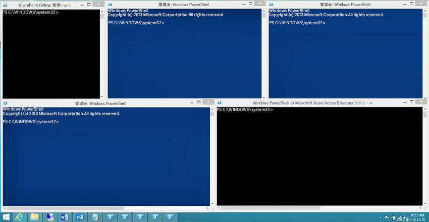

# <a name="connect-to-all-office-365-services-in-a-single-windows-powershell-window"></a><span data-ttu-id="f82f6-103">単一の Windows PowerShell ウィンドウですべての Office 365 サービスに接続する</span><span class="sxs-lookup"><span data-stu-id="f82f6-103">Connect to all Office 365 services in a single Windows PowerShell window</span></span>

 <span data-ttu-id="f82f6-104">**概要:** 別々の PowerShell コンソール ウィンドウで各種 Office 365 サービスを管理するのではなく、1 つのコンソール ウィンドウからすべての Office 365 サービスに接続して管理できます。</span><span class="sxs-lookup"><span data-stu-id="f82f6-104">**Summary:** Instead of managing different Office 365 services in separate PowerShell console windows, you can connect to all Office 365 services and manage them from single console window.</span></span>
  
<span data-ttu-id="f82f6-p101">PowerShell を使用して Office 365 を管理する場合は、最大 5 つの異なる Windows PowerShell セッション (Office 365 管理センター、SharePoint Online、Exchange Online、Skype for Business Online、およびセキュリティ/コンプライアンス センターに対応する) を同時に開くことができます。別々の Windows PowerShell セッションで 5 つの異なる接続方法を使用すると、デスクトップは以下のようになります。</span><span class="sxs-lookup"><span data-stu-id="f82f6-p101">When you use PowerShell to manage Office 365, it is possible to have up to five different Windows PowerShell sessions open at the same time corresponding to Office 365 admin center, SharePoint Online, Exchange Online, Skype for Business Online, and the Security &amp; Compliance Center. With five different connection methods in separate Windows PowerShell sessions, your desktop could look like this:</span></span>
  

  
<span data-ttu-id="f82f6-p102">これは Office 365 の管理に最適な状況ではありません。サービス間管理のために 5 つのウィンドウ間でデータを交換できないからです。このトピックでは、Office 365、Skype for Business Online、Exchange Online、SharePoint Online、および セキュリティ センターとコンプライアンス センター を管理する Windows PowerShell のインスタンスを使用する方法について説明します。</span><span class="sxs-lookup"><span data-stu-id="f82f6-p102">This is not optimal for managing Office 365 because you can't exchange data among those five windows for cross-service management. This topic describes how to use a single instance of Windows PowerShell from which you can manage Office 365, Skype for Business Online, Exchange Online, SharePoint Online, and the Security &amp; Compliance Center.</span></span>
  
## <a name="before-you-begin"></a><span data-ttu-id="f82f6-110">はじめに</span><span class="sxs-lookup"><span data-stu-id="f82f6-110">Before you begin</span></span>
<span data-ttu-id="f82f6-111"><a name="BeforeYouBegin"> </a></span><span class="sxs-lookup"><span data-stu-id="f82f6-111"><a name="BeforeYouBegin"> </a></span></span>

<span data-ttu-id="f82f6-112">Windows PowerShell の単一のインスタンスからすべての Office 365 を管理する前に、次の前提条件を考慮してください。</span><span class="sxs-lookup"><span data-stu-id="f82f6-112">Before you can manage all of Office 365 from a single instance of Windows PowerShell, consider the following prerequisites:</span></span>
  
- <span data-ttu-id="f82f6-p103">これらの手順に使用する Office 365職場または学校のアカウント は、Office 365 管理者役割のメンバーである必要があります。詳細については、「[Office 365 の管理者の役割](https://go.microsoft.com/fwlink/p/?LinkId=532367)」を参照してください。これは Office 365 PowerShell の要件であり、他のすべての Office 365 サービスについては必ずしも当てはまりません。</span><span class="sxs-lookup"><span data-stu-id="f82f6-p103">The Office 365 work or school account that you use for these procedures needs to be a member of an Office 365 admin role. For more information, see [About Office 365 admin roles](https://go.microsoft.com/fwlink/p/?LinkId=532367). This a requirement for Office 365 PowerShell, not necessarily for all other Office 365 services.</span></span>
    
- <span data-ttu-id="f82f6-116">次の Windows の 64 ビット バージョンを使用できます。</span><span class="sxs-lookup"><span data-stu-id="f82f6-116">You can use the following 64-bit versions of Windows:</span></span>
    
  - <span data-ttu-id="f82f6-117">Windows 10</span><span class="sxs-lookup"><span data-stu-id="f82f6-117">Windows 10</span></span>
    
  - <span data-ttu-id="f82f6-118">Windows 8.1 または Windows 8</span><span class="sxs-lookup"><span data-stu-id="f82f6-118">Windows 8.1 or Windows 8</span></span>
    
  - <span data-ttu-id="f82f6-119">Windows Server 2016</span><span class="sxs-lookup"><span data-stu-id="f82f6-119">Windows Server 2016</span></span>
    
  - <span data-ttu-id="f82f6-120">Windows Server 2012 R2 または Windows Server 2012</span><span class="sxs-lookup"><span data-stu-id="f82f6-120">Windows Server 2012 R2 or Windows Server 2012</span></span>
    
  - <span data-ttu-id="f82f6-121">Windows 7 Service Pack 1 (SP1)\*</span><span class="sxs-lookup"><span data-stu-id="f82f6-121">Windows 7 Service Pack 1 (SP1)\*</span></span>
    
  - <span data-ttu-id="f82f6-122">Windows Server 2008 R2 SP1\*</span><span class="sxs-lookup"><span data-stu-id="f82f6-122">Windows Server 2008 R2 SP1\*</span></span>
    
    * <span data-ttu-id="f82f6-p104">Microsoft .NET Framework 4.5._x_ をインストールしてから、Windows Management Framework 3.0 または Windows Management Framework 4.0 をインストールする必要があります。詳細については、「[.NET Framework のインストール](https://go.microsoft.com/fwlink/p/?LinkId=257868)」と、「[Windows Management Framework 3.0](https://go.microsoft.com/fwlink/p/?LinkId=272757)」または「[Windows Management Framework 4.0](https://go.microsoft.com/fwlink/p/?LinkId=391344)」を参照してください。</span><span class="sxs-lookup"><span data-stu-id="f82f6-p104">You need to install the Microsoft .NET Framework 4.5. _x_ and then either the Windows Management Framework 3.0 or the Windows Management Framework 4.0. For more information, see [Installing the .NET Framework](https://go.microsoft.com/fwlink/p/?LinkId=257868) and [Windows Management Framework 3.0](https://go.microsoft.com/fwlink/p/?LinkId=272757) or [Windows Management Framework 4.0](https://go.microsoft.com/fwlink/p/?LinkId=391344).</span></span>
    
    <span data-ttu-id="f82f6-126">Skype for Business Online モジュール、および Office 365 モジュールの 1 つの要件のため、64 ビット バージョンの Windows を使用する必要があります。</span><span class="sxs-lookup"><span data-stu-id="f82f6-126">You need to use a 64-bit version of Windows because of the requirements for the Skype for Business Online module and one of the Office 365 modules.</span></span>
    
- <span data-ttu-id="f82f6-127">Office 365、SharePoint Online、および Skype for Business Online に必要な以下のモジュールをインストールする必要があります。</span><span class="sxs-lookup"><span data-stu-id="f82f6-127">You need to install the modules that are required for Office 365, SharePoint Online, and Skype for Business Online:</span></span>
    
  - [<span data-ttu-id="f82f6-128">IT プロフェッショナル用 Microsoft Online Services サインイン アシスタント RTW</span><span class="sxs-lookup"><span data-stu-id="f82f6-128">Microsoft Online Service Sign-in Assistant for IT Professionals RTW</span></span>](https://go.microsoft.com/fwlink/p/?LinkId=286152)
    
  - [<span data-ttu-id="f82f6-129">Windows PowerShell 用 Windows Azure Active Directory モジュール (64 ビット バージョン)</span><span class="sxs-lookup"><span data-stu-id="f82f6-129">Windows Azure Active Directory Module for Windows PowerShell (64-bit version)</span></span>](https://go.microsoft.com/fwlink/p/?linkid=236297)
    
  - [<span data-ttu-id="f82f6-130">SharePoint Online Management Shell</span><span class="sxs-lookup"><span data-stu-id="f82f6-130">SharePoint Online Management Shell</span></span>](https://go.microsoft.com/fwlink/p/?LinkId=255251)
    
  - [<span data-ttu-id="f82f6-131">Skype for Business Online、Windows PowerShell モジュール</span><span class="sxs-lookup"><span data-stu-id="f82f6-131">Skype for Business Online, Windows PowerShell Module</span></span>](https://go.microsoft.com/fwlink/p/?LinkId=532439)
    
-  <span data-ttu-id="f82f6-p105">Skype for Business Online、Exchange Online、およびセキュリティ/コンプライアンス センターに対して署名付きスクリプトを実行するよう Windows PowerShell を構成する必要があります。そのためには、管理者特権の Windows PowerShell セッション (Windows PowerShell ウィンドウで **[管理者として実行]** を選択して開きます) で、次のコマンドを実行します。</span><span class="sxs-lookup"><span data-stu-id="f82f6-p105">Windows PowerShell needs to be configured to run signed scripts for Skype for Business Online, Exchange Online, and the Security &amp; Compliance Center. To do this, run the following command in an elevated Windows PowerShell session (a Windows PowerShell window you open by selecting **Run as administrator**).</span></span>
    
  ```
  Set-ExecutionPolicy RemoteSigned
  ```

## <a name="the-short-version-instructions-without-explanations"></a><span data-ttu-id="f82f6-134">簡略版 (説明なしの手順)</span><span class="sxs-lookup"><span data-stu-id="f82f6-134">The short version (instructions without explanations)</span></span>
<span data-ttu-id="f82f6-135"><a name="ShortVersion"> </a></span><span class="sxs-lookup"><span data-stu-id="f82f6-135"><a name="ShortVersion"> </a></span></span>

<span data-ttu-id="f82f6-p106">このセクションでは、接続の手順を簡単に説明しています。疑問点がある場合や詳細情報が必要な場合には、このトピックの残りの部分を参照してください。ここでの手順の番号は、このトピックの残りの部分で手順番号が付けられたセクションに対応しています。</span><span class="sxs-lookup"><span data-stu-id="f82f6-p106">This section presents the connection steps without in-depth explanations. If you have questions or want more information, you can read rest of the topic. The step numbers here match the step-numbered sections in the rest of the topic:</span></span>
  
1. <span data-ttu-id="f82f6-139">管理者として Windows PowerShell を開きます ( **[管理者として実行]** を使用)。</span><span class="sxs-lookup"><span data-stu-id="f82f6-139">Open Windows PowerShell as an administrator (use **Run as administrator**).</span></span>
    
2. <span data-ttu-id="f82f6-140">次のコマンドを実行し、Office 365職場または学校のアカウント の資格情報を入力します。</span><span class="sxs-lookup"><span data-stu-id="f82f6-140">Run this command, and enter your Office 365 work or school account credentials.</span></span>
    
  ```
  $credential = Get-Credential
  ```

3. <span data-ttu-id="f82f6-141">次のコマンドを実行して Office 365 に接続します。</span><span class="sxs-lookup"><span data-stu-id="f82f6-141">Run these commands to connect to Office 365.</span></span>
    
  ```
  Import-Module MsOnline
  Connect-MsolService -Credential $credential
  ```

4. <span data-ttu-id="f82f6-p107">次のコマンドを実行して、SharePoint Online に接続します。_\<domainhost>_ は実際のドメイン値に置き換えます。たとえば、`litwareinc.onmicrosoft.com` の場合、_\<domainhost>_ 値は `litwareinc` となります。</span><span class="sxs-lookup"><span data-stu-id="f82f6-p107">Run these commands to connect to SharePoint Online. Replace  _\<domainhost>_ with the actual value for your domain. For example, for `litwareinc.onmicrosoft.com`, the  _\<domainhost>_ value is `litwareinc`.</span></span>
    
  ```
  Import-Module Microsoft.Online.SharePoint.PowerShell -DisableNameChecking
  Connect-SPOService -Url https://<domainhost>-admin.sharepoint.com -credential $credential
  ```

5. <span data-ttu-id="f82f6-p108">次のコマンドを実行して、Skype for Business Online に接続します。初めて接続する場合、`WSMan NetworkDelayms` の値を増やすようにという警告が出ますが、無視してください。</span><span class="sxs-lookup"><span data-stu-id="f82f6-p108">Run these commands to connect to Skype for Business Online. A warning about increasing the `WSMan NetworkDelayms` value is expected the first time you connect and should be ignored.</span></span>
    
  ```
  Import-Module SkypeOnlineConnector
  $sfboSession = New-CsOnlineSession -Credential $credential
  Import-PSSession $sfboSession
  ```

6. <span data-ttu-id="f82f6-147">次のコマンドを実行して、Exchange Online に接続します。</span><span class="sxs-lookup"><span data-stu-id="f82f6-147">Run these commands to connect to Exchange Online.</span></span>
    
  ```
  $exchangeSession = New-PSSession -ConfigurationName Microsoft.Exchange -ConnectionUri "https://outlook.office365.com/powershell-liveid/" -Credential $credential -Authentication "Basic" -AllowRedirection
  Import-PSSession $exchangeSession -DisableNameChecking
  ```

7. <span data-ttu-id="f82f6-148">次のコマンドを実行して、セキュリティ センターとコンプライアンス センター に接続します。</span><span class="sxs-lookup"><span data-stu-id="f82f6-148">Run these commands to connect to the Security &amp; Compliance Center.</span></span>
    
  ```
  $ccSession = New-PSSession -ConfigurationName Microsoft.Exchange -ConnectionUri https://ps.compliance.protection.outlook.com/powershell-liveid/ -Credential $credential -Authentication Basic -AllowRedirection
  Import-PSSession $ccSession -Prefix cc
  ```
> [!NOTE]
> <span data-ttu-id="f82f6-p109">テキスト プレフィックス "cc" が*すべての*セキュリティ/コンプライアンス センターのコマンドレット名に追加され、Exchange Online とセキュリティ/コンプライアンス センターの両方に存在するコマンドレットを同一の Windows PowerShell セッションで実行できるようになります。たとえば、**Get-RoleGroup** は、セキュリティ/コンプライアンス センターでは **Get-ccRoleGroup** となります。</span><span class="sxs-lookup"><span data-stu-id="f82f6-p109">The text prefix "cc" is added to  *all*  Security &amp; Compliance Center cmdlet names so you can run cmdlets that exist in both Exchange Online and the Security &amp; Compliance Center in the same Windows PowerShell session. For example, **Get-RoleGroup** becomes **Get-ccRoleGroup** in the Security &amp; Compliance Center.</span></span>
  
<span data-ttu-id="f82f6-p110">次に 1 つのブロック内のすべてのコマンドを示します。ドメイン ホストの名前を指定してから、それらすべてを同時に実行します。</span><span class="sxs-lookup"><span data-stu-id="f82f6-p110">Here are all the commands in a single block. Specify the name of your domain host, and then run them all at one time.</span></span>
  
```
$domainHost="<domain host name, such as litware for litwareinc.onmicrosoft.com>"
$credential = Get-Credential
Import-Module MsOnline
Connect-MsolService -Credential $credential
Import-Module Microsoft.Online.SharePoint.PowerShell -DisableNameChecking
Connect-SPOService -Url https://$domainHost-admin.sharepoint.com -credential $credential
Import-Module SkypeOnlineConnector
$sfboSession = New-CsOnlineSession -Credential $credential
Import-PSSession $sfboSession
$exchangeSession = New-PSSession -ConfigurationName Microsoft.Exchange -ConnectionUri "https://outlook.office365.com/powershell-liveid/" -Credential $credential -Authentication "Basic" -AllowRedirection
Import-PSSession $exchangeSession -DisableNameChecking
$ccSession = New-PSSession -ConfigurationName Microsoft.Exchange -ConnectionUri https://ps.compliance.protection.outlook.com/powershell-liveid/ -Credential $credential -Authentication Basic -AllowRedirection
Import-PSSession $ccSession -Prefix cc
```

<span data-ttu-id="f82f6-153">Windows PowerShell ウィンドウを閉じる準備が整った段階でこのコマンドを実行し、Skype for Business Online、Exchange Online、SharePoint Online、セキュリティ/コンプライアンス センターに対するアクティブなセッションを削除します。</span><span class="sxs-lookup"><span data-stu-id="f82f6-153">When you are ready to close down the Windows PowerShell window, run this command to remove the active sessions to Skype for Business Online, Exchange Online, SharePoint Online, and the Security &amp; Compliance Center:</span></span>
  
```
Remove-PSSession $sfboSession ; Remove-PSSession $exchangeSession ; Remove-PSSession $ccSession ; Disconnect-SPOService
```

## <a name="the-long-version-instructions-with-detailed-explanations"></a><span data-ttu-id="f82f6-154">詳細版 (詳細な説明付きの手順)</span><span class="sxs-lookup"><span data-stu-id="f82f6-154">The long version (instructions with detailed explanations)</span></span>
<span data-ttu-id="f82f6-155"><a name="LongVersion"> </a></span><span class="sxs-lookup"><span data-stu-id="f82f6-155"><a name="LongVersion"> </a></span></span>

### <a name="step-1-open-windows-powershell-as-an-administrator"></a><span data-ttu-id="f82f6-156">手順 1: 管理者として Windows PowerShell を開く</span><span class="sxs-lookup"><span data-stu-id="f82f6-156">Step 1: Open Windows PowerShell as an administrator</span></span>
<span data-ttu-id="f82f6-157"><a name="Step1"> </a></span><span class="sxs-lookup"><span data-stu-id="f82f6-157"><a name="Step1"> </a></span></span>

<span data-ttu-id="f82f6-158">Windows 10、Windows 8、Windows 8.1、Windows Server 2016、Windows Server 2012 R2、または Windows Server 2012 R2 を実行している場合は、次のようにします。</span><span class="sxs-lookup"><span data-stu-id="f82f6-158">If you're running Windows 10, Windows 8, Windows 8.1, Windows Server 2016, Windows Server 2012 R2, or Windows Server 2012 R2, do this:</span></span>
  
1. <span data-ttu-id="f82f6-159">以下のいずれかの方法を使用して、 **Windows PowerShell** のショートカットを見つけます。</span><span class="sxs-lookup"><span data-stu-id="f82f6-159">Use any of these methods to find the shortcut for **Windows PowerShell**:</span></span>
    
  - <span data-ttu-id="f82f6-160">スタート画面で、空の領域をクリックして、Windows PowerShell と入力します。</span><span class="sxs-lookup"><span data-stu-id="f82f6-160">On the Start screen, click an empty area, and type Windows PowerShell.</span></span>
    
  - <span data-ttu-id="f82f6-p111">デスクトップまたはスタート画面で、Windows キー + Q キーを押します。[検索] チャームに Windows PowerShell と入力します。</span><span class="sxs-lookup"><span data-stu-id="f82f6-p111">On the desktop or the Start screen, press the Windows key+Q. In the Search charm, type Windows PowerShell.</span></span>
    
  - <span data-ttu-id="f82f6-p112">デスクトップまたはスタート画面で、右上隅にカーソルを移動するか、画面の右端から左にスワイプして、チャームを表示します。[検索] チャームを選択して、「Windows PowerShell」と入力します。</span><span class="sxs-lookup"><span data-stu-id="f82f6-p112">On the desktop or the Start screen, move your cursor to the upper-right corner, or swipe left from the right edge of the screen to show the charms. Select the Search charm, and enter Windows PowerShell.</span></span>
    
2. <span data-ttu-id="f82f6-165">結果の中の **Windows PowerShell** を右クリックし、 **[管理者として実行]** をクリックします。</span><span class="sxs-lookup"><span data-stu-id="f82f6-165">In the results, right-click **Windows PowerShell**, and select **Run as administrator**.</span></span>
    
3. <span data-ttu-id="f82f6-166">**[ユーザー アカウント制御]** ダイアログ ボックスが表示されたら、 **[はい]** を選択して、管理者の資格情報を使用して Windows PowerShell を実行することを確認します。</span><span class="sxs-lookup"><span data-stu-id="f82f6-166">If the **User Account Control** dialog box appears, select **Yes** to verify that you want to run Windows PowerShell under administrator credentials.</span></span>
    
<span data-ttu-id="f82f6-167">Windows 7 SP1 (または Windows Server 2008 R2 SP1) を実行している場合は、次の操作を行います。</span><span class="sxs-lookup"><span data-stu-id="f82f6-167">If you're running Windows 7 SP1 (or Windows Server 2008 R2 SP1), do this:</span></span>
  
1. <span data-ttu-id="f82f6-p113">**[スタート]** メニューで、 **[すべてのプログラム]** > **アクセサリ** > **Windows PowerShell** の順に選択します。 **Windows PowerShell** を右クリックし、 **[管理者として実行]** を選択します。</span><span class="sxs-lookup"><span data-stu-id="f82f6-p113">On the **Start** menu, select **All Programs** > **Accessories** > **Windows PowerShell**. Right-click **Windows PowerShell**, and then select **Run as administrator**.</span></span>
    
2. <span data-ttu-id="f82f6-170">**[ユーザー アカウント制御]** ダイアログ ボックスが表示されたら、 **[はい]** を選択して、管理者の資格情報を使用して Windows PowerShell を実行することを確認します。</span><span class="sxs-lookup"><span data-stu-id="f82f6-170">If the **User Account Control** dialog box appears, select **Yes** to verify that you want to run Windows PowerShell under administrator credentials.</span></span>
    
<span data-ttu-id="f82f6-p114">Windows PowerShell は管理者として実行する必要があります。管理者として実行しないと、必要なモジュールのいずれかをインポートした時に、以下のようなエラー メッセージが表示されます。</span><span class="sxs-lookup"><span data-stu-id="f82f6-p114">You must run Windows PowerShell as an administrator. If you don't, you're going to get an error message similar to this when you try to import one of the required modules.</span></span>
  
```
The specified module 'Microsoft.Online.SharePoint.Online.PowerShell' was not loaded because no valid module file was found in any directory.
```

<span data-ttu-id="f82f6-p115">この問題を解決する唯一の方法は、Windows PowerShell を閉じて再起動する (管理者として) ことです。ここでは、管理者として Windows PowerShell を実行しているかどうか手早く簡単に確認する方法を示します。プロンプトは  `PS C:\Windows\System32>` です ( `PS C:\Users\YourUserName>` ではありません)。</span><span class="sxs-lookup"><span data-stu-id="f82f6-p115">The only way to remedy the situation is to close Windows PowerShell and restart it as an administrator. Here's a quick and easy way to tell if you're running Windows PowerShell as an administrator: the prompt is  `PS C:\Windows\System32>`, not  `PS C:\Users\YourUserName>`.</span></span>

  
### <a name="step-2-create-a-windows-powershell-credentials-object"></a><span data-ttu-id="f82f6-175">手順 2: Windows PowerShell 資格情報オブジェクトを作成する</span><span class="sxs-lookup"><span data-stu-id="f82f6-175">Step 2: Create a Windows PowerShell credentials object</span></span>
<span data-ttu-id="f82f6-176"><a name="Step2"> </a></span><span class="sxs-lookup"><span data-stu-id="f82f6-176"><a name="Step2"> </a></span></span>

<span data-ttu-id="f82f6-p116">資格情報オブジェクトは Windows PowerShell にユーザー名とパスワードを渡す暗号化された手段を提供します。資格情報オブジェクトを作成するには、Windows PowerShell で次のコマンドを実行します。</span><span class="sxs-lookup"><span data-stu-id="f82f6-p116">The credentials object provides an encrypted way to pass your user name and password to Windows PowerShell. To create a credentials object, run the following command in Windows PowerShell.</span></span>
  
```
$credential = Get-Credential
```

> [!NOTE]
>  <span data-ttu-id="f82f6-p117">`$credential` は、資格情報オブジェクトを格納する変数です。この変数に `$credential` という名前を付ける必要はありませんが、こうすることによって、どの変数に資格情報オブジェクトが格納されているかを覚えやすくなります (この変数は何度も繰り返し使用することになるため、このことは重要です)。この資料では資格情報オブジェクトを表現するときに、必ず `$credential` を使用するため、例がわかりやすくなるという効果もあります。</span><span class="sxs-lookup"><span data-stu-id="f82f6-p117">`$credential` is a variable that will store the credentials object. You don't have to name the variable `$credential`, but doing so makes it easier to remember which variable contains the credentials object. (And that's important, because we'll reuse this variable several times.) That will also make it easier for you to follow our examples, because this article will always use  `$credential` to represent the credentials object.</span></span>
  
<span data-ttu-id="f82f6-182">Windows PowerShell に次のようなダイアログ ボックスが表示されます。</span><span class="sxs-lookup"><span data-stu-id="f82f6-182">Windows PowerShell will then display a dialog box that looks like this.</span></span>
  
![空の [資格情報の要求] ダイアログ ボックス。](images/o365_powershell_empty_credentials_box.png)
  
<span data-ttu-id="f82f6-184">**[ユーザー名]** ボックスに 職場または学校のアカウント ユーザー名を _username@domainname_ という形式 (kenmyer@litwareinc.onmicrosoft.com など) で入力し、 **[パスワード]** ボックスにパスワードを入力してから、 **[OK]** をクリックします。</span><span class="sxs-lookup"><span data-stu-id="f82f6-184">Type your work or school account user name in the **User name** box, using the format _username@domainname_ (for example, kenmyer@litwareinc.onmicrosoft.com); type your password in the **Password** box; and then click **OK**:</span></span>
  
![完成した [資格情報の要求] ダイアログ ボックス。](images/o365_powershell_completed_credentials_box.png)
  
<span data-ttu-id="f82f6-p118">大抵の場合、資格情報オブジェクトが作成されても確認が表示されないことに注意してください (Windows PowerShell は、問題が起きると通知しますが、正常に実行されると必ずしも通知しません)。資格情報オブジェクトが作成されたことを確認するには、Windows PowerShell で次のコマンドを入力して、Enter キーを押します。</span><span class="sxs-lookup"><span data-stu-id="f82f6-p118">Note that, as is often the case, you won't see any sort of confirmation that the credentials object was created. (Windows PowerShell typically tells you when things go wrong but doesn't always tell you when things go right.) If you want to verify that the credentials object was created, type the following in Windows PowerShell and then press Enter.</span></span>
  
```
$credential
```

<span data-ttu-id="f82f6-188">次のような画面が表示されるはずです。</span><span class="sxs-lookup"><span data-stu-id="f82f6-188">You should then see something similar to this on the screen.</span></span>
  
```
UserName                               Password
--------                               --------
kenmyer@litwareinc.onmicrosoft.com     System.Security.SecureString
```

<span data-ttu-id="f82f6-p119">ここで注意すべきことは、[Get-Credential](https://go.microsoft.com/fwlink/p/?LinkId=389618) コマンドレットは資格情報オブジェクトを作成するだけだということです。ユーザーを認証したり、それ以外の方法で指定されたユーザー名とパスワードが正しいことを確認したりすることはありません。たとえば、ユーザー名を kenmyer@litwareinc.onmicrosoft.com のように間違って入力したとします。**Get-Credential** はそのままこのユーザー名を使って資格情報オブジェクトを作成しますが、それが本当に有効なユーザー名かどうかは確認しません。本当に有効な資格情報オブジェクトが作成されたかどうかは、そのオブジェクトを使用して Office 365 サービスに接続するまでわかりません。</span><span class="sxs-lookup"><span data-stu-id="f82f6-p119">One thing to keep in mind here is that the [Get-Credential](https://go.microsoft.com/fwlink/p/?LinkId=389618) cmdlet only creates the credentials object; it does not authenticate you or otherwise verify that the user name and password you supplied are correct. For example, suppose you mistyped the user name as kenmyer@litwareinc.onmicrosoft.com. If you do that, **Get-Credential** will create a credentials object using that user name, and without checking to see if that is actually a valid user name. You won't know whether you have created a truly valid credentials object until you actually use that object to try to connect to the Office 365 services.</span></span>
  
### <a name="step-3-connect-to-office-365"></a><span data-ttu-id="f82f6-192">手順 3:Office 365 に接続する</span><span class="sxs-lookup"><span data-stu-id="f82f6-192">Step 3: Connect to Office 365</span></span>
<span data-ttu-id="f82f6-193"><a name="Step3"> </a></span><span class="sxs-lookup"><span data-stu-id="f82f6-193"><a name="Step3"> </a></span></span>

<span data-ttu-id="f82f6-194">Office 365 に接続することから始めます。</span><span class="sxs-lookup"><span data-stu-id="f82f6-194">We'll start by connecting to Office 365 itself.</span></span> 
  
<span data-ttu-id="f82f6-p120">ここで最初に行うべきことは、Office 365 モジュール (Microsoft PowerShell の Microsoft Azure Active Directory モジュール) のインポートです。そのために、Windows PowerShell で次のコマンドを実行します。</span><span class="sxs-lookup"><span data-stu-id="f82f6-p120">The first thing we need to do here is import the Office 365 module (the Microsoft Azure Active Directory Module for Windows PowerShell). To do that, run this command in Windows PowerShell.</span></span>
  
```
Import-Module MsOnline
```

<span data-ttu-id="f82f6-197">モジュールがインポートされたことを確認する場合は、次のコマンドを実行します。</span><span class="sxs-lookup"><span data-stu-id="f82f6-197">If you want to verify that the module was imported, run this command.</span></span>
  
```
Get-Module
```

<span data-ttu-id="f82f6-198">このコマンドによって返されるモジュールの一覧に次のように表示されている箇所があるはずです:  `Manifest 1.0 MSOnline {Add-MsolForeignGroupToRole, Add-MsolG...}`。</span><span class="sxs-lookup"><span data-stu-id="f82f6-198">Somewhere in the list of modules that are returned by this command you should see something that looks like this:  `Manifest 1.0 MSOnline {Add-MsolForeignGroupToRole, Add-MsolG...}`.</span></span>
  
<span data-ttu-id="f82f6-199">`MSOnline` が表示されていれば、すべてが予定どおり進んだことを意味します。</span><span class="sxs-lookup"><span data-stu-id="f82f6-199">If you see  `MSOnline` listed, that means that everything went according to plan.</span></span>
  
<span data-ttu-id="f82f6-200">資格情報オブジェクトが作成され (「[手順 2: Windows PowerShell 資格情報オブジェクトを作成する](connect-to-all-office-365-services-in-a-single-windows-powershell-window.md#Step2)」を参照)、`MsOnline` モジュールがロードされたので、[Connect-MsolService](https://go.microsoft.com/fwlink/p/?LinkId=532375) コマンドレットと次のコマンドを使って Office 365 に接続できます。</span><span class="sxs-lookup"><span data-stu-id="f82f6-200">With the credentials object created (see [Step 2: Create a Windows PowerShell credentials object](connect-to-all-office-365-services-in-a-single-windows-powershell-window.md#Step2)) and with the  `MsOnline` module loaded, we can now connect to Office 365 by using the [Connect-MsolService](https://go.microsoft.com/fwlink/p/?LinkId=532375) cmdlet and the following command.</span></span>
  
```
Connect-MsolService -Credential $credential
```

<span data-ttu-id="f82f6-p121">資格情報オブジェクト ( `$credential`) だけを入力すればいいことに注目してください。この資格情報に基づいて、Office 365 が自動的に正しいドメインに接続します。 **Connect-MsolService** を実行するときに、ドメイン名を指定する必要はありません。</span><span class="sxs-lookup"><span data-stu-id="f82f6-p121">Notice that all you have to provide is the credentials object ( `$credential`). Based on those credentials, Office 365 will automatically connect you to the correct domain. You do not have to specify your domain name when running **Connect-MsolService**.</span></span>
  
<span data-ttu-id="f82f6-204">*実際に*  Office 365Office 365 に接続されていることを確認するには、次のコマンドを実行します。</span><span class="sxs-lookup"><span data-stu-id="f82f6-204">To verify that you really  *are*  connected to Office 365, run this command.</span></span>
  
```
Get-MsolDomain
```

<span data-ttu-id="f82f6-205">これにより、次のように表示されるはずです。</span><span class="sxs-lookup"><span data-stu-id="f82f6-205">In return, you should get back something similar to this.</span></span>
  
```
Name                         Status          Authentication
----                         ------          --------------
litwareinc.onmicrosoft.com   Verified        Managed
```

### <a name="step-4-connect-to-sharepoint-online"></a><span data-ttu-id="f82f6-206">手順 4:SharePoint Online に接続する</span><span class="sxs-lookup"><span data-stu-id="f82f6-206">Step 4: Connect to SharePoint Online</span></span>
<span data-ttu-id="f82f6-207"><a name="Step4"> </a></span><span class="sxs-lookup"><span data-stu-id="f82f6-207"><a name="Step4"> </a></span></span>

<span data-ttu-id="f82f6-208">次のコマンドを使用して、SharePoint Online モジュールをインポートします。</span><span class="sxs-lookup"><span data-stu-id="f82f6-208">Import the SharePoint Online module with the following command:</span></span>
  
```
Import-Module Microsoft.Online.SharePoint.PowerShell -DisableNameChecking
```

<span data-ttu-id="f82f6-209">_DisableNameChecking_ スイッチにより、次の警告が表示されなくなります。</span><span class="sxs-lookup"><span data-stu-id="f82f6-209">The  _DisableNameChecking_ switch suppresses this warning.</span></span>
  
```
WARNING: The names of some imported commands from the module 'Microsoft.Online.SharePoint.PowerShell' include unapproved verbs that might make them less discoverable. To find the commands with unapproved verbs, run the Import-Module command again with the Verbose parameter. For a list of approved verbs, type Get-Verb.
```

<span data-ttu-id="f82f6-p122">SharePoint Online に接続するには、資格情報と SharePoint Online 管理サイトの URL という 2 種類の情報を指定する必要があります。資格情報の方は簡単です。既に、変数 `$credential` に保存されています (「[手順 2: Windows PowerShell 資格情報オブジェクトを作成する](connect-to-all-office-365-services-in-a-single-windows-powershell-window.md#Step2)」を参照)。管理サイトの URL も同様に、簡単に特定できます。Office 365 ドメイン名が `litwareinc.onmicrosoft.com` になっているとします。</span><span class="sxs-lookup"><span data-stu-id="f82f6-p122">In order to connect to SharePoint Online, you need to supply two pieces of information: your credentials and the URL of your SharePoint Online admin site. The credentials part is easy: we've already stored that in the variable  `$credential` (see [Step 2: Create a Windows PowerShell credentials object](connect-to-all-office-365-services-in-a-single-windows-powershell-window.md#Step2)). As for the URL of your admin site, that's easy enough to determine, as well. Suppose your Office 365 domain name is  `litwareinc.onmicrosoft.com`.</span></span>
  
<span data-ttu-id="f82f6-214">管理サイトの URL を特定するには、次の手順を実行します。</span><span class="sxs-lookup"><span data-stu-id="f82f6-214">To determine the admin site URL, do this:</span></span>
  
1. <span data-ttu-id="f82f6-215">プレフィックスの  `https://` で始めます。</span><span class="sxs-lookup"><span data-stu-id="f82f6-215">Start by using the prefix  `https://`.</span></span>
    
2. <span data-ttu-id="f82f6-p123">ドメイン名のドメイン ホスト部分を追加します。たとえば、 `litwareinc.onmicrosoft.com` の場合、ドメイン ホスト名は `litwareinc` です。 `contoso.onmicrosoft.com` では、ドメイン ホスト名は `contoso` です。</span><span class="sxs-lookup"><span data-stu-id="f82f6-p123">Add the domain host portion of your domain name. For example, for  `litwareinc.onmicrosoft.com`, the domain host name is  `litwareinc`. For  `contoso.onmicrosoft.com`, the domain host name is  `contoso`.</span></span>
    
3. <span data-ttu-id="f82f6-219">ハイフン (-) に続けて  `admin.sharepoint.com` を入力します。</span><span class="sxs-lookup"><span data-stu-id="f82f6-219">Add a hyphen (-) followed by  `admin.sharepoint.com`.</span></span>
    
<span data-ttu-id="f82f6-220">次のようになります。</span><span class="sxs-lookup"><span data-stu-id="f82f6-220">In other words:</span></span>
  
 `https://` + `litwareinc` + `-admin.sharepoint.com` = `https://litwareinc-admin.sharepoint.com`
  
<span data-ttu-id="f82f6-p124">URL を組み立てたら、その URL と資格情報オブジェクトを使用して SharePoint Online に接続できます。次のようなコマンドを使用して、[Connect-SPOService](https://go.microsoft.com/fwlink/p/?LinkId=532436) コマンドレットを呼び出すだけです。</span><span class="sxs-lookup"><span data-stu-id="f82f6-p124">After you've constructed the URL, you can then use that URL and your credentials object to connect to SharePoint Online. Just call the [Connect-SPOService](https://go.microsoft.com/fwlink/p/?LinkId=532436) cmdlet, using a command similar to this one.</span></span>
  
```
Connect-SPOService -Url https://litwareinc-admin.sharepoint.com -credential $credential
```

<span data-ttu-id="f82f6-223">接続が確立されたことを確認するには、Windows PowerShell で次のコマンドを実行します。</span><span class="sxs-lookup"><span data-stu-id="f82f6-223">To verify that the connection has been made, run the following command in Windows PowerShell.</span></span>
  
```
Get-SPOSite
```

<span data-ttu-id="f82f6-p125">すべての SharePoint Online サイトの一覧が表示されるはずです。次に例を示します。</span><span class="sxs-lookup"><span data-stu-id="f82f6-p125">You should get a list of all your SharePoint Online sites. Here is an example:</span></span>
  
```
Url                                       Owner          Storage Quota
---                                       -----          -------------
http://litwareinc-public.sharepoint.com/                 1000
https://litwareinc.sharepoint.com/                       1000
https://litwareinc.sharepoint.com/search                 1000
```

<span data-ttu-id="f82f6-p126">Office 365 コマンド (「[手順 3:Office 365 に接続する](connect-to-all-office-365-services-in-a-single-windows-powershell-window.md#Step3)」で説明) がここでも機能します ( **Get-MsolUser** を実行して確認してください)。これで、Windows PowerShell の 1 つのインスタンスから Office 365 と SharePoint Online の両方を管理できるようになります。</span><span class="sxs-lookup"><span data-stu-id="f82f6-p126">Your Office 365 commands (the ones described in [Step 3: Connect to Office 365](connect-to-all-office-365-services-in-a-single-windows-powershell-window.md#Step3)) will still work. (Try running **Get-MsolUser**, and see for yourself.) That means that you can now manage both Office 365 and SharePoint Online from the same instance of Windows PowerShell.</span></span>
  
### <a name="step-5-connect-to-skype-for-business-online"></a><span data-ttu-id="f82f6-228">手順 5:Skype for Business Online に接続する</span><span class="sxs-lookup"><span data-stu-id="f82f6-228">Step 5: Connect to Skype for Business Online</span></span>
<span data-ttu-id="f82f6-229"><a name="Step5"> </a></span><span class="sxs-lookup"><span data-stu-id="f82f6-229"><a name="Step5"> </a></span></span>

<span data-ttu-id="f82f6-p127">Skype for Business Online (および Exchange Online または セキュリティ センターとコンプライアンス センター) への接続は、Office 365 や SharePoint Online への接続とは異なります。Skype for Business Online コマンドレットと Exchange Online コマンドレットは、Office 365 コマンドレットや SharePoint Online コマンドレットと違い、コンピューターにインストールされていないためです。代わりに、ユーザーが該当するコマンドレットにサインインするたびに一時的にコンピューターにコピーされます。ユーザーがサインオフすると、これらのコマンドレットがコンピューターから削除されます。</span><span class="sxs-lookup"><span data-stu-id="f82f6-p127">Connecting to Skype for Business Online (and to Exchange Online or the Security &amp; Compliance Center) is different than connecting to Office 365 or to SharePoint Online. That's because the Skype for Business Online and Exchange Online cmdlets don't get installed on your computer like the Office 365 and the SharePoint Online cmdlets do. Instead, each time you sign in, the appropriate cmdlets are temporarily copied to your computer. When you sign off, those cmdlets are then removed from your computer.</span></span>
  
<span data-ttu-id="f82f6-p128">Skype for Business Online に接続するには、Skype for Business Online モジュールをインポートする必要があります。そのために、次のコマンドを実行します。</span><span class="sxs-lookup"><span data-stu-id="f82f6-p128">In order to connect to Skype for Business Online, you need to import the Skype for Business Online module. To do that, run this command.</span></span>
  
```
Import-Module SkypeOnlineConnector
```

<span data-ttu-id="f82f6-236">初めてこれを実行する場合、次の警告メッセージが表示される場合がありますが、無視しても問題ありません。</span><span class="sxs-lookup"><span data-stu-id="f82f6-236">The first time you do this, you might see the following warning message, which you can safely ignore.</span></span>
  
```
WARNING: WSMan NetworkDelayms has been set to 30000 milliseconds. The previous value was 5000 milliseconds.
WARNING: To improve the performance of the Lync Online Connector, it is recommended that the network delay be set to
30000 milliseconds (30 seconds). However, you can use Set-WinRMNetworkDelayMS to change the network delay to any
integer value.
```

<span data-ttu-id="f82f6-237">モジュールがインポートされたら、次のコマンドを実行します。</span><span class="sxs-lookup"><span data-stu-id="f82f6-237">After the module has been imported, run this command.</span></span>
  
```
$sfboSession = New-CsOnlineSession -Credential $credential
```

<span data-ttu-id="f82f6-p129">リモート PowerShell セッションは既に作成済みです。この場合は、Office 365 サーバーのいずれかで動作している Windows PowerShell のインスタンスに接続されたことを意味します。</span><span class="sxs-lookup"><span data-stu-id="f82f6-p129">We have created a remote PowerShell session. In this case, that means that we've connected to an instance of Windows PowerShell running on one of the Office 365 servers.</span></span> 
  
<span data-ttu-id="f82f6-p130">Office 365 への接続は確立済みですが、Skype for Business Online を管理するために必要なスクリプト、コマンドレット、およびその他の項目は、まだダウンロードしていません。それらを行うために、このコマンドを実行する必要があります。</span><span class="sxs-lookup"><span data-stu-id="f82f6-p130">Although we've made a connection to Office 365, we haven't downloaded the scripts, cmdlets, and other items needed to manage Skype for Business Online. To do that, we have to run this command.</span></span>
  
```
Import-PSSession $sfboSession
```

<span data-ttu-id="f82f6-242">Windows PowerShell セッションをインポートするときに、次のような進行状況バーが表示されるはずです。進行状況バーには、コンピューターにインポート中のすべての Skype for Business Online コマンドレットの状況が表示されます。</span><span class="sxs-lookup"><span data-stu-id="f82f6-242">When you import the Windows PowerShell session, you should see a progress bar similar to the following, a progress bar that reports on all the Skype for Business Online cmdlets being imported to your computer.</span></span>
  

  
<span data-ttu-id="f82f6-244">進行状況バーが消えると、次のような出力が表示されるはずです。</span><span class="sxs-lookup"><span data-stu-id="f82f6-244">When the progress bar disappears, you should then see output similar to the following.</span></span>
  
```
ModuleType Version    Name               ExportedCommands
---------- -------    ----               ----------------
Script     1.0        tmp_swc5mp4v.1ck  {Copy-CsVoicePolicy, Disabl...
```

### <a name="step-6-connect-to-exchange-online"></a><span data-ttu-id="f82f6-245">ステップ 6: Exchange Online に接続する</span><span class="sxs-lookup"><span data-stu-id="f82f6-245">Step 6: Connect to Exchange Online</span></span>
<span data-ttu-id="f82f6-246"><a name="Step6"> </a></span><span class="sxs-lookup"><span data-stu-id="f82f6-246"><a name="Step6"> </a></span></span>

<span data-ttu-id="f82f6-247">次のコマンドを実行すると、Exchange Online を使用してリモート Windows PowerShell セッションが作成されます。</span><span class="sxs-lookup"><span data-stu-id="f82f6-247">Run this command, which creates a remote Windows PowerShell session with Exchange Online.</span></span>
  
```
$exchangeSession = New-PSSession -ConfigurationName Microsoft.Exchange -ConnectionUri "https://outlook.office365.com/powershell-liveid/" -Credential $credential -Authentication "Basic" -AllowRedirection
```

> [!NOTE]
> <span data-ttu-id="f82f6-p131">なぜ、Exchange Online に接続するためのコマンドは Skype for Business Online に接続するためのコマンドよりも複雑なのでしょうか。技術的には複雑ではなく、どちらのコマンドもまったく同じことを実行します。ただし、Skype for Business Online チームは、Exchange Online に接続するときに使用される一部のパラメーター (_Authentication_ や _AllowRedirection_ など) を隠す独自のコマンドレット (**New-CsOnlineSession**) を作成しました。情報を入力する必要がないように、事実上、_Authentication_ パラメーターと _AllowRedirection_ パラメーターが **New-CsOnlineSession** コマンドレットに組み込まれています。Exchange Online では Office 365 に接続するために標準の [New-PSSession](https://go.microsoft.com/fwlink/p/?LinkId=389621) コマンドレットが使用されるため、Exchange Online に接続するときはこれらのパラメーターを入力する必要があります。少し余分に入力しなければならないという欠点がありますが、Exchange Online モジュールをダウンロードしてインストールする必要はないという利点もあります。</span><span class="sxs-lookup"><span data-stu-id="f82f6-p131">Why is the command for connecting to Exchange Online more complicated than the command to connect to Skype for Business Online? Technically, it's not: both commands do the exact same thing. However, the Skype for Business Online team created its own cmdlet— **New-CsOnlineSession** —that hides some of the parameters (like _Authentication_ and _AllowRedirection_) that are used when connecting to Exchange Online. Instead of requiring you to type that information yourself, the  _Authentication_ and _AllowRedirection_ parameters are effectively built in to the **New-CsOnlineSession** cmdlet. You have to type those parameters when connecting to Exchange Online because Exchange Online uses the standard [New-PSSession](https://go.microsoft.com/fwlink/p/?LinkId=389621) cmdlet to connect to Office 365. The disadvantage is that you have a little more typing to do. The advantage is that you don't have to download and install an Exchange Online module.</span></span>
  
<span data-ttu-id="f82f6-255">ここでやるべきことは、Skype for Business Online で行ったように、このリモート セッションをインポートすることだけです。</span><span class="sxs-lookup"><span data-stu-id="f82f6-255">All you have to do now is import this remote session, just like we did with Skype for Business Online.</span></span>
  
```
Import-PSSession $exchangeSession -DisableNameChecking
```

<span data-ttu-id="f82f6-256">次のような画面が表示されます。</span><span class="sxs-lookup"><span data-stu-id="f82f6-256">You should see something similar to this on the screen.</span></span>
  
```
ModuleType Version  Name             ExportedCommands
---------- -------  ----             ----------------
Script     1.0      tmp_nweiqjvl.geu {Add-AvailabilityAddressSpace...
```

<span data-ttu-id="f82f6-257">ここで、次のコマンドを実行してみてください。</span><span class="sxs-lookup"><span data-stu-id="f82f6-257">Now try running this command.</span></span>
  
```
Get-AcceptedDomain
```

<span data-ttu-id="f82f6-258">これにより、Exchange Online の電子メール アドレス用に構成された Office 365 ドメインに関する情報が表示されるはずです。</span><span class="sxs-lookup"><span data-stu-id="f82f6-258">In return, you should see information about your Office 365 domains that are configured for email addresses in Exchange Online.</span></span>
  
```
Name            DomainName          DomainType      Default
----            ----------          ----------      -------
litwareinc.com  litwareinc.com      Authoritative   True
```

### <a name="step-7-connect-to-the-security-amp-compliance-center"></a><span data-ttu-id="f82f6-259">手順 7: セキュリティ センターとコンプライアンス センターに接続する</span><span class="sxs-lookup"><span data-stu-id="f82f6-259">Step 7: Connect to the Security &amp; Compliance Center</span></span>
<span data-ttu-id="f82f6-260"><a name="Step7"> </a></span><span class="sxs-lookup"><span data-stu-id="f82f6-260"><a name="Step7"> </a></span></span>

<span data-ttu-id="f82f6-p132">セキュリティ/コンプライアンス センターは、1 か所からコンプライアンスの機能を管理できるようにする Office 365 のサービスです。詳細については、「[Office 365 コンプライアンス センター](http://technet.microsoft.com/library/fde83656-f136-448d-b250-6fa17b503e4e.aspx)」を参照してください。</span><span class="sxs-lookup"><span data-stu-id="f82f6-p132">The Security &amp; Compliance Center is a service in Office 365 that lets you to manage compliance features from one location. For more information, see [Office 365 compliance center](http://technet.microsoft.com/library/fde83656-f136-448d-b250-6fa17b503e4e.aspx).</span></span>
  
<span data-ttu-id="f82f6-263">セキュリティ センターとコンプライアンス センター の接続手順は、Exchange Online の手順とよく似ていますが、ちょっとした違いがあります。これはすぐに説明します。</span><span class="sxs-lookup"><span data-stu-id="f82f6-263">The connection instructions for the Security &amp; Compliance Center are very similar to those for Exchange Online, but with an added twist, which you'll see in a moment.</span></span>
  
<span data-ttu-id="f82f6-264">セキュリティ センターとコンプライアンス センター とのリモート PowerShell セッションを作成する次のコマンドを実行します。</span><span class="sxs-lookup"><span data-stu-id="f82f6-264">Run this command, which creates a remote PowerShell session with the Security &amp; Compliance Center.</span></span>
  
```
$ccSession = New-PSSession -ConfigurationName Microsoft.Exchange -ConnectionUri https://ps.compliance.protection.outlook.com/powershell-liveid/ -Credential $credential -Authentication Basic -AllowRedirection
```

<span data-ttu-id="f82f6-265">次に、次のコマンドを実行します。</span><span class="sxs-lookup"><span data-stu-id="f82f6-265">Now run this command:</span></span>
  
```
Import-PSSession $ccSession -Prefix cc
```

<span data-ttu-id="f82f6-p133">この場合も、このコマンドは Exchange Online のコマンドにとてもよく似ています。_DisableNameChecking_ スイッチは、セキュリティ/コンプライアンス センターで承認されていない動詞がないため不要です。ただし、追加の `-Prefix cc` パラメーターと値についてはどうでしょうか。これが、前述のちょっとした違いです。</span><span class="sxs-lookup"><span data-stu-id="f82f6-p133">Again, this command is very similar to the command for Exchange Online. The  _DisableNameChecking_ switch isn't required because there are no unapproved verbs in the Security &amp; Compliance Center. But what about that additional `-Prefix cc` parameter and value? That's the added twist we told you about.</span></span>
  
<span data-ttu-id="f82f6-p134">Exchange Online とセキュリティ/コンプライアンス センターは、完全に同じ名前を持ち、同じ機能を提供するいくつかのコマンドレットを共有します。**Get-RoleGroup** は一例です。</span><span class="sxs-lookup"><span data-stu-id="f82f6-p134">Exchange Online and the Security &amp; Compliance Center share some cmdlets that have exactly the same names and provide the same functionality. **Get-RoleGroup** is an example.</span></span>
  
<span data-ttu-id="f82f6-p135">それでは、同じ名前のコマンドレットが含まれている 2 つのセッションをインポートしようとすると、何が起きるのでしょうか。競合が発生します。`WARNING: Proxy creation has been skipped for the following command:` という、大きな黄色い警告メッセージに続いて、インポートできなかった競合しているコマンドレットの一覧が表示されます。最終的にはどうなるのでしょう。最初に Exchange Online に接続していたため、その **Get-RoleGroup** は実行できますが、セキュリティ/コンプライアンス センターの **Get-RoleGroup** は実行できません。後からそこに接続して、コマンドレットが競合してインポートできなかったためです。</span><span class="sxs-lookup"><span data-stu-id="f82f6-p135">So what happens if you try to import two sessions that contain cmdlets with the same name? They collide. You'll get a big yellow warning message that says,  `WARNING: Proxy creation has been skipped for the following command:` followed by the list of conflicting cmdlets that couldn't be imported. The end result? You can run **Get-RoleGroup** in Exchange Online because you connected there first, but you can't run **Get-RoleGroup** in the Security &amp; Compliance Center because you connected there last and the conflicting cmdlets refused to import.</span></span>
  
<span data-ttu-id="f82f6-p136">この問題に対処する最も簡単な方法は、インポートされるセキュリティ/コンプライアンス センター コマンドレットに任意のテキスト プレフィックスを追加することです。**Import-PSSession** コマンドレットに値が "cc" の _Prefix_ パラメーターを使用することで、これを行いました。これは何の役に立つのでしょうか。このセッションのセキュリティ/コンプライアンス センター コマンドレットの名前を (少し) 変更することにより、競合が起きないようにしました。インポートされたセキュリティ/コンプライアンス センター コマンドレットは、コマンドレット名の名詞の部分が ("-" の右側) "cc" から始まるようになりました。たとえば、問題の **Get-RoleGroup** コマンドレットは、セキュリティ/コンプライアンス センターでは **Get-ccRoleGroup** になり、Exchange Online の **Get-RoleGroup** と競合しなくなりました。</span><span class="sxs-lookup"><span data-stu-id="f82f6-p136">The easiest way to deal with this problem is to add an arbitrary text prefix to the imported Security &amp; Compliance Center cmdlets. We did that using the  _Prefix_ parameter with the value "cc" on the **Import-PSSession** cmdlet. What did that do for us? It eliminated the conflicts by (slightly) changing the Security &amp; Compliance Center cmdlet names for this session. All of the imported Security &amp; Compliance Center cmdlets now start with "cc" in the noun part of the cmdlet name (to the right of the "-"). For example, the contentious **Get-RoleGroup** cmdlet becomes **Get-ccRoleGroup** for the Security &amp; Compliance Center so it doesn't conflict with **Get-RoleGroup** for Exchange Online.</span></span>
  
<span data-ttu-id="f82f6-p137">欠点は何でしょうか。*すべて*のセキュリティ/コンプライアンス センター コマンドレット名には、"cc" プレフィックスが追加されます。プレフィックスが必要でない一意のコマンドレットもです。たとえば、Exchange Online にそのようなコマンドレッドがないのに、**Get-ComplianceSearch** は **Get-ccComplianceSearch** になります。少し面倒ですが、すべての Office 365 サービスを単一の WindowsPowerShell セッションで管理することの利点を考慮すると、それほど悪いことではありません。ただし、忘れてならないのは、セキュリティ/コンプライアンス センターでのすべての手順において、"cc" をコマンドレット名に追加することです。</span><span class="sxs-lookup"><span data-stu-id="f82f6-p137">The downside?  *All*  Security &amp; Compliance Center cmdlet names receive the "cc" prefix—even unique cmdlets that don't need it. For example, **Get-ComplianceSearch** becomes **Get-ccComplianceSearch** even though there is no such cmdlet in Exchange Online. It's a bit of a pain, but not too bad when you consider the benefits of managing all Office 365 services in a single Windows PowerShell session. Just remember to add "cc" to the cmdlet names for all procedures in the Security &amp; Compliance Center.</span></span>
  
<span data-ttu-id="f82f6-288">すべてが順調に進めば、次のような画面が表示されます。</span><span class="sxs-lookup"><span data-stu-id="f82f6-288">If all goes well, you'll see something similar to this:</span></span>
  
```
ModuleType Version  Name             ExportedCommands
---------- -------  ----             ----------------
Script     1.0      tmp_xbbx5exr.ehm {Add-ccRoleGroupMember, Get-ccAdminAuditLogConfig, Get-ccA...
```

<span data-ttu-id="f82f6-289">これで、すべての Office 365 サービスを単一の Windows PowerShell セッションで自由に管理できるようになりました。</span><span class="sxs-lookup"><span data-stu-id="f82f6-289">Now you are free to manage all Office 365 services in a single Windows PowerShell session.</span></span>
  
### <a name="step-8-gracefully-end-your-powershell-sessions"></a><span data-ttu-id="f82f6-290">手順 8: PowerShell セッションを終了する</span><span class="sxs-lookup"><span data-stu-id="f82f6-290">Step 8: Gracefully end your PowerShell sessions</span></span>
<span data-ttu-id="f82f6-291"><a name="Step8"> </a></span><span class="sxs-lookup"><span data-stu-id="f82f6-291"><a name="Step8"> </a></span></span>

<span data-ttu-id="f82f6-p138">Windows PowerShell ウィンドウを閉じても、その後 15 分ぐらいは Skype for Business Online リモート接続がアクティブなままになります。1 人のユーザーまたは 1 つのドメインで開いていることができる同時接続数が Skype for Business Online によって制限されているため、これは問題を引き起こす可能性があります。Skype for Business Online の場合、1 人の管理者が開いていることができる接続は一度に最大 3 つで、1 つのドメインでは最大 9 つです。Skype for Business Online にサインインしてセッションを適切に閉じずに終了した場合、そのセッションがその後約 15 分間開いたままになります。その結果、自分で利用できる接続も、ドメイン内で他の管理者が利用できる接続も 1 つ少なくなります。</span><span class="sxs-lookup"><span data-stu-id="f82f6-p138">If you just close the Windows PowerShell window, your Skype for Business Online remote connection will remain active for the next 15 minutes or so. Because Skype for Business Online limits the number of simultaneous connections that any one person or any one domain can have open, that could be a problem. With Skype for Business Online, an individual administrator can have, at most, three open connections at one time, and a domain can have a maximum of nine open connections. If you sign in to Skype for Business Online and then exit without properly closing the session, that session remains open for the next 15 minutes or so. As a result, that's one fewer connection available to you or to other administrators in your domain.</span></span>
  
<span data-ttu-id="f82f6-p139">代わりに、Skype for Business Online、Exchange Online、および セキュリティ センターとコンプライアンス センター 用に開かれたリモート セッションを閉じます。その前に、次のコマンドを実行します。</span><span class="sxs-lookup"><span data-stu-id="f82f6-p139">Instead, let's close the remote sessions for Skype for Business Online, Exchange Online, and the Security &amp; Compliance Center gracefully. Before we do that, run this command.</span></span>
  
```
Get-PSSession
```

<span data-ttu-id="f82f6-p140">[Get-PSSession](https://go.microsoft.com/fwlink/p/?LinkId=532437) コマンドレットは、少なくとも 3 つのリモート セッションが開いていることを指摘します。Skype for Business Online 用、Exchange Online 用、セキュリティ/コンプライアンス センター用のものです (この Windows PowerShell のインスタンスを Office 365 サービス以外への接続に使用しているかどうかによって、3 つより多いリモート セッションが動作している場合もあります)。表示は次のようになります。</span><span class="sxs-lookup"><span data-stu-id="f82f6-p140">The [Get-PSSession](https://go.microsoft.com/fwlink/p/?LinkId=532437) cmdlet should show you that you have at least three remote sessions open, one for Skype for Business Online, one for Exchange Online and one for the Security &amp; Compliance Center (it's possible you could have more than three remote sessions running, depending on whether you've used this instance of Windows PowerShell to connect to something else besides the Office 365 services). You should see something similar to the following.</span></span>
  
```
Id Name     ComputerName     State   ConfigurationName    Availability
-- ----     ------------     -----   -----------------    ------------
 1 Session1 webdir0a.onl...  Opened  Microsoft.PowerShell    Available
 2 Session2 outlook.offi...  Opened  Microsoft.Exchange      Available
 3 Session3 ps.complianc...  Opened  Microsoft.Exchange      Available
```

<span data-ttu-id="f82f6-p141">これら 3 つのセッションを閉じるには、次のコマンドを一度に 1 つずつ実行します。最初のコマンドは Skype for Business Online セッション、2 番目は Exchange Online セッション、3 番目は セキュリティ センターとコンプライアンス センター セッションをそれぞれ閉じます。</span><span class="sxs-lookup"><span data-stu-id="f82f6-p141">To close these three sessions, run these commands one at a time. The first command closes the Skype for Business Online session, the second closes the Exchange Online session, and the third closes the Security &amp; Compliance Center session.</span></span>
  
```
Remove-PSSession $sfboSession
Remove-PSSession $exchangeSession
Remove-PSSession $ccSession
```

<span data-ttu-id="f82f6-303">ここで **Get-PSSession** コマンドレットを実行しても、何も表示されません (他のリモート セッションが動作していない場合)。</span><span class="sxs-lookup"><span data-stu-id="f82f6-303">If you now run the **Get-PSSession** cmdlet, you should see nothing at all (unless you have other remote sessions up and running).</span></span>
  

  
> [!NOTE]
> <span data-ttu-id="f82f6-305">すべてのリモート セッションを同時に閉じたい場合は、次のコマンドを使用することができます。 >  `Get-PSSession | Remove-PSSession`</span><span class="sxs-lookup"><span data-stu-id="f82f6-305">If you'd prefer to close all your remote sessions at the same time, you can use this command: >  `Get-PSSession | Remove-PSSession`</span></span>
  
<span data-ttu-id="f82f6-306">ここで、これらの閉じたセッションのいずれかからコマンドレット (たとえば、Skype for Business Online で **Get-CsMeetingConfiguration** ) を実行しようとすると、次のようなエラー メッセージが表示されます。</span><span class="sxs-lookup"><span data-stu-id="f82f6-306">If you now try running a cmdlet from any of these closed sessions (for example, **Get-CsMeetingConfiguration** in Skype for Business Online) you'll get an error message that's similar to this one.</span></span>
  
```
Get-CsMeetingConfiguration : The term 'Get-CsMeetingConfiguration' is not recognized as the name of a cmdlet, function, script file, or operable program. Check the spelling of the name, or if a path was included, verify that the path is correct and try again.
```

<span data-ttu-id="f82f6-307">このエラー メッセージが表示されるのは、リモート セッションを閉じたときに Skype for Business Online コマンドレット、Exchange Online コマンドレット、および セキュリティ センターとコンプライアンス センター コマンドレットが削除されたためです。</span><span class="sxs-lookup"><span data-stu-id="f82f6-307">We get that error message because the cmdlets for Skype for Business Online, Exchange Online, and the Security &amp; Compliance Center were deleted when we closed the remote sessions.</span></span>
  
<span data-ttu-id="f82f6-308">SharePoint Online セッションを閉じるには、次のコマンドを入力します。</span><span class="sxs-lookup"><span data-stu-id="f82f6-308">To close the SharePoint Online session, type this command.</span></span>
  
```
Disconnect-SPOService
```

<span data-ttu-id="f82f6-309">ここで **Get-SPOSite** コマンドレットを実行しようとすると、次のようなエラー メッセージが表示されます。</span><span class="sxs-lookup"><span data-stu-id="f82f6-309">If you now try to run the **Get-SPOSite** cmdlet, you'll get an error message like this.</span></span>
  
```
get-sposite : No connection available. Use Connect-SPOService before running this CmdLet.
```

<span data-ttu-id="f82f6-310">もう SharePoint Online には接続されていないため、サイト情報を取得できません。</span><span class="sxs-lookup"><span data-stu-id="f82f6-310">You can't retrieve site information because you're no longer connected to SharePoint Online.</span></span>
  
<span data-ttu-id="f82f6-p142">Office 365 への接続に関しては **Connect-MsolService** コマンドレットがありますが、対応する **Disconnect-MsolService** コマンドレットはありません。そのため Office 365 では、Windows PowerShell ウィンドウを閉じます。もちろん、SharePoint Online、Skype for Business Online、Exchange Online、セキュリティ/コンプライアンス センターから正常に切断できるよう、閉じる操作は最後に行うことをお勧めします。</span><span class="sxs-lookup"><span data-stu-id="f82f6-p142">As for your connection to Office 365, although there's a **Connect-MsolService** cmdlet, there's no corresponding **Disconnect-MsolService** cmdlet. So for Office 365, just close the Windows PowerShell window. Nevertheless, it's still a good idea to do this last so you can properly disconnect from SharePoint Online, Skype for Business Online, Exchange Online, and the Security &amp; Compliance Center.</span></span>
  
## <a name="new-to-office-365"></a><span data-ttu-id="f82f6-314">Office 365 を初めて使用する場合</span><span class="sxs-lookup"><span data-stu-id="f82f6-314">New to Office 365?</span></span>
<span data-ttu-id="f82f6-315"><a name="LongVersion"> </a></span><span class="sxs-lookup"><span data-stu-id="f82f6-315"><a name="LongVersion"> </a></span></span>

||
|:-----|
|<span data-ttu-id="f82f6-p143"> **Office 365 を初めて使用する場合は、**         LinkedIn Learning が提供する [Office 365 admins and IT pros](https://support.office.com/article/Office-365-admin-and-IT-pro-courses-68cc9b95-0bdc-491e-a81f-ee70b3ec63c5) のための無料のビデオ コースをご覧ください。</span><span class="sxs-lookup"><span data-stu-id="f82f6-p143"> **New to Office 365?**         Discover free video courses for [Office 365 admins and IT pros](https://support.office.com/article/Office-365-admin-and-IT-pro-courses-68cc9b95-0bdc-491e-a81f-ee70b3ec63c5), brought to you by LinkedIn Learning.</span></span> |
   
## <a name="see-also"></a><span data-ttu-id="f82f6-318">関連項目</span><span class="sxs-lookup"><span data-stu-id="f82f6-318">See also</span></span>

#### 

[<span data-ttu-id="f82f6-319">Office 365 PowerShell による Office 365 の管理</span><span class="sxs-lookup"><span data-stu-id="f82f6-319">Manage Office 365 with Office 365 PowerShell</span></span>](manage-office-365-with-office-365-powershell.md)
  
[<span data-ttu-id="f82f6-320">Office 365 PowerShell の概要</span><span class="sxs-lookup"><span data-stu-id="f82f6-320">Getting started with Office 365 PowerShell</span></span>](getting-started-with-office-365-powershell.md)
  
[<span data-ttu-id="f82f6-321">Office 365 PowerShell を使用して SharePoint Online を管理する</span><span class="sxs-lookup"><span data-stu-id="f82f6-321">Manage SharePoint Online with Office 365 PowerShell</span></span>](manage-sharepoint-online-with-office-365-powershell.md)
  
[<span data-ttu-id="f82f6-322">Office 365 PowerShell を使ってユーザー アカウントとライセンスを管理します。</span><span class="sxs-lookup"><span data-stu-id="f82f6-322">Manage user accounts and licenses with Office 365 PowerShell</span></span>](manage-user-accounts-and-licenses-with-office-365-powershell.md)
  
[<span data-ttu-id="f82f6-323">Windows PowerShell を使用して Office 365 でレポートを作成する</span><span class="sxs-lookup"><span data-stu-id="f82f6-323">Use Windows PowerShell to create reports in Office 365</span></span>](use-windows-powershell-to-create-reports-in-office-365.md)

