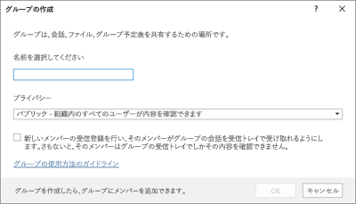
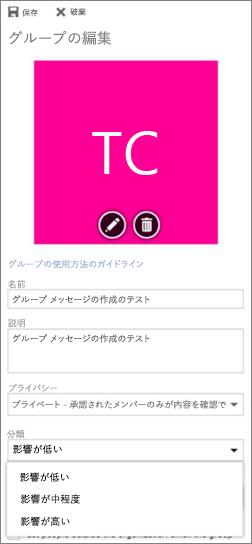

# <a name="manage-office-365-groups-with-powershell"></a><span data-ttu-id="1f769-103">PowerShell で Office 365 グループを管理する</span><span class="sxs-lookup"><span data-stu-id="1f769-103">Manage Office 365 Groups with PowerShell</span></span>

 <span data-ttu-id="1f769-104">*最終更新日2018年4月18日*</span><span class="sxs-lookup"><span data-stu-id="1f769-104">*Last updated 18 April, 2018*</span></span> 
  
<span data-ttu-id="1f769-105">この記事では、Microsoft PowerShell のグループに共通の管理タスクを実行する手順について説明します。</span><span class="sxs-lookup"><span data-stu-id="1f769-105">This article provides the steps for doing common management tasks for Groups in Microsoft PowerShell.</span></span> <span data-ttu-id="1f769-106">また、グループの PowerShell コマンドレットも一覧表示します。</span><span class="sxs-lookup"><span data-stu-id="1f769-106">It also lists the PowerShell cmdlets for Groups.</span></span> <span data-ttu-id="1f769-107">SharePoint サイトの管理の詳細については、「 [PowerShell を使用した Sharepoint Online サイトの管理](https://docs.microsoft.com/sharepoint/manage-team-and-communication-sites-in-powershell)」を参照してください。</span><span class="sxs-lookup"><span data-stu-id="1f769-107">For info about managing SharePoint sites, see [Manage SharePoint Online sites using PowerShell](https://docs.microsoft.com/sharepoint/manage-team-and-communication-sites-in-powershell).</span></span>

## <a name="link-to-your-office-365-groups-usage-guidelines"></a><span data-ttu-id="1f769-108">Office 365 グループの使用に関するガイドラインへのリンク</span><span class="sxs-lookup"><span data-stu-id="1f769-108">Link to your Office 365 Groups usage guidelines</span></span>
<span data-ttu-id="1f769-109"><a name="BK_LinkToGuideLines"> </a></span><span class="sxs-lookup"><span data-stu-id="1f769-109"></span></span>

<span data-ttu-id="1f769-110">ユーザーが[Outlook でグループを作成または編集](https://support.office.com/article/04d0c9cf-6864-423c-a380-4fa858f27102.aspx)するときに、組織の使用ガイドラインへのリンクを表示することができます。</span><span class="sxs-lookup"><span data-stu-id="1f769-110">When users [create or edit a group in Outlook](https://support.office.com/article/04d0c9cf-6864-423c-a380-4fa858f27102.aspx), you can show them a link to your organization's usage guidelines.</span></span> <span data-ttu-id="1f769-111">たとえば、特定のプレフィックスまたはサフィックスをグループ名に追加する必要がある場合などです。</span><span class="sxs-lookup"><span data-stu-id="1f769-111">For example, if you require a specific prefix or suffix to be added to a group name.</span></span>
  
<span data-ttu-id="1f769-112">Azure Active Directory PowerShell を使用して、Office 365 グループの組織の使用ガイドラインをユーザーに指定します。</span><span class="sxs-lookup"><span data-stu-id="1f769-112">Use the Azure Active Directory PowerShell to point your users to your organization's usage guidelines for Office 365 groups.</span></span> <span data-ttu-id="1f769-113">[グループ設定を構成するための Azure Active Directory コマンドレット](https://go.microsoft.com/fwlink/?LinkID=827484)をチェックアウトし、「**設定をディレクトリレベルで作成**する」の手順に従って、使用法のガイドラインへのハイパーリンクを定義します。</span><span class="sxs-lookup"><span data-stu-id="1f769-113">Check out [Azure Active Directory cmdlets for configuring group settings](https://go.microsoft.com/fwlink/?LinkID=827484) and follow the steps in the **Create settings at the directory level** to define the usage guideline hyperlink.</span></span> <span data-ttu-id="1f769-114">AAD コマンドレットを実行すると、Outlook でグループを作成または編集するときに、ユーザーにはガイドラインへのリンクが表示されます。</span><span class="sxs-lookup"><span data-stu-id="1f769-114">Once you run the AAD cmdlet, user's will see the link to your guidelines when they create or edit a group in Outlook.</span></span> 
  

  
![[グループの使用ガイドライン] をクリックして組織を表示する Office 365 グループのガイドライン](../media/d0d54ace-f0ec-4946-b2de-50ce23f17765.png)
  
## <a name="allow-users-to-send-as-the-office-365-group"></a><span data-ttu-id="1f769-117">ユーザーが Office 365 グループとして送信できるようにする</span><span class="sxs-lookup"><span data-stu-id="1f769-117">Allow users to Send as the Office 365 Group</span></span>
<span data-ttu-id="1f769-118"><a name="BK_LinkToGuideLines"> </a></span><span class="sxs-lookup"><span data-stu-id="1f769-118"></span></span>
  
<span data-ttu-id="1f769-119">Office 365 グループを "送信者として送信" にできるようにするには、[追加のアクセス許可](https://docs.microsoft.com/powershell/module/exchange/mailboxes/Add-RecipientPermission)と、各ユーザーの[アクセス許可](https://docs.microsoft.com/powershell/module/exchange/users-and-groups/Get-Recipient)のコマンドレットを使用してこれを構成します。</span><span class="sxs-lookup"><span data-stu-id="1f769-119">If you want to enable your Office 365 groups to "Send As", use the [Add-RecipientPermission](https://docs.microsoft.com/powershell/module/exchange/mailboxes/Add-RecipientPermission) and the [Get-RecipientPermission](https://docs.microsoft.com/powershell/module/exchange/users-and-groups/Get-Recipient) cmdlets to configure this.</span></span> <span data-ttu-id="1f769-120">この設定を有効にすると、Office 365 グループのユーザーは、Outlook または web 上の Outlook を使用して、Office 365 グループとして電子メールを送信および返信できます。</span><span class="sxs-lookup"><span data-stu-id="1f769-120">Once you enable this setting, Office 365 group users can use Outlook or Outlook on the web to send and reply to email as the Office 365 group.</span></span> <span data-ttu-id="1f769-121">ユーザーはグループに移動し、新しい電子メールを作成し、"送信者" フィールドをグループの電子メールアドレスに変更できます。</span><span class="sxs-lookup"><span data-stu-id="1f769-121">Users can go to the group, create a new email, and change the "Send As" field to the group's email address.</span></span> 

<span data-ttu-id="1f769-122">([これを Exchange 管理センターで行うこともでき](https://docs.microsoft.com/en-us/office365/admin/create-groups/allow-members-to-send-as-or-send-on-behalf-of-group)ます。)</span><span class="sxs-lookup"><span data-stu-id="1f769-122">([You can also do this in the Exchange Admin Center](https://docs.microsoft.com/en-us/office365/admin/create-groups/allow-members-to-send-as-or-send-on-behalf-of-group).)</span></span>
  
<span data-ttu-id="1f769-123">次のスクリプトを使用して、 \* \<groupalias\> *を更新するグループのエイリアスに置き換え、permssions を付与するユーザーのエイリアスを* \<useralias\> \*に置き換えます。</span><span class="sxs-lookup"><span data-stu-id="1f769-123">Use the following script, replacing *\<GroupAlias\>* with the alias of the group that you want to update, and *\<UserAlias\>* with the alias of the user to whom you want to grant permssions.</span></span> <span data-ttu-id="1f769-124">[Exchange Online PowerShell に接続](https://docs.microsoft.com/powershell/exchange/exchange-online/connect-to-exchange-online-powershell/connect-to-exchange-online-powershell)してこのスクリプトを実行します。</span><span class="sxs-lookup"><span data-stu-id="1f769-124">[Connect to Exchange Online PowerShell](https://docs.microsoft.com/powershell/exchange/exchange-online/connect-to-exchange-online-powershell/connect-to-exchange-online-powershell) to run this script.</span></span>

```PowerShell
$groupAlias = "<GroupAlias>"

$userAlias = "<UserAlias>"


$groupsRecipientDetails = Get-Recipient -RecipientTypeDetails groupmailbox -Identity $groupAlias

Add-RecipientPermission -Identity $groupsRecipientDetails.Name -Trustee $userAlias -AccessRights SendAs
```

<span data-ttu-id="1f769-125">コマンドレットを実行すると、グループの電子メールアドレスを**From**フィールドに追加することにより、ユーザーが outlook または web 上の outlook に移動してグループとして送信できるようになります。</span><span class="sxs-lookup"><span data-stu-id="1f769-125">Once the cmdlet is executed, users can go to Outlook or Outlook on the web to send as the group, by adding the group email address to the **From** field.</span></span> 

## <a name="create-classifications-for-office-groups-in-your-organization"></a><span data-ttu-id="1f769-126">組織の Office グループに対する分類を作成する</span><span class="sxs-lookup"><span data-stu-id="1f769-126">Create classifications for Office groups in your organization</span></span>

<span data-ttu-id="1f769-127">組織内のユーザーが Office 365 グループを作成するときに設定できる分類を作成できます。</span><span class="sxs-lookup"><span data-stu-id="1f769-127">You can create classifications that the users in your organization can set when they create an Office 365 group.</span></span> <span data-ttu-id="1f769-128">たとえば、ユーザーが作成したグループに "標準"、"Secret"、"Top Secret" の設定を許可できます。</span><span class="sxs-lookup"><span data-stu-id="1f769-128">For example, you can allow users to set "Standard", "Secret", and "Top Secret" on groups they create.</span></span> <span data-ttu-id="1f769-129">グループの分類は既定では設定されておらず、ユーザーが設定できるようにするために作成する必要があります。</span><span class="sxs-lookup"><span data-stu-id="1f769-129">Group classifications aren't set by default and you need to create it in order for your users to set it.</span></span> <span data-ttu-id="1f769-130">Azure Active Directory PowerShell を使用して、Office 365 グループの組織の使用ガイドラインをユーザーに指定します。</span><span class="sxs-lookup"><span data-stu-id="1f769-130">Use Azure Active Directory PowerShell to point your users to your organization's usage guidelines for Office 365 groups.</span></span>
  
<span data-ttu-id="1f769-131">[グループ設定を構成するための Azure Active Directory コマンドレット](https://docs.microsoft.com/azure/active-directory/users-groups-roles/groups-settings-cmdlets)をチェックアウトし、「**ディレクトリレベルで設定を作成**する」の手順に従って Office 365 グループの分類を定義します。</span><span class="sxs-lookup"><span data-stu-id="1f769-131">Check out [Azure Active Directory cmdlets for configuring group settings](https://docs.microsoft.com/azure/active-directory/users-groups-roles/groups-settings-cmdlets) and follow the steps in the **Create settings at the directory level** to define the classification for Office 365 groups.</span></span> 
  
```
$setting["ClassificationList"] = "Low Impact, Medium Impact, High Impact"
```

<span data-ttu-id="1f769-132">各分類に説明を関連付けるには、settings 属性*ClassificationDescriptions*を使用して定義します。</span><span class="sxs-lookup"><span data-stu-id="1f769-132">In order to associate a description to each classification you can use the settings attribute  *ClassificationDescriptions* to define.</span></span>
  
```
$setting["ClassificationDescriptions"] ="Classification:Description,Classification:Description"
```

<span data-ttu-id="1f769-133">分類が ClassificationList 内の文字列と一致する場合。</span><span class="sxs-lookup"><span data-stu-id="1f769-133">where Classification matches the strings in the ClassificationList.</span></span>

<span data-ttu-id="1f769-134">例:</span><span class="sxs-lookup"><span data-stu-id="1f769-134">Example:</span></span>
  
```
$setting["ClassificationDescriptions"] = "Low Impact: General communication, Medium Impact: Company internal data , High Impact: Data that has regulatory requirements"
```

<span data-ttu-id="1f769-135">前述の Azure Active Directory コマンドレットを実行して分類を設定した後、特定のグループの分類を設定する場合は、 [set-unifiedgroup](https://docs.microsoft.com/powershell/module/exchange/users-and-groups/Set-UnifiedGroup)コマンドレットを実行します。</span><span class="sxs-lookup"><span data-stu-id="1f769-135">After you run the above Azure Active Directory cmdlet to set your classification, run the [Set-UnifiedGroup](https://docs.microsoft.com/powershell/module/exchange/users-and-groups/Set-UnifiedGroup) cmdlet if you want to set the classification for a specific group.</span></span> 
  
```
Set-UnifiedGroup <LowImpactGroup@constoso.com> -Classification <LowImpact> 
```

<span data-ttu-id="1f769-136">または、分類を使用して新しいグループを作成します。</span><span class="sxs-lookup"><span data-stu-id="1f769-136">Or create a new group with a classification.</span></span>
  
```
New-UnifiedGroup <HighImpactGroup@constoso.com> -Classification <HighImpact> -AccessType <Public> 
```

<span data-ttu-id="1f769-137">Exchange Online PowerShell の使い方の詳細については、「[Exchange Online による PowerShell の使用](https://docs.microsoft.com/powershell/exchange/exchange-online/exchange-online-powershell)」および「[リモート PowerShell による Exchange への接続](https://docs.microsoft.com/powershell/exchange/exchange-online/connect-to-exchange-online-powershell/connect-to-exchange-online-powershell)」をご覧ください。</span><span class="sxs-lookup"><span data-stu-id="1f769-137">Check out [Using PowerShell with Exchange Online](https://docs.microsoft.com/powershell/exchange/exchange-online/exchange-online-powershell) and [Connect to Exchange Online PowerShell](https://docs.microsoft.com/powershell/exchange/exchange-online/connect-to-exchange-online-powershell/connect-to-exchange-online-powershell) for more details on using Exchange Online PowerShell.</span></span> 
  
<span data-ttu-id="1f769-138">これらの設定を有効にすると、グループの所有者は、Outlook on the Web および Outlook のドロップダウンメニューから分類を選択して、[グループの**編集**] ページから保存することができます。</span><span class="sxs-lookup"><span data-stu-id="1f769-138">Once these settings are enabled, the group owner will be able to choose a classification from the drop down menu in Outlook on the Web and Outlook, and save it from the **Edit** group page.</span></span> 
  

  
## <a name="hide-office-365-groups-from-gal"></a><span data-ttu-id="1f769-140">Office 365 グループを GAL から非表示にする</span><span class="sxs-lookup"><span data-stu-id="1f769-140">Hide Office 365 Groups from GAL</span></span>
<span data-ttu-id="1f769-141"><a name="BKMK_CreateClassification"> </a></span><span class="sxs-lookup"><span data-stu-id="1f769-141"></span></span>

<span data-ttu-id="1f769-142">組織内のグローバルアドレス一覧 (GAL) およびその他のリストに Office 365 グループを表示するかどうかを指定できます。</span><span class="sxs-lookup"><span data-stu-id="1f769-142">You can specify whether a Office 365 group appears in the global address list (GAL) and other lists in your organization.</span></span> <span data-ttu-id="1f769-143">たとえば、アドレス一覧に表示したくない法務部門のグループがある場合は、そのグループが GAL に表示されないようにすることができます。</span><span class="sxs-lookup"><span data-stu-id="1f769-143">For example, if you have a legal department group that you don't want to show up in the address list, you can stop that group from appearing in GAL.</span></span> <span data-ttu-id="1f769-144">Set 統合グループコマンドレットを実行して、次のようにグループをアドレス一覧から非表示にします。</span><span class="sxs-lookup"><span data-stu-id="1f769-144">Run the Set-Unified Group cmdlet to hide the group from address list like this:</span></span>
  
```
Set-UnifiedGroup -Identity "Legal Department" -HiddenFromAddressListsEnabled $true
```

## <a name="allow-only-internal-users-to-send-message-to-office-365-group"></a><span data-ttu-id="1f769-145">Office 365 グループへのメッセージの送信を内部ユーザーにのみ許可する</span><span class="sxs-lookup"><span data-stu-id="1f769-145">Allow only internal users to send message to Office 365 group</span></span>
<span data-ttu-id="1f769-146"><a name="BKMK_CreateClassification"> </a></span><span class="sxs-lookup"><span data-stu-id="1f769-146"></span></span>

<span data-ttu-id="1f769-147">他の組織のユーザーが Office 365 グループに電子メールを送信できないようにするには、そのグループの設定を変更します。</span><span class="sxs-lookup"><span data-stu-id="1f769-147">If you don't want users from other organization to send email to a Office 365 group, you can change the settings for that group.</span></span> <span data-ttu-id="1f769-148">内部ユーザーのみがグループに電子メールを送信できるようになります。</span><span class="sxs-lookup"><span data-stu-id="1f769-148">It will allow only internal users to send an email to your group.</span></span> <span data-ttu-id="1f769-149">外部ユーザーがこのグループにメッセージを送信しようとすると、拒否されます。</span><span class="sxs-lookup"><span data-stu-id="1f769-149">If external user try to send message to that group they will be rejected.</span></span>
  
<span data-ttu-id="1f769-150">この設定を更新するには、次のように Set-unifiedgroup コマンドレットを実行します。</span><span class="sxs-lookup"><span data-stu-id="1f769-150">Run the Set-UnifiedGroup cmdlet to update this setting, like this:</span></span>

```
Set-UnifiedGroup -Identity "Internal senders only" - RequireSenderAuthenticationEnabled $true
```

## <a name="add-mailtips-to-the-office-365-groups"></a><span data-ttu-id="1f769-151">Office 365 グループにメールヒントを追加する</span><span class="sxs-lookup"><span data-stu-id="1f769-151">Add MailTips to the Office 365 Groups</span></span>
<span data-ttu-id="1f769-152"><a name="BKMK_CreateClassification"> </a></span><span class="sxs-lookup"><span data-stu-id="1f769-152"></span></span>

<span data-ttu-id="1f769-153">送信者が Office 365 グループに電子メールを送信しようとするたびに、メールヒントを表示できます。</span><span class="sxs-lookup"><span data-stu-id="1f769-153">Whenever a sender tries to send an email to an Office 365 group, a MailTip can be shown to them.</span></span>
  
<span data-ttu-id="1f769-154">Set 統合グループコマンドレットを実行して、グループにメールヒントを追加します。</span><span class="sxs-lookup"><span data-stu-id="1f769-154">Run the Set-Unified Group cmdlet to add a mailTip to the group:</span></span>

```
Set-UnifiedGroup -Identity "MailTip Group" -MailTip "This group has a MailTip"
```

<span data-ttu-id="1f769-155">メールヒントと共に、mailtip 翻訳を設定して、メールヒントに追加の言語を指定することもできます。</span><span class="sxs-lookup"><span data-stu-id="1f769-155">Along with MailTip, you can also set MailTipTranslations, which specifies additional languages for the MailTip.</span></span> <span data-ttu-id="1f769-156">スペイン語の翻訳を取得する場合は、次のコマンドを実行します。</span><span class="sxs-lookup"><span data-stu-id="1f769-156">Suppose you want to have the Spanish translation, then run the following command:</span></span>
  
```
Set-UnifiedGroup -Identity "MailaTip Group" -MailTip "This group has a MailTip" -MailTipTranslations "@{Add="ES:Esta caja no se supervisa."
```

## <a name="change-display-name-of-the-office-365-group"></a><span data-ttu-id="1f769-157">Office 365 グループの表示名を変更する</span><span class="sxs-lookup"><span data-stu-id="1f769-157">Change Display name of the Office 365 group</span></span>

<span data-ttu-id="1f769-158">[表示名] Office 365 グループの名前を指定します。</span><span class="sxs-lookup"><span data-stu-id="1f769-158">Display name specifies the name of the Office 365 group.</span></span> <span data-ttu-id="1f769-159">この名前は、exchange 管理センターまたは Office 365 管理ポータルに表示されます。</span><span class="sxs-lookup"><span data-stu-id="1f769-159">You can see this name in your exchange admin center or Office 365 admin portal.</span></span> <span data-ttu-id="1f769-160">Set-unifiedgroup コマンドを実行すると、グループの表示名を編集したり、既存の Office 365 グループに表示名を割り当てることができます。</span><span class="sxs-lookup"><span data-stu-id="1f769-160">You can edit the display name of the group or assign a display name to an existing Office 365 group by running the Set-UnifiedGroup command:</span></span>

```
Set-UnifiedGroup -Identity "mygroup@contoso.com" -DisplayName "My new group"
```

## <a name="change-the-default-setting-of-office-365-groups-for-outlook-to-public-or-private"></a><span data-ttu-id="1f769-161">Outlook の Office 365 グループの既定の設定をパブリックまたはプライベートに変更する</span><span class="sxs-lookup"><span data-stu-id="1f769-161">Change the default setting of Office 365 Groups for Outlook to Public or Private</span></span>
<span data-ttu-id="1f769-162"><a name="BKMK_CreateClassification"> </a></span><span class="sxs-lookup"><span data-stu-id="1f769-162"></span></span>

<span data-ttu-id="1f769-163">既定では、Outlook の Office 365 グループはプライベートとして作成されます。</span><span class="sxs-lookup"><span data-stu-id="1f769-163">Office 365 Groups in Outlook are created as Private by default.</span></span> <span data-ttu-id="1f769-164">組織で Office 365 グループを既定でパブリックとして作成する (またはプライベートに戻す) 必要がある場合は、次の PowerShell コマンドレット構文を使用します。</span><span class="sxs-lookup"><span data-stu-id="1f769-164">If your organization wants Office 365 Groups to be created as Public by default (or back to Private), use this PowerShell cmdlet syntax:</span></span>
  
 `Set-OrganizationConfig -DefaultGroupAccessType Public`
  
<span data-ttu-id="1f769-165">Private に設定するには:</span><span class="sxs-lookup"><span data-stu-id="1f769-165">To set to Private:</span></span>
  
 `Set-OrganizationConfig -DefaultGroupAccessType Private`
  
<span data-ttu-id="1f769-166">設定を確認するには、次のようにします。</span><span class="sxs-lookup"><span data-stu-id="1f769-166">To verify the setting:</span></span> 
  
 `Get-OrganizationConfig | ft DefaultGroupAccessType`
  
<span data-ttu-id="1f769-167">詳細については[](https://docs.microsoft.com/powershell/module/exchange/organization/set-organizationconfig) 、「」を参照[](https://docs.microsoft.com/powershell/module/exchange/organization/Get-OrganizationConfig)してください。</span><span class="sxs-lookup"><span data-stu-id="1f769-167">To learn more, see [Set-OrganizationConfig](https://docs.microsoft.com/powershell/module/exchange/organization/set-organizationconfig) and [Get-OrganizationConfig](https://docs.microsoft.com/powershell/module/exchange/organization/Get-OrganizationConfig).</span></span>
  
## <a name="office-365-groups-cmdlets"></a><span data-ttu-id="1f769-168">Office 365 グループのコマンドレット</span><span class="sxs-lookup"><span data-stu-id="1f769-168">Office 365 Groups cmdlets</span></span>

<span data-ttu-id="1f769-169">Office 365 グループでは、次のコマンドレットを使用できます。</span><span class="sxs-lookup"><span data-stu-id="1f769-169">The following cmdlets can be used with Office 365 Groups.</span></span>
  
|<span data-ttu-id="1f769-170">**コマンドレット名**</span><span class="sxs-lookup"><span data-stu-id="1f769-170">**Cmdlet name**</span></span>|<span data-ttu-id="1f769-171">**説明**</span><span class="sxs-lookup"><span data-stu-id="1f769-171">**Description**</span></span>|
|:-----|:-----|
|[<span data-ttu-id="1f769-172">Set-unifiedgroup</span><span class="sxs-lookup"><span data-stu-id="1f769-172">Get-UnifiedGroup</span></span>](https://go.microsoft.com/fwlink/p/?LinkId=616182) <br/> |<span data-ttu-id="1f769-173">このコマンドレットを使用して、既存の Office 365 グループを検索し、グループオブジェクトのプロパティを表示します。</span><span class="sxs-lookup"><span data-stu-id="1f769-173">Use this cmdlet to look up existing Office 365 Groups, and to view properties of the group object</span></span>  <br/> |
|[<span data-ttu-id="1f769-174">Set-unifiedgroup</span><span class="sxs-lookup"><span data-stu-id="1f769-174">Set-UnifiedGroup</span></span>](https://go.microsoft.com/fwlink/p/?LinkId=616189) <br/> |<span data-ttu-id="1f769-175">特定の Office 365 グループのプロパティを更新する</span><span class="sxs-lookup"><span data-stu-id="1f769-175">Update the properties of a specific Office 365 Group</span></span>  <br/> |
|[<span data-ttu-id="1f769-176">Set-unifiedgroup</span><span class="sxs-lookup"><span data-stu-id="1f769-176">New-UnifiedGroup</span></span>](https://go.microsoft.com/fwlink/p/?LinkId=616183) <br/> |<span data-ttu-id="1f769-177">新しい Office 365 グループを作成します。</span><span class="sxs-lookup"><span data-stu-id="1f769-177">Create a new Office 365 group.</span></span> <span data-ttu-id="1f769-178">このコマンドレットは、最小限のパラメーターセットを提供します。拡張プロパティの値を設定するには、新しいグループを作成した後で Set-unifiedgroup を使用します。</span><span class="sxs-lookup"><span data-stu-id="1f769-178">This cmdlet provides a minimal set of parameters, for setting values for extended properties use Set-UnifiedGroup after creating the new group</span></span>  <br/> |
|[<span data-ttu-id="1f769-179">Set-unifiedgroup</span><span class="sxs-lookup"><span data-stu-id="1f769-179">Remove-UnifiedGroup</span></span>](https://go.microsoft.com/fwlink/p/?LinkId=616186) <br/> |<span data-ttu-id="1f769-180">既存の Office 365 グループを削除する</span><span class="sxs-lookup"><span data-stu-id="1f769-180">Delete an existing Office 365 Group</span></span>  <br/> |
|[<span data-ttu-id="1f769-181">UnifiedGroupLinks</span><span class="sxs-lookup"><span data-stu-id="1f769-181">Get-UnifiedGroupLinks</span></span>](https://go.microsoft.com/fwlink/p/?LinkId=616194) <br/> |<span data-ttu-id="1f769-182">Office 365 グループのメンバーシップと所有者の情報を取得する</span><span class="sxs-lookup"><span data-stu-id="1f769-182">Retrieve membership and owner information for an Office 365 Group</span></span>  <br/> |
|[<span data-ttu-id="1f769-183">UnifiedGroupLinks</span><span class="sxs-lookup"><span data-stu-id="1f769-183">Add-UnifiedGroupLinks</span></span>](https://go.microsoft.com/fwlink/p/?LinkId=616191) <br/> |<span data-ttu-id="1f769-184">既存の Office 365 グループに100人または数千のユーザー、または新しい所有者を追加する</span><span class="sxs-lookup"><span data-stu-id="1f769-184">Add hundred or thousands of users, or new owners, to an existing Office 365 Group</span></span>  <br/> |
|[<span data-ttu-id="1f769-185">UnifiedGroupLinks</span><span class="sxs-lookup"><span data-stu-id="1f769-185">Remove-UnifiedGroupLinks</span></span>](https://go.microsoft.com/fwlink/p/?LinkId=616195) <br/> |<span data-ttu-id="1f769-186">既存の Office 365 グループから所有者とメンバーを削除する</span><span class="sxs-lookup"><span data-stu-id="1f769-186">Remove owners and members from an existing Office 365 Group</span></span>  <br/> |
|[<span data-ttu-id="1f769-187">取得-UserPhoto</span><span class="sxs-lookup"><span data-stu-id="1f769-187">Get-UserPhoto</span></span>](https://go.microsoft.com/fwlink/p/?LinkId=536510) <br/> |<span data-ttu-id="1f769-188">アカウントに関連付けられたユーザーの写真に関する情報を表示するために使用します。</span><span class="sxs-lookup"><span data-stu-id="1f769-188">Used to view information about the user photo associated with an account.</span></span> <span data-ttu-id="1f769-189">ユーザーの写真は Active Directory に格納されます。</span><span class="sxs-lookup"><span data-stu-id="1f769-189">User photos are stored in Active Directory</span></span>  <br/> |
|[<span data-ttu-id="1f769-190">設定-UserPhoto</span><span class="sxs-lookup"><span data-stu-id="1f769-190">Set-UserPhoto</span></span>](https://go.microsoft.com/fwlink/p/?LinkId=536511) <br/> |<span data-ttu-id="1f769-191">ユーザーの写真をアカウントに関連付けるために使用します。</span><span class="sxs-lookup"><span data-stu-id="1f769-191">Used to associate a user photo with an account.</span></span> <span data-ttu-id="1f769-192">ユーザーの写真は Active Directory に格納されます。</span><span class="sxs-lookup"><span data-stu-id="1f769-192">User photos are stored in Active Directory</span></span>  <br/> |
|[<span data-ttu-id="1f769-193">削除-UserPhoto</span><span class="sxs-lookup"><span data-stu-id="1f769-193">Remove-UserPhoto</span></span>](https://go.microsoft.com/fwlink/p/?LinkId=536512) <br/> |<span data-ttu-id="1f769-194">Office 365 グループの写真を削除する</span><span class="sxs-lookup"><span data-stu-id="1f769-194">Remove the photo for an Office 365 group</span></span>  <br/> |

## <a name="related-topics"></a><span data-ttu-id="1f769-195">関連項目</span><span class="sxs-lookup"><span data-stu-id="1f769-195">Related topics</span></span>

[<span data-ttu-id="1f769-196">配布リストを Office 365 グループにアップグレードする</span><span class="sxs-lookup"><span data-stu-id="1f769-196">Upgrade distribution lists to Office 365 Groups</span></span>](https://docs.microsoft.com/en-us/office365/admin/manage/upgrade-distribution-lists)

[<span data-ttu-id="1f769-197">Office 365 グループを作成できるユーザーを管理する</span><span class="sxs-lookup"><span data-stu-id="1f769-197">Manage who can create Office 365 Groups</span></span>](https://docs.microsoft.com/en-us/office365/admin/create-groups/manage-creation-of-groups)

[<span data-ttu-id="1f769-198">Office 365 グループへのゲスト アクセスを管理する</span><span class="sxs-lookup"><span data-stu-id="1f769-198">Manage guest access to Office 365 Groups</span></span>](https://support.office.com/article/bfc7a840-868f-4fd6-a390-f347bf51aff6)

[<span data-ttu-id="1f769-199">の静的グループのメンバーシップを動的に変更する</span><span class="sxs-lookup"><span data-stu-id="1f769-199">Change static group membership to dynamic in</span></span>](https://docs.microsoft.com/azure/active-directory/users-groups-roles/groups-change-type)
