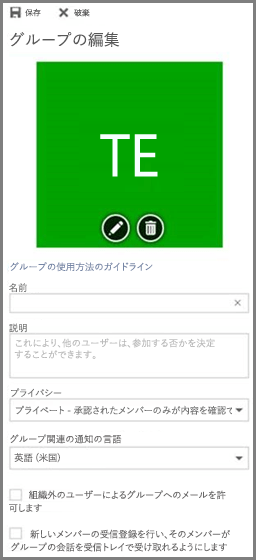

# <a name="manage-office-365-groups-with-powershell"></a><span data-ttu-id="313e8-103">PowerShell で Office 365 グループを管理する</span><span class="sxs-lookup"><span data-stu-id="313e8-103">Manage Office 365 Groups with PowerShell</span></span>

 <span data-ttu-id="313e8-104">*最終更新日時 2018 年 4 月 18 日*</span><span class="sxs-lookup"><span data-stu-id="313e8-104">*Last updated 18 April, 2018*</span></span> 
  
<span data-ttu-id="313e8-105">この記事では、Microsoft PowerShell でグループの一般的な管理タスクを行うための手順について説明します。</span><span class="sxs-lookup"><span data-stu-id="313e8-105">This article provides the steps for doing common management tasks for Groups in Microsoft PowerShell.</span></span> <span data-ttu-id="313e8-106">また、グループの PowerShell コマンドレットを示します。</span><span class="sxs-lookup"><span data-stu-id="313e8-106">It also lists the PowerShell cmdlets for Groups.</span></span> <span data-ttu-id="313e8-107">SharePoint サイトを管理する方法の詳細については、「[PowerShell を使用して SharePoint Online サイトを管理する](https://docs.microsoft.com/sharepoint/manage-team-and-communication-sites-in-powershell)」を参照してください。</span><span class="sxs-lookup"><span data-stu-id="313e8-107">For info about managing SharePoint sites, see [Manage SharePoint Online sites using PowerShell](https://docs.microsoft.com/sharepoint/manage-team-and-communication-sites-in-powershell).</span></span>

## <a name="link-to-your-office-365-groups-usage-guidelines"></a><span data-ttu-id="313e8-108">Office 365 グループの使用に関するガイドラインへのリンク</span><span class="sxs-lookup"><span data-stu-id="313e8-108">Link to your Office 365 Groups usage guidelines</span></span>
<span data-ttu-id="313e8-109"><a name="BK_LinkToGuideLines"> </a></span><span class="sxs-lookup"><span data-stu-id="313e8-109"></span></span>

<span data-ttu-id="313e8-110">ユーザーが [Outlook でグループを作成または編集](https://support.office.com/article/04d0c9cf-6864-423c-a380-4fa858f27102.aspx)するときに、組織での使用に関するガイドラインへのリンクをそのユーザーに表示することができます。</span><span class="sxs-lookup"><span data-stu-id="313e8-110">When users [create or edit a group in Outlook](https://support.office.com/article/04d0c9cf-6864-423c-a380-4fa858f27102.aspx), you can show them a link to your organization's usage guidelines.</span></span> <span data-ttu-id="313e8-111">たとえば、グループ名に特定のプレフィックスまたはサフィックスを追加する必要がある場合があります。</span><span class="sxs-lookup"><span data-stu-id="313e8-111">For example, if you require a specific prefix or suffix to be added to a group name.</span></span>
  
<span data-ttu-id="313e8-112">組織の Office 365 グループ使用ガイドラインをユーザーに参照させるには、Azure Active Directory PowerShell を使用します。</span><span class="sxs-lookup"><span data-stu-id="313e8-112">Use the Azure Active Directory PowerShell to point your users to your organization's usage guidelines for Office 365 groups.</span></span> <span data-ttu-id="313e8-113">「[グループの設定を構成するための Azure Active Directory コマンドレット](https://go.microsoft.com/fwlink/?LinkID=827484)」の「**ディレクトリ レベルでの設定の作成**」の手順に従って、使用ガイドラインのハイパーリンクを定義します。</span><span class="sxs-lookup"><span data-stu-id="313e8-113">Check out [Azure Active Directory cmdlets for configuring group settings](https://go.microsoft.com/fwlink/?LinkID=827484) and follow the steps in the **Create settings at the directory level** to define the usage guideline hyperlink.</span></span> <span data-ttu-id="313e8-114">AAD コマンドレットを実行すると、ユーザーが Outlook でグループを作成または編集するときに、ガイドラインへのリンクが表示されます。</span><span class="sxs-lookup"><span data-stu-id="313e8-114">Once you run the AAD cmdlet, user's will see the link to your guidelines when they create or edit a group in Outlook.</span></span> 
  

  

  
## <a name="allow-users-to-send-as-the-office-365-group"></a><span data-ttu-id="313e8-117">ユーザーが Office 365 グループとして送信することを許可する</span><span class="sxs-lookup"><span data-stu-id="313e8-117">Allow users to Send as the Office 365 Group</span></span>
<span data-ttu-id="313e8-118"><a name="BK_LinkToGuideLines"> </a></span><span class="sxs-lookup"><span data-stu-id="313e8-118"></span></span>
  
<span data-ttu-id="313e8-119">Office 365 グループの「メールボックス所有者として送信する」を有効にする場合は、[Add-RecipientPermission](https://docs.microsoft.com/powershell/module/exchange/mailboxes/Add-RecipientPermission) と [Get-RecipientPermission](https://docs.microsoft.com/powershell/module/exchange/users-and-groups/Get-Recipient) コマンドレットを使用して構成します。</span><span class="sxs-lookup"><span data-stu-id="313e8-119">If you want to enable your Office 365 groups to "Send As", use the [Add-RecipientPermission](https://docs.microsoft.com/powershell/module/exchange/mailboxes/Add-RecipientPermission) and the [Get-RecipientPermission](https://docs.microsoft.com/powershell/module/exchange/users-and-groups/Get-Recipient) cmdlets to configure this.</span></span> <span data-ttu-id="313e8-120">この設定を有効にすると、Office 365 グループのユーザーは Outlook または Outlook on the web を使用して、Office 365 グループとしてメールを送信および返信することができます。</span><span class="sxs-lookup"><span data-stu-id="313e8-120">Once you enable this setting, Office 365 group users can use Outlook or Outlook on the web to send and reply to email as the Office 365 group.</span></span> <span data-ttu-id="313e8-121">ユーザーはグループに移動し、新しいメールを作成して、「メールボックス所有者として送信する」フィールドをグループのメール アドレスに変更することができます。</span><span class="sxs-lookup"><span data-stu-id="313e8-121">Users can go to the group, create a new email, and change the "Send As" field to the group's email address.</span></span> 

<span data-ttu-id="313e8-122">([Exchange 管理センターでもこれを行うことができます](https://docs.microsoft.com/ja-JP/office365/admin/create-groups/allow-members-to-send-as-or-send-on-behalf-of-group)。)</span><span class="sxs-lookup"><span data-stu-id="313e8-122">([You can also do this in the Exchange Admin Center](https://docs.microsoft.com/ja-JP/office365/admin/create-groups/allow-members-to-send-as-or-send-on-behalf-of-group).)</span></span>
  
<span data-ttu-id="313e8-123">次のスクリプトを使用して、*\<GroupAlias\>* を更新するグループのエイリアスに置き換え、*\<UserAlias\>* を権限を付与するユーザーのエイリアスに置き換えます。</span><span class="sxs-lookup"><span data-stu-id="313e8-123">Use the following script, replacing *\<GroupAlias\>* with the alias of the group that you want to update, and *\<UserAlias\>* with the alias of the user to whom you want to grant permssions.</span></span> <span data-ttu-id="313e8-124">[Exchange Online PowerShell に接続し](https://docs.microsoft.com/powershell/exchange/exchange-online/connect-to-exchange-online-powershell/connect-to-exchange-online-powershell)、このスクリプトを実行します。</span><span class="sxs-lookup"><span data-stu-id="313e8-124">[Connect to Exchange Online PowerShell](https://docs.microsoft.com/powershell/exchange/exchange-online/connect-to-exchange-online-powershell/connect-to-exchange-online-powershell) to run this script.</span></span>

```PowerShell
$groupAlias = "<GroupAlias>"

$userAlias = "<UserAlias>"


$groupsRecipientDetails = Get-Recipient -RecipientTypeDetails groupmailbox -Identity $groupAlias

Add-RecipientPermission -Identity $groupsRecipientDetails.Name -Trustee $userAlias -AccessRights SendAs
```

<span data-ttu-id="313e8-125">コマンドレットが実行されると、**From** フィールドにグループ メール アドレスを追加することにより、ユーザーが Outlook または Outlook on the web に移動して、グループとして送信することができます。</span><span class="sxs-lookup"><span data-stu-id="313e8-125">Once the cmdlet is executed, users can go to Outlook or Outlook on the web to send as the group, by adding the group email address to the **From** field.</span></span> 

## <a name="create-classifications-for-office-groups-in-your-organization"></a><span data-ttu-id="313e8-126">組織の Office グループの分類を作成する</span><span class="sxs-lookup"><span data-stu-id="313e8-126">Create classifications for Office groups in your organization</span></span>

<span data-ttu-id="313e8-127">組織内のユーザーが Office 365 グループを作成するときに設定できる分類を作成できます。</span><span class="sxs-lookup"><span data-stu-id="313e8-127">You can create classifications that the users in your organization can set when they create an Office 365 group.</span></span> <span data-ttu-id="313e8-128">たとえば、作成するグループにユーザーが「標準」、「機密」、「極秘」といった分類を設定できるようにすることができます。</span><span class="sxs-lookup"><span data-stu-id="313e8-128">For example, you can allow users to set "Standard", "Secret", and "Top Secret" on groups they create.</span></span> <span data-ttu-id="313e8-129">グループの分類は既定では設定されていないので、ユーザーに分類を設定させるには、分類を作成する必要があります。</span><span class="sxs-lookup"><span data-stu-id="313e8-129">Group classifications aren't set by default and you need to create it in order for your users to set it.</span></span> <span data-ttu-id="313e8-130">組織の Office 365 グループ使用ガイドラインをユーザーに参照させるには、Azure Active Directory PowerShell を使用します。</span><span class="sxs-lookup"><span data-stu-id="313e8-130">Use Azure Active Directory PowerShell to point your users to your organization's usage guidelines for Office 365 groups.</span></span>
  
<span data-ttu-id="313e8-131">「[グループの設定を構成するための Azure Active Directory コマンドレット](https://docs.microsoft.com/azure/active-directory/users-groups-roles/groups-settings-cmdlets)」の「**ディレクトリ レベルでの設定の作成**」の手順に従って、Office 365 グループの分類を定義します。</span><span class="sxs-lookup"><span data-stu-id="313e8-131">Check out [Azure Active Directory cmdlets for configuring group settings](https://docs.microsoft.com/azure/active-directory/users-groups-roles/groups-settings-cmdlets) and follow the steps in the **Create settings at the directory level** to define the classification for Office 365 groups.</span></span> 
  
```
$setting["ClassificationList"] = "Low Impact, Medium Impact, High Impact"
```

<span data-ttu-id="313e8-132">各分類に説明を関連付けるために、定義する設定属性 *ClassificationDescriptions* を使用できます。</span><span class="sxs-lookup"><span data-stu-id="313e8-132">In order to associate a description to each classification you can use the settings attribute  *ClassificationDescriptions* to define.</span></span>
  
```
$setting["ClassificationDescriptions"] ="Classification:Description,Classification:Description"
```

<span data-ttu-id="313e8-133">ここで、Classification は ClassificationList の文字列と一致します。</span><span class="sxs-lookup"><span data-stu-id="313e8-133">where Classification matches the strings in the ClassificationList.</span></span>

<span data-ttu-id="313e8-134">例:</span><span class="sxs-lookup"><span data-stu-id="313e8-134">Example:</span></span>
  
```
$setting["ClassificationDescriptions"] = "Low Impact: General communication, Medium Impact: Company internal data , High Impact: Data that has regulatory requirements"
```

<span data-ttu-id="313e8-135">上の Azure Active Directory コマンドレットを実行して分類を設定した後、特定のグループに分類を設定する場合は、[Set-UnifiedGroup](https://docs.microsoft.com/powershell/module/exchange/users-and-groups/Set-UnifiedGroup) コマンドレットを実行します。</span><span class="sxs-lookup"><span data-stu-id="313e8-135">After you run the above Azure Active Directory cmdlet to set your classification, run the [Set-UnifiedGroup](https://docs.microsoft.com/powershell/module/exchange/users-and-groups/Set-UnifiedGroup) cmdlet if you want to set the classification for a specific group.</span></span> 
  
```
Set-UnifiedGroup <LowImpactGroup@constoso.com> -Classification <LowImpact> 
```

<span data-ttu-id="313e8-136">または、分類を使用して新しいグループを作成します。</span><span class="sxs-lookup"><span data-stu-id="313e8-136">Or create a new group with a classification.</span></span>
  
```
New-UnifiedGroup <HighImpactGroup@constoso.com> -Classification <HighImpact> -AccessType <Public> 
```

<span data-ttu-id="313e8-137">Exchange Online PowerShell の使用の詳細については、「[Exchange Online による PowerShell の使用](https://docs.microsoft.com/powershell/exchange/exchange-online/exchange-online-powershell)」および「[Exchange Online PowerShell への接続](https://docs.microsoft.com/powershell/exchange/exchange-online/connect-to-exchange-online-powershell/connect-to-exchange-online-powershell)」を参照してください。</span><span class="sxs-lookup"><span data-stu-id="313e8-137">Check out [Using PowerShell with Exchange Online](https://docs.microsoft.com/powershell/exchange/exchange-online/exchange-online-powershell) and [Connect to Exchange Online PowerShell](https://docs.microsoft.com/powershell/exchange/exchange-online/connect-to-exchange-online-powershell/connect-to-exchange-online-powershell) for more details on using Exchange Online PowerShell.</span></span> 
  
<span data-ttu-id="313e8-138">これらの設定を有効にした後、グループの所有者は、Outlook on the web および Outlook​​ のドロップダウン メニューから分類を選択し、[**編集**] グループ ページから分類を保存できるようになります。</span><span class="sxs-lookup"><span data-stu-id="313e8-138">Once these settings are enabled, the group owner will be able to choose a classification from the drop down menu in Outlook on the Web and Outlook, and save it from the **Edit** group page.</span></span> 
  

  
## <a name="hide-office-365-groups-from-gal"></a><span data-ttu-id="313e8-140">GAL から Office 365 グループを非表示にする</span><span class="sxs-lookup"><span data-stu-id="313e8-140">Hide Office 365 Groups from the GAL</span></span>
<span data-ttu-id="313e8-141"><a name="BKMK_CreateClassification"> </a></span><span class="sxs-lookup"><span data-stu-id="313e8-141"></span></span>

<span data-ttu-id="313e8-142">Office 365 グループを組織内のグローバル アドレス一覧 (GAL) や他のリストに表示するかどうかを指定することができます。</span><span class="sxs-lookup"><span data-stu-id="313e8-142">You can specify whether a Office 365 group appears in the global address list (GAL) and other lists in your organization.</span></span> <span data-ttu-id="313e8-143">たとえば、アドレス一覧に表示したくない法務部グループがある場合は、GAL にそのグループを表示しないようにすることができます。</span><span class="sxs-lookup"><span data-stu-id="313e8-143">For example, if you have a legal department group that you don't want to show up in the address list, you can stop that group from appearing in GAL.</span></span> <span data-ttu-id="313e8-144">アドレス一覧からグループを非表示にするには、次のように Set-UnifiedGroup コマンドレットを実行します。</span><span class="sxs-lookup"><span data-stu-id="313e8-144">Run the Set-Unified Group cmdlet to hide the group from address list like this:</span></span>
  
```
Set-UnifiedGroup -Identity "Legal Department" -HiddenFromAddressListsEnabled $true
```

## <a name="allow-only-internal-users-to-send-message-to-office-365-group"></a><span data-ttu-id="313e8-145">Office 365 グループへのメッセージの送信を内部ユーザーにのみ許可する</span><span class="sxs-lookup"><span data-stu-id="313e8-145">Allow only internal users to send message to Office 365 group</span></span>
<span data-ttu-id="313e8-146"><a name="BKMK_CreateClassification"> </a></span><span class="sxs-lookup"><span data-stu-id="313e8-146"></span></span>

<span data-ttu-id="313e8-147">他の組織のユーザーに Office 365 グループへのメールを送信してほしくない場合は、そのグループの設定を変更できます。</span><span class="sxs-lookup"><span data-stu-id="313e8-147">If you don't want users from other organization to send email to a Office 365 group, you can change the settings for that group.</span></span> <span data-ttu-id="313e8-148">これにより、内部のユーザーのみがグループにメールを送信できるようになります。</span><span class="sxs-lookup"><span data-stu-id="313e8-148">It will allow only internal users to send an email to your group.</span></span> <span data-ttu-id="313e8-149">外部ユーザーがそのグループにメッセージを送信しようとしても、拒否されます。</span><span class="sxs-lookup"><span data-stu-id="313e8-149">If external user try to send message to that group they will be rejected.</span></span>
  
<span data-ttu-id="313e8-150">この設定を更新するには、次のように Set-UnifiedGroup コマンドレットを実行します。</span><span class="sxs-lookup"><span data-stu-id="313e8-150">Run the Set-UnifiedGroup cmdlet to update this setting, like this:</span></span>

```
Set-UnifiedGroup -Identity "Internal senders only" -RequireSenderAuthenticationEnabled $true
```

## <a name="add-mailtips-to-the-office-365-groups"></a><span data-ttu-id="313e8-151">Office 365 グループにメール ヒントを追加する</span><span class="sxs-lookup"><span data-stu-id="313e8-151">Add MailTips to the Office 365 Groups</span></span>
<span data-ttu-id="313e8-152"><a name="BKMK_CreateClassification"> </a></span><span class="sxs-lookup"><span data-stu-id="313e8-152"></span></span>

<span data-ttu-id="313e8-153">送信者が Office 365 グループにメールを送信しようとするたびに、メール ヒントが表示されるようにすることができます。</span><span class="sxs-lookup"><span data-stu-id="313e8-153">Whenever a sender tries to send an email to an Office 365 group, a MailTip can be shown to them.</span></span>
  
<span data-ttu-id="313e8-154">グループにメール ヒントを追加するには、Set-UnifiedGroup コマンドレットを実行します。</span><span class="sxs-lookup"><span data-stu-id="313e8-154">Run the Set-Unified Group cmdlet to add a mailTip to the group:</span></span>

```
Set-UnifiedGroup -Identity "MailTip Group" -MailTip "This group has a MailTip"
```

<span data-ttu-id="313e8-155">メール ヒントと共に、MailTipTranslations を設定することもできます。これは、メール ヒントの追加言語を指定します。</span><span class="sxs-lookup"><span data-stu-id="313e8-155">Along with MailTip, you can also set MailTipTranslations, which specifies additional languages for the MailTip.</span></span> <span data-ttu-id="313e8-156">スペイン語の翻訳を追加するとします。この場合は、次のコマンドを実行します。</span><span class="sxs-lookup"><span data-stu-id="313e8-156">Suppose you want to have the Spanish translation, then run the following command:</span></span>
  
```
Set-UnifiedGroup -Identity "MailaTip Group" -MailTip "This group has a MailTip" -MailTipTranslations "@{Add="ES:Esta caja no se supervisa."
```

## <a name="change-display-name-of-the-office-365-group"></a><span data-ttu-id="313e8-157">Office 365 グループの表示名を変更する</span><span class="sxs-lookup"><span data-stu-id="313e8-157">Change Display name of the Office 365 group</span></span>

<span data-ttu-id="313e8-158">表示名は、Office 365 グループの名前を指定します。</span><span class="sxs-lookup"><span data-stu-id="313e8-158">Display name specifies the name of the Office 365 group.</span></span> <span data-ttu-id="313e8-159">この名前は、Exchange 管理センターまたは Office 365 管理ポータルで表示できます。</span><span class="sxs-lookup"><span data-stu-id="313e8-159">You can see this name in your exchange admin center or Office 365 admin portal.</span></span> <span data-ttu-id="313e8-160">Set-UnifiedGroup コマンドを実行して、グループの表示名を編集するか、既存の Office 365 グループに表示名を割り当てることができます。</span><span class="sxs-lookup"><span data-stu-id="313e8-160">You can edit the display name of the group or assign a display name to an existing Office 365 group by running the Set-UnifiedGroup command:</span></span>

```
Set-UnifiedGroup -Identity "mygroup@contoso.com" -DisplayName "My new group"
```

## <a name="change-the-default-setting-of-office-365-groups-for-outlook-to-public-or-private"></a><span data-ttu-id="313e8-161">Outlook 用 Office 365 グループの既定の設定を公開または非公開に変更する</span><span class="sxs-lookup"><span data-stu-id="313e8-161">How to change the default setting of Office 365 Groups for Outlook, to public or private</span></span>
<span data-ttu-id="313e8-162"><a name="BKMK_CreateClassification"> </a></span><span class="sxs-lookup"><span data-stu-id="313e8-162"></span></span>

<span data-ttu-id="313e8-163">Outlook の Office 365 グループは、既定で非公開として作成されます。</span><span class="sxs-lookup"><span data-stu-id="313e8-163">Office 365 Groups in Outlook are created as Private by default.</span></span> <span data-ttu-id="313e8-164">組織が既定で Office 365 グループを公開として作成する (または非公開に戻す) 場合は、次の PowerShell コマンドレット構文を使用します。</span><span class="sxs-lookup"><span data-stu-id="313e8-164">If your organization wants Office 365 Groups to be created as Public by default (or back to Private), use this PowerShell cmdlet syntax:</span></span>
  
 `Set-OrganizationConfig -DefaultGroupAccessType Public`
  
<span data-ttu-id="313e8-165">非公開に設定するには:</span><span class="sxs-lookup"><span data-stu-id="313e8-165">To set to Private:</span></span>
  
 `Set-OrganizationConfig -DefaultGroupAccessType Private`
  
<span data-ttu-id="313e8-166">設定を確認するには:</span><span class="sxs-lookup"><span data-stu-id="313e8-166">To verify the setting:</span></span> 
  
 `Get-OrganizationConfig | ft DefaultGroupAccessType`
  
<span data-ttu-id="313e8-167">詳細については、「[Set-OrganizationConfig](https://docs.microsoft.com/powershell/module/exchange/organization/set-organizationconfig)」および「[Get-OrganizationConfig](https://docs.microsoft.com/powershell/module/exchange/organization/Get-OrganizationConfig)」を参照してください。</span><span class="sxs-lookup"><span data-stu-id="313e8-167">To learn more, see [Set-OrganizationConfig](https://docs.microsoft.com/powershell/module/exchange/organization/set-organizationconfig) and [Get-OrganizationConfig](https://docs.microsoft.com/powershell/module/exchange/organization/Get-OrganizationConfig).</span></span>
  
## <a name="office-365-groups-cmdlets"></a><span data-ttu-id="313e8-168">Office 365 グループのコマンドレット</span><span class="sxs-lookup"><span data-stu-id="313e8-168">Office 365 Groups</span></span>

<span data-ttu-id="313e8-169">次のコマンドレットは、Office 365 グループで使用できます。</span><span class="sxs-lookup"><span data-stu-id="313e8-169">The following Lync Online clients can be used with Office 365:</span></span>
  
|<span data-ttu-id="313e8-170">**コマンドレット名**</span><span class="sxs-lookup"><span data-stu-id="313e8-170">**Cmdlet name**</span></span>|<span data-ttu-id="313e8-171">**Description**</span><span class="sxs-lookup"><span data-stu-id="313e8-171">**Description**</span></span>|
|:-----|:-----|
|[<span data-ttu-id="313e8-172">Get-UnifiedGroup</span><span class="sxs-lookup"><span data-stu-id="313e8-172">GetUnifiedGroup</span></span>](https://go.microsoft.com/fwlink/p/?LinkId=616182) <br/> |<span data-ttu-id="313e8-173">既存の Office 365 グループを検索し、グループ オブジェクトのプロパティを表示するには、このコマンドレットを使用します。</span><span class="sxs-lookup"><span data-stu-id="313e8-173">Use this cmdlet to look up existing Office 365 Groups, and to view properties of the group object</span></span>  <br/> |
|[<span data-ttu-id="313e8-174">Set-UnifiedGroup</span><span class="sxs-lookup"><span data-stu-id="313e8-174">Set-UnifiedGroup</span></span>](https://go.microsoft.com/fwlink/p/?LinkId=616189) <br/> |<span data-ttu-id="313e8-175">特定の Office 365 グループのプロパティを更新します。</span><span class="sxs-lookup"><span data-stu-id="313e8-175">Update the properties of a specific Office 365 Group</span></span>  <br/> |
|[<span data-ttu-id="313e8-176">New-UnifiedGroup</span><span class="sxs-lookup"><span data-stu-id="313e8-176">New-UnifiedGroup</span></span>](https://go.microsoft.com/fwlink/p/?LinkId=616183) <br/> |<span data-ttu-id="313e8-177">新しい Office 365 グループを作成します。</span><span class="sxs-lookup"><span data-stu-id="313e8-177">Create a new Office 365 group using a POST call</span></span> <span data-ttu-id="313e8-178">このコマンドレットに用意されているパラメーター セットは最小限です。拡張プロパティの値を設定するには、新しいグループを作成した後に Set-UnifiedGroup を使用します。</span><span class="sxs-lookup"><span data-stu-id="313e8-178">This cmdlet provides a minimal set of parameters, for setting values for extended properties use Set-UnifiedGroup after creating the new group</span></span>  <br/> |
|[<span data-ttu-id="313e8-179">Remove-UnifiedGroup</span><span class="sxs-lookup"><span data-stu-id="313e8-179">Remove-UnifiedGroup</span></span>](https://go.microsoft.com/fwlink/p/?LinkId=616186) <br/> |<span data-ttu-id="313e8-180">既存の Office 365 グループを削除します。</span><span class="sxs-lookup"><span data-stu-id="313e8-180">Delete an existing Office 365 Group</span></span>  <br/> |
|[<span data-ttu-id="313e8-181">Get-UnifiedGroupLinks</span><span class="sxs-lookup"><span data-stu-id="313e8-181">Get-UnifiedGroupLinks</span></span>](https://go.microsoft.com/fwlink/p/?LinkId=616194) <br/> |<span data-ttu-id="313e8-182">Office 365 グループのメンバーシップと所有者情報を取得します。</span><span class="sxs-lookup"><span data-stu-id="313e8-182">Retrieve membership and owner information for an Office 365 Group</span></span>  <br/> |
|[<span data-ttu-id="313e8-183">Add-UnifiedGroupLinks</span><span class="sxs-lookup"><span data-stu-id="313e8-183">Add-UnifiedGroupLinks</span></span>](https://go.microsoft.com/fwlink/p/?LinkId=616191) <br/> |<span data-ttu-id="313e8-184">数百、数千人のユーザー (新しい所有者) を既存の Office 365 グループに追加します。</span><span class="sxs-lookup"><span data-stu-id="313e8-184">Add hundred or thousands of users, or new owners, to an existing Office 365 Group</span></span>  <br/> |
|[<span data-ttu-id="313e8-185">Remove-UnifiedGroupLinks</span><span class="sxs-lookup"><span data-stu-id="313e8-185">Remove-UnifiedGroupLinks</span></span>](https://go.microsoft.com/fwlink/p/?LinkId=616195) <br/> |<span data-ttu-id="313e8-186">所有者とメンバーを既存の Office 365 グループから削除します。</span><span class="sxs-lookup"><span data-stu-id="313e8-186">Remove owners and members from an existing Office 365 Group</span></span>  <br/> |
|[<span data-ttu-id="313e8-187">Get-UserPhoto</span><span class="sxs-lookup"><span data-stu-id="313e8-187">Get-UserPhoto</span></span>](https://go.microsoft.com/fwlink/p/?LinkId=536510) <br/> |<span data-ttu-id="313e8-188">アカウントと関連付けられたユーザーの写真について情報を表示します。</span><span class="sxs-lookup"><span data-stu-id="313e8-188">Used to view information about the user photo associated with an account.</span></span> <span data-ttu-id="313e8-189">パスワードは Active Directory に格納されます。</span><span class="sxs-lookup"><span data-stu-id="313e8-189">User photos are stored in Active Directory</span></span>  <br/> |
|[<span data-ttu-id="313e8-190">Set-UserPhoto</span><span class="sxs-lookup"><span data-stu-id="313e8-190">Set-UserPhoto</span></span>](https://go.microsoft.com/fwlink/p/?LinkId=536511) <br/> |<span data-ttu-id="313e8-191">ユーザーの写真をアカウントに関連付けるために使用します。</span><span class="sxs-lookup"><span data-stu-id="313e8-191">Used to associate a user photo with an account.</span></span> <span data-ttu-id="313e8-192">パスワードは Active Directory に格納されます。</span><span class="sxs-lookup"><span data-stu-id="313e8-192">User photos are stored in Active Directory</span></span>  <br/> |
|[<span data-ttu-id="313e8-193">Remove-UserPhoto</span><span class="sxs-lookup"><span data-stu-id="313e8-193">Remove-UserPhoto</span></span>](https://go.microsoft.com/fwlink/p/?LinkId=536512) <br/> |<span data-ttu-id="313e8-194">Office 365 グループの写真を削除します。</span><span class="sxs-lookup"><span data-stu-id="313e8-194">Remove the photo for an Office 365 group</span></span>  <br/> |

## <a name="related-topics"></a><span data-ttu-id="313e8-195">関連項目</span><span class="sxs-lookup"><span data-stu-id="313e8-195">Related topics</span></span>

<span data-ttu-id="313e8-196">[配布リストを Office 365 グループにアップグレードする](https://docs.microsoft.com/ja-JP/office365/admin/manage/upgrade-distribution-lists)</span><span class="sxs-lookup"><span data-stu-id="313e8-196">[](https://docs.microsoft.com/ja-JP/office365/admin/manage/upgrade-distribution-lists)Upgrade distribution lists to Office 365 Groups in Outlook</span></span>

[<span data-ttu-id="313e8-197">Office 365 グループを作成できるユーザーを管理する</span><span class="sxs-lookup"><span data-stu-id="313e8-197">Manage who can create Office 365 Groups</span></span>](https://docs.microsoft.com/ja-JP/office365/admin/create-groups/manage-creation-of-groups)

[<span data-ttu-id="313e8-198">Office 365 グループへのゲスト アクセスを管理する</span><span class="sxs-lookup"><span data-stu-id="313e8-198">Manage guest access to Office 365 Groups</span></span>](https://support.office.com/article/bfc7a840-868f-4fd6-a390-f347bf51aff6)

[<span data-ttu-id="313e8-199">静的なグループメンバーシップを動的に変更する</span><span class="sxs-lookup"><span data-stu-id="313e8-199">Change static group membership to dynamic in</span></span>](https://docs.microsoft.com/azure/active-directory/users-groups-roles/groups-change-type)
