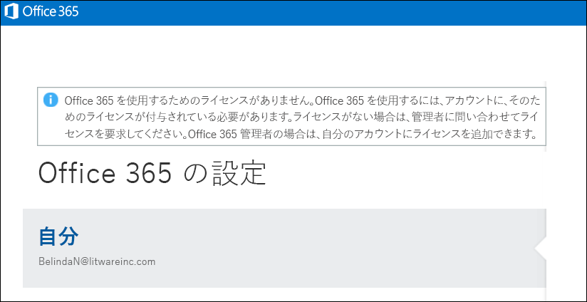

# <a name="view-licensed-and-unlicensed-users-with-office-365-powershell"></a>ライセンスのあるユーザーとライセンスのないユーザーを Office 365 PowerShell で表示する

**概要:** Office 365 PowerShell を使って、ライセンスのあるユーザー アカウントとライセンスのないユーザー アカウントを表示する方法について説明します。
  
Office 365 組織のユーザー アカウントには、組織で使用可能なライセンス プランからユーザー アカウントに割り当てることのできるライセンスが一部またはすべて存在する場合や、まったく存在しない場合があります。Office 365 PowerShell を使うと、組織内でライセンスのあるユーザーとライセンスのないユーザーをすばやく検索できます。
  
## <a name="before-you-begin"></a>はじめに

- このトピックの手順では、Office 365 PowerShell に接続する必要があります。手順については、「[Office 365 PowerShell への接続](connect-to-office-365-powershell.md)」を参照してください。
    
- _-All_ パラメーターなしで **Get-MsolUser** コマンドレットを使用する場合、最初の 500 個のアカウントだけが返されます。
    
## <a name="the-short-version-instructions-without-explanations"></a>簡略版 (説明なしの手順)

このセクションでは、余分な説明を省いて簡潔に手順を示します。ご質問がある場合、または詳細情報が必要な場合には、このトピックの残りの部分をご覧ください。
  
組織内のすべてのユーザー アカウントとライセンスの状態を一覧表示するには、Office 365 PowerShell で次のコマンドを実行します。
  
```
Get-MsolUser -All
```

組織内でライセンスのないすべてのユーザー アカウントの一覧を表示するには、次のコマンドを実行します。
  
```
Get-MsolUser -All -UnlicensedUsersOnly
```

組織内でライセンスのあるすべてのユーザー アカウントの一覧を表示するには、次のコマンドを実行します。
  
```
Get-MsolUser -All | where {$_.isLicensed -eq $true}
```

## <a name="the-long-version-instructions-with-detailed-explanations"></a>詳細版 (詳細な説明付きの手順)

Office 365 ユーザー アカウントと Office 365 のライセンスは、1 対 1 対応する必要がある: Office 365 のユーザーが Office 365 のライセンスではありませんすることは、まだ割り当てられていないユーザーに Office 365 のライセンスを所有することができます。(実際には、単一のユーザー アカウントを持つことも*複数*Office 365 のライセンスです。)作成するとき、新しい Office 365 ユーザー アカウント ( [Office 365 の PowerShell でのユーザー アカウントにライセンスを割り当てる](assign-licenses-to-user-accounts-with-office-365-powershell.md)詳細については記事を参照してください) をそのユーザーにライセンスを割り当てる必要はありません: 新しいユーザーには、有効なアカウントが彼または彼女が sig をことはできませんOffice 365 の n です。サインインしようとする場合、次のようなものが表示されます。
  

  
同様に、有給休暇や育児休暇などで長期休暇を取るユーザーがいるとします。そのような場合は、ユーザーのライセンスを削除しますが、ユーザー アカウントはそのままにしておくことができます (つまり、住所や電話番号などのプロパティ値をすべてそのままにしておくことができます)。こうすると、そのライセンスを他のユーザー (休暇を取った人の代わりに働く臨時社員など) に割り当てることができます。ユーザーが仕事に復帰した時点で新しいライセンスを発行すれば、休暇を取る前と同じように仕事に復帰できます。
  
つまり、アカウントを所有していてもライセンスを所有していないユーザーは可能だということです。また、その逆も可能です。
  
「[Office 365 PowerShell でライセンスとサービスを確認する](view-licenses-and-services-with-office-365-powershell.md)」では、組織が購入した Office 365 のライセンスの数と、これらのライセンスのうち、ユーザーに割り当て済みのライセンスの数を確認する方法を説明しています。これは重要な情報です。ただし、これと同様に重要なことは、どのユーザーにこれらのライセンスが割り当てられ、どのユーザーに割り当てられていないかを確認することです。この記事では、これを行う方法について説明します。
  
ご存じのとおり、 **Get-MsolUser** コマンドレットは、Office 365 のすべてのユーザー アカウントに関する情報を返します。すべての Office 365 ユーザーに関する情報が今すぐ必要な場合は、Office 365 PowerShell で次のコマンドを実行します。
  
```
Get-MsolUser
```

Get-MsolUser の返すデータは次のようなものです。
  
```
UserPrincipalName           DisplayName                     isLicensed
-----------------           -----------                     ----------
ZrinkaM@litwareinc.com      Zrinka Makovac                  True
BelindaN@litwareinc.com     Belinda Newman                  False
BonnieK@litwareinc.com      Bonnie Kearney                  True
FabriceC@litwareinc.com     Fabrice Canel                   True
AnneW@litwareinc.com        Anne Wallace                    True
AlexD@litwareinc.com        Alex Darrow                     True
```

お気付きのように、返されるプロパティ値の 1 つに、 **isLicensed** プロパティがあります。 **isLicensed** が `False` に等しい場合、そのユーザーに Office 365 のライセンスがないことを意味しています。つまり、ユーザーのリストをスクロールして、 **isLicensed** プロパティが `False` に設定されているユーザーがあるかどうかを確認できるということです。
  
いずれにしても、ユーザーの一覧をスクロールしてライセンスのないユーザーを確認するのは、ユーザー数が比較的少なければ有効です。ユーザー数が多い場合、一覧をスクロールするのは非常に面倒です。(また、Windows PowerShell の構成によっては、無理な場合もあります。なぜなら、Windows PowerShell コンソールに一度に表示できる出力行数には制限があるからです。)
  
そのことを念頭に置くと、ライセンスのないユーザーの一覧を表示する最善の方法は、次のコマンドを実行することです。
  
```
Get-MsolUser -UnlicensedUsersOnly
```

このコマンドは、Office 365 のライセンスのないユーザーのみを返します。次のようになります。
  
```
UserPrincipalName           DisplayName                     isLicensed
-----------------           -----------                     ----------
BelindaN@litwareinc.com     Belinda Newman                  False
```

ご覧のように、ライセンスのないユーザーが 1 人表示されます。では、ライセンスを付与されたユーザーのみの一覧が必要な場合はどうしますか?それを表示する方法は、ほんの少しだけ複雑になります。
  
```
Get-MsolUser | Where-Object {$_.isLicensed -eq $true}
```

このコマンドは、 **isLicensed** プロパティが `True` であるすべてのユーザー アカウントを探し、次のような情報を返します。
  
```
UserPrincipalName           DisplayName                     isLicensed
-----------------           -----------                     ----------
ZrinkaM@litwareinc.com      Zrinka Makovac                  True
BonnieK@litwareinc.com      Bonnie Kearney                  True
FabriceC@litwareinc.com     Fabrice Canel                   True
AnneW@litwareinc.com        Anne Wallace                    True
AlexD@litwareinc.com        Alex Darrow                     True
```

ご覧のとおり、Belinda Newman の情報は返されません。なぜかというと、Belinda のアカウントの **isLicensed** プロパティは、 `True` に設定されていないからです。
  
## <a name="see-also"></a>関連項目

これらの手順で使用するコマンドレットの詳細については、次のトピックをご覧ください。
  
- [Get-MsolUser](https://go.microsoft.com/fwlink/p/?LinkId=691547)
    
- [Where-Object](https://go.microsoft.com/fwlink/p/?LinkId=113423)
    

