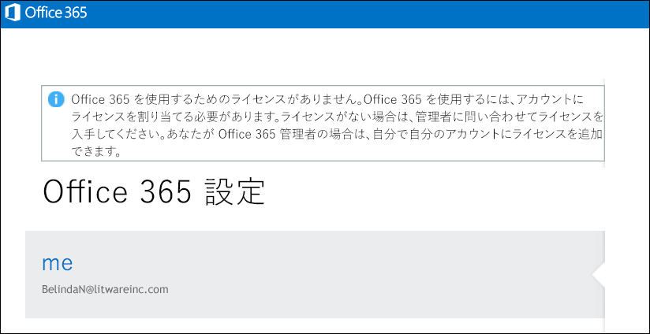

# <a name="view-licensed-and-unlicensed-users-with-office-365-powershell"></a><span data-ttu-id="4b5ea-103">ライセンスのあるユーザーとライセンスのないユーザーを Office 365 PowerShell で表示する</span><span class="sxs-lookup"><span data-stu-id="4b5ea-103">View licensed and unlicensed users with Office 365 PowerShell</span></span>

<span data-ttu-id="4b5ea-104">**の概要:**ライセンスおよびライセンスのないユーザー アカウントを表示するのには Office 365 の PowerShell を使用する方法について説明します。</span><span class="sxs-lookup"><span data-stu-id="4b5ea-104">**Summary:** Explains how to use Office 365 PowerShell to view licensed and unlicensed user accounts.</span></span>
  
<span data-ttu-id="4b5ea-p101">Office 365 組織のユーザー アカウントには、組織で使用可能なライセンス プランからユーザー アカウントに割り当てることのできるライセンスが一部またはすべて存在する場合や、まったく存在しない場合があります。Office 365 PowerShell を使うと、組織内でライセンスのあるユーザーとライセンスのないユーザーをすばやく検索できます。</span><span class="sxs-lookup"><span data-stu-id="4b5ea-p101">User accounts in your Office 365 organization may have some, all, or none of the available licenses assigned to them from the licensing plans that are available in your organization. You can use Office 365 PowerShell to quickly find the licensed and unlicensed users in your organization.</span></span>
  
## <a name="before-you-begin"></a><span data-ttu-id="4b5ea-107">開始する前に</span><span class="sxs-lookup"><span data-stu-id="4b5ea-107">Before you begin</span></span>

- <span data-ttu-id="4b5ea-p102">このトピックの手順では、Office 365 PowerShell に接続する必要があります。手順については、「[Office 365 PowerShell への接続](connect-to-office-365-powershell.md)」を参照してください。</span><span class="sxs-lookup"><span data-stu-id="4b5ea-p102">The procedures in this topic require you to connect to Office 365 PowerShell. For instructions, see [Connect to Office 365 PowerShell](connect-to-office-365-powershell.md).</span></span>
    
- <span data-ttu-id="4b5ea-110">使用せず、 **Get MsolUser**コマンドレットを使用するかどうかは、_のすべて_パラメーターでは、最初の 500 個のアカウントのみが返されます。</span><span class="sxs-lookup"><span data-stu-id="4b5ea-110">If you use the **Get-MsolUser** cmdlet without using the _-All_ parameter, only the first 500 accounts are returned.</span></span>
    
## <a name="the-short-version-instructions-without-explanations"></a><span data-ttu-id="4b5ea-111">簡略版 (説明なしの手順)</span><span class="sxs-lookup"><span data-stu-id="4b5ea-111">The short version (instructions without explanations)</span></span>

<span data-ttu-id="4b5ea-p103">このセクションでは、余分な説明を省いて簡潔に手順を示します。ご質問がある場合、または詳細情報が必要な場合には、このトピックの残りの部分をご覧ください。</span><span class="sxs-lookup"><span data-stu-id="4b5ea-p103">This section presents the procedures without fanfare or superfluous explanation. If you have questions or want more information, you can read rest of the topic.</span></span>
  
<span data-ttu-id="4b5ea-114">組織内のすべてのユーザー アカウントとライセンスの状態を一覧表示するには、Office 365 PowerShell で次のコマンドを実行します。</span><span class="sxs-lookup"><span data-stu-id="4b5ea-114">To view the list of all user accounts and their licensing status in your organization, run the following command in Office 365 PowerShell:</span></span>
  
```
Get-MsolUser -All
```

<span data-ttu-id="4b5ea-115">組織内でライセンスのないすべてのユーザー アカウントの一覧を表示するには、次のコマンドを実行します。</span><span class="sxs-lookup"><span data-stu-id="4b5ea-115">To view the list of all unlicensed user accounts in your organization, run the following command:</span></span>
  
```
Get-MsolUser -All -UnlicensedUsersOnly
```

<span data-ttu-id="4b5ea-116">組織内でライセンスのあるすべてのユーザー アカウントの一覧を表示するには、次のコマンドを実行します。</span><span class="sxs-lookup"><span data-stu-id="4b5ea-116">To view the list of all licensed user accounts in your organization, run the following command:</span></span>
  
```
Get-MsolUser -All | where {$_.isLicensed -eq $true}
```

## <a name="the-long-version-instructions-with-detailed-explanations"></a><span data-ttu-id="4b5ea-117">詳細版 (詳細な説明付きの手順)</span><span class="sxs-lookup"><span data-stu-id="4b5ea-117">The long version (instructions with detailed explanations)</span></span>

<span data-ttu-id="4b5ea-p104">Office 365 ユーザー アカウントと Office 365 のライセンスは、1 対 1 対応する必要がある: Office 365 のユーザーが Office 365 のライセンスではありませんすることは、まだ割り当てられていないユーザーに Office 365 のライセンスを所有することができます。(実際には、単一のユーザー アカウントを持つことも*複数*Office 365 のライセンスです。)作成するとき、新しい Office 365 ユーザー アカウント ( [Windows PowerShell でのライセンスの Office 365 ユーザー](http://technet.microsoft.com/library/0ab9fcac-e5ea-4b5b-b72c-8c92c55565ac.aspx)の詳細についての資料を参照してください)、そのユーザーにライセンスを割り当てる必要はありません: 新しいユーザーは、有効なアカウントが彼または彼女が Offi にサインインすることはできませんce 365 です。サインインしようとする場合、次のようなものが表示されます。</span><span class="sxs-lookup"><span data-stu-id="4b5ea-p104">Office 365 user accounts and Office 365 licenses don't need to have a one-to-one correspondence: it's possible to have Office 365 users who do not have an Office 365 license, and it's possible to have Office 365 licenses that haven't been assigned to a user. (In fact, a single user account can even have  *multiple*  Office 365 licenses.) When you create a new Office 365 user account (see the article [License Office 365 users with Windows PowerShell](http://technet.microsoft.com/library/0ab9fcac-e5ea-4b5b-b72c-8c92c55565ac.aspx) for more information) you don't have to assign that user a license: the new user will have a valid account, but he or she won't be able to sign in to Office 365. If they try to sign in, they'll see something similar to this:</span></span>
  

  
<span data-ttu-id="4b5ea-p105">同様に、有給休暇や育児休暇などで長期休暇を取るユーザーがいるとします。そのような場合は、ユーザーのライセンスを削除しますが、ユーザー アカウントはそのままにしておくことができます (つまり、住所や電話番号などのプロパティ値をすべてそのままにしておくことができます)。こうすると、そのライセンスを他のユーザー (休暇を取った人の代わりに働く臨時社員など) に割り当てることができます。ユーザーが仕事に復帰した時点で新しいライセンスを発行すれば、休暇を取る前と同じように仕事に復帰できます。</span><span class="sxs-lookup"><span data-stu-id="4b5ea-p105">Likewise, you might have a user who will be taking some extended time off, perhaps for a sabbatical or for maternity/paternity leave. In a case like that, you could remove the user's license but leave the user account intact (that is, leave all its property values, such as address and phone number, as-is). By doing that, you can assign their license to someone else (like, say, a temporary worker filling in for the person on leave). When the user returns to work you can issue them a new license and they'll be able to resume working as if they'd never been gone.</span></span>
  
<span data-ttu-id="4b5ea-p106">つまり、アカウントを所有していてもライセンスを所有していないユーザーは可能だということです。また、その逆も可能です。</span><span class="sxs-lookup"><span data-stu-id="4b5ea-p106">Which simply means that, yes, you can have users who have accounts but who don't have licenses. Or vice-versa.</span></span>
  
<span data-ttu-id="4b5ea-p107">「[Office 365 PowerShell でライセンスとサービスを確認する](view-licenses-and-services-with-office-365-powershell.md)」では、組織が購入した Office 365 のライセンスの数と、これらのライセンスのうち、ユーザーに割り当て済みのライセンスの数を確認する方法を説明しています。これは重要な情報です。ただし、これと同様に重要なことは、どのユーザーにこれらのライセンスが割り当てられ、どのユーザーに割り当てられていないかを確認することです。この記事では、これを行う方法について説明します。</span><span class="sxs-lookup"><span data-stu-id="4b5ea-p107">The article [View licenses and services with Office 365 PowerShell](view-licenses-and-services-with-office-365-powershell.md) explains how you can determine the number of Office 365 licenses your organization has purchased as well as how many of those licenses have been assigned to users. That's important information. Equally important, however is knowing which of your users have been assigned these licenses and which ones haven't. And this article will tell you how to do just that.</span></span>
  
<span data-ttu-id="4b5ea-p108">ご存じのとおり、 **Get-MsolUser** コマンドレットは、Office 365 のすべてのユーザー アカウントに関する情報を返します。すべての Office 365 ユーザーに関する情報が今すぐ必要な場合は、Office 365 PowerShell で次のコマンドを実行します。</span><span class="sxs-lookup"><span data-stu-id="4b5ea-p108">As you probably know, the **Get-MsolUser** cmdlet returns information about all your Office 365 user accounts. Need some quick info about all your Office 365 users? Then run this command in Office 365 PowerShell:</span></span>
  
```
Get-MsolUser
```

<span data-ttu-id="4b5ea-135">Get-MsolUser の返すデータは次のようなものです。</span><span class="sxs-lookup"><span data-stu-id="4b5ea-135">In turn, Get-MsolUser returns data similar to this:</span></span>
  
```
UserPrincipalName           DisplayName                     isLicensed
-----------------           -----------                     ----------
ZrinkaM@litwareinc.com      Zrinka Makovac                  True
BelindaN@litwareinc.com     Belinda Newman                  False
BonnieK@litwareinc.com      Bonnie Kearney                  True
FabriceC@litwareinc.com     Fabrice Canel                   True
AnneW@litwareinc.com        Anne Wallace                    True
AlexD@litwareinc.com        Alex Darrow                     True
```

<span data-ttu-id="4b5ea-p109">お気付きのように、返されるプロパティ値の 1 つに、 **isLicensed** プロパティがあります。 **isLicensed** が `False` に等しい場合、そのユーザーに Office 365 のライセンスがないことを意味しています。つまり、ユーザーのリストをスクロールして、 **isLicensed** プロパティが `False` に設定されているユーザーがあるかどうかを確認できるということです。</span><span class="sxs-lookup"><span data-stu-id="4b5ea-p109">As you can see, one of the property values returned is for the **isLicensed** property. If **isLicensed** is equal to `False` that means that the user doesn't have a license for Office 365. In other words, and if you wanted to, you could simply scroll through your list of users and pick out the ones where the **isLicensed** property is set to `False`.</span></span>
  
<span data-ttu-id="4b5ea-p110">いずれにしても、ユーザーの一覧をスクロールしてライセンスのないユーザーを確認するのは、ユーザー数が比較的少なければ有効です。ユーザー数が多い場合、一覧をスクロールするのは非常に面倒です。(また、Windows PowerShell の構成によっては、無理な場合もあります。なぜなら、Windows PowerShell コンソールに一度に表示できる出力行数には制限があるからです。)</span><span class="sxs-lookup"><span data-stu-id="4b5ea-p110">At any rate, scrolling through a list of users trying to pick out the unlicensed users works as long as you have a relatively small number of users. If you have a large number of users, however, scrolling through that list will be, at best, extremely tedious. (And, depending on how Windows PowerShell has been configured, perhaps downright impossible. That's because there's a limit to the number of lines of output that can be displayed in the Windows PowerShell console at any one time.)</span></span>
  
<span data-ttu-id="4b5ea-143">そのことを念頭に置くと、ライセンスのないユーザーの一覧を表示する最善の方法は、次のコマンドを実行することです。</span><span class="sxs-lookup"><span data-stu-id="4b5ea-143">With that in mind, a much better way to list your unlicensed users is to run this command instead:</span></span>
  
```
Get-MsolUser -UnlicensedUsersOnly
```

<span data-ttu-id="4b5ea-p111">このコマンドは、Office 365 のライセンスのないユーザーのみを返します。次のようになります。</span><span class="sxs-lookup"><span data-stu-id="4b5ea-p111">That command returns only those users who don't have a license for Office 365. In other words:</span></span>
  
```
UserPrincipalName           DisplayName                     isLicensed
-----------------           -----------                     ----------
BelindaN@litwareinc.com     Belinda Newman                  False
```

<span data-ttu-id="4b5ea-p112">ご覧のように、ライセンスのないユーザーが 1 人表示されます。では、ライセンスを付与されたユーザーのみの一覧が必要な場合はどうしますか?それを表示する方法は、ほんの少しだけ複雑になります。</span><span class="sxs-lookup"><span data-stu-id="4b5ea-p112">As you can see we have one unlicensed user. And what is we only wanted a list of the  *licensed*  users? That's a tiny bit more complicated, but only the tiniest bit:</span></span>
  
```
Get-MsolUser | Where-Object {$_.isLicensed -eq $true}
```

<span data-ttu-id="4b5ea-149">このコマンドは、 **isLicensed** プロパティが `True` であるすべてのユーザー アカウントを探し、次のような情報を返します。</span><span class="sxs-lookup"><span data-stu-id="4b5ea-149">That command, which looks for all the user accounts where the **isLicensed** property is equal to `True`, returns information similar to this:</span></span>
  
```
UserPrincipalName           DisplayName                     isLicensed
-----------------           -----------                     ----------
ZrinkaM@litwareinc.com      Zrinka Makovac                  True
BonnieK@litwareinc.com      Bonnie Kearney                  True
FabriceC@litwareinc.com     Fabrice Canel                   True
AnneW@litwareinc.com        Anne Wallace                    True
AlexD@litwareinc.com        Alex Darrow                     True
```

<span data-ttu-id="4b5ea-p113">ご覧のとおり、Belinda Newman の情報は返されません。なぜかというと、Belinda のアカウントの **isLicensed** プロパティは、 `True` に設定されていないからです。</span><span class="sxs-lookup"><span data-stu-id="4b5ea-p113">As you can see, information is not returned for Belinda Newman. Why not? You got it: because the **isLicensed** property for Belinda's account is not set to `True`.</span></span>
  
## <a name="see-also"></a><span data-ttu-id="4b5ea-153">関連項目</span><span class="sxs-lookup"><span data-stu-id="4b5ea-153">See also</span></span>
<span data-ttu-id="4b5ea-154"><a name="SeeAlso"> </a></span><span class="sxs-lookup"><span data-stu-id="4b5ea-154"><a name="SeeAlso"> </a></span></span>

<span data-ttu-id="4b5ea-155">これらの手順で使用するコマンドレットの詳細については、次のトピックをご覧ください。</span><span class="sxs-lookup"><span data-stu-id="4b5ea-155">For more information about the cmdlets that are used in these procedures, see the following topics:</span></span>
  
- [<span data-ttu-id="4b5ea-156">Get-MsolUser</span><span class="sxs-lookup"><span data-stu-id="4b5ea-156">Get-MsolUser</span></span>](https://go.microsoft.com/fwlink/p/?LinkId=691547)
    
- [<span data-ttu-id="4b5ea-157">Where-Object</span><span class="sxs-lookup"><span data-stu-id="4b5ea-157">Where-Object</span></span>](https://go.microsoft.com/fwlink/p/?LinkId=113423)
    

