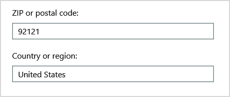
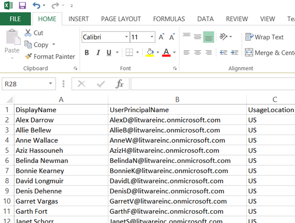

# <a name="why-you-need-to-use-office-365-powershell"></a>Office 365 PowerShell を使用する必要がある理由

Microsoft 365 管理センターを使用すると、Office 365 のユーザーアカウントとライセンスを管理できるだけでなく、Office 365 サーバー製品: Exchange、Skype for Business Online、および SharePoint Online を管理することもできます。 しかし、これらの管理は Office 365 PowerShell コマンドでも行うことができ、そうするなら、コマンド ラインやスクリプト言語環境を活用して処理の高速化や自動化を実現させ、機能性が向上する場合もあります。
  
この記事では、Office 365 の管理に Office 365 PowerShell が役立つ、以下の点を示します。
  
- Office 365 PowerShell では、Microsoft 365 管理センターでは表示できない追加情報を確認できます。
    
- Office 365 には Office 365 PowerShell を使用することによってのみ構成可能な機能がある
    
- Office 365 PowerShell は一括操作の実行に優れています。
    
- Office 365 PowerShell はデータのフィルター処理に優れています。
    
- Office 365 PowerShell を使用すると、データの印刷や保存が簡単にできます。
    
- Office 365 PowerShell を使用すると複数のサーバー製品を管理できる
    
最初に、Office 365 PowerShell が、Windows ベースのサービスとプラットフォームのコマンド ライン環境である Windows PowerShell のモジュールのセットであることを理解してください。この環境によって作成されるコマンド シェル言語は、追加モジュールによって拡張することができ、それによって単純または複雑なコマンドやスクリプトが実行できるようになります。たとえば、Office 365 PowerShell モジュールをインストールして Office 365 サブスクリプションに接続した後、次のコマンドを実行して Microsoft Exchange Online のすべてのユーザー メールボックスの一覧を表示できます。
  
```powershell
Get-Mailbox
```

メールボックスのリストを取得することも、Microsoft 365 管理センターを使用して簡単に行うことができますが、すべての web アプリのすべてのサイトについて、すべてのリストのアイテム数をカウントすることは簡単に行えません。
  
Office 365 PowerShell は、Microsoft 365 管理センターを置き換えるのではなく、Office 365 を管理する機能を強化し、強化するように設計されています。 Office 365 の管理者は、office 365 PowerShell コマンドでしか実行できない構成手順があるため、Office 365 PowerShell の使用に関しては、少なくとも使い慣れてはなりません。 このような場合は、次の方法を理解する必要があります。
  
- Office 365 PowerShell モジュールをインストールする (管理者のコンピューターごとに 1 回のみ行います)。
    
- Office 365 サブスクリプションに接続する (PowerShell セッションごとに 1 回行います)。
    
- 必要な Office 365 PowerShell コマンドを実行するのに必要な情報を収集する。
    
- Office 365 PowerShell コマンドを正常に実行する。
    
これらの基本的なスキルを習得すれば、 **Get-mailbox** コマンドを使用してメールボックス ユーザーの一覧を作成する必要もなければ、すべての Web アプリ用のすべてのサイトのすべての一覧に含まれるすべてのアイテムをカウントするための前述のコマンドのような新しいコマンドを作成する方法を理解する必要もありません。Microsoft や Office 365 管理者のコミュニティが、こうした事柄を必要に応じて実行する際に役立ちます。
  
## <a name="office-365-powershell-can-reveal-additional-information-that-you-cannot-see-with-the-microsoft-365-admin-center"></a>Office 365 PowerShell では、Microsoft 365 管理センターでは表示できない追加情報を確認できます。

Microsoft 365 管理センターでは、多くの有益な情報が表示されますが、これは、ユーザー、ライセンス、メールボックス、サイトに Office 365 が保存する可能性がある情報をすべて表示するという意味ではありません。 Microsoft 365 管理センターの**ユーザーとグループ**の例を次に示します。
  

  
ここには、さまざまな理由で把握すべき情報が表示されます。 しかし、もっと多くの情報が必要な場合もあります。 たとえば、Office 365 ライセンス (およびユーザーが使用できる Office 365 機能) は、そのユーザーの地理的な場所によって異なります。 米国内に在住しているユーザーに対して拡張可能なポリシーと機能は、インドやベルギー在住のユーザーに対して拡張可能なポリシーと機能と同じではない場合があります。 Microsoft 365 管理センターを使用して、ユーザーの地理的な場所を確認するには、次の手順を実行します。
  
1. ユーザーの **表示名** をダブルクリックします。
    
2. ユーザーのプロパティを表示するウィンドウで、 **[詳細]** をクリックします。
    
3. 詳細表示で、 **[追加情報]** をクリックします。
    
4. **[国/地域]** という見出しが表示されるまでスクロールダウンします。
    
     
  
5. ユーザーの表示名と場所を紙に書き留めるか、コピーしてメモ帳に貼り付けます。 
    
この手順をユーザーごとに繰り返す必要があります。これは多くのユーザーにとって、面倒な作業でしょう。Office 365 PowerShell で、次のコマンドを使用して、すべてのユーザーについてのこの情報を表示できます。
  
```powershell
Get-MsolUser | Select DisplayName, UsageLocation
```


>[!Note]
>PowerShell Core は、Windows PowerShell 用 Microsoft Azure Active Directory モジュールと、名前に **Msol** が含まれるコマンドレットをサポートしていません。 これらのコマンドレットを引き続き使用するには、Windows PowerShell から実行する必要があります。
>

表示例:
  
```powershell
DisplayName                               UsageLocation
-----------                               -------------
Bonnie Kearney                            GB
Fabrice Canel                             BR
Brian Johnson (TAILSPIN)                  US
Anne Wallace                              US
Alex Darrow                               US
David Longmuir                            BR
```

> [!TIP]
>  この Office 365 PowerShell コマンドの説明: 現在の Office 365 サブスクリプション内のすべてのユーザーを取得し (**Get-MsolUser**)、各ユーザーの名前と場所だけを表示します (**Select DisplayName, UsageLocation**)。
  
Office 365 PowerShell はコマンド シェル言語をサポートしているので、 **Get-MSolUser** コマンドで取得した情報をさらに処理できます。たとえば、場所を基準にユーザーを並べ替えて、ブラジルのユーザー、米国のユーザーなどをそれぞれグループ化できます。コマンドを次に示します。
  
```powershell
Get-MsolUser | Select DisplayName, UsageLocation | Sort UsageLocation, DisplayName
```

表示例:
  
```powershell
DisplayName                                 UsageLocation
-----------                                 -------------
David Longmuir                              BR
Fabrice Canel                               BR
Bonnie Kearney                              GB
Alex Darrow                                 US
Anne Wallace                                US
Brian Johnson (TAILSPIN)                    US
```

> [!TIP]
>  この Office 365 PowerShell コマンドの説明:  現在の Office 365 サブスクリプション内のユーザーすべてを取得し、各ユーザーの名前と場所のみを表示します。それらのユーザーを、場所を第一基準、名前を第二基準にして並べ替えます (**Sort UsageLocation, DisplayName**)。
  
また、フィルター処理を追加することもできます。たとえば、ブラジル在住のユーザーに関する情報のみを表示する場合には、次のコマンドを使用します。
  
```powershell
Get-MsolUser | Where {$_.UsageLocation -eq "BR"} | Select DisplayName, UsageLocation 
```

表示例:
  
```powershell
DisplayName                                           UsageLocation
-----------                                           -------------
David Longmuir                                        BR
Fabrice Canel                                         BR
```

> [!TIP]
>  この Office 365 PowerShell コマンドの説明:  現在の Office 365 サブスクリプション内のユーザーのうち、ブラジルに在住しているすべてのユーザーを取得します (**Where {$\_.UsageLocation -eq "BR"}**)。次に、各ユーザーの名前と場所を表示します。
  
 **規模の大きいドメインに関する注意事項**
  
ドメインの規模が非常に大きい場合 (たとえば、何万人ものユーザーが属している場合)、この記事に記載する一部の例で、「スロットリング」が発生する場合があります。これはつまり、計算能力や使用可能なネットワーク帯域幅などを上回る操作を、一度に実行しようとしていることを意味します。このため、大規模な組織の場合は、これらの Office 365 PowerShell コマンドを 2 つのコマンドに分けることができます。たとえば、次の 1 つのコマンドはすべてのユーザー アカウントを返し、それぞれの名前と場所を示します。
  
```powershell
Get-MsolUser | Select DisplayName, UsageLocation
```

このコマンドは、規模が小さいドメインには最適に機能します。しかし大規模な組織では、これを 2 つのコマンドに分けて、一方のコマンドでユーザー アカウント情報を変数に格納し、もう一方のコマンドで必要な情報を表示することが必要になる可能性があります。次に例を示します。
  
```powershell
$x = Get-MsolUser
$x | Select DisplayName, UsageLocation
```


この Office 365 PowerShell コマンド セットの説明:
- 現在の Office 365 サブスクリプション内のすべてのユーザーを取得し、その情報を $x という名前の変数に格納します (**$x = Get-MsolUser**)。
- 変数 $x の内容のうち、各ユーザーの名前と場所のみを表示します (**$x | Select DisplayName, UsageLocation**)。
  
## <a name="office-365-has-features-that-you-can-only-configure-with-office-365-powershell"></a>Office 365 には Office 365 PowerShell でのみ構成可能な機能がある

Microsoft 365 管理センターは、ほとんどのユーザーに適用される最も一般的な管理タスクまたは意味のある管理タスクへのアクセスを提供することを目的としています。 つまり、Microsoft 365 管理センターは、一般的な管理者がツールを使用して最も一般的な管理タスクを実行できるように設計されています。 この定義により、Microsoft 365 管理センターを使用して完了できないタスクがいくつかあることを意味します。
  
たとえば、Skype for Business Online 管理センターにはカスタムの会議出席依頼を作成するためのいくつかのオプションが備わっています。
  

  
これらの設定を使用すると、会議出席依頼にパーソナルでプロフェッショナルな風合いを加えることができます。しかし、会議の構成設定には、カスタムの会議出席依頼を作成する以上の事柄が関係します。たとえば、既定では会議に関して以下の事柄が許可されています。
  
- 匿名ユーザーが、各会議に自動的に参加すること。
    
- 参加者が、会議を記録すること。
    
- 組織のすべてのユーザーが、会議に参加するときに発表者として指定されること。
    
これらの設定に関しては、Skype for Business Online 管理センターからは行うことができません。ただし、Office 365 PowerShell からは制御が可能です。これらの 3 つの設定を無効にするコマンドを次に示します。
  
```powershell
Set-CsMeetingConfiguration -AdmitAnonymousUsersByDefault $False -AllowConferenceRecording $False -DesignateAsPresenter "None"
```

> [!NOTE]
> このコマンドを実行するには、[Skype for Business Online PowerShell モジュール](https://www.microsoft.com/download/details.aspx?id=39366)をインストールする必要があります。 
  
> [!TIP]
>  この Office 365 PowerShell コマンドの説明: 新たな Skype for Business Online 会議の設定 (**Set-CsMeetingConfiguration**) に関して、匿名ユーザーが会議に自動的に参加する許可を無効にし (**-AdmitAnonymousUsersByDefault $False**)、出席者が会議を記録する機能を無効にし (**-AllowConferenceRecording $False**)、組織内のどのユーザーも発表者として指定しません (**-DesignateAsPresenter "None"**)。
  
方針を変えて既定の設定に戻す (これらすべてを有効にする) 場合には、次のコマンドを実行します。
  
```powershell
Set-CsMeetingConfiguration -AdmitAnonymousUsersByDefault $True -AllowConferenceRecording $True -DesignateAsPresenter "Company"
```

これは一例に過ぎません。Office 365 管理者が Office 365 PowerShell コマンドの実行方法をよく理解しているべき理由は他にもあります。
  
## <a name="office-365-powershell-is-great-at-carrying-out-bulk-operations"></a>Office 365 PowerShell は一括操作の実行の点で優れている

従来は、単一の操作を実行すると、Microsoft 365 管理センターのようなビジュアルインターフェイスが最も重要になります。 たとえば、1つのユーザーアカウントを無効にする必要がある場合は、Microsoft 365 管理センターを使用して、チェックボックスをすばやく見つけてクリアすることができます。 こちらのほうが、Office 365 PowerShell で同様の操作を行うよりも簡単な場合があります。
  
しかし、その他の多くの場合に、多数の項目や選択したものを変更する必要がある場合は、Microsoft 365 管理センターがお客様の時間を最適に使用しないことがあります。 たとえば、数千人の電話番号のプレフィックスを変更する必要がある場合や、特定のユーザー (Ken Myer) をすべての SharePoint Online サイトから削除する必要がある場合は、Microsoft 365 管理センターでどうすればよいでしょうか。
  
後者の例の場合、何百もの SharePoint Online サイトがあり、Ken Meyer がメンバーのサイトも判断できません。 そのため、Microsoft 365 管理センターから開始して、各サイトでこの手順を実行する必要があります。
  
1. サイトの **URL** をクリックします。
    
2. [ **サイト コレクションのプロパティ** ] ボックスで、[ **Web サイトのアドレス** ] リンクをクリックしてサイトを開きます。
    
3. サイトの [ **共有** ] をクリックします。
    
4. [ **共有** ] ダイアログ ボックスで、サイトへのアクセス権限を持つすべてのユーザーを表示するリンクをクリックします。
    
     
  
5. [ **共有相手** ] ダイアログ ボックスで、[ **詳細設定** ] をクリックします。
    
6. ユーザーの一覧をスクロール ダウンし、Ken Myer (サイトへのアクセス権限を持っていることが前提) を見つけて選択してから、[ **ユーザー権限の削除** ] をクリックします。
    
何百ものサイトがある場合、長時間かかる可能性があります。
  
これに代わる方法として、Office 365 PowerShell で次のコマンドを使って、すべてのサイトから Ken Myer を削除できます。
  
```powershell
Get-SPOSite | ForEach {Remove-SPOUser -Site $_.Url -LoginName "kenmyer@litwareinc.com"}
```

> [!NOTE]
> このコマンドを実行するには、[SharePoint Online PowerShell に接続する](https://docs.microsoft.com/powershell/sharepoint/sharepoint-online/connect-sharepoint-online?view=sharepoint-ps)ための管理シェルをインストールする必要があります。 
  
> [!TIP]
>  この Office 365 PowerShell コマンドの説明: 現在の Office 365 サブスクリプションのすべての SharePoint サイトを取得し (**Get-SPOSite**)、各サイトにアクセス可能なユーザーの一覧から Ken Meyer を削除します (**ForEach {Remove-SPOUser -Site $\_.Url -LoginName "kenmyer@litwareinc.com"}**)。
  
ユーザーがアクセス権を持っていないものも含めて、すべてのサイトから Ken Meyer を削除するよう Office 365 に指示しているため、このコマンドの表示では、現在アクセスできないサイトに関するエラーが表示されます。 このコマンドで追加の条件を使用して、彼がログインリストにあるサイトからのみキー Meyer のみを削除することができますが、リストされているエラーによってサイト自体に悪影響が生じることはありません。 このコマンドは、Microsoft 365 管理センターで作業する時間ではなく、数百のサイトに対して実行されるまでに数分かかる場合があります。
  
別の一括操作の例を次に示します。このコマンドを使用して、新しい SharePoint 管理者である Bonnie Kearney を組織内のすべてのサイトに追加します。
  
```powershell
Get-SPOSite | ForEach {Add-SPOUser -Site $_.Url -LoginName "bkearney@litwareinc.com" -Group "Members"}
```

> [!TIP]
>  この Office 365 PowerShell コマンドの説明: 現在の Office 365 サブスクリプションのすべての SharePoint サイトを取得し、各サイトで Bonnie Kearney のログイン名をサイトの Members グループに追加して Bonnie Kearney にアクセスを許可します (**ForEach {Add-SPOUser -Site $\_.Url -LoginName "bkearney@litwareinc.com" -Group "Members"}**)。
  
## <a name="office-365-powershell-is-great-at-filtering-data"></a>Office 365 PowerShell はデータのフィルター処理に優れている

Microsoft 365 管理センターでは、データをフィルター処理して、対象となる情報のサブセットを迅速かつ簡単に見つけられるように、さまざまな方法を使用できます。 たとえば、Exchange では、ユーザー メールボックスのほとんどすべてのプロパティに対するフィルターを簡単に適用できます。 たとえば、以下は、Bloomington 市に在住のすべてのユーザーのメールボックスを一覧表示する例です。
  

  
Exchange 管理センターでは、フィルター条件を組み合わせることもできます。たとえば、ブルーミントン市に住み、経理部で働いているすべての住民のメールボックスを見つけることができます。 
  
しかし、Exchange 管理センターで行えることには限界があります。たとえば、ブルーミントンかサンディエゴに住んでいる住民のメールボックスを検索したい場合や、ブルーミントンに住んでいないすべての住民のメールボックスを検索したい場合もあるでしょう。 
  
Office 365 PowerShell では、ブルーミントン市やサンディエゴ市に住んでいるすべての住民のメールボックスの一覧を取得するために、次のコマンドを使うことができます。
  
```powershell
Get-User | Where {$_.RecipientTypeDetails -eq "UserMailbox" -and ($_.City -eq "San Diego" -or $_.City -eq "Bloomington")} | Select DisplayName, City
```

表示例:
  
```powershell
DisplayName                              City
-----------                              ----
Alex Darrow                              San Diego
Bonnie Kearney                           San Diego
Julian Isla                              Bloomington
Rob Young                                Bloomington
```

> [!TIP]
>  この Office 365 PowerShell コマンドの説明: 現在の Office 365 サブスクリプションのユーザーのうち、サンディエゴ市またはブルーミントン市にメールボックスを持つすべてのユーザーを取得し ( **Where {$\_.RecipientTypeDetails -eq "UserMailbox" -and ($$\_.City -eq "San Diego" -or $\_.City -eq "Bloomington")}** )、各ユーザーの名前と都市を表示します (**Select DisplayName, City**)。
  
ブルーミントン以外に居住しているユーザーのメールボックスをすべて一覧表示するには、次のコマンドを使用します。
  
```powershell
Get-User | Where {$_.RecipientTypeDetails -eq "UserMailbox" -and $_.City -ne "Bloomington"} | Select DisplayName, City
```

表示例:
  
```powershell
DisplayName                               City
-----------                               ----
MOD Administrator                         Redmond
Alex Darrow                               San Diego
Allie Bellew                              Bellevue
Anne Wallace                              Louisville
Aziz Hassouneh                            Cairo
Belinda Newman                            Charlotte
Bonnie Kearney                            San Diego
David Longmuir                            Waukesha
Denis Dehenne                             Birmingham
Garret Vargas                             Seattle
Garth Fort                                Tulsa
Janet Schorr                              Bellevue
```

> [!TIP]
>  この Office 365 PowerShell コマンドの説明: 現在の Office 365 サブスクリプションのユーザーのうち、ブルーミントン市以外の場所にあるメールボックスを持つユーザーすべてを取得し ( **Where {$\_.RecipientTypeDetails -eq "UserMailbox" -and $\_.City -ne "Bloomington"}** )、各ユーザーの名前と都市を表示します。
  
Office 365 PowerShell フィルターでワイルドカード文字を使って、名前の一部が一致している項目を検出することもできます。たとえば、あるユーザー アカウントを探しているものの、名字が Anderson か Henderson であることしか思い出せず、もしかすると Jorgenson だったかもしれないとします。
  
検索ツールを使用して、次の3つの異なる検索を実行することによって、Microsoft 365 管理センターでそのユーザーを追跡することができます。
  
- *Anderson*  用のもの 
    
- *Henderson*  用のもの 
    
- *Jorgenson*  用のもの 
    
これら 3 つの名前の最後はどれも「son」で終わっているので、Office 365 PowerShell に、名前の末尾が「son」のユーザーすべてを表示するよう指示できます。コマンドを次に示します。
  
```powershell
Get-User -Filter '{LastName -like "*son"}'
```

> [!TIP]
>  この Office 365 PowerShell コマンドの説明: 現在の Office 365 サブスクリプションのすべてのユーザーを取得します。ただし、名前の最後が「son」のユーザーのみを一覧表示するフィルターを使用します ( **-Filter '{LastName -like "\*son"}'** )。\* は任意の文字セット (ユーザーのラスト ネームの場合は文字列) を表します。
  
## <a name="office-365-powershell-makes-it-easy-to-print-or-save-data"></a>Office 365 PowerShell を使用するとデータの印刷や保存が簡単にできる

Microsoft 365 管理センターでは、データの一覧を表示できます。 以下に、skype for business online 管理センターの例を示します。このリストには、Skype for business Online が有効になっているユーザーの一覧が表示されます。
  

  
この情報をファイルに保存するには、コピーしてドキュメントまたは Excel に貼り付ける必要があります。 どちらの場合も、コピー操作には追加の書式設定が必要になる場合があります。 また、Microsoft 365 管理センターでは、表示されている一覧を直接印刷する方法は提供されていません。
  
幸い、Office 365 PowerShell を使えば、一覧を表示するだけでなく、ファイルに保存してそれを簡単に Excel にインポートできます。次に示すコマンド例を実行すると、Skype for Business Online ユーザー データがコンマ区切り値 (CSV) ファイルに保存されます。このファイルは、Excel ワークシート内にテーブルとして簡単にインポートできます。
  
```powershell
Get-CsOnlineUser | Select DisplayName, UserPrincipalName, UsageLocation | Export-Csv -Path "C:\Logs\SfBUsers.csv" -NoTypeInformation
```

表示例:
  

  
> [!TIP]
>  この Office 365 PowerShell コマンドの説明: 現在の Office 365 サブスクリプションのすべての Skype for Business Online ユーザーを取得し (**Get-CsOnlineUser**)、ユーザー名、UPN、場所のみを取り出します (**Select DisplayName, UserPrincipalName, UsageLocation**)。次に、その情報を C:\\Logs\\SfBUsers.csv という名前の CSV ファイルに保存します (**Export-Csv -Path "C:\\Logs\\SfBUsers.csv" -NoTypeInformation**)。
  
また、オプションを使って、この一覧を XML ファイルや HTML ページとして保存できます。実際、追加の PowerShell コマンドを使い、必要なカスタム書式設定で直接 Excel ファイルとして保存できます。 
  
さらに、一覧を表示する Office 365 PowerShell コマンドの出力を、Windows の既定のプリンターに直接送信することもできます。コマンド例を次に示します。
  
```powershell
Get-CsOnlineUser | Select DisplayName, UserPrincipalName, UsageLocation | Out-Printer
```

印刷されたドキュメントは次のようになります。
  

  
> [!TIP]
>  この Office 365 PowerShell コマンドの説明: 現在の Office 365 サブスクリプションのすべての Skype for Business Online ユーザーを取得し、ユーザー名、UPN、場所のみを取り出し、その情報を既定の Windows プリンターに送信します (**Out-Printer**)。
  
印刷されるドキュメントの書式は Office 365 PowerShell コマンド ウィンドウでの表示と同じ単純なものですが、必要なデータの一覧を表示する Office 365 PowerShell コマンドを作成すると、そのコマンドの最後に **| Out-Printer** を追加するだけで、ハードコピーを取得することができます。
  
## <a name="office-365-powershell-lets-you-manage-across-server-products"></a>Office 365 PowerShell を使用すると複数のサーバー製品を管理できる

Office 365 を構成する各種のコンポーネントは連動するように設計されています。たとえば、Office 365 に新しいユーザーを追加し、そのときにユーザーの部署や電話番号などの情報を指定したとします。この情報は、Office 365 サーバー製品 (Skype for Business Online、Exchange、SharePoint Online) のいずれかを使用してユーザーの情報にアクセスすれば入手できます。
  
ただし、これは製品のスイートに共通する一般情報の場合です。製品固有の情報 (たとえば、ユーザーの Exchange メールボックスに関する情報など) は基本的にはスイートのすべての製品で入手できるようにはなっていません。たとえば、ユーザーのメールボックスが有効になっているかどうかを把握したい場合などには、Exchange 管理センターにおいてのみこの情報が取得できます。 
  
すべてのユーザーに関する次のような情報を示すレポートを作成するとします。
  
- ユーザーの表示名
    
- ユーザーが Office 365 のライセンスを所有しているかどうか
    
- ユーザーの Exchange メールボックスが有効になっているかどうか
    
- ユーザーが Skype for Business Online に対して有効になっているかどうか
    
現時点では、Microsoft 365 管理センターを使用してこのようなレポートを簡単に作成することはできません。 代わりに、Excel ワークシートなどの情報を格納する別のドキュメントを作成し、Microsoft 365 管理センターからすべてのユーザー名とライセンス情報を取得する必要があります。また、Exchange 管理センターからメールボックス情報を取得して、Skype for Business を取得することもできます。Skype for Business Online 管理センターからのビジネスオンライン情報を入力し、その情報を照合して結合します。
  
これに代わる方法として、Office 365 PowerShell スクリプトを使ってレポートをコンパイルできます。
  
次のスクリプト例は、この記事でこれまでに示したコマンドの中で最も複雑です。しかし、この例は、他の方法では作成の難しい情報のビューも Office 365 PowerShell を使用すれば作成できる場合があることを示しています。必要な一覧をコンパイルして表示するスクリプトを次に示します。
  
```powershell
$x = Get-MsolUser

foreach ($i in $x)
    {
      $y = Get-Mailbox -Identity $i.UserPrincipalName
      $i | Add-Member -MemberType NoteProperty -Name IsMailboxEnabled -Value $y.IsMailboxEnabled

      $y = Get-CsOnlineUser -Identity $i.UserPrincipalName
      $i | Add-Member -MemberType NoteProperty -Name EnabledForSfB -Value $y.Enabled
    }

$x | Select DisplayName, IsLicensed, IsMailboxEnabled, EnabledforSfB
```

表示例:
  
```powershell
DisplayName             IsLicensed   IsMailboxEnabled   EnabledForSfB
-----------             ----------   ----------------   --------------
Bonnie Kearney          True         True               True
Fabrice Canel           True         True               True
Brian Johnson           False        True               False
Anne Wallace            True         True               True
Alex Darrow             True         True               True
David Longmuir          True         True               True
Katy Jordan             False        True               False
Molly Dempsey           False        True               False
```

この Office 365 PowerShell スクリプトの説明:  
- 現在の Office 365 サブスクリプション内のすべてのユーザーを取得し、その情報を $x という名前の変数に格納します (**$x = Get-MsolUser**)。
- $x という変数内のすべてのユーザーに対して実行されるループを開始します (**foreach ($i in $x)**)。  
- $y という名前の変数を定義し、ユーザーのメールボックス情報をその変数に格納します (**$y = Get-Mailbox -Identity $i.UserPrincipalName**)。
- ユーザー情報に IsMailBoxEnabled という新しいプロパティを追加し、このプロパティの値に、ユーザーのメールボックスの IsMailBoxEnabled プロパティの値を設定します (**$i | Add-Member -MemberType NoteProperty -Name IsMailboxEnabled -Value $y.IsMailboxEnabled**)。
- $y という変数を定義し、ユーザーの Skype for Business Online 情報をその変数に格納します (**$y = Get-CsOnlineUser -Identity $i.UserPrincipalName**)。
- EnabledForSfB という名前の新しいプロパティをユーザー情報に追加し、このプロパティの値に、ユーザーの Skype for Business Online 情報の Enabled プロパティの値を設定します (**$i | Add-Member -MemberType NoteProperty -Name EnabledForSfB -Value $y.Enabled**)。
- ユーザーの一覧を表示します。ただし、含めるのは、ユーザー名、ライセンス認定されているかどうか、およびメールボックスが使用可能かどうかと Skype for Business Online に対して有効かどうかを示す 2 つの新たなプロパティのみとします (**$x | Select DisplayName, IsLicensed, IsMailboxEnabled, EnabledforSfB**)。
  
## <a name="see-also"></a>関連項目

[Office 365 PowerShell の概要](getting-started-with-office-365-powershell.md)
  
[Office 365 PowerShell を使ってユーザー アカウントとライセンスを管理します。](manage-user-accounts-and-licenses-with-office-365-powershell.md)
  
[Windows PowerShell を使用して Office 365 でレポートを作成する](use-windows-powershell-to-create-reports-in-office-365.md)

