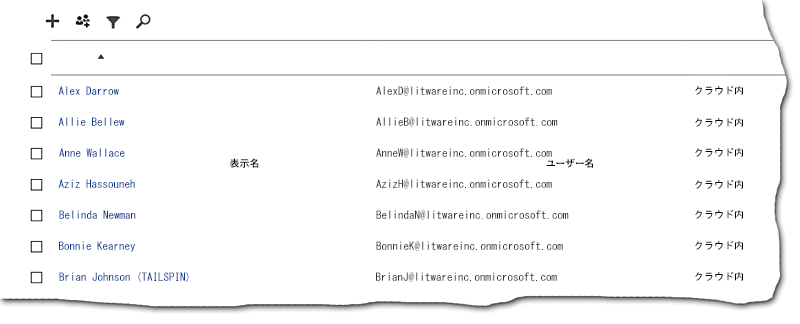
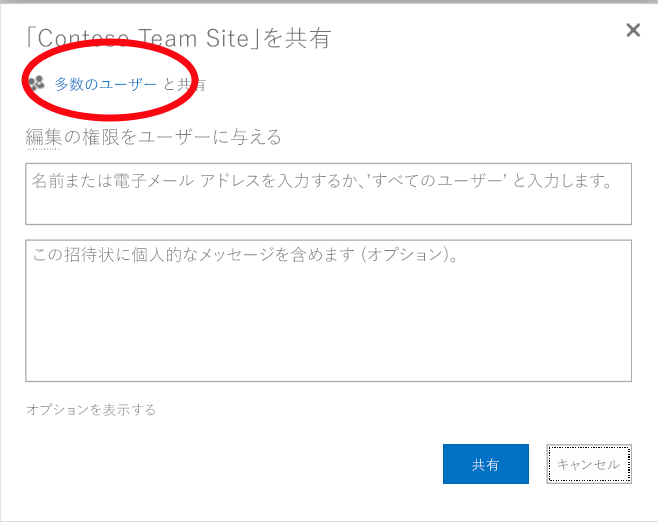
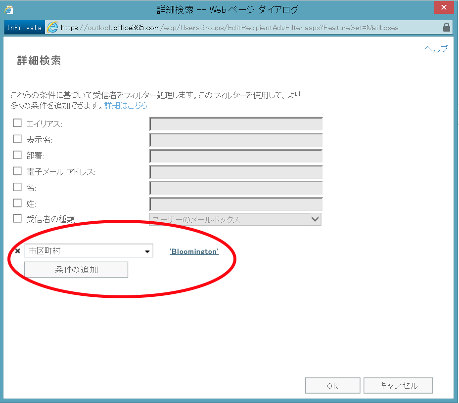
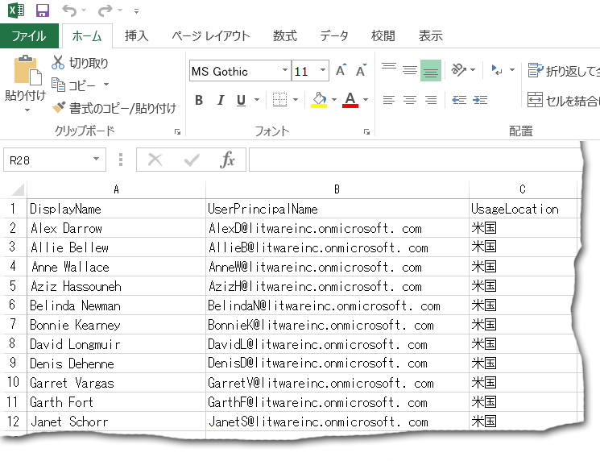

# <a name="why-you-need-to-use-office-365-powershell"></a><span data-ttu-id="f873a-103">Office 365 PowerShell を使用する必要がある理由</span><span class="sxs-lookup"><span data-stu-id="f873a-103">Why you need to use Office 365 PowerShell</span></span>

 <span data-ttu-id="f873a-104">**の概要:**管理 Office 365 では、場合によってはより効率的にし、それ以外の場合で必然的に Office 365 の PowerShell を使用する必要がある理由を理解します。</span><span class="sxs-lookup"><span data-stu-id="f873a-104">**Summary:** Understand why you must use Office 365 PowerShell to manage Office 365, in some cases more efficiently and in other cases by necessity.</span></span>
  
<span data-ttu-id="f873a-p101">Office 365 管理センター では、Office 365 ユーザー アカウントとライセンスの管理だけでなく、Office 365 サーバー製品 (Exchange、Skype for Business Online、SharePoint Online) の管理もできます。しかし、これらの管理は Office 365 PowerShell コマンドでも行うことができ、そうするなら、コマンド ラインやスクリプト言語環境を活用して処理の高速化や自動化を実現させ、機能性が向上する場合もあります。</span><span class="sxs-lookup"><span data-stu-id="f873a-p101">With the Office 365 admin center, you can not only manage your Office 365 user accounts and licenses, but you can also manage your Office 365 server products: Exchange, Skype for Business Online, and SharePoint Online. However, you can also manage these elements with Office 365 PowerShell commands, taking advantage of a command-line and scripting language environment for speed, automation, and additional capability.</span></span>
  
<span data-ttu-id="f873a-107">この記事では、Office 365 の管理に Office 365 PowerShell が役立つ、以下の点を示します。</span><span class="sxs-lookup"><span data-stu-id="f873a-107">In this article, we'll show you these ways in which you can use Office 365 PowerShell to manage Office 365.</span></span>
  
- <span data-ttu-id="f873a-108">Office 365 PowerShell は、Office 365 管理センター では表示できない追加情報を取得できます。</span><span class="sxs-lookup"><span data-stu-id="f873a-108">Office 365 PowerShell can reveal additional information that you cannot see with the Office 365 admin center</span></span>
    
- <span data-ttu-id="f873a-109">Office 365 には、Office 365 PowerShell を使用することによってのみ構成できる機能があります。</span><span class="sxs-lookup"><span data-stu-id="f873a-109">Office 365 has features that you can only configure by using Office 365 PowerShell</span></span>
    
- <span data-ttu-id="f873a-110">Office 365 PowerShell は一括操作の実行に優れています。</span><span class="sxs-lookup"><span data-stu-id="f873a-110">Office 365 PowerShell is great at performing bulk operations</span></span>
    
- <span data-ttu-id="f873a-111">Office 365 PowerShell はデータのフィルター処理に優れています。</span><span class="sxs-lookup"><span data-stu-id="f873a-111">Office 365 PowerShell is great at filtering data</span></span>
    
- <span data-ttu-id="f873a-112">Office 365 PowerShell を使用すると、データの印刷や保存が簡単にできます。</span><span class="sxs-lookup"><span data-stu-id="f873a-112">Office 365 PowerShell makes it easy to print or save data</span></span>
    
- <span data-ttu-id="f873a-113">Office 365 PowerShell では、複数のサーバー製品を管理できます。</span><span class="sxs-lookup"><span data-stu-id="f873a-113">Office 365 PowerShell lets you manage across server products</span></span>
    
<span data-ttu-id="f873a-p102">最初に、Office 365 PowerShell が、Windows ベースのサービスとプラットフォームのコマンド ライン環境である Windows PowerShell のモジュールのセットであることを理解してください。この環境によって作成されるコマンド シェル言語は、追加モジュールによって拡張することができ、それによって単純または複雑なコマンドやスクリプトが実行できるようになります。たとえば、Office 365 PowerShell モジュールをインストールして Office 365 サブスクリプションに接続した後、次のコマンドを実行して Microsoft Exchange Online のすべてのユーザー メールボックスの一覧を表示できます。</span><span class="sxs-lookup"><span data-stu-id="f873a-p102">Before you begin, understand that Office 365 PowerShell is a set of modules for Windows PowerShell, a command-line environment for Windows-based services and platforms. This environment creates a command shell language that can be extended with additional modules and provides a way to execute simple or complex commands or scripts For example, after you install the Office 365 PowerShell modules and connect to your Office 365 subscription, you can run this command to list all of the user mailboxes for Microsoft Exchange Online:</span></span>
  
```
Get-Mailbox
```

<span data-ttu-id="f873a-116">また、次のコマンドを実行して、SharePoint Online 内のすべての Web アプリ用のすべてのサイトのすべての一覧に含まれるアイテム数を計算できます。</span><span class="sxs-lookup"><span data-stu-id="f873a-116">You can also run this command to calculate the number of items in all of the lists for all of the sites for all of your web apps in SharePoint Online:</span></span>
  
```
Get-SPOSite -Limit All | Get-SPWeb -Limit All | % {$_.Lists} | ? {$_ -is [Microsoft.SharePoint.SPDocumentLibrary]} | % {$total+= $_.ItemCount}; $total
```

<span data-ttu-id="f873a-117">メールボックスの一覧の取得は Office 365 管理センター を使用しても実行できますが、すべての Web アプリ用のすべてのサイトのすべての一覧に含まれるアイテム数のカウントは簡単にはできません。</span><span class="sxs-lookup"><span data-stu-id="f873a-117">Getting the list of mailboxes can also be easily done using the Office 365 admin center, but counting the number of items in all of the lists for all of the sites for all of your web apps cannot be easily done.</span></span>
  
<span data-ttu-id="f873a-p103">Office 365 PowerShell は Office 365 の管理機能を増強する目的で設計されており、Office 365 管理センター に取って代わるものではないことに注意してください。Office 365 管理者は少なくとも Office 365 PowerShell を問題なく使用できる程度に理解している必要があります。Office 365 PowerShell コマンドによってのみ可能な構成手順もあるためです。そのような場合には、以下の方法について理解している必要があります。</span><span class="sxs-lookup"><span data-stu-id="f873a-p103">Please note that Office 365 PowerShell is designed to augment and enhance your ability to manage Office 365, not to replace the Office 365 admin center. As an Office 365 administrator, you must become at least comfortable with using Office 365 PowerShell because there are some configuration procedures that can only be done with Office 365 PowerShell commands. In these cases, you will be required to understand how to:</span></span>
  
- <span data-ttu-id="f873a-121">Office 365 PowerShell モジュールをインストールする (管理者のコンピューターごとに 1 回のみ行います)。</span><span class="sxs-lookup"><span data-stu-id="f873a-121">Install the Office 365 PowerShell modules (done only once for each administrator computer).</span></span>
    
- <span data-ttu-id="f873a-122">Office 365 サブスクリプションに接続する (PowerShell セッションごとに 1 回行います)。</span><span class="sxs-lookup"><span data-stu-id="f873a-122">Connect to your Office 365 subscription (done once for each PowerShell session).</span></span>
    
- <span data-ttu-id="f873a-123">必要な Office 365 PowerShell コマンドを実行するのに必要な情報を収集する。</span><span class="sxs-lookup"><span data-stu-id="f873a-123">Gather the information needed to run the required Office 365 PowerShell commands.</span></span>
    
- <span data-ttu-id="f873a-124">Office 365 PowerShell コマンドを正常に実行する。</span><span class="sxs-lookup"><span data-stu-id="f873a-124">Run the Office 365 PowerShell commands successfully.</span></span>
    
<span data-ttu-id="f873a-p104">これらの基本的なスキルを習得すれば、 **Get-mailbox** コマンドを使用してメールボックス ユーザーの一覧を作成する必要もなければ、すべての Web アプリ用のすべてのサイトのすべての一覧に含まれるすべてのアイテムをカウントするための前述のコマンドのような新しいコマンドを作成する方法を理解する必要もありません。Microsoft や Office 365 管理者のコミュニティが、こうした事柄を必要に応じて実行する際に役立ちます。</span><span class="sxs-lookup"><span data-stu-id="f873a-p104">After learning these basic skills, you are not required to list your mailbox users with **Get-Mailbox** command, nor are you required to understand how to create a new command like the previous one to count all the items in all the lists for all of the sites for all of your web apps. Microsoft and the community of Office 365 administrators can help you with that as needed.</span></span>
  
## <a name="office-365-powershell-can-reveal-additional-information-that-you-cannot-see-with-the-office-365-admin-center"></a><span data-ttu-id="f873a-127">Office 365 PowerShell は、Office 365 管理センター では表示できない追加情報を取得できます。</span><span class="sxs-lookup"><span data-stu-id="f873a-127">Office 365 PowerShell can reveal additional information that you cannot see with the Office 365 admin center</span></span>
<span data-ttu-id="f873a-128"><a name="reveal"> </a></span><span class="sxs-lookup"><span data-stu-id="f873a-128"></span></span>

<span data-ttu-id="f873a-p105">Office 365 管理センター には多くの有用な情報が表示されますが、ユーザー、ライセンス、メールボックス、サイトに Office 365 が格納しているすべての情報が表示されるわけではありません。Office 365 管理センター の **[ユーザーとグループ]** の例を次に示します。</span><span class="sxs-lookup"><span data-stu-id="f873a-p105">The Office 365 admin center displays a lot of useful information, but that doesn't mean that it displays all the possible information that Office 365 stores on users, licenses, mailboxes, and sites. Here is an example for **users and groups** in the Office 365 admin center:</span></span>
  

  
<span data-ttu-id="f873a-p106">ここには、さまざまな理由で把握すべき情報が表示されます。しかし、もっと多くの情報が必要な場合もあります。たとえば、Office 365 ライセンス (およびユーザーが利用可能な Office 365 機能) は、ユーザーの地理的な場所によって一部異なります。米国内に在住しているユーザーに対して拡張可能なポリシーと機能は、インドやベルギー在住のユーザーに対して拡張可能なポリシーと機能と同じではない場合があります。ユーザーの地理的な場所は Office 365 管理センター で次の手順を使用して判別できます。</span><span class="sxs-lookup"><span data-stu-id="f873a-p106">For many purposes, this displays the information you need to know. However, there are times when you need more. For example, Office 365 licensing (as well as the Office 365 features available to a user) depend in part on that user's geographic location. The policies and features you can extend to a user who lives in the United States might not be the same as the policies and features you can extend to a user who lives in India or in Belgium. You can use the Office 365 admin center to determine a user's geographic location with these steps:</span></span>
  
1. <span data-ttu-id="f873a-137">ユーザーの **表示名** をダブルクリックします。</span><span class="sxs-lookup"><span data-stu-id="f873a-137">Double-click the user's **Display Name**.</span></span>
    
2. <span data-ttu-id="f873a-138">ユーザーのプロパティを表示するウィンドウで、 **[詳細]** をクリックします。</span><span class="sxs-lookup"><span data-stu-id="f873a-138">In the user properties display pane, click **details**.</span></span>
    
3. <span data-ttu-id="f873a-139">詳細表示で、 **[追加情報]** をクリックします。</span><span class="sxs-lookup"><span data-stu-id="f873a-139">In the details display, click **additional details**.</span></span>
    
4. <span data-ttu-id="f873a-140">**[国/地域]** という見出しが表示されるまでスクロールダウンします。</span><span class="sxs-lookup"><span data-stu-id="f873a-140">Scroll down until you see the heading **Country or region**:</span></span>
    
     
  
5. <span data-ttu-id="f873a-142">ユーザーの表示名と場所を紙に書き留めるか、コピーしてメモ帳に貼り付けます。</span><span class="sxs-lookup"><span data-stu-id="f873a-142">Write the user's display name and location on a piece of paper, or copy and paste it into Notepad.</span></span> 
    
<span data-ttu-id="f873a-p107">この手順をユーザーごとに繰り返す必要があります。これは多くのユーザーにとって、面倒な作業でしょう。Office 365 PowerShell で、次のコマンドを使用して、すべてのユーザーについてのこの情報を表示できます。</span><span class="sxs-lookup"><span data-stu-id="f873a-p107">You must repeat this procedure for each user. For many users, this can be a tedious task. With Office 365 PowerShell, you can display this information for all of your users with the following command:</span></span>
  
```
Get-MsolUser | Select DisplayName, UsageLocation
```

> [!NOTE]
> <span data-ttu-id="f873a-146">このコマンドを実行するには、[Windows Azure Active Directory モジュール](https://technet.microsoft.com/en-us/library/jj151815.aspx)をインストールする必要があります。</span><span class="sxs-lookup"><span data-stu-id="f873a-146">This command requires you to install the [Windows Azure Active Directory module](https://technet.microsoft.com/en-us/library/jj151815.aspx).</span></span> 
  
<span data-ttu-id="f873a-147">表示例:</span><span class="sxs-lookup"><span data-stu-id="f873a-147">Here is an example of the display:</span></span>
  
```
DisplayName                               UsageLocation
-----------                               -------------
Zrinka Makovac                            US
Bonnie Kearney                            GB
Fabrice Canel                             BR
Brian Johnson (TAILSPIN)                  US
Anne Wallace                              US
Alex Darrow                               US
David Longmuir                            BR
```

> [!TIP]
>  <span data-ttu-id="f873a-148">この Office 365 の PowerShell コマンドの解釈: ( **Get MsolUser** ) は、現在の Office 365 サブスクリプション内のすべてのユーザーを取得するが、名前と (**表示名の選択、UsageLocation** ) は、各ユーザーの場所にのみ表示されます。</span><span class="sxs-lookup"><span data-stu-id="f873a-148">The interpretation of this Office 365 PowerShell command is: Get all of the users in the current Office 365 subscription ( **Get-MsolUser** ), but only display the name and location for each user ( **Select DisplayName, UsageLocation** ).</span></span>
  
<span data-ttu-id="f873a-p108">Office 365 PowerShell はコマンド シェル言語をサポートしているので、 **Get-MSolUser** コマンドで取得した情報をさらに処理できます。たとえば、場所を基準にユーザーを並べ替えて、ブラジルのユーザー、米国のユーザーなどをそれぞれグループ化できます。コマンドを次に示します。</span><span class="sxs-lookup"><span data-stu-id="f873a-p108">Because Office 365 PowerShell supports a command shell language, you can further manipulate the information obtained from the **Get-MSolUser** command. For example, maybe you'd like to sort these users by their location, grouping all the Brazilian users together, all the United States users together, etc. Here is the command:</span></span>
  
```
Get-MsolUser | Select DisplayName, UsageLocation | Sort UsageLocation, DisplayName
```

<span data-ttu-id="f873a-151">表示例:</span><span class="sxs-lookup"><span data-stu-id="f873a-151">Here is an example of the display:</span></span>
  
```
DisplayName                                 UsageLocation
-----------                                 -------------
David Longmuir                              BR
Fabrice Canel                               BR
Bonnie Kearney                              GB
Alex Darrow                                 US
Anne Wallace                                US
Brian Johnson (TAILSPIN)                    US
Zrinka Makovac                              US
```

> [!TIP]
>  <span data-ttu-id="f873a-152">この Office 365 の PowerShell コマンドの解釈: 現在の Office 365 サブスクリプション内のすべてのユーザーを取得がのみ名と各ユーザーの場所を表示し、並べ替えるには最初の場所では、し、名前 ( **UsageLocation の並べ替え、表示名**)。</span><span class="sxs-lookup"><span data-stu-id="f873a-152">The interpretation of this Office 365 PowerShell command is: Get all of the users in the current Office 365 subscription, but only display the name and location for each user and sort them first by their location, and then their names ( **Sort UsageLocation, DisplayName** ).</span></span>
  
<span data-ttu-id="f873a-p109">また、フィルター処理を追加することもできます。たとえば、ブラジル在住のユーザーに関する情報のみを表示する場合には、次のコマンドを使用します。</span><span class="sxs-lookup"><span data-stu-id="f873a-p109">You can also employ additional filtering. For example, if you only want to see information about users based in Brazil, use this command:</span></span>
  
```
Get-MsolUser | Where {$_.UsageLocation -eq "BR"} | Select DisplayName, UsageLocation 
```

<span data-ttu-id="f873a-155">表示例:</span><span class="sxs-lookup"><span data-stu-id="f873a-155">Here is an example of the display:</span></span>
  
```
DisplayName                                           UsageLocation
-----------                                           -------------
David Longmuir                                        BR
Fabrice Canel                                         BR
```

> [!TIP]
>  <span data-ttu-id="f873a-156">この Office 365 の PowerShell コマンドの解釈: 位置がブラジルにある現在の Office 365 サブスクリプション内のすべてのユーザーを取得する ( **、{$\_。UsageLocation - eq"BR"}** )、名前と各ユーザーの場所を表示します。</span><span class="sxs-lookup"><span data-stu-id="f873a-156">The interpretation of this Office 365 PowerShell command is: Get all of the users in the current Office 365 subscription whose location is Brazil ( **Where {$\_.UsageLocation -eq "BR"}** ), then display the name and location for each user.</span></span>
  
 <span data-ttu-id="f873a-157">**規模の大きいドメインに関する注意事項**</span><span class="sxs-lookup"><span data-stu-id="f873a-157">**A Quick Note Regarding Larger Domains**</span></span>
  
<span data-ttu-id="f873a-p110">ドメインの規模が非常に大きい場合 (たとえば、何万人ものユーザーが属している場合)、この記事に記載する一部の例で、「スロットリング」が発生する場合があります。これはつまり、計算能力や使用可能なネットワーク帯域幅などを上回る操作を、一度に実行しようとしていることを意味します。このため、大規模な組織の場合は、これらの Office 365 PowerShell コマンドを 2 つのコマンドに分けることができます。たとえば、次の 1 つのコマンドはすべてのユーザー アカウントを返し、それぞれの名前と場所を示します。</span><span class="sxs-lookup"><span data-stu-id="f873a-p110">If you have a very large domain with tens of thousands of users, trying some of the examples we show in this article could lead to "throttling." That means that, based on things like computing power and available network bandwidth, you're trying to do a little too much at one time. Because of that, larger organizations might want to split some of these Office 365 PowerShell commands into two commands. For example, this one command returns all the user accounts and shows the name and location for each:</span></span>
  
```
Get-MsolUser | Select DisplayName, UsageLocation
```

<span data-ttu-id="f873a-p111">このコマンドは、規模が小さいドメインには最適に機能します。しかし大規模な組織では、これを 2 つのコマンドに分けて、一方のコマンドでユーザー アカウント情報を変数に格納し、もう一方のコマンドで必要な情報を表示することが必要になる可能性があります。次に例を示します。</span><span class="sxs-lookup"><span data-stu-id="f873a-p111">That works great for smaller domains. In a large organization, however, you might need to split that into two commands: one command to store the user account information in a variable and another command to display the needed information. Here is an example:</span></span>
  
```
$x = Get-MsolUser
$x | Select DisplayName, UsageLocation
```


<span data-ttu-id="f873a-165">この一連の Office 365 の PowerShell コマンドの解釈は次のとおりです。</span><span class="sxs-lookup"><span data-stu-id="f873a-165">The interpretation of this set of Office 365 PowerShell commands is:</span></span>
- <span data-ttu-id="f873a-166">現在の Office 365 サブスクリプション内のすべてのユーザーを取得し、$x という名前の変数に情報を保存 ( **$x = Get MsolUser** )。</span><span class="sxs-lookup"><span data-stu-id="f873a-166">Get all of the users in the current Office 365 subscription and store the information in a variable named $x ( **$x = Get-MsolUser** ).</span></span>
- <span data-ttu-id="f873a-167">変数 $x の内容を表示しますが、のみの名前と各ユーザーの場所が含まれます ( **$x |選択の表示名、UsageLocation** )。</span><span class="sxs-lookup"><span data-stu-id="f873a-167">Display the contents of the variable $x, but only include the name and location for each user ( **$x | Select DisplayName, UsageLocation** ).</span></span>
  
## <a name="office-365-has-features-that-you-can-only-configure-with-office-365-powershell"></a><span data-ttu-id="f873a-168">Office 365 には Office 365 PowerShell を使うことによってのみ構成可能な機能がある</span><span class="sxs-lookup"><span data-stu-id="f873a-168">Office 365 has features that you can only configure with Office 365 PowerShell</span></span>
<span data-ttu-id="f873a-169"><a name="only"> </a></span><span class="sxs-lookup"><span data-stu-id="f873a-169"></span></span>

<span data-ttu-id="f873a-p112">Office 365 管理センター は、ほとんどの場合に対応する最も一般的で重要な管理タスクを利用できるようにすることを目的としています。つまり、Office 365 管理センター は、一般的な管理者がこのツールを使用して最も一般的な管理タスクを実行できるように設計されています。したがって、Office 365 管理センター では実行できないタスクも存在します。</span><span class="sxs-lookup"><span data-stu-id="f873a-p112">The Office 365 admin center is intended to provide access to the most common or meaningful administrative tasks that apply to most people. In other words, the Office 365 admin center was designed so that the typical administrator could use the tool to carry out the most common management tasks. By this definition, that means that there are some tasks that can't be completed by using the Office 365 admin center.</span></span>
  
<span data-ttu-id="f873a-173">たとえば、Skype for Business Online 管理センターにはカスタムの会議出席依頼を作成するためのいくつかのオプションが備わっています。</span><span class="sxs-lookup"><span data-stu-id="f873a-173">For example, the Skype for Business Online Admin center provides a few options for creating custom meeting invitations:</span></span>
  

  
<span data-ttu-id="f873a-p113">これらの設定を使用すると、会議出席依頼にパーソナルでプロフェッショナルな風合いを加えることができます。しかし、会議の構成設定には、カスタムの会議出席依頼を作成する以上の事柄が関係します。たとえば、既定では会議に関して以下の事柄が許可されています。</span><span class="sxs-lookup"><span data-stu-id="f873a-p113">With these settings, you can add a touch of personalization and professionalism to meeting invitations. However, there's more to meeting configuration settings than simply creating custom meeting invitations. For example, by default, meetings allow:</span></span>
  
- <span data-ttu-id="f873a-178">匿名ユーザーが、各会議に自動的に参加すること。</span><span class="sxs-lookup"><span data-stu-id="f873a-178">Anonymous users to gain automatic entrance to each meeting.</span></span>
    
- <span data-ttu-id="f873a-179">参加者が、会議を記録すること。</span><span class="sxs-lookup"><span data-stu-id="f873a-179">Attendees to record the meeting.</span></span>
    
- <span data-ttu-id="f873a-180">組織のすべてのユーザーが、会議に参加するときに発表者として指定されること。</span><span class="sxs-lookup"><span data-stu-id="f873a-180">All users from your organization to be designated as presenters when they join the meeting.</span></span>
    
<span data-ttu-id="f873a-p114">これらの設定に関しては、Skype for Business Online 管理センターからは行うことができません。ただし、Office 365 PowerShell からは制御が可能です。これらの 3 つの設定を無効にするコマンドを次に示します。</span><span class="sxs-lookup"><span data-stu-id="f873a-p114">These settings are not available from the Skype for Business Online Admin center. However, you can control them from Office 365 PowerShell. Here is a command that disables these three settings:</span></span>
  
```
Set-CsMeetingConfiguration -AdmitAnonymousUsersByDefault $False -AllowConferenceRecording $False -DesignateAsPresenter "None"
```

> [!NOTE]
> <span data-ttu-id="f873a-184">このコマンドを実行するには、[Skype for Business Online PowerShell モジュール](https://www.microsoft.com/download/details.aspx?id=39366)をインストールする必要があります。</span><span class="sxs-lookup"><span data-stu-id="f873a-184">This command requires that you install the [Skype for Business Online PowerShell Module ](https://www.microsoft.com/download/details.aspx?id=39366).</span></span> 
  
> [!TIP]
>  <span data-ttu-id="f873a-185">この Office 365 の PowerShell コマンドの解釈: (**セット-CsMeetingConfiguration** ) ビジネス ・ オンライン会議のための新しい Skype の設定、会議への自動の入口を得るために匿名ユーザーを許可するを無効にする ( **-AdmitAnonymousUsersByDefault $False** ) ( **AllowConferenceRecording $False** ) 記録の会議に出席者の機能を無効にし、発表者として、組織内のすべてのユーザーを指定しない ( **- DesignateAsPresenter は「なし」** )。</span><span class="sxs-lookup"><span data-stu-id="f873a-185">The interpretation of this Office 365 PowerShell command is: For the settings for new Skype for Business Online meetings ( **Set-CsMeetingConfiguration** ), disable allowing anonymous users to gain automatic entrance to meetings ( **-AdmitAnonymousUsersByDefault $False** ), disable the ability for attendees to record meetings ( **-AllowConferenceRecording $False** ), and do not designate all users from your organization as presenters ( **-DesignateAsPresenter "None"** ).</span></span>
  
<span data-ttu-id="f873a-186">方針を変えて既定の設定に戻す (これらすべてを有効にする) 場合には、次のコマンドを実行します。</span><span class="sxs-lookup"><span data-stu-id="f873a-186">If you change your mind and want to restore these default settings (all of them enabled), run this command:</span></span>
  
```
Set-CsMeetingConfiguration -AdmitAnonymousUsersByDefault $True -AllowConferenceRecording $True -DesignateAsPresenter "Company"
```

<span data-ttu-id="f873a-p115">これは一例に過ぎません。Office 365 管理者が Office 365 PowerShell コマンドの実行方法をよく理解しているべき理由は他にもあります。</span><span class="sxs-lookup"><span data-stu-id="f873a-p115">This is just one example. There are others, which is why you, as an Office 365 administrator, need to be comfortable with running Office 365 PowerShell commands.</span></span>
  
## <a name="office-365-powershell-is-great-at-carrying-out-bulk-operations"></a><span data-ttu-id="f873a-189">Office 365 PowerShell は一括操作を実行するのに適している</span><span class="sxs-lookup"><span data-stu-id="f873a-189">Office 365 PowerShell is great at carrying out bulk operations</span></span>
<span data-ttu-id="f873a-190"><a name="bulk"> </a></span><span class="sxs-lookup"><span data-stu-id="f873a-190"></span></span>

<span data-ttu-id="f873a-p116">これまで、Office 365 管理センター のようなビジュアル インターフェイスは、実行する操作が 1 つである場合に最適でした。たとえば、1 つのユーザー アカウントを無効にする必要がある場合は、Office 365 管理センター を使用することにより、簡単にチェックボックスを見つけて選択を解除できます。こちらのほうが、Office 365 PowerShell で同様の操作を行うよりも簡単な場合があります。</span><span class="sxs-lookup"><span data-stu-id="f873a-p116">Historically, visual interfaces like the Office 365 admin center are most valuable when you have a single operation to perform. For example, if you need to disable one user account, you can use the Office 365 admin center to quickly locate and clear a checkbox. This can be simpler than performing a similar operation in Office 365 PowerShell.</span></span>
  
<span data-ttu-id="f873a-p117">しかし、多くのものを変更したり、多くの対象から一部を選択して変更したりする必要がある場合には、Office 365 管理センター が最も効率的であるとはいえません。たとえば、何千もの電話番号の局番を変更したり、使用しているすべての SharePoint Online サイトから特定のユーザー (Ken Myer) を削除する必要がある場合、Office 365 管理センター でどのように実行できるでしょうか。</span><span class="sxs-lookup"><span data-stu-id="f873a-p117">But if you have to change many things or some selected things within a large set of other things, the Office 365 admin center might not be the best use of your time. For example, if you had to change the prefix on thousands of phone numbers or you needed to remove a specific user, Ken Myer, from all of your SharePoint Online sites, how would you do that in the Office 365 admin center?</span></span>
  
<span data-ttu-id="f873a-p118">後者の例の場合、何百もの SharePoint Online サイトがあり、Ken Meyer がメンバーのサイトも判断できません。つまり、Office 365 管理センター を開き、各サイトに対して以下の手順を実行する必要があります。</span><span class="sxs-lookup"><span data-stu-id="f873a-p118">For the latter example, you have several hundred SharePoint Online sites and you don't know even know which ones of which Ken Meyer is a member. That means you'll have to start at the Office 365 admin center and then perform this procedure for each site:</span></span>
  
1. <span data-ttu-id="f873a-198">サイトの **URL** をクリックします。</span><span class="sxs-lookup"><span data-stu-id="f873a-198">Click the **URL** of the site.</span></span>
    
2. <span data-ttu-id="f873a-199">[ **サイト コレクションのプロパティ** ] ボックスで、[ **Web サイトのアドレス** ] リンクをクリックしてサイトを開きます。</span><span class="sxs-lookup"><span data-stu-id="f873a-199">In the **site collection properties** box, click the **Web Site Address** link to open the site.</span></span>
    
3. <span data-ttu-id="f873a-200">サイトの [ **共有** ] をクリックします。</span><span class="sxs-lookup"><span data-stu-id="f873a-200">On the site, click **Share**.</span></span>
    
4. <span data-ttu-id="f873a-201">[ **共有** ] ダイアログ ボックスで、サイトへのアクセス権限を持つすべてのユーザーを表示するリンクをクリックします。</span><span class="sxs-lookup"><span data-stu-id="f873a-201">In the **Share** dialog box click the link that shows you all the users who have permissions to the site:</span></span>
    
     
  
5. <span data-ttu-id="f873a-203">[ **共有相手** ] ダイアログ ボックスで、[ **詳細設定** ] をクリックします。</span><span class="sxs-lookup"><span data-stu-id="f873a-203">In the **Shared With** dialog box, click **Advanced**.</span></span>
    
6. <span data-ttu-id="f873a-204">ユーザーの一覧をスクロール ダウンし、Ken Myer (サイトへのアクセス権限を持っていることが前提) を見つけて選択してから、[ **ユーザー権限の削除** ] をクリックします。</span><span class="sxs-lookup"><span data-stu-id="f873a-204">Scroll down the list of users, find and select Ken Myer (assuming he has permissions to the site), and then click **Remove User Permissions**.</span></span>
    
<span data-ttu-id="f873a-205">何百ものサイトがある場合、長時間かかる可能性があります。</span><span class="sxs-lookup"><span data-stu-id="f873a-205">This can take a long time for several hundred sites.</span></span>
  
<span data-ttu-id="f873a-206">これに代わる方法として、Office 365 PowerShell で次のコマンドを使って、すべてのサイトから Ken Myer を削除できます。</span><span class="sxs-lookup"><span data-stu-id="f873a-206">The alternative is to use Office 365 PowerShell and the following command to remove Ken Myer from all of your sites:</span></span>
  
```
Get-SPOSite | ForEach {Remove-SPOUser -Site $_.Url -LoginName "kenmyer@litwareinc.com"}
```

> [!NOTE]
> <span data-ttu-id="f873a-207">このコマンドでは、[SharePoint Online PowerShell への接続](https://technet.microsoft.com/library/fp161372.aspx)をインストールする必要があります。</span><span class="sxs-lookup"><span data-stu-id="f873a-207">This command requires that you install the [Connect to SharePoint Online PowerShell](https://technet.microsoft.com/library/fp161372.aspx).</span></span> 
  
> [!TIP]
>  <span data-ttu-id="f873a-208">この Office 365 の PowerShell コマンドの解釈: 現在の Office 365 サブスクリプション ( **Get SPOSite** ) 内の SharePoint サイトのすべてを取り出して、各サイトの Ken 出せる ( **ForEach {削除-SPOUser - にアクセスできるユーザーの一覧からサイトの $\_。Url のログイン名が表示"kenmyer@litwareinc.com"}** )。</span><span class="sxs-lookup"><span data-stu-id="f873a-208">The interpretation of this Office 365 PowerShell command is:  Get all of the SharePoint sites in the current Office 365 subscription ( **Get-SPOSite** ) and for each site, remove Ken Meyer from the list of users who can access it ( **ForEach {Remove-SPOUser -Site $\_.Url -LoginName "kenmyer@litwareinc.com"}** ).</span></span>
  
<span data-ttu-id="f873a-p119">Ken Meyer がアクセス権を持っていないサイトも含めて、すべてのサイトから Ken Meyer を削除するように Office 365 に指示しているため、このコマンドの画面表示には、現在アクセス権を持っていないサイトに関するエラーが示されます。このコマンドで追加条件を使用して Key Meyer がログイン リストに含まれているサイトからのみ削除できます。ただし、表示されるエラーによってサイト自体が悪影響を受けることはありません。Office 365 管理センター で作業するには何時間もかかるのに対し、このコマンドを何百ものサイトに対して実行しても数分しかかかりません。</span><span class="sxs-lookup"><span data-stu-id="f873a-p119">Because we are telling Office 365 to remove Ken Meyer from every site, including those in which he does not have access, the display of this command will show errors for those sites in which he does not currently have access. We can use an additional condition on this command to remove Key Meyer only from the sites that have him in their login list, but the listed errors cause no harm to the sites themselves. This command might take a few minutes to run against hundreds of sites, rather than hours of working through the Office 365 admin center.</span></span>
  
<span data-ttu-id="f873a-p120">別の一括操作の例を次に示します。このコマンドを使用して、新しい SharePoint 管理者である Bonnie Kearney を組織内のすべてのサイトに追加します。</span><span class="sxs-lookup"><span data-stu-id="f873a-p120">Here is another bulk operation example. Use this command to add Bonnie Kearney, a new SharePoint administrator, to all of the sites in the organization:</span></span>
  
```
Get-SPOSite | ForEach {Add-SPOUser -Site $_.Url -LoginName "bkearney@litwareinc.com" -Group "Members"}
```

> [!TIP]
>  <span data-ttu-id="f873a-214">この Office 365 の PowerShell コマンドの解釈は、: 現在の Office 365 サブスクリプションで、サイトごとに、すべての SharePoint サイトを取得、Bonnie Kearney のアクセスを許可するサイトのメンバー グループに自分のログイン名を追加することによって ( **ForEach {追加 SPOUser ・ サイト$\_.Url のログイン名が表示"bkearney@litwareinc.com"のグループのメンバー]}** )。</span><span class="sxs-lookup"><span data-stu-id="f873a-214">The interpretation of this Office 365 PowerShell command is:  Get all of the SharePoint sites in the current Office 365 subscription and for each site, allow Bonnie Kearney access by adding her login name to the Members group of the site ( **ForEach {Add-SPOUser -Site $\_.Url -LoginName "bkearney@litwareinc.com" -Group "Members"}** ).</span></span>
  
## <a name="office-365-powershell-is-great-at-filtering-data"></a><span data-ttu-id="f873a-215">Office 365 PowerShell はデータのフィルター処理に優れています。</span><span class="sxs-lookup"><span data-stu-id="f873a-215">Office 365 PowerShell is great at filtering data</span></span>
<span data-ttu-id="f873a-216"><a name="filter"> </a></span><span class="sxs-lookup"><span data-stu-id="f873a-216"></span></span>

<span data-ttu-id="f873a-p121">Office 365 管理センター では、データをフィルター処理するためのさまざまな方法、つまり、対象になる情報の一部をすばやく簡単に見つけるためのさまざまな方法を使用できます。たとえば、Exchange では、ユーザー メールボックスのほとんどすべてのプロパティに対するフィルターを簡単に適用できます。たとえば、以下は、Bloomington 市に在住のすべてのユーザーのメールボックスを一覧表示する例です。</span><span class="sxs-lookup"><span data-stu-id="f873a-p121">The Office 365 admin center provides several different ways to filter your data to quickly and easily locate a targeted subset of information. For example, Exchange makes it easy to filter on practically any property of a user mailbox. For example, here is the list of mailboxes for all the users who live in the city of Bloomington:</span></span>
  

  
<span data-ttu-id="f873a-p122">Exchange 管理センターでは、フィルター条件を組み合わせることもできます。たとえば、ブルーミントン市に住み、経理部で働いているすべての住民のメールボックスを見つけることができます。</span><span class="sxs-lookup"><span data-stu-id="f873a-p122">The Exchange Admin center also lets you combine filter criteria. For example, you can find the mailboxes for all the people who live in Bloomington and who work in the Finance department.</span></span> 
  
<span data-ttu-id="f873a-p123">しかし、Exchange 管理センターで行えることには限界があります。たとえば、ブルーミントンかサンディエゴに住んでいる住民のメールボックスを検索したい場合や、ブルーミントンに住んでいないすべての住民のメールボックスを検索したい場合もあるでしょう。</span><span class="sxs-lookup"><span data-stu-id="f873a-p123">However, there are limitations to what you can do in the Exchange Admin center. For example, maybe you'd like to find the mailboxes of people who live in Bloomington or San Diego, or the mailboxes for all the people who don't live in Bloomington.</span></span> 
  
<span data-ttu-id="f873a-225">Office 365 PowerShell では、ブルーミントン市やサンディエゴ市に住んでいるすべての住民のメールボックスの一覧を取得するために、次のコマンドを使うことができます。</span><span class="sxs-lookup"><span data-stu-id="f873a-225">With Office 365 PowerShell, you can get a list of mailboxes for all the people who live in the cities of Bloomington or San Diego with this command:</span></span>
  
```
Get-User | Where {$_.RecipientTypeDetails -eq "UserMailbox" -and ($_.City -eq "San Diego" -or $_.City -eq "Bloomington")} | Select DisplayName, City
```

<span data-ttu-id="f873a-226">表示例:</span><span class="sxs-lookup"><span data-stu-id="f873a-226">Here is an example of the display:</span></span>
  
```
DisplayName                              City
-----------                              ----
Alex Darrow                              San Diego
Bonnie Kearney                           San Diego
Julian Isla                              Bloomington
Rob Young                                Bloomington
Zrinka Makovac                           San Diego
```

> [!TIP]
>  <span data-ttu-id="f873a-227">この Office 365 の PowerShell コマンドの解釈: サンディエゴまたはブルーミントンのいずれかの都市にメールボックスを持っている現在の Office 365 サブスクリプション内のユーザーのすべてを取得する ( **、{$\_。RecipientTypeDetails eq の「構成」で、($\_.都市の eq「サンディエゴ」、または $\_。都市の eq」ブルーミントン「)}** )、各 (**選択の表示名、市区町村**) の名前と都市を表示します。</span><span class="sxs-lookup"><span data-stu-id="f873a-227">The interpretation of this Office 365 PowerShell command is: Get all of the users in the current Office 365 subscription who have a mailbox in the cities of either San Diego or Bloomington ( **Where {$\_.RecipientTypeDetails -eq "UserMailbox" -and ($\_.City -eq "San Diego" -or $\_.City -eq "Bloomington")}** ), then display the name and city for each ( **Select DisplayName, City** ).</span></span>
  
<span data-ttu-id="f873a-228">ブルーミントン以外に居住しているユーザーのメールボックスをすべて一覧表示するには、次のコマンドを使用します。</span><span class="sxs-lookup"><span data-stu-id="f873a-228">To list all the mailboxes for people who live anywhere except Bloomington, here is the command:</span></span>
  
```
Get-User | Where {$_.RecipientTypeDetails -eq "UserMailbox" -and $_.City -ne "Bloomington"} | Select DisplayName, City
```

<span data-ttu-id="f873a-229">表示例:</span><span class="sxs-lookup"><span data-stu-id="f873a-229">Here is an example of the display:</span></span>
  
```
DisplayName                               City
-----------                               ----
MOD Administrator                         Redmond
Alex Darrow                               San Diego
Allie Bellew                              Bellevue
Anne Wallace                              Louisville
Aziz Hassouneh                            Cairo
Belinda Newman                            Charlotte
Bonnie Kearney                            San Diego
David Longmuir                            Waukesha
Denis Dehenne                             Birmingham
Garret Vargas                             Seattle
Garth Fort                                Tulsa
Janet Schorr                              Bellevue
```

> [!TIP]
>  <span data-ttu-id="f873a-230">この Office 365 の PowerShell コマンドの解釈: ブルーミントンの市区町村内に存在しないメールボックスを持っている現在の Office 365 サブスクリプション内のユーザーのすべてを取得する ( **、{$\_。RecipientTypeDetails eq の「構成」、および $\_。Ne「ブルーミントン」では市区町村}** )、それぞれの名前と都市を表示します。</span><span class="sxs-lookup"><span data-stu-id="f873a-230">The interpretation of this Office 365 PowerShell command is: Get all of the users in the current Office 365 subscription who have a mailbox not located in the city of Bloomington ( **Where {$\_.RecipientTypeDetails -eq "UserMailbox" -and $\_.City -ne "Bloomington"}** ), then display the name and city for each.</span></span>
  
<span data-ttu-id="f873a-p124">Office 365 PowerShell フィルターでワイルドカード文字を使って、名前の一部が一致している項目を検出することもできます。たとえば、あるユーザー アカウントを探しているものの、名字が Anderson か Henderson であることしか思い出せず、もしかすると Jorgenson だったかもしれないとします。</span><span class="sxs-lookup"><span data-stu-id="f873a-p124">You can also use wildcard characters in your Office 365 PowerShell filters to match part of a name. For example, suppose you're looking for a user account, and all you can remember is that their last name was Anderson, or maybe Henderson, or maybe it was Jorgenson.</span></span>
  
<span data-ttu-id="f873a-233">Office 365 管理センター では、このユーザーは検索ツールを使用して、次の 3 種類の検索を実行して見つけ出すことができます。</span><span class="sxs-lookup"><span data-stu-id="f873a-233">You could track down that user in the Office 365 admin center by using the search tool and carrying out three different searches:</span></span>
  
- <span data-ttu-id="f873a-234">*Anderson*  用のもの</span><span class="sxs-lookup"><span data-stu-id="f873a-234">One for  *Anderson*</span></span> 
    
- <span data-ttu-id="f873a-235">*Henderson*  用のもの</span><span class="sxs-lookup"><span data-stu-id="f873a-235">One for  *Henderson*</span></span> 
    
- <span data-ttu-id="f873a-236">*Jorgenson*  用のもの</span><span class="sxs-lookup"><span data-stu-id="f873a-236">One for  *Jorgenson*</span></span> 
    
<span data-ttu-id="f873a-p125">これら 3 つの名前の最後はどれも「son」で終わっているので、Office 365 PowerShell に、名前の末尾が「son」のユーザーすべてを表示するよう指示できます。コマンドを次に示します。</span><span class="sxs-lookup"><span data-stu-id="f873a-p125">Because all three of these names end in "son", you can tell Office 365 PowerShell to display all the users whose name ends in "son". Here is the command:</span></span>
  
```
Get-User -Filter '{LastName -like "*son"}'
```

> [!TIP]
>  <span data-ttu-id="f873a-p126">この Office 365 の PowerShell コマンドの解釈は、: 現在の Office 365 サブスクリプション内のすべてのユーザーを取得ですが、姓が"son"で終わるユーザーのみを一覧表示するフィルターを使用して、( **-フィルター ' {[氏名]-と同じように"\*息子"}'** )。\*の場合は、ユーザーの姓の文字の文字の任意のセットを意味します。</span><span class="sxs-lookup"><span data-stu-id="f873a-p126">The interpretation of this Office 365 PowerShell command is: Get all of the users in the current Office 365 subscription, but use a filter that only lists the users whose last names end in "son" ( **-Filter '{LastName -like "\*son"}'** ). The \* stands for any set of characters, which are letters in the case of the user's last name.</span></span>
  
## <a name="office-365-powershell-makes-it-easy-to-print-or-save-data"></a><span data-ttu-id="f873a-241">Office 365 PowerShell を使用すると、データの印刷や保存が簡単にできます。</span><span class="sxs-lookup"><span data-stu-id="f873a-241">Office 365 PowerShell makes it easy to print or save data</span></span>
<span data-ttu-id="f873a-242"><a name="printsave"> </a></span><span class="sxs-lookup"><span data-stu-id="f873a-242"></span></span>

<span data-ttu-id="f873a-p127">Office 365 管理センター を使用すると、データの一覧を表示できます。Skype for Business Online 管理センターの表示例を示します。Skype for Business Online に対して有効になっているユーザーの一覧が表示されています。</span><span class="sxs-lookup"><span data-stu-id="f873a-p127">The Office 365 admin center allows you to view lists of data. Here is an example of the Skype for Business Online Admin center displaying a list of users who have been enabled for Skype for Business Online:</span></span>
  

  
<span data-ttu-id="f873a-p128">この情報をファイルに保存するには、コピーしてドキュメントまたは Excel に貼り付ける必要があります。どちらの場合も、コピー操作には追加の書式設定が必要になる場合があります。また、Office 365 管理センター では、表示された一覧を直接印刷できません。</span><span class="sxs-lookup"><span data-stu-id="f873a-p128">To save that information to a file, you must copy and paste it into a document or Excel. In either case, the copy might require additional formatting. Additionally, the Office 365 admin center does not provide a way to directly print the displayed list.</span></span>
  
<span data-ttu-id="f873a-p129">幸い、Office 365 PowerShell を使えば、一覧を表示するだけでなく、ファイルに保存してそれを簡単に Excel にインポートできます。次に示すコマンド例を実行すると、Skype for Business Online ユーザー データがコンマ区切り値 (CSV) ファイルに保存されます。このファイルは、Excel ワークシート内にテーブルとして簡単にインポートできます。</span><span class="sxs-lookup"><span data-stu-id="f873a-p129">Fortunately, you can use Office 365 PowerShell to not only display the list, but save it to a file that can be easily imported into Excel. Here is an example command to save Skype for Business Online user data to a comma-separated values (CSV) file, a file that can be easily imported as a table in an Excel worksheet:</span></span>
  
```
Get-CsOnlineUser | Select DisplayName, UserPrincipalName, UsageLocation | Export-Csv -Path "C:\\Logs\\SfBUsers.csv" -NoTypeInformation
```

<span data-ttu-id="f873a-251">表示例:</span><span class="sxs-lookup"><span data-stu-id="f873a-251">Here is an example of the display:</span></span>
  

  
> [!TIP]
>  <span data-ttu-id="f873a-253">この Office 365 の PowerShell コマンドの解釈: の現在の Office 365 サブスクリプション ( **Get CsOnlineUser** ) でのオンライン ビジネスのユーザーが、Skype のすべてを取得、ユーザー名、UPN、および場所 (**の表示名の選択のみを取得します。UserPrincipalName、UsageLocation** )、CSV ファイル内の情報という名前で c: を保存し、\\ログ\\SfBUsers.csv (**エクスポート Csv のパス"c:\\ログ\\SfBUsers.csv」- NoTypeInformation** )。</span><span class="sxs-lookup"><span data-stu-id="f873a-253">The interpretation of this Office 365 PowerShell command is: Get all of the Skype for Business Online users in the current Office 365 subscription ( **Get-CsOnlineUser** ), obtain only the user name, UPN, and location ( **Select DisplayName, UserPrincipalName, UsageLocation** ), and then save that information in CSV file named C:\\Logs\\SfBUsers.csv ( **Export-Csv -Path "C:\\Logs\\SfBUsers.csv" -NoTypeInformation** ).</span></span>
  
<span data-ttu-id="f873a-p130">また、オプションを使って、この一覧を XML ファイルや HTML ページとして保存できます。実際、追加の PowerShell コマンドを使い、必要なカスタム書式設定で直接 Excel ファイルとして保存できます。</span><span class="sxs-lookup"><span data-stu-id="f873a-p130">You can also use options to save this list as an XML file or as an HTML page. In fact, with additional PowerShell commands, you could save it directly as an Excel file, with any custom formatting you desire.</span></span> 
  
<span data-ttu-id="f873a-p131">さらに、一覧を表示する Office 365 PowerShell コマンドの出力を、Windows の既定のプリンターに直接送信することもできます。コマンド例を次に示します。</span><span class="sxs-lookup"><span data-stu-id="f873a-p131">You can also send the output of an Office 365 PowerShell command that displays a list directly to the default printer in Windows. Here is an example command:</span></span>
  
```
Get-CsOnlineUser | Select DisplayName, UserPrincipalName, UsageLocation | Out-Printer
```

<span data-ttu-id="f873a-258">印刷されたドキュメントは次のようになります。</span><span class="sxs-lookup"><span data-stu-id="f873a-258">Here's what your printed document will look like:</span></span>
  

  
> [!TIP]
>  <span data-ttu-id="f873a-260">この Office 365 の PowerShell コマンドの解釈: Office 365 サブスクリプションの現在のオンライン ビジネスのユーザーがユーザー名、UPN、および位置のみを取得し、Windows の既定のプリンター (**にその情報を送信するが、Skype のすべてを取得Out-Printer** )。</span><span class="sxs-lookup"><span data-stu-id="f873a-260">The interpretation of this Office 365 PowerShell command is:  Get all of the Skype for Business Online users in the current Office 365 subscription, obtain only the user name, UPN, and location, and then send that information to the default Windows printer ( **Out-Printer** ).</span></span>
  
<span data-ttu-id="f873a-261">印刷された文書には、単純なと同じ書式設定、Office 365 の PowerShell コマンド ウィンドウ内の表示が必要な情報を一覧表示するのには、Office 365 の PowerShell コマンドを作成すると**を追加するだけ。Out-プリンター**を使用するハード ・ コピーを取得するためのコマンドの末尾にします。</span><span class="sxs-lookup"><span data-stu-id="f873a-261">The printed document has the same simple formatting as the display within the Office 365 PowerShell command window, but once you have created an Office 365 PowerShell command to list what you need, you just add **| Out-Printer** to the end of the command to get a hard copy to work from.</span></span>
  
## <a name="office-365-powershell-lets-you-manage-across-server-products"></a><span data-ttu-id="f873a-262">Office 365 PowerShell では、複数のサーバー製品を管理できます。</span><span class="sxs-lookup"><span data-stu-id="f873a-262">Office 365 PowerShell lets you manage across server products</span></span>
<span data-ttu-id="f873a-263"><a name="printsave"> </a></span><span class="sxs-lookup"><span data-stu-id="f873a-263"></span></span>

<span data-ttu-id="f873a-p132">Office 365 を構成する各種のコンポーネントは連動するように設計されています。たとえば、Office 365 に新しいユーザーを追加し、そのときにユーザーの部署や電話番号などの情報を指定したとします。この情報は、Office 365 サーバー製品 (Skype for Business Online、Exchange、SharePoint Online) のいずれかを使用してユーザーの情報にアクセスすれば入手できます。</span><span class="sxs-lookup"><span data-stu-id="f873a-p132">The different components that make up Office 365 are designed to work together. For example, suppose you add a new user to Office 365 and, when you do, you specify such information as the user's department and phone number. That information will then be available if you access the user's information using any of the Office 365 server products: Skype for Business Online, Exchange, or SharePoint Online.</span></span>
  
<span data-ttu-id="f873a-p133">ただし、これは製品のスイートに共通する一般情報の場合です。製品固有の情報 (たとえば、ユーザーの Exchange メールボックスに関する情報など) は基本的にはスイートのすべての製品で入手できるようにはなっていません。たとえば、ユーザーのメールボックスが有効になっているかどうかを把握したい場合などには、Exchange 管理センターにおいてのみこの情報が取得できます。</span><span class="sxs-lookup"><span data-stu-id="f873a-p133">But that's for common information that spans the suite of products. Product-specific information-for example, information about a user's Exchange mailbox-is typically not available across the suite. For example, if you want to know if a user's mailbox is enabled or not, that information is available only in the Exchange Admin center.</span></span> 
  
<span data-ttu-id="f873a-270">すべてのユーザーに関する次のような情報を示すレポートを作成するとします。</span><span class="sxs-lookup"><span data-stu-id="f873a-270">Suppose you'd like to make a report that shows the following information for all your users:</span></span>
  
- <span data-ttu-id="f873a-271">ユーザーの表示名</span><span class="sxs-lookup"><span data-stu-id="f873a-271">The user's display name</span></span>
    
- <span data-ttu-id="f873a-272">ユーザーが Office 365 のライセンスを所有しているかどうか</span><span class="sxs-lookup"><span data-stu-id="f873a-272">Whether the user is licensed for Office 365</span></span>
    
- <span data-ttu-id="f873a-273">ユーザーの Exchange メールボックスが有効になっているかどうか</span><span class="sxs-lookup"><span data-stu-id="f873a-273">Whether the user's Exchange mailbox has been enabled</span></span>
    
- <span data-ttu-id="f873a-274">ユーザーが Skype for Business Online に対して有効になっているかどうか</span><span class="sxs-lookup"><span data-stu-id="f873a-274">Whether the user is enabled for Skype for Business Online</span></span>
    
<span data-ttu-id="f873a-p134">現時点では、Office 365 管理センター を使用して、このようなレポートを簡単に作成することはできません。それどころか、Excel ワークシートなどの情報を格納するための別のドキュメントを作成し、Office 365 管理センター からすべてのユーザー名とライセンス情報を取得して、Exchange からメールボックス情報を取得し、Skype for Business Online から Skype for Business Online 情報を取得した後に、それらの情報を並べてまとめる必要があります。</span><span class="sxs-lookup"><span data-stu-id="f873a-p134">You currently cannot use the Office 365 admin center to easily produce such a report. Instead, you'll have to create a separate document to store the information, like an Excel worksheet, and get all the user names and licensing information from the Office 365 admin center, get mailbox information from the Exchange Admin center, get Skype for Business Online information from the Skype for Business Online Admin center, and then collate and combine that information.</span></span>
  
<span data-ttu-id="f873a-277">これに代わる方法として、Office 365 PowerShell スクリプトを使ってレポートをコンパイルできます。</span><span class="sxs-lookup"><span data-stu-id="f873a-277">The alternative is to use an Office 365 PowerShell script to compile that report for you.</span></span>
  
<span data-ttu-id="f873a-p135">次のスクリプト例は、この記事でこれまでに示したコマンドの中で最も複雑です。しかし、この例は、他の方法では作成の難しい情報のビューも Office 365 PowerShell を使用すれば作成できる場合があることを示しています。必要な一覧をコンパイルして表示するスクリプトを次に示します。</span><span class="sxs-lookup"><span data-stu-id="f873a-p135">The following example script is more complicated than the commands you have seen so far in this article. But, it shows the potential of using Office 365 PowerShell to create views of information that are very difficult to do otherwise. Here is the script that can compile and display the needed list:</span></span>
  
```
$x = Get-MsolUser

foreach ($i in $x)
    {
      $y = Get-Mailbox -Identity $i.UserPrincipalName
      $i | Add-Member -MemberType NoteProperty -Name IsMailboxEnabled -Value $y.IsMailboxEnabled

      $y = Get-CsOnlineUser -Identity $i.UserPrincipalName
      $i | Add-Member -MemberType NoteProperty -Name EnabledForSfB -Value $y.Enabled
    }

$x | Select DisplayName, IsLicensed, IsMailboxEnabled, EnabledforSfB
```

<span data-ttu-id="f873a-281">表示例:</span><span class="sxs-lookup"><span data-stu-id="f873a-281">Here is an example of the display:</span></span>
  
```
DisplayName             IsLicensed   IsMailboxEnabled   EnabledForSfB
-----------             ----------   ----------------   --------------
Zrinka Makovac          True         True               True
Bonnie Kearney          True         True               True
Fabrice Canel           True         True               True
Brian Johnson           False        True               False
Anne Wallace            True         True               True
Alex Darrow             True         True               True
David Longmuir          True         True               True
Katy Jordan             False        True               False
Molly Dempsey           False        True               False
```

<span data-ttu-id="f873a-282">この Office 365 の PowerShell スクリプトの解釈は次のとおりです。</span><span class="sxs-lookup"><span data-stu-id="f873a-282">The interpretation of this Office 365 PowerShell script is:</span></span>  
- <span data-ttu-id="f873a-283">現在の Office 365 サブスクリプション内のすべてのユーザーを取得し、$x という名前の変数に情報を保存 ( **$x = Get MsolUser** )。</span><span class="sxs-lookup"><span data-stu-id="f873a-283">Get all of the users in the current Office 365 subscription and store the information in a variable named $x ( **$x = Get-MsolUser** ).</span></span>
- <span data-ttu-id="f873a-284">$X ( **foreach ($x で $i)** ) をという名前の変数のすべてのユーザーが実行されるループを開始します。</span><span class="sxs-lookup"><span data-stu-id="f873a-284">Start a loop that runs over all the users in the variable named $x ( **foreach ($i in $x)** ).</span></span>  
- <span data-ttu-id="f873a-285">$Y という名前の変数を定義し、ユーザーのメールボックス情報を格納 ( **$y = Get メールボックスの識別 $i.UserPrincipalName** )。</span><span class="sxs-lookup"><span data-stu-id="f873a-285">Define a variable named $y and store the user's mailbox information in it ( **$y = Get-Mailbox -Identity $i.UserPrincipalName** ).</span></span>
- <span data-ttu-id="f873a-286">IsMailBoxEnabled をという名前のユーザー情報に新しいプロパティを追加し、ユーザーのメールボックスの IsMailBoxEnabled プロパティの値を設定して ($i を**。Add-Member - MemberType NoteProperty-IsMailboxEnabled の名前-値の $y.IsMailboxEnabled** )。</span><span class="sxs-lookup"><span data-stu-id="f873a-286">Add a new property to the user information named IsMailBoxEnabled and set it to the value of the IsMailBoxEnabled property of the user's mailbox ( **$i | Add-Member -MemberType NoteProperty -Name IsMailboxEnabled -Value $y.IsMailboxEnabled** ).</span></span>
- <span data-ttu-id="f873a-287">$Y という名前の変数を定義し、ビジネスをオンラインでの情報をユーザーの Skype を保存 ( **$y = Get CsOnlineUser ・ アイデンティティ $i.UserPrincipalName** )。</span><span class="sxs-lookup"><span data-stu-id="f873a-287">Define a variable named $y and store the user's Skype for Business Online information in it ( **$y = Get-CsOnlineUser -Identity $i.UserPrincipalName** ).</span></span>
- <span data-ttu-id="f873a-288">EnabledForSfB をという名前のユーザー情報に新しいプロパティを追加し、オンライン ビジネスについてのユーザーの Skype の Enabled プロパティの値を設定して ($i を**。Add-Member - MemberType NoteProperty-EnabledForSfB の名前-値の $y.Enabled** )。</span><span class="sxs-lookup"><span data-stu-id="f873a-288">Add a new property to the user information named EnabledForSfB and set it to the value of the Enabled property of the user's Skype for Business Online information ( **$i | Add-Member -MemberType NoteProperty -Name EnabledForSfB -Value $y.Enabled** ).</span></span>
- <span data-ttu-id="f873a-289">ユーザーの一覧を表示が、自分の名前のみ、ライセンスかどうかを示し、自分のメールボックスが有効になっているかどうかどうかは有効になって Skype のオンライン ビジネスの 2 つの新しいプロパティが含まれます ( **$x |選択の表示名、IsLicensed、IsMailboxEnabled、EnabledforSfB** )。</span><span class="sxs-lookup"><span data-stu-id="f873a-289">Display the list of users, but include only their name, whether they are licensed, and the two new properties that indicate whether their mailbox is enabled and whether they are enabled for Skype for Business Online ( **$x | Select DisplayName, IsLicensed, IsMailboxEnabled, EnabledforSfB** ).</span></span>
  
## <a name="see-also"></a><span data-ttu-id="f873a-290">See also</span><span class="sxs-lookup"><span data-stu-id="f873a-290">See also</span></span>


#### 

[<span data-ttu-id="f873a-291">Office 365 PowerShell の概要</span><span class="sxs-lookup"><span data-stu-id="f873a-291">Getting started with Office 365 PowerShell</span></span>](getting-started-with-office-365-powershell.md)
  
[<span data-ttu-id="f873a-292">Office 365 PowerShell を使ってユーザー アカウントとライセンスを管理します。</span><span class="sxs-lookup"><span data-stu-id="f873a-292">Manage user accounts and licenses with Office 365 PowerShell</span></span>](manage-user-accounts-and-licenses-with-office-365-powershell.md)
  
[<span data-ttu-id="f873a-293">Windows PowerShell を使用して Office 365 でレポートを作成する</span><span class="sxs-lookup"><span data-stu-id="f873a-293">Use Windows PowerShell to create reports in Office 365</span></span>](use-windows-powershell-to-create-reports-in-office-365.md)

