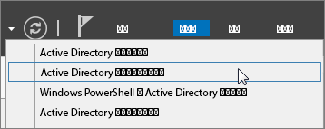

# <a name="prepare-a-non-routable-domain-for-directory-synchronization"></a>ディレクトリ同期のためのルーティング不可能なドメインを準備します。
Azure Active Directory で検証済みのドメインに存在する必要が Office 365 で、設置ディレクトリを同期するとします。のみ、ユーザー プリンシパル名 (UPN)、オンプレミス ドメインに関連付けられているが同期されます。ルーティング不可能なドメイン (billa@contoso.local) のようなローカルな例が含まれているすべての UPN を同期するただし、です。 (billa@contoso.onmicrosoft.com) のような onmicrosoft.com ドメインです。 

現在 Active Directory でユーザー アカウントにローカルなドメインを使用する場合、Office 365 ドメインに正しく同期するために (billa@contoso.com) のようなことを確認したドメインを使用するように変更することをお勧めします。
  
## <a name="what-if-i-only-have-a-local-on-premises-domain"></a>場合のみ .local オンプレミス ドメインがあるでしょうか。

Azure Active Directory、Active Directory を同期するために使用できる最新のツールを Azure AD 接続と呼びます。詳細については[、オンプレミス ユーザーは、Azure Active Directory との統合](https://go.microsoft.com/fwlink/p/?LinkId=624168)」を参照してください。
  
Azure AD 接続と同期化、ユーザーの UPN パスワード ユーザーが署名できるように、設置型を使用する同じ資格情報を使用しています。ただし、Azure AD 接続は、ユーザーが Office 365 によって検証されているドメインのみを同期します。つまり、ドメインも検証 Azure Active Directory で Office 365 の id は、Azure Active Directory によって管理されるためです。つまり、ドメインを有効なインターネット ドメイン (たとえば、.com、.org、.net、.us など) をある必要があります。内部の Active Directory は、ルーティング不可能なドメイン (たとえば、ローカルな) のみを使用する場合は、Office 365 にあることを確認したドメイン可能性があると一致ことはできません。Active Directory で、設置型には、プライマリ ドメインを変更するか、または 1 つまたは複数の UPN サフィックスを追加することによってこの問題を解決できます。
  
### <a name="change-your-primary-domain"></a>**プライマリ ドメインを変更します。**

プライマリ ドメインを Office 365 では、たとえば、contoso.com で確認したドメインに変更します。Contoso.com ドメイン contoso.local を持つすべてのユーザーが更新されます。手順については、[どのドメイン名変更のしくみ](https://go.microsoft.com/fwlink/p/?LinkId=624174)を参照してください。これは、非常に関連するプロセスでは、ただしと、簡単な解決法、[追加の UPN のサフィックスしユーザーがそれらを更新](prepare-a-non-routable-domain-for-directory-synchronization.md#bk_register)、次のセクションに示すようにします。
  
### <a name="add-upn-suffixes-and-update-your-users-to-them"></a>**UPN サフィックスを追加し、ユーザーを更新すること**

ローカルな問題を解決するドメイン (またはドメイン) に一致するように Active Directory に新しいユーザー プリンシパル名サフィックスやサフィックスを登録することでは、Office 365 のことを確認します。新しいサフィックスを登録した後は、ユーザーに置き換える、.local などの新しいドメイン名 billa@contoso.com のように、次のユーザー アカウントの Upn を更新します。
  
検証済みのドメインを使用する Upn を更新した後、Office 365 で、オンプレミスの Active Directory を同期する準備が完了しています。
  
 **手順 1: 新しい UPN サフィックスを追加します。**
  
1. [Active Directory ドメイン サービス (AD DS) を実行するサーバー、サーバー マネージャーで選択**ツール** \> **Active Directory ドメインと信頼関係**です。
    
    **または、Windows Server 2012 を持っていない場合**
    
    **実行**] ダイアログ ボックスを開き、表示、入力し、 **Windows キー + R**を押すし、[ **ok]** します。
    
    
  
2. **Active Directory ドメインと信頼関係**] ウィンドウで、[ **Active Directory ドメインと信頼関係**を右クリックし、[**プロパティ**。
    
    ![ActiveDirectory ドメインと信頼関係を右クリックし、[プロパティ] を選択](media/39d20812-ffb5-4ba9-8d7b-477377ac360d.png)
  
3. [ **UPN サフィックス**] タブ、[**代わりの UPN サフィックス**] ボックスに入力、新しい UPN サフィックスやサフィックス、および**追加**」を選択し、 \> **適用**します。
    
    
  
    サフィックスを追加する操作が完了したら、 **[ok]** を選択します。 
    
 **手順 2: 既存のユーザーの UPN サフィックスを変更します。**
  
1. [Active Directory ドメイン サービス (AD DS) を実行するサーバー、サーバー マネージャーで選択**ツール** \> **Active Directory Active Directory ユーザーとコンピューター**。
    
    **または、Windows Server 2012 を持っていない場合**
    
    **実行**] ダイアログ ボックスを開き、ファイルに入力するのには**Windows キー + R**を押すし、[ **OK** ] をクリックしてください
    
2. ユーザーを選択し、右クリック**プロパティ**] をクリックします。
    
3. [**アカウント**] タブの [UPN サフィックスのボックスの一覧で、新しい UPN サフィックスを選択し、[ **ok]** します。
    
    
  
4. すべてのユーザーに対してこれらの手順を完了します。
    
    更新プログラムを一括してまたは UPN サフィックスの[すべてのユーザーの UPN サフィックスを変更するのには Windows PowerShell を使用することもできます](prepare-a-non-routable-domain-for-directory-synchronization.md#BK_Posh)。
    
### <a name="you-can-also-use-windows-powershell-to-change-the-upn-suffix-for-all-users"></a>**すべてのユーザーの UPN サフィックスを変更するのには、Windows PowerShell を使用することもできます。**

多くのユーザを更新する場合は、Windows PowerShell を使用すると簡単です。次の使用例は、contoso.com にすべての contoso.local のサフィックスを変更するのには、 [Get ADUser](https://go.microsoft.com/fwlink/p/?LinkId=624312)と[セット ADUser](https://go.microsoft.com/fwlink/p/?LinkId=624313)コマンドレットを使用します。 

Contoso.com にすべての contoso.local のサフィックスを更新するのには、次の Windows PowerShell コマンドを実行します。
    
  ```
  $LocalUsers = Get-ADUser -Filter {UserPrincipalName -like '*contoso.local'} -Properties userPrincipalName -ResultSetSize $null
  ```

  ```
  $LocalUsers | foreach {$newUpn = $_.UserPrincipalName.Replace("contoso.local","contoso.com"); $_ | Set-ADUser -UserPrincipalName $newUpn}
  ```
Windows PowerShell を使用して Active Directory 内の詳細については、[作業中のディレクトリの Windows PowerShell モジュール](https://go.microsoft.com/fwlink/p/?LinkId=624314)を参照してください。 

