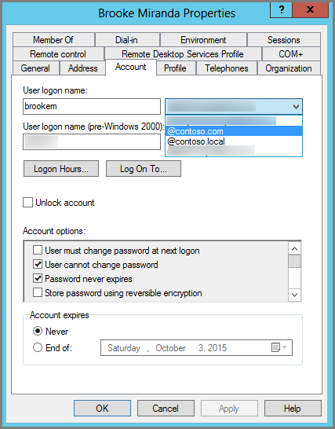

# <a name="prepare-a-non-routable-domain-for-directory-synchronization"></a>ディレクトリ同期のために非ルーティング ドメインの準備を整える
Office 365 とオンプレミス ディレクトリとの同期時には、Azure Active Directory 内に確認済みのドメインを用意する必要があります。オンプレミス ドメインに関連付けられたユーザー プリンシパル名 (UPN) のみが同期されます。ただし、.local などの非ルーティング ドメインが含まれている UPN (例: billa@contoso.local) は、.onmicrosoft.com ドメイン (例: billa@contoso.onmicrosoft.com) と同期されるようになります。 

現在、Active Directory 内のユーザー アカウントに .local ドメインを使用している場合は、Office 365 ドメインとの正しい同期のために、確認済みのドメイン (例: billa@contoso.com) を使用するようにユーザー アカウントを変更することをお勧めします。
  
## <a name="what-if-i-only-have-a-local-on-premises-domain"></a>オンプレミス ドメインが .local のみの場合について

Active Directory と Azure Active Directory の同期には、Azure AD Connect という最新のツールを使用できます。詳細については、「[オンプレミスの ID と Azure Active Directory を統合する](https://docs.microsoft.com/azure/architecture/reference-architectures/identity/azure-ad)」を参照してください。
  
Azure AD Connect では、ユーザーがオンプレミスで使用している資格情報と同じものを使用してサインイン可能になるように、ユーザーの UPN とパスワードを同期します。ただし、Azure AD Connect によるユーザーの同期は、Office 365 で確認済みのドメインのみを対象としています。Office 365 の ID は Azure Active Directory によって管理されるため、ドメインも Azure Active Directory によって確認されていることになります。つまり、ドメインは有効なインターネット ドメイン (com、.org、.net、.us など) であることが必要になります。内部の Active Directory が非ルーティング ドメイン (例: .local) のみを使用している場合は、そのドメインが Office 365 の確認済みドメインと一致する可能性はありません。この問題は、オンプレミスの Active Directory のプライマリ ドメインを変更するか、1 つ以上の UPN サフィックスを追加することで解決できます。
  
### <a name="change-your-primary-domain"></a>**プライマリ ドメインを変更する**

プライマリドメインを Office 365 で確認したドメイン (contoso.com など) に変更します。 ドメイン contoso. local を持つすべてのユーザーが contoso.com に更新されます。 手順については、「[ドメイン名の変更のしくみ](https://go.microsoft.com/fwlink/p/?LinkId=624174)」を参照してください。 ただし、これは非常に複雑なプロセスであり、次のセクションではより簡単な解決方法について説明します。
  
### <a name="add-upn-suffixes-and-update-your-users-to-them"></a>**UPN サフィックスを追加してユーザーを更新する**

.local の問題は、Office 365 で確認したドメインと一致する新しい UPN サフィックスを Active Directory に登録することで解決できます。新しいサフィックスの登録後に、ユーザー アカウントが billa@contoso.com のようになるように、.local を置換することでユーザー UPN を更新します。
  
確認済みのドメインを使用するように UPN を更新すると、オンプレミスの Active Directory を Office 365 と同期するための準備が整います。
  
 **手順 1: 新しい UPN サフィックスを追加する**
  
1. Active Directory ドメイン サービス (AD DS) を実行しているサーバーで、サーバー マネージャの **[ツール]** \> **[Active Directory ドメインと信頼関係]** を選択します。
    
    **または (Windows Server 2012 を所有していない場合)**
    
    **Windows キー + R** を押して **[実行]** ダイアログ開き、「Domain.msc」と入力してから **[OK]** を選択します。
    
    ![[Active Directory ドメインと信頼関係] を選択します。](media/46b6e007-9741-44af-8517-6f682e0ac974.png)
  
2. **[Active Directory ドメインと信頼関係]** ウィンドウで、**[Active Directory ドメインと信頼関係]** を右クリックして **[プロパティ]** を選択します。
    
    ![[Active Directory ドメインと信頼関係] を右クリックして [プロパティ] を選択します](media/39d20812-ffb5-4ba9-8d7b-477377ac360d.png)
  
3. **[UPN サフィックス]** タブの **[代替の UPN サフィックス]** ボックスに、新しいサフィックスを入力して **[追加]** \> **[適用]** を選択します。
    
    
  
    サフィックスの追加が完了したら、**[OK]** を選択します。 
    
 **手順 2: 既存のユーザーの UPN サフィックスを変更する**
  
1. Active Directory ドメイン サービス (AD DS) を実行しているサーバーで、サーバー マネージャの **[ツール]** \> **[Active Directory ユーザーとコンピューター]** を選択します。
    
    **または (Windows Server 2012 を所有していない場合)**
    
    **Windows キー + R** を押して **[実行]** ダイアログ開き、「Dsa.msc」と入力してから **[OK]** を選択します。
    
2. ユーザーを選択し、右クリックして **[プロパティ]** を選択します。
    
3. **[アカウント]** タブの UPN サフィックス ドロップダウン リストで、新しい UPN サフィックスを選択してから **[OK]** をクリックします。
    
    
  
4. すべてのユーザに対して、ここまでの手順を実行します。
    
   
### <a name="you-can-also-use-windows-powershell-to-change-the-upn-suffix-for-all-users"></a>**すべてのユーザーの UPN サフィックスを変更するために Windows PowerShell を使用する**

更新するユーザー数が大量になる場合は、Windows PowerShell を使用すると作業が簡単になります。次の例では、コマンドレット [Get-ADUser](https://go.microsoft.com/fwlink/p/?LinkId=624312) と [Set-ADUser](https://go.microsoft.com/fwlink/p/?LinkId=624313) を使用して、すべての contoso.local サフィックスを contoso.com に変更します。 

次の Windows PowerShell コマンドを実行すると、すべての contoso.local サフィックスが contoso.com に更新されます。
    
  ```powershell
  $LocalUsers = Get-ADUser -Filter {UserPrincipalName -like '*contoso.local'} -Properties userPrincipalName -ResultSetSize $null
  $LocalUsers | foreach {$newUpn = $_.UserPrincipalName.Replace("contoso.local","contoso.com"); $_ | Set-ADUser -UserPrincipalName $newUpn}
  ```

Active Directory の Windows PowerShell を使用する方法の詳細については、「[Active Directory Windows PowerShell モジュール](https://go.microsoft.com/fwlink/p/?LinkId=624314)」を参照してください。 

