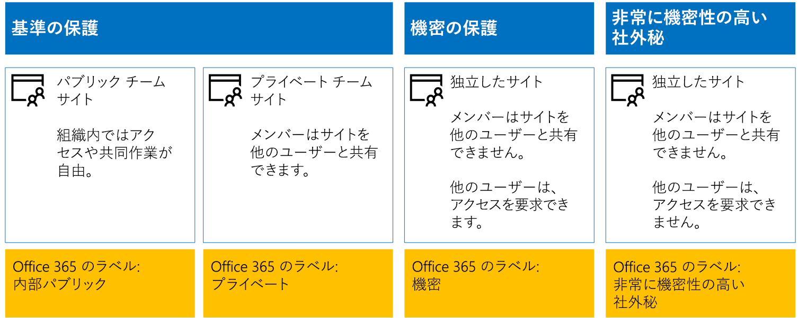
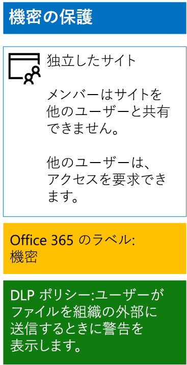
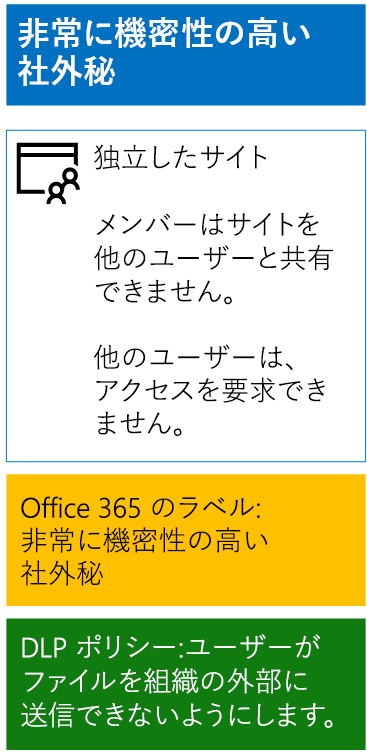

# <a name="protect-sharepoint-online-files-with-office-365-labels-and-dlp"></a><span data-ttu-id="37782-103">Office 365 のラベルと DLP の SharePoint Online のファイルを保護します。</span><span class="sxs-lookup"><span data-stu-id="37782-103">Protect SharePoint Online files with Office 365 labels and DLP</span></span>

 <span data-ttu-id="37782-104">**の概要:**Office 365 のラベルとデータ損失防止 (DLP) のポリシーをさまざまな情報保護レベルの SharePoint Online のチーム サイトに適用します。</span><span class="sxs-lookup"><span data-stu-id="37782-104">**Summary:** Apply Office 365 labels and data loss prevention (DLP) policies for SharePoint Online team sites with various levels of information protection.</span></span>
  
<span data-ttu-id="37782-p101">設計し、Office 365 のラベルと、基準計画と小文字が区別され、機密性の高いの SharePoint Online チーム サイト用の DLP ポリシーを展開するこの資料の手順を使用します。これら 3 つの層の保護の詳細については、 [SharePoint のオンラインのセキュリティで保護されたサイトとファイル](secure-sharepoint-online-sites-and-files.md)を参照してください。</span><span class="sxs-lookup"><span data-stu-id="37782-p101">Use the steps in this article to design and deploy Office 365 labels and DLP policies for baseline, sensitive, and highly confidential SharePoint Online team sites. For more information about these three tiers of protection, see [Secure SharePoint Online sites and files](secure-sharepoint-online-sites-and-files.md).</span></span>
  
## <a name="office-365-labels-for-your-sharepoint-online-sites"></a><span data-ttu-id="37782-107">SharePoint Online サイト用の Office 365 のラベル</span><span class="sxs-lookup"><span data-stu-id="37782-107">Office 365 labels for your SharePoint Online sites</span></span>

<span data-ttu-id="37782-108">Office 365 のラベルを作成し、SharePoint Online チーム サイトにラベルを割り当てるためのフェーズは 3 つあります。</span><span class="sxs-lookup"><span data-stu-id="37782-108">There are three phases to creating and then assigning Office 365 labels to SharePoint Online team sites.</span></span>
  
### <a name="phase-1-determine-the-office-365-label-names"></a><span data-ttu-id="37782-109">フェーズ 1:Office 365 のラベル名を決定する</span><span class="sxs-lookup"><span data-stu-id="37782-109">Phase 1: Determine the Office 365 label names</span></span>

<span data-ttu-id="37782-p102">このフェーズでは、SharePoint Online チーム サイトに適用される 4 つの情報保護レベル用に Office 365 のラベルの名前を決定します。以下の表に、レベルごとの推奨名を示します。</span><span class="sxs-lookup"><span data-stu-id="37782-p102">In this phase, you determine the names of your Office 365 labels for the four levels of information protection applied to SharePoint Online team sites. The following table lists the recommended names for each level.</span></span>
  
|<span data-ttu-id="37782-112">**オンラインの SharePoint チーム サイトの保護レベル**</span><span class="sxs-lookup"><span data-stu-id="37782-112">**SharePoint Online team site protection level**</span></span>|<span data-ttu-id="37782-113">**ラベル名**</span><span class="sxs-lookup"><span data-stu-id="37782-113">**Label name**</span></span>|
|:-----|:-----|
|<span data-ttu-id="37782-114">ベースライン - パブリック</span><span class="sxs-lookup"><span data-stu-id="37782-114">Baseline-Public</span></span>  <br/> |<span data-ttu-id="37782-115">内部パブリック</span><span class="sxs-lookup"><span data-stu-id="37782-115">Internal public</span></span>  <br/> |
|<span data-ttu-id="37782-116">ベースライン - プライベート</span><span class="sxs-lookup"><span data-stu-id="37782-116">Baseline-Private</span></span>  <br/> |<span data-ttu-id="37782-117">プライベート</span><span class="sxs-lookup"><span data-stu-id="37782-117">Private</span></span>  <br/> |
|<span data-ttu-id="37782-118">機密</span><span class="sxs-lookup"><span data-stu-id="37782-118">Sensitive</span></span>  <br/> |<span data-ttu-id="37782-119">機密</span><span class="sxs-lookup"><span data-stu-id="37782-119">Sensitive</span></span>  <br/> |
|<span data-ttu-id="37782-120">高機密</span><span class="sxs-lookup"><span data-stu-id="37782-120">Highly Confidential</span></span>  <br/> |<span data-ttu-id="37782-121">高機密</span><span class="sxs-lookup"><span data-stu-id="37782-121">Highly Confidential</span></span>  <br/> |
   
### <a name="phase-2-create-the-office-365-labels"></a><span data-ttu-id="37782-122">フェーズ 2: Office 365 のラベルを作成する</span><span class="sxs-lookup"><span data-stu-id="37782-122">Phase 2: Create the Office 365 labels</span></span>

<span data-ttu-id="37782-123">このフェーズでは、さまざまな情報保護レベルに対して決定したラベルを作成し発行します。</span><span class="sxs-lookup"><span data-stu-id="37782-123">In this phase, you create and then publish your determined labels for the different levels of information protection.</span></span>
  
<span data-ttu-id="37782-124">ラベルを作成するには、Office 365 管理センターまたは Microsoft PowerShell を使用できます。</span><span class="sxs-lookup"><span data-stu-id="37782-124">To create the labels, you can use the Office 365 Admin center or Microsoft PowerShell.</span></span>
  
### <a name="create-office-365-labels-with-the-office-365-admin-center"></a><span data-ttu-id="37782-125">Office 365 管理センターで Office 365 のラベルを作成する</span><span class="sxs-lookup"><span data-stu-id="37782-125">Create Office 365 labels with the Office 365 Admin center</span></span>

1. <span data-ttu-id="37782-p103">セキュリティ管理者または会社管理者のロールのアカウントを使用して、Office 365 ポータルにサインインします。ヘルプを表示するには、「[Office 365 にサインインする場所](https://support.office.com/Article/Where-to-sign-in-to-Office-365-e9eb7d51-5430-4929-91ab-6157c5a050b4)」を参照してください。</span><span class="sxs-lookup"><span data-stu-id="37782-p103">Sign in to the Office 365 portal with an account that has the Security Administrator or Company Administrator role. For help, see [Where to sign in to Office 365](https://support.office.com/Article/Where-to-sign-in-to-Office-365-e9eb7d51-5430-4929-91ab-6157c5a050b4).</span></span>
    
2. <span data-ttu-id="37782-128">**[Microsoft Office Home]** タブで、 **[管理者]** タイルをクリックします。</span><span class="sxs-lookup"><span data-stu-id="37782-128">From the **Microsoft Office Home** tab, click the **Admin** tile.</span></span>
    
3. <span data-ttu-id="37782-129">ブラウザーの新しい **[Office 管理者センター]** タブで、**[管理センター] > [セキュリティとコンプライアンス]** をクリックします。</span><span class="sxs-lookup"><span data-stu-id="37782-129">From the new **Office Admin center** tab of your browser, click **Admin centers > Security &amp; Compliance**.</span></span>
    
4. <span data-ttu-id="37782-130">ブラウザーの新しい **[ホーム – セキュリティとコンプライアンス]** タブをクリックして、**[分類] > [ラベル]** をクリックします。</span><span class="sxs-lookup"><span data-stu-id="37782-130">From the new **Home - Security &amp; Compliance** tab of your browser, click **Classifications > Labels**.</span></span>
    
5. <span data-ttu-id="37782-131">**[ホーム] > [ラベル]** ウィンドウで、 **[ラベルの作成]** をクリックします。</span><span class="sxs-lookup"><span data-stu-id="37782-131">From the **Home > Labels** pane, click **Create a label**.</span></span>
    
6. <span data-ttu-id="37782-132">[ウィンドウ] の**名前ラベル**、ラベルの名前を入力し、[**次へ**] をクリックします。</span><span class="sxs-lookup"><span data-stu-id="37782-132">On the **Name your label** pane, type the name of the label, and then click **Next**.</span></span>
    
7. <span data-ttu-id="37782-133">**[ラベル設定]** ウィンドウで、 **[次へ]** をクリックします。</span><span class="sxs-lookup"><span data-stu-id="37782-133">On the **Label settings** pane, click **Next**.</span></span>
    
8. <span data-ttu-id="37782-134">**[設定の確認]** ウィンドウで、 **[このラベルを作成する]** をクリックしてから **[閉じる]** をクリックします。</span><span class="sxs-lookup"><span data-stu-id="37782-134">On the **Review your settings** pane, click **Create this label**, and then click **Close**.</span></span>
    
9. <span data-ttu-id="37782-135">追加ラベルについて手順 5 から 8 を繰り返します。</span><span class="sxs-lookup"><span data-stu-id="37782-135">Repeat steps 5-8 for your additional labels.</span></span>
    
### <a name="create-office-365-labels-with-powershell"></a><span data-ttu-id="37782-136">PowerShell で Office 365 のラベルを作成する</span><span class="sxs-lookup"><span data-stu-id="37782-136">Create Office 365 labels with PowerShell</span></span>

1. <span data-ttu-id="37782-137">[Office 365 のセキュリティへの接続&amp;リモート PowerShell を使用してコンプライアンス センター](http://go.microsoft.com/fwlink/?LinkID=799771&amp;clcid=0x409)のセキュリティ管理者や企業の管理者の役割を持つアカウントの資格情報を指定します。</span><span class="sxs-lookup"><span data-stu-id="37782-137">[Connect to the Office 365 Security &amp; Compliance Center using remote PowerShell](http://go.microsoft.com/fwlink/?LinkID=799771&amp;clcid=0x409) and specify the credentials of an account that has the Security Administrator or Company Administrator role.</span></span>
    
2. <span data-ttu-id="37782-138">ラベル名をリストに記入し、PowerShell コマンド プロンプトで次のコマンドを実行します。</span><span class="sxs-lookup"><span data-stu-id="37782-138">Fill out the list of label names, and then run these commands at the PowerShell command prompt:</span></span>
    
  ```
  $labelNames=@(<list of label names, each enclosed in quotes and separated by commas>)
ForEach ($element in $labelNames){ New-ComplianceTag -Name $element }
  ```

<span data-ttu-id="37782-139">次に、次の手順を使用して新しい Office 365 のラベルを発行します。</span><span class="sxs-lookup"><span data-stu-id="37782-139">Next, use these steps to publish the new Office 365 labels.</span></span>
  
1. <span data-ttu-id="37782-140">**ホーム > ラベル**ウィンドウ セキュリティ&amp;コンプライアンス センターでは、**ラベルの発行**] をクリックします。</span><span class="sxs-lookup"><span data-stu-id="37782-140">From the **Home > Labels** pane the Security &amp; Compliance Center, click **Publish labels**.</span></span>
    
2. <span data-ttu-id="37782-141">**[発行するラベルを選択]** ウィンドウで、 **[発行するラベルを選択]** をクリックします。</span><span class="sxs-lookup"><span data-stu-id="37782-141">On the **Choose labels to publish** pane, click **Choose labels to publish**.</span></span>
    
3. <span data-ttu-id="37782-142">**[Choose labels]\(ラベルの選択\)** ウィンドウで、**[追加]** をクリックして 4 つのラベルをすべて選択します。</span><span class="sxs-lookup"><span data-stu-id="37782-142">On the **Choose labels** pane, click **Add** and select all four labels.</span></span>
    
4. <span data-ttu-id="37782-143">[ **完了**] をクリックします。</span><span class="sxs-lookup"><span data-stu-id="37782-143">Click **Done**.</span></span>
    
5. <span data-ttu-id="37782-144">**[発行するラベルを選択]** ウィンドウで、 **[次へ]** をクリックします。</span><span class="sxs-lookup"><span data-stu-id="37782-144">On the **Choose labels to publish** pane, click **Next**.</span></span>
    
6. <span data-ttu-id="37782-145">**[場所の選択]** ウィンドウで、 **[次へ]** をクリックします。</span><span class="sxs-lookup"><span data-stu-id="37782-145">On the **Choose locations** pane, click **Next**.</span></span>
    
7. <span data-ttu-id="37782-146">[ウィンドウ]**のポリシーの名前****名**] で、ラベルのセットの名前を入力し、[**次へ**] をクリックします。</span><span class="sxs-lookup"><span data-stu-id="37782-146">On the **Name your policy** pane, type a name for your set of labels in **Name**, and then click **Next**.</span></span>
    
8. <span data-ttu-id="37782-147">**[設定の確認]** ウィンドウで、 **[ラベルの発行]** をクリックしてから **[閉じる]** をクリックします。</span><span class="sxs-lookup"><span data-stu-id="37782-147">On the **Review your settings** pane, click **Publish labels**, and then click **Close**.</span></span>
    
### <a name="phase-3-apply-the-office-365-labels-to-your-sharepoint-online-sites"></a><span data-ttu-id="37782-148">フェーズ 3:Office 365 のラベルを SharePoint Online サイトに適用する </span><span class="sxs-lookup"><span data-stu-id="37782-148">Phase 3: Apply the Office 365 labels to your SharePoint Online sites</span></span>

<span data-ttu-id="37782-149">次の手順を使用して、Office 365 のラベルを SharePoint Online チーム サイトのドキュメント フォルダーに適用します。</span><span class="sxs-lookup"><span data-stu-id="37782-149">Use these steps to apply the Office 365 labels to the documents folders of your SharePoint Online team sites.</span></span>
  
1. <span data-ttu-id="37782-150">お使いのブラウザーの [ **Microsoft Office のホーム**] タブからは、 **SharePoint**のタイルをクリックします。</span><span class="sxs-lookup"><span data-stu-id="37782-150">From the **Microsoft Office Home** tab of your browser, click the **SharePoint** tile.</span></span>
    
2. <span data-ttu-id="37782-151">お使いのブラウザーで新しい**SharePoint** ] タブで、Office 365 ラベルが割り当てられている必要があるサイトをクリックします。</span><span class="sxs-lookup"><span data-stu-id="37782-151">On the new **SharePoint** tab in your browser, click a site that needs an Office 365 label assigned.</span></span>
    
3. <span data-ttu-id="37782-152">お使いのブラウザーの新しい SharePoint サイト] タブ、[**ドキュメント**] をクリックします。</span><span class="sxs-lookup"><span data-stu-id="37782-152">In the new SharePoint site tab of your browser, click **Documents**.</span></span>
    
4. <span data-ttu-id="37782-153">[設定] アイコンをクリックしてから、 **[ライブラリの設定]** をクリックします。</span><span class="sxs-lookup"><span data-stu-id="37782-153">Click the settings icon, and then click **Library settings**.</span></span>
    
5. <span data-ttu-id="37782-154">**[権限と管理]** をクリックして、 **[このライブラリ内の項目にラベルを適用]** をクリックします。</span><span class="sxs-lookup"><span data-stu-id="37782-154">Under **Permissions and Management**, click **Apply label to items in this library**.</span></span>
    
6. <span data-ttu-id="37782-155">**ラベルの設定の適用**] で、適切なラベルを選択し、し、[**保存**] をクリックします。</span><span class="sxs-lookup"><span data-stu-id="37782-155">In **Settings-Apply Label**, select the appropriate label, and then click **Save**.</span></span>
    
7. <span data-ttu-id="37782-156">SharePoint Online サイトのタブを閉じます。</span><span class="sxs-lookup"><span data-stu-id="37782-156">Close the tab for the SharePoint Online site.</span></span>
    
8. <span data-ttu-id="37782-157">Office 365 のラベルをさらに SharePoint Online サイトに割り当てるには、手順 3 から 8 を繰り返します。</span><span class="sxs-lookup"><span data-stu-id="37782-157">Repeat steps 3-8 to assign Office 365 labels to your additional SharePoint Online sites.</span></span>
    
<span data-ttu-id="37782-158">最終的な構成をここに示します。</span><span class="sxs-lookup"><span data-stu-id="37782-158">Here is your resulting configuration.</span></span>
  

  
## <a name="dlp-policies-for-your-sharepoint-online-sites"></a><span data-ttu-id="37782-160">SharePoint Online サイト用の DLP ポリシー</span><span class="sxs-lookup"><span data-stu-id="37782-160">DLP policies for your SharePoint Online sites</span></span>

<span data-ttu-id="37782-161">組織外の SharePoint Online の機密性の高いチーム サイト上のドキュメントを共有する場合にユーザーに通知する DLP ポリシーを構成するのには次の手順を使用します。</span><span class="sxs-lookup"><span data-stu-id="37782-161">Use these steps to configure a DLP policy that notifies users when they share a document on a SharePoint Online sensitive team site outside the organization.</span></span>
  
1. <span data-ttu-id="37782-162">ブラウザーの **[Microsoft Office Home]** タブで、**[セキュリティとコンプライアンス]** タイルをクリックします。</span><span class="sxs-lookup"><span data-stu-id="37782-162">From the **Microsoft Office Home** tab in your browser, click the **Security &amp; Compliance** tile.</span></span>
    
2. <span data-ttu-id="37782-163">ブラウザーの新しい **[セキュリティとコンプライアンス]** タブで、**[データ損失防止] > [ポリシー]** をクリックします。</span><span class="sxs-lookup"><span data-stu-id="37782-163">On the new **Security &amp; Compliance** tab in your browser, click **Data loss prevention > Policy**.</span></span>
    
3. <span data-ttu-id="37782-164">**[データ損失防止]** ウィンドウで、 **[+ ポリシーの作成]** をクリックします。</span><span class="sxs-lookup"><span data-stu-id="37782-164">In the **Data loss prevention** pane, click **+ Create a policy**.</span></span>
    
4. <span data-ttu-id="37782-165">**[テンプレートを使って開始するか、カスタム ポリシーを作成する]** ウィンドウで、 **[カスタム]** をクリックしてから、 **[次へ]** をクリックします。</span><span class="sxs-lookup"><span data-stu-id="37782-165">In the **Start with a template or create a custom policy** pane, click **Custom**, and then click **Next**.</span></span>
    
5. <span data-ttu-id="37782-166">**名ポリシー**ウィンドウで、[**名**] に、機密性の高いレベルの DLP ポリシーの名前を入力し、[**次へ**] をクリックします。</span><span class="sxs-lookup"><span data-stu-id="37782-166">In the **Name your policy** pane, type the name for the sensitive level DLP policy in **Name**, and then click **Next**.</span></span>
    
6. <span data-ttu-id="37782-167">**[場所の選択]** ウィンドウで、 **[自分で特定の場所を選択する]** をクリックしてから、 **[次へ]** をクリックします。</span><span class="sxs-lookup"><span data-stu-id="37782-167">In the **Choose locations** pane, click **Let me choose specific locations**, and then click **Next**.</span></span>
    
7. <span data-ttu-id="37782-168">場所の一覧で、 **Exchange メール**と **OneDrive アカウント**の場所を無効にし、 **[次へ]** をクリックします。</span><span class="sxs-lookup"><span data-stu-id="37782-168">In the list of locations, disable the **Exchange email** and **OneDrive accounts** locations, and then click **Next**.</span></span>
    
8. <span data-ttu-id="37782-169">**[保護する機密性の高い情報の種類をカスタマイズする]** ウィンドウで、 **[編集]** をクリックします。</span><span class="sxs-lookup"><span data-stu-id="37782-169">In the **Customize the types of sensitive info you want to protect** pane, click **Edit**.</span></span>
    
9. <span data-ttu-id="37782-170">**[保護するコンテンツの種類を選択する]** ウィンドウのドロップダウン ボックスで **[追加]** をクリックしてから、 **[ラベル]** をクリックします。</span><span class="sxs-lookup"><span data-stu-id="37782-170">In the **Choose the types of content to protect** pane, click **Add** in the drop-down box, and then click **Labels**.</span></span>
    
10. <span data-ttu-id="37782-171">**[ラベル]** ウィンドウで、 **[+ 追加]** をクリックして、 **[機密]** ラベルを選択し、 **[追加]** をクリックしてから、 **[完了]** をクリックします。</span><span class="sxs-lookup"><span data-stu-id="37782-171">In the **Labels** pane, click **+ Add**, select the **Sensitive** label, click **Add**, and then click **Done**.</span></span>
    
11. <span data-ttu-id="37782-172">**[保護するコンテンツの種類を選択する]** ウィンドウで、 **[保存]** をクリックします。</span><span class="sxs-lookup"><span data-stu-id="37782-172">In the **Choose the types of content to protect** pane, click **Save**.</span></span>
    
12. <span data-ttu-id="37782-173">**[Customize the types of sensitive info you want to protect]\(保護する機密情報の種類のカスタマイズ\)** ウィンドウで、**[次へ]** をクリックします。</span><span class="sxs-lookup"><span data-stu-id="37782-173">In the **Customize the types of sensitive info you want to protect** pane, click **Next**.</span></span>
    
13. <span data-ttu-id="37782-174">**[What do you want to do if we detect sensitive info?]\(機密情報が検出された場合の処理\)** ウィンドウで、**[Customize the tip and email]\(ヒントと電子メールをカスタマイズする)** をクリックします。</span><span class="sxs-lookup"><span data-stu-id="37782-174">In the **What do you want to do if we detect sensitive info?** pane, click **Customize the tip and email**.</span></span>
    
14. <span data-ttu-id="37782-175">**[Customize policy tips and email notifications]\(ポリシー ヒントと電子メール通知のカスタマイズ\)** ウィンドウで、**[Customize the policy tip text]\(ポリシー ヒントのテキストをカスタマイズする\)** をクリックします。</span><span class="sxs-lookup"><span data-stu-id="37782-175">In the **Customize policy tips and email notifications** pane, click **Customize the policy tip text**.</span></span>
    
15. <span data-ttu-id="37782-176">次の内容をテキスト ボックスに入力するか、貼り付けます。</span><span class="sxs-lookup"><span data-stu-id="37782-176">In the text box, type or paste in the following:</span></span>
    
  - <span data-ttu-id="37782-p104">組織外のユーザーと共有するには、ファイルをダウンロードしてから開きます。[ファイル]、[文書の保護]、[パスワードを使用して暗号化] の順にクリックし、強力なパスワードを指定します。別の電子メールまたはその他の通信手段でパスワードを送信します。</span><span class="sxs-lookup"><span data-stu-id="37782-p104">To share with a user outside the organization, download the file and then open it. Click File, then Protect Document, and then Encrypt with Password, and then specify a strong password. Send the password in a separate email or other means of communication.</span></span>
    
    <span data-ttu-id="37782-180">あるいは、ファイルを共有する方法について組織外のユーザーに指示する独自のポリシー ヒントを入力するか、貼り付けます。</span><span class="sxs-lookup"><span data-stu-id="37782-180">Alternately, type or paste in your own policy tip that instructs users on how to share a file outside your organization.</span></span>
    
16. <span data-ttu-id="37782-181">**[OK]** をクリックします。</span><span class="sxs-lookup"><span data-stu-id="37782-181">Click **OK**.</span></span>
    
17. <span data-ttu-id="37782-182">**[機密性の高い情報が検出された場合に実行する操作]** ウィンドウで、 **[ユーザーが共有できないようにし、共有コンテンツへのアクセスを制限する]** チェックボックスをクリアしてから、 **[次へ]** をクリックします。</span><span class="sxs-lookup"><span data-stu-id="37782-182">In the **What do you want to do if we detect sensitive info?** pane, clear the **Block people from sharing, and restrict access to shared content** check box, and then click **Next**.</span></span>
    
18. <span data-ttu-id="37782-183">**[ポリシーを有効にしますか、または最初にテストしますか?]** ウィンドウで、 **[すぐ有効にします]** をクリックし、 **[次へ]** をクリックします。</span><span class="sxs-lookup"><span data-stu-id="37782-183">In the **Do you want to turn on the policy or test things out first?** pane, click **Yes, turn it on right away**, and then click **Next**.</span></span>
    
19. <span data-ttu-id="37782-184">**[設定の確認]** ウィンドウで、 **[作成]** をクリックしてから **[閉じる]** をクリックします。</span><span class="sxs-lookup"><span data-stu-id="37782-184">In the **Review your settings** pane, click **Create**, and then click **Close**.</span></span>
    
<span data-ttu-id="37782-185">機密 SharePoint Online チーム サイトの最終的な構成をここに示します。</span><span class="sxs-lookup"><span data-stu-id="37782-185">Here is your resulting configuration for sensitive SharePoint Online team sites.</span></span>
  

  
<span data-ttu-id="37782-187">次に、これらの手順を使用して、高機密 SharePoint Online チーム サイトのドキュメントを組織外と共有したときにユーザーをブロックする DLP ポリシーを構成します。</span><span class="sxs-lookup"><span data-stu-id="37782-187">Next, use these steps to configure a DLP policy that blocks users when they share a document on a SharePoint Online highly confidential team site outside the organization.</span></span>
  
1. <span data-ttu-id="37782-188">ブラウザーの **[Microsoft Office Home]** タブで、**[セキュリティとコンプライアンス]** タイルをクリックします。</span><span class="sxs-lookup"><span data-stu-id="37782-188">From the **Microsoft Office Home** tab in your browser, click the **Security &amp; Compliance** tile.</span></span>
    
2. <span data-ttu-id="37782-189">ブラウザーの新しい **[セキュリティとコンプライアンス]** タブで、**[データ損失防止] > [ポリシー]** をクリックします。</span><span class="sxs-lookup"><span data-stu-id="37782-189">On the new **Security &amp; Compliance** tab in your browser, click **Data loss prevention > Policy**.</span></span>
    
3. <span data-ttu-id="37782-190">**[データ損失防止]** ウィンドウで、 **[+ ポリシーの作成]** をクリックします。</span><span class="sxs-lookup"><span data-stu-id="37782-190">In the **Data loss prevention** pane, click **+ Create a policy**.</span></span>
    
4. <span data-ttu-id="37782-191">**[テンプレートを使って開始するか、カスタム ポリシーを作成する]** ウィンドウで、 **[カスタム]** をクリックしてから、 **[次へ]** をクリックします。</span><span class="sxs-lookup"><span data-stu-id="37782-191">In the **Start with a template or create a custom policy** pane, click **Custom**, and then click **Next**.</span></span>
    
5. <span data-ttu-id="37782-192">**名ポリシー**ウィンドウで、[**名**] に、機密性の高いレベルの DLP ポリシーの名前を入力し、[**次へ**] をクリックします。</span><span class="sxs-lookup"><span data-stu-id="37782-192">In the **Name your policy** pane, type the name for the highly sensitive level DLP policy in **Name**, and then click **Next**.</span></span>
    
6. <span data-ttu-id="37782-193">**[場所の選択]** ウィンドウで、 **[自分で特定の場所を選択する]** をクリックしてから、 **[次へ]** をクリックします。</span><span class="sxs-lookup"><span data-stu-id="37782-193">In the **Choose locations** pane, click **Let me choose specific locations**, and then click **Next**.</span></span>
    
7. <span data-ttu-id="37782-194">場所の一覧で、 **Exchange メール**と **OneDrive アカウント**の場所を無効にし、 **[次へ]** をクリックします。</span><span class="sxs-lookup"><span data-stu-id="37782-194">In the list of locations, disable the **Exchange email** and **OneDrive accounts** locations, and then click **Next**.</span></span>
    
8. <span data-ttu-id="37782-195">**[保護する機密性の高い情報の種類をカスタマイズする]** ウィンドウで、 **[編集]** をクリックします。</span><span class="sxs-lookup"><span data-stu-id="37782-195">In the **Customize the types of sensitive info you want to protect** pane, click **Edit**.</span></span>
    
9. <span data-ttu-id="37782-196">**[保護するコンテンツの種類を選択する]** ウィンドウのドロップダウン ボックスで **[追加]** をクリックしてから、 **[ラベル]** をクリックします。</span><span class="sxs-lookup"><span data-stu-id="37782-196">In the **Choose the types of content to protect** pane, click **Add** in the drop-down box, and then click **Labels**.</span></span>
    
10. <span data-ttu-id="37782-197">**[ラベル]** ウィンドウで、 **[+ 追加]** をクリックして、 **[高機密]** ラベルを選択し、 **[追加]** をクリックしてから、 **[完了]** をクリックします。</span><span class="sxs-lookup"><span data-stu-id="37782-197">In the **Labels** pane, click **+ Add**, select the **Highly Confidential** label, click **Add**, and then click **Done**.</span></span>
    
11. <span data-ttu-id="37782-198">**[保護するコンテンツの種類を選択する]** ウィンドウで、 **[保存]** をクリックします。</span><span class="sxs-lookup"><span data-stu-id="37782-198">In the **Choose the types of content to protect** pane, click **Save**.</span></span>
    
12. <span data-ttu-id="37782-199">**[Customize the types of sensitive info you want to protect]\(保護する機密情報の種類のカスタマイズ\)** ウィンドウで、**[次へ]** をクリックします。</span><span class="sxs-lookup"><span data-stu-id="37782-199">In the **Customize the types of sensitive info you want to protect** pane, click **Next**.</span></span>
    
13. <span data-ttu-id="37782-200">**[What do you want to do if we detect sensitive info?]\(機密情報が検出された場合の処理\)** ウィンドウで、**[Customize the tip and email]\(ヒントと電子メールをカスタマイズする)** をクリックします。</span><span class="sxs-lookup"><span data-stu-id="37782-200">In the **What do you want to do if we detect sensitive info?** pane, click **Customize the tip and email**.</span></span>
    
14. <span data-ttu-id="37782-201">**[Customize policy tips and email notifications]\(ポリシー ヒントと電子メール通知のカスタマイズ\)** ウィンドウで、**[Customize the policy tip text]\(ポリシー ヒントのテキストをカスタマイズする\)** をクリックします。</span><span class="sxs-lookup"><span data-stu-id="37782-201">In the **Customize policy tips and email notifications** pane, click **Customize the policy tip text**.</span></span>
    
15. <span data-ttu-id="37782-202">次の内容をテキスト ボックスに入力するか、貼り付けます。</span><span class="sxs-lookup"><span data-stu-id="37782-202">In the text box, type or paste in the following:</span></span>
    
  - <span data-ttu-id="37782-p105">組織外のユーザーと共有するには、ファイルをダウンロードしてから開きます。[ファイル]、[文書の保護]、[パスワードを使用して暗号化] の順にクリックし、強力なパスワードを指定します。別の電子メールまたはその他の通信手段でパスワードを送信します。</span><span class="sxs-lookup"><span data-stu-id="37782-p105">To share with a user outside the organization, download the file and then open it. Click File, then Protect Document, and then Encrypt with Password, and then specify a strong password. Send the password in a separate email or other means of communication.</span></span>
    
    <span data-ttu-id="37782-206">あるいは、ファイルを共有する方法について組織外のユーザーに指示する独自のポリシー ヒントを入力するか、貼り付けます。</span><span class="sxs-lookup"><span data-stu-id="37782-206">Alternately, type or paste in your own policy tip that instructs users on how to share a file outside your organization.</span></span>
    
16. <span data-ttu-id="37782-207">**[OK]** をクリックします。</span><span class="sxs-lookup"><span data-stu-id="37782-207">Click **OK**.</span></span>
    
17. <span data-ttu-id="37782-208">**[機密性の高い情報が検出された場合に実行する操作]** ウィンドウで、 **[業務の妥当性を要求してオーバーライドする]** をクリックしてから、 **[次へ]** をクリックします。</span><span class="sxs-lookup"><span data-stu-id="37782-208">In the **What do you want to do if we detect sensitive info?** pane, select **Require a business justification to override**, and then click **Next**.</span></span>
    
18. <span data-ttu-id="37782-209">**[ポリシーを有効にしますか、または最初にテストしますか?]** ウィンドウで、 **[すぐ有効にします]** をクリックし、 **[次へ]** をクリックします。</span><span class="sxs-lookup"><span data-stu-id="37782-209">In the **Do you want to turn on the policy or test things out first?** pane, click **Yes, turn it on right away**, and then click **Next**.</span></span>
    
19. <span data-ttu-id="37782-210">**[設定の確認]** ウィンドウで、 **[作成]** をクリックしてから **[閉じる]** をクリックします。</span><span class="sxs-lookup"><span data-stu-id="37782-210">In the **Review your settings** pane, click **Create**, and then click **Close**.</span></span>
    
<span data-ttu-id="37782-211">高機密 SharePoint Online チーム サイトの最終的な構成をここに示します。</span><span class="sxs-lookup"><span data-stu-id="37782-211">Here is your resulting configuration for high confidentiality SharePoint Online team sites.</span></span>
  

  
## <a name="next-step"></a><span data-ttu-id="37782-213">次の手順</span><span class="sxs-lookup"><span data-stu-id="37782-213">Next step</span></span>

[<span data-ttu-id="37782-214">Azure の情報保護と SharePoint のオンラインのファイルを保護します。</span><span class="sxs-lookup"><span data-stu-id="37782-214">Protect SharePoint Online files with Azure Information Protection</span></span>](protect-sharepoint-online-files-with-azure-information-protection.md)
    
## <a name="see-also"></a><span data-ttu-id="37782-215">関連項目</span><span class="sxs-lookup"><span data-stu-id="37782-215">See Also</span></span>

[<span data-ttu-id="37782-216">SharePoint Online サイトとファイルをセキュリティで保護する</span><span class="sxs-lookup"><span data-stu-id="37782-216">Secure SharePoint Online sites and files</span></span>](secure-sharepoint-online-sites-and-files.md)
  
[<span data-ttu-id="37782-217">開発/テスト環境の SharePoint Online サイトをセキュリティで保護する</span><span class="sxs-lookup"><span data-stu-id="37782-217">Secure SharePoint Online sites in a dev/test environment</span></span>](secure-sharepoint-online-sites-in-a-dev-test-environment.md)
  
[<span data-ttu-id="37782-218">選挙運動、非営利組織、およびその他のアジャイル組織のための Microsoft Security ガイダンス</span><span class="sxs-lookup"><span data-stu-id="37782-218">Microsoft Security Guidance for Political Campaigns, Nonprofits, and Other Agile Organizations</span></span>](microsoft-security-guidance-for-political-campaigns-nonprofits-and-other-agile-o.md)
  
[<span data-ttu-id="37782-219">クラウド導入およびハイブリッド ソリューション</span><span class="sxs-lookup"><span data-stu-id="37782-219">Cloud adoption and hybrid solutions</span></span>](cloud-adoption-and-hybrid-solutions.md)


