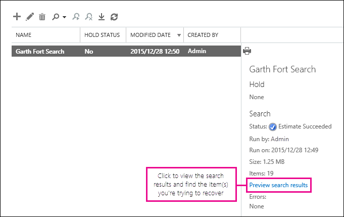
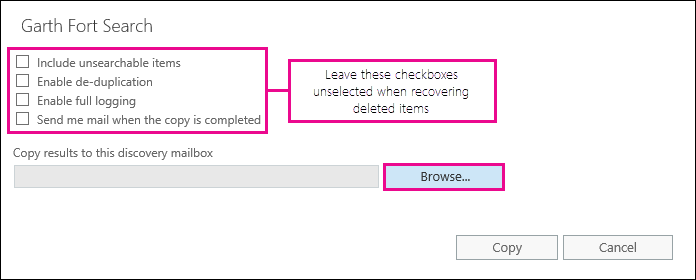

# ユーザーのメールボックスで削除済みアイテムを復元する - 管理者ヘルプRecover deleted items in a user mailbox - Admin Help

管理者はこの資料では**です。自分のメールボックス内の削除済みアイテムを回復しようとしますか?** 次のいずれかの操作を行います。**This article is for administrators. Are you trying to recover deleted items in your own mailbox?** Try one of the following:
- [Windows 版 Outlook で削除済みのアイテムを復元するRecover deleted items in Outlook for Windows](https://support.office.com/article/49e81f3c-c8f4-4426-a0b9-c0fd751d48ce)
- [Outlook Web App で削除済みのアイテムやメールを復元するRecover deleted items or email in Outlook Web App](https://support.office.com/article/c3d8fc15-eeef-4f1c-81df-e27964b7edd4)
- [Web 上の Outlook で削除された電子メール メッセージを復元します。Restore deleted email messages in Outlook on the web](https://support.office.com/article/a8ca78ac-4721-4066-95dd-571842e9fb11)
- [Outlook.comOutlook.com](https://go.microsoft.com/fwlink/p/?LinkID=623435)
   
でしたユーザーは、Outlook のユーザーのメールボックスからアイテムを完全に削除しますか。ユーザーに戻るがそれらを回復することはできません。できる場合がありますユーザーのメールボックスから完全に削除されていない場合は、パージ済みのアイテムを復元します。削除された電子メールやその他の項目を検索するのには、Exchange Online で埋め込み電子的証拠開示ツールを使用してこれを行う-連絡先、予定表の予定、仕事など、ユーザーのメールボックスに。削除済みアイテムを検索する場合は、PST ファイル (Outlook データ ファイルとも呼ばれます)、自分のメールボックスにアイテムを復元するユーザーを使用してにエクスポートできます。Did a user permanently delete items from their Outlook mailbox? The user wants them back but can't recover them. You may be able recover the purged items if they haven't been permanently removed from the user's mailbox. You do this by using the In-Place eDiscovery tool in Exchange Online to search for deleted email and other items—and such as contacts, calendar appointments, and tasks—in a user's mailbox. If you find the deleted items, you can export them to a PST file (also called an Outlook Data File), which the user can then use to restore the items back to their mailbox.
  
ユーザーのメールボックスの削除済みアイテムを回復するための手順を次に示します。これにかかるでしょうか。初めてすべてをリカバリしようとしている項目の数に応じて、手順を完了する 20 分をかかる場合があります。Here are the steps for recovering deleted items in a user's mailbox. How long will this take? The first time might take 20 or 30 minutes to complete all the steps, depending on how many items you're trying to recover.
  
> [!NOTE]
> **Exchange 管理者**または Office 365 の**管理者がグローバル**や組織の管理役割グループのメンバーで Exchange をオンラインでこの資料の手順を実行する必要があります。詳細については、 [Office 365 の管理者の役割](https://support.office.com/article/da585eea-f576-4f55-a1e0-87090b6aaa9d)を参照してください。You have to be an **Exchange administrator** or **Global administrator** in Office 365 or be a member of the Organization Management role group in Exchange Online to perform the steps in this article. For more information, see [About Office 365 admin roles](https://support.office.com/article/da585eea-f576-4f55-a1e0-87090b6aaa9d). 
  
## 手順 1: 自分で電子的証拠開示アクセス許可を割り当てください。Step 1: Assign yourself eDiscovery permissions

最初のステップは、自分で必要なアクセス許可を割り当てる Exchange オンライン埋め込み eDiscovery ツールを使用するにはユーザーのメールボックスを検索するためです。これを行う 1 回だけがあります。ある場合は、将来的に別のメールボックスを検索するのには、この手順は省略できます。The first step is to assign yourself the necessary permissions in Exchange Online so you can use the In-Place eDiscovery tool to search a user's mailbox. You only have to do this once. If you have to search another mailbox in the future, you can skip this step.
  
1. 職場、学校のアカウントを使用して[ビジネス向けの Office 365 にサインインするための場所](https://support.office.com/article/e9eb7d51-5430-4929-91ab-6157c5a050b4)にします。[Where to sign in to Office 365 for business](https://support.office.com/article/e9eb7d51-5430-4929-91ab-6157c5a050b4) with your work or school account. 
    
2. アプリケーション ランチャー アイコンを選択左上隅の**管理**] をクリックします。Select the app launcher icon  in the upper-left and click **Admin**.
    
3. Office 365 の管理ページの左側のナビゲーションでは、**管理センター**を展開し、し、[ **Exchange**] をクリックします。In the left navigation in the Office 365 admin center, expand **Admin centers**, and then click **Exchange**.
    
    
  
4. Exchange 管理センターで、**アクセス許可**] をクリックし、**管理者ロール**] をクリックします。In the Exchange admin center, click **Permissions**, and then click **Admin roles**.
    
5. リスト ビューをクリックし、[**検出の管理**] を選択し、[**編集**] をクリックして![[編集] アイコン](media/ebd260e4-3556-4fb0-b0bb-cc489773042c.gif)。In the list view, select **Discovery Management**, and then click **Edit**.
    
    
  
6. **役割グループ**の**メンバー**、[**追加**] をクリックして。In **Role Group**, under **Members**, click **Add**.
    
7. **メンバーの選択**] ボックスで自分で名前の一覧から選択を選択し、**追加**] をクリックし、[ **OK**] をクリックします。In **Select Members**, select yourself from the list of names, click **Add**, and then click **OK**.
    
    > [!NOTE]
    > 組織の管理や TenantAdmins などのメンバーを使用しているグループを追加することもできます。グループを追加する場合、グループの他のメンバーには、埋め込み eDiscovery ツールを実行するために必要なアクセス許可が割り当てられます。You can also add a group that you are a member of, such as Organization Management or TenantAdmins. If you add a group, other members of the group will be assigned the necessary permissions to run the In-Place eDiscovery tool. 
  
8. **[役割グループ]** で、**[保存]** をクリックします。In **Role Group**, click **Save**.
    
9. Office 365 からサインアウトします。Sign out of Office 365.
    
    新しいアクセス許可が有効になりますので、次の手順を開始する前に、サインアウトする必要があります。You have to sign out before you start the next step so the new permissions will take effect.
    
> [!CAUTION]
> 探索管理役割グループのメンバーは、メッセージの機密性の高いコンテンツにアクセスできます。これは、組織内のすべてのメールボックスを検索、検索結果などの他のメールボックス アイテムをプレビューする、検出メールボックスに結果をコピー、検索結果をエクスポートする PST ファイルに含まれています。Members of the Discovery Management role group can access sensitive message content. This includes searching all mailboxes in your organization, previewing the search results (and other mailbox items), copying the results to a discovery mailbox, and exporting the search results to a PST file. 
  
[Return to topReturn to top](recover-deleted-items-in-a-mailbox.md#__top)
  
## 手順 2: 削除済みアイテムをユーザーのメールボックスを検索します。Step 2: Search the user's mailbox for deleted items

埋め込みの電子的証拠開示検索を実行すると検索に検索するメールボックスの回復可能な項目のフォルダーが自動的に含まれます。[回復可能なアイテム] フォルダーでは、完全に削除済みアイテムが保存されている (完全に削除) が削除されるまで、メールボックスからです。項目を削除していない場合は、埋め込み電子的証拠開示のツールを使用して見つけることできます。When you run an In-Place eDiscovery search, the Recoverable Items folder in the mailbox that you search is automatically included in the search. The Recoverable Items folder is where permanently deleted items are stored until they're purged (permanently removed) from the mailbox. So, if an item hasn't been purged, you should be able to find it by using the In-Place eDiscovery tool.
  
1. 職場、学校のアカウントを使用して[ビジネス向けの Office 365 にサインインするための場所](https://support.office.com/article/e9eb7d51-5430-4929-91ab-6157c5a050b4)にします。[Where to sign in to Office 365 for business](https://support.office.com/article/e9eb7d51-5430-4929-91ab-6157c5a050b4) with your work or school account. 
    
2. アプリケーション ランチャー アイコンを選択左上隅の**管理**] をクリックします。Select the app launcher icon  in the upper-left and click **Admin**.
    
3. Office 365 の管理ページの左側のナビゲーションでは、**管理者**を展開し、し、[ **Exchange**] をクリックします。In the left navigation in the Office 365 admin center, expand **Admin**, and then click **Exchange**.
    
4. Exchange 管理センターで [**コンプライアンス管理**] をクリックして**インプレース電子証拠開示&amp;を保持**、し、[**新規**] をクリックして。In the Exchange admin center, click **Compliance management**, click **In-Place eDiscovery &amp; Hold**, and then click **New**.
    
    ![コンプライアンスの管理] ページで、[EAC でインプレース電子証拠開示をクリックして押したままに](media/9d9ff0f5-b9be-45b8-8b5e-6037a856b0a8.png)
  
5. [**名前と説明**] ページで、検索などの電子メールを回復しているユーザーの名前)、オプションの説明とをクリックし、名前を入力します**次**。On the **Name and description** page, type a name for the search (such as the name of the user you're recovering email for), an optional description, and then click **Next**.
    
6. [**メールボックス**] ページで、[**検索するメールボックスを指定**] をクリックし、**追加**] をクリックし、。On the **Mailboxes** page, click **Specify mailboxes to search**, and then click **Add**.
    
    ![特定のメールボックスを検索する検索を指定するメールボックス] をクリックします。](media/83879a40-5e5c-49a8-be3b-c0023d197588.png)
  
7. 削除されたメールを復元しているユーザーの名前を選択、[**追加**] をクリックし、[ **OK**] をクリックします。Find and select the name of the user that you're recovering the deleted email for, click **Add**, and then click **OK**.
    
8. [ **次へ**] をクリックします。Click **Next**.
    
    **検索クエリ**] ページが表示されます。これは、ユーザーのメールボックスに存在しないアイテムを検索するのに役立つ検索条件を定義します。The **Search query** page is displayed. This is where you define the search criteria that will help you find the missing items in user's mailbox. 
    
9. **[検索クエリ]** ページで、以下のフィールドに入力します。On the **Search query** page, complete the following fields: 
    
  - **すべてのコンテンツが含まれます**検索結果にユーザーのメールボックス内のすべてのコンテンツを含めるには、このオプションを選択します。このオプションを選択する場合は、追加の検索条件を指定できません。**Include all content** Select this option to include all content in the user's mailbox in the search results. If you select this option, you can't specify additional search criteria. 
    
  - **条件に基づいてフィルター処理**キーワードを含む検索条件の開始を指定し、日付、送信者と受信者のアドレス、およびメッセージの種類を終了するには、このオプションを選択します。**Filter based on criteria** Select this option to specify the search criteria, including keywords, start and end dates, sender and recipient addresses, and message types. 
    
    
  
|**フィールド****Field**|**これを使用してください.****Use this to...**|
|:-----|:-----|
|             |キーワード、日付範囲、受信者、およびメッセージの種類を指定します。Specify keywords, date range, recipients, and message types.    |
|             |キーワードまたは語句、メッセージの検索し、 **AND**や**OR**などの論理演算子を使用します。Search for messages with keywords or phrases, and use logical operators such as **AND** or **OR**.    |
|             |日付の範囲内で送受信されたメッセージを検索します。Search for messages sent or received within a date range.    |
|             |受信した、または特定の人に送信されるメッセージを検索します。Search for messages received from or sent to specific people.    |
|             |すべての種類のメッセージを検索するか、特定のものを選択します。Search for all message types or select specific ones.    |
   
    > [!TIP]
    >  Here's a few tips about how to build a search query to find missing items. Try to get as much information from the user to help you create a search query so you can find what you're looking for. >  If you not sure how to find a missing message, consider using the **Include all content** option. The search results will include all items in the user's Recoverable Items folder, including the hidden folder (called the Purges folder) that contain items that have been purged by the user. Then you can go to Step 3, copy the results to a discovery mailbox, and look at the message in the hidden folder. >  If you know approximately when the missing message was originally sent or received by the user, use the **Specify start date** and **Specify end date** options to provide a date range. This will return all messages sent or received by the user within that date range. Specifying a date range is a really good way to narrow the search results. >  If you know who sent the missing email, use the **From** box to specify this sender. >  If you want to narrow the search results to different types of mailbox items, click **Select message types**, click **Select the message types to search**, and then choose a specific message type to search for. For example, you can search only for calendar items or contacts. Here's a screenshot of the different message types you can search for; the default is to search for all message types. 
  
    Click **Next** when you've completed the **Search query** page. 
    
10. **インプレース保持の設定**] ページで、検索を開始する**完了**をクリックします。削除された電子メールを回復するには、保留中のユーザーのメールボックスを配置する必要はありません。On the **In-Place Hold settings** page, click **Finish** to start the search. To recover deleted email, there's no reason to place the user's mailbox on hold. 
    
    検索を開始すると、Exchange には、合計サイズと指定した条件に基づく検索で返される項目の数の推定値が表示されます。After you start the search, Exchange will display an estimate of the total size and number of items that will be returned by the search based on the criteria you specified.
    
11. 作成した検索を選択し、[**更新**] をクリックしての詳細ペインに表示される情報を更新します。**推定が成功した**状態では、検索が完了したことを示します。Exchange には、手順 9 で指定した検索条件に基づく検索で見つかった項目 (およびサイズ) の合計数の推定値も表示されます。Select the search you just created and click **Refresh** to update the information displayed in the details pane. The status of **Estimate Succeeded** indicates that the search has finished. Exchange also displays an estimate of the total number of items (and their size) found by the search based on the search criteria you specified in step 9. 
    
12. 詳細ペインでは、検出されたアイテムを表示する**検索結果のプレビュー**をクリックします。これから可能性があります、探している項目を識別できます。回復しようとしているアイテムを検索する場合は、PST ファイルに検索結果をエクスポートするのには 4 の手順に進みます。In the details pane, click **Preview search results** to view the items that were found. This might help you identify the item(s) that you're looking for. If you find the item(s) you're trying to recover, go to step 4 to export the search results to a PST file. 
    
    
  
13. 目的の設定しない場合は、変更できます、検索条件、検索を選択することで**編集**をクリックすると、し、[**検索クエリ**] をクリックします。検索条件を変更し、再度検索を実行します。If you don't find what you're looking for, you can revise your search criteria by selecting the search, clicking **Edit**, and then clicking **Search query**. Change the search criteria and then rerun the search.
    
[Return to topReturn to top](recover-deleted-items-in-a-mailbox.md#__top)
  
## (省略可能)手順 3: 検索結果を探索メールボックスにコピーします。(Optional) Step 3: Copy the search results to a discovery mailbox

検索結果をプレビューして、アイテムが見つからない場合、またはユーザーの回復可能なアイテム] フォルダーには、どの項目を表示する場合は、ことができます (検出メールボックスと呼ばれる) 特別なメールボックスに検索結果をコピーし、t の web 上の Outlook でそのメールボックスを開くo では、実際に項目を表示します。検索結果をコピーするのには最適な理由は、ユーザーの回復可能なアイテム] フォルダーにアイテムを表示することができます。以上の場合を回復しようとしている項目は、パージ サブフォルダーに配置されます。If you can't find an items by previewing the search results or if you want to see which items are in the user's Recoverable Items folder, then you can copy the search results to a special mailbox (called a discovery mailbox) and then open that mailbox in Outlook on the web to view the actual items. The best reason to copy the search results is so you can view the items in the user's Recoverable Items folder. More than likely, the item you're trying to recover is located in the Purges subfolder. 
  
1. Exchange 管理センターでは、**コンプライアンスの管理**に移動\>**インプレース電子情報開示&amp;を保持**。In the Exchange admin center, go to **Compliance management** \> **In-Place eDiscovery &amp; Hold**.
    
2. [検索結果の一覧で、手順 2 で作成した検索を選択します。In the list of searches, select the search that you created in Step 2.
    
3. [**検索**] をクリックして、ドロップ ダウン リストから**検索結果のコピー**をクリックします。Click **Search**, and then click **Copy search results** from the drop-down list. 
    
    ![[検索] をクリックし、[検索結果のコピー] をクリックしてください](media/7888df82-94b4-4e44-8a53-f66854dc7c86.png)
  
4. **コピーの検索結果**ページで、[**参照**] をクリックします。On the **Copy Search Results** page, click **Browse**.
    
    
  
5. [**表示名**]**探索検索メールボックス**] をクリックし、[ **OK**] をクリックします。Under **Display Name**, click **Discovery Search Mailbox**, and then click **OK**.
    
    
  
    > [!NOTE]
    > 探索検索メールボックスは、Office 365 の組織に自動的に作成される既定の検出メールボックスです。The Discovery Search Mailbox is a default discovery mailbox that is automatically created in your Office 365 organization. 
  
6. **コピーの検索結果**ページに戻るには、検索結果を探索検索メールボックスにコピーするプロセスを開始する**コピー**をクリックします。Back on the **Copy Search Results** page, click **Copy** to start the process to copy the search results to the Discovery Search Mailbox. 
    
    
  
7. [**更新**] をクリックして詳細ペインに表示されているコピーの状態に関する情報を更新します。Click **Refresh** to update the information about the copying status that is displayed in the details pane. 
    
8. コピーが完了すると、検索結果を表示するのには、探索検索メールボックスを開くに**開く**のをクリックします。When the copying is complete, click **Open** to open the Discovery Search Mailbox to view the search results. 
    
    ![検索結果を表示するのには、探索検索メールボックスに移動して開く] をクリックします。](media/6cc81e0f-ceed-4464-9040-79b6f920de35.png)
  
    探索検索メールボックスにコピーされる検索結果は、埋め込みの電子的証拠開示検索と同じ名前を持つフォルダーに配置されます。そのフォルダー内のアイテムを表示するフォルダーをクリックすることができます。The search results copied to the Discovery Search Mailbox are placed in a folder that has the same name as the In-Place eDiscovery search. You can click a folder to display the items in that folder.
    
    
  
    検索を実行するときにユーザーの回復可能なアイテム] フォルダーも検索します。つまり、検索結果に含まれている場合は、回復可能なアイテム] フォルダー内のアイテムは、検索条件を満たす、ということです。削除フォルダー内のアイテムは、アイテム (削除済みアイテム フォルダーからアイテムを削除することによって、選択し、 **Shift キーを押しながら Del キー**を押すと、ユーザーが完全に削除します。ユーザーは、削除フォルダー内のアイテムをリカバリするのには、Outlook または Outlook web 上で削除済みアイテムの回復ツールを使用できます。削除フォルダー内のアイテムは、ユーザーが削除済みアイテムの回復ツールを使用して削除するアイテムまたはアイテムがメールボックスに適用されるポリシーでパージされて自動的にします。どちらの場合も、管理者のみがパージのフォルダー内のアイテムを回復できます。When you run a search, the user's Recoverable Items folder is also searched. That means if items in the Recoverable Items folder meet the search criteria, they are included in the search results. Items in the Deletions folder are items that the user permanently deleted (by deleting an item from the Deleted Items folder or by selecting it and pressing **Shift+Delete**. A user can use the Recover Deleted Items tool in Outlook or Outlook on the web to recover items in the Deletions folder. Items in the Purges folder are items that the user purged by using the Recover Deleted Items tool or items they were automatically purged by a policy applied to the mailbox. In either case, only an admin can recover items in the Purges folder. 
    
    > [!TIP]
    > ユーザーが回復可能な項目は、ツールを使用して削除済みアイテムを見つけることができませんが、そのアイテムが回復可能である場合 (つまり、ある、完全にから削除されていないメールボックス)、それ以上の可能性がありますフォルダーにある、パージ。では、ユーザーを回復しようとしている削除済みアイテムの削除フォルダーを検索することを確認します。If a user can't find a deleted item using the Recoverable Items tool, but that item is still recoverable (meaning that it hasn't been permanently removed from the mailbox), it's more than likely located in the Purges folder. So, be sure to look in the Purges folder for the deleted item you're trying to recover for a user. 
  
[Return to topReturn to top](recover-deleted-items-in-a-mailbox.md#__top)
  
## 手順 4: PST ファイルに検索結果をエクスポートします。Step 4: Export the search results to a PST file

ユーザーを回復しようとしている項目を見つけたら、次に、PST ファイルに、手順 2 で実行した検索結果をエクスポートするのには。ユーザーが自分のメールボックスに削除済みアイテムを復元するのには次の手順では、この PST ファイルを使用します。After you find the item you're trying to recover for a user, the next step is to export the results from the search you ran in Step 2 to a PST file. The user will use this PST file in the next step to restore the deleted item to their mailbox.
  
1. Exchange 管理センターでは、**コンプライアンスの管理**に移動\>**インプレース電子情報開示&amp;を保持**。In the Exchange admin center, go to **Compliance management** \> **In-Place eDiscovery &amp; Hold**.
    
2. [検索結果の一覧で、手順 2 で作成した検索を選択します。In the list of searches, select the search that you created in Step 2.
    
3. **PST ファイルにエクスポート**] をクリックします。Click **Export to a PST file**.
    
    ![PST ファイルにエクスポート] をクリックします。](media/4e59ae17-4541-43f4-a6d1-1f8b9ba9404b.png)
  
4. 電子証拠開示のエクスポート ツールをインストールするメッセージが表示されたら、[**実行**] をクリックします。If you're prompted to install the eDiscovery Export Tool, click **Run**.
    
5. 電子証拠開示のエクスポート ツールを PST に PST ファイルをダウンロードする場所を指定する**参照**ををクリックします。In the eDiscovery PST Export Tool, click **Browse** to specify the location where you want to download the PST file. 
    
    
  
    重複除外を有効にする] と [検索できないアイテムを含めるオプションを無視することができます。You can ignore the options to enable deduplication and include unsearchable items.
    
6. PST ファイルをコンピューターにダウンロードを**開始**をクリックします。Click **Start** to download the PST file to your computer. 
    
    **電子的証拠開示 PST にエクスポート ツール**は、エクスポート プロセスに関するステータス情報を表示します。エクスポートが完了すると、ダウンロード先の場所にファイルをアクセスできます。The **eDiscovery PST Export Tool** displays status information about the export process. When the export is complete, you can access the file in the location where it was downloaded. 
    
[Return to topReturn to top](recover-deleted-items-in-a-mailbox.md#__top)
  
## 手順 5: ユーザーのメールボックスに回復されたアイテムを復元します。Step 5: Restore the recovered items to the user's mailbox

最後の手順では、ユーザーのメールボックスに回復されたアイテムを復元するのには 4 の手順でエクスポートされた PST ファイルを使用します。PST ファイルをユーザーに送信した後、この手順の残りの部分は、PST ファイルを開くし、メールボックス内の別のフォルダーに回復されたアイテムを移動するユーザーによって実行されます。手順の説明については、送信することも、ユーザーのリンクをこのトピック:[開いている Outlook データ ファイル (.pst) を閉じると](https://support.office.com/article/381b776d-7511-45a0-953a-0935c79d24f2)。または、[復元は、PST ファイルを使用してメールボックスにアイテムを削除します。](recover-deleted-items-in-a-mailbox.md#restoredeleteditems)以下のセクションへのリンクをユーザーに送信して、次の手順を実行するよう依頼します。The final step is to use the PST file that was exported in step 4 to restore the recovered items to the user's mailbox. After you send the PST file to the user, the remainder of this step is performed by the user to open the PST file and then move the recovered items to another folder in their mailbox. For step-by-step instructions, you can also send the user a link to this topic: [Open and close Outlook Data Files (.pst)](https://support.office.com/article/381b776d-7511-45a0-953a-0935c79d24f2). Or you can send the user a link to the [Restore deleted items to a mailbox using a PST file](recover-deleted-items-in-a-mailbox.md#restoredeleteditems) section below and ask them to perform these steps. 
  
 **PST ファイルをユーザーに送信します。****Send the PST file to the user**
  
最後の手順を実行する必要があるは、手順 4 でエクスポートされた PST ファイルをユーザーに送信が。これを行ういくつかの方法があります。The final step that you need to perform is sending the PST file that was exported in step 4 to the user. There are a few ways to do this:
  
- PST ファイルを電子メール メッセージに添付します。ブロック PST ファイルに Outlook を構成する場合は、zip ファイルと、それをメッセージに添付する必要があります。ここではどのようにします。Attach the PST file to an email message. If Outlook is configured to block PST files, then you will have to zip the file and then attach it to the message. Here's how:
    
1. Windows エクスプ ローラーまたはファイル エクスプ ローラーでは、PST ファイルを参照します。In Windows Explorer or File Explorer, browse to the PST file.
    
2. ファイルを右クリックし、[**送信**] を選択する\>**圧縮 (zip 形式) フォルダー**です。Windows は、新しい zip ファイルを作成し、PST ファイルと同じ名前が与えられます。Right-click the file, and then select **Send to** \> **Compressed (zipped) folder**. Windows creates a new zip file and gives it an identical name as the PST file.
    
3. 圧縮された PST ファイルを電子メール メッセージに添付し、だけをクリックしてファイルを圧縮解除し、ことがあるユーザーに送信します。Attach the compressed PST file to an email message and send it to the user, who can then decompress the file just by clicking it.
    
- PST ファイルをユーザーがアクセスし、取得できる共有フォルダーにコピーします。Copy the PST file to a shared folder that the user can access and retrieve it.
    
次のセクションの手順は、自分のメールボックスに削除済みアイテムを復元するのにはユーザーによって実行されます。The steps in the next section are performed by the user to restore the deleted items to their mailbox.
  
 **PST ファイルを使用してメールボックスに削除済みアイテムを復元します。****Restore deleted items to a mailbox using a PST file**
  
PST ファイルを使用して削除済みアイテムを復元するのには Outlook のデスクトップ アプリケーションを使用する必要があります。PST ファイルを開くには、Outlook Web App または web 上で Outlook を使うことはできません。You have to use the Outlook desktop app to restore a deleted item by using a PST file. You can't use Outlook Web App or Outlook on the web to open a PST file.
  
1. 2013 の Outlook または Outlook 2016 には、[**ファイル**] タブをクリックします。In Outlook 2013 or Outlook 2016, click the **File** tab. 
    
2. をクリックして**オープン&amp;エクスポート**、し、[ **Outlook データ ファイルを開く**] をクリックします。Click **Open &amp; Export**, and then click **Open Outlook Data File**.
    
3. 管理者が送信する PST ファイルを保存した場所を参照します。Browse to the location where you saved the PST file that your administrator sent.
    
4. Pst ファイルを選択し、[**開く**] をクリックします。Select the PST and then click **Open**.
    
    PST ファイルは、Outlook の左側のナビゲーション バーに表示されます。The PST file appears in the left-nav bar in Outlook.
    
    
  
5. PST ファイルとフォルダーを回復するアイテムを検索するのにはその下にある展開矢印をクリックします。Click the arrows to expand the PST file and the folders under it to locate the item you want to recover.
    
    
  
    > [!TIP]
    > 回復する項目の削除フォルダーを参照してください。これは、非表示のフォルダーが削除されるアイテムに移動します。リカバリは、管理者がこのフォルダーにはアイテムでは可能性があります。Look in the Purges folder for the item you want to recover. This is a hidden folder that purged items are moved to. It's likely the item that your administrator recovered is in this folder. 
  
6. 回復し、[**移動**] をクリックする項目を右クリックし\>**その他のフォルダー**です。Right-click the item you want to recover and then click **Move** \> **Other Folder**.
    
    ![[移動] をクリックし、その他のフォルダーを選択](media/090063df-2aa0-444a-8e47-abd6fe6cf7a8.png)
  
7. 受信トレイにアイテムを移動するに [**受信トレイ**] をクリックし、[ **OK**] をクリックします。To move the item to your inbox, click **Inbox**, and then click **OK**.
    
    **ヒント:** その他の種類のアイテムをリカバリするには、次のいずれかの操作を行います。**Tip:** To recover other types of items, do one of the following: 
    
  - 予定表アイテムをリカバリするには、右クリックし、**移動**をクリックし、 \> **その他のフォルダー** \> **カレンダー**。To recover a calendar item, right-click it, and then click **Move** \> **Other Folder** \> **Calendar**.
    
  - 連絡先を回復するには、右クリックし、**移動**をクリックし、 \> **その他のフォルダー** \> **連絡先**です。To recover a contact, right-click it, and then click **Move** \> **Other Folder** \> **Contacts**.
    
  - タスクを回復するには、右クリックし、**移動**をクリックし、 \> **その他のフォルダー** \> **タスク**です。To recover a task, right-click it, and then click **Move** \> **Other Folder** \> **Tasks**.
    

  
    Note that calendar items, contacts, and tasks are located directly in the Purges folder, and not in a Calendar, Contacts, or Tasks subfolder. However, you can sort by **Type** to group similar types of items. 
    
8. 完了したら削除済みアイテムを回復する、左側のナビゲーション バーと**PST ファイルの「名前」を閉じる**を選択 PST ファイルを右クリックします。When you're finished recovering deleted items, right-click the PST file in the left-nav bar and select **Close "name of PST file"**.
    
[先頭へ戻るReturn to top](recover-deleted-items-in-a-mailbox.md#__top)
  
## 詳細情報More information

- ユーザーがアイテムの削除済みアイテムの保持期間の有効期限が切れていない場合は、完全に削除済みアイテムを回復する可能性がある場合があります。必要があります管理者として回復可能なアイテム] フォルダー内の指定した期間アイテムは回復できます。などの可能性があります、30 日間のユーザーの削除済みアイテム フォルダーにあったものを削除するポリシーと別の 14 日までの回復可能なアイテム] フォルダー内のアイテムを復元することができるもう 1 つのポリシー。ただし、この 14 日後ことができますこのトピックの手順を使用してユーザーのメールボックス内のアイテムを復元すること。It might be possible for a user to recover a permanently deleted item if the deleted item retention period for the item hasn't expired. As an admin you may have specified how long items in the Recoverable Items folder are available for recovery. For example, there might be a policy that deletes anything that's been in a user's Deleted Items folder for 30 days, and another policy that lets users recover items in the Recoverable Items folder for up to another 14 days. However, after this 14 days, you may still be able to recover an item in a user's mailbox by using the procedures in this topic.
    
- ユーザーは、それがパージされていない場合、そのアイテムの削除済みアイテムの保持期間の有効期限が切れていない場合、削除済みアイテムを回復できます。ユーザーのメールボックス内の削除済みアイテムを回復するために、次のトピックのいずれかをポイントに。Users can recover a deleted item if it hasn't been purged and if the deleted item retention period for that item hasn't expired. To help users recover deleted items in their mailbox, point them to one of the following topics:
    
  - [Windows 版 Outlook で削除済みのアイテムを復元するRecover deleted items in Outlook for Windows](https://support.office.com/article/49e81f3c-c8f4-4426-a0b9-c0fd751d48ce)
    
  - [Outlook 2010 で削除されたアイテムを復元します。Recover deleted items in Outlook 2010](https://support.office.com/article/cd9dfe12-8e8c-4a21-bbbf-4bd103a3f1fe)
    
  - [Outlook Web App で削除済みのアイテムやメールを復元するRecover deleted items or email in Outlook Web App](https://support.office.com/article/c3d8fc15-eeef-4f1c-81df-e27964b7edd4)
    
  - [Web 上の Outlook で削除された電子メール メッセージを復元します。Restore deleted email messages in Outlook on the web](https://support.office.com/article/a8ca78ac-4721-4066-95dd-571842e9fb11)
    
  - [Outlook で削除済みの連絡先を回復します。Recover a deleted contact in Outlook](https://support.office.com/article/51c83288-6888-4dcd-8c99-4932daabf643)
    
  - [Outlook.com で削除された電子メール メッセージを復元します。Restore deleted email messages in Outlook.com](https://go.microsoft.com/fwlink/p/?LinkID=623435)
    
[Return to topReturn to top](recover-deleted-items-in-a-mailbox.md#__top)
  

