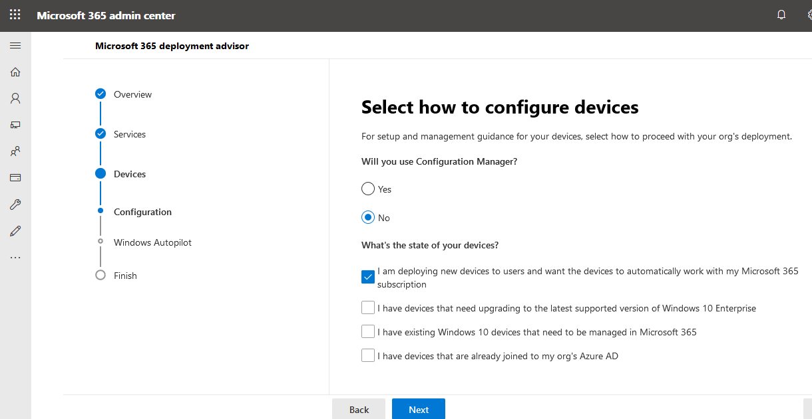

# Microsoft 365 および Office 365 サービスのセットアップ ガイドSetup guides for Microsoft 365 and Office 365 services

Microsoft 365 および Office 365 のセットアップガイドを使用すると、管理者は、アプリとサービスを展開するためのガイダンスとリソースをカスタマイズできます。Microsoft 365 and Office 365 setup guides give admins tailored guidance and resources for deploying apps and services. これらのガイドは同じベストプラクティスを使用して作成されています。これは、個々の対話において、オンボードの専門家の共有を FastTrack しており、Microsoft 365 管理センター内のすべての管理者が使用できます。These guides are created using the same best practices that FastTrack onboarding specialists share in individual interactions, and they're available to all admins within the Microsoft 365 admin center. これにより、製品のセットアップ、セキュリティ機能の有効化、コラボレーションツールの展開、高度な展開を高速化するためのスクリプトの提供に関する情報が得られます。They give information on product setup, enabling security features, deploying collaboration tools, and provide scripts to speed up advanced deployments.

## Microsoft 365 管理センターでのセットアップガイドへのアクセス方法How to access setup guides in the Microsoft 365 admin center

セットアップガイドは、Microsoft 365 管理センターの[セットアップガイダンス](https://aka.ms/setupguidance)ページからアクセスできます。The setup guides are accessible from the [Setup guidance](https://aka.ms/setupguidance) page in the Microsoft 365 admin center. 進捗状況を追跡して、ガイドを完成させるためのオプションをいつでも取得できます。You can keep track of the status of your progress and you have the option to return at any time to complete a guide. **セットアップガイダンス**ページにアクセスするには、次のようにします。To reach the **Setup guidance** page:

1. [管理センター](https://admin.microsoft.com/)で、**ホーム**ページに移動します。In the [admin center](https://admin.microsoft.com/), go to the **Home** page.
2. **トレーニング & ガイド**カードを検索します。Find the **Training & guides** card. 

  

3. カスタマイズした**セットアップガイダンス**を選択します。Select **Customized setup guidance**.

  

>[!NOTE]
>Microsoft 365 管理センターにアクセスするには、テナント管理者のアクセス許可が必要です。Tenant administrator permissions are required to access the Microsoft 365 admin center.

## Microsoft 365 管理センターでのセットアップガイドの動作についてHow do setup guides work in the Microsoft 365 admin center?

各ガイドには、手順を追って説明する、リソース、記事、および必要に応じて、構成の変更を行うために使用できるスクリプトが記載されています。Each guide provides you with step-by-step instructions, resources, articles, and when needed, scripts you can use to make configuration changes. これらのガイドでは、small と large の両方の特定のニーズを反映する選択肢について説明します。These guides provide you with choices that reflect the specific needs of both small and large orgs. また、提供されるガイダンスには、経験豊富な管理者のためのサポートが含まれています。Additionally, the guidance provided includes assistance for both new and more experienced admins.

ガイドを使用すると、計画段階の特定の Microsoft 365 および Office 365 機能の詳細について説明したり、設定を変更する展開を完了した後にそれらを見直すことができます。You can use the guides to learn more about specific Microsoft 365 and Office 365 features during the planning phase or revisit them after you've completed a deployment to modify a setting.

## 初期セットアップのガイドGuides for initial setup

### 環境を準備するPrepare your environment

「**環境を準備**する」ガイドは、Microsoft 365 および Office 365 サービスのために組織の環境を準備する際に役に立ちます。The **Prepare your environment** guide helps you prepare your org's environment for Microsoft 365 and Office 365 services. 目的に関係なく、適切な展開を確実に行うために必要なタスクがあります。Regardless of your goals, there are tasks you'll need to complete to ensure a successful deployment. 環境の準備中にエラーが発生しないようにするために、ドメインの接続、ユーザーの追加、ライセンスの割り当て、Exchange Online を使用した電子メールのセットアップ、Office アプリのインストールまたは展開を行うためのステップバイステップの手順が提供されています。To avoid any errors while preparing your environment, you're provided with step-by-step instructions to connect your domain, add users, assign licenses, set up email with Exchange Online, and install or deploy Office apps. 

|||
|:-------|:-----|
| **実行****Run:** | [環境を準備するPrepare your environment](https://aka.ms/prepareyourenvironment) |
||||

### 電子メールの設定アドバイザーEmail setup advisor

**電子メールセットアップアドバイザー**では、組織の Exchange Online を構成するために必要なステップバイステップガイダンスが提供されています。The **Email setup advisor** provides you with the step-by-step guidance needed for configuring Exchange Online for your organization. これには、新しい電子メールアカウントの設定、電子メールの移行、電子メール保護の構成が含まれます。This includes setting up new email accounts, migrating email, and configuring email protection. 電子メールの設定を正常に行うために、このアドバイザーを使用すると、組織の現在のメールシステム、移行されるメールボックスの数、およびユーザーとそのアクセスを管理する方法に基づいて推奨される移行方法が提供されます。For a successful email set up, use this advisor and you'll receive the recommended migration method based on your org's current mail system, the number of mailboxes being migrated, and how you want to manage users and their access.

|||
|:-------|:-----|
| **実行****Run:** | [電子メールの設定アドバイザーEmail setup advisor](https://aka.ms/office365setup) |
||||

### Gmail 連絡先と予定表アドバイザーGmail contacts and calendar advisor

Gmail ユーザーのメールボックスを Microsoft 365 に移行すると、電子メールメッセージは移行されますが、連絡先と予定表アイテムは移行されません。When you migrate a Gmail user's mailbox to Microsoft 365, email messages are migrated, but contacts and calendar items are not. このアドバイザーでは、Outlook.com、Outlook クライアント、または PowerShell でインポートおよびエクスポートメソッドを使用して、Google 連絡先と Google カレンダーアイテムを Microsoft 365 にインポートする手順を説明します。This advisor provides steps for importing Google contacts and Google calendar items to Microsoft 365 using import and export methods with Outlook.com, the Outlook client, or PowerShell.

|||
|:-------|:-----|
| **実行****Run:** |  [Gmail 連絡先と予定表アドバイザーGmail contacts and calendar advisor](https://aka.ms/gmailcontactscalendar) |
|||

### Microsoft 365 展開アドバイザーMicrosoft 365 deployment advisor

**Microsoft 365 展開アドバイザー**は、生産性ツール、セキュリティポリシー、およびデバイス管理機能を設定する際のガイダンスとして、商用のお客様を提供します。The **Microsoft 365 deployment advisor** provides commercial customers with guidance when setting up productivity tools, security policies, and device management capabilities. Microsoft 365 Business Premium または Microsoft 365 Enterprise サブスクリプションでは、このアドバイザーを使用して組織のデバイスをセットアップおよび構成できます。With a Microsoft 365 Business Premium or Microsoft 365 Enterprise subscription, you can use this advisor to set up and configure your organization's devices. クラウドサービスを有効にし、サポートされている最新バージョンの Windows 10 にデバイスを更新し、デバイスを Azure Active Directory (Azure AD) に参加させるためのガイダンスとアクセス方法について説明します。You'll receive guidance and access to resources to enable your cloud services, update devices to the latest supported version of Windows 10, and join devices to Azure Active Directory (Azure AD), all in one central location.

|||
|:-------|:-----|
| **実行****Run:** | [Microsoft 365 展開アドバイザーMicrosoft 365 deployment advisor](https://aka.ms/microsoft365setupguide) |
|||

### リモート作業セットアップガイドRemote work setup guide

**リモート作業セットアップガイド**は、ユーザーがリモートで正常に作業できるようにするために必要なヒントとリソースを組織に提供し、データをセキュリティで保護し、ユーザーの資格情報を保護します。The **Remote work setup guide** provides organizations with the tips and resources needed to ensure your users can successfully work remotely, your data is secure, and users' credentials are safeguarded. 組織のネットワークへのリモートワーカーのデバイス接続を最適化するガイダンスを受け取ります。これにより、VPN インフラストラクチャの負荷が軽減されます。You'll receive guidance to optimize remote workers' device connection to your organization's network, which will reduce the strain on your VPN infrastructure. 

|||
|:-------|:-----|
| **実行****Run:** | [リモート作業セットアップガイドRemote work setup guide](https://aka.ms/remoteworksetup) |
|||

### Windows 仮想デスクトップセットアップガイドWindows Virtual Desktop setup guide

Windows 仮想デスクトップは、クラウドで実行される包括的なデスクトップおよびアプリケーション仮想化サービスです。Windows Virtual Desktop is a comprehensive desktop and app virtualization service running in the cloud. これは、簡略化された管理、マルチセッション Windows 10、Microsoft 365 アプリの最適化、およびリモートデスクトップサービス (RDS) 環境のサポートを提供する唯一の仮想デスクトップインフラストラクチャ (VDI) です。It's the only virtual desktop infrastructure (VDI) that delivers simplified management, multi-session Windows 10, optimizations for Microsoft 365 Apps, and support for Remote Desktop Services (RDS) environments. Windows デスクトップとアプリを数分で Azure に展開して拡張し、組み込みのセキュリティ機能とコンプライアンス機能を利用できます。Deploy and scale your Windows desktops and apps to Azure in minutes and get built-in security and compliance features. **Windows 仮想デスクトップセットアップガイド**は、管理者に、リソースの計画と、展開、セットアップのガイダンス、およびその他のリソースに関する前提条件を提供します。The **Windows Virtual Desktop setup guide** provides administrators with planning resources and the prerequisites for deployment, setup guidance, and additional resources. 

|||
|:-------|:-----|
| **実行****Run:** | [Windows 仮想デスクトップセットアップガイドWindows Virtual Desktop setup guide](https://aka.ms/wvdsetupguide) |
|||

## セキュリティガイドGuides for security

### Azure AD セットアップガイドAzure AD setup guide

「 **AZURE AD セットアップガイド」** には、組織に強力なセキュリティ基盤があることを確認するための情報が記載されています。The **Azure AD setup guide** provides information to ensure your org has a strong security foundation. このガイドでは、管理者向けの Azure の役割ベースのアクセス制御 (Azure RBAC)、オンプレミスのディレクトリの Azure AD Connect、および Azure AD Connect の正常性などの初期機能をセットアップして、自動同期時にハイブリッド id の正常性を監視できるようにします。In this guide you’ll set up initial features, like Azure role-based access control (Azure RBAC) for admins, Azure AD Connect for your on-premises directory, and Azure AD Connect Health, so you can monitor your hybrid identity's health during automated syncs. また、オプションの高度な ID 保護、ユーザープロビジョニングの自動化を含む、セルフサービスのパスワードのリセット、条件付きアクセス、および統合されたサードパーティのサインオンを有効にする方法についても説明します。It also includes essential information on enabling self-service password resets, conditional access and integrated third-party sign-on including optional advanced ID protection, and user provisioning automation.

|||
|:-------|:-----|
| **実行****Run:** | [Azure AD セットアップガイドAzure AD setup guide](https://aka.ms/aadpguidance) |
|||

### パスワードの展開を計画するPlan your passwordless deployment

ユーザーがデバイスに安全にアクセスできるようにするための代替サインイン方法にアップグレードします。 Windows Hello for Business、Microsoft Authenticator アプリ、セキュリティキーのいずれかのパスワードを使用します。Upgrade to an alternative sign-in approach that allows users to access their devices securely with one of the following passwordless authentication methods: Windows Hello for Business, Microsoft Authenticator app, or security keys. このウィザードを使用すると、適切な passwordless 認証方法を使用して、それらの展開方法に関するガイダンスを受信することができます。Use this wizard to discover the best passwordless authentication methods to use and receive guidance on how to deploy them.

|||
|:-------|:-----|
| **実行****Run:** | [パスワードの展開を計画するPlan your passwordless deployment](https://aka.ms/passwordlesssetup) |
|||

### Microsoft Defender Advanced Threat Protection (ATP) advisorMicrosoft Defender Advanced Threat Protection (ATP) advisor

Microsoft Defender ATP アドバイザーは、企業ネットワークが高度な脅威の防止、検出、調査、および応答を行う際に役立つ手順を提供します。The Microsoft Defender ATP advisor provides instructions that will help your enterprise network prevent, detect, investigate, and respond to advanced threats. 組織の脆弱性に関する情報が得られた評価を行い、最適な展開パッケージと構成方法を決定します。Make an informed assessment of your org's vulnerability and decide which deployment package and configuration methods are best. 

>[!NOTE]
>Microsoft Defender ATP には、Microsoft ボリュームライセンスが必要です。A Microsoft Volume License is required for Microsoft Defender ATP.

|||
|:-------|:-----|
| **実行****Run:** | [Microsoft Defender Advanced Threat Protection advisorMicrosoft Defender Advanced Threat Protection advisor](https://aka.ms/mdatpsetup) |
|||

### Exchange Online Protection のセットアップガイドExchange Online Protection setup guide

Microsoft Exchange Online Protection (EOP) は、スパムやマルウェアから保護するためのクラウドベースの電子メールフィルター処理サービスであり、メッセージングポリシー違反から組織を保護する機能を備えています。Microsoft Exchange Online Protection (EOP) is a cloud-based email filtering service for protection against spam and malware, with features to safeguard your organization from messaging policy violations. このガイドでは、オンプレミスメールボックスの3つの展開シナリオ、 &mdash; ハイブリッド (オンプレミスとクラウドの混在) メールボックスのどちらを選択するか、またはすべてのクラウドメールボックスを組織に適合させるかを選択することによって、EOP を設定し &mdash; ます。With this guide you'll set up EOP by selecting which of the three deployment scenarios&mdash;on-premises mailboxes, hybrid (mix of on-premises and cloud) mailboxes, or all cloud mailboxes&mdash;fits your organization. このガイドでは、ユーザーのライセンスを設定して確認し、Microsoft 365 管理センターでアクセス許可を割り当て、セキュリティ & コンプライアンスセンターで組織のマルウェア対策とスパムポリシーを構成するための情報とリソースを提供します。The guide provides information and resources to set up and review your user's licensing, assign permissions in the Microsoft 365 admin center, and configure your organization's anti-malware and spam policies in the Security & Compliance Center. 

|||
|:-------|:-----|
| **実行****Run:** | [Exchange Online Protection のセットアップガイドExchange Online Protection setup guide](https://aka.ms/EOPguidance) |
|||

### Office 365 Advanced Threat Protection advisorOffice 365 Advanced Threat Protection advisor

Office 365 Advanced Threat Protection advisor は、電子メールメッセージ、リンク、およびサードパーティのコラボレーションツールを使用して、お客様の環境で発生する可能性のある悪意のある脅威から組織を保護します。The Office 365 Advanced Threat Protection advisor safeguards your organization against malicious threats that your environment might encounter through email messages, links, and third-party collaboration tools. このガイドには、高度な脅威保護計画を準備して、組織のニーズに合わせて識別するのに役立つリソースと情報が記載されています。This guide provides you with the resources and information to help you prepare and identify the advanced threat protection plan to fit your organization's needs. 

|||
|:-------|:-----|
| **実行****Run:** | [Office 365 Advanced Threat Protection advisorOffice 365 Advanced Threat Protection advisor](https://aka.ms/oatpsetup) |
|||

### Active Directory フェデレーションサービス (AD FS) の展開アドバイザーActive Directory Federation Services (AD FS) deployment advisor

**AD fs 展開アドバイザー**は、Microsoft 365 および Office 365 サービスのユーザーを認証するオンプレミスの AD FS インフラストラクチャを展開するためのステップバイステップのガイダンスを提供します。The **AD FS deployment advisor** provides you with step-by-step guidance on deploying an on-premises AD FS infrastructure that authenticates users for Microsoft 365 and Office 365 services. このガイドでは、組織が AD FS のコンポーネントと要件を確認し、展開に必要な SSL 証明書を取得してインストールし、必要な web アプリケーションプロキシサーバーをインストールすることができます。With this guide your org can review AD FS components and requirements, acquire and install SSL certificates that are necessary for deployment, and install a required web application proxy server. 

|||
|:-------|:-----|
| **実行****Run:** | [AD FS 展開アドバイザーAD FS deployment advisor](https://aka.ms/adfsguidance) |
|||

## グループ作業のガイドGuides for collaboration

### エンタープライズ展開アドバイザー用の Microsoft 365 アプリMicrosoft 365 Apps for enterprise deployment advisor

**Microsoft 365 Apps for enterprise deployment advisor**は、Word、Excel、PowerPoint、OneNote などの Office 製品の最新バージョンを実行しているユーザーのデバイスを取得する際に役に立ちます。The **Microsoft 365 Apps for enterprise deployment advisor** helps you get your users' devices running the latest version of Office products like Word, Excel, PowerPoint, and OneNote. 管理ツールを使用してエンタープライズ展開に簡単にインストールできるオプションを含む、さまざまな展開方法についてのガイダンスが用意されています。You'll get guidance on the various deployment methods that include easy self-install options to enterprise deployments with management tools. 手順は、環境を評価し、特定の展開要件を把握して、インストールを成功させるために必要なサポートツールを実装するのに役立ちます。The instructions will help you assess your environment, figure out your specific deployment requirements, and implement the necessary support tools to ensure a successful install. 

|||
|:-------|:-----|
| **実行****Run:** | [Microsoft 365 アプリの展開アドバイザーMicrosoft 365 Apps deployment advisor](https://aka.ms/OPPquickstartguide) |
|||

### モバイルアプリのセットアップアシスタントMobile apps setup assistant

このセットアップアシスタントは、Windows、iOS、Android のモバイルデバイスで Office アプリをダウンロードしてインストールする方法について説明します。This setup assistant provides instructions for the download and installation of Office apps on your Windows, iOS, and Android mobile devices. このガイドでは、Microsoft 365 および Office 365 アプリを携帯電話およびタブレットデバイスにダウンロードしてインストールするための詳細な手順について説明します。This guide provides you with step-by-step information to download and install Microsoft 365 and Office 365 apps on your phone and tablet devices.

|||
|:-------|:-----|
| **実行****Run:** | [モバイルアプリのセットアップアシスタントMobile apps setup assistant](https://aka.ms/officeappguidance) |
|||

### Microsoft Teams セットアップガイドMicrosoft Teams setup guide

**Microsoft Teams セットアップガイド**では、チームとプライベートコミュニケーションの両方について、メッセージング、通話、および音声またはビデオ会議を通じてリアルタイム会話をホストするチームワークスペースをセットアップするためのガイダンスを組織に提供します。The **Microsoft Teams setup guide** provides your organization with guidance to set up team workspaces that host real-time conversations through messaging, calls, and audio or video meetings for both team and private communication. Teams 管理センター内でネットワークプランナーツールと Teams アドバイザーを使用して、組織のネットワーク要件を決定する手順が表示されます。You'll receive the instructions for determining your organization's network requirements by using the Network Planner tool and the Teams advisor within the Teams admin center. 展開が完了すると、Teams の使用を開始するのに役立つリソースがガイドに表示されます。Once your deployment is complete, the guide includes helpful resources to get started using Teams.

|||
|:-------|:-----|
| **実行****Run:** | [Microsoft Teams セットアップガイドMicrosoft Teams setup guide](https://aka.ms/teamsguidance) |
|||

### SharePoint 展開アドバイザーSharePoint deployment advisor

**Sharepoint 展開アドバイザー**は、sharepoint ドキュメントの記憶域とコンテンツ管理のセットアップ、サイトの作成、外部共有の構成、データの移行、詳細設定の構成を行うことができます。これにより、組織内でのユーザーの活動とコミュニケーションが促進されます。The **SharePoint deployment advisor** helps you set up your SharePoint document storage and content management, create sites, configure external sharing, migrate data and configure advanced settings, all to drive user engagement and communication within your organization. コンテンツ共有のアクセス許可ポリシーを構成する手順を実行し、移行同期ツールを選択して、SharePoint 環境のセキュリティ設定を有効にします。You'll follow steps for configuring your content-sharing permission policies, choose your migration sync tools, as well as enable the security settings for your SharePoint environment. 

|||
|:-------|:-----|
| **実行****Run:** | [SharePoint 展開アドバイザーSharePoint deployment advisor](https://aka.ms/spoguidance) |
|||

### OneDrive クイックスタートガイドOneDrive quick start guide

このガイドを使用して、OneDrive ファイルの保存、共有、グループ作業、および同期機能を使い始めることができます。Use this guide to get started with OneDrive file storage, sharing, collaboration, and syncing capabilities. OneDrive は、ユーザーが Microsoft 365 アプリのファイルを同期し、外部共有を構成し、ユーザーデータを移行し、セキュリティとデバイスアクセスの詳細設定を構成するための一元的な場所を提供します。OneDrive provides a central location where users can sync their Microsoft 365 Apps files, configure external sharing, migrate user data, and configure advanced security and device access settings. Onedrive のセットアップガイドは、OneDrive サブスクリプションまたはスタンドアロンの OneDrive プランを使用して展開できます。The OneDrive setup guide can be deployed using a OneDrive subscription or a standalone OneDrive plan. 

|||
|:-------|:-----|
| **実行****Run:** | [OneDrive セットアップガイドOneDrive setup guide](https://aka.ms/ODfBquickstartguide) |
|||

## 高度なウィザードAdvanced wizards

### 構成マネージャーを使用した一括アップグレードIn-place upgrade with Configuration Manager

Windows 7 および Windows 8.1 デバイスを Windows 10 の最新バージョンにアップグレードする場合は、「 **Configuration Manager で一括アップグレード**を実行する」を参照してください。Use the **In-place upgrade with Configuration Manager** guide when upgrading Windows 7 and Windows 8.1 devices to the latest version of Windows 10. 前提条件を確認し、一括アップグレードを自動的に構成するには、用意されているスクリプトを使用します。You'll use the script provided to check the prerequisites and automatically configure an in-place upgrade.

|||
|:-------|:-----|
| **実行****Run:** | [構成マネージャーを使用した一括アップグレードIn-place upgrade with Configuration Manager](https://aka.ms/win10upgradedemo) |
|||

### ユーザーに Office を展開するDeploy Office to your users

Office 展開ツールを使用してインストールをカスタマイズする機能を使用して、クラウドから Office アプリを展開します。Deploy Office apps from the cloud with the ability to customize your installation by using the Office Deployment Tool. このガイドでは、高度な設定を使用してカスタマイズされた Office 構成を作成することや、事前に推奨される構成を使用することができます。This guide helps you create a customized Office configuration with advanced settings, or you can use a pre-built recommended configuration. ユーザーが自己インストールを実行しているか、ユーザーに個別にまたは一括して展開しているかにかかわらず、この詳細ウィザードでは、組織に合わせてカスタマイズされた Office インストールをユーザーに提供するためのステップバイステップの手順を説明します。Whether your users are conducting a self-install or you're deploying to your users individually or in bulk, this advanced wizard provides you with step-by-step instructions to give users an Office installation tailored to your organization.

|||
|:-------|:-----|
| **実行****Run:** | [ユーザーに Office を展開するDeploy Office to your users](https://aka.ms/proplusodt) |
|||

### Configuration Manager を使用して Microsoft 365 アプリを展開および更新するDeploy and update Microsoft 365 Apps with Configuration Manager

構成マネージャーを使用する組織では、このガイドを使用して、FastTrack のエンジニアが推奨するベストプラクティスを使用して Microsoft 365 アプリの展開を自動的に構成するスクリプトを生成できます。For organizations using Configuration Manager, you can use this guide to generate a script that will automatically configure your Microsoft 365 Apps deployment using best practices recommended by FastTrack engineers. このガイドを使用して、展開グループを構築し、Office アプリと機能をカスタマイズし、動的またはリーンインストールを構成した後、スクリプトを実行して、展開の対象とする必要があるアプリケーション、自動展開ルール、およびデバイスコレクションを作成します。Use this guide to build your deployment groups, customize your Office apps and features, configure dynamic or lean installations, and then run the script to create the applications, automatic deployment rules, and device collections you need to target your deployment. 

|||
|:-------|:-----|
| **実行****Run:** | [Configuration Manager を使用して Microsoft 365 アプリを展開および更新するDeploy and update Microsoft 365 Apps with Configuration Manager](https://aka.ms/oppinstall) |
|||

