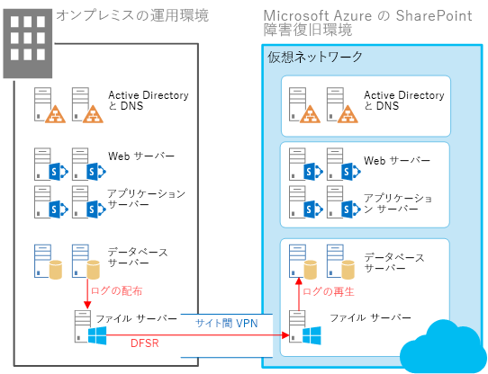
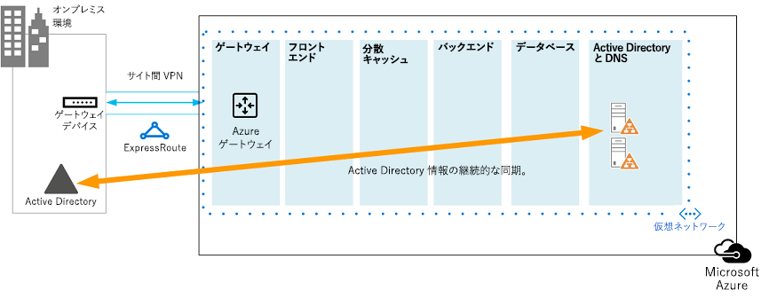

# <a name="sharepoint-server-2013-disaster-recovery-in-microsoft-azure"></a><span data-ttu-id="225fc-104">Microsoft Azure での SharePoint Server 2013 の障害復旧</span><span class="sxs-lookup"><span data-stu-id="225fc-104">SharePoint Server 2013 Disaster Recovery in Microsoft Azure</span></span>

 <span data-ttu-id="225fc-p102">**概要:** Azure を使用すると、オンプレミス SharePoint ファーム用の障害復旧環境を作成できます。この記事では、このソリューションの設計と実装の方法を取り上げます。</span><span class="sxs-lookup"><span data-stu-id="225fc-p102">**Summary:** Using Azure, you can create a disaster-recovery environment for your on-premises SharePoint farm. This article describes how to design and implement this solution.</span></span>

 <span data-ttu-id="225fc-107">**SharePoint Server 2013 障害復旧の概要ビデオをご覧ください**</span><span class="sxs-lookup"><span data-stu-id="225fc-107">**Watch the SharePoint Server 2013 disaster recovery overview video**</span></span>
> [!VIDEO https://www.microsoft.com/videoplayer/embed/1b73ec8f-29bd-44eb-aa3a-f7932784bfd9?autoplay=false]
  
 <span data-ttu-id="225fc-p103">SharePoint オンプレミス環境に障害が発生する場合、最も優先すべきことは、システムを稼働状態に迅速に戻すことです。Microsoft Azure でバックアップ環境が既に稼働している場合には、SharePoint の障害復旧は迅速かつ簡単に行えます。このビデオは、SharePoint ウォーム フェールオーバー環境の主要な概念について取り上げ、この記事に記されている詳細情報を補完するものとなっています。</span><span class="sxs-lookup"><span data-stu-id="225fc-p103">When disaster strikes your SharePoint on-premises environment, your top priority is to get the system running again quickly. Disaster recovery with SharePoint is quicker and easier when you have a backup environment already running in Microsoft Azure. This video explains the main concepts of a SharePoint warm failover environment and complements the full details available in this article.</span></span>
  
<span data-ttu-id="225fc-111">この記事では、ソリューション モデル「 **Microsoft Azure における SharePoint 障害復旧** 」を使用します。</span><span class="sxs-lookup"><span data-stu-id="225fc-111">Use this article with the following solution model: **SharePoint Disaster Recovery in Microsoft Azure**.</span></span>
  
<span data-ttu-id="225fc-112">[](https://go.microsoft.com/fwlink/p/?LinkId=392555)</span><span class="sxs-lookup"><span data-stu-id="225fc-112">[](https://go.microsoft.com/fwlink/p/?LinkId=392555)</span></span>
  
<span data-ttu-id="225fc-113"> [PDF](https://go.microsoft.com/fwlink/p/?LinkId=392555) |  [Visio](https://go.microsoft.com/fwlink/p/?LinkId=392554)</span><span class="sxs-lookup"><span data-stu-id="225fc-113"> [PDF](https://go.microsoft.com/fwlink/p/?LinkId=392555) |  [Visio](https://go.microsoft.com/fwlink/p/?LinkId=392554)</span></span>
  
<span data-ttu-id="225fc-114">この記事の内容</span><span class="sxs-lookup"><span data-stu-id="225fc-114">In this article:</span></span>
  
- [<span data-ttu-id="225fc-115">障害復旧のための Azure インフラストラクチャ サービスの使用</span><span class="sxs-lookup"><span data-stu-id="225fc-115">Use Azure Infrastructure Services for disaster recovery</span></span>](sharepoint-server-2013-disaster-recovery-in-microsoft-azure.md#AZ)
    
- [<span data-ttu-id="225fc-116">ソリューションの説明</span><span class="sxs-lookup"><span data-stu-id="225fc-116">Solution description</span></span>](sharepoint-server-2013-disaster-recovery-in-microsoft-azure.md#SOL)
    
- [<span data-ttu-id="225fc-117">詳細なアーキテクチャ</span><span class="sxs-lookup"><span data-stu-id="225fc-117">Detailed architecture</span></span>](sharepoint-server-2013-disaster-recovery-in-microsoft-azure.md#arch)
    
- [<span data-ttu-id="225fc-118">障害復旧のロードマップ</span><span class="sxs-lookup"><span data-stu-id="225fc-118">Disaster recovery roadmap</span></span>](sharepoint-server-2013-disaster-recovery-in-microsoft-azure.md#RDmap)
    
- [<span data-ttu-id="225fc-119">フェーズ 1: 障害復旧環境の設計</span><span class="sxs-lookup"><span data-stu-id="225fc-119">Phase 1: Design the disaster recovery environment</span></span>](sharepoint-server-2013-disaster-recovery-in-microsoft-azure.md#Phase1)
    
- [<span data-ttu-id="225fc-120">フェーズ 2: Azure Virtual Network と VPN 接続の作成</span><span class="sxs-lookup"><span data-stu-id="225fc-120">Phase 2: Create the Azure virtual network and VPN connection</span></span>](sharepoint-server-2013-disaster-recovery-in-microsoft-azure.md#Phase2)
    
- [<span data-ttu-id="225fc-121">フェーズ 3: Active Directory とドメイン ネーム サービスの Azure Virtual Network への展開</span><span class="sxs-lookup"><span data-stu-id="225fc-121">Phase 3: Deploy Active Directory and Domain Name Services to the Azure virtual network</span></span>](sharepoint-server-2013-disaster-recovery-in-microsoft-azure.md#Phase3)
    
- [<span data-ttu-id="225fc-122">フェーズ 4: Azure における SharePoint 復旧ファームの展開</span><span class="sxs-lookup"><span data-stu-id="225fc-122">Phase 4: Deploy the SharePoint recovery farm in Azure</span></span>](sharepoint-server-2013-disaster-recovery-in-microsoft-azure.md#Phase4)
    
- [<span data-ttu-id="225fc-123">フェーズ 5: ファーム間の DFSR の設定</span><span class="sxs-lookup"><span data-stu-id="225fc-123">Phase 5: Set up DFSR between the farms</span></span>](sharepoint-server-2013-disaster-recovery-in-microsoft-azure.md#Phase5)
    
- [<span data-ttu-id="225fc-124">フェーズ 6: 復旧ファームに対するログ配布の設定</span><span class="sxs-lookup"><span data-stu-id="225fc-124">Phase 6: Set up log shipping to the recovery farm</span></span>](sharepoint-server-2013-disaster-recovery-in-microsoft-azure.md#Phase6)
    
- [<span data-ttu-id="225fc-125">フェーズ 7: フェールオーバーと復旧の検証</span><span class="sxs-lookup"><span data-stu-id="225fc-125">Phase 7: Validate failover and recovery</span></span>](sharepoint-server-2013-disaster-recovery-in-microsoft-azure.md#Phase7)
    
- [<span data-ttu-id="225fc-126">Microsoft の概念実証環境</span><span class="sxs-lookup"><span data-stu-id="225fc-126">Microsoft proof-of-concept environment</span></span>](sharepoint-server-2013-disaster-recovery-in-microsoft-azure.md#POC)
    
- [<span data-ttu-id="225fc-127">トラブルシューティングのヒント</span><span class="sxs-lookup"><span data-stu-id="225fc-127">Troubleshooting tips</span></span>](sharepoint-server-2013-disaster-recovery-in-microsoft-azure.md#Troubleshooting)
    
## <a name="use-azure-infrastructure-services-for-disaster-recovery"></a><span data-ttu-id="225fc-128">障害復旧のための Azure インフラストラクチャ サービスの使用</span><span class="sxs-lookup"><span data-stu-id="225fc-128">Use Azure Infrastructure Services for disaster recovery</span></span>
<span data-ttu-id="225fc-129"><a name="AZ"> </a></span><span class="sxs-lookup"><span data-stu-id="225fc-129"></span></span>

<span data-ttu-id="225fc-p104">多くの組織には、SharePoint 用の障害復旧環境はありません。この環境を内部設置型として構築して保守するには費用が高額になる可能性があります。Azure インフラストラクチャ サービス が提供する魅力的な障害復旧環境は、内部設置型の代替方法よりも柔軟性があり、費用が少なくて済みます。</span><span class="sxs-lookup"><span data-stu-id="225fc-p104">Many organizations do not have a disaster recovery environment for SharePoint, which can be expensive to build and maintain on-premises. Azure Infrastructure Services provides compelling options for disaster recovery environments that are more flexible and less expensive than the on-premises alternatives.</span></span>
  
<span data-ttu-id="225fc-132">Azure インフラストラクチャ サービス を使用する利点には、以下が含まれます。</span><span class="sxs-lookup"><span data-stu-id="225fc-132">The advantages for using Azure Infrastructure Services include:</span></span>
  
- <span data-ttu-id="225fc-p105">**リソースの費用を抑えられる** 内部設置型の障害復旧環境に比べて、保守するリソースが少なく、費用も抑えられます。リソースの数は、障害復旧環境として、コールド スタンバイ、ウォーム スタンバイ、ホット スタンバイのどれを選択するかによって異なります。</span><span class="sxs-lookup"><span data-stu-id="225fc-p105">**Fewer costly resources** Maintain and pay for fewer resources than on-premises disaster recovery environments. The number of resources depends on which disaster-recovery environment you choose: cold standby, warm standby, or hot standby.</span></span>
    
- <span data-ttu-id="225fc-p106">**リソースの柔軟性の向上** 障害発生時、負荷要件を満たすためにご使用の復旧 SharePoint ファームを簡単にスケールアウトできます。リソースが不要になる場合にはスケールインします。</span><span class="sxs-lookup"><span data-stu-id="225fc-p106">**Better resource flexibility** In the event of a disaster, easily scale out your recovery SharePoint farm to meet load requirements. Scale in when you no longer need the resources.</span></span>
    
- <span data-ttu-id="225fc-137">**低額なデータセンターのコミットメント** 別の地域にあるセカンダリ データセンターに投資するのではなく、Azure インフラストラクチャ サービス を使用します。</span><span class="sxs-lookup"><span data-stu-id="225fc-137">**Lower datacenter commitment** Use Azure Infrastructure Services instead of investing in a secondary datacenter in a different region.</span></span>
    
<span data-ttu-id="225fc-p107">障害復旧に取り組み始めたばかりの組織が活用できる簡単なオプションと、高い信頼性が要件となっている組織が活用できる拡張オプションがあります。コールド、ウォーム、ホット スタンバイの各環境の定義は、環境がクラウド プラットフォームでホストされると若干異なります。以下の表に、Azure で SharePoint 復旧ファームを構築するためのこれらの環境について取り上げます。</span><span class="sxs-lookup"><span data-stu-id="225fc-p107">There are less-complex options for organizations just getting started with disaster recovery and advanced options for organizations with high-resilience requirements. The definitions for cold, warm, and hot standby environments are a little different when the environment is hosted on a cloud platform. The following table describes these environments for building a SharePoint recovery farm in Azure.</span></span>
  
<span data-ttu-id="225fc-141">**表: 復旧環境**</span><span class="sxs-lookup"><span data-stu-id="225fc-141">**Table: Recovery environments**</span></span>

|<span data-ttu-id="225fc-142">**復旧環境の種類**</span><span class="sxs-lookup"><span data-stu-id="225fc-142">**Type of recovery environment**</span></span>|<span data-ttu-id="225fc-143">**説明**</span><span class="sxs-lookup"><span data-stu-id="225fc-143">**Description**</span></span>|
|:-----|:-----|
|<span data-ttu-id="225fc-144">ホット</span><span class="sxs-lookup"><span data-stu-id="225fc-144">Hot</span></span>  <br/> |<span data-ttu-id="225fc-145">フルサイズのファームが、スタンバイ状態で準備、更新、実行されています。</span><span class="sxs-lookup"><span data-stu-id="225fc-145">A fully sized farm is provisioned, updated, and running on standby.</span></span>  <br/> |
|<span data-ttu-id="225fc-146">ウォーム</span><span class="sxs-lookup"><span data-stu-id="225fc-146">Warm</span></span>  <br/> |<span data-ttu-id="225fc-147">ファームが構築され、仮想マシンが実行状態で、更新されています。</span><span class="sxs-lookup"><span data-stu-id="225fc-147">The farm is built and virtual machines are running and updated.</span></span>  <br/> <span data-ttu-id="225fc-148">復旧には、コンテンツ データベースの接続、サービス アプリケーションの準備、コンテンツのクロールが含まれます。</span><span class="sxs-lookup"><span data-stu-id="225fc-148">Recovery includes attaching content databases, provisioning service applications, and crawling content.</span></span>  <br/> <span data-ttu-id="225fc-149">このファームは、運用ファームよりも小規模にでき、フルサイズのユーザー ベースに対応するためにスケールアウトできます。</span><span class="sxs-lookup"><span data-stu-id="225fc-149">The farm can be a smaller version of the production farm and then scaled out to serve the full user base.</span></span>  <br/> |
|<span data-ttu-id="225fc-150">コールド</span><span class="sxs-lookup"><span data-stu-id="225fc-150">Cold</span></span>  <br/> |<span data-ttu-id="225fc-151">ファームは完全に構築されますが、仮想マシンは停止状態です。</span><span class="sxs-lookup"><span data-stu-id="225fc-151">The farm is fully built, but the virtual machines are stopped.</span></span>  <br/> <span data-ttu-id="225fc-152">環境の保守には、仮想マシンを時折始動すること、環境への修正プログラムの適用、更新、検証が含まれます。</span><span class="sxs-lookup"><span data-stu-id="225fc-152">Maintaining the environment includes starting the virtual machines from time to time, patching, updating, and verifying the environment.</span></span>  <br/> <span data-ttu-id="225fc-153">障害発生時に、環境全体を開始します。</span><span class="sxs-lookup"><span data-stu-id="225fc-153">Start the full environment in the event of a disaster.</span></span>  <br/> |
   
<span data-ttu-id="225fc-p108">組織の目標回復時間 (RTO) と目標復旧時点 (RRO) を評価することは重要です。これらの要件によって、どの環境が、ご自分の組織に最も適切な投資となるかを判別します。</span><span class="sxs-lookup"><span data-stu-id="225fc-p108">It's important to evaluate your organization's Recovery Time Objectives (RTOs) and Recovery Point Objectives (RPOs). These requirements determine which environment is the most appropriate investment for your organization.</span></span>
  
<span data-ttu-id="225fc-p109">この記事のガイダンスでは、ウォーム スタンバイ環境の実装方法を取り上げます。この方法はコールド スタンバイ環境にも適用できます。ただし、この種類の環境をサポートするには追加手順が必要です。この記事では、ホット スタンバイ環境の実装方法については取り上げません。</span><span class="sxs-lookup"><span data-stu-id="225fc-p109">The guidance in this article describes how to implement a warm standby environment. You can also adapt it to a cold standby environment, although you need to follow additional procedures to support this kind of environment. This article does not describe how to implement a hot standby environment.</span></span>
  
<span data-ttu-id="225fc-159">障害復旧ソリューションの詳細については、「[High availability and disaster recovery concepts in SharePoint 2013](https://go.microsoft.com/fwlink/p/?LinkID=393114)」および「[Choose a disaster recovery strategy for SharePoint 2013](https://go.microsoft.com/fwlink/p/?linkid=203228)」をご覧ください。</span><span class="sxs-lookup"><span data-stu-id="225fc-159">For more information about disaster recovery solutions, see [High availability and disaster recovery concepts in SharePoint 2013](https://go.microsoft.com/fwlink/p/?LinkID=393114) and [Choose a disaster recovery strategy for SharePoint 2013](https://go.microsoft.com/fwlink/p/?linkid=203228).</span></span>
  
## <a name="solution-description"></a><span data-ttu-id="225fc-160">ソリューションの説明</span><span class="sxs-lookup"><span data-stu-id="225fc-160">Solution description</span></span>
<span data-ttu-id="225fc-161"><a name="SOL"> </a></span><span class="sxs-lookup"><span data-stu-id="225fc-161"></span></span>

<span data-ttu-id="225fc-162">ウォーム スタンバイ障害復旧ソリューションには、以下の環境が必要です。</span><span class="sxs-lookup"><span data-stu-id="225fc-162">The warm standby disaster-recovery solution requires the following environment:</span></span>
  
- <span data-ttu-id="225fc-163">オンプレミスの SharePoint 運用ファーム</span><span class="sxs-lookup"><span data-stu-id="225fc-163">An on-premises SharePoint production farm</span></span>
    
- <span data-ttu-id="225fc-164">Azure の SharePoint 復旧ファーム</span><span class="sxs-lookup"><span data-stu-id="225fc-164">A recovery SharePoint farm in Azure</span></span>
    
- <span data-ttu-id="225fc-165">2 つの環境間のサイト間 VPN 接続</span><span class="sxs-lookup"><span data-stu-id="225fc-165">A site-to-site VPN connection between the two environments</span></span>
    
<span data-ttu-id="225fc-166">次の図に、これら 3 つの要素を示します。</span><span class="sxs-lookup"><span data-stu-id="225fc-166">The following figure illustrates these three elements.</span></span>
  
<span data-ttu-id="225fc-167">**図: Azure におけるウォーム スタンバイ ソリューションの要素**</span><span class="sxs-lookup"><span data-stu-id="225fc-167">**Figure: Elements of a warm standby solution in Azure**</span></span>


  
<span data-ttu-id="225fc-169">分散ファイル システム レプリケーション (DFSR) を使用した SQL Server ログ配布により、データベース バックアップとトランザクション ログを Azure 内の復旧ファームにコピーします。</span><span class="sxs-lookup"><span data-stu-id="225fc-169">SQL Server log shipping with Distributed File System Replication (DFSR) is used to copy database backups and transaction logs to the recovery farm in Azure:</span></span> 
  
- <span data-ttu-id="225fc-p110">DFSR は、運用環境のログを復旧環境に転送します。WAN シナリオの場合、ログを Azure 内のセカンダリ サーバーに直接配布するよりも、DFSR の方が効率的です。</span><span class="sxs-lookup"><span data-stu-id="225fc-p110">DFSR transfers logs from the production environment to the recovery environment. In a WAN scenario, DFSR is more efficient than shipping the logs directly to the secondary server in Azure.</span></span>
    
- <span data-ttu-id="225fc-172">ログは、Azure の復旧環境で SQL Server に再生されます。</span><span class="sxs-lookup"><span data-stu-id="225fc-172">Logs are replayed to the SQL Server in the recovery environment in Azure.</span></span>
    
- <span data-ttu-id="225fc-173">復旧手順が実行されるまでは、復旧環境にあるログ配布対象の SharePoint コンテンツ データベースには接続しません。</span><span class="sxs-lookup"><span data-stu-id="225fc-173">You don't attach log-shipped SharePoint content databases in the recovery environment until a recovery exercise is performed.</span></span>
    
<span data-ttu-id="225fc-174">次のステップを実行してファームを復旧します。</span><span class="sxs-lookup"><span data-stu-id="225fc-174">Perform the following steps to recover the farm:</span></span>
  
1. <span data-ttu-id="225fc-175">ログ配布を停止します。</span><span class="sxs-lookup"><span data-stu-id="225fc-175">Stop log shipping.</span></span>
    
2. <span data-ttu-id="225fc-176">プライマリ ファームへのトラフィックの受け入れを停止します。</span><span class="sxs-lookup"><span data-stu-id="225fc-176">Stop accepting traffic to the primary farm.</span></span>
    
3. <span data-ttu-id="225fc-177">最後のトランザクション ログを再生します。</span><span class="sxs-lookup"><span data-stu-id="225fc-177">Replay the final transaction logs.</span></span>
    
4. <span data-ttu-id="225fc-178">コンテンツ データベースをファームに接続します。</span><span class="sxs-lookup"><span data-stu-id="225fc-178">Attach the content databases to the farm.</span></span>
    
5. <span data-ttu-id="225fc-179">レプリケートされたサービス データベースに基づいてサービス アプリケーションを復元します。</span><span class="sxs-lookup"><span data-stu-id="225fc-179">Restore service applications from the replicated services databases.</span></span>
    
6. <span data-ttu-id="225fc-180">復旧ファームを指すように、ドメイン ネーム システム (DNS) レコードを更新します。</span><span class="sxs-lookup"><span data-stu-id="225fc-180">Update Domain Name System (DNS) records to point to the recovery farm.</span></span>
    
7. <span data-ttu-id="225fc-181">フル クロールを開始します。</span><span class="sxs-lookup"><span data-stu-id="225fc-181">Start a full crawl.</span></span>
    
<span data-ttu-id="225fc-p111">実際の復旧動作が円滑に進むようにするため、これらのステップに関して定期的にリハーサルを行い、文書化しておくことをお勧めします。コンテンツ データベースへの接続とサービス アプリケーションの復元には時間がかかる可能性があり、通常は手動構成が若干必要となります。</span><span class="sxs-lookup"><span data-stu-id="225fc-p111">We recommend that you rehearse these steps regularly and document them to help ensure that your live recovery runs smoothly. Attaching content databases and restoring service applications can take some time and typically involves some manual configuration.</span></span>
  
<span data-ttu-id="225fc-184">復旧が実行されると、このソリューションにより次の表に示すアイテムが提供されます。</span><span class="sxs-lookup"><span data-stu-id="225fc-184">After a recovery is performed, this solution provides the items listed in the following table.</span></span>
  
<span data-ttu-id="225fc-185">**表: ソリューションによる復旧対象**</span><span class="sxs-lookup"><span data-stu-id="225fc-185">**Table: Solution recovery objectives**</span></span>

|<span data-ttu-id="225fc-186">**アイテム**</span><span class="sxs-lookup"><span data-stu-id="225fc-186">**Item**</span></span>|<span data-ttu-id="225fc-187">**説明**</span><span class="sxs-lookup"><span data-stu-id="225fc-187">**Description**</span></span>|
|:-----|:-----|
|<span data-ttu-id="225fc-188">サイトおよびコンテンツ</span><span class="sxs-lookup"><span data-stu-id="225fc-188">Sites and content</span></span>  <br/> |<span data-ttu-id="225fc-189">復旧環境で、サイトとコンテンツを利用できます。</span><span class="sxs-lookup"><span data-stu-id="225fc-189">Sites and content are available in the recovery environment.</span></span>  <br/> |
|<span data-ttu-id="225fc-190">検索の新しいインスタンス</span><span class="sxs-lookup"><span data-stu-id="225fc-190">A new instance of search</span></span>  <br/> |<span data-ttu-id="225fc-p112">このウォーム スタンバイ ソリューションの場合、検索は検索データベースから復元されません。復旧ファームにある検索コンポーネントは、可能な限り運用ファームと同様に構成されます。サイトとコンテンツが復元された後、フル クロールが開始され、検索インデックスが再作成されます。クロールが完了するまで待たなくても、サイトとコンテンツは利用できます。</span><span class="sxs-lookup"><span data-stu-id="225fc-p112">In this warm standby solution, search is not restored from search databases. Search components in the recovery farm are configured as similarly as possible to the production farm. After the sites and content are restored, a full crawl is started to rebuild the search index. You do not need to wait for the crawl to complete to make the sites and content available.</span></span>  <br/> |
|<span data-ttu-id="225fc-195">サービス</span><span class="sxs-lookup"><span data-stu-id="225fc-195">Services</span></span>  <br/> | <span data-ttu-id="225fc-p113">データベースにデータを格納するサービスは、ログ配布先データベースから復元されます。データベースにデータを格納しないサービスは、単に開始されるだけです。</span><span class="sxs-lookup"><span data-stu-id="225fc-p113">Services that store data in databases are restored from the log-shipped databases. Services that do not store data in databases are simply started.</span></span> <br/>  <span data-ttu-id="225fc-p114">データベースを使用するサービスすべてを、必ずしも復元する必要はありません。以下のサービスの場合、データベースからの復元は不要で、フェールオーバー後に単に開始するだけで済みます。</span><span class="sxs-lookup"><span data-stu-id="225fc-p114">Not all services with databases need to be restored. The following services do not need to be restored from databases and can simply be started after failover:</span></span> <br/>  <span data-ttu-id="225fc-200">Usage and Health Data Collection</span><span class="sxs-lookup"><span data-stu-id="225fc-200">Usage and Health Data Collection</span></span> <br/>  <span data-ttu-id="225fc-201">State Service</span><span class="sxs-lookup"><span data-stu-id="225fc-201">State service</span></span> <br/>  <span data-ttu-id="225fc-202">Word Automation</span><span class="sxs-lookup"><span data-stu-id="225fc-202">Word automation</span></span> <br/>  <span data-ttu-id="225fc-203">データベースを使用しないその他のサービス</span><span class="sxs-lookup"><span data-stu-id="225fc-203">Any other service that doesn't use a database</span></span> <br/> |
   
<span data-ttu-id="225fc-p115">より複雑な復旧対象に対応するために、Microsoft Consulting Services (MCS) またはパートナーと一緒に作業できます。それらについては、次の表でまとめています。</span><span class="sxs-lookup"><span data-stu-id="225fc-p115">You can work with Microsoft Consulting Services (MCS) or a partner to address more-complex recovery objectives. These are summarized in the following table.</span></span>
  
<span data-ttu-id="225fc-206">**表: MCS またはパートナーが対応できるその他のアイテム**</span><span class="sxs-lookup"><span data-stu-id="225fc-206">**Table: Other items that can be addressed by MCS or a partner**</span></span>

|<span data-ttu-id="225fc-207">**アイテム**</span><span class="sxs-lookup"><span data-stu-id="225fc-207">**Item**</span></span>|<span data-ttu-id="225fc-208">**説明**</span><span class="sxs-lookup"><span data-stu-id="225fc-208">**Description**</span></span>|
|:-----|:-----|
|<span data-ttu-id="225fc-209">カスタム ファーム ソリューションの同期</span><span class="sxs-lookup"><span data-stu-id="225fc-209">Synchronizing custom farm solutions</span></span>  <br/> |<span data-ttu-id="225fc-p116">復旧ファーム構成と運用ファームが同じであることが理想的です。コンサルタントやパートナーと共に作業し、カスタム ファーム ソリューションのレプリケートを行うかどうか、2 つの環境を同期された状態に保つためのプロセスが適切かどうかを評価できます。</span><span class="sxs-lookup"><span data-stu-id="225fc-p116">Ideally, the recovery farm configuration is identical to the production farm. You can work with a consultant or partner to evaluate whether custom farm solutions are replicated and whether the process is in place for keeping the two environments synchronized.</span></span>  <br/> |
|<span data-ttu-id="225fc-212">オンプレミスのデータ ソースへの接続</span><span class="sxs-lookup"><span data-stu-id="225fc-212">Connections to data sources on-premises</span></span>  <br/> |<span data-ttu-id="225fc-213">バックアップ ドメイン コントローラー (BDC) 接続などのバックエンド データ システムへの接続のレプリケート、およびコンテンツ ソースの検索は実際的ではない場合があります。</span><span class="sxs-lookup"><span data-stu-id="225fc-213">It might not be practical to replicate connections to back-end data systems, such as backup domain controller (BDC) connections and search content sources.</span></span>  <br/> |
|<span data-ttu-id="225fc-214">検索の復元シナリオ</span><span class="sxs-lookup"><span data-stu-id="225fc-214">Search restore scenarios</span></span>  <br/> |<span data-ttu-id="225fc-p117">企業における検索の展開は固有でかなり複雑になる傾向があるため、データベースから検索を復元する操作には大きな投資が必要になります。コンサルタントやパートナーと共に作業し、ご自分の組織で必要となる可能性がある検索の復元シナリオを特定して実装できます。</span><span class="sxs-lookup"><span data-stu-id="225fc-p117">Because enterprise search deployments tend to be fairly unique and complex, restoring search from databases requires a greater investment. You can work with a consultant or partner to identify and implement search restore scenarios that your organization might require.</span></span>  <br/> |
   
<span data-ttu-id="225fc-217">この記事で示されているガイダンスでは、オンプレミス ファームの設計と展開が既に行われていると想定しています。</span><span class="sxs-lookup"><span data-stu-id="225fc-217">The guidance provided in this article assumes that the on-premises farm is already designed and deployed.</span></span>
  
## <a name="detailed-architecture"></a><span data-ttu-id="225fc-218">詳細なアーキテクチャ</span><span class="sxs-lookup"><span data-stu-id="225fc-218">Detailed architecture</span></span>
<span data-ttu-id="225fc-219"><a name="arch"> </a></span><span class="sxs-lookup"><span data-stu-id="225fc-219"></span></span>

<span data-ttu-id="225fc-220">Azure の復旧ファーム構成は、以下を含め、オンプレミスの運用ファームと同じであることが理想的です。</span><span class="sxs-lookup"><span data-stu-id="225fc-220">Ideally, the recovery farm configuration in Azure is identical to the production farm on-premises, including the following:</span></span>
  
- <span data-ttu-id="225fc-221">同じ表記のサーバー ロール</span><span class="sxs-lookup"><span data-stu-id="225fc-221">The same representation of server roles</span></span>
    
- <span data-ttu-id="225fc-222">同じカスタマイズ構成</span><span class="sxs-lookup"><span data-stu-id="225fc-222">The same configuration of customizations</span></span>
    
- <span data-ttu-id="225fc-223">同じ検索コンポーネント構成</span><span class="sxs-lookup"><span data-stu-id="225fc-223">The same configuration of search components</span></span>
    
<span data-ttu-id="225fc-p118">Azure の環境は、運用ファームよりも小規模にできます。フェールオーバー後に復旧ファームをスケールアウトする予定の場合には、それぞれの種類のサーバー ロールを最初に表記しておくことが重要です。</span><span class="sxs-lookup"><span data-stu-id="225fc-p118">The environment in Azure can be a smaller version of the production farm. If you plan to scale out the recovery farm after failover, it's important that each type of server role be initially represented.</span></span>
  
<span data-ttu-id="225fc-p119">一部の構成については、フェールオーバー環境でレプリケートすることが実際的ではない場合があります。必ずフェールオーバー手順と環境をテストし、フェールオーバー ファームが予想どおりのサービス レベルを提供することを確認してください。</span><span class="sxs-lookup"><span data-stu-id="225fc-p119">Some configurations might not be practical to replicate in the failover environment. Be sure to test the failover procedures and environment to help ensure that the failover farm provides the expected service level.</span></span>
  
<span data-ttu-id="225fc-p120">このソリューションでは、SharePoint ファームの特定のトポロジを規定していません。このソリューションでは、フェールオーバー ファームに対する Azure の使用と、2 つの環境間でのログ配布と DFSR の実装に焦点を当てています。</span><span class="sxs-lookup"><span data-stu-id="225fc-p120">This solution doesn't prescribe a specific topology for a SharePoint farm. The focus of this solution is to use Azure for the failover farm and to implement log shipping and DFSR between the two environments.</span></span>
  
### <a name="warm-standby-environments"></a><span data-ttu-id="225fc-230">ウォーム スタンバイ環境</span><span class="sxs-lookup"><span data-stu-id="225fc-230">Warm standby environments</span></span>

<span data-ttu-id="225fc-p121">ウォーム スタンバイ環境では、Azure 環境内のすべての仮想マシンが稼働状態にあります。この環境では、テストと実際の場合を問わず、フェールオーバーの準備が整っています。</span><span class="sxs-lookup"><span data-stu-id="225fc-p121">In a warm standby environment, all virtual machines in the Azure environment are running. The environment is ready for a failover exercise or event.</span></span>
  
<span data-ttu-id="225fc-233">次の図は、オンプレミス SharePoint ファームから、ウォーム スタンバイ環境として構成されている Azure ベースの SharePoint ファームに対する障害復旧ソリューションを示しています。</span><span class="sxs-lookup"><span data-stu-id="225fc-233">The following figure illustrates a disaster recovery solution from an on-premises SharePoint farm to an Azure-based SharePoint farm that is configured as a warm standby environment.</span></span>
  
<span data-ttu-id="225fc-234">**図: 運用ファームとウォーム スタンバイ復旧ファームのトポロジと主な要素**</span><span class="sxs-lookup"><span data-stu-id="225fc-234">**Figure: Topology and key elements of a production farm and a warm standby recovery farm**</span></span>


  
<span data-ttu-id="225fc-236">この図では次のようになっています。</span><span class="sxs-lookup"><span data-stu-id="225fc-236">In this diagram:</span></span>
  
- <span data-ttu-id="225fc-237">オンプレミス SharePoint ファームと Azure 内のウォーム スタンバイ ファームの 2 つの環境が並べて示されています。</span><span class="sxs-lookup"><span data-stu-id="225fc-237">Two environments are illustrated side by side: the on-premises SharePoint farm and the warm standby farm in Azure.</span></span>
    
- <span data-ttu-id="225fc-238">それぞれの環境には、ファイル共有が含まれます。</span><span class="sxs-lookup"><span data-stu-id="225fc-238">Each environment includes a file share.</span></span>
    
- <span data-ttu-id="225fc-p122">それぞれのファームには 4 つの層があります。高可用性を実現するため、各層には、フロント エンド サービス、分散キャッシュ、バック エンド サービス、データベースなど特定のロールに関して同じに構成されている 2 つのサーバーまたは仮想マシンが含まれています。この図では特定のコンポーネントの呼び出しが重要になるわけではありません。2 つのファームは同一に構成されています。</span><span class="sxs-lookup"><span data-stu-id="225fc-p122">Each farm includes four tiers. To achieve high availability, each tier includes two servers or virtual machines that are configured identically for a specific role, such as front-end services, distributed cache, back-end services, and databases. It isn't important in this illustration to call out specific components. The two farms are configured identically.</span></span>
    
- <span data-ttu-id="225fc-p123">4 番目の層は、データベース層です。ログ配布を使用して、オンプレミス環境にあるセカンダリ データベース サーバーのログを、同じ環境内のファイル共有にコピーします。</span><span class="sxs-lookup"><span data-stu-id="225fc-p123">The fourth tier is the database tier. Log shipping is used to copy logs from the secondary database server in the on-premises environment to the file share in the same environment.</span></span>
    
- <span data-ttu-id="225fc-245">DFSR が、オンプレミス環境にあるファイル共有のファイルを、Azure 環境のファイル共有にコピーします。</span><span class="sxs-lookup"><span data-stu-id="225fc-245">DFSR copies files from the file share in the on-premises environment to the file share in the Azure environment.</span></span>
    
- <span data-ttu-id="225fc-246">ログ配布により、Azure 環境のファイル共有のログが、復旧環境の SQL Server AlwaysOn 可用性グループのプライマリ レプリカに再生されます。</span><span class="sxs-lookup"><span data-stu-id="225fc-246">Log shipping replays the logs from the file share in the Azure environment to the primary replica in the SQL Server AlwaysOn availability group in the recovery environment.</span></span>
    
### <a name="cold-standby-environments"></a><span data-ttu-id="225fc-247">コールド スタンバイ環境</span><span class="sxs-lookup"><span data-stu-id="225fc-247">Cold standby environments</span></span>

<span data-ttu-id="225fc-p124">コールド スタンバイ環境の場合、ほとんどの SharePoint ファームの仮想マシンはシャットダウンされている可能性があります (2 週間に一度や月に一度など定期的に仮想マシンを始動し、それぞれの仮想マシンが対象ドメインと同期できるようにすることをお勧めします)。Azure 復旧環境にある次の仮想マシンに関しては、ログ配布と DFSR が継続的に動作できるようにするため常に稼働状態にする必要があります。</span><span class="sxs-lookup"><span data-stu-id="225fc-p124">In a cold standby environment, most of the SharePoint farm virtual machines can be shut down. (We recommend occasionally starting the virtual machines, such as every two weeks or once a month, so that each virtual machine can sync with the domain.) The following virtual machines in the Azure recovery environment must remain running to help ensure continuous operations of log shipping and DFSR:</span></span>
  
- <span data-ttu-id="225fc-250">ファイル共有</span><span class="sxs-lookup"><span data-stu-id="225fc-250">The file share</span></span>
    
- <span data-ttu-id="225fc-251">プライマリ データベース サーバー</span><span class="sxs-lookup"><span data-stu-id="225fc-251">The primary database server</span></span>
    
- <span data-ttu-id="225fc-252">Windows Server Active Directory ドメイン サービスと DNS を実行している少なくとも 1 つの仮想マシン</span><span class="sxs-lookup"><span data-stu-id="225fc-252">At least one virtual machine running Windows Server Active Directory Domain Services and DNS</span></span>
    
<span data-ttu-id="225fc-p125">次の図は、ファイル共有仮想マシンとプライマリ SharePoint データベース仮想マシンが稼働している Azure フェールオーバー環境を示しています。他のすべての SharePoint 仮想マシンは停止しています。Windows Server Active Directory と DNS を実行している仮想マシンは示されていません。</span><span class="sxs-lookup"><span data-stu-id="225fc-p125">The following figure shows an Azure failover environment in which the file share virtual machine and the primary SharePoint database virtual machine are running. All other SharePoint virtual machines are stopped. The virtual machine that is running Windows Server Active Directory and DNS is not shown.</span></span>
  
<span data-ttu-id="225fc-256">**図: 稼働中の仮想マシンが含まれるコールド スタンバイ復旧ファーム**</span><span class="sxs-lookup"><span data-stu-id="225fc-256">**Figure: Cold standby recovery farm with running virtual machines**</span></span>


  
<span data-ttu-id="225fc-258">コールド スタンバイ環境にフェールオーバーした後、すべての仮想マシンが始動されます。SQL Server AlwaysOn 可用性グループなど、データベース サーバーの高可用性を実現するための方式が構成されていなければなりません。</span><span class="sxs-lookup"><span data-stu-id="225fc-258">After failover to a cold standby environment, all virtual machines are started, and the method to achieve high availability of the database servers must be configured, such as SQL Server AlwaysOn availability groups.</span></span>
  
<span data-ttu-id="225fc-259">複数のストレージ グループが実装されている場合 (複数のデータベースが複数の SQL Server 高可用性セットに分散されている場合)、そのストレージ グループに関連付けられているログを受け入れるために、各ストレージ グループのプライマリ データベースが実行中でなければなりません。</span><span class="sxs-lookup"><span data-stu-id="225fc-259">If multiple storage groups are implemented (databases are spread across more than one SQL Server high availability set), the primary database for each storage group must be running to accept the logs associated with its storage group.</span></span>
  
### <a name="skills-and-experience"></a><span data-ttu-id="225fc-260">スキルと経験</span><span class="sxs-lookup"><span data-stu-id="225fc-260">Skills and experience</span></span>

<span data-ttu-id="225fc-p126">この障害復旧ソリューションでは、多くのテクノロジが使用されています。こうしたテクノロジが期待どおりに相互に作用するためには、オンプレミス環境と Azure 環境にあるそれぞれのコンポーネントが、適切にインストールされて構成されている必要があります。以下の記事で説明されているテクノロジに関して十分な実務上の知識と実践スキルを持つ担当者またはチームが、このソリューションを設定することをお勧めします。</span><span class="sxs-lookup"><span data-stu-id="225fc-p126">Multiple technologies are used in this disaster recovery solution. To help ensure that these technologies interact as expected, each component in the on-premises and Azure environment must be installed and configured correctly. We recommend that the person or team who sets up this solution have a strong working knowledge of and hands-on skills with the technologies described in the following articles:</span></span>
  
- [<span data-ttu-id="225fc-264">DFS (Distributed File System) レプリケーション サービス</span><span class="sxs-lookup"><span data-stu-id="225fc-264">Distributed File System (DFS) Replication Services</span></span>](https://go.microsoft.com/fwlink/p/?LinkId=392698)
    
- [<span data-ttu-id="225fc-265">Windows Server フェールオーバー クラスタリング (WSFC) と SQL Server</span><span class="sxs-lookup"><span data-stu-id="225fc-265">Windows Server Failover Clustering (WSFC) with SQL Server</span></span>](https://go.microsoft.com/fwlink/p/?LinkId=392701)
    
- [<span data-ttu-id="225fc-266">AlwaysOn 可用性グループ (SQL Server)</span><span class="sxs-lookup"><span data-stu-id="225fc-266">AlwaysOn Availability Groups (SQL Server)</span></span>](https://go.microsoft.com/fwlink/p/?LinkId=392725)
    
- [<span data-ttu-id="225fc-267">SQL Server データベースのバックアップと復元</span><span class="sxs-lookup"><span data-stu-id="225fc-267">Back Up and Restore of SQL Server Databases</span></span>](https://go.microsoft.com/fwlink/p/?LinkId=392728)
    
- [<span data-ttu-id="225fc-268">SharePoint Server 2013 のインストールとファーム展開</span><span class="sxs-lookup"><span data-stu-id="225fc-268">SharePoint Server 2013 installation and farm deployment</span></span>](https://go.microsoft.com/fwlink/p/?LinkId=393119)
    
- [<span data-ttu-id="225fc-269">Microsoft Azure</span><span class="sxs-lookup"><span data-stu-id="225fc-269">Microsoft Azure</span></span>](https://go.microsoft.com/fwlink/p/?LinkId=392729)
    
<span data-ttu-id="225fc-p127">最後に、これらのテクノロジに関連するタスクを自動化できる、スクリプト作成のスキルをお勧めします。ユーザー インターフェイスを使用して、このソリューションで取り上げられているすべてのタスクを完了できます。ただし、手動で行うと時間がかかり、エラーが発生しやすく、一貫性のない結果が生じる恐れがあります。</span><span class="sxs-lookup"><span data-stu-id="225fc-p127">Finally, we recommend scripting skills that you can use to automate tasks associated with these technologies. It's possible to use the available user interfaces to complete all the tasks described in this solution. However, a manual approach can be time consuming and error prone and delivers inconsistent results.</span></span>
  
<span data-ttu-id="225fc-p128">Windows PowerShell の他にも、SQL Server、SharePoint Server、Azure 用の Windows PowerShell ライブラリがあります。T-SQL も忘れないでください。これは、障害復旧環境の構成と保守に費やす時間の節約に役立ちます。</span><span class="sxs-lookup"><span data-stu-id="225fc-p128">In addition to Windows PowerShell, there are also Windows PowerShell libraries for SQL Server, SharePoint Server, and Azure. Don't forget T-SQL, which can also help reduce the time to configure and maintain your disaster-recovery environment.</span></span>
  
## <a name="disaster-recovery-roadmap"></a><span data-ttu-id="225fc-275">障害復旧のロードマップ</span><span class="sxs-lookup"><span data-stu-id="225fc-275">Disaster recovery roadmap</span></span>
<span data-ttu-id="225fc-276"><a name="RDmap"> </a></span><span class="sxs-lookup"><span data-stu-id="225fc-276"></span></span>


  
<span data-ttu-id="225fc-278">このロードマップでは、SharePoint Server 2013 ファームが既に運用環境に展開されていることが前提となります。</span><span class="sxs-lookup"><span data-stu-id="225fc-278">This roadmap assumes that you already have a SharePoint Server 2013 farm deployed in production.</span></span>
  
<span data-ttu-id="225fc-279">**表: 障害復旧のロードマップ**</span><span class="sxs-lookup"><span data-stu-id="225fc-279">**Table: Roadmap for disaster recovery**</span></span>

|<span data-ttu-id="225fc-280">**フェーズ**</span><span class="sxs-lookup"><span data-stu-id="225fc-280">**Phase**</span></span>|<span data-ttu-id="225fc-281">**説明**</span><span class="sxs-lookup"><span data-stu-id="225fc-281">**Description**</span></span>|
|:-----|:-----|
|<span data-ttu-id="225fc-282">フェーズ 1</span><span class="sxs-lookup"><span data-stu-id="225fc-282">Phase 1</span></span>  <br/> |<span data-ttu-id="225fc-283">障害回復環境を設計します。</span><span class="sxs-lookup"><span data-stu-id="225fc-283">Design the disaster recovery environment.</span></span>  <br/> |
|<span data-ttu-id="225fc-284">フェーズ 2</span><span class="sxs-lookup"><span data-stu-id="225fc-284">Phase 2</span></span>  <br/> |<span data-ttu-id="225fc-285">Azure Virtual Network と VPN 接続を作成します。</span><span class="sxs-lookup"><span data-stu-id="225fc-285">Create the Azure virtual network and VPN connection.</span></span>  <br/> |
|<span data-ttu-id="225fc-286">フェーズ 3</span><span class="sxs-lookup"><span data-stu-id="225fc-286">Phase 3</span></span>  <br/> |<span data-ttu-id="225fc-287">Windows Active Directory とドメイン ネーム サービスを Azure Virtual Network に展開します。</span><span class="sxs-lookup"><span data-stu-id="225fc-287">Deploy Windows Active Directory and Domain Name Services to the Azure virtual network.</span></span>  <br/> |
|<span data-ttu-id="225fc-288">フェーズ 4</span><span class="sxs-lookup"><span data-stu-id="225fc-288">Phase 4</span></span>  <br/> |<span data-ttu-id="225fc-289">Azure に SharePoint 復旧ファームを展開します。</span><span class="sxs-lookup"><span data-stu-id="225fc-289">Deploy the SharePoint recovery farm in Azure.</span></span>  <br/> |
|<span data-ttu-id="225fc-290">フェーズ 5</span><span class="sxs-lookup"><span data-stu-id="225fc-290">Phase 5</span></span>  <br/> |<span data-ttu-id="225fc-291">ファーム間の DFSR を設定します。</span><span class="sxs-lookup"><span data-stu-id="225fc-291">Set up DFSR between the farms.</span></span>  <br/> |
|<span data-ttu-id="225fc-292">フェーズ 6</span><span class="sxs-lookup"><span data-stu-id="225fc-292">Phase 6</span></span>  <br/> |<span data-ttu-id="225fc-293">復旧ファームに対するログ配布を設定します。</span><span class="sxs-lookup"><span data-stu-id="225fc-293">Set up log shipping to the recovery farm.</span></span>  <br/> |
|<span data-ttu-id="225fc-294">フェーズ 7</span><span class="sxs-lookup"><span data-stu-id="225fc-294">Phase 7</span></span>  <br/> | <span data-ttu-id="225fc-p129">フェールオーバーと復旧のソリューションを検証します。これには、以下の手順とテクノロジが関係します。</span><span class="sxs-lookup"><span data-stu-id="225fc-p129">Validate failover and recovery solutions. This includes the following procedures and technologies:</span></span> <br/>  <span data-ttu-id="225fc-297">ログ配布を停止します。</span><span class="sxs-lookup"><span data-stu-id="225fc-297">Stop log shipping.</span></span> <br/>  <span data-ttu-id="225fc-298">バックアップを復元します。</span><span class="sxs-lookup"><span data-stu-id="225fc-298">Restore the backups.</span></span> <br/>  <span data-ttu-id="225fc-299">コンテンツをクロールします。</span><span class="sxs-lookup"><span data-stu-id="225fc-299">Crawl content.</span></span> <br/>  <span data-ttu-id="225fc-300">サービスを復元します。</span><span class="sxs-lookup"><span data-stu-id="225fc-300">Recover services.</span></span> <br/>  <span data-ttu-id="225fc-301">DNS レコードを管理します。</span><span class="sxs-lookup"><span data-stu-id="225fc-301">Manage DNS records.</span></span> <br/> |
   
## <a name="phase-1-design-the-disaster-recovery-environment"></a><span data-ttu-id="225fc-302">フェーズ 1: 障害復旧環境の設計</span><span class="sxs-lookup"><span data-stu-id="225fc-302">Phase 1: Design the disaster recovery environment</span></span>
<span data-ttu-id="225fc-303"><a name="Phase1"> </a></span><span class="sxs-lookup"><span data-stu-id="225fc-303"></span></span>

<span data-ttu-id="225fc-p130">「[SharePoint 2013 用の Microsoft Azure アーキテクチャ](microsoft-azure-architectures-for-sharepoint-2013.md)」に記されているガイダンスに従って、SharePoint 復旧ファームを含む、障害復旧環境を設計します。「[Azure における SharePoint 障害復旧ソリューション](https://go.microsoft.com/fwlink/p/?LinkId=392554)」の Visio ファイルの図を使用して、設計プロセスを開始できます。環境全体を設計してから、Azure 環境で作業を開始することをお勧めします。</span><span class="sxs-lookup"><span data-stu-id="225fc-p130">Use the guidance in [Microsoft Azure Architectures for SharePoint 2013](microsoft-azure-architectures-for-sharepoint-2013.md) to design the disaster-recovery environment, including the SharePoint recovery farm. You can use the graphics in the[SharePoint Disaster Recovery Solution in Azure](https://go.microsoft.com/fwlink/p/?LinkId=392554) Visio file to start the design process. We recommend that you design the entire environment before beginning any work in the Azure environment.</span></span>
  
<span data-ttu-id="225fc-307">「[SharePoint 2013 用の Microsoft Azure アーキテクチャ](microsoft-azure-architectures-for-sharepoint-2013.md)」に記されている仮想ネットワーク、VPN 接続、Active Directory、および SharePoint ファームを設計するためのガイダンスに加え、Azure 環境にファイル共有ロールを追加してください。</span><span class="sxs-lookup"><span data-stu-id="225fc-307">In addition to the guidance provided in [Microsoft Azure Architectures for SharePoint 2013](microsoft-azure-architectures-for-sharepoint-2013.md) for designing the virtual network, VPN connection, Active Directory, and SharePoint farm, be sure to add a file share role to the Azure environment.</span></span>
  
<span data-ttu-id="225fc-p131">障害復旧ソリューションでのログ配布をサポートするため、ファイル共有仮想マシンが、データベース ロールが存在するサブネットに追加されます。またファイル共有は、SQL Server AlwaysOn 可用性グループのノード マジョリティの 3 番目のノードとしても機能します。これは、SQL Server AlwaysOn 可用性グループを使用する標準の SharePoint ファームにおいてお勧めされる構成です。</span><span class="sxs-lookup"><span data-stu-id="225fc-p131">To support log shipping in a disaster-recovery solution, a file share virtual machine is added to the subnet where the database roles reside. The file share also serves as the third node of a Node Majority for the SQL Server AlwaysOn availability group. This is the recommended configuration for a standard SharePoint farm that uses SQL Server AlwaysOn availability groups.</span></span> 
  
> [!NOTE]
> <span data-ttu-id="225fc-p132">SQL Server AlwaysOn 可用性グループに参加するデータベースの前提条件を確認することは重要です。詳しくは、「[AlwaysOn 可用性グループの前提条件、制限事項、および推奨事項](https://go.microsoft.com/fwlink/p/?LinkId=510870)」をご覧ください。</span><span class="sxs-lookup"><span data-stu-id="225fc-p132">It is important to review the prerequisites for a database to participate in a SQL Server AlwaysOn availability group. For more information, see [Prerequisites, Restrictions, and Recommendations for AlwaysOn Availability Groups](https://go.microsoft.com/fwlink/p/?LinkId=510870).</span></span> 
  
<span data-ttu-id="225fc-313">**図: 障害復旧ソリューションに使用するファイル サーバーの配置**</span><span class="sxs-lookup"><span data-stu-id="225fc-313">**Figure: Placement of a file server used for a disaster recovery solution**</span></span>


  
<span data-ttu-id="225fc-p133">この図では、ファイル共有仮想マシンは、Azure においてデータベース サーバー ロールが含まれる同じサブネットに追加されています。ファイル共有仮想マシンは、SQL Server ロールなどの他のサーバー ロールが含まれる可用性セットには追加しないでください。</span><span class="sxs-lookup"><span data-stu-id="225fc-p133">In this diagram, a file share virtual machine is added to the same subnet in Azure that contains the database server roles. Do not add the file share virtual machine to an availability set with other server roles, such as the SQL Server roles.</span></span>
  
<span data-ttu-id="225fc-p134">ログの高可用性を確保する場合には、「[Azure BLOB ストレージ サービスを使用した SQL Server のバックアップと復元](https://go.microsoft.com/fwlink/p/?LinkId=393113)」を使用した別の方法をご考慮ください。これは Azure の新機能で、BLOB ストレージ URL にログを直接保存します。このソリューションには、この機能の使用についてのガイダンスは含まれていません。</span><span class="sxs-lookup"><span data-stu-id="225fc-p134">If you are concerned about the high availability of the logs, consider taking a different approach by using [SQL Server backup and restore with Azure Blob Storage Service](https://go.microsoft.com/fwlink/p/?LinkId=393113). This is a new feature in Azure that saves logs directly to a blob storage URL. This solution does not include guidance about using this feature.</span></span>
  
<span data-ttu-id="225fc-p135">復旧ファームを設計するときには、正常な障害復旧環境は、復元する運用ファームを正確に反映するという点に留意してください。復旧ファームの設計、展開、テストにおいては、復旧ファームのサイズは重要ではありません。ファームのサイズは、ビジネス要件に基づいて組織によって異なります。短期間の停止状態の間、またはパフォーマンスとキャパシティの要件によりファームのサイズを拡張する必要が生じるまでの間、ファームをスケールダウンすることもできます。</span><span class="sxs-lookup"><span data-stu-id="225fc-p135">When you design the recovery farm, keep in mind that a successful disaster recovery environment accurately reflects the production farm that you want to recover. The size of the recovery farm is not the most important thing in the recovery farm's design, deployment, and testing. Farm scale varies from organization to organization based on business requirements. It might be possible to use a scaled-down farm for a short outage or until performance and capacity demands require you to scale the farm.</span></span>
  
<span data-ttu-id="225fc-p136">復旧ファームを可能な限り運用ファームと同じように構成し、サービス レベル アグリーメント (SLA) 要件を満たして、ビジネスをサポートするために必要な機能を提供できるようにします。障害復旧環境を設計する場合、運用環境の変更管理プロセスも考慮してください。復旧環境を運用環境と同じ間隔で更新して、変更管理プロセスを復旧環境に拡張することをお勧めします。変更管理プロセスの一環として、ファーム構成、アプリケーション、およびユーザーを詳細に調査することをお勧めします。</span><span class="sxs-lookup"><span data-stu-id="225fc-p136">Configure the recovery farm as identically as possible to the production farm so that it meets your service level agreement (SLA) requirements and provides the functionality that you need to support your business. When you design the disaster recovery environment, also look at your change management process for your production environment. We recommend that you extend the change management process to the recovery environment by updating the recovery environment at the same interval as the production environment. As part of the change management process, we recommend maintaining a detailed inventory of your farm configuration, applications, and users.</span></span> 
  
## <a name="phase-2-create-the-azure-virtual-network-and-vpn-connection"></a><span data-ttu-id="225fc-328">フェーズ 2: Azure Virtual Network と VPN 接続の作成</span><span class="sxs-lookup"><span data-stu-id="225fc-328">Phase 2: Create the Azure virtual network and VPN connection</span></span>
<span data-ttu-id="225fc-329"><a name="Phase2"> </a></span><span class="sxs-lookup"><span data-stu-id="225fc-329"></span></span>

<span data-ttu-id="225fc-p137">「[オンプレミス ネットワークを Microsoft Azure 仮想ネットワークに接続する](connect-an-on-premises-network-to-a-microsoft-azure-virtual-network.md)」には、Azure における仮想ネットワークの計画と展開の方法、および VPN 接続の作成方法が示されています。このトピックに記されているガイダンスに従い、以下の手順を実行してください。</span><span class="sxs-lookup"><span data-stu-id="225fc-p137">[Connect an on-premises network to a Microsoft Azure virtual network](connect-an-on-premises-network-to-a-microsoft-azure-virtual-network.md) shows you how to plan and deploy the virtual network in Azure and how to create the VPN connection. Follow the guidance in the topic to complete the following procedures:</span></span>
  
- <span data-ttu-id="225fc-332">仮想ネットワーク のプライベート IP アドレス空間を計画します。</span><span class="sxs-lookup"><span data-stu-id="225fc-332">Plan the private IP address space of the Virtual Network.</span></span>
    
- <span data-ttu-id="225fc-333">仮想ネットワーク のルーティング インフラストラクチャの変更を計画します。</span><span class="sxs-lookup"><span data-stu-id="225fc-333">Plan the routing infrastructure changes for the Virtual Network.</span></span>
    
- <span data-ttu-id="225fc-334">オンプレミス VPN デバイスとの間のトラフィックのファイアウォール規則を計画します。</span><span class="sxs-lookup"><span data-stu-id="225fc-334">Plan firewall rules for traffic to and from the on-premises VPN device.</span></span>
    
- <span data-ttu-id="225fc-335">Azure でクロスプレミスの仮想ネットワークを作成します。</span><span class="sxs-lookup"><span data-stu-id="225fc-335">Create the cross-premises virtual network in Azure.</span></span>
    
- <span data-ttu-id="225fc-336">オンプレミス ネットワークと 仮想ネットワーク 間のルーティングを構成します。</span><span class="sxs-lookup"><span data-stu-id="225fc-336">Configure routing between your on-premises network and the Virtual Network.</span></span>
    
## <a name="phase-3-deploy-active-directory-and-domain-name-services-to-the-azure-virtual-network"></a><span data-ttu-id="225fc-337">フェーズ 3: Active Directory とドメイン ネーム サービスの Azure Virtual Network への展開</span><span class="sxs-lookup"><span data-stu-id="225fc-337">Phase 3: Deploy Active Directory and Domain Name Services to the Azure virtual network</span></span>
<span data-ttu-id="225fc-338"><a name="Phase3"> </a></span><span class="sxs-lookup"><span data-stu-id="225fc-338"></span></span>

<span data-ttu-id="225fc-339">このフェーズでは、「[SharePoint 2013 用の Microsoft Azure アーキテクチャ](microsoft-azure-architectures-for-sharepoint-2013.md)」で説明されているハイブリッド シナリオを使用して、次の図に示されているように、Windows Server Active Directory と DNS の両方を 仮想ネットワーク に展開します。</span><span class="sxs-lookup"><span data-stu-id="225fc-339">This phase includes deploying both Windows Server Active Directory and DNS to the Virtual Network in a hybrid scenario as described in [Microsoft Azure Architectures for SharePoint 2013](microsoft-azure-architectures-for-sharepoint-2013.md) and as illustrated in the following figure.</span></span>
  
<span data-ttu-id="225fc-340">**図: Active Directory ドメインのハイブリッド構成**</span><span class="sxs-lookup"><span data-stu-id="225fc-340">**Figure: Hybrid Active Directory domain configuration**</span></span>


  
<span data-ttu-id="225fc-p138">この図には、同じサブネットに対して 2 つの仮想マシンが展開されています。これらの仮想マシンは、Active Directory と DNS という 2 つのロールをそれぞれホストしています。</span><span class="sxs-lookup"><span data-stu-id="225fc-p138">In the illustration, two virtual machines are deployed to the same subnet. These virtual machines are each hosting two roles: Active Directory and DNS.</span></span>
  
<span data-ttu-id="225fc-p139">Azure に Active Directory を展開する前に、「[Azure の仮想マシンでの Windows Server Active Directory のデプロイ ガイドライン](https://go.microsoft.com/fwlink/p/?linkid=392681)」をご覧ください。そこに記されているガイドラインは、ご使用のソリューションで別のアーキテクチャまたは構成設定が必要かどうかを判断するのに役立ちます。</span><span class="sxs-lookup"><span data-stu-id="225fc-p139">Before deploying Active Directory in Azure, read [Guidelines for Deploying Windows Server Active Directory on Azure Virtual Machines](https://go.microsoft.com/fwlink/p/?linkid=392681). These guidelines help you determine whether you need a different architecture or different configuration settings for your solution.</span></span>
  
<span data-ttu-id="225fc-346">Azure におけるドメイン コントローラーの設定に関する詳しいガイドラインは、「[Azure の仮想ネットワークでのレプリカ Active Directory ドメイン コントローラーのインストール](https://go.microsoft.com/fwlink/p/?LinkId=392687)」をご覧ください。</span><span class="sxs-lookup"><span data-stu-id="225fc-346">For detailed guidance on setting up a domain controller in Azure, see [Install a Replica Active Directory Domain Controller in Azure Virtual Networks](https://go.microsoft.com/fwlink/p/?LinkId=392687).</span></span>
  
<span data-ttu-id="225fc-p140">このフェーズの前には、仮想ネットワーク に仮想マシンは展開していません。Active Directory と DNS をホストする仮想マシンは、ソリューションで必要な最大の仮想マシンではない可能性が高いです。こうした仮想マシンを展開する前に、まず 仮想ネットワーク で使用する予定の最大の仮想マシンを作成します。これにより、ご使用のソリューションが、必要とする最大サイズを Azure において確実に確保できます。この仮想マシンをこの時点で構成する必要はありません。単に作成し、後で設定します。作成を行わないと、後で大きな仮想マシンを作成しようとするときに限界に達する可能性があります。これは、この記事の作成時点における問題です。</span><span class="sxs-lookup"><span data-stu-id="225fc-p140">Before this phase, you didn't deploy virtual machines to the Virtual Network. The virtual machines for hosting Active Directory and DNS are likely not the largest virtual machines you need for the solution. Before you deploy these virtual machines, first create the largest virtual machine that you plan to use in your Virtual Network. This helps ensure that your solution lands on a tag in Azure that allows the largest size you need. You do not need to configure this virtual machine at this time. Simply create it, and set it aside. If you do not do this, you might run into a limitation when you try to create larger virtual machines later, which was an issue at the time this article was written.</span></span> 
  
## <a name="phase-4-deploy-the-sharepoint-recovery-farm-in-azure"></a><span data-ttu-id="225fc-354">フェーズ 4: Azure における SharePoint 復旧ファームの展開</span><span class="sxs-lookup"><span data-stu-id="225fc-354">Phase 4: Deploy the SharePoint recovery farm in Azure</span></span>
<span data-ttu-id="225fc-355"><a name="Phase4"> </a></span><span class="sxs-lookup"><span data-stu-id="225fc-355"></span></span>

<span data-ttu-id="225fc-p141">設計計画に基づいて、SharePoint ファームを 仮想ネットワーク に展開します。Azure に SharePoint ロールを展開する前に、「[Azure インフラストラクチャ サービスでの SharePoint 2013 の計画](https://go.microsoft.com/fwlink/p/?LinkId=400984)」を確認すると役立ちます。</span><span class="sxs-lookup"><span data-stu-id="225fc-p141">Deploy the SharePoint farm in your Virtual Network according to your design plans. It might be helpful to review [Planning for SharePoint 2013 on Azure Infrastructure Services](https://go.microsoft.com/fwlink/p/?LinkId=400984) before you deploy SharePoint roles in Azure.</span></span>
  
<span data-ttu-id="225fc-358">概念実証環境の構築を介して学んだ以下の点を考慮に入れてください。</span><span class="sxs-lookup"><span data-stu-id="225fc-358">Consider the following practices that we learned by building our proof of concept environment:</span></span>
  
- <span data-ttu-id="225fc-359">Azure ポータルまたは PowerShell を使用して仮想マシンを作成します。</span><span class="sxs-lookup"><span data-stu-id="225fc-359">Create virtual machines by using the Azure portal or PowerShell.</span></span>
    
- <span data-ttu-id="225fc-p142">Azure と Hyper-V は、動的メモリはサポートしていません。これは、必ずパフォーマンスとキャパシティの計画で考慮要素となります。</span><span class="sxs-lookup"><span data-stu-id="225fc-p142">Azure and Hyper-V do not support dynamic memory. Be sure this is factored into your performance and capacity plans.</span></span>
    
- <span data-ttu-id="225fc-p143">仮想マシンのログオン自体ではなく、Azure インターフェイスを使用して仮想マシンを再起動します。Azure インターフェイスを使用する方がより良い動作が得られ、予測も容易です。</span><span class="sxs-lookup"><span data-stu-id="225fc-p143">Restart virtual machines through the Azure interface, not from the virtual machine logon itself. Using the Azure interface works better and is more predictable.</span></span>
    
- <span data-ttu-id="225fc-p144">コスト削減のために仮想マシンをシャットダウンする場合には、Azure インターフェイスを使用してください。仮想マシンのログオンからシャットダウンすると、課金状態が続きます。</span><span class="sxs-lookup"><span data-stu-id="225fc-p144">If you want to shut down a virtual machine to save costs, use the Azure interface. If you shut down from the virtual machine logon, charges continue to accrue.</span></span>
    
- <span data-ttu-id="225fc-366">仮想マシンの命名規則を使用します。</span><span class="sxs-lookup"><span data-stu-id="225fc-366">Use a naming convention for the virtual machines.</span></span>
    
- <span data-ttu-id="225fc-367">仮想マシンの展開先のデータセンターの場所に注意します。</span><span class="sxs-lookup"><span data-stu-id="225fc-367">Pay attention to which datacenter location the virtual machines are being deployed.</span></span>
    
- <span data-ttu-id="225fc-368">Azure の自動スケール機能は、SharePoint ロールに関してはサポートされていません。</span><span class="sxs-lookup"><span data-stu-id="225fc-368">The automatic scaling feature in Azure is not supported for SharePoint roles.</span></span>
    
- <span data-ttu-id="225fc-369">サイト コレクションなど、ファーム内にある復元対象のアイテムは構成できません。</span><span class="sxs-lookup"><span data-stu-id="225fc-369">Do not configure items in the farm that will be restored, such as site collections.</span></span> 
    
## <a name="phase-5-set-up-dfsr-between-the-farms"></a><span data-ttu-id="225fc-370">フェーズ 5: ファーム間の DFSR の設定</span><span class="sxs-lookup"><span data-stu-id="225fc-370">Phase 5: Set up DFSR between the farms</span></span>
<span data-ttu-id="225fc-371"><a name="Phase5"> </a></span><span class="sxs-lookup"><span data-stu-id="225fc-371"></span></span>

<span data-ttu-id="225fc-p145">DFSR によるファイル レプリケーションを設定するには、DNS 管理スナップインを使用します。ただし、DFSR 設定の前に、オンプレミス ファイル サーバーと Azure ファイル サーバーにログオンし、Windows でサービスを有効にします。</span><span class="sxs-lookup"><span data-stu-id="225fc-p145">To set up file replication by using DFSR, use the DNS Management snap-in. However, before the DFSR setup, log on to your on-premises file server and Azure file server and enable the service in Windows.</span></span>
  
<span data-ttu-id="225fc-374">サーバー マネージャーのダッシュボードから、以下のステップを実行します。</span><span class="sxs-lookup"><span data-stu-id="225fc-374">From the Server Manager Dashboard, complete the following steps:</span></span>
  
- <span data-ttu-id="225fc-375">ローカル サーバーを構成します。</span><span class="sxs-lookup"><span data-stu-id="225fc-375">Configure the local server.</span></span>
    
- <span data-ttu-id="225fc-376">[ **役割と機能の追加ウィザード**] を起動します。</span><span class="sxs-lookup"><span data-stu-id="225fc-376">Start the **Add Roles and Features Wizard**.</span></span>
    
- <span data-ttu-id="225fc-377">[ **ファイル サービスと記憶域サービス**] ノードを開きます。</span><span class="sxs-lookup"><span data-stu-id="225fc-377">Open the **File and Storage Services** node.</span></span>
    
- <span data-ttu-id="225fc-378">[ **DFS 名前空間**] および [ **DFS レプリケーション**] を選択します。</span><span class="sxs-lookup"><span data-stu-id="225fc-378">Select **DFS Namespaces** and **DFS replication**.</span></span>
    
- <span data-ttu-id="225fc-379">[ **次へ**] をクリックして、ウィザードのステップを完了します。</span><span class="sxs-lookup"><span data-stu-id="225fc-379">Click **Next** to finish the wizard steps.</span></span>
    
<span data-ttu-id="225fc-380">次の表に、DFSR リファレンスの記事とブログ投稿へのリンクを示します。</span><span class="sxs-lookup"><span data-stu-id="225fc-380">The following table provides links to DFSR reference articles and blog posts.</span></span>
  
<span data-ttu-id="225fc-381">**表: DFSR のリファレンス記事**</span><span class="sxs-lookup"><span data-stu-id="225fc-381">**Table: Reference articles for DFSR**</span></span>

|<span data-ttu-id="225fc-382">**Title**</span><span class="sxs-lookup"><span data-stu-id="225fc-382">**Title**</span></span>|<span data-ttu-id="225fc-383">**説明**</span><span class="sxs-lookup"><span data-stu-id="225fc-383">**Description**</span></span>|
|:-----|:-----|
|[<span data-ttu-id="225fc-384">レプリケーション</span><span class="sxs-lookup"><span data-stu-id="225fc-384">Replication</span></span>](https://go.microsoft.com/fwlink/p/?LinkId=392732) <br/> |<span data-ttu-id="225fc-385">レプリケーションに関するリンクが含まれる DFS 管理のための TechNet トピック</span><span class="sxs-lookup"><span data-stu-id="225fc-385">DFS Management TechNet topic with links for replication</span></span>  <br/> |
|[<span data-ttu-id="225fc-386">DFS レプリケーション: サバイバル ガイド</span><span class="sxs-lookup"><span data-stu-id="225fc-386">DFS Replication: Survival Guide</span></span>](https://go.microsoft.com/fwlink/p/?LinkId=392737) <br/> |<span data-ttu-id="225fc-387">DFS 情報へのリンクが含まれる Wiki</span><span class="sxs-lookup"><span data-stu-id="225fc-387">Wiki with links to DFS information</span></span>  <br/> |
|[<span data-ttu-id="225fc-388">DFS レプリケーション: よく寄せられる質問 (FAQ)</span><span class="sxs-lookup"><span data-stu-id="225fc-388">DFS Replication: Frequently Asked Questions</span></span>](https://go.microsoft.com/fwlink/p/?LinkId=392738) <br/> |<span data-ttu-id="225fc-389">DFS レプリケーションに関する TechNet トピック</span><span class="sxs-lookup"><span data-stu-id="225fc-389">DFS Replication TechNet topic</span></span>  <br/> |
|[<span data-ttu-id="225fc-390">Jose Barreto のブログ</span><span class="sxs-lookup"><span data-stu-id="225fc-390">Jose Barreto's Blog</span></span>](https://go.microsoft.com/fwlink/p/?LinkId=392739) <br/> |<span data-ttu-id="225fc-391">Microsoft のファイル サーバー チームのプリンシパル プログラム マネージャーが書き込んだブログ</span><span class="sxs-lookup"><span data-stu-id="225fc-391">Blog written by a Principal Program Manager on the File Server team at Microsoft</span></span>  <br/> |
|[<span data-ttu-id="225fc-392">Microsoft のストレージ チーム - ファイル キャビネット ブログ</span><span class="sxs-lookup"><span data-stu-id="225fc-392">The Storage Team at Microsoft - File Cabinet Blog</span></span>](https://go.microsoft.com/fwlink/p/?LinkId=392740) <br/> |<span data-ttu-id="225fc-393">Windows Server のファイル サービスとストレージ機能に関するブログ</span><span class="sxs-lookup"><span data-stu-id="225fc-393">Blog about file services and storage features in Windows Server</span></span>  <br/> |
   
## <a name="phase-6-set-up-log-shipping-to-the-recovery-farm"></a><span data-ttu-id="225fc-394">フェーズ 6: 復旧ファームに対するログ配布の設定</span><span class="sxs-lookup"><span data-stu-id="225fc-394">Phase 6: Set up log shipping to the recovery farm</span></span>
<span data-ttu-id="225fc-395"><a name="Phase6"> </a></span><span class="sxs-lookup"><span data-stu-id="225fc-395"></span></span>

<span data-ttu-id="225fc-p146">ログ配布は、この環境で障害復旧を設定するための重要なコンポーネントです。ログ配布を使用すると、データベースのトランザクション ログ ファイルをプライマリ データベース サーバー インスタンスからセカンダリ データベース サーバー インスタンスに自動的に送信できます。ログ配布を設定するには、「[Configure log shipping in SharePoint 2013](http://technet.microsoft.com/library/482aeb81-e2aa-419f-a269-5b349a6c4721.aspx)」をご覧ください。</span><span class="sxs-lookup"><span data-stu-id="225fc-p146">Log shipping is the critical component for setting up disaster recovery in this environment. You can use log shipping to automatically send transaction log files for databases from a primary database server instance to a secondary database server instance. To set up log shipping, see [Configure log shipping in SharePoint 2013](http://technet.microsoft.com/library/482aeb81-e2aa-419f-a269-5b349a6c4721.aspx).</span></span> 
  
> [!IMPORTANT]
> <span data-ttu-id="225fc-p147">SharePoint Server におけるログ配布サポートは、特定のデータベースに限定されています。詳しくは、「[サポートされている SharePoint データベース用の高可用性と障害復旧のオプション (SharePoint 2013)](https://go.microsoft.com/fwlink/p/?LinkId=393121)」をご覧ください。</span><span class="sxs-lookup"><span data-stu-id="225fc-p147">Log shipping support in SharePoint Server is limited to certain databases. For more information, see [Supported high availability and disaster recovery options for SharePoint databases (SharePoint 2013)](https://go.microsoft.com/fwlink/p/?LinkId=393121).</span></span> 
  
## <a name="phase-7-validate-failover-and-recovery"></a><span data-ttu-id="225fc-401">フェーズ 7: フェールオーバーと復旧の検証</span><span class="sxs-lookup"><span data-stu-id="225fc-401">Phase 7: Validate failover and recovery</span></span>
<span data-ttu-id="225fc-402"><a name="Phase7"> </a></span><span class="sxs-lookup"><span data-stu-id="225fc-402"></span></span>

<span data-ttu-id="225fc-p148">この最後のフェーズの目標は、障害復旧ソリューションが計画どおりに作動しているかどうかを検証することです。そのためには、運用ファームをシャットダウンするフェールオーバー イベントを作成し、代替として復旧ファームを開始します。フェールオーバー シナリオの開始は、手動で行うこともスクリプトを使用して行うこともできます。</span><span class="sxs-lookup"><span data-stu-id="225fc-p148">The goal of this final phase is to verify that the disaster recovery solution works as planned. To do this, create a failover event that shuts down the production farm and starts up the recovery farm as a replacement. You can start a failover scenario manually or by using scripts.</span></span>
  
<span data-ttu-id="225fc-p149">最初のステップとして、ファーム サービスまたはコンテンツに対する着信ユーザー要求を停止します。このためには、DNS エントリを無効にするか、フロントエンドの Web サーバーをシャットダウンできます。ファームの「停止」後、復旧ファームにフェールオーバーできます。</span><span class="sxs-lookup"><span data-stu-id="225fc-p149">The first step is to stop incoming user requests for farm services or content. You can do this by disabling DNS entries or by shutting down the front-end web servers. After the farm is "down," you can fail over to the recovery farm.</span></span>
  
### <a name="stop-log-shipping"></a><span data-ttu-id="225fc-409">ログ配布の停止</span><span class="sxs-lookup"><span data-stu-id="225fc-409">Stop log shipping</span></span>

<span data-ttu-id="225fc-p150">ファーム復旧の前にログ配布を停止する必要があります。最初に、Azure のセカンダリ サーバーでログ配布を停止し、次にオンプレミスのプライマリ サーバーで停止します。以下のスクリプトを使用して、まずセカンダリ サーバーのログ配布を停止し、次にプライマリ サーバーで停止します。スクリプト内のデータベース名は、環境によっては異なる場合があります。</span><span class="sxs-lookup"><span data-stu-id="225fc-p150">You must stop log shipping before farm recovery. Stop log shipping on the secondary server in Azure first, and then stop it on the primary server on-premises. Use the following script to stop log shipping on the secondary server first and then on the primary server. The database names in the script might be different, depending on your environment.</span></span>
  
```
-- This script removes log shipping from the server.
-- Commands must be executed on the secondary server first and then on the primary server.

SET NOCOUNT ON
DECLARE  @PriDB nvarchar(max)
,@SecDB nvarchar(250)
,@PriSrv nvarchar(250)
,@SecSrv nvarchar(250)

Set @PriDB= ''
SET @PriDB = UPPER(@PriDB)
SET @PriDB = REPLACE(@PriDB, ' ', '')
SET @PriDB = '''' + REPLACE(@PriDB, ',', ''', ''') + ''''

Set @SecDB = @PriDB

Exec ( 'Select  ''exec master..sp_delete_log_shipping_secondary_database '' + '''''''' + prm.primary_database +  ''''''''   
from msdb.dbo.log_shipping_monitor_primary prm INNER JOIN msdb.dbo.log_shipping_primary_secondaries sec  ON  prm.primary_database=sec.secondary_database
where prm.primary_database in ( ' + @PriDB + ' )')

Exec ( 'Select  ''exec master..sp_delete_log_shipping_primary_secondary '' + '''''''' + prm.Primary_Database + '''''', '''''' + sec.Secondary_Server + '''''', '''''' + sec.Secondary_database + ''''''''   
from msdb.dbo.log_shipping_monitor_primary prm INNER JOIN msdb.dbo.log_shipping_primary_secondaries sec  ON  prm.primary_database=sec.secondary_database
where prm.primary_database in ( ' + @PriDB + ' )')

Exec ( 'Select  ''exec master..sp_delete_log_shipping_primary_database '' + '''''''' + prm.primary_database +  ''''''''   
from msdb.dbo.log_shipping_monitor_primary prm INNER JOIN msdb.dbo.log_shipping_primary_secondaries sec  ON  prm.primary_database=sec.secondary_database
where prm.primary_database in ( ' + @PriDB + ' )')

Exec ( 'Select  ''exec master..sp_delete_log_shipping_secondary_primary '' + '''''''' + prm.primary_server + '''''', '''''' + prm.primary_database +  ''''''''   
from msdb.dbo.log_shipping_monitor_primary prm INNER JOIN msdb.dbo.log_shipping_primary_secondaries sec  ON  prm.primary_database=sec.secondary_database
where prm.primary_database in ( ' + @PriDB + ' )')

```

### <a name="restore-the-backups"></a><span data-ttu-id="225fc-414">バックアップの復元</span><span class="sxs-lookup"><span data-stu-id="225fc-414">Restore the backups</span></span>

<span data-ttu-id="225fc-p151">バックアップは、作成された順序で復元する必要があります。特定のトランザクション ログ バックアップを復元するには、その前に、コミットされていないトランザクションをロールバックせずに、以下に示す以前のバックアップをまず復元する必要があります （つまり、 `WITH NORECOVERY` を使用します)。</span><span class="sxs-lookup"><span data-stu-id="225fc-p151">Backups must be restored in the order in which they were created. Before you can restore a particular transaction log backup, you must first restore the following previous backups without rolling back uncommitted transactions (that is, by using  `WITH NORECOVERY`):</span></span>
  
- <span data-ttu-id="225fc-p152">完全データベース バックアップと最後の差分バックアップ - 特定のトランザクション ログ バックアップの前にこうしたバックアップが行われて存在する場合にはそれを復元します。最新の完全バックアップまたは差分データベース バックアップが作成される前に、データベースでは、完全復旧モデルまたは一括ログ復旧モデルが使用されました。</span><span class="sxs-lookup"><span data-stu-id="225fc-p152">The full database backup and the last differential backup - Restore these backups, if any exist, taken before the particular transaction log backup. Before the most recent full or differential database backup was created, the database was using the full recovery model or bulk-logged recovery model.</span></span>
    
- <span data-ttu-id="225fc-p153">すべてのトランザクション ログ バックアップ - 完全データベース バックアップまたは差分バックアップ (復元する場合) の後で、なおかつ特定のトランザクション ログ バックアップの前に行われたトランザクション ログ バックアップを復元します。ログ バックアップは、ログ チェーン内でギャップなしで、作成された順序どおりに適用しなければなりません。</span><span class="sxs-lookup"><span data-stu-id="225fc-p153">All transaction log backups - Restore any transaction log backups taken after the full database backup or the differential backup (if you restore one) and before the particular transaction log backup. Log backups must be applied in the sequence in which they were created, without any gaps in the log chain.</span></span>
    
<span data-ttu-id="225fc-p154">セカンダリ サーバー上のコンテンツ データベースを復元してサイトを表示するには、復元の前にすべてのデータベース接続を削除してください。データベースを復元するには、以下の SQL ステートメントを実行します。</span><span class="sxs-lookup"><span data-stu-id="225fc-p154">To recover the content database on the secondary server so that the sites render, remove all database connections before recovery. To restore the database, run the following SQL statement.</span></span>
  
```
restore database WSS_Content with recovery

```

> [!IMPORTANT]
> <span data-ttu-id="225fc-p155">T-SQL を明示的に使用する場合、 **WITH NORECOVERY** または **WITH RECOVERY** のどちらかを、すべての RESTORE ステートメントで指定してあいまいさを排除してください。スクリプトを記述する場合にはこれは非常に重要です。完全バックアップと差分バックアップの復元後、トランザクション ログは SQL Server Management Studio で復元できます。また、ログ配布は既に停止しているため、コンテンツ データベースはスタンバイ状態なので、状態をフル アクセスに変更する必要があります。</span><span class="sxs-lookup"><span data-stu-id="225fc-p155">When you use T-SQL explicitly, specify either **WITH NORECOVERY** or **WITH RECOVERY** in every RESTORE statement to eliminate ambiguity—this is very important when writing scripts. After the full and differential backups are restored, the transaction logs can be restored in SQL Server Management Studio. Also, because log shipping is already stopped, the content database is in a standby state, so you must change the state to full access.</span></span>
  
<span data-ttu-id="225fc-p156">SQL Server Management Studio で、 **[WSS_Content]** データベースを右クリックし、 **[タスク]** > **[復元]** の順にポイントして、 **[トランザクション ログ]** をクリックします (完全バックアップを復元していない場合、使用できません)。詳しくは、「[トランザクション ログ バックアップの復元 (SQL Server)](https://go.microsoft.com/fwlink/p/?LinkId=392778)」をご覧ください。</span><span class="sxs-lookup"><span data-stu-id="225fc-p156">In SQL Server Management Studio, right-click the **WSS_Content** database, point to **Tasks** > **Restore**, and then click **Transaction Log** (if you have not restored the full backup, this is not available). For more information, see[Restore a Transaction Log Backup (SQL Server)](https://go.microsoft.com/fwlink/p/?LinkId=392778).</span></span>
  
### <a name="crawl-the-content-source"></a><span data-ttu-id="225fc-428">コンテンツ ソースのクロール</span><span class="sxs-lookup"><span data-stu-id="225fc-428">Crawl the content source</span></span>

<span data-ttu-id="225fc-p157">Search Service を復元するには、各コンテンツ ソースのフル クロールを開始する必要があります。検索のおすすめ候補など、オンプレミス ファームからの一部の分析情報が消失することに注意してください。フル クロールを開始する前に、Windows PowerShell コマンドレット **Restore-SPEnterpriseSearchServiceApplication** を使用して、ログ配布先のレプリケートされた検索管理データベース **Search_Service__DB_<GUID>** を指定します。このコマンドレットにより、検索構成、スキーマ、管理プロパティ、規則、ソースが提供され、既定の他のコンポーネント セットが作成されます。</span><span class="sxs-lookup"><span data-stu-id="225fc-p157">You must start a full crawl for each content source to restore the Search Service. Note that you lose some analytics information from the on-premises farm, such as search recommendations. Before you start the full crawls, use the Windows PowerShell cmdlet **Restore-SPEnterpriseSearchServiceApplication** and specify the log-shipped and replicated Search Administration database, **Search_Service__DB_<GUID>**. This cmdlet gives the search configuration, schema, managed properties, rules, and sources and creates a default set of the other components.</span></span>
  
<span data-ttu-id="225fc-433">フル クロールを開始するには、以下のステップを実行します。</span><span class="sxs-lookup"><span data-stu-id="225fc-433">To start a full crawl, complete the following steps:</span></span>
  
1. <span data-ttu-id="225fc-434">SharePoint 2013 サーバーの全体管理で、**[アプリケーション管理]** > **[サービス アプリケーション]** > **[サービス アプリケーションの管理]** と移動し、クロールする Search Service アプリケーションをクリックします。</span><span class="sxs-lookup"><span data-stu-id="225fc-434">In the SharePoint 2013 Central Administration, go to **Application Management** > **Service Applications** > **Manage service applications**, and then click the Search Service application that you want to crawl.</span></span>
    
2. <span data-ttu-id="225fc-435">[ **検索管理**] ページで、[ **コンテンツ ソース**] をクリックし、必要なコンテンツ ソースをポイントしてから矢印をクリックし、[ **フル クロールの開始**] をクリックします。</span><span class="sxs-lookup"><span data-stu-id="225fc-435">On the **Search Administration** page, click **Content Sources**, point to the content source that you want, click the arrow, and then click **Start Full Crawl**.</span></span>
    
### <a name="recover-farm-services"></a><span data-ttu-id="225fc-436">ファーム サービスの復旧</span><span class="sxs-lookup"><span data-stu-id="225fc-436">Recover farm services</span></span>
<span data-ttu-id="225fc-437"><a name="Reco"> </a></span><span class="sxs-lookup"><span data-stu-id="225fc-437"></span></span>

<span data-ttu-id="225fc-438">次の表に、ログ配布先データベースが含まれるサービスの復元方法、データベースが含まれるもののログ配布を使用して復元することが推奨されないサービス、およびデータベースが含まれないサービスについて示します。</span><span class="sxs-lookup"><span data-stu-id="225fc-438">The following table shows how to recover services that have log-shipped databases, the services that have databases but are not recommended to restore with log shipping, and the services that do not have databases.</span></span>
  
> [!IMPORTANT]
> <span data-ttu-id="225fc-439">オンプレミス SharePoint データベースを Azure 環境に復元しても、Azure に手動でまだインストールされていない SharePoint サービスに関しては復元されません。</span><span class="sxs-lookup"><span data-stu-id="225fc-439">Restoring an on-premises SharePoint database into the Azure environment will not recover any SharePoint services that you did not already install in Azure manually.</span></span> 
  
<span data-ttu-id="225fc-440">**表: サービス アプリケーション データベースのリファレンス**</span><span class="sxs-lookup"><span data-stu-id="225fc-440">**Table: Service application database reference**</span></span>

|<span data-ttu-id="225fc-441">**ログ配布先データベースから復元するサービス**</span><span class="sxs-lookup"><span data-stu-id="225fc-441">**Restore these services from log-shipped databases**</span></span>|<span data-ttu-id="225fc-442">**データベースが含まれるものの、データベースを復元しないでサービスを開始することが推奨されているサービス**</span><span class="sxs-lookup"><span data-stu-id="225fc-442">**These services have databases, but we recommend that you start these services without restoring their databases**</span></span>|<span data-ttu-id="225fc-443">**データベースにデータを格納しないサービス (フェールオーバー後にサービスを開始します)。**</span><span class="sxs-lookup"><span data-stu-id="225fc-443">**These services do not store data in databases; start these services after failover**</span></span>|
|:-----|:-----|:-----|
| <span data-ttu-id="225fc-444">Machine Translation Service</span><span class="sxs-lookup"><span data-stu-id="225fc-444">Machine Translation Service</span></span> <br/>  <span data-ttu-id="225fc-445">Managed Metadata Service</span><span class="sxs-lookup"><span data-stu-id="225fc-445">Managed Metadata Service</span></span> <br/>  <span data-ttu-id="225fc-446">Secure Store Service</span><span class="sxs-lookup"><span data-stu-id="225fc-446">Secure Store Service</span></span> <br/>  <span data-ttu-id="225fc-p158">User Profile (プロファイル データベースとソーシャル タグ データベースのみがサポートされています。同期データベースはサポートされていません)。</span><span class="sxs-lookup"><span data-stu-id="225fc-p158">User Profile. (Only the Profile and Social Tagging databases are supported. The Synchronization database is not supported.)</span></span> <br/>  <span data-ttu-id="225fc-450">Microsoft SharePoint Foundation Subscription Settings Service</span><span class="sxs-lookup"><span data-stu-id="225fc-450">Microsoft SharePoint Foundation Subscription Settings Service</span></span> <br/> | <span data-ttu-id="225fc-451">Usage and Health Data Collection</span><span class="sxs-lookup"><span data-stu-id="225fc-451">Usage and Health Data Collection</span></span> <br/>  <span data-ttu-id="225fc-452">State Service</span><span class="sxs-lookup"><span data-stu-id="225fc-452">State service</span></span> <br/>  <span data-ttu-id="225fc-453">Word Automation</span><span class="sxs-lookup"><span data-stu-id="225fc-453">Word automation</span></span> <br/> | <span data-ttu-id="225fc-454">Excel Services</span><span class="sxs-lookup"><span data-stu-id="225fc-454">Excel Services</span></span> <br/>  <span data-ttu-id="225fc-455">PerformancePoint Services</span><span class="sxs-lookup"><span data-stu-id="225fc-455">PerformancePoint Services</span></span> <br/>  <span data-ttu-id="225fc-456">PowerPoint Conversion</span><span class="sxs-lookup"><span data-stu-id="225fc-456">PowerPoint Conversion</span></span> <br/>  <span data-ttu-id="225fc-457">Visio Graphics Service</span><span class="sxs-lookup"><span data-stu-id="225fc-457">Visio Graphics Service</span></span> <br/>  <span data-ttu-id="225fc-458">Work Management</span><span class="sxs-lookup"><span data-stu-id="225fc-458">Work Management</span></span> <br/> |
   
<span data-ttu-id="225fc-459">次の例は、データベースから Managed Metadata Service を復元する方法を示しています。</span><span class="sxs-lookup"><span data-stu-id="225fc-459">The following example shows how to restore the Managed Metadata service from a database.</span></span>
  
<span data-ttu-id="225fc-p159">この場合、既存のManaged_Metadata_DBデータベースを使用します。このデータベースにログ配布が行われますが、セカンダリ ファームにアクティブなサービス アプリケーションがないため、サービス アプリケーションが適切に配置された後に接続する必要があります。</span><span class="sxs-lookup"><span data-stu-id="225fc-p159">This uses the existing Managed_Metadata_DB database. This database is log shipped, but there is no active service application on the secondary farm, so it needs to be connected after the service application is in place.</span></span>
  
<span data-ttu-id="225fc-462">最初に、 `New-SPMetadataServiceApplication` を使用して、復元対象のデータベース名を使用して `DatabaseName` スイッチを指定します。</span><span class="sxs-lookup"><span data-stu-id="225fc-462">First, use  `New-SPMetadataServiceApplication`, and specify the  `DatabaseName` switch with the name of the restored database.</span></span>
  
<span data-ttu-id="225fc-463">次に、以下のようにしてセカンダリ サーバーで新しい Managed Metadata Service アプリケーションを構成します。</span><span class="sxs-lookup"><span data-stu-id="225fc-463">Next, configure the new Managed Metadata Service Application on the secondary server, as follows:</span></span>
  
- <span data-ttu-id="225fc-464">名前: Managed Metadata Service</span><span class="sxs-lookup"><span data-stu-id="225fc-464">Name: Managed Metadata Service</span></span>
    
- <span data-ttu-id="225fc-465">データベース サーバー: 配布されたトランザクション ログに基づくデータベース名</span><span class="sxs-lookup"><span data-stu-id="225fc-465">Database server: The database name from the shipped transaction log</span></span>
    
- <span data-ttu-id="225fc-466">データベース名:Managed_Metadata_DB</span><span class="sxs-lookup"><span data-stu-id="225fc-466">Database name: Managed_Metadata_DB</span></span>
    
- <span data-ttu-id="225fc-467">アプリケーション プール: SharePoint サービス アプリケーション</span><span class="sxs-lookup"><span data-stu-id="225fc-467">Application pool: SharePoint Service Applications</span></span> 
    
### <a name="manage-dns-records"></a><span data-ttu-id="225fc-468">DNS レコードの管理</span><span class="sxs-lookup"><span data-stu-id="225fc-468">Manage DNS records</span></span>
<span data-ttu-id="225fc-469"><a name="DNS"> </a></span><span class="sxs-lookup"><span data-stu-id="225fc-469"></span></span>

<span data-ttu-id="225fc-470">ご使用の SharePoint ファームを指す DNS レコードを手動で作成しなければなりません。</span><span class="sxs-lookup"><span data-stu-id="225fc-470">You must manually create DNS records to point to your SharePoint farm.</span></span>
  
<span data-ttu-id="225fc-p160">フロントエンドの Web サーバーが複数あるというほとんどの環境の場合には、Windows Server 2012 またはロード バランサー機器のネットワーク負荷分散機能を活用して、ファーム内の Web フロントエンド サーバー間で要求を分散できます。また、ネットワーク負荷分散によって、いずれかの Web フロントエンド サーバーで障害が発生した場合に他のサーバーに要求を分散することによってリスクを軽減できます。</span><span class="sxs-lookup"><span data-stu-id="225fc-p160">In most cases where you have multiple front-end web servers, it makes sense to take advantage of the Network Load Balancing feature in Windows Server 2012 or a hardware load balancer to distribute requests among the web-front-end servers in your farm. Network load balancing can also help reduce risk by distributing requests to the other servers if one of your web-front-end servers fails.</span></span> 
  
<span data-ttu-id="225fc-p161">通常、ネットワーク負荷分散を設定する場合、クラスターが単一の IP アドレスに割り当てられます。その後、そのクラスターを指すネットワーク用に、DNS プロバイダーで DNS ホスト レコードを作成します (このプロジェクトでは、オンプレミス データセンターで障害が発生した場合の回復性を確保するために Azure に DNS サーバーを配置しています)。たとえば、負荷分散クラスターの IP アドレスを指す  `http://sharepoint.contoso.com` という DNS レコードを、Active Directory の DNS マネージャーで作成できます。</span><span class="sxs-lookup"><span data-stu-id="225fc-p161">Typically, when you set up network load balancing, your cluster is assigned a single IP address. You then create a DNS host record in the DNS provider for your network that points to the cluster. (For this project, we put a DNS server in Azure for resiliency in case of an on-premises datacenter failure.) For instance, you can create a DNS record, in DNS Manager in Active Directory, for example, called  `http://sharepoint.contoso.com`, that points to the IP address for your load-balanced cluster.</span></span>
  
<span data-ttu-id="225fc-p162">SharePoint ファームに対する外部アクセスの場合には、外部 DNS サーバー上にホスト レコードを作成できます。その際、ファイアウォール内で外部 IP アドレスを指すイントラネットでクライアントが使用するのと同じ URL (http://sharepoint.contoso.com) など) を使用します (この例でのベスト プラクティスは、別の DNS を設定して内部 DNS サーバーが contoso.com に対して権限を持つようにして、DNS 要求を外部 DNS サーバーにルーティングするのではなく、要求を SharePoint ファーム クラスターに直接ルーティングできるようにする方法です)。その後、外部 IP アドレスをオンプレミス クラスターの内部 IP アドレスにマップし、クライアントが探しているリソースを見つけられるようにします。</span><span class="sxs-lookup"><span data-stu-id="225fc-p162">For external access to your SharePoint farm, you can create a host record on an external DNS server with the same URL that clients use on your intranet (for example, http://sharepoint.contoso.com) that points to an external IP address in your firewall. (A best practice, using this example, is to set up split DNS so that the internal DNS server is authoritative for contoso.com and routes requests directly to the SharePoint farm cluster, rather than routing DNS requests to your external DNS server.) You can then map the external IP address to the internal IP address of your on-premises cluster so that clients find the resources they are looking for.</span></span>
  
<span data-ttu-id="225fc-478">以下に、考えられるいくつかの異なる障害復旧シナリオを記します。</span><span class="sxs-lookup"><span data-stu-id="225fc-478">From here, you might run into a couple of different disaster-recovery scenarios:</span></span>
  
 <span data-ttu-id="225fc-p163">**シナリオ例: オンプレミス SharePoint ファームでハードウェア障害が発生したためオンプレミス SharePoint ファームが利用できなくなりました。**この場合、Azure SharePoint ファームに対するフェールオーバーのステップが完了したら、オンプレミス ファームで行ったのと同じ方法で、SharePoint 復旧ファームの Web フロントエンド サーバーにネットワーク負荷分散を構成できます。その後、復旧ファームのクラスター IP アドレスを指すように、内部 DNS プロバイダーのホスト レコードをリダイレクトできます。クライアント上でキャッシュされている DNS レコードが更新されて復旧フォームを指すようになるまでには若干時間がかかる可能性があることに注意してください。</span><span class="sxs-lookup"><span data-stu-id="225fc-p163">**Example scenario: The on-premises SharePoint farm is unavailable because of hardware failure in the on-premises SharePoint farm.** In this case, after you have completed the steps for failover to the Azure SharePoint farm, you can configure network load balancing on the recovery SharePoint farm's web-front-end servers, the same way you did with the on-premises farm. You can then redirect the host record in your internal DNS provider to point to the recovery farm's cluster IP address. Note that it can take some time before cached DNS records on clients are refreshed and point to the recovery farm.</span></span>
  
 <span data-ttu-id="225fc-p164">**シナリオ例: オンプレミス データセンターが完全に消失しました。**このシナリオは、火災や洪水などの自然災害によって生じる恐れがあります。その場合、企業であれば、別の地域にセカンダリ データセンターがあったり、独自のディレクトリ サービスと DNS を持つ Azure サブネットがあったりする可能性があります。前述の障害シナリオと同様、内部と外部の DNS レコードを、Azure SharePoint ファームを指すようにリダイレクトできます。この場合も、DNS レコードの伝達には若干時間がかかる可能性があります。</span><span class="sxs-lookup"><span data-stu-id="225fc-p164">**Example scenario: The on-premises datacenter is lost completely.** This scenario might occur due to a natural disaster, such as a fire or flood. In this case, for an enterprise, you would likely have a secondary datacenter hosted in another region as well as your Azure subnet that has its own directory services and DNS. As in the previous disaster scenario, you can redirect your internal and external DNS records to point to the Azure SharePoint farm. Again, take note that DNS-record propagation can take some time.</span></span>
  
<span data-ttu-id="225fc-p165">[ホスト名付きサイト コレクションのアーキテクチャと展開 (SharePoint 2013)](https://go.microsoft.com/fwlink/p/?LinkId=393120)でお勧めするホスト名付きサイト コレクションを使用する場合、一意の DNS 名 (http://sales.contoso.com や http://marketing.contoso.com) など) を使用した、SharePoint ファーム内の同じ Web アプリケーションによってホストされているサイト コレクションが複数存在する場合があります。その場合、使用しているクラスター IP アドレスを指すサイト コレクションごとに、DNS レコードを作成できます。SharePoint Web フロントエンド サーバーに要求が到着すると、適切なサイト コレクションにそれぞれの要求がルーティングされます。</span><span class="sxs-lookup"><span data-stu-id="225fc-p165">If you are using host-named site collections, as recommended in Host-named site collection architecture and deployment (SharePoint 2013), you might have several site collections hosted by the same web application in your SharePoint farm, with unique DNS names (for example, http://sales.contoso.com and http://marketing.contoso.com). In this case, you can create DNS records for each site collection that point to your cluster IP address. After a request reaches your SharePoint web-front-end servers, they handle routing each request to the appropriate site collection.</span></span>
  
## <a name="microsoft-proof-of-concept-environment"></a><span data-ttu-id="225fc-491">Microsoft の概念実証環境</span><span class="sxs-lookup"><span data-stu-id="225fc-491">Microsoft proof-of-concept environment</span></span>
<span data-ttu-id="225fc-492"><a name="POC"> </a></span><span class="sxs-lookup"><span data-stu-id="225fc-492"></span></span>

<span data-ttu-id="225fc-p166">このソリューションの概念実証環境に関して、既に設計とテストが行われてきました。テスト環境の設計目標は、お客様の環境に存在する可能性がある SharePoint ファームを展開して復旧することでした。いくつかの前提条件を設けましたが、ファームはカスタマイズを行わないですぐにすべての機能を使用できる状態で提供される必要があることがわかりました。このトポロジは、フィールドと製品のグループに基づくベスト プラクティス ガイダンスを使用して高可用性を確保するために設計されました。</span><span class="sxs-lookup"><span data-stu-id="225fc-p166">We designed and tested a proof-of-concept environment for this solution. The design goal for our test environment was to deploy and recover a SharePoint farm that we might find in a customer environment. We made several assumptions, but we knew that the farm needed to provide all of the out-of-the-box functionality without any customizations. The topology was designed for high availability by using best practice guidance from the field and product group.</span></span>
  
<span data-ttu-id="225fc-497">次の表に、オンプレミス テスト環境用に作成して構成した Hyper-V 仮想マシンについて取り上げます。</span><span class="sxs-lookup"><span data-stu-id="225fc-497">The following table describes the Hyper-V virtual machines that we created and configured for the on-premises test environment.</span></span>
  
<span data-ttu-id="225fc-498">**表: オンプレミス テストの仮想マシン**</span><span class="sxs-lookup"><span data-stu-id="225fc-498">**Table: Virtual machines for on-premises test**</span></span>

|<span data-ttu-id="225fc-499">**サーバー名**</span><span class="sxs-lookup"><span data-stu-id="225fc-499">**Server name**</span></span>|<span data-ttu-id="225fc-500">**ロール**</span><span class="sxs-lookup"><span data-stu-id="225fc-500">**Role**</span></span>|<span data-ttu-id="225fc-501">**構成**</span><span class="sxs-lookup"><span data-stu-id="225fc-501">**Configuration**</span></span>|
|:-----|:-----|:-----|
|<span data-ttu-id="225fc-502">DC1</span><span class="sxs-lookup"><span data-stu-id="225fc-502">DC1</span></span>  <br/> |<span data-ttu-id="225fc-503">Active Directory を使用したドメイン コントローラー。</span><span class="sxs-lookup"><span data-stu-id="225fc-503">Domain controller with Active Directory.</span></span>  <br/> |<span data-ttu-id="225fc-504">2 つのプロセッサ</span><span class="sxs-lookup"><span data-stu-id="225fc-504">Two processors</span></span>  <br/> <span data-ttu-id="225fc-505">512 MB ～ 4 GB の RAM</span><span class="sxs-lookup"><span data-stu-id="225fc-505">From 512 MB through 4 GB of RAM</span></span>  <br/> <span data-ttu-id="225fc-506">1 x 127 GB のハードディスク</span><span class="sxs-lookup"><span data-stu-id="225fc-506">1 x 127-GB hard disk</span></span>  <br/> |
|<span data-ttu-id="225fc-507">RRAS</span><span class="sxs-lookup"><span data-stu-id="225fc-507">RRAS</span></span>  <br/> |<span data-ttu-id="225fc-508">ルーティングとリモート アクセス サービス (RRAS) ロールで構成されたサーバー。</span><span class="sxs-lookup"><span data-stu-id="225fc-508">Server configured with the Routing and Remote Access Service (RRAS) role.</span></span>  <br/> |<span data-ttu-id="225fc-509">2 つのプロセッサ</span><span class="sxs-lookup"><span data-stu-id="225fc-509">Two processors</span></span>  <br/> <span data-ttu-id="225fc-510">2 ～ 8 GB の RAM</span><span class="sxs-lookup"><span data-stu-id="225fc-510">2-8 GB of RAM</span></span>  <br/> <span data-ttu-id="225fc-511">1 x 127 GB のハードディスク</span><span class="sxs-lookup"><span data-stu-id="225fc-511">1 x 127-GB hard disk</span></span>  <br/> |
|<span data-ttu-id="225fc-512">FS1</span><span class="sxs-lookup"><span data-stu-id="225fc-512">FS1</span></span>  <br/> |<span data-ttu-id="225fc-513">バックアップと DFSR 用のエンドポイントのための共有ファイルが含まれるファイル サーバー。</span><span class="sxs-lookup"><span data-stu-id="225fc-513">File server with shares for backups and an end point for DFSR.</span></span>  <br/> |<span data-ttu-id="225fc-514">4 つのプロセッサ</span><span class="sxs-lookup"><span data-stu-id="225fc-514">Four processors</span></span>  <br/> <span data-ttu-id="225fc-515">2 から 12 GB の RAM</span><span class="sxs-lookup"><span data-stu-id="225fc-515">2-12 GB of RAM</span></span>  <br/> <span data-ttu-id="225fc-516">1 x 127 GB のハードディスク</span><span class="sxs-lookup"><span data-stu-id="225fc-516">1 x 127-GB hard disk</span></span>  <br/> <span data-ttu-id="225fc-517">1 x 1 TB のハードディスク (SAN)</span><span class="sxs-lookup"><span data-stu-id="225fc-517">1 x 1-TB hard disk (SAN)</span></span>  <br/> <span data-ttu-id="225fc-518">1 x 750 GB のハードディスク</span><span class="sxs-lookup"><span data-stu-id="225fc-518">1 x 750-GB hard disk</span></span>  <br/> |
|<span data-ttu-id="225fc-519">SP-WFE1、SP-WFE2</span><span class="sxs-lookup"><span data-stu-id="225fc-519">SP-WFE1, SP-WFE2</span></span>  <br/> |<span data-ttu-id="225fc-520">フロントエンド Web サーバー。</span><span class="sxs-lookup"><span data-stu-id="225fc-520">Front-end web servers.</span></span>  <br/> |<span data-ttu-id="225fc-521">4 つのプロセッサ</span><span class="sxs-lookup"><span data-stu-id="225fc-521">Four processors</span></span>  <br/> <span data-ttu-id="225fc-522">16 GB の RAM</span><span class="sxs-lookup"><span data-stu-id="225fc-522">16 GB of RAM</span></span>  <br/> |
|<span data-ttu-id="225fc-523">SP-APP1、SP-APP2、SP-APP3</span><span class="sxs-lookup"><span data-stu-id="225fc-523">SP-APP1, SP-APP2, SP-APP3</span></span>  <br/> |<span data-ttu-id="225fc-524">アプリケーション サーバー。</span><span class="sxs-lookup"><span data-stu-id="225fc-524">Application servers.</span></span>  <br/> |<span data-ttu-id="225fc-525">4 つのプロセッサ</span><span class="sxs-lookup"><span data-stu-id="225fc-525">Four processors</span></span>  <br/> <span data-ttu-id="225fc-526">2 ～16 GB の RAM</span><span class="sxs-lookup"><span data-stu-id="225fc-526">2-16 GB of RAM</span></span>  <br/> |
|<span data-ttu-id="225fc-527">SP-SQL-HA1、SP-SQL-HA2</span><span class="sxs-lookup"><span data-stu-id="225fc-527">SP-SQL-HA1, SP-SQL-HA2</span></span>  <br/> |<span data-ttu-id="225fc-p167">高可用性を確保する SQL Server 2012 AlwaysOn 可用性グループを使用して構成されたデータベース サーバー。この構成は、プライマリ レプリカおよびセカンダリ レプリカとして SP-SQL-HA1 と SP-SQL-HA2 を使用します。</span><span class="sxs-lookup"><span data-stu-id="225fc-p167">Database servers, configured with SQL Server 2012 AlwaysOn availability groups to provide high availability. This configuration uses SP-SQL-HA1 and SP-SQL-HA2 as the primary and secondary replicas.</span></span>  <br/> |<span data-ttu-id="225fc-530">4 つのプロセッサ</span><span class="sxs-lookup"><span data-stu-id="225fc-530">Four processors</span></span>  <br/> <span data-ttu-id="225fc-531">2 ～16 GB の RAM</span><span class="sxs-lookup"><span data-stu-id="225fc-531">2-16 GB of RAM</span></span>  <br/> |
   
<span data-ttu-id="225fc-532">以下の表に、オンプレミス テスト環境のフロントエンド Web サーバーおよびアプリケーション サーバー用に作成して構成した Hyper-V 仮想マシンのドライブ構成について取り上げます。</span><span class="sxs-lookup"><span data-stu-id="225fc-532">The following table describes drive configurations for the Hyper-V virtual machines that we created and configured for the front-end web and application servers for the on-premises test environment.</span></span>
  
<span data-ttu-id="225fc-533">**表: オンプレミス テストのフロントエンド Web サーバーおよびアプリケーション サーバー用の仮想マシンのドライブ要件**</span><span class="sxs-lookup"><span data-stu-id="225fc-533">**Table: Virtual machine drive requirements for the Front End Web and Application servers for the on-premises test**</span></span>

|<span data-ttu-id="225fc-534">**ドライブ文字**</span><span class="sxs-lookup"><span data-stu-id="225fc-534">**Drive letter**</span></span>|<span data-ttu-id="225fc-535">**サイズ**</span><span class="sxs-lookup"><span data-stu-id="225fc-535">**Size**</span></span>|<span data-ttu-id="225fc-536">**ディレクトリ名**</span><span class="sxs-lookup"><span data-stu-id="225fc-536">**Directory name**</span></span>|<span data-ttu-id="225fc-537">**パス**</span><span class="sxs-lookup"><span data-stu-id="225fc-537">**Path**</span></span>|
|:-----|:-----|:-----|:-----|
|<span data-ttu-id="225fc-538">C</span><span class="sxs-lookup"><span data-stu-id="225fc-538">C</span></span>  <br/> |<span data-ttu-id="225fc-539">80</span><span class="sxs-lookup"><span data-stu-id="225fc-539">80%</span></span>  <br/> |<span data-ttu-id="225fc-540">システム ドライブ</span><span class="sxs-lookup"><span data-stu-id="225fc-540">System drive</span></span>  <br/> |<span data-ttu-id="225fc-541"><DriveLetter>:\\Program Files\\Microsoft SQL Server\\</span><span class="sxs-lookup"><span data-stu-id="225fc-541"><DriveLetter>:\\Program Files\\Microsoft SQL Server\\</span></span>  <br/> |
|<span data-ttu-id="225fc-542">E</span><span class="sxs-lookup"><span data-stu-id="225fc-542">E</span></span>  <br/> |<span data-ttu-id="225fc-543">80</span><span class="sxs-lookup"><span data-stu-id="225fc-543">80%</span></span>  <br/> |<span data-ttu-id="225fc-544">ログ ドライブ (40 GB)</span><span class="sxs-lookup"><span data-stu-id="225fc-544">Log drive (40 GB)</span></span>  <br/> |<span data-ttu-id="225fc-545"><DriveLetter>:\\Program Files\\Microsoft SQL Server\\MSSQL10_50.MSSQLSERVER\\MSSQL\\DATA</span><span class="sxs-lookup"><span data-stu-id="225fc-545"><DriveLetter>:\\Program Files\\Microsoft SQL Server\\MSSQL10_50.MSSQLSERVER\\MSSQL\\DATA</span></span>  <br/> |
|<span data-ttu-id="225fc-546">F</span><span class="sxs-lookup"><span data-stu-id="225fc-546">F</span></span>  <br/> |<span data-ttu-id="225fc-547">80</span><span class="sxs-lookup"><span data-stu-id="225fc-547">80%</span></span>  <br/> |<span data-ttu-id="225fc-548">ページ (36 GB)</span><span class="sxs-lookup"><span data-stu-id="225fc-548">Page (36 GB)</span></span>  <br/> |<span data-ttu-id="225fc-549"><DriveLetter>:\\Program Files\\Microsoft SQL Server\\MSSQL\\DATA</span><span class="sxs-lookup"><span data-stu-id="225fc-549"><DriveLetter>:\\Program Files\\Microsoft SQL Server\\MSSQL\\DATA</span></span>  <br/> |
   
<span data-ttu-id="225fc-p168">次の表に、オンプレミス データベース サーバーとして機能するように作成して構成した Hyper-V 仮想マシンのドライブ構成について説明します。[ **データベース エンジンの構成**] ページにある [ **データ ディレクトリ**] タブを利用して、以下の表に示されている設定を行い、確認してください。</span><span class="sxs-lookup"><span data-stu-id="225fc-p168">The following table describes drive configurations for the Hyper-V virtual machines created and configured to serve as the on-premises database servers. On the **Database Engine Configuration** page, access the **Data Directories** tab to set and confirm the settings shown in the following table.</span></span>
  
<span data-ttu-id="225fc-552">**表: オンプレミス テスト用データベース サーバーの仮想マシンのドライブ要件**</span><span class="sxs-lookup"><span data-stu-id="225fc-552">**Table: Virtual machine drive requirements for the database server for the on-premises test**</span></span>

|<span data-ttu-id="225fc-553">**ドライブ文字**</span><span class="sxs-lookup"><span data-stu-id="225fc-553">**Drive letter**</span></span>|<span data-ttu-id="225fc-554">**サイズ**</span><span class="sxs-lookup"><span data-stu-id="225fc-554">**Size**</span></span>|<span data-ttu-id="225fc-555">**ディレクトリ名**</span><span class="sxs-lookup"><span data-stu-id="225fc-555">**Directory name**</span></span>|<span data-ttu-id="225fc-556">**パス**</span><span class="sxs-lookup"><span data-stu-id="225fc-556">**Path**</span></span>|
|:-----|:-----|:-----|:-----|
|<span data-ttu-id="225fc-557">C</span><span class="sxs-lookup"><span data-stu-id="225fc-557">C</span></span>  <br/> |<span data-ttu-id="225fc-558">80</span><span class="sxs-lookup"><span data-stu-id="225fc-558">80%</span></span>  <br/> |<span data-ttu-id="225fc-559">データのルート ディレクトリ</span><span class="sxs-lookup"><span data-stu-id="225fc-559">Data root directory</span></span>  <br/> |<span data-ttu-id="225fc-560"><DriveLetter>:\\Program Files\\Microsoft SQL Server\\</span><span class="sxs-lookup"><span data-stu-id="225fc-560"><DriveLetter>:\\Program Files\\Microsoft SQL Server\\</span></span>  <br/> |
|<span data-ttu-id="225fc-561">E</span><span class="sxs-lookup"><span data-stu-id="225fc-561">E</span></span>  <br/> |<span data-ttu-id="225fc-562">500</span><span class="sxs-lookup"><span data-stu-id="225fc-562">500 rows</span></span>  <br/> |<span data-ttu-id="225fc-563">ユーザーのデータベース ディレクトリ</span><span class="sxs-lookup"><span data-stu-id="225fc-563">User database directory</span></span>  <br/> |<span data-ttu-id="225fc-564"><DriveLetter>:\\Program Files\\Microsoft SQL Server\\MSSQL10_50.MSSQLSERVER\\MSSQL\\DATA</span><span class="sxs-lookup"><span data-stu-id="225fc-564"><DriveLetter>:\\Program Files\\Microsoft SQL Server\\MSSQL10_50.MSSQLSERVER\\MSSQL\\DATA</span></span>  <br/> |
|<span data-ttu-id="225fc-565">F</span><span class="sxs-lookup"><span data-stu-id="225fc-565">F</span></span>  <br/> |<span data-ttu-id="225fc-566">500</span><span class="sxs-lookup"><span data-stu-id="225fc-566">500 rows</span></span>  <br/> |<span data-ttu-id="225fc-567">ユーザーのデータベース ログ ディレクトリ</span><span class="sxs-lookup"><span data-stu-id="225fc-567">User database log directory</span></span>  <br/> |<span data-ttu-id="225fc-568"><DriveLetter>:\\Program Files\\Microsoft SQL Server\\MSSQL10_50.MSSQLSERVER\\MSSQL\\DATA</span><span class="sxs-lookup"><span data-stu-id="225fc-568"><DriveLetter>:\\Program Files\\Microsoft SQL Server\\MSSQL10_50.MSSQLSERVER\\MSSQL\\DATA</span></span>  <br/> |
|<span data-ttu-id="225fc-569">G</span><span class="sxs-lookup"><span data-stu-id="225fc-569">G</span></span>  <br/> |<span data-ttu-id="225fc-570">500</span><span class="sxs-lookup"><span data-stu-id="225fc-570">500 rows</span></span>  <br/> |<span data-ttu-id="225fc-571">Temp DB ディレクトリ</span><span class="sxs-lookup"><span data-stu-id="225fc-571">Temp DB directory</span></span>  <br/> |<span data-ttu-id="225fc-572"><DriveLetter>:\\Program Files\\Microsoft SQL Server\\MSSQL10_50.MSSQLSERVER\\MSSQL\\DATA</span><span class="sxs-lookup"><span data-stu-id="225fc-572"><DriveLetter>:\\Program Files\\Microsoft SQL Server\\MSSQL10_50.MSSQLSERVER\\MSSQL\\DATA</span></span>  <br/> |
|<span data-ttu-id="225fc-573">H</span><span class="sxs-lookup"><span data-stu-id="225fc-573">H</span></span>  <br/> |<span data-ttu-id="225fc-574">500</span><span class="sxs-lookup"><span data-stu-id="225fc-574">500 rows</span></span>  <br/> |<span data-ttu-id="225fc-575">Temp DB ログ ディレクトリ</span><span class="sxs-lookup"><span data-stu-id="225fc-575">Temp DB log directory</span></span>  <br/> |<span data-ttu-id="225fc-576"><DriveLetter>:\\Program Files\\Microsoft SQL Server\\MSSQL10_50.MSSQLSERVER\\MSSQL\\DATA</span><span class="sxs-lookup"><span data-stu-id="225fc-576"><DriveLetter>:\\Program Files\\Microsoft SQL Server\\MSSQL10_50.MSSQLSERVER\\MSSQL\\DATA</span></span>  <br/> |
   
### <a name="setting-up-the-test-environment"></a><span data-ttu-id="225fc-577">テスト環境の設定</span><span class="sxs-lookup"><span data-stu-id="225fc-577">Setting up the test environment</span></span>

<span data-ttu-id="225fc-p169">通常、テスト チームは、各種の展開フェーズにおいて最初にオンプレミス アーキテクチャを処理し、次に対応する Azure 環境を扱います。これは、社内の運用ファームが既に実行されている一般の実世界を反映しています。現在の運用環境のワークロード、キャパシティ、標準的なパフォーマンスを把握することも重要です。ビジネス要件に対応できる障害復旧モデルを構築することに加えて、復旧ファーム サーバーのサイズを最小レベルのサービスを実現する規模にしなければなりません。コールド スタンバイとウォーム スタンバイ環境の場合には、復旧ファームは通常、運用ファームよりもサイズが小さくなります。復旧ファームが安定して運用状態になる場合、ファームをワークロード要件に応じてスケールアウトおよびスケールアップできます。</span><span class="sxs-lookup"><span data-stu-id="225fc-p169">During the different deployment phases, the test team typically worked on the on-premises architecture first and then on the corresponding Azure environment. This reflects the general real-world cases where in-house production farms are already running. What is even more important is that you should know the current production workload, capacity, and typical performance. In addition to building a disaster recovery model that can meet business requirements, you should size the recovery farm servers to deliver a minimum level of service. In a cold or warm standby environment, a recovery farm is typically smaller than a production farm. After the recovery farm is stable and in production, the farm can be scaled up and out to meet workload requirements.</span></span>
  
<span data-ttu-id="225fc-584">以下の 3 つのフェーズで、テスト環境を展開しました。</span><span class="sxs-lookup"><span data-stu-id="225fc-584">We deployed our test environment in the following three phases:</span></span>
  
- <span data-ttu-id="225fc-585">ハイブリッド インフラストラクチャの設定</span><span class="sxs-lookup"><span data-stu-id="225fc-585">Set up the hybrid infrastructure</span></span>
    
- <span data-ttu-id="225fc-586">サーバーの準備</span><span class="sxs-lookup"><span data-stu-id="225fc-586">Provision the servers</span></span>
    
- <span data-ttu-id="225fc-587">SharePoint ファームの展開</span><span class="sxs-lookup"><span data-stu-id="225fc-587">Deploy the SharePoint farms</span></span>
    
#### <a name="set-up-the-hybrid-infrastructure"></a><span data-ttu-id="225fc-588">ハイブリッド インフラストラクチャの設定</span><span class="sxs-lookup"><span data-stu-id="225fc-588">Set up the hybrid infrastructure</span></span>

<span data-ttu-id="225fc-p170">このフェーズには、オンプレミス ファームと、Azure の復旧ファームのドメイン環境の設定が関係しています。Active Directory の構成に関連した通常のタスクに加え、テスト チームはルーティング ソリューションと、2　つの環境間の VPN 接続を実装しました。</span><span class="sxs-lookup"><span data-stu-id="225fc-p170">This phase involved setting up a domain environment for the on-premises farm and for the recovery farm in Azure. In addition to the normal tasks associated with configuring Active Directory, the test team implemented a routing solution and a VPN connection between the two environments.</span></span>
  
#### <a name="provision-the-servers"></a><span data-ttu-id="225fc-591">サーバーの準備</span><span class="sxs-lookup"><span data-stu-id="225fc-591">Provision the servers</span></span>

<span data-ttu-id="225fc-p171">ファーム サーバーだけでなく、ドメイン コントローラー用のサーバーを準備し、RRAS とサイト間 VPN を処理するようにサーバーを構成する必要がありました。DFSR サービス用に 2 つのファイル サーバーが準備され、いくつかのクライアント コンピューターがテスト担当者用に準備されました。</span><span class="sxs-lookup"><span data-stu-id="225fc-p171">In addition to the farm servers, it was necessary to provision servers for the domain controllers and configure a server to handle RRAS as well as the site-to-site VPN. Two file servers were provisioned for the DFSR service, and several client computers were provisioned for testers.</span></span>
  
#### <a name="deploy-the-sharepoint-farms"></a><span data-ttu-id="225fc-594">SharePoint ファームの展開</span><span class="sxs-lookup"><span data-stu-id="225fc-594">Deploy the SharePoint farms</span></span>

<span data-ttu-id="225fc-p172">SharePoint ファームは、必要な場合に環境の安定化とトラブルシューティングを簡単に行えるようにするため、2 つのステージで展開されました。最初のステージでは、各ファームは必要な機能をサポートするためにトポロジのそれぞれの層に関して最小限の数のサーバーに展開しました。</span><span class="sxs-lookup"><span data-stu-id="225fc-p172">The SharePoint farms were deployed in two stages in order to simplify environment stabilization and troubleshooting, if required. During the first stage, each farm was deployed on the minimum number of servers for each tier of the topology to support the required functionality.</span></span>
  
<span data-ttu-id="225fc-p173">SQL Server がインストールされたデータベース サーバーを作成してから、SharePoint 2013 サーバーを作成しました。これは新しい展開であったため、SharePoint を展開する前に可用性グループを作成しました。MCS ベスト プラクティス ガイダンスに基づいて、3 つのグループを作成しました。</span><span class="sxs-lookup"><span data-stu-id="225fc-p173">We created the database servers with SQL Server installed before creating the SharePoint 2013 servers. Because this was a new deployment, we created the availability groups before deploying SharePoint. We created three groups based on MCS best practice guidance.</span></span> 
  
> [!NOTE]
> <span data-ttu-id="225fc-p174">プレースホルダー データベースを作成し、SharePoint をインストールする前に可用性グループを作成できるようにします。詳しくは、「[SQL Server 2012 の AlwaysOn 可用性グループを SharePoint 2013 用に構成する](https://go.microsoft.com/fwlink/p/?LinkId=517626)」をご覧ください。</span><span class="sxs-lookup"><span data-stu-id="225fc-p174">Create placeholder databases so that you can create availability groups before the SharePoint installation. For more information, see [Configure SQL Server 2012 AlwaysOn Availability Groups for SharePoint 2013](https://go.microsoft.com/fwlink/p/?LinkId=517626)</span></span>
  
<span data-ttu-id="225fc-602">ファームと、関係する他のサーバーを次の順序で作成しました。</span><span class="sxs-lookup"><span data-stu-id="225fc-602">We created the farm and joined additional servers in the following order:</span></span>
  
- <span data-ttu-id="225fc-603">SP-SQL-HA1 と SP-SQL-HA2 を準備します。</span><span class="sxs-lookup"><span data-stu-id="225fc-603">Provision SP-SQL-HA1 and SP-SQL-HA2.</span></span>
    
- <span data-ttu-id="225fc-604">AlwaysOn を構成し、ファームの 3 つの可用性グループを作成します。</span><span class="sxs-lookup"><span data-stu-id="225fc-604">Configure AlwaysOn and create the three availability groups for the farm.</span></span> 
    
- <span data-ttu-id="225fc-605">サーバーの全体管理をホストするための SP-APP1 を準備します。</span><span class="sxs-lookup"><span data-stu-id="225fc-605">Provision SP-APP1 to host Central Administration.</span></span>
    
- <span data-ttu-id="225fc-606">分散キャッシュをホストするための SP-WFE1 と SP-WFE2 を準備します。</span><span class="sxs-lookup"><span data-stu-id="225fc-606">Provision SP-WFE1 and SP-WFE2 to host the distributed cache.</span></span> 
    
<span data-ttu-id="225fc-p175">コマンド ラインで **psconfig.exe** を実行する際、 _skipRegisterAsDistributedCachehost_ パラメーターを使用しました。詳しくは、「[SharePoint Server 2013 でフィードおよび Distributed Cache service を計画する](https://go.microsoft.com/fwlink/p/?linkid=270985)」をご覧ください。</span><span class="sxs-lookup"><span data-stu-id="225fc-p175">We used the  _skipRegisterAsDistributedCachehost_ parameter when we ran **psconfig.exe** at the command line. For more information, see[Plan for feeds and the Distributed Cache service in SharePoint Server 2013](https://go.microsoft.com/fwlink/p/?linkid=270985).</span></span> 
  
<span data-ttu-id="225fc-609">復旧環境で次のステップを繰り返しました。</span><span class="sxs-lookup"><span data-stu-id="225fc-609">We repeated the following steps in the recovery environment:</span></span>
  
- <span data-ttu-id="225fc-610">AZ-SQL-HA1 と AZ-SQL-HA2 を準備します。</span><span class="sxs-lookup"><span data-stu-id="225fc-610">Provision AZ-SQL-HA1 and AZ-SQL-HA2.</span></span>
    
- <span data-ttu-id="225fc-611">AlwaysOn を構成し、ファームの 3 つの可用性グループを作成します。</span><span class="sxs-lookup"><span data-stu-id="225fc-611">Configure AlwaysOn and create the three availability groups for the farm.</span></span>
    
- <span data-ttu-id="225fc-612">サーバーの全体管理をホストするための AZ-APP1 を準備します。</span><span class="sxs-lookup"><span data-stu-id="225fc-612">Provision AZ-APP1 to host Central Administration.</span></span>
    
- <span data-ttu-id="225fc-613">分散キャッシュをホストするための AZ-WFE1 と AZ-WFE2 を準備します。</span><span class="sxs-lookup"><span data-stu-id="225fc-613">Provision AZ-WFE1 and AZ-WFE2 to host the distributed cache.</span></span>
    
<span data-ttu-id="225fc-p176">分散キャッシュを構成し、テスト ユーザーとテスト コンテンツを追加した後、展開の 2 番目のステージを開始しました。これには、ファーム アーキテクチャで記述されている高可用性 トポロジをサポートするために、層をスケールアウトしてファーム サーバーを構成することが必要です。</span><span class="sxs-lookup"><span data-stu-id="225fc-p176">After we configured the distributed cache and added test users and test content, we started stage two of the deployment. This required scaling out the tiers and configuring the farm servers to support the high-availability topology described in the farm architecture.</span></span>
  
<span data-ttu-id="225fc-616">次の表に、復旧ファームで設定した仮想マシン、サブネット、可用性セットを取り上げます。</span><span class="sxs-lookup"><span data-stu-id="225fc-616">The following table describes the virtual machines, subnets, and availability sets we set up for our recovery farm.</span></span>
  
<span data-ttu-id="225fc-617">**表: 復旧ファーム インフラストラクチャ**</span><span class="sxs-lookup"><span data-stu-id="225fc-617">**Table: Recovery farm infrastructure**</span></span>

|<span data-ttu-id="225fc-618">**サーバー名**</span><span class="sxs-lookup"><span data-stu-id="225fc-618">**Server name**</span></span>|<span data-ttu-id="225fc-619">**ロール**</span><span class="sxs-lookup"><span data-stu-id="225fc-619">**Role**</span></span>|<span data-ttu-id="225fc-620">**構成**</span><span class="sxs-lookup"><span data-stu-id="225fc-620">**Configuration**</span></span>|<span data-ttu-id="225fc-621">**サブネット**</span><span class="sxs-lookup"><span data-stu-id="225fc-621">**Subnet**</span></span>|<span data-ttu-id="225fc-622">**可用性セット**</span><span class="sxs-lookup"><span data-stu-id="225fc-622">**Availability set**</span></span>|
|:-----|:-----|:-----|:-----|:-----|
|<span data-ttu-id="225fc-623">spDRAD</span><span class="sxs-lookup"><span data-stu-id="225fc-623">spDRAD</span></span>  <br/> |<span data-ttu-id="225fc-624">Active Directory を使用したドメイン コントローラー</span><span class="sxs-lookup"><span data-stu-id="225fc-624">Domain controller with Active Directory</span></span>  <br/> |<span data-ttu-id="225fc-625">2 つのプロセッサ</span><span class="sxs-lookup"><span data-stu-id="225fc-625">Two processors</span></span>  <br/> <span data-ttu-id="225fc-626">512 MB ～ 4 GB の RAM</span><span class="sxs-lookup"><span data-stu-id="225fc-626">From 512 MB through 4 GB of RAM</span></span>  <br/> <span data-ttu-id="225fc-627">1 x 127 GB のハードディスク</span><span class="sxs-lookup"><span data-stu-id="225fc-627">1 x 127-GB hard disk</span></span>  <br/> |<span data-ttu-id="225fc-628">sp-ADservers</span><span class="sxs-lookup"><span data-stu-id="225fc-628">sp-ADservers</span></span>  <br/> ||
|<span data-ttu-id="225fc-629">AZ-SP-FS</span><span class="sxs-lookup"><span data-stu-id="225fc-629">AZ-SP-FS</span></span>  <br/> |<span data-ttu-id="225fc-630">>バックアップと DFSR 用のエンドポイントのための共有ファイルが含まれるファイル サーバー</span><span class="sxs-lookup"><span data-stu-id="225fc-630">File server with shares for backups and an endpoint for DFSR</span></span>  <br/> | <span data-ttu-id="225fc-631">A5 構成:</span><span class="sxs-lookup"><span data-stu-id="225fc-631">A5 configuration:</span></span> <br/>  <span data-ttu-id="225fc-632">2 つのプロセッサ</span><span class="sxs-lookup"><span data-stu-id="225fc-632">Two processors</span></span> <br/>  <span data-ttu-id="225fc-633">14 GB の RAM</span><span class="sxs-lookup"><span data-stu-id="225fc-633">14 GB of RAM</span></span> <br/>  <span data-ttu-id="225fc-634">1 x 127 GB のハードディスク</span><span class="sxs-lookup"><span data-stu-id="225fc-634">1 x 127-GB hard disk</span></span> <br/>  <span data-ttu-id="225fc-635">1 x 135 GB のハードディスク</span><span class="sxs-lookup"><span data-stu-id="225fc-635">1 x 135-GB hard disk</span></span> <br/>  <span data-ttu-id="225fc-636">1 x 127 GB のハードディスク</span><span class="sxs-lookup"><span data-stu-id="225fc-636">1 x 127-GB hard disk</span></span> <br/>  <span data-ttu-id="225fc-637">1 x 150 GB のハードディスク</span><span class="sxs-lookup"><span data-stu-id="225fc-637">1 x 150-GB hard disk</span></span> <br/> |<span data-ttu-id="225fc-638">sp-databaseservers</span><span class="sxs-lookup"><span data-stu-id="225fc-638">sp-databaseservers</span></span>  <br/> |<span data-ttu-id="225fc-639">DATA_SET</span><span class="sxs-lookup"><span data-stu-id="225fc-639">DATA_SET</span></span>  <br/> |
|<span data-ttu-id="225fc-640">AZ-WFE1、AZ -WFE2</span><span class="sxs-lookup"><span data-stu-id="225fc-640">AZ-WFE1, AZ -WFE2</span></span>  <br/> |<span data-ttu-id="225fc-641">フロントエンド Web サーバー</span><span class="sxs-lookup"><span data-stu-id="225fc-641">Front End Web servers</span></span>  <br/> | <span data-ttu-id="225fc-642">A5 構成:</span><span class="sxs-lookup"><span data-stu-id="225fc-642">A5 configuration:</span></span> <br/>  <span data-ttu-id="225fc-643">2 つのプロセッサ</span><span class="sxs-lookup"><span data-stu-id="225fc-643">Two processors</span></span> <br/>  <span data-ttu-id="225fc-644">14 GB の RAM</span><span class="sxs-lookup"><span data-stu-id="225fc-644">14 GB of RAM</span></span> <br/>  <span data-ttu-id="225fc-645">1 x 127 GB のハードディスク</span><span class="sxs-lookup"><span data-stu-id="225fc-645">1 x 127-GB hard disk</span></span> <br/> |<span data-ttu-id="225fc-646">sp-webservers</span><span class="sxs-lookup"><span data-stu-id="225fc-646">sp-webservers</span></span>  <br/> |<span data-ttu-id="225fc-647">WFE_SET</span><span class="sxs-lookup"><span data-stu-id="225fc-647">WFE_SET</span></span>  <br/> |
|<span data-ttu-id="225fc-648">AZ -APP1、AZ -APP2、AZ -APP3</span><span class="sxs-lookup"><span data-stu-id="225fc-648">AZ -APP1, AZ -APP2, AZ -APP3</span></span>  <br/> |<span data-ttu-id="225fc-649">アプリケーション サーバー</span><span class="sxs-lookup"><span data-stu-id="225fc-649">Application servers</span></span>  <br/> | <span data-ttu-id="225fc-650">A5 構成:</span><span class="sxs-lookup"><span data-stu-id="225fc-650">A5 configuration:</span></span> <br/>  <span data-ttu-id="225fc-651">2 つのプロセッサ</span><span class="sxs-lookup"><span data-stu-id="225fc-651">Two processors</span></span> <br/>  <span data-ttu-id="225fc-652">14 GB の RAM</span><span class="sxs-lookup"><span data-stu-id="225fc-652">14 GB of RAM</span></span> <br/>  <span data-ttu-id="225fc-653">1 x 127 GB のハードディスク</span><span class="sxs-lookup"><span data-stu-id="225fc-653">1 x 127-GB hard disk</span></span> <br/> |<span data-ttu-id="225fc-654">sp-applicationservers</span><span class="sxs-lookup"><span data-stu-id="225fc-654">sp-applicationservers</span></span>  <br/> |<span data-ttu-id="225fc-655">APP_SET</span><span class="sxs-lookup"><span data-stu-id="225fc-655">APP_SET</span></span>  <br/> |
|<span data-ttu-id="225fc-656">AZ -SQL-HA1、AZ -SQL-HA2</span><span class="sxs-lookup"><span data-stu-id="225fc-656">AZ -SQL-HA1, AZ -SQL-HA2</span></span>  <br/> |<span data-ttu-id="225fc-657">データベース サーバー、および AlwaysOn 可用性グループのプライマリおよびセカンダリのレプリカ</span><span class="sxs-lookup"><span data-stu-id="225fc-657">Database servers and primary and secondary replicas for AlwaysOn availability groups</span></span>  <br/> | <span data-ttu-id="225fc-658">A5 構成:</span><span class="sxs-lookup"><span data-stu-id="225fc-658">A5 configuration:</span></span> <br/>  <span data-ttu-id="225fc-659">2 つのプロセッサ</span><span class="sxs-lookup"><span data-stu-id="225fc-659">Two processors</span></span> <br/>  <span data-ttu-id="225fc-660">14 GB の RAM</span><span class="sxs-lookup"><span data-stu-id="225fc-660">14 GB of RAM</span></span> <br/> |<span data-ttu-id="225fc-661">sp-databaseservers</span><span class="sxs-lookup"><span data-stu-id="225fc-661">sp-databaseservers</span></span>  <br/> |<span data-ttu-id="225fc-662">DATA_SET</span><span class="sxs-lookup"><span data-stu-id="225fc-662">DATA_SET</span></span>  <br/> |
   
### <a name="operations"></a><span data-ttu-id="225fc-663">運用</span><span class="sxs-lookup"><span data-stu-id="225fc-663">Operations</span></span>

<span data-ttu-id="225fc-664">テスト チームがファーム環境を安定化させ、機能テストを完了した後、オンプレミス復旧環境を構成するために必要な以下の運用タスクを開始しました。</span><span class="sxs-lookup"><span data-stu-id="225fc-664">After the test team stabilized the farm environments and completed functional testing, they started the following operations tasks required to configure the on-premises recovery environment:</span></span>
  
- <span data-ttu-id="225fc-665">完全バックアップと差分バックアップの構成。</span><span class="sxs-lookup"><span data-stu-id="225fc-665">Configure full and differential backups.</span></span>
    
- <span data-ttu-id="225fc-666">オンプレミス環境と Azure 環境間でトランザクション ログを転送する、ファイル サーバー上における DFSR の構成。</span><span class="sxs-lookup"><span data-stu-id="225fc-666">Configure DFSR on the file servers that transfer transaction logs between the on-premises environment and the Azure environment.</span></span>
    
- <span data-ttu-id="225fc-667">プライマリ データベース サーバーにおけるログ配布の構成。</span><span class="sxs-lookup"><span data-stu-id="225fc-667">Configure log shipping on the primary database server.</span></span>
    
- <span data-ttu-id="225fc-p177">必要に応じた、ログ配布の安定化、検証、トラブルシューティング。これには、ログ配布や DFSR ファイル同期が失敗する原因となり得るネットワーク待ち時間などの問題を引き起こす恐れがあるすべての動作の特定と文書化が含まれました。</span><span class="sxs-lookup"><span data-stu-id="225fc-p177">Stabilize, validate, and troubleshoot log shipping, as required. This included identifying and documenting any behavior that might cause issues, such as network latency, which would cause log shipping or DFSR file synchronization failures.</span></span>
    
### <a name="databases"></a><span data-ttu-id="225fc-670">データベース</span><span class="sxs-lookup"><span data-stu-id="225fc-670">Databases</span></span>

<span data-ttu-id="225fc-671">実行したフェールオーバー テストには、以下のデータベースが関係しました。</span><span class="sxs-lookup"><span data-stu-id="225fc-671">Our failover tests involved the following databases:</span></span> 
  
- <span data-ttu-id="225fc-672">WSS_Content</span><span class="sxs-lookup"><span data-stu-id="225fc-672">WSS_Content</span></span>
    
- <span data-ttu-id="225fc-673">ManagedMetadata</span><span class="sxs-lookup"><span data-stu-id="225fc-673">ManagedMetadata</span></span>
    
- <span data-ttu-id="225fc-674">プロファイル データベース</span><span class="sxs-lookup"><span data-stu-id="225fc-674">Profile DB</span></span>
    
- <span data-ttu-id="225fc-675">同期データベース</span><span class="sxs-lookup"><span data-stu-id="225fc-675">Sync DB</span></span>
    
- <span data-ttu-id="225fc-676">ソーシャル データベース</span><span class="sxs-lookup"><span data-stu-id="225fc-676">Social DB</span></span>
    
- <span data-ttu-id="225fc-677">コンテンツ タイプ ハブ (専用のコンテンツ タイプ シンジケート ハブ用データベース)</span><span class="sxs-lookup"><span data-stu-id="225fc-677">Content Type Hub (a database for a dedicated Content Type Syndication Hub)</span></span>
    
## <a name="troubleshooting-tips"></a><span data-ttu-id="225fc-678">トラブルシューティングのヒント</span><span class="sxs-lookup"><span data-stu-id="225fc-678">Troubleshooting tips</span></span>
<span data-ttu-id="225fc-679"><a name="Troubleshooting"> </a></span><span class="sxs-lookup"><span data-stu-id="225fc-679"></span></span>

<span data-ttu-id="225fc-680">このセクションでは、テスト中に生じた問題とその解決方法について説明します。</span><span class="sxs-lookup"><span data-stu-id="225fc-680">The section explains the problems we encountered during our testing and their solutions.</span></span> 
  
### <a name="using-the-term-store-management-tool-caused-the-error-the-managed-metadata-store-or-connection-is-currently-not-available"></a><span data-ttu-id="225fc-681">用語ストアの管理ツールを使用すると、「Managed Metadata Store または接続を現在利用できません」というエラーが生じる</span><span class="sxs-lookup"><span data-stu-id="225fc-681">Using the Term Store Management Tool caused the error, "The Managed Metadata Store or Connection is currently not available."</span></span>

<span data-ttu-id="225fc-682">Web アプリケーションで使用されるアプリケーション プール アカウントに、用語ストアのアクセス許可への読み取りアクセスが設定されていることを確認します。</span><span class="sxs-lookup"><span data-stu-id="225fc-682">Ensure that the application pool account used by the web application has the Read Access to Term Store permission.</span></span>
  
### <a name="custom-term-sets-are-not-available-in-the-site-collection"></a><span data-ttu-id="225fc-683">サイト コレクションでカスタム用語セットが使用できない</span><span class="sxs-lookup"><span data-stu-id="225fc-683">Custom term sets are not available in the site collection</span></span>

<span data-ttu-id="225fc-p178">コンテンツ サイト コレクションとコンテンツ タイプ ハブ間でサービス アプリケーションの関連付けが不足していないか確認します。また、**[管理されたメタデータ] - <site collection name>[接続]** プロパティ画面で、次のオプションが有効になっていることを確認します: **[このサービス アプリケーションは、列固有の用語セットの既定の保存場所です]**。</span><span class="sxs-lookup"><span data-stu-id="225fc-p178">Check for a missing service application association between your content site collection and your content type hub. In addition, under the **Managed Metadata - <site collection name> Connection** properties screen, make sure this option is enabled: **This service application is the default storage location for column specific term sets.**</span></span>
  
### <a name="the-get-adforest-windows-powershell-command-generates-the-error-the-term-get-adforest-is-not-recognized-as-the-name-of-a-cmdlet-function-script-file-or-operable-program"></a><span data-ttu-id="225fc-686">Get-ADForest Windows PowerShell コマンドによって、「用語 'Get-ADForest' は、コマンドレット、関数、スクリプト ファイル、操作可能なプログラムのいずれの名前としても認識されません。」というエラーが生成される</span><span class="sxs-lookup"><span data-stu-id="225fc-686">The Get-ADForest Windows PowerShell command generates the error, "The term 'Get-ADForest' is not recognized as the name of a cmdlet, function, script file, or operable program."</span></span>

<span data-ttu-id="225fc-p179">ユーザー プロファイルを設定する場合、Active Directory フォレスト名が必要になります。[役割と機能の追加]　ウィザードで、Windows PowerShell 用の Active Directory モジュールが有効であることを確認します ([ **リモート サーバー管理ツール] > [役割管理ツール] > [AD DS および AD LDS ツール]** セクション)。また、 **Get-ADForest** を使用する前に以下のコマンドを実行して、ソフトウェアの依存関係が確実に読み込まれるようにします。</span><span class="sxs-lookup"><span data-stu-id="225fc-p179">When setting up user profiles, you need the Active Directory forest name. In the Add Roles and Features Wizard, ensure that you have enabled the Active Directory Module for Windows PowerShell (under the **Remote Server Administration Tools>Role Administration Tools>AD DS and AD LDS Tools** section). In addition, run the following commands before using **Get-ADForest** to help ensure that your software dependencies are loaded.</span></span>
  
```
Import-module servermanager
Import-module activedirectory

```

### <a name="availability-group-creation-fails-at-starting-the-alwaysonhealth-xevent-session-on-server-name"></a><span data-ttu-id="225fc-690">'<サーバー名>'の 'AlwaysOn_health' XEvent セッションを開始すると可用性グループの作成が失敗する</span><span class="sxs-lookup"><span data-stu-id="225fc-690">Availability group creation fails at Starting the 'AlwaysOn_health' XEvent session on '<server name>'</span></span>

<span data-ttu-id="225fc-691">フェールオーバー クラスターの両方のノードの状態が「実行中」で、「一時停止」または「停止」になっていないことを確認してください。</span><span class="sxs-lookup"><span data-stu-id="225fc-691">Ensure that both nodes of your failover cluster are in the Status "Up" and not "Paused" or "Stopped".</span></span> 
  
### <a name="sql-server-log-shipping-job-fails-with-access-denied-error-trying-to-connect-to-the-file-share"></a><span data-ttu-id="225fc-692">SQL Server ログ配布ジョブがファイル共有に接続しようとすると、「アクセスが拒否されました」というエラーで失敗する</span><span class="sxs-lookup"><span data-stu-id="225fc-692">SQL Server log shipping job fails with access denied error trying to connect to the file share</span></span>

<span data-ttu-id="225fc-693">SQL Server エージェントが、既定の資格情報ではなく、ネットワーク資格情報で実行されていることを確認してください。</span><span class="sxs-lookup"><span data-stu-id="225fc-693">Ensure that your SQL Server Agent is running under network credentials, instead of the default credentials.</span></span>
  
### <a name="sql-server-log-shipping-job-indicates-success-but-no-files-are-copied"></a><span data-ttu-id="225fc-694">SQL Server ログ配布ジョブは成功したことを示すが、ファイルがコピーされない</span><span class="sxs-lookup"><span data-stu-id="225fc-694">SQL Server log shipping job indicates success, but no files are copied</span></span>

<span data-ttu-id="225fc-p180">これは可用性グループの既定のバックアップ設定が ［ **セカンダリ優先**］ になっていることが原因です。ログ配布ジョブが、可用性グループのプライマリ サーバーではなくセカンダリ サーバーから実行されるようにしてください。そうしないと、このジョブは警告なしに失敗します。</span><span class="sxs-lookup"><span data-stu-id="225fc-p180">This happens because the default backup preference for an availability group is **Prefer Secondary**. Ensure that you run the log shipping job from the secondary server for the availability group instead of the primary; otherwise, the job will fail silently.</span></span> 
  
### <a name="managed-metadata-service-or-other-sharepoint-service-fails-to-start-automatically-after-installation"></a><span data-ttu-id="225fc-697">Managed Metadata Service (または他の SharePoint サービス) がインストール後に自動的に開始されない</span><span class="sxs-lookup"><span data-stu-id="225fc-697">Managed Metadata service (or other SharePoint service) fails to start automatically after installation</span></span>

<span data-ttu-id="225fc-p181">サービスは、SharePoint Server のパフォーマンスとその時点における負荷によっては開始するまでに数分かかる場合があります。 **[開始]** をクリックしてサービスを手動で開始し、[サーバーのサービス] 画面をときどき更新して状態を監視しながら、サービスが開始されるまで適切な時間を取ります。サービスが依然として停止状態の場合には、SharePoint 診断ログを有効にしてからサービスの開始をもう一度試みて、ログでエラーを確認します。詳しくは、「[SharePoint 2013 で診断ログを構成する](https://go.microsoft.com/fwlink/p/?LinkId=510884)」をご覧ください。</span><span class="sxs-lookup"><span data-stu-id="225fc-p181">Services might take several minutes to start, depending on the performance and current load of your SharePoint Server. Manually click **Start** for the service and provide adequate time for startup while occasionally refreshing the Services on Server screen to monitor its status. In case the service remains stopped, enable SharePoint diagnostic logging, attempt to start the service again, and then check the log for errors. For more information, see[Configure diagnostic logging in SharePoint 2013](https://go.microsoft.com/fwlink/p/?LinkId=510884)</span></span>
  
### <a name="after-changing-dns-to-the-azure-failover-environment-client-browsers-continue-to-use-the-old-ip-address-for-the-sharepoint-site"></a><span data-ttu-id="225fc-702">DNS を Azure フェールオーバー環境に変更した後も、SharePoint サイトに関して従来の IP アドレスをクライアント ブラウザーが使用し続ける</span><span class="sxs-lookup"><span data-stu-id="225fc-702">After changing DNS to the Azure failover environment, client browsers continue to use the old IP address for the SharePoint site</span></span>

<span data-ttu-id="225fc-p182">DNS の変更は、必ずしもすべてのクライアントにすぐに表示されるわけではありません。テスト クライアントで、管理者特権のコマンド プロンプトから次のコマンドを実行し、サイトに再びアクセスを試みてください。</span><span class="sxs-lookup"><span data-stu-id="225fc-p182">Your DNS change might not be visible to all clients immediately. On a test client, perform the following command from an elevated command prompt and attempt to access the site again.</span></span>
  
```
Ipconfig /flushdns
```

## <a name="additional-resources"></a><span data-ttu-id="225fc-705">追加リソース</span><span class="sxs-lookup"><span data-stu-id="225fc-705">Additional resources</span></span>
<span data-ttu-id="225fc-706"><a name="Troubleshooting"> </a></span><span class="sxs-lookup"><span data-stu-id="225fc-706"></span></span>

[<span data-ttu-id="225fc-707">サポートされている SharePoint データベース用の高可用性と障害復旧のオプション (SharePoint 2013)</span><span class="sxs-lookup"><span data-stu-id="225fc-707">Supported high availability and disaster recovery options for SharePoint databases (SharePoint 2013)</span></span>](https://go.microsoft.com/fwlink/p/?LinkId=393121)
  
[<span data-ttu-id="225fc-708">SQL Server 2012 の AlwaysOn 可用性グループを SharePoint 2013 用に構成する</span><span class="sxs-lookup"><span data-stu-id="225fc-708">Configure SQL Server 2012 AlwaysOn Availability Groups for SharePoint 2013</span></span>](https://go.microsoft.com/fwlink/p/?LinkId=393122)
  
## <a name="see-also"></a><span data-ttu-id="225fc-709">関連項目</span><span class="sxs-lookup"><span data-stu-id="225fc-709">See Also</span></span>

<span data-ttu-id="225fc-710"><a name="Troubleshooting"> </a></span><span class="sxs-lookup"><span data-stu-id="225fc-710"></span></span>

[<span data-ttu-id="225fc-711">クラウド導入およびハイブリッド ソリューション</span><span class="sxs-lookup"><span data-stu-id="225fc-711">Cloud adoption and hybrid solutions</span></span>](cloud-adoption-and-hybrid-solutions.md)


