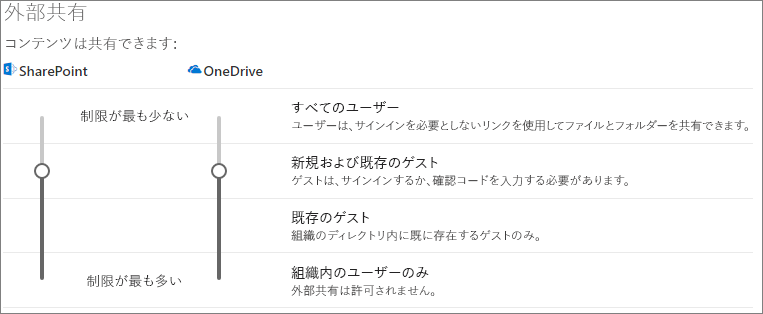
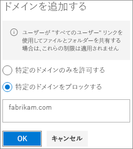

# ゲストと共有するときにファイルの偶発的な公開を制限する

ファイルやフォルダーをゲストと共有する場合、機密情報を誤って共有する可能性を減らすことができるさまざまなオプションがあります。 組織のニーズに合わせて、この記事のオプションから選択できます。

## [すべてのユーザー] リンクのベスト プラクティスを使用する

組織内のユーザーが認証されていない共有を行う必要があるが、認証されていないゲストがコンテンツを変更することを懸念している場合は、組織で認証されていない共有を行う方法のガイダンスについて、「[認証されていない共有のベスト プラクティス](best-practices-anonymous-sharing.md)」を参照してください。

## [すべてのユーザー] リンクをオフにする

適切なコンテンツに対して [*すべてのユーザー*] リンクを有効にしておくことをお勧めします。これは、共有の最も簡単な方法であり、ユーザーが IT 部門の管理外にある他のソリューションを求めるリスクを軽減できるためです。 [*すべてのユーザー*] リンクを他の人に転送できますが、リンクを持っているユーザーのみファイルへアクセスできます。

SharePoint、グループ、または Teams のコンテンツにアクセスするとき、ゲストに常に認証を要求する場合、[*すべてのユーザー*] 共有をオフにできます。 これにより、ユーザーは認証されていないコンテンツを共有することができなくなります。

[*すべてのユーザー*] リンクを無効にしても、ユーザーは [*特定のユーザー*] リンクを使用してゲストと簡単に共有できます。 この場合、すべてのゲストは、共有コンテンツにアクセスする前に認証を受ける必要があります。

ニーズに応じて、特定のサイトまたは組織全体の [*すべてのユーザー*] リンクを無効にできます。

組織の [*すべてのユーザー*] リンクをオフにするには
1. SharePoint 管理センターの左側のナビゲーションで、[**共有**] をクリックします。
2. SharePoint 外部共有設定を [**新規および既存のゲスト**] に設定します。 
   
3. [**保存**] をクリックします。

サイトの [*すべてのユーザー*] リンクをオフにするには
1. SharePoint 管理センターの左側のナビゲーションで、[**サイト**] を展開して [**アクティブなサイト**] をクリックします。
2. 作成したチームのサイトを選択します。
3. リボンで [**共有**] をクリックします。
4. 共有が [**新規および既存のゲスト**] に設定されていることを確認します。 
   
5. 変更を加えた場合は、[**保存**] をクリックします。

## ドメインのフィルター処理

ドメイン許可または拒否リストを使用して、ユーザーがゲストを招待できるドメインを決定できます。

許可リストを使用すると、組織内のユーザーがゲストを招待できるドメイン リストを指定できます。 他のドメインへのゲストの招待がブロックされます。 組織が特定のドメイン リストのゲストとのみ共同作業を行う場合、この機能を使用して他のドメインとの共有を防ぐことができます。

拒否リストを使用すると、組織内のユーザーがゲストを招待できないドメイン リストを指定できます。 リストのドメインへのゲストの招待がブロックされます。 これは、たとえば、組織内のゲストになることを避けたい競合他社がいる場合などに役立ちます。

許可リストと拒否リストは、認証されたゲストとの共有にのみ影響します。 禁止されたドメインのゲストは、無効にしていない場合は、[*すべてのユーザー*] リンクを使用して共有できます。 ドメインの許可リストと拒否リストで最良の結果を得るには、上記のように [*すべてのユーザー*] リンクを無効にすることを検討してください。

ゲスト共有用のドメイン許可リストまたは拒否リストを設定するには
1. SharePoint 管理センターの左側のナビゲーションで、[**共有**] をクリックします。
2. [**外部共有の詳細設定**] で、[**ドメインごとに外部共有を制限する**] チェックボックスをオンにします。
3. [**ドメインを追加**] をクリックします。
4. ドメインをブロックするかどうかを選択し、ドメインを入力して、[**OK**] をクリックします。 
   
5. [**保存**] をクリックします。

SharePoint および OneDrive よりも高いレベルでドメインによる共有を制限する場合、Azure Active Directory で「[B2B ユーザーに対する特定組織からの招待を許可またはブロック](https://docs.microsoft.com/azure/active-directory/b2b/allow-deny-list)」できます。 (これらの設定を SharePoint と OneDrive に反映させるには、[SharePoint および OneDrive の Azure AD B2B プレビューとの統合](https://docs.microsoft.com/sharepoint/sharepoint-azureb2b-integration-preview)を構成する必要があります。)

## ファイル、フォルダー、およびサイトのゲスト共有を特定のセキュリティ グループに制限する

ファイル、フォルダー、およびサイトのゲスト共有を特定のセキュリティ グループのメンバーに制限できます。 これは、ゲスト共有を有効にしたいが、承認ワークフローまたは要求プロセスを使用する場合に便利です。

セキュリティ グループのメンバーへのゲスト共有を制限するには
1. SharePoint 管理センターの左側のナビゲーションで、[**共有**] をクリックします。
2. [**その他の設定**] の下で、 [**外部共有を特定のセキュリティ グループに制限します**] に従います。
3. [**組織外のユーザーと共有できるユーザー**] の下で、チェックボックスの 1 つまたは両方を選択します。a. [**選択したセキュリティ グループ内のユーザーにのみ認証済み外部ユーザーとの共有を許可します**] で、認証済みユーザーと共有できるセキュリティ グループを指定します。b. [**選択したセキュリティ グループ内のユーザーにのみ、認証済み外部ユーザーとの共有および匿名リンクの使用を許可します**] で、[すべてのユーザー] リンクを使用して認証済みユーザーと共有できるセキュリティ グループを指定します。
4. [**OK**] をクリックします。

これは、ファイル、フォルダー、およびサイトに影響しますが、Office 365 グループまたは Teams には影響しません。 メンバーがゲストを非公開 Office 365 グループまたは Microsoft Teams の非公開チームに招待すると、招待は認証のためにグループまたはチームの所有者に送信されます。

## 関連項目

[セキュリティで保護されたゲスト共有の環境を作成する](create-a-secure-guest-sharing-environment.md)

[匿名ユーザーとファイルおよびフォルダーを共有するためのベスト プラクティス](best-practices-anonymous-sharing.md)