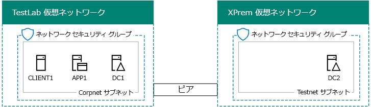
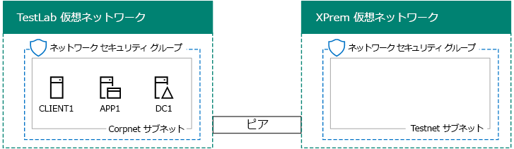

# <a name="simulated-cross-premises-virtual-network-in-azure"></a><span data-ttu-id="ab14a-103">Azure でのシミュレートされたクロスプレミスの仮想ネットワーク</span><span class="sxs-lookup"><span data-stu-id="ab14a-103">Simulated cross-premises virtual network in Azure</span></span>

 <span data-ttu-id="ab14a-104">**の概要:**Microsoft Azure で開発/テスト環境としてのシミュレーションの間、設置型の仮想ネットワークを作成します。</span><span class="sxs-lookup"><span data-stu-id="ab14a-104">**Summary:** Create a simulated cross-premises virtual network in Microsoft Azure as a dev/test environment.</span></span>
  
<span data-ttu-id="ab14a-p101">この記事では、2 つの Azure 仮想ネットワークを使用した、Microsoft Azure でのシミュレートされたハイブリッド クラウド環境の作成について順を追って説明します。最終的な構成は、次のようになります。  </span><span class="sxs-lookup"><span data-stu-id="ab14a-p101">This article steps you through creating a simulated hybrid cloud environment with Microsoft Azure using two Azure virtual networks. Here is the resulting configuration.</span></span> 
  

  
<span data-ttu-id="ab14a-108">これは Azure IaaS ハイブリッド クラウド運用環境をシミュレートするもので、次のもので構成されます。</span><span class="sxs-lookup"><span data-stu-id="ab14a-108">This simulates an Azure IaaS hybrid cloud production environment and consists of:</span></span>
  
- <span data-ttu-id="ab14a-109">	Azure 仮想ネットワークでホストされる、シミュレートおよび単純化されたオンプレミス ネットワーク (TestLab 仮想ネットワーク)。</span><span class="sxs-lookup"><span data-stu-id="ab14a-109">A simulated and simplified on-premises network hosted in an Azure virtual network (the TestLab virtual network).</span></span>
    
- <span data-ttu-id="ab14a-110">	Azure でホストされる、シミュレートされたクロスプレミスの仮想ネットワーク (XPrem)。</span><span class="sxs-lookup"><span data-stu-id="ab14a-110">A simulated cross-premises virtual network hosted in Azure (XPrem).</span></span>
    
- <span data-ttu-id="ab14a-111">	2 つの仮想ネットワーク間の VNet ピアリング関係。</span><span class="sxs-lookup"><span data-stu-id="ab14a-111">A VNet peering relationship between the two virtual networks.</span></span>
    
- <span data-ttu-id="ab14a-112">	XPrem 仮想ネットワークのセカンダリ ドメイン コントローラー。</span><span class="sxs-lookup"><span data-stu-id="ab14a-112">A secondary domain controller in the XPrem virtual network.</span></span>
    
<span data-ttu-id="ab14a-113">これは次のことを行うための基礎および共通の開始点となります。 </span><span class="sxs-lookup"><span data-stu-id="ab14a-113">This provides a basis and common starting point from which you can:</span></span> 
  
- <span data-ttu-id="ab14a-114">	シミュレートされた Azure IaaS ハイブリッド クラウド環境におけるアプリケーションの開発およびテスト。</span><span class="sxs-lookup"><span data-stu-id="ab14a-114">Develop and test applications in a simulated Azure IaaS hybrid cloud environment.</span></span>
    
- <span data-ttu-id="ab14a-115">	ハイブリッド クラウドベース IT ワークロードをシミュレートするための、コンピューターのテスト構成の作成 (TestLab 仮想ネットワーク内、および XPrem 仮想ネットワーク内)。</span><span class="sxs-lookup"><span data-stu-id="ab14a-115">Create test configurations of computers, some within the TestLab virtual network and some within the XPrem virtual network, to simulate hybrid cloud-based IT workloads.</span></span>
    
<span data-ttu-id="ab14a-116">次の 3 つの主要なフェーズを経て、この開発/テスト環境を設定します。</span><span class="sxs-lookup"><span data-stu-id="ab14a-116">There are three major phases to setting up this dev/test environment:</span></span>
  
1. <span data-ttu-id="ab14a-117">	TestLab 仮想ネットワークを構成します。</span><span class="sxs-lookup"><span data-stu-id="ab14a-117">Configure the TestLab virtual network.</span></span>
    
2. <span data-ttu-id="ab14a-118">クロスプレミスの仮想ネットワークを作成します。</span><span class="sxs-lookup"><span data-stu-id="ab14a-118">Create the cross-premises virtual network.</span></span>
    
3. <span data-ttu-id="ab14a-119">DC2 を構成します。</span><span class="sxs-lookup"><span data-stu-id="ab14a-119">Configure DC2.</span></span>
    
> [!NOTE]
> <span data-ttu-id="ab14a-120">この構成では、有料版の Azure サブスクリプションが必要です。</span><span class="sxs-lookup"><span data-stu-id="ab14a-120">This configuration requires a paid Azure subscription.</span></span> 
  

  
> [!TIP]
> <span data-ttu-id="ab14a-122">
            [ここ](http://aka.ms/catlgstack)をクリックして、One Microsoft Cloud のテスト ラボ ガイド スタックに含まれるすべての記事のビジュアル マップをご確認ください。</span><span class="sxs-lookup"><span data-stu-id="ab14a-122">Click [here](http://aka.ms/catlgstack) for a visual map to all the articles in the One Microsoft Cloud Test Lab Guide stack.</span></span>
  
## <a name="phase-1-configure-the-testlab-virtual-network"></a><span data-ttu-id="ab14a-123">フェーズ 1: TestLab 仮想ネットワークを構成する</span><span class="sxs-lookup"><span data-stu-id="ab14a-123">Phase 1: Configure the TestLab virtual network</span></span>

<span data-ttu-id="ab14a-124">[基本構成の開発/テスト環境](base-configuration-dev-test-environment.md)で、Azure 仮想ネットワークの名前付きテスト ラボに DC1、APP1、CLIENT1 コンピューターを構成する手順を使用します。</span><span class="sxs-lookup"><span data-stu-id="ab14a-124">Use the instructions in [Base Configuration dev/test environment](base-configuration-dev-test-environment.md) to configure the DC1, APP1, and CLIENT1 computers in the Azure virtual network named TestLab.</span></span>
  
<span data-ttu-id="ab14a-125">これは、現在の構成です。</span><span class="sxs-lookup"><span data-stu-id="ab14a-125">This is your current configuration.</span></span> 
  

  
## <a name="phase-2-create-the-xprem-virtual-network"></a><span data-ttu-id="ab14a-127">フェーズ 2: XPrem 仮想ネットワークを作成する</span><span class="sxs-lookup"><span data-stu-id="ab14a-127">Phase 2: Create the XPrem virtual network</span></span>

<span data-ttu-id="ab14a-128">このフェーズでは、新しい XPrem 仮想ネットワークを作成および構成し、それを VNet ピアリングで TestLab 仮想ネットワークに接続します。</span><span class="sxs-lookup"><span data-stu-id="ab14a-128">In this phase, you create and configure the new XPrem virtual network and then connect it to the TestLab virtual network with VNet peering.</span></span>
  
<span data-ttu-id="ab14a-129">最初に、ローカル コンピューターで Azure PowerShell プロンプトを起動します。</span><span class="sxs-lookup"><span data-stu-id="ab14a-129">First, start an Azure PowerShell prompt on your local computer.</span></span>
  
> [!NOTE]
> <span data-ttu-id="ab14a-p102">次のコマンド セットは、Azure の PowerShell の最新バージョンを使用します。[Azure の PowerShell コマンドレットの入門](https://docs.microsoft.com/en-us/powershell/azureps-cmdlets-docs/)を参照してください。</span><span class="sxs-lookup"><span data-stu-id="ab14a-p102">The following command sets use the latest version of Azure PowerShell. See [Get started with Azure PowerShell cmdlets](https://docs.microsoft.com/en-us/powershell/azureps-cmdlets-docs/).</span></span> 
  
<span data-ttu-id="ab14a-132">次のコマンドを使用して Azure アカウントにログインします。</span><span class="sxs-lookup"><span data-stu-id="ab14a-132">Sign in to your Azure account with the following command.</span></span>
  
```
Login-AzureRMAccount
```

> [!TIP]
> <span data-ttu-id="ab14a-133">クリックして[ここで](https://gallery.technet.microsoft.com/PowerShell-commands-for-7844edd0)すべての PowerShell コマンドは、この資料に含まれているテキスト ファイルを取得します。</span><span class="sxs-lookup"><span data-stu-id="ab14a-133">Click [here](https://gallery.technet.microsoft.com/PowerShell-commands-for-7844edd0) to get a text file that contains all of the PowerShell commands in this article.</span></span>
  
<span data-ttu-id="ab14a-134">次のコマンドを使用して、サブスクリプションの名前を取得します。</span><span class="sxs-lookup"><span data-stu-id="ab14a-134">Get your subscription name using the following command.</span></span>
  
```
Get-AzureRMSubscription | Sort Name | Select Name
```

<span data-ttu-id="ab14a-p103">Azure サブスクリプションを設定します。など、二重引用符内のすべてを交換して、\<と > 文字は、正しい名前を持つ。</span><span class="sxs-lookup"><span data-stu-id="ab14a-p103">Set your Azure subscription. Replace everything within the quotes, including the \< and > characters, with the correct names.</span></span>
  
```
$subscrName="<subscription name>"
Get-AzureRmSubscription -SubscriptionName $subscrName | Select-AzureRmSubscription
```

<span data-ttu-id="ab14a-137">次に、これらのコマンドを使用して、XPrem 仮想ネットワークを作成し、ネットワーク セキュリティ グループで保護します。</span><span class="sxs-lookup"><span data-stu-id="ab14a-137">Next, create the XPrem virtual network and protect it with a network security group with these commands.</span></span>
  
```
$rgName="<name of the resource group that you used for your TestLab virtual network>"
$locName=(Get-AzureRmResourceGroup -Name $rgName).Location
$Testnet=New-AzureRMVirtualNetworkSubnetConfig -Name "Testnet" -AddressPrefix 192.168.0.0/24
New-AzureRMVirtualNetwork -Name "XPrem" -ResourceGroupName $rgName -Location $locName -AddressPrefix 192.168.0.0/16 -Subnet $Testnet -DNSServer 10.0.0.4
$rule1=New-AzureRMNetworkSecurityRuleConfig -Name "RDPTraffic" -Description "Allow RDP to all VMs on the subnet" -Access Allow -Protocol Tcp -Direction Inbound -Priority 100 -SourceAddressPrefix Internet -SourcePortRange * -DestinationAddressPrefix * -DestinationPortRange 3389
New-AzureRMNetworkSecurityGroup -Name "Testnet" -ResourceGroupName $rgName -Location $locName -SecurityRules $rule1
$vnet=Get-AzureRMVirtualNetwork -ResourceGroupName $rgName -Name XPrem
$nsg=Get-AzureRMNetworkSecurityGroup -Name "Testnet" -ResourceGroupName $rgName
Set-AzureRMVirtualNetworkSubnetConfig -VirtualNetwork $vnet -Name "Testnet" -AddressPrefix 192.168.0.0/24 -NetworkSecurityGroup $nsg
```

<span data-ttu-id="ab14a-138">次に、これらのコマンドを使用して、TestLab と XPrem VNet 間の VNet ピアリング関係を作成します。</span><span class="sxs-lookup"><span data-stu-id="ab14a-138">Next, you create the VNet peering relationship between the TestLab and XPrem VNets with these commands.</span></span>
  
```
$rgName="<name of the resource group that you used for your TestLab virtual network>"
$vnet1=Get-AzureRmVirtualNetwork -ResourceGroupName $rgName -Name TestLab
$vnet2=Get-AzureRmVirtualNetwork -ResourceGroupName $rgName -Name XPrem
Add-AzureRmVirtualNetworkPeering -Name TestLab2XPrem -VirtualNetwork $vnet1 -RemoteVirtualNetworkId $vnet2.Id
Add-AzureRmVirtualNetworkPeering -Name XPrem2TestLab -VirtualNetwork $vnet2 -RemoteVirtualNetworkId $vnet1.Id
```

<span data-ttu-id="ab14a-139">これは、現在の構成です。</span><span class="sxs-lookup"><span data-stu-id="ab14a-139">This is your current configuration.</span></span> 
  

  
## <a name="phase-3-configure-dc2"></a><span data-ttu-id="ab14a-141">フェーズ 3: DC2 を構成する</span><span class="sxs-lookup"><span data-stu-id="ab14a-141">Phase 3: Configure DC2</span></span>

<span data-ttu-id="ab14a-142">このフェーズでは、XPrem 仮想ネットワークにおいて DC2 仮想マシンを作成し、それをレプリカ ドメイン コントローラーとして構成します。</span><span class="sxs-lookup"><span data-stu-id="ab14a-142">In this phase, you create the DC2 virtual machine in the XPrem virtual network and then configure it as a replica domain controller.</span></span>
  
<span data-ttu-id="ab14a-p104">まず、DC2 用の仮想マシンを作成します。自分のローカル コンピューターの Azure PowerShell コマンド プロンプトで、これらのコマンドを実行します。</span><span class="sxs-lookup"><span data-stu-id="ab14a-p104">First, create a virtual machine for DC2. Run these commands at the Azure PowerShell command prompt on your local computer.</span></span>
  
```
$rgName="<your resource group name>"
$locName=(Get-AzureRmResourceGroup -Name $rgName).Location
$vnet=Get-AzureRMVirtualNetwork -Name XPrem -ResourceGroupName $rgName
$pip=New-AzureRMPublicIpAddress -Name DC2-PIP -ResourceGroupName $rgName -Location $locName -AllocationMethod Dynamic
$nic=New-AzureRMNetworkInterface -Name DC2-NIC -ResourceGroupName $rgName -Location $locName -SubnetId $vnet.Subnets[0].Id -PublicIpAddressId $pip.Id -PrivateIpAddress 192.168.0.4
$vm=New-AzureRMVMConfig -VMName DC2 -VMSize Standard_A1
$cred=Get-Credential -Message "Type the name and password of the local administrator account for DC2."
$vm=Set-AzureRMVMOperatingSystem -VM $vm -Windows -ComputerName DC2 -Credential $cred -ProvisionVMAgent -EnableAutoUpdate
$vm=Set-AzureRMVMSourceImage -VM $vm -PublisherName MicrosoftWindowsServer -Offer WindowsServer -Skus 2016-Datacenter -Version "latest"
$vm=Add-AzureRMVMNetworkInterface -VM $vm -Id $nic.Id
$vm=Set-AzureRmVMOSDisk -VM $vm -Name "DC2-OS" -DiskSizeInGB 128 -CreateOption FromImage -StorageAccountType "StandardLRS"
$diskConfig=New-AzureRmDiskConfig -AccountType "StandardLRS" -Location $locName -CreateOption Empty -DiskSizeGB 20
$dataDisk1=New-AzureRmDisk -DiskName "DC2-DataDisk1" -Disk $diskConfig -ResourceGroupName $rgName
$vm=Add-AzureRmVMDataDisk -VM $vm -Name "DC2-DataDisk1" -CreateOption Attach -ManagedDiskId $dataDisk1.Id -Lun 1
New-AzureRMVM -ResourceGroupName $rgName -Location $locName -VM $vm
```

<span data-ttu-id="ab14a-145">次に、 [Azure ポータル](https://portal.azure.com)ローカル管理者のアカウント名とパスワードを使用してから新しい DC2 バーチャル マシンに接続します。</span><span class="sxs-lookup"><span data-stu-id="ab14a-145">Next, connect to the new DC2 virtual machine from the [Azure portal](https://portal.azure.com) using its local administrator account name and password.</span></span>
  
<span data-ttu-id="ab14a-p105">次に、Windows ファイアウォール ルールを構成して、基本的な接続テストのトラフィックを許可します。DC2 の管理者レベルの Windows PowerShell コマンド プロンプトから、これらのコマンドを実行します。 </span><span class="sxs-lookup"><span data-stu-id="ab14a-p105">Next, configure a Windows Firewall rule to allow traffic for basic connectivity testing. From an administrator-level Windows PowerShell command prompt on DC2, run these commands.</span></span> 
  
```
Set-NetFirewallRule -DisplayName "File and Printer Sharing (Echo Request - ICMPv4-In)" -enabled True
ping dc1.corp.contoso.com
```

<span data-ttu-id="ab14a-p106">ping コマンドを実行すると、IP アドレス 10.0.0.4 から 4 つの正常な応答があります。これは、VNet ピアリング関係間のトラフィックのテストです。 </span><span class="sxs-lookup"><span data-stu-id="ab14a-p106">The ping command should result in four successful replies from IP address 10.0.0.4. This is a test of traffic across the VNet peering relationship.</span></span> 
  
<span data-ttu-id="ab14a-150">DC2 上の Windows PowerShell コマンド プロンプトからこのコマンドを使用してドライブ文字 f: を持つ新しいボリュームとして余分なデータ ディスクを次に、追加します。</span><span class="sxs-lookup"><span data-stu-id="ab14a-150">Next, add the extra data disk as a new volume with the drive letter F: with this command from the Windows PowerShell command prompt on DC2.</span></span>
  
```
Get-Disk | Where PartitionStyle -eq "RAW" | Initialize-Disk -PartitionStyle MBR -PassThru | New-Partition -AssignDriveLetter -UseMaximumSize | Format-Volume -FileSystem NTFS -NewFileSystemLabel "WSAD Data"
```

<span data-ttu-id="ab14a-p107">次に corp.contoso.com ドメインのレプリカ ドメイン コントローラーとして DC2 を構成します。DC2 の Windows PowerShell コマンド プロンプトから次のコマンドを実行します。</span><span class="sxs-lookup"><span data-stu-id="ab14a-p107">Next, configure DC2 as a replica domain controller for the corp.contoso.com domain. Run these commands from the Windows PowerShell command prompt on DC2.</span></span>
  
```
Install-WindowsFeature AD-Domain-Services -IncludeManagementTools
Install-ADDSDomainController -Credential (Get-Credential CORP\\User1) -DomainName "corp.contoso.com" -InstallDns:$true -DatabasePath "F:\\NTDS" -LogPath "F:\\Logs" -SysvolPath "F:\\SYSVOL"
```

<span data-ttu-id="ab14a-153">CORP の両方を指定するように求められますことに注意してください\\User1 のパスワードとディレクトリ サービス復元モード (DSRM) のパスワードでは、DC2 を再起動するとします。</span><span class="sxs-lookup"><span data-stu-id="ab14a-153">Note that you are prompted to supply both the CORP\\User1 password and a Directory Services Restore Mode (DSRM) password, and to restart DC2.</span></span> 
  
<span data-ttu-id="ab14a-p108">XPrem 仮想ネットワーク独自の DNS サーバー (DC2) の準備が整ったので、この DNS サーバーを使用するよう XPrem 仮想ネットワークを構成する必要があります。自分のローカル コンピューターの Azure PowerShell コマンド プロンプトから、これらのコマンドを実行します。</span><span class="sxs-lookup"><span data-stu-id="ab14a-p108">Now that the XPrem virtual network has its own DNS server (DC2), you must configure the XPrem virtual network to use this DNS server. Run these commands from the Azure PowerShell command prompt on your local computer.</span></span>
  
```
$vnet=Get-AzureRmVirtualNetwork -ResourceGroupName $rgName -name "XPrem"
$vnet.DhcpOptions.DnsServers="192.168.0.4" 
Set-AzureRmVirtualNetwork -VirtualNetwork $vnet
Restart-AzureRmVM -ResourceGroupName $rgName -Name "DC2"
```

<span data-ttu-id="ab14a-p109">Azure ポータル、ローカル コンピューター上では、CORP を DC1 に接続\\User1 の資格情報です。コンピューターとユーザー認証のため、ローカル ドメイン コント ローラーを使用するように、CORP ドメインを構成するには、DC1 上で管理者レベルの Windows PowerShell コマンド プロンプトからこれらのコマンドを実行します。</span><span class="sxs-lookup"><span data-stu-id="ab14a-p109">From the Azure portal on your local computer, connect to DC1 with the CORP\\User1 credentials. To configure the CORP domain so that computers and users use their local domain controller for authentication, run these commands from an administrator-level Windows PowerShell command prompt on DC1.</span></span>
  
```
New-ADReplicationSite -Name "TestLab" 
New-ADReplicationSite -Name "XPrem"
New-ADReplicationSubnet -Name "10.0.0.0/8" -Site "TestLab"
New-ADReplicationSubnet -Name "192.168.0.0/16" -Site "XPrem"
```

<span data-ttu-id="ab14a-158">これは、現在の構成です。</span><span class="sxs-lookup"><span data-stu-id="ab14a-158">This is your current configuration.</span></span> 
  

  
<span data-ttu-id="ab14a-160">シミュレートされた Azure ハイブリッド クラウド環境をテストする準備ができました。</span><span class="sxs-lookup"><span data-stu-id="ab14a-160">Your simulated Azure hybrid cloud environment is now ready for testing.</span></span>
  
## <a name="next-step"></a><span data-ttu-id="ab14a-161">次の手順</span><span class="sxs-lookup"><span data-stu-id="ab14a-161">Next step</span></span>

<span data-ttu-id="ab14a-162">この開発/テスト環境を使用すると、 [Azure でホストされている SharePoint サーバー 2016年イントラネットのファーム](https://technet.microsoft.com/library/mt806351%28v=office.16%29.aspx)をシミュレートします。</span><span class="sxs-lookup"><span data-stu-id="ab14a-162">Use this dev/test environment to simulate a [SharePoint Server 2016 intranet farm hosted in Azure](https://technet.microsoft.com/library/mt806351%28v=office.16%29.aspx).</span></span>
  
## <a name="see-also"></a><span data-ttu-id="ab14a-163">関連項目</span><span class="sxs-lookup"><span data-stu-id="ab14a-163">See Also</span></span>

[<span data-ttu-id="ab14a-164">基本構成開発/テスト環境</span><span class="sxs-lookup"><span data-stu-id="ab14a-164">Base Configuration dev/test environment</span></span>](base-configuration-dev-test-environment.md)
  
[<span data-ttu-id="ab14a-165">Office 365 開発/テスト環境</span><span class="sxs-lookup"><span data-stu-id="ab14a-165">Office 365 dev/test environment</span></span>](office-365-dev-test-environment.md)
  
[<span data-ttu-id="ab14a-166">Office 365 開発/テスト環境の DirSync</span><span class="sxs-lookup"><span data-stu-id="ab14a-166">DirSync for your Office 365 dev/test environment</span></span>](dirsync-for-your-office-365-dev-test-environment.md)
  
[<span data-ttu-id="ab14a-167">Office 365 開発/テスト環境の Cloud App Security</span><span class="sxs-lookup"><span data-stu-id="ab14a-167">Cloud App Security for your Office 365 dev/test environment</span></span>](cloud-app-security-for-your-office-365-dev-test-environment.md)
  
[<span data-ttu-id="ab14a-168">Office 365 開発/テスト環境の Advanced Threat Protection</span><span class="sxs-lookup"><span data-stu-id="ab14a-168">Advanced Threat Protection for your Office 365 dev/test environment</span></span>](advanced-threat-protection-for-your-office-365-dev-test-environment.md)
  
[<span data-ttu-id="ab14a-169">クラウド導入およびハイブリッド ソリューション</span><span class="sxs-lookup"><span data-stu-id="ab14a-169">Cloud adoption and hybrid solutions</span></span>](cloud-adoption-and-hybrid-solutions.md)


