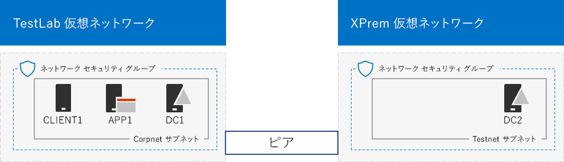
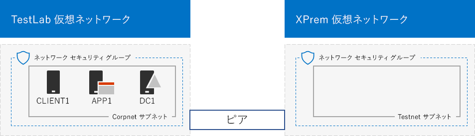

# <a name="simulated-cross-premises-virtual-network-in-azure"></a>Azure でのシミュレートされたクロスプレミスの仮想ネットワーク

 **概要:** 開発/テスト環境として、シミュレートされたクロスプレミスの仮想ネットワークを Microsoft Azure に作成します。
  
この記事では、2 つの Azure 仮想ネットワークを使用した、Microsoft Azure でのシミュレートされたハイブリッド クラウド環境の作成について順を追って説明します。最終的な構成は、次のようになります。 
  

  
これは Azure IaaS ハイブリッド クラウド運用環境をシミュレートするもので、次のもので構成されます。
  
- Azure 仮想ネットワークでホストされる、シミュレートおよび単純化されたオンプレミス ネットワーク (TestLab 仮想ネットワーク)。
    
- Azure でホストされる、シミュレートされたクロスプレミスの仮想ネットワーク (XPrem)。
    
- 2 つの仮想ネットワーク間の VNet ピアリング関係。
    
- XPrem 仮想ネットワークのセカンダリ ドメイン コントローラー。
    
これは次のことを行うための基礎および共通の開始点となります。 
  
- シミュレートされた Azure IaaS ハイブリッド クラウド環境におけるアプリケーションの開発およびテスト。
    
- ハイブリッド クラウドベース IT ワークロードをシミュレートするための、コンピューターのテスト構成の作成 (TestLab 仮想ネットワーク内、および XPrem 仮想ネットワーク内)。
    
次の 3 つの主要なフェーズを経て、この開発/テスト環境を設定します。
  
1. TestLab 仮想ネットワークを構成します。
    
2. クロスプレミスの仮想ネットワークを作成します。
    
3. DC2 を構成します。
    
> [!NOTE]
> この構成では、有料版の Azure サブスクリプションが必要です。 
  

  
> [!TIP]
> [ここ](http://aka.ms/catlgstack)をクリックして、Office 365 のテスト ラボ ガイド スタックに含まれるすべての記事のビジュアル マップを確認してください。
  
## <a name="phase-1-configure-the-testlab-virtual-network"></a>フェーズ 1: TestLab 仮想ネットワークを構成する

「[基本構成開発/テスト環境](base-configuration-dev-test-environment.md)」の手順により、TestLab という名前の Azure 仮想ネットワークに DC1、APP1、CLIENT1 コンピューターを構成します。
  
これは、現在の構成です。 
  

  
## <a name="phase-2-create-the-xprem-virtual-network"></a>フェーズ 2: XPrem 仮想ネットワークを作成する

このフェーズでは、新しい XPrem 仮想ネットワークを作成および構成し、それを VNet ピアリングで TestLab 仮想ネットワークに接続します。
  
最初に、ローカル コンピューターで Azure PowerShell プロンプトを起動します。
  
> [!NOTE]
> 次のコマンド セットは、Azure PowerShell の最新版を使用します。「[Azure の PowerShell コマンドレットを使う](https://docs.microsoft.com/ja-JP/powershell/azureps-cmdlets-docs/)」を参照してください。 
  
このコマンドを使用して Azure アカウントにサインインします。
  
```
Connect-AzAccount
```

<!--
> [!TIP]
> Click [here](https://gallery.technet.microsoft.com/PowerShell-commands-for-7844edd0) to get a text file that has all of the PowerShell commands in this article.
-->
  
このコマンドを使用して、サブスクリプションの名前を取得します。
  
```
Get-AzSubscription | Sort Name | Select Name
```

Azure サブスクリプションを設定します。二重引用符内のすべて (「\<」と「>」の文字を含む) を正しい名前に置き換えます。
  
```
$subscrName="<subscription name>"
Select-AzSubscription -SubscriptionName $subscrName
```

次に、これらのコマンドを使用して、XPrem 仮想ネットワークを作成し、ネットワーク セキュリティ グループで保護します。
  
```
$rgName="<name of the resource group that you used for your TestLab virtual network>"
$locName=(Get-AzResourceGroup -Name $rgName).Location
$Testnet=New-AzVirtualNetworkSubnetConfig -Name "Testnet" -AddressPrefix 192.168.0.0/24
New-AzVirtualNetwork -Name "XPrem" -ResourceGroupName $rgName -Location $locName -AddressPrefix 192.168.0.0/16 -Subnet $Testnet -DNSServer 10.0.0.4
$rule1=New-AzNetworkSecurityRuleConfig -Name "RDPTraffic" -Description "Allow RDP to all VMs on the subnet" -Access Allow -Protocol Tcp -Direction Inbound -Priority 100 -SourceAddressPrefix Internet -SourcePortRange * -DestinationAddressPrefix * -DestinationPortRange 3389
New-AzNetworkSecurityGroup -Name "Testnet" -ResourceGroupName $rgName -Location $locName -SecurityRules $rule1
$vnet=Get-AzVirtualNetwork -ResourceGroupName $rgName -Name XPrem
$nsg=Get-AzNetworkSecurityGroup -Name "Testnet" -ResourceGroupName $rgName
Set-AzVirtualNetworkSubnetConfig -VirtualNetwork $vnet -Name "Testnet" -AddressPrefix 192.168.0.0/24 -NetworkSecurityGroup $nsg
```

次に、これらのコマンドを使用して、TestLab と XPrem VNet 間の VNet ピアリング関係を作成します。
  
```
$rgName="<name of the resource group that you used for your TestLab virtual network>"
$vnet1=Get-AzVirtualNetwork -ResourceGroupName $rgName -Name TestLab
$vnet2=Get-AzVirtualNetwork -ResourceGroupName $rgName -Name XPrem
Add-AzVirtualNetworkPeering -Name TestLab2XPrem -VirtualNetwork $vnet1 -RemoteVirtualNetworkId $vnet2.Id
Add-AzVirtualNetworkPeering -Name XPrem2TestLab -VirtualNetwork $vnet2 -RemoteVirtualNetworkId $vnet1.Id
```

これは、現在の構成です。 
  

  
## <a name="phase-3-configure-dc2"></a>フェーズ 3: DC2 を構成する

このフェーズでは、XPrem 仮想ネットワークにおいて DC2 仮想マシンを作成し、それをレプリカ ドメイン コントローラーとして構成します。
  
まず、DC2 用の仮想マシンを作成します。自分のローカル コンピューターの Azure PowerShell コマンド プロンプトで、これらのコマンドを実行します。
  
```
$rgName="<your resource group name>"
$locName=(Get-AzResourceGroup -Name $rgName).Location
$vnet=Get-AzVirtualNetwork -Name XPrem -ResourceGroupName $rgName
$pip=New-AzPublicIpAddress -Name DC2-PIP -ResourceGroupName $rgName -Location $locName -AllocationMethod Dynamic
$nic=New-AzNetworkInterface -Name DC2-NIC -ResourceGroupName $rgName -Location $locName -SubnetId $vnet.Subnets[0].Id -PublicIpAddressId $pip.Id -PrivateIpAddress 192.168.0.4
$vm=New-AzVMConfig -VMName DC2 -VMSize Standard_A1
$cred=Get-Credential -Message "Type the name and password of the local administrator account for DC2."
$vm=Set-AzVMOperatingSystem -VM $vm -Windows -ComputerName DC2 -Credential $cred -ProvisionVMAgent -EnableAutoUpdate
$vm=Set-AzVMSourceImage -VM $vm -PublisherName MicrosoftWindowsServer -Offer WindowsServer -Skus 2016-Datacenter -Version "latest"
$vm=Add-AzVMNetworkInterface -VM $vm -Id $nic.Id
$vm=Set-AzVMOSDisk -VM $vm -Name "DC2-OS" -DiskSizeInGB 128 -CreateOption FromImage -StorageAccountType "Standard_LRS"
$diskConfig=New-AzDiskConfig -AccountType "Standard_LRS" -Location $locName -CreateOption Empty -DiskSizeGB 20
$dataDisk1=New-AzDisk -DiskName "DC2-DataDisk1" -Disk $diskConfig -ResourceGroupName $rgName
$vm=Add-AzVMDataDisk -VM $vm -Name "DC2-DataDisk1" -CreateOption Attach -ManagedDiskId $dataDisk1.Id -Lun 1
New-AzVM -ResourceGroupName $rgName -Location $locName -VM $vm
```

次に、ローカル管理者のアカウント名とパスワードを使用して、[Azure portal](https://portal.azure.com) から新しい DC2 仮想マシンに接続します。
  
次に、Windows ファイアウォール ルールを構成して、基本的な接続テストのトラフィックを許可します。DC2 の管理者レベルの Windows PowerShell コマンド プロンプトから、これらのコマンドを実行します。 
  
```
Set-NetFirewallRule -DisplayName "File and Printer Sharing (Echo Request - ICMPv4-In)" -enabled True
ping dc1.corp.contoso.com
```

ping コマンドを実行すると、IP アドレス 10.0.0.4 から 4 つの正常な応答があります。これは、VNet ピアリング関係間のトラフィックのテストです。 
  
次に、DC2 の Windows PowerShell コマンド プロンプトから次のコマンドを使用して、新しいボリュームとして別のデータ ディスクをドライブ文字 F: で追加します。
  
```
Get-Disk | Where PartitionStyle -eq "RAW" | Initialize-Disk -PartitionStyle MBR -PassThru | New-Partition -AssignDriveLetter -UseMaximumSize | Format-Volume -FileSystem NTFS -NewFileSystemLabel "WSAD Data"
```

次に corp.contoso.com ドメインのレプリカ ドメイン コントローラーとして DC2 を構成します。DC2 の Windows PowerShell コマンド プロンプトから次のコマンドを実行します。
  
```
Install-WindowsFeature AD-Domain-Services -IncludeManagementTools
Install-ADDSDomainController -Credential (Get-Credential CORP\User1) -DomainName "corp.contoso.com" -InstallDns:$true -DatabasePath "F:\NTDS" -LogPath "F:\Logs" -SysvolPath "F:\SYSVOL"
```

CORP\\User1 パスワードおよびディレクトリ サービス復元モード (DSRM) パスワードの両方の入力、ならびに DC2 の再起動が必要となる点に注意してください。 
  
XPrem 仮想ネットワーク独自の DNS サーバー (DC2) の準備が整ったので、この DNS サーバーを使用するよう XPrem 仮想ネットワークを構成する必要があります。自分のローカル コンピューターの Azure PowerShell コマンド プロンプトから、これらのコマンドを実行します。
  
```
$vnet=Get-AzVirtualNetwork -ResourceGroupName $rgName -name "XPrem"
$vnet.DhcpOptions.DnsServers="192.168.0.4" 
Set-AzVirtualNetwork -VirtualNetwork $vnet
Restart-AzVM -ResourceGroupName $rgName -Name "DC2"
```

ローカル コンピューター上の Azure portal から、CORP\\User1 の資格情報を使用して DC1 に接続します。コンピューターおよびユーザーがローカルのドメイン コントローラーを使用して認証を行うように CORP ドメインを構成するには、DC1 の管理者レベルの Windows PowerShell コマンド プロンプトから次のコマンドを実行します。
  
```
New-ADReplicationSite -Name "TestLab" 
New-ADReplicationSite -Name "XPrem"
New-ADReplicationSubnet -Name "10.0.0.0/8" -Site "TestLab"
New-ADReplicationSubnet -Name "192.168.0.0/16" -Site "XPrem"
```

これは、現在の構成です。 
  

  
シミュレートされた Azure ハイブリッド クラウド環境をテストする準備ができました。
  
## <a name="next-step"></a>次の手順

この開発/テスト環境を使用して、[Azure でホストされる SharePoint Server 2016 イントラネット ファーム](https://technet.microsoft.com/library/mt806351%28v=office.16%29.aspx)をシミュレートします。
  
## <a name="see-also"></a>関連項目

[基本構成開発/テスト環境](base-configuration-dev-test-environment.md)
  
[Office 365 開発/テスト環境](office-365-dev-test-environment.md)
  
[Office 365 開発/テスト環境の DirSync](dirsync-for-your-office-365-dev-test-environment.md)
  
[Office 365 開発/テスト環境の Cloud App Security](cloud-app-security-for-your-office-365-dev-test-environment.md)
  
[Office 365 開発/テスト環境の Advanced Threat Protection](advanced-threat-protection-for-your-office-365-dev-test-environment.md)
  
[クラウド導入およびハイブリッド ソリューション](cloud-adoption-and-hybrid-solutions.md)


