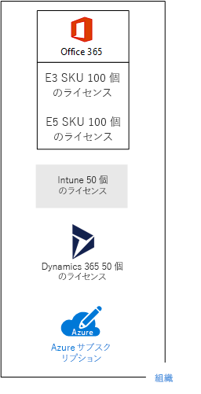
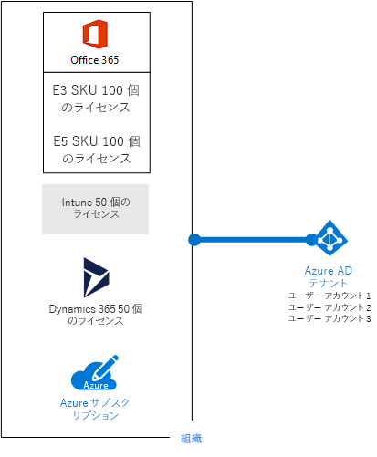

# マイクロソフトのクラウド プランのサブスクリプション、ライセンス、アカウント、およびテナントSubscriptions, licenses, accounts, and tenants for Microsoft's cloud offerings

 **概要:** Microsoft のクラウド プラン全体に渡る組織、サブスクリプション、ライセンス、ユーザー アカウント、およびテナントの関係について理解します。**Summary:** Understand the relationships of organizations, subscriptions, licenses, user accounts, and tenants across Microsoft's cloud offerings.
  
Microsoft は、クラウド プラン全体で ID の使用と課金の一貫性を維持するために、組織、サブスクリプション、ライセンス、ユーザー アカウントなどの階層を提供しています。Microsoft provides a hierarchy of organizations, subscriptions, licenses, and user accounts for consistent use of identities and billing across its cloud offerings:
  
- Microsoft Office 365Microsoft Office 365
    
    詳細については、「[ビジネス プランと価格](https://products.office.com/business/compare-office-365-for-business-plans)」を参照してください。See [business plans and pricing](https://products.office.com/business/compare-office-365-for-business-plans) for more information.
    
- Microsoft AzureMicrosoft Azure
    
    詳細については、「[Azure の価格](https://azure.microsoft.com/pricing/)」を参照してください。See [Azure pricing](https://azure.microsoft.com/pricing/) for more information.
    
- Microsoft Intune および Enterprise Mobility + Security (EMS)Microsoft Intune and the Enterprise Mobility + Security (EMS)
    
    詳細については、「[Intune の価格](https://www.microsoft.com/cloud-platform/microsoft-intune-pricing)」を参照してください。See [Intune pricing](https://www.microsoft.com/cloud-platform/microsoft-intune-pricing) for more information.
    
- Microsoft Dynamics 365Microsoft Dynamics 365
    
    詳細については、「[Dynamics 365 の価格](https://dynamics.microsoft.com/)」を参照してください。See [Dynamics 365 pricing](https://dynamics.microsoft.com/) for more information.
    
## 階層の要素Elements of the hierarchy

階層の要素を以下に示します。Here are the elements of the hierarchy:
  
### 組織Organization

組織は、Microsoft クラウド製品を使用しているビジネス エンティティを表します。通常は、1 つ以上のパブリック ドメイン ネーム システム (DNS) のドメイン名 (例: contoso.com) で識別されます。組織は、サブスクリプションのコンテナーになります。An organization represents a business entity that is using Microsoft cloud offerings, typically identified by one or more public Domain Name System (DNS) domain names, such as contoso.com. The organization is a container for subscriptions.
  
### サブスクリプションSubscriptions

サブスクリプションとは、1 つ以上の Microsoft クラウドのプラットフォームやサービスを使用するための Microsoft との契約のことです。この契約では、ユーザー単位のライセンス料またはクラウドベースのリソース消費量に基づいた課金が発生します。Microsoft のサービスとしてのソフトウェア (SaaS) ベースのクラウド プラン (Office 365、Intune/EMS、および Dynamics 365) は、ユーザー ライセンス料が課金されます。Microsoft のサービスとしてのプラットフォーム (PaaS) およびサービスとしてのインフラストラクチャ (IaaS) クラウド プラン (Azure) は、クラウド リソース消費量に基づいた課金が発生します。A subscription is an agreement with Microsoft to use one or more Microsoft cloud platforms or services, for which charges accrue based on either a per-user license fee or on cloud-based resource consumption. Microsoft's Software as a Service (SaaS)-based cloud offerings (Office 365, Intune/EMS, and Dynamics 365) charge per-user license fees. Microsoft's Platform as a Service (PaaS) and Infrastructure as a Service (IaaS) cloud offerings (Azure) charge based on cloud resource consumption.
  
試用版サブスクリプションを使用することもできます。ただし、このサブスクリプションは、特定の期間を過ぎるか、特定の消費料金を超えると失効します。試用版サブスクリプションは、有料サブスクリプションに変更できます。You can also use a trial subscription, but the subscription expires after a specific amount of time or consumption charges. You can convert a trial subscription to a paid subscription.
  
組織は、Microsoft のクラウド プランの複数のサブスクリプションを所有できます。図 1 は一例を示しています。Organizations can have multiple subscriptions for Microsoft's cloud offerings. Figure 1 shows an example.
  
**図 1: 1 つの組織に複数のサブスクリプションの例****Figure 1: Example of multiple subscriptions for an organization**

  
図 1 は、複数の Office 365 サブスクリプション、1 つの Intune サブスクリプション、1 つの Dynamics 365 サブスクリプション、複数の Azure サブスクリプションを持つ単一の組織を示しています。Figure 1 shows a single organization that has multiple Office 365 subscriptions, an Intune subscription, a Dynamics 365 subscription, and multiple Azure subscriptions.
  
### ライセンスLicenses

Microsoft の SaaS クラウド プランの場合、1 つのライセンスで、1 つの特定のユーザー アカウントがクラウド プランのサービスを使用できるようになります。サブスクリプションの一環として、月間の固定料金が課金されます。管理者は、サブスクリプション内で個別のユーザー アカウントにライセンスを割り当てます。図 2 の例では、Contoso Corporation は 100 ライセンスの Office 365 Enterprise E5 サブスクリプションを所有しています。このサブスクリプションにより、最大 100 件の個別のユーザー アカウントが Enterprise E5 の機能とサービスを使用できるようになります。For Microsoft's SaaS cloud offerings, a license allows a specific user account to use the services of the cloud offering. You are charged a fixed monthly fee as part of your subscription. Administrators assign licenses to individual user accounts in the subscription. For the example in Figure 2, the Contoso Corporation has an Office 365 Enterprise E5 subscription with 100 licenses, which allows to up to 100 individual user accounts to use Enterprise E5 features and services.
  
**図 2:1 つの組織の SaaS ベースのサブスクリプションに含まれるライセンス****Figure 2: Licenses within the SaaS-based subscriptions for an organization**

  
Azure PaaS ベースのクラウド サービスの場合、サービス料金にソフトウェア ライセンスが組み込まれています。  For Azure PaaS-based cloud services, software licenses are built into the service pricing.
  
Azure IaaS ベースの仮想マシン場合、仮想マシン イメージにインストールしたソフトウェアまたはアプリケーションを使用するために、追加ライセンスが必要になることがあります。一部の仮想マシン イメージにはライセンス付きバージョンのソフトウェアがインストールされていて、サーバーに対する分単位の料金が費用に含まれます。その例として、SQL Server 2014 および SQL Server 2016 の仮想マシン イメージが挙げられます。For Azure IaaS-based virtual machines, additional licenses to use the software or application installed on a virtual machine image might be required. Some virtual machine images have licensed versions of software installed and the cost is included in the per-minute rate for the server. Examples are the virtual machine images for SQL Server 2014 and SQL Server 2016. 
  
一部の仮想マシン イメージには、アプリケーションの試用版がインストールされていて、試用期間の経過後も使用する場合は追加のソフトウェア アプリケーション ライセンスが必要になります。たとえば、SharePoint Server 2016 試用版仮想マシン イメージには、プレインストールされた試用版の SharePoint Server 2016 が含まれています。試用期間後に SharePoint Server 2016 の使用を続けるには、SharePoint Server 2016 のライセンスとクライアントのライセンスを Microsoft から購入する必要があります。こうした課金は Azure サブスクリプションとは別であり、仮想マシンを実行する分単位の料金がそのまま適用されます。Some virtual machine images have trial versions of applications installed and need additional software application licenses for use beyond the trial period. For example, the SharePoint Server 2016 Trial virtual machine image includes a trial version of SharePoint Server 2016 pre-installed. To continue using SharePoint Server 2016 after the trail expiration date, you must purchase a SharePoint Server 2016 license and client licenses from Microsoft. These charges are separate from the Azure subscription and the per-minute rate to run the virtual machine still applies.
  
### ユーザー アカウントUser accounts

すべての Microsoft のクラウド プランのユーザー アカウントは、Azure Active Directory (AD) テナントに保存されます。これには、ユーザー アカウントとグループが含まれます。Azure AD テナントは、Windows サーバーベースのサービスである Azure AD Connect を使用して、既存の Active Directory Domain Services (AD DS) アカウントと同期できます。これは、ディレクトリ同期 (DirSync) と呼ばれます。User accounts for all of Microsoft's cloud offerings are stored in an Azure Active Directory (AD) tenant, which contains user accounts and groups. An Azure AD tenant can be synchronized with your existing Active Directory Domain Services (AD DS) accounts using Azure AD Connect, a Windows server-based service. This is known as directory synchronization (DirSync).
  
図 3 は、共通の Azure AD テナントを使用する組織の複数サブスクリプションの例を示しています。このテナントに組織のアカウントが格納されています。Figure 3 shows an example of multiple subscriptions of an organization using a common Azure AD tenant that contains the organization's accounts.
  
**図 3:同じ Azure AD テナントを使用する組織の複数のサブスクリプション****Figure 3: Multiple subscriptions of an organization that use the same Azure AD tenant**

  
### テナントTenants

SaaS クラウド商品の場合、テナントとはクラウド サービスを提供しているサーバーが収容された地域の場所のことです。たとえば、Contoso Corporation は、パリ本社の 15,000 人の従業員用の Office 365、EMS、および Dynamics 365 テナントのホストに欧州地域を選択しています。For SaaS cloud offerings, the tenant is the regional location that houses the servers providing cloud services. For example, the Contoso Corporation chose the European region to host its Office 365, EMS, and Dynamics 365 tenants for the 15,000 workers in their Paris headquarters.
  
Azure PaaS サービスと、Azure IaaS でホストされる仮想マシン ベースのワークロードは、世界中の Azure データセンターのテナントを持つことができます。場所と呼ばれる Azure データセンターは、Azure PaaS のアプリやサービスまたは IaaS ワークロードの要素を作成するときに、ユーザーが指定します。Azure PaaS services and virtual machine-based workloads hosted in Azure IaaS can have tenancy in any Azure datacenter across the world. You specify the Azure datacenter, known as the location, when you create the Azure PaaS app or service or element of an IaaS workload.
  
Azure AD テナントは、アカウントおよびグループを収容する Azure AD の特定のインスタンスです。Office 365、Dynamics 365、または Intune/EMS の有料または試用版サブスクリプションには、無料の Azure AD テナントが含まれています。この Azure AD テナントには、その他の Azure サービスは含まれていません。これは、Azure の試用版または有料のサブスクリプションと同じものではありません。An Azure AD tenant is a specific instance of Azure AD containing accounts and groups. Paid or trial subscriptions of Office 365, Dynamics 365, or Intune/EMS include a free Azure AD tenant. This Azure AD tenant does not include other Azure services and is not the same as an Azure trial or paid subscription.
  
### 階層の概要Summary of the hierarchy

ここに、簡単なまとめを示します。Here is a quick recap:
  
- 1 つの組織には複数のサブスクリプションを含めることができるAn organization can have multiple subscriptions
    
  - 1 つのサブスクリプションには複数のライセンスを含めることができるA subscription can have multiple licenses
    
  - ライセンスは個別のユーザー アカウントに割り当てできるLicenses can be assigned to individual user accounts
    
  - ユーザー アカウントは Azure AD テナントに保存できるUser accounts are stored in an Azure AD tenant
    
組織、サブスクリプション、ライセンス、ユーザー アカウントの関係の例を示します。Here is an example of the relationship of organizations, subscriptions, licenses, and user accounts:
  
- パブリック ドメイン名によって識別される組織。An organization identified by its public domain name.
    
  - ユーザー ライセンスがある Office 365 Enterprise E3 サブスクリプション。An Office 365 Enterprise E3 subscription with user licenses.
    
    ユーザー ライセンスがある Office 365 Enterprise E5 サブスクリプション。An Office 365 Enterprise E5 subscription with user licenses.
    
    ユーザー ライセンスがある EMS サブスクリプション。An EMS subscription with user licenses.
    
    ユーザー ライセンスがある Dynamics 365 サブスクリプション。A Dynamics 365 subscription with user licenses.
    
    複数の Azure サブスクリプション。Multiple Azure subscriptions.
    
  - 共通の Azure AD テナントにある組織のユーザー アカウント。The organization's user accounts in a common Azure AD tenant.
    
複数の Microsoft クラウド プランのサブスクリプションは、同じ Azure AD テナントを使用できます。このテナントは、共通 ID プロバイダーとして機能します。オンプレミスの AD DS の同期されたアカウントを収容する中央 Azure AD テナントを使用すると、クラウドをベースとしたサービスとしての ID (IDaaS) が組織に提供されます。これを図 4 に示します。Multiple Microsoft cloud offering subscriptions can use the same Azure AD tenant that acts as a common identity provider. A central Azure AD tenant that contains the synchronized accounts of your on-premises AD DS provides cloud-based Identity as a Service (IDaaS) for your organization. This is shown in Figure 4.
  
**図 4: 同期されたオンプレミスのアカウントと組織の IDaaS****Figure 4: Synchronized on-premises accounts and IDaaS for an organization**

  
図 4 は、Microsoft の SaaS クラウド プラン、Azure PaaS アプリ、Azure AD Domain Services を使用する Azure IaaS の仮想マシンにより、共通の Azure AD テナントがどのように使用されるかを示します。Azure AD Connect は、オンプレミスの AD DS フォレストを Azure AD テナントと同期します。Figure 4 shows how a common Azure AD tenant is used by Microsoft's SaaS cloud offerings, Azure PaaS apps, and virtual machines in Azure IaaS that use Azure AD Domain Services. Azure AD Connect synchronizes the on-premises AD DS forest with the Azure AD tenant.
  
Microsoft のクラウド オファリング間の ID 統合に関する詳細は、「[エンタープライズ アーキテクトのための Microsoft クラウド ID](https://aka.ms/cloudarchidentity)」を参照してください。For more information about identity integration across Microsoft's cloud offerings, see [Microsoft Cloud Identity for Enterprise Architects](https://aka.ms/cloudarchidentity).
  
## 複数の Microsoft クラウド プランのサブスクリプションの組み合わせCombining subscriptions for multiple Microsoft cloud offerings

次の表では、既に所有している 1 つの種類のクラウド商品のサブスクリプション (最初の列に列挙したラベル) と、追加する別の種類のクラウド商品のサブスクリプション (列間を横切る) に基づいた、複数の Microsoft クラウド商品の可能な組み合わせ方法について説明しています。The following table describes how you can combine multiple Microsoft cloud offerings based on already having a subscription for one type of cloud offering (the labels going down the first column) and adding a subscription for a different cloud offering (going across the columns).
  
||**Office 365****Office 365**|**Azure****Azure**|**Intune/EMS****Intune/EMS**|**Dynamics 365****Dynamics 365**|
|:-----|:-----|:-----|:-----|:-----|
|**Office 365****Office 365**   |該当なしNA    |Azure ポータルから Azure のサブスクリプションを組織に追加します。You add an Azure subscription to your organization from the Azure portal.    |Microsoft 365 管理センターから Intune/EMS のサブスクリプションを組織に追加します。You add an Intune/EMS subscription to your organization from the Microsoft 365 admin center.    |Microsoft 365 管理センターから Dynamics 365 のサブスクリプションを組織に追加します。You add a Dynamics 365 subscription to your organization from the Microsoft 365 admin center.    |
|**Azure****Azure**   |Office 365 のサブスクリプションを組織に追加します。You add an Office 365 subscription to your organization.    |該当なしNA    |Intune/EMS サブスクリプションを組織に追加します。You add an Intune/EMS subscription to your organization.    |Dynamics 365 サブスクリプションを組織に追加します。You add a Dynamics 365 subscription to your organization.    |
|**Intune/EMS****Intune/EMS**   |Office 365 のサブスクリプションを組織に追加します。You add an Office 365 subscription to your organization.    |Azure ポータルから Azure のサブスクリプションを組織に追加します。You add an Azure subscription to your organization from the Azure portal.    |該当なしNA    |Dynamics 365 サブスクリプションを組織に追加します。You add a Dynamics 365 subscription to your organization.    |
|**Dynamics 365****Dynamics 365**   |Office 365 のサブスクリプションを組織に追加します。You add an Office 365 subscription to your organization.    |Azure ポータルから Azure のサブスクリプションを組織に追加します。You add an Azure subscription to your organization from the Azure portal.    |Intune/EMS サブスクリプションを組織に追加します。You add an Intune/EMS subscription to your organization.    |該当なしNA    |
   
Microsoft SaaS ベース サービスの場合は、Office 365 管理センターを使用すると、組織にサブスクリプションを簡単に追加できます。An easy way to add subscriptions to your organization for Microsoft SaaS-based services is through the Office 365 Admin center:
  
1. 全体管理者アカウントを使用して、Microsoft 365 管理センター ([https://admin.microsoft.com](https://admin.microsoft.com)) にサインインします。Sign in to the Microsoft 365 admin center ([https://admin.microsoft.com](https://admin.microsoft.com)) with your global administrator account.
    
2. **管理センター**のホームページ左側にあるナビゲーションで、**[課金]**、**[サービスを購入する]** の順にクリックします。From the left navigation of the **Admin center** home page, click **Billing**, and then **Purchase services**.
    
3. **[サービスを購入する]** ページで、新しいサブスクリプションを購入します。On the **Purchase services** page, purchase your new subscriptions.
    
Office 365 管理センターは、Office 365 サブスクリプションの組織と Azure AD テナントを SaaS ベースのクラウド製品の新しいサブスクリプションに割り当てます。The Office 365 Admin center assigns the organization and Azure AD tenant of your Office 365 subscription to the new subscriptions for SaaS-based cloud offerings.
  
Office 365 サブスクリプションと同じ組織および Azure AD テナントに Azure サブスクリプションを追加するにはTo add an Azure subscription with the same organization and Azure AD tenant as your Office 365 subscription:
  
1. Office 365 全体管理者アカウントを使用して、Azure portal ([https://portal.azure.com](https://portal.azure.com)) にサインインします。Sign in to the Azure portal ([https://portal.azure.com](https://portal.azure.com)) with your Office 365 global administrator account.
    
2. 左側のナビゲーションで、**[サブスクリプション]**、**[追加]** の順にクリックします。In the left navigation, click **Subscriptions**, and then click **Add**.
    
3. **[サブスクリプションの追加]** ページでプランを選択し、支払情報を記入して契約します。On the **Add subscription** page, select an offer and complete the payment information and agreement.
    
Azure と Office 365 のサブスクリプションを個別に購入済みで、Azure サブスクリプションから Office 365 の Azure AD テナントへのアクセスを希望する場合は、「[Office 365 テナントを Azure サブスクリプションと関連付ける](https://channel9.msdn.com/Series/Microsoft-Azure-Tutorials/Associate-an-Office-365-tenant-with-an-Azure-subscription)」の説明を参照してください。If you purchased Azure and Office 365 subscriptions separately and want to access the Office 365 Azure AD tenant from your Azure subscription, see the instructions in [Associate an Office 365 tenant with an Azure subscription](https://channel9.msdn.com/Series/Microsoft-Azure-Tutorials/Associate-an-Office-365-tenant-with-an-Azure-subscription).
  
## 関連項目See Also

[Microsoft クラウド IT アーキテクチャのリソースMicrosoft Cloud IT architecture resources](microsoft-cloud-it-architecture-resources.md)
  
[クラウド導入のテスト ラボ ガイド (TLG)Cloud adoption Test Lab Guides (TLGs)](cloud-adoption-test-lab-guides-tlgs.md)
  
[SharePoint、Exchange、Skype for Business、Lync のアーキテクチャ モデルArchitectural models for SharePoint, Exchange, Skype for Business, and Lync](architectural-models-for-sharepoint-exchange-skype-for-business-and-lync.md)
  
[ハイブリッド ソリューションHybrid solutions](hybrid-solutions.md)
  
