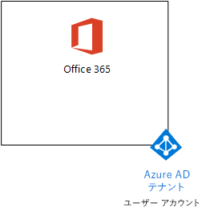
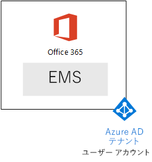
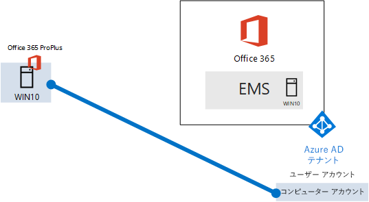

# <a name="the-microsoft-365-enterprise-devtest-environment"></a><span data-ttu-id="22fdf-103">Microsoft 365 Enterprise 開発/テスト環境</span><span class="sxs-lookup"><span data-stu-id="22fdf-103">The Microsoft 365 Enterprise dev/test environment</span></span>

 <span data-ttu-id="22fdf-104">**の概要:**このテスト ラボ ガイド 』 を使用すると、Office 365 の E5 とエンタープライズ モビリティ + セキュリティ (EMS) E5 と 10 企業の Windows を実行するコンピューターを含む、開発/テスト環境を作成できます。</span><span class="sxs-lookup"><span data-stu-id="22fdf-104">**Summary:** Use this Test Lab Guide to create a dev/test environment that includes Office 365 E5, Enterprise Mobility + Security (EMS) E5, and a computer running Windows 10 Enterprise.</span></span>
  
<span data-ttu-id="22fdf-105">この資料は、 [Microsoft 365 エンタープライズ](https://www.microsoft.com/microsoft-365/enterprise)の機能をテストするのにはシンプルな環境を作成する手順を提供します。</span><span class="sxs-lookup"><span data-stu-id="22fdf-105">This article provides you with step-by-step instructions to create a simplified environment to test the features and functionality of [Microsoft 365 Enterprise](https://www.microsoft.com/microsoft-365/enterprise).</span></span>
  
## <a name="phase-1-create-your-office-365-e5-subscription"></a><span data-ttu-id="22fdf-106">フェーズ 1: Office 365 E5 サブスクリプションを作成する</span><span class="sxs-lookup"><span data-stu-id="22fdf-106">Phase 1: Create your Office 365 E5 subscription</span></span>

<span data-ttu-id="22fdf-107">図 1 に示すように、Office 365 の軽量の開発/テスト環境を作成するには、フェーズ 2 と[Office 365 の開発/テスト環境](office-365-dev-test-environment.md)の第 3 段階の手順を実行します。</span><span class="sxs-lookup"><span data-stu-id="22fdf-107">Follow the steps in Phase 2 and Phase 3 of the [Office 365 dev/test environment](office-365-dev-test-environment.md) to create a lightweight Office 365 dev/test environment, as shown in Figure 1.</span></span>
  
<span data-ttu-id="22fdf-108">**図 1: Azure Active Directory (AD) のテナントとユーザー アカウントを Office 365 の E5 サブスクリプション**</span><span class="sxs-lookup"><span data-stu-id="22fdf-108">**Figure 1: Your Office 365 E5 subscription with its Azure Active Directory (AD) tenant and user accounts**</span></span>



> [!NOTE]
> <span data-ttu-id="22fdf-p101">Office 365 の E5 の試用版サブスクリプションは、60 日間を簡単に拡張可能な 30 日間です。永続的な開発/テスト環境では、作成新しい有料サブスクリプションのライセンスの数が少ない。</span><span class="sxs-lookup"><span data-stu-id="22fdf-p101">The Office 365 E5 trial subscription is 30 days, which can be easily extended to 60 days. For a permanent dev/test environment, create a new paid subscription with a small number of licenses.</span></span> 
  
## <a name="phase-2-add-ems"></a><span data-ttu-id="22fdf-112">フェーズ 2: EMS を追加する</span><span class="sxs-lookup"><span data-stu-id="22fdf-112">Phase 2: Add EMS</span></span>

<span data-ttu-id="22fdf-113">このフェーズでは、EMS E5 試用版サブスクリプションにサインアップして、Office 365 E5 試用版サブスクリプションと同じ組織に追加します。</span><span class="sxs-lookup"><span data-stu-id="22fdf-113">In this phase, you sign up for the EMS E5 trial subscription and add it to the same organization as your Office 365 E5 trial subscription.</span></span>
  
<span data-ttu-id="22fdf-114">まず、EMS の E5 の試用版サブスクリプションを追加し、EMS のライセンスをグローバル管理者アカウントに割り当てます。</span><span class="sxs-lookup"><span data-stu-id="22fdf-114">First, add the EMS E5 trial subscription and assign an EMS license to your global administrator account.</span></span>
  
1. <span data-ttu-id="22fdf-p102">プライベートのインターネット ブラウザーのインスタンスを表示するには、グローバル管理者アカウントの資格情報を使用して、Office 365 ポータルにサインインします。ヘルプについては、 [Office 365 にサインインするための場所](https://support.office.com/Article/Where-to-sign-in-to-Office-365-e9eb7d51-5430-4929-91ab-6157c5a050b4)を参照してください。</span><span class="sxs-lookup"><span data-stu-id="22fdf-p102">With a private instance of an Internet browser, sign in to the Office 365 portal with your global administrator account credentials. For help, see [Where to sign in to Office 365](https://support.office.com/Article/Where-to-sign-in-to-Office-365-e9eb7d51-5430-4929-91ab-6157c5a050b4).</span></span>
    
2. <span data-ttu-id="22fdf-117">
            **[管理]** タイルをクリックします。</span><span class="sxs-lookup"><span data-stu-id="22fdf-117">Click the **Admin** tile.</span></span>
    
3. <span data-ttu-id="22fdf-118">ブラウザーの **[Office 管理センター]** タブの左側のナビゲーションで **[請求] > [サービスを購入する]** の順にクリックします。</span><span class="sxs-lookup"><span data-stu-id="22fdf-118">On the **Office Admin center** tab in your browser, in the left navigation, click **Billing > Purchase services**.</span></span>
    
4. <span data-ttu-id="22fdf-p103">**[サービスを購入]** ページで、 **[Enterprise Mobility + Security E5]** 項目を探します。その項目の上にマウス ポインターを移動させ、 **[無料試用版を起動する]** をクリックします。</span><span class="sxs-lookup"><span data-stu-id="22fdf-p103">On the **Purchase services** page, find the **Enterprise Mobility + Security E5** item. Hover your mouse pointer over it and click **Start free trial**.</span></span>
    
5. <span data-ttu-id="22fdf-121">**[注文の確認]** ページで、 **[今すぐ実行]** をクリックします。</span><span class="sxs-lookup"><span data-stu-id="22fdf-121">On the **Confirm your order** page, click **Try now**.</span></span>
    
6. <span data-ttu-id="22fdf-122">**[注文の受領書]** ページで、**[続行]** をクリックします。</span><span class="sxs-lookup"><span data-stu-id="22fdf-122">On the **Order receipt** page, click **Continue**.</span></span>
    
7. <span data-ttu-id="22fdf-123">ブラウザーの **[Office 365 管理センター]** タブの左側のナビゲーションで **[ユーザー] > [アクティブなユーザー]** の順にクリックします。</span><span class="sxs-lookup"><span data-stu-id="22fdf-123">On the **Office 365 Admin center** tab in your browser, in the left navigation, click **Users > Active users**.</span></span>
    
8. <span data-ttu-id="22fdf-124">全体管理者アカウントをクリックしてから、 **[製品ライセンス]** で **[編集]** をクリックします。</span><span class="sxs-lookup"><span data-stu-id="22fdf-124">Click your global administrator account, and then click **Edit** for **Product licenses**.</span></span>
    
9. <span data-ttu-id="22fdf-125">**[製品ライセンス]** ウィンドウで、 **Enterprise Mobility + Security E5** の製品ライセンスを **[オン]** にして、 **[保存]** をクリックしてから、 **[閉じる]** を 2 回クリックします。</span><span class="sxs-lookup"><span data-stu-id="22fdf-125">On the **Product licenses** pane, turn the product license for **Enterprise Mobility + Security E5** to **On**, click **Save,** and then click **Close** twice.</span></span>
    
> [!NOTE]
> <span data-ttu-id="22fdf-p104">Enterprise Mobility + Security E5 試用版サブスクリプションの試用期間は 90 日間です。永続的な開発/テスト環境では、少数のライセンスを使用して新しい有料サブスクリプションを作成します。</span><span class="sxs-lookup"><span data-stu-id="22fdf-p104">The Enterprise Mobility + Security E5 trial subscription is 90 days. For a permanent dev/test environment, create a new paid subscription with a small number of licenses.</span></span> 
  
 <span data-ttu-id="22fdf-128">***の第 3 段階を完了する場合、***[Office 365 の開発/テスト環境](office-365-dev-test-environment.md)手順 8 と 9 の前の手順のすべての他のアカウント (ユーザー 2、3 のユーザー、ユーザー 4、およびユーザーの 5)。</span><span class="sxs-lookup"><span data-stu-id="22fdf-128">***If you completed Phase 3 of the*** [Office 365 dev/test environment](office-365-dev-test-environment.md), repeat steps 8 and 9 of the previous procedure for all of your other accounts (User 2, User 3, User 4, and User 5).</span></span>
  
<span data-ttu-id="22fdf-129">開発/テスト環境には、以下が含まれるようになりました。</span><span class="sxs-lookup"><span data-stu-id="22fdf-129">Your dev/test environment now has:</span></span>
  
- <span data-ttu-id="22fdf-130">Office 365 E5 エンタープライズおよび EMS E5 試用版サブスクリプションはユーザー アカウントの一覧と同じ Azure AD テナントの共有します。</span><span class="sxs-lookup"><span data-stu-id="22fdf-130">Office 365 E5 Enterprise and EMS E5 trial subscriptions sharing the same Azure AD tenant with your list of user accounts.</span></span>
- <span data-ttu-id="22fdf-131">Office 365 の E5 と E5 の EMS を使用するのには、すべての適切なユーザー アカウント (グローバル管理者のみまたはすべての 5 つのユーザー アカウント) が有効になります。</span><span class="sxs-lookup"><span data-stu-id="22fdf-131">All your appropriate user accounts (either just the global administrator or all five user accounts) are enabled to use Office 365 E5 and EMS E5.</span></span>
    
<span data-ttu-id="22fdf-132">図 2 は、EMS が追加された結果的な構成を示しています。</span><span class="sxs-lookup"><span data-stu-id="22fdf-132">Figure 2 shows your resulting configuration, which adds EMS.</span></span>
  
<span data-ttu-id="22fdf-133">**図 2: EMS の試用版サブスクリプションを追加します。**</span><span class="sxs-lookup"><span data-stu-id="22fdf-133">**Figure 2: Adding the EMS trial subscription**</span></span>


  
## <a name="phase-3-create-a-windows-10-enterprise-computer"></a><span data-ttu-id="22fdf-135">フェーズ 3:Windows 10 Enterprise コンピューターを作成する</span><span class="sxs-lookup"><span data-stu-id="22fdf-135">Phase 3: Create a Windows 10 Enterprise computer</span></span>

<span data-ttu-id="22fdf-136">このフェーズでは、Windows 10 Enterprise を実行するスタンドアロン コンピューターを作成します。</span><span class="sxs-lookup"><span data-stu-id="22fdf-136">In this phase, you create a standalone computer running Windows 10 Enterprise.</span></span>
  
### <a name="physical-computer"></a><span data-ttu-id="22fdf-137">物理コンピューター</span><span class="sxs-lookup"><span data-stu-id="22fdf-137">Physical computer</span></span>

<span data-ttu-id="22fdf-p105">パーソナル コンピューターを取得し、10 企業の Windows をインストールします。10 企業の Windows 試用版[は、ここ](https://www.microsoft.com/evalcenter/evaluate-windows-10-enterprise)をダウンロードできます。</span><span class="sxs-lookup"><span data-stu-id="22fdf-p105">Obtain a personal computer and install Windows 10 Enterprise on it. You can download the Windows 10 Enterprise trial [here](https://www.microsoft.com/evalcenter/evaluate-windows-10-enterprise).</span></span>
  
### <a name="virtual-machine"></a><span data-ttu-id="22fdf-140">仮想マシン</span><span class="sxs-lookup"><span data-stu-id="22fdf-140">Virtual machine</span></span>

<span data-ttu-id="22fdf-p106">好みのハイパーバイザーを使用して仮想マシンを作成し、10 企業の Windows をインストールします。10 企業の Windows 試用版[は、ここ](https://www.microsoft.com/evalcenter/evaluate-windows-10-enterprise)をダウンロードできます。</span><span class="sxs-lookup"><span data-stu-id="22fdf-p106">Create a virtual machine using the hypervisor of your choice and install Windows 10 Enterprise on it. You can download the Windows 10 Enterprise trial [here](https://www.microsoft.com/evalcenter/evaluate-windows-10-enterprise).</span></span>
  
### <a name="virtual-machine-in-azure"></a><span data-ttu-id="22fdf-143">Azure での仮想マシン</span><span class="sxs-lookup"><span data-stu-id="22fdf-143">Virtual machine in Azure</span></span>

<span data-ttu-id="22fdf-p107">***Visual Studio ベースのサブスクリプションを持つ必要があります***、Windows の 10 企業のイメージへのアクセスを持っている、Microsoft Azure で 10 の Windows 仮想マシンを作成します。Azure サブスクリプションの場合、試用版と有料のサブスクリプションなどの他の種類では、このイメージへのアクセスを必要はありません。</span><span class="sxs-lookup"><span data-stu-id="22fdf-p107">To create a Windows 10 virtual machine in Microsoft Azure, ***you must have a Visual Studio-based subscription***, which has access to the image for Windows 10 Enterprise. Other types of Azure subscriptions, such as trial and paid subscriptions, do not have access to this image.</span></span>
  
> [!NOTE]
> <span data-ttu-id="22fdf-p108">次のコマンド セットは、Azure の PowerShell の最新バージョンを使用します。[Azure の PowerShell コマンドレットの入門](https://docs.microsoft.com/powershell/azureps-cmdlets-docs/)を参照してください。WIN10 とすべてのリソース グループ、ストレージ アカウント、および仮想ネットワークを含め、必要なインフラストラクチャは、これらのコマンド セットのビルド 10 企業の Windows 仮想マシンの名前。Azure インフラストラクチャ サービスに慣れている場合は、展開済みのインフラストラクチャに合わせて、次の手順に対応してください。</span><span class="sxs-lookup"><span data-stu-id="22fdf-p108">The following command sets use the latest version of Azure PowerShell. See [Get started with Azure PowerShell cmdlets](https://docs.microsoft.com/powershell/azureps-cmdlets-docs/). These command sets build a Windows 10 Enterprise virtual machine named WIN10 and all of its required infrastructure, including a resource group, a storage account, and a virtual network. If you are already familiar with Azure infrastructure services, please adapt these instructions to suit your currently deployed infrastructure.</span></span> 
  
<span data-ttu-id="22fdf-150">最初に、Microsoft PowerShell プロンプトを起動します。</span><span class="sxs-lookup"><span data-stu-id="22fdf-150">First, start a Microsoft PowerShell prompt.</span></span>
  
<span data-ttu-id="22fdf-151">次のコマンドを使用して Azure アカウントにログインします。</span><span class="sxs-lookup"><span data-stu-id="22fdf-151">Sign in to your Azure account with the following command.</span></span>
  
```
Login-AzureRMAccount
```

<span data-ttu-id="22fdf-152">次のコマンドを使用して、サブスクリプションの名前を取得します。</span><span class="sxs-lookup"><span data-stu-id="22fdf-152">Get your subscription name using the following command.</span></span>
  
```
Get-AzureRMSubscription | Sort Name | Select Name
```

<span data-ttu-id="22fdf-p109">Azure サブスクリプションを設定します。など、二重引用符内のすべてを交換して、\<と > 正しい名前の文字です。</span><span class="sxs-lookup"><span data-stu-id="22fdf-p109">Set your Azure subscription. Replace everything within the quotes, including the \< and > characters, with the correct name.</span></span>
  
```
$subscr="<subscription name>"
Get-AzureRmSubscription -SubscriptionName $subscr | Select-AzureRmSubscription
```

<span data-ttu-id="22fdf-p110">次に、新しいリソース グループを作成します。一意のリソース グループ名を決定するには、このコマンドを使用して既存のリソース グループを一覧表示します。</span><span class="sxs-lookup"><span data-stu-id="22fdf-p110">Next, create a new resource group. To determine a unique resource group name, use this command to list your existing resource groups.</span></span>
  
```
Get-AzureRMResourceGroup | Sort ResourceGroupName | Select ResourceGroupName
```

<span data-ttu-id="22fdf-p111">これらのコマンドを使用して、新しいリソース グループを作成します。など、二重引用符内のすべてを交換して、\<と > 文字は、正しい名前を持つ。</span><span class="sxs-lookup"><span data-stu-id="22fdf-p111">Create your new resource group with these commands. Replace everything within the quotes, including the \< and > characters, with the correct names.</span></span>
  
```
$rgName="<resource group name>"
$locName="<location name, such as West US>"
New-AzureRMResourceGroup -Name $rgName -Location $locName
```

<span data-ttu-id="22fdf-p112">次に、これらのコマンドを使用して新しい仮想ネットワークと WIN10 仮想マシンを作成します。ダイアログ ボックスが表示されたら、WIN10 の名前とローカル管理者アカウントのパスワードを指定し、これらを安全な場所に保存します。</span><span class="sxs-lookup"><span data-stu-id="22fdf-p112">Next, you create a new virtual network and the WIN10 virtual machine with these commands. When prompted, provide the name and password of the local administrator account for WIN10 and store these in a secure location.</span></span>
  
```
$corpnetSubnet=New-AzureRMVirtualNetworkSubnetConfig -Name Corpnet -AddressPrefix 10.0.0.0/24
New-AzureRMVirtualNetwork -Name "M365Ent-TestLab" -ResourceGroupName $rgName -Location $locName -AddressPrefix 10.0.0.0/8 -Subnet $corpnetSubnet
$rule1=New-AzureRMNetworkSecurityRuleConfig -Name "RDPTraffic" -Description "Allow RDP to all VMs on the subnet" -Access Allow -Protocol Tcp -Direction Inbound -Priority 100 -SourceAddressPrefix Internet -SourcePortRange * -DestinationAddressPrefix * -DestinationPortRange 3389
New-AzureRMNetworkSecurityGroup -Name Corpnet -ResourceGroupName $rgName -Location $locName -SecurityRules $rule1
$vnet=Get-AzureRMVirtualNetwork -ResourceGroupName $rgName -Name "M365Ent-TestLab"
$nsg=Get-AzureRMNetworkSecurityGroup -Name Corpnet -ResourceGroupName $rgName
Set-AzureRMVirtualNetworkSubnetConfig -VirtualNetwork $vnet -Name Corpnet -AddressPrefix "10.0.0.0/24" -NetworkSecurityGroup $nsg
$pip=New-AzureRMPublicIpAddress -Name WIN10-PIP -ResourceGroupName $rgName -Location $locName -AllocationMethod Dynamic
$nic=New-AzureRMNetworkInterface -Name WIN10-NIC -ResourceGroupName $rgName -Location $locName -SubnetId $vnet.Subnets[0].Id -PublicIpAddressId $pip.Id
$vm=New-AzureRMVMConfig -VMName WIN10 -VMSize Standard_D1_V2
$cred=Get-Credential -Message "Type the name and password of the local administrator account for WIN10."
$vm=Set-AzureRMVMOperatingSystem -VM $vm -Windows -ComputerName WIN10 -Credential $cred -ProvisionVMAgent -EnableAutoUpdate
$vm=Set-AzureRMVMSourceImage -VM $vm -PublisherName MicrosoftWindowsDesktop -Offer Windows-10 -Skus RS3-Pro -Version "latest"
$vm=Add-AzureRMVMNetworkInterface -VM $vm -Id $nic.Id
$vm=Set-AzureRmVMOSDisk -VM $vm -Name WIN10-TestLab-OSDisk -DiskSizeInGB 128 -CreateOption FromImage -StorageAccountType "StandardLRS"
New-AzureRMVM -ResourceGroupName $rgName -Location $locName -VM $vm
```

## <a name="phase-4-join-your-windows-10-computer-to-azure-ad"></a><span data-ttu-id="22fdf-161">フェーズ 4:Windows 10 のコンピューターを Azure AD に参加させる</span><span class="sxs-lookup"><span data-stu-id="22fdf-161">Phase 4: Join your Windows 10 computer to Azure AD</span></span>

<span data-ttu-id="22fdf-162">物理または仮想マシンで Windows の 10 のエンタープライズを作成すると後、は、ローカルの管理者アカウントでサインインします。</span><span class="sxs-lookup"><span data-stu-id="22fdf-162">After the physical or virtual machine with Windows 10 Enterprise is created, sign in with a local administrator account.</span></span>
  
> [!NOTE]
> <span data-ttu-id="22fdf-p113">Azure のバーチャル マシンでは、[次の手順](https://docs.microsoft.com/azure/virtual-machines/windows/connect-logon)を使用して接続します。ローカル管理者アカウントの資格情報でサインインします。</span><span class="sxs-lookup"><span data-stu-id="22fdf-p113">For a virtual machine in Azure, connect to it using [these instructions](https://docs.microsoft.com/azure/virtual-machines/windows/connect-logon). Sign in with the credentials of the local administrator account.</span></span> 
  
<span data-ttu-id="22fdf-165">次に、WIN10 コンピューターを Office 365 と EMS のサブスクリプションの Azure AD テナントに参加させます。</span><span class="sxs-lookup"><span data-stu-id="22fdf-165">Next, join the WIN10 computer to the Azure AD tenant of your Office 365 and EMS subscriptions.</span></span>
  
1. <span data-ttu-id="22fdf-166">WIN10 コンピューターのデスクトップをクリックして**スタート > 設定 > アカウント > アクセス職場または学校 > 接続**。</span><span class="sxs-lookup"><span data-stu-id="22fdf-166">At the desktop of the WIN10 computer, click **Start > Settings > Accounts > Access work or school > Connect**.</span></span>
    
2. <span data-ttu-id="22fdf-167">**職場または学校のアカウントの設定**] ダイアログ ボックスでは、 **Azure Active Directory には、このデバイスへの参加**をクリックします。</span><span class="sxs-lookup"><span data-stu-id="22fdf-167">In the **Set up a work or school account** dialog box, click **Join this device to Azure Active Directory**.</span></span>
    
3. <span data-ttu-id="22fdf-168">**作業や学校のアカウント**、Office 365 サブスクリプションのグローバル管理者アカウント名を入力し、[**次へ**] をクリックします。</span><span class="sxs-lookup"><span data-stu-id="22fdf-168">In **Work or school account**, type the global administrator account name of your Office 365 subscription, and then click **Next**.</span></span>
    
4. <span data-ttu-id="22fdf-169">**パスワードの入力**の場合は、グローバル管理者アカウントのパスワードを入力し、し、[**サインイン**] をクリックします。</span><span class="sxs-lookup"><span data-stu-id="22fdf-169">In **Enter password**, type the password for your global administrator account, and then click **Sign in**.</span></span>
    
5. <span data-ttu-id="22fdf-170">組織は、このことを確認するメッセージが表示されたら**に参加**する] をクリックし、し、[**完了**] をクリックします。</span><span class="sxs-lookup"><span data-stu-id="22fdf-170">When prompted to make sure this is your organization, click **Join**, and then click **Done**.</span></span>
    
6. <span data-ttu-id="22fdf-171">[設定] ウィンドウを閉じます。</span><span class="sxs-lookup"><span data-stu-id="22fdf-171">Close the settings window.</span></span>
    
<span data-ttu-id="22fdf-172">WIN10 コンピューター上で Office 2016 を次に、インストールします。</span><span class="sxs-lookup"><span data-stu-id="22fdf-172">Next, install Office 2016 on the WIN10 computer.</span></span>
  
1. <span data-ttu-id="22fdf-p114">マイクロソフトのエッジのブラウザーが開き、グローバル管理者アカウントの資格情報を使用して、Office 365 ポータルにサインインします。ヘルプについては、 [Office 365 にサインインするための場所](https://support.office.com/Article/Where-to-sign-in-to-Office-365-e9eb7d51-5430-4929-91ab-6157c5a050b4)を参照してください。</span><span class="sxs-lookup"><span data-stu-id="22fdf-p114">Open the Microsoft Edge browser and sign in to the Office 365 portal with your global administrator account credentials. For help, see [Where to sign in to Office 365](https://support.office.com/Article/Where-to-sign-in-to-Office-365-e9eb7d51-5430-4929-91ab-6157c5a050b4).</span></span>
    
2. <span data-ttu-id="22fdf-175">**Microsoft Office ホーム**] タブ、[ **Office 2016 のインストール**] をクリックします。</span><span class="sxs-lookup"><span data-stu-id="22fdf-175">On the **Microsoft Office Home** tab, click **Install Office 2016**.</span></span>
    
3. <span data-ttu-id="22fdf-176">どのようなメッセージが表示されたら**を実行**] をクリックし、**ユーザー アカウント制御**の [**はい**] をクリックします。</span><span class="sxs-lookup"><span data-stu-id="22fdf-176">When prompted with what to do, click **Run**, and then click **Yes** for **User Account Control**.</span></span>
    
4. <span data-ttu-id="22fdf-p115">Office のインストールを完了するまで待機します。参照してください**準備ができました!**、2 回 [**閉じる**] をクリックします。</span><span class="sxs-lookup"><span data-stu-id="22fdf-p115">Wait for Office to complete its installation. When you see **You're all set!**, click **Close** twice.</span></span>
    
<span data-ttu-id="22fdf-179">図 3 は、Office 365 と EMS のサブスクリプションの Azure AD テナントに参加した WIN10 コンピューターの様子を含め、結果的な環境を示しています。</span><span class="sxs-lookup"><span data-stu-id="22fdf-179">Figure 3 shows your resulting environment, which includes the WIN10 computer that has joined the Azure AD tenant of your Office 365 and EMS subscriptions.</span></span>
  
<span data-ttu-id="22fdf-180">**図 3: Azure AD テナントに WIN10 のコンピューター アカウントを追加します。**</span><span class="sxs-lookup"><span data-stu-id="22fdf-180">**Figure 3: Adding the WIN10 computer account to the Azure AD tenant**</span></span>


  
<span data-ttu-id="22fdf-182">[Microsoft 365 エンタープライズ](https://www.microsoft.com/microsoft-365/enterprise)の他の機能を実験する準備が整いました。</span><span class="sxs-lookup"><span data-stu-id="22fdf-182">You are now ready to experiment with additional features of [Microsoft 365 Enterprise](https://www.microsoft.com/microsoft-365/enterprise).</span></span>
  
## <a name="next-steps"></a><span data-ttu-id="22fdf-183">次の手順</span><span class="sxs-lookup"><span data-stu-id="22fdf-183">Next steps</span></span>

<span data-ttu-id="22fdf-184">Microsoft 365 Enterprise の機能について確認するには、これらの追加記事を使用します。</span><span class="sxs-lookup"><span data-stu-id="22fdf-184">Use these additional articles to explore features of Microsoft 365 Enterprise:</span></span>
  
- [<span data-ttu-id="22fdf-185">モバイル アプリケーション管理 (MAM) ポリシーを追加します。</span><span class="sxs-lookup"><span data-stu-id="22fdf-185">Add mobile application management (MAM) policies</span></span>](https://technet.microsoft.com/library/mt764059.aspx)
    
- [<span data-ttu-id="22fdf-186">IOS および Android のデバイスを登録します。</span><span class="sxs-lookup"><span data-stu-id="22fdf-186">Enroll iOS and Android devices</span></span>](https://technet.microsoft.com/library/mt743077.aspx)
    
- [<span data-ttu-id="22fdf-187">構成および高度なセキュリティ管理のテスト</span><span class="sxs-lookup"><span data-stu-id="22fdf-187">Configure and test Advanced Security Management</span></span>](https://technet.microsoft.com/library/mt757250.aspx)
    
- [<span data-ttu-id="22fdf-188">構成および高度な脅威保護をテストします。</span><span class="sxs-lookup"><span data-stu-id="22fdf-188">Configure and test Advanced Threat Protection</span></span>](https://technet.microsoft.com/library/mt490479.aspx)
    
## <a name="see-also"></a><span data-ttu-id="22fdf-189">Concepts</span><span class="sxs-lookup"><span data-stu-id="22fdf-189">See Also</span></span>

- [<span data-ttu-id="22fdf-190">Microsoft 365 エンタープライズ ドキュメント</span><span class="sxs-lookup"><span data-stu-id="22fdf-190">Microsoft 365 Enterprise documentation</span></span>](https://docs.microsoft.com/microsoft-365-enterprise/)
- [<span data-ttu-id="22fdf-191">Microsoft 365 エンタープライズを展開します。</span><span class="sxs-lookup"><span data-stu-id="22fdf-191">Deploy Microsoft 365 Enterprise</span></span>](https://docs.microsoft.com/microsoft-365/enterprise/deploy-microsoft-365-enterprise)
- [<span data-ttu-id="22fdf-192">1 つのマイクロソフトのクラウド開発/テスト環境</span><span class="sxs-lookup"><span data-stu-id="22fdf-192">The One Microsoft Cloud dev/test environment</span></span>](the-one-microsoft-cloud-dev-test-environment.md)
- [<span data-ttu-id="22fdf-193">クラウド導入のテスト ラボ ガイド (TLG)</span><span class="sxs-lookup"><span data-stu-id="22fdf-193">Cloud adoption Test Lab Guides (TLGs)</span></span>](cloud-adoption-test-lab-guides-tlgs.md)
