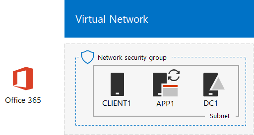

# One Microsoft Cloud 開発/テスト環境

 **概要:** このテスト ラボ ガイドを使用して、Microsoft のクラウド サービスすべてを含む開発/テスト環境を作成します。
  
この記事の手順に従い、Microsoft Azure インフラストラクチャ サービスでシミュレートされたイントラネットを作成し、Microsoft Office 365、Microsoft Enterprise Mobility + Security (EMS)、Microsoft Dynamics 365 のサブスクリプションを追加します。その結果として、1 つの開発/テスト環境で Microsoft のクラウド サービスすべてを同時に使用する、シンプルな組織になります。  
  

  
最終的な構成を、次の目的に使用できます。
  
- Azure Active Directory (AD) で提供される共通 ID インフラストラクチャなどの、Microsoft のクラウド サービス間の統合を体験します。
    
- 複数の Microsoft Cloud のサービスを含む、エンド ツー エンドのシナリオを評価します。
    
- 複数の Microsoft Cloud のサービスを使用する、デモ、概念実証、開発/テスト構成などを作成します。
    
- プロフェッショナルな開発のため、Microsoft Cloud のスキルを構築します。
    
## フェーズ 1: シミュレートされたイントラネットを作成し、Office 365 を追加する

「[Office 365 開発/テスト環境の DirSync](dirsync-for-your-office-365-dev-test-environment.md)」の説明に従います。
  
図 1 は、作成した構成に、Office 365 および Azure インフラストラクチャ サービスで実行されるシミュレートされたイントラネットと、オンプレミスの Active Directory ドメイン サービス (AD DS) フォレストからのディレクトリ同期が含まれることを示しています。
  
**図 1: Azure でシミュレートされたイントラネットと Office 365**

  
> [!NOTE]
> Azure 試用版は 30 日間有効です。Office 365 Enterprise E5 の試用版サブスクリプションは 30 日間有効ですが、追加で 30 日間、簡単に延長できます。永続的な開発/テスト環境では、少数のライセンスを使用して新しい有料 Azure サブスクリプション、および新しい有料 Office 365 Enterprise E5 サブスクリプションを作成します。 
  
## フェーズ 2: EMS を追加する

このフェーズでは、EMS 試用版サブスクリプションにサインアップして、Office 365 試用版サブスクリプションと同じ組織に追加します。
  
1. デスクトップ コンピューターのブラウザーまたは CLIENT1 のブラウザーのいずれかを使用して、全体管理者アカウントの資格情報で Office 365 ポータル ([https://www.office.com](https://www.office.com)) にサインインします。
    
2. **[管理]** タイルをクリックします。
    
3. ブラウザーの **[Office 管理センター]** タブの左側のナビゲーションで **[請求] > [サービスを購入する]** の順にクリックします。
    
4. **[サービスを購入]** ページで、 **[Enterprise Mobility + Security E5]** 項目を探します。その項目の上にマウス ポインターを移動させ、 **[無料試用版を起動する]** をクリックします。
    
5. **[注文の確認]** ページで、 **[今すぐ実行]** をクリックします。
    
6. **[注文の受領書]** ページで、**[続行]** をクリックします。
    
> [!NOTE]
> Enterprise Mobility + Security E5 試用版サブスクリプションの試用期間は 90 日間です。永続的な開発/テスト環境では、少数のライセンスを使用して新しい有料サブスクリプションを作成します。 
  
次に、すべてのユーザー アカウントに対して Enterprise Mobility + Security E5 ライセンスを有効にします。
  
1. ブラウザーの **[Office 365 管理センター]** タブの左側のナビゲーションで **[ユーザー] > [アクティブなユーザー]** の順にクリックします。
    
2. 全体管理者アカウントをクリックしてから、 **[製品ライセンス]** で **[編集]** をクリックします。
    
3. **[製品ライセンス]** ウィンドウで、 **Enterprise Mobility + Security E5** の製品ライセンスを **[オン]** にして、 **[保存]** をクリックしてから、 **[閉じる]** を 2 回クリックします。
    
4. 他のすべてのアカウント (User1、User 2、User 3、User 4、User 5) に対して、手順 2 と 3 を実行します。
    
開発/テスト環境には、以下が含まれるようになりました。
  
- Azure インフラストラクチャ サービスで実行されるシミュレートされたイントラネット。
    
- Office 365 E5 Enterprise と EMS の試用版サブスクリプションが、ユーザー アカウントの一覧と同じ組織および同じ Azure AD テナントを共有している。
    
- すべてのユーザー アカウントで Office 365 E5 Enterprise と EMS が使用可能になっている。
    
図 2 は、EMS が追加された結果的な構成を示しています。
  
**図 2: Azure でシミュレートされたイントラネットと、Office 365 および EMS**

  
## フェーズ 3: Dynamics 365 を追加する

このフェーズでは、Dynamics 365 試用版サブスクリプションにサインアップして、Office 365 と EMS の試用版サブスクリプションと同じ組織に追加します。
  
1. デスクトップ コンピューターのブラウザーまたは CLIENT1 のブラウザーのいずれかを使用して、全体管理者アカウントの資格情報で Office 365 ポータル ([https://www.office.com](https://www.office.com)) にサインインします。
    
2. 
            **[管理]** タイルをクリックします。
    
3. **[Microsoft 365 管理センター]** タブの左側のナビゲーションで **[請求]、[サービスを購入する]** の順にクリックします。
    
4. **[サービスを購入]** ページで、**[Dynamics 365 プラン 1 Enterprise Edition]** の項目を探します。その項目の上にマウス ポインターを移動させ、**[無料試用版を起動する]** をクリックします。
    
5. **[注文の確認]** ページで、**[今すぐ実行]** をクリックします。
    
6. **[注文の受領書]** ページで、**[続行]** をクリックします。
    
> [!NOTE]
> Dynamics 365 Plan 1 Enterprise Edition の試用版サブスクリプションは 30 日間有効です。試用版サブスクリプションは、追加で 30 日間まで簡単に延長できます。永続的な開発/テスト環境では、少数のライセンスを使用して新しい有料サブスクリプションを作成します。 
  
次の手順を使用して、Dynamics 365 ライセンスをグローバル管理者、User 2、User 3 のアカウントに割り当て、システム管理者とします。
  
1. **[Microsoft 365 管理センター]** タブで **[ユーザー]、[アクティブなユーザー]** の順にクリックします。
    
2. アクティブ ユーザーの一覧で、全体管理者アカウントを選択し、**[製品ライセンス]** で **[編集]** をクリックします。
    
3. **[製品ライセンス]** ウィンドウで、**Dynamics 365 プラン 1 Enterprise Edition** の製品ライセンスを **[オン]** にして、**[保存]** をクリックし、**[閉じる]** を 2 回クリックします。
    
4. User 2 と User 3 のアカウントに対して、手順 2 と 3 を実行します。
    
5. **[Microsoft 365 管理センター]** タブを閉じます。
    
次の手順を使用して、Dynamics 365 のシステム管理者として User 2 と User 3 のアカウントを構成します。
  
1. ブラウザーの **[Office 管理センター]** タブの左側のナビゲーションで、**[管理センター]** をクリックして、**[Dynamics 365]** をクリックします。
    
    Dynamics 365 がメニューに表示されるまで、Dynamics 365 のプロビジョニングの完了を待つ必要がある場合があります。
    
2. [Dynamics 365] タブで、**[これらのすべて]**、**[セットアップの完了]** の順にクリックします。
    
    セットアップが完了するまで待ちます。
    
    セットアップが完了すると、試用版サブスクリプションの一部であるサンプル データに基づいて営業活動ダッシュボードが表示されます。**[試用版へようこそ]** の数分のビデオをご覧ください。終了したら、ビデオ ウィンドウを閉じます。
    
3. 上部のツールバーで、**[営業]** の横にある下矢印をクリックし、**[設定]**、**[セキュリティ]** の順にクリックします。
    
4. **[セキュリティ]** ページで **[ユーザー]** をクリックします。
    
5. ユーザーの一覧で **[User 2]** をクリックします。
    
6. ツール バーで、**[ロールの管理]** をクリックします。
    
7. **[ロールの管理]** で、**[システム管理者]**、**[OK]** の順にクリックします。
    
8. 上部のツールバーで **[セキュリティ]** をクリックします。
    
9. User 3 アカウントについて、手順 5 から 8 を繰り返します。
    
10. **[ユーザー： User3]** タブを閉じます。
    
> [!NOTE]
> Office 365 全体管理者アカウントに、Dynamics 365 のシステム管理者ロールが自動的に割り当てられました。 
  
開発/テスト環境には、以下が含まれるようになりました。
  
- Azure インフラストラクチャ サービスで実行されるシミュレートされたイントラネット。
    
- Office 365 E5 Enterprise、EMS、Dynamics 365 の試用版サブスクリプションが、ユーザー アカウントの一覧と同じ組織および同じ Azure AD テナントを共有している。
    
- すべてのユーザー アカウントで Office 365 E5 Enterprise と EMS が使用可能になっている。
    
- グローバル エンタープライズ管理者、User 2、および User 3 のアカウントが、Dynamics 365 を使用できるようになり、Dynamics 365 のシステム管理者になっている。
    
図 3 は、最終的な構成を示しています。
  
**図 3: Azure でシミュレートされたイントラネットと、Office 365、EMS、および Dynamics 365**

  
## 次の手順

これで、One Microsoft Cloud 開発/テスト環境を自由に試すことができます。ガイド付き体験のいくつかのアイデアを次に紹介します。
  
- [EMS で Office 365 アプリケーションのモバイル アプリケーション管理 (MAM) ポリシーを構成する](https://technet.microsoft.com/library/mt764059.aspx)
    
- [Dynamics 365 の連絡先と Office 365 の統合における Exchange Online のデモンストレーション](https://technet.microsoft.com/library/mt798313.aspx)
    
- [サーバー ベースのワークロードをホストするために、Azure インフラストラクチャ サービスで、シミュレートされたクロスプレミス ネットワークを作成する](https://technet.microsoft.com/library/mt745150.aspx)
    
## 関連項目

[クラウド導入のテスト ラボ ガイド (TLG)](cloud-adoption-test-lab-guides-tlgs.md)
  
[Microsoft クラウド IT アーキテクチャのリソース](microsoft-cloud-it-architecture-resources.md)
  
[ハイブリッド ソリューション](hybrid-solutions.md)
  
[セキュリティ ソリューション](security-solutions.md)

