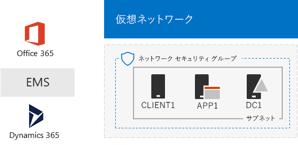
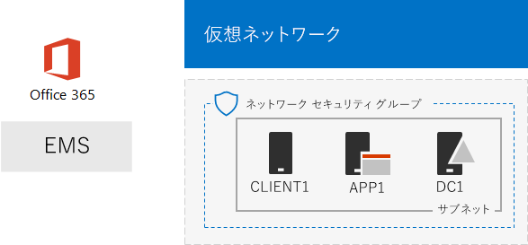

# One Microsoft Cloud 開発/テスト環境The One Microsoft Cloud dev/test environment

 **概要:** このテスト ラボ ガイドを使用して、Microsoft のクラウド サービスすべてを含む開発/テスト環境を作成します。**Summary:** Use this Test Lab Guide to create a dev/test environment that includes all of Microsoft’s cloud offerings.
  
この記事の手順に従い、Microsoft Azure インフラストラクチャ サービスでシミュレートされたイントラネットを作成し、Microsoft Office 365、Microsoft Enterprise Mobility + Security (EMS)、Microsoft Dynamics 365 のサブスクリプションを追加します。その結果として、1 つの開発/テスト環境で Microsoft のクラウド サービスすべてを同時に使用する、シンプルな組織になります。 With the instructions in this article, you create a simulated intranet in Microsoft Azure infrastructure services and then add Microsoft Office 365, Microsoft Enterprise Mobility + Security (EMS), and Microsoft Dynamics 365 subscriptions. The result is a simplified organization that uses all Microsoft's cloud offerings at the same time in a single dev/test environment. 
  

  
最終的な構成を、次の目的に使用できます。You can use the resulting configuration to:
  
- Azure Active Directory (AD) で提供される共通 ID インフラストラクチャなどの、Microsoft のクラウド サービス間の統合を体験します。Experience the integration across Microsoft's cloud offerings, such as the common identity infrastructure provided by Azure Active Directory (AD).
    
- 複数の Microsoft Cloud のサービスを含む、エンド ツー エンドのシナリオを評価します。Evaluate end-to-end scenarios that include multiple Microsoft Cloud offerings.
    
- 複数の Microsoft Cloud のサービスを使用する、デモ、概念実証、開発/テスト構成などを作成します。Create a demo, proof-of-concept, or dev/test configuration that uses multiple Microsoft Cloud offerings.
    
- プロフェッショナルな開発のため、Microsoft Cloud のスキルを構築します。Build your Microsoft Cloud skills for professional development.
    
## フェーズ 1: シミュレートされたイントラネットを作成し、Office 365 を追加するPhase 1: Create a simulated intranet and add Office 365

「[Office 365 開発/テスト環境の DirSync](dirsync-for-your-office-365-dev-test-environment.md)」の説明に従います。If you want to test ATP in a simulated enterprise, follow the instructions in [DirSync for your Office 365 dev/test environment](dirsync-for-your-office-365-dev-test-environment.md).
  
図 1 は、作成した構成に、Office 365 および Azure インフラストラクチャ サービスで実行されるシミュレートされたイントラネットと、オンプレミスの Windows Server Active Directory (AD) フォレストからのディレクトリ同期が含まれることを示しています。Figure 1 shows your resulting configuration, which includes a simulated intranet running in Azure infrastructure services and directory synchronization from an on-premises Windows Server Active Directory (AD) forest.
  
**図 1: Azure でシミュレートされたイントラネットと Office 365****Figure 1: The simulated intranet in Azure with Office 365**

  
> [!NOTE]
> Azure 試用版は 30 日間有効です。Office 365 Enterprise E5 の試用版サブスクリプションは 30 日間有効ですが、追加で 30 日間、簡単に延長できます。永続的な開発/テスト環境では、少数のライセンスを使用して新しい有料 Azure サブスクリプション、および新しい有料 Office 365 Enterprise E5 サブスクリプションを作成します。The Azure trial  is 30 days. The Office 365 Enterprise E5 Trial subscription is 30 days, which can be easily extended for another 30 days. For a permanent dev/test environment, create a new paid Azure subscription and a new paid Office 365 Enterprise E5 subscription with a small number of licenses. 
  
## フェーズ 2: EMS を追加するPhase 2: Add EMS

このフェーズでは、EMS 試用版サブスクリプションにサインアップして、Office 365 試用版サブスクリプションと同じ組織に追加します。In this phase, you sign up for the EMS trial subscription and add it to the same organization as your Office 365 trial subscription.
  
1. デスクトップ コンピューターのブラウザーまたは CLIENT1 のブラウザーのいずれかを使用して、全体管理者アカウントの資格情報で Office 365 ポータル ([https://portal.office.com](https://portal.office.com)) にサインインします。With a browser on either your desktop computer (lightweight) or from CLIENT1 (simulated enterprise), sign in to the Office 365 portal at  https://portal.office.com https://portal.office.com  with the credentials of your global administrator account.
    
2. **[管理]** タイルをクリックします。Click the **Admin** tile.
    
3. ブラウザーの **[Office 管理センター]** タブの左側のナビゲーションで **[請求] > [サービスを購入する]** の順にクリックします。On the **Office Admin center** tab in your browser, in the left navigation, click **Billing > Purchase services**.
    
4. **[サービスを購入]** ページで、 **[Enterprise Mobility + Security E5]** 項目を探します。その項目の上にマウス ポインターを移動させ、 **[無料試用版を起動する]** をクリックします。On the **Purchase services** page, find the **Enterprise Mobility + Security E5** item. Hover your mouse pointer over it and click **Start free trial**.
    
5. **[注文の確認]** ページで、 **[今すぐ実行]** をクリックします。On the **Confirm your order** page, click **Try now**.
    
6. **[注文の受領書]** ページで、**[続行]** をクリックします。On the **Order receipt** page, click **Continue**.
    
> [!NOTE]
> Enterprise Mobility + Security E5 試用版サブスクリプションの試用期間は 90 日間です。永続的な開発/テスト環境では、少数のライセンスを使用して新しい有料サブスクリプションを作成します。The Enterprise Mobility + Security E5 trial subscription is 90 days. For a permanent dev/test environment, create a new paid subscription with a small number of licenses. 
  
次に、すべてのユーザー アカウントに対して Enterprise Mobility + Security E5 ライセンスを有効にします。Next, enable the Enterprise Mobility + Security E5 license for all user accounts.
  
1. ブラウザーの **[Office 365 管理センター]** タブの左側のナビゲーションで **[ユーザー] > [アクティブなユーザー]** の順にクリックします。On the **Office 365 Admin center** tab in your browser, in the left navigation, click **Users > Active users**.
    
2. 全体管理者アカウントをクリックしてから、 **[製品ライセンス]** で **[編集]** をクリックします。Click your global administrator account, and then click **Edit** for **Product licenses**.
    
3. **[製品ライセンス]** ウィンドウで、 **Enterprise Mobility + Security E5** の製品ライセンスを **[オン]** にして、 **[保存]** をクリックしてから、 **[閉じる]** を 2 回クリックします。On the **Product licenses** pane, turn the product license for **Enterprise Mobility + Security E5** to **On**, click **Save,** and then click **Close** twice.
    
4. 他のすべてのアカウント (User1、User 2、User 3、User 4、User 5) に対して、手順 2 と 3 を実行します。For all of your other accounts (User1, User 2, User 3, User 4, and User 5), do steps 2 and 3.
    
開発/テスト環境には、以下が含まれるようになりました。Your dev/test environment now has:
  
- Azure インフラストラクチャ サービスで実行されるシミュレートされたイントラネット。A simulated intranet running in Azure infrastructure services.
    
- Office 365 E5 Enterprise と EMS の試用版サブスクリプションが、ユーザー アカウントの一覧と同じ組織および同じ Azure AD テナントを共有している。Office 365 E5 Enterprise and EMS trial subscriptions sharing the same organization and the same Azure AD tenant with your list of user accounts.
    
- すべてのユーザー アカウントで Office 365 E5 Enterprise と EMS が使用可能になっている。All of your user accounts enabled to use Office 365 E5 Enterprise and EMS.
    
図 2 は、EMS が追加された結果的な構成を示しています。Figure 2 shows your resulting configuration, which adds EMS.
  
**図 2: Azure でシミュレートされたイントラネットと、Office 365 および EMS****Figure 2: The simulated intranet in Azure with Office 365 and EMS**

  
## フェーズ 3: Dynamics 365 を追加するPhase 3: Add a Dynamics 365 trial subscription

このフェーズでは、Dynamics 365 試用版サブスクリプションにサインアップして、Office 365 と EMS の試用版サブスクリプションと同じ組織に追加します。In this phase, you sign up for the Dynamics 365 trial subscription and add it to the same organization as your Office 365 and EMS trial subscriptions.
  
1. デスクトップ コンピューターのブラウザーまたは CLIENT1 のブラウザーのいずれかを使用して、全体管理者アカウントの資格情報で Office 365 ポータル ([https://portal.office.com](https://portal.office.com)) にサインインします。Using a browser on either your desktop computer (lightweight) or from CLIENT1 (simulated enterprise), sign in to the Office 365 portal at  https://portal.office.com https://portal.office.com  with the credentials of your global administrator account.
    
2. **[管理]** タイルをクリックします。Click the **Admin** tile.
    
3. **[Office 管理センター]** タブの左側のナビゲーションで **[請求] > [サービスを購入する]** の順にクリックします。On the **Office admin center** tab, in the left navigation, click **Billing > Purchase services**.
    
4. **[サービスを購入]** ページで、**[Dynamics 365 プラン 1 Enterprise Edition]** の項目を探します。その項目の上にマウス ポインターを移動させ、**[無料試用版を起動する]** をクリックします。On the **Purchase services** page, find the **Dynamics 365 Plan 1 Enterprise Edition** item. Hover your mouse pointer over it and click **Start free trial**.
    
5. **[注文の確認]** ページで、**[今すぐ実行]** をクリックします。On the **Confirm your order** page, click **Try now**.
    
6. **[注文の受領書]** ページで、**[続行]** をクリックします。On the **Order receipt** page, click **Continue**.
    
> [!NOTE]
> Dynamics 365 Plan 1 Enterprise Edition の試用版サブスクリプションは 30 日間有効です。試用版サブスクリプションは、追加で 30 日間まで簡単に延長できます。永続的な開発/テスト環境では、少数のライセンスを使用して新しい有料サブスクリプションを作成します。The Dynamics 365 Plan 1 Enterprise Edition trial subscription is 30 days. You can easily extend the trail subscription for another 30 days. For a permanent dev/test environment, create a new paid subscription with a small number of licenses. 
  
次の手順を使用して、Dynamics 365 ライセンスをグローバル管理者、User 2、User 3 のアカウントに割り当て、システム管理者とします。Use these steps to assign Dynamics 365 licenses to the global administrator, User 2, and User 3 accounts and make them system administrators.
  
1. **[Office 管理センター]** タブで **[ユーザー] > [アクティブなユーザー]** の順にクリックします。On the **Office admin center** tab, click **Users > Active users**.
    
2. アクティブ ユーザーの一覧で、全体管理者アカウントを選択し、**[製品ライセンス]** で **[編集]** をクリックします。In the list of active users, click your global administrator account, and then click **Edit** for **Product licenses**.
    
3. **[製品ライセンス]** ウィンドウで、**Dynamics 365 プラン 1 Enterprise Edition** の製品ライセンスを **[オン]** にして、**[保存]** をクリックし、**[閉じる]** を 2 回クリックします。On the **Product licenses** pane, turn the product license for **Dynamics 365 Plan 1 Enterprise Edition** to **On**, click **Save,** and then click **Close** twice.
    
4. User 2 と User 3 のアカウントに対して、手順 2 と 3 を実行します。Perform steps 2 and 3 for the User 2 and User 3 accounts.
    
5. **[Office 管理センター]** タブを閉じます。Close the **Office admin center** tab.
    
次の手順を使用して、Dynamics 365 のシステム管理者として User 2 と User 3 のアカウントを構成します。Use these steps to configure the User 2 and User 3 accounts as Dynamics 365 system administrators.
  
1. ブラウザーの **[Office 管理センター]** タブの左側のナビゲーションで、**[管理センター]** をクリックして、**[Dynamics 365]** をクリックします。On the **Office Admin center** tab in your browser, in the left navigation, click **Admin centers**, and then click **Dynamics 365**.
    
    Dynamics 365 がメニューに表示されるまで、Dynamics 365 のプロビジョニングの完了を待つ必要がある場合があります。You may need to wait for Dynamics 365 to finish provisioning before Dynamics 365 appears in the menu.
    
2. [Dynamics 365] タブで、**[これらのすべて]**、**[セットアップの完了]** の順にクリックします。On the Dynamics 365 tab, click **All of these**, and then click **Complete Setup.**
    
    セットアップが完了するまで待ちます。Wait for setup to complete.
    
    セットアップが完了すると、試用版サブスクリプションの一部であるサンプル データに基づいて営業活動ダッシュボードが表示されます。**[試用版へようこそ]** の数分のビデオをご覧ください。終了したら、ビデオ ウィンドウを閉じます。When setup completes, it displays a Sales Activity Dashboard based on sample data that is part of the trail subscription. Take a few moments to view the **Welcome to your trial** video. Close the video window when complete.
    
3. 上部のツールバーで、**[営業]** の横にある下矢印をクリックし、**[設定]**、**[セキュリティ]** の順にクリックします。On the toolbar at the top, click the down arrow next to **Sales**, click **Settings**, and then click **Security**.
    
4. **[セキュリティ]** ページで **[ユーザー]** をクリックします。On the **Security** page, click **Users**.
    
5. ユーザーの一覧で **[User 2]** をクリックします。In the list of users, click **User 2**.
    
6. ツール バーで、**[ロールの管理]** をクリックします。In the tool bar, click **Manage Roles**.
    
7. **[ロールの管理]** で、**[システム管理者]**、**[OK]** の順にクリックします。In **Manage Roles**, click **System Administrator**, and then click **OK**.
    
8. 上部のツールバーで **[セキュリティ]** をクリックします。In the tool bar at the top click **Security**.
    
9. User 3 アカウントについて、手順 5 から 8 を繰り返します。Repeat steps 5-8 for the User 3 account.
    
10. **[ユーザー： User3]** タブを閉じます。Close the **User: User3** tab.
    
> [!NOTE]
> Office 365 全体管理者アカウントに、Dynamics 365 のシステム管理者ロールが自動的に割り当てられました。Your Office 365 global administrator account was automatically assigned the Dynamics 365 system administrator role. 
  
開発/テスト環境には、以下が含まれるようになりました。Your dev/test environment now has:
  
- Azure インフラストラクチャ サービスで実行されるシミュレートされたイントラネット。A simulated intranet running in Azure infrastructure services.
    
- Office 365 E5 Enterprise、EMS、Dynamics 365 の試用版サブスクリプションが、ユーザー アカウントの一覧と同じ組織および同じ Azure AD テナントを共有している。Office 365 E5 Enterprise, EMS, and Dynamics 365 trial subscriptions sharing the same organization and the same Azure AD tenant with your list of user accounts.
    
- すべてのユーザー アカウントで Office 365 E5 Enterprise と EMS が使用可能になっている。All of your user accounts enabled to use Office 365 E5 Enterprise and EMS.
    
- グローバル エンタープライズ管理者、User 2、および User 3 のアカウントが、Dynamics 365 を使用できるようになり、Dynamics 365 のシステム管理者になっている。Your global enterprise administrator, User 2, and User 3 accounts are enabled to use Dynamics 365 and are Dynamics 365 system administrators.
    
図 3 は、最終的な構成を示しています。Figure 3 shows your resulting configuration.
  
**図 3: Azure でシミュレートされたイントラネットと、Office 365、EMS、および Dynamics 365****Figure 3: The simulated intranet in Azure with Office 365, EMS, and Dynamics 365**

  
## 次の手順Next steps

これで、One Microsoft Cloud 開発/テスト環境を自由に試すことができます。ガイド付き体験のいくつかのアイデアを次に紹介します。You can now experiment with your One Microsoft Cloud dev/test environment. Here are some ideas for guided experiences:
  
- [EMS で Office 365 アプリケーションのモバイル アプリケーション管理 (MAM) ポリシーを構成するConfigure mobile application management (MAM) policies in EMS for Office 365 applicationshttps://technet.microsoft.com/library/mt764059.aspx](https://technet.microsoft.com/library/mt764059.aspx)
    
- [Dynamics 365 の連絡先と Office 365 の統合における Exchange Online のデモンストレーションDemonstrate Exchange Online in Office 365 integration with Dynamics 365 contactshttps://technet.microsoft.com/library/mt798313.aspx](https://technet.microsoft.com/library/mt798313.aspx)
    
- [サーバー ベースのワークロードをホストするために、Azure インフラストラクチャ サービスで、シミュレートされたクロスプレミス ネットワークを作成するCreate a simulated cross-premises network in Azure infrastructure services for hosting server-based workloadshttps://technet.microsoft.com/library/mt745150.aspx](https://technet.microsoft.com/library/mt745150.aspx)
    
## 関連項目See Also

[クラウド導入のテスト ラボ ガイド (TLG)Cloud adoption Test Lab Guides (TLGs)](cloud-adoption-test-lab-guides-tlgs.md)
  
[Microsoft クラウド IT アーキテクチャのリソースMicrosoft Cloud IT architecture resources](microsoft-cloud-it-architecture-resources.md)
  
[ハイブリッド ソリューションHybrid solutions](hybrid-solutions.md)
  
[セキュリティ ソリューションSecurity solutions](security-solutions.md)

