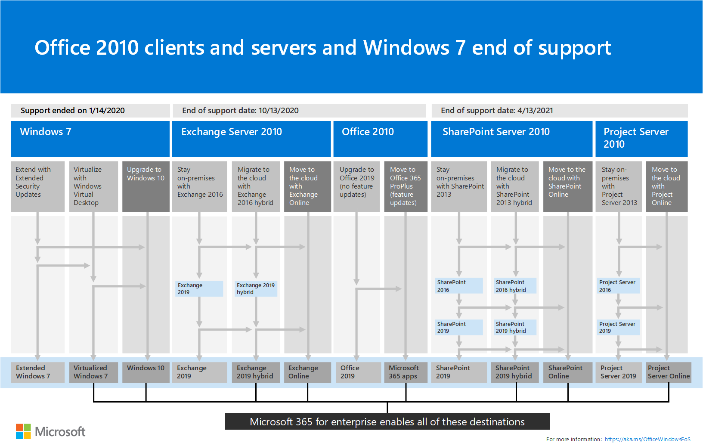

# Office 2010 サーバーおよびクライアントからのアップグレードに役立つリソースResources to help you upgrade from Office 2010 servers and clients

次の点に注意してください。Note that:

- Exchange Server 2010 は **、2020年1月14日**のサポート終了に到達します。Exchange Server 2010 will reach its end of support on **January 14, 2020**. 

- Office 2010、SharePoint 2010、および Project Server 2010 は、 **2020 年10月 13**日にサポート終了に到達します。Office 2010, SharePoint 2010, and Project Server 2010 will reach their end of support on **October 13, 2020**. 

アップグレードを計画している間は、Office 365 または Microsoft 365 への移行を検討するのに非常に時間がかかる場合があります。While you're planning your upgrade, this is a great time to consider moving to Office 365 or Microsoft 365. 

- Office 365 には、Exchange Server、SharePoint Server、Teams や OneDrive for business などのサービスといった Office 2010 サーバー製品用のクラウドベースのサービスがあります。Office 365 has cloud-based services for Office 2010 server products such as Exchange Server and SharePoint Server and services such as Teams and OneDrive for Business. 

- Office 365 ProPlus には、Office 365 E3 および E5 と Microsoft 365 Enterprise に含まれていますが、ローカルデバイスにインストールする Office クライアントアプリのセットです。Office 365 ProPlus, included with Office 365 E3 and E5 and Microsoft 365 Enterprise, is the set of Office client apps that you install on your local device. これらの機能は、Microsoft cloud から継続的に新しい生産性およびセキュリティ機能で更新されています。They are updated with new productivity and security features on an ongoing basis from the Microsoft cloud.

Office 2010 のクライアントおよびサーバーおよび Windows 7 のアップグレード、移行、およびクラウドの移行オプションの視覚的な概要については、「[サポートの終了」ポスター](./media/upgrade-from-office-2010-servers-and-products/Office2010Windows7EndOfSupport.pdf)を参照してください。For a visual summary of the upgrade, migrate, and move-to-the-cloud options for Office 2010 clients and servers and Windows 7, see the [end of support poster](./media/upgrade-from-office-2010-servers-and-products/Office2010Windows7EndOfSupport.pdf).

この1ページのポスターは、Office 2010 のクライアントおよびサーバー製品と Windows 7 のサポートが終了しないようにするために実行できるさまざまなパスを簡単に理解する方法です。 Microsoft 365 Enterprise では、優先パスとオプションのサポートが強調表示されています。This one-page poster is a quick way to understand the various paths you can take to prevent Office 2010 client and server products and Windows 7 from reaching end of support, with preferred paths and option support in Microsoft 365 Enterprise highlighted.

このポスターを[ダウンロード](https://github.com/MicrosoftDocs/microsoft-365-docs/raw/public/microsoft-365/enterprise/media/migration-microsoft-365-enterprise-workload/Office2010Windows7EndOfSupport.pdf)して、レター、リーガル、またはタブロイド (11 x 17) 形式で印刷することもできます。You can also [download](https://github.com/MicrosoftDocs/microsoft-365-docs/raw/public/microsoft-365/enterprise/media/migration-microsoft-365-enterprise-workload/Office2010Windows7EndOfSupport.pdf) this poster and print it in letter, legal, or tabloid (11 x 17) formats.
      
## Office 2010 クライアントおよびサーバーのアップグレードの計画Office 2010 client and server upgrade planning
  
|**この製品の場合****For this product**|**サポート終了日****With this end of support date**|**このリソースを表示する****See this resource**|
|:-----|:-----|:-----|
|Office 2010 (Word 2010、Excel 2010、PowerPoint 2010、Outlook 2010 を含む)Office 2010 (including Word 2010, Excel 2010, PowerPoint 2010, and Outlook 2010)    | 2020年10月13日October 13, 2020 |[Office 2010 サポート終了のロードマップOffice 2010 end of support roadmap](https://docs.microsoft.com/DeployOffice/office-2010-end-support-roadmap)   |
|Exchange Server 2010Exchange Server 2010    | 2020年1月14日January 14, 2020  |[Exchange 2010 のサポート終了ロードマップExchange 2010 end of support roadmap](exchange-2010-end-of-support.md)   |
|SharePoint 2010 または SharePoint Server 2010SharePoint 2010 or SharePoint Server 2010    | 2020年10月13日October 13, 2020 |[SharePoint 2010 からアップグレードするUpgrading from SharePoint 2010](upgrade-from-sharepoint-2010.md)   |
|Project Server 2010Project Server 2010   | 2020年10月13日October 13, 2020 | [Project Server 2010 サポート終了ロードマップProject Server 2010 end of support roadmap](project-server-2010-end-of-support.md)   |
|Lync Server 2010Lync Server 2010   | 2021年4月13日April 13, 2021 | [Skype for Business Server へのアップグレードを計画するPlan to upgrade to Skype for Business Server](https://docs.microsoft.com/skypeforbusiness/plan-your-deployment/upgrade)   |
    
## 自宅のユーザーです。I'm a home user. What do I do?What do I do?

自宅で Office 2010 製品とアプリケーションを使用している場合は、[次の情報](plan-upgrade-previous-versions-office.md#im-a-home-user-what-do-i-do)を参照してください。If you're using Office 2010 products and applications at home, see [this information](plan-upgrade-previous-versions-office.md#im-a-home-user-what-do-i-do).

## 関連項目Related topics

[Office の退職グループ (Microsoft Tech Community)Office Retirement Group (Microsoft Tech Community)](https://go.microsoft.com/fwlink/?linkid=842065)
  
[ビデオ: Office 365 とは何ですか。Video: What is Office 365?](https://support.office.com/article/847caf12-2589-452c-8aca-1c009797678b.aspx)
  
[Microsoft のライフサイクル ポリシーMicrosoft Lifecycle Policy](https://go.microsoft.com/fwlink/?linkid=865200)

[Office 2007 または Office 2010 のサーバーとクライアントからのアップグレードを計画するPlan your upgrade from Office 2007 or Office 2010 servers and clients](plan-upgrade-previous-versions-office.md)

