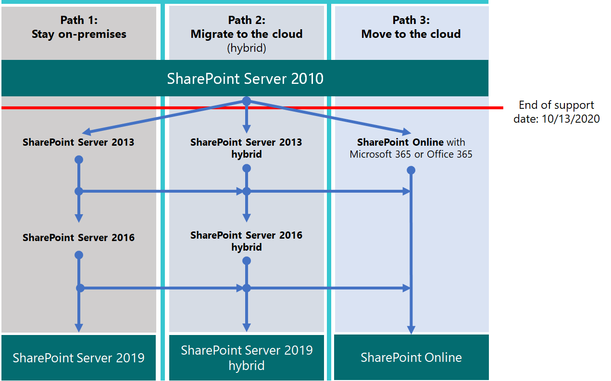

# SharePoint 2010 からアップグレードするUpgrading from SharePoint 2010

Microsoft SharePoint 2010 と SharePoint Server 2010 は **、2020年10月 13**日にサポートの終了に到達します。Microsoft SharePoint 2010 and SharePoint Server 2010 will reach end of support on **October 13, 2020**. この記事では、既存の SharePoint Server 2010 データを Office 365 の SharePoint Online に移行したり、オンプレミスの SharePoint Server 2010 環境をアップグレードしたりするのに役立つリソースについて説明します。This article details resources to help you migrate your existing SharePoint Server 2010 data to SharePoint Online in Office 365, or upgrade your on-premises SharePoint Server 2010 environment.
  
## サポート終了とはWhat is end of support?

SharePoint Server 2010 と SharePoint Foundation 2010 ソフトウェアがサポートライフサイクルの最終段階 (Microsoft が新機能を提供している期間、バグ修正プログラム、セキュリティ修正プログラムなど) に到達すると、これはソフトウェアの「サポートの終了」と呼ばれます。' 定年 ' のような場合があります。When your SharePoint Server 2010, and SharePoint Foundation 2010 software reaches the end of its support lifecycle (the time during which Microsoft provides new features, bug fixes, security fixes, and so on), this is called the software's 'end of support', or, sometimes, its 'Retirement'. 製品のサポート終了 (または EOS) によって、実際には機能しなくなります。ただし、ソフトウェアのサポートが終了すると、Microsoft は次の機能を提供しなくなります。Upon the end of support (or EOS) of a product, nothing actually shuts down or stops working; however, at the end of support of software, Microsoft no longer provides:
  
- 発生する可能性のある問題のテクニカル サポート。Technical support for problems that may occur;
    
- サーバーの安定性と運用に影響を与える可能性のある問題が検出された場合のバグ修正プログラム。Bug fixes for issues that are discovered and that may impact the stability and usability of the server;
    
- 検出された脆弱性に対するセキュリティの修正。これにより、サーバーがセキュリティ侵害に対して脆弱になる可能性があります。Security fixes for vulnerabilities that are discovered and that may make the server vulnerable to security breaches;
    
- タイム ゾーンの更新。Time zone updates.
    
つまり、これ以降の更新プログラム、修正プログラム、修正プログラムが製品に提供されることはありません (セキュリティ更新プログラムや修正プログラムを含む)。また、Microsoft サポートは、そのサポートの努力をより新しいバージョンに完全に移行する予定です。That means, there will be no further updates, patches, or fixes will be shipped for the product (including security patches/fixes), and Microsoft Support will have fully shifted its support efforts to more recent versions. SharePoint Server 2010 の方法をサポートしていない場合は、製品をアップグレードしたり、重要なデータを移行したりする前に、不要になったデータをトリミングする機会を活用する必要があります。As the end of support of SharePoint Server 2010 approaches, you should take advantage of opportunities to trim data you no longer need prior to upgrading the product, and/or migrating your important data.
  
> [!NOTE]
> 通常、ソフトウェアライフサイクルは、製品の初回リリースから10年間持続します。A software lifecycle typically lasts for 10 years from the date of the product's initial release. 次のバージョンのソフトウェア、または Office 365 移行 (またはその両方) へのアップグレードに役立つ、 [Microsoft ソリューションプロバイダー](https://go.microsoft.com/fwlink/?linkid=841249)を検索することができます。You can search for [Microsoft solution providers](https://go.microsoft.com/fwlink/?linkid=841249) who can help with upgrade to the next version of your software, or with Office 365 migration (or both). 特に、SharePoint で使用している SQL Server のバージョンによっては、重要な基礎テクノロジに対するサポート終了日について認識していることを確認してください。Be certain you're aware of end of support dates on critical underlying technologies as well, particularly of the version of SQL Server you're using with SharePoint. 
  
## 使用できるオプションWhat are my options?

最初に、[製品ライフサイクルサイト](https://support.microsoft.com/en-us/lifecycle/search?alpha=SharePoint%20Server%202010)でサポートが終了する日付を確認します。First, check the date at which support ends on the [Product Lifecycle site](https://support.microsoft.com/en-us/lifecycle/search?alpha=SharePoint%20Server%202010). 次に、この日付に関する知識を使用して、アップグレードまたは移行の時間を計画してください。Next, be sure to plan your upgrade or migration time with knowledge of this date. ご使用の製品は、リストされている日付には機能しなく*なり*ますが、使用を続行できますが、インストールにはその日付以降にパッチを適用する必要がないため、次のバージョンによりスムーズに移行できるようにするための戦略が必要になります。製品の。Remember that your product  *won't stop working*  at the date listed, and you can continue its use, but that, since your installation will no longer be patched after that date, you'll want a strategy that will help you more smoothly transition to the next version of the product. 
  
このマトリックスは、製品の機能やユーザーデータを移行する際に、コースをプロットするのに役に立ちます。This matrix helps plot a course when it comes to migrating product features and user data:
  
|**サポート終了製品****End of support product**|**標準****Good**|**最良****Best**|
|:-----|:-----|:-----|
|SharePoint Server 2010SharePoint Server 2010    |SharePoint Server 2013 (社内)SharePoint Server 2013 (on-premises)    |SharePoint OnlineSharePoint Online    |
||Sharepoint Server 2013 と SharePoint Online のハイブリッドSharePoint Server 2013 hybrid with SharePoint Online    |SharePoint Server 2016 (社内)SharePoint Server 2016 (on-premises)    |
|||SharePoint クラウドハイブリッド検索SharePoint Cloud Hybrid Search    |
   
小数点部桁数 (良好なオプション) でオプションを選択する場合は、SharePoint Server 2010 からの移行後すぐに、もう一度アップグレードの計画を開始する必要があります。If you choose options on the low end of the scale (good options), you'll need to start planning for another upgrade soon after migration from SharePoint Server 2010 completes. 

SharePoint Server 2010 のサポート終了を回避するために実行できる3つのパスを次に示します。Here are the three  paths you can take to avoid the end of support for SharePoint Server 2010.

>[!Note]
>SharePoint Server 2010 および SharePoint Foundation 2010 のサポート終了は、2020年10月13日に予定されていますが、最新の日付については常に[製品ライフサイクルサイト](https://support.microsoft.com/en-us/lifecycle)をチェックする必要があることに*注意してください*。End of support for SharePoint Server 2010 and SharePoint Foundation 2010 are scheduled for Oct 13, 2020, but *please be aware* that you should always check the [Product Lifecycle site](https://support.microsoft.com/en-us/lifecycle) for the most current dates.
>

  
## 次にどこに行くべきですか。Where should I go next?

SharePoint Server 2013 と SharePoint Foundation 2013 は、オンプレミスのサーバーにインストールすることができます。SharePoint Server 2013 and SharePoint Foundation 2013 can be installed on-premises on your own servers. それ以外の場合は、Microsoft Office 365 の一部であるオンラインサービスである SharePoint Online を使用できます。Otherwise, you can use SharePoint Online, which is an online service that is part of Microsoft Office 365. 次のいずれかを選択できます。You can choose to:
  
- SharePoint Online への移行Migrate to SharePoint Online
    
- オンプレミスの SharePoint Server または SharePoint Foundation のアップグレードUpgrade SharePoint Server or SharePoint Foundation on-premises
    
- 上記の両方の実施Do both of the above
    
- [SharePoint ハイブリッド](https://docs.microsoft.com/sharepoint/hybrid/hybrid) ソリューションの実装Implement a [SharePoint hybrid](https://docs.microsoft.com/sharepoint/hybrid/hybrid) solution 
    
サーバーファームの保持、カスタマイズの維持または移行、および SharePoint Server が依存するハードウェアのアップグレードに関連する非表示のコストに注意してください。Be aware of hidden costs associated with maintaining a server farm going forward, maintaining or migrating customizations, and upgrading the hardware upon which SharePoint Server depends. これらのすべてについて把握しておくと、オンプレミスのアップグレードを続行するのが容易になります。If you're aware and have accounted for all of these, it will be easier to continue upgrading on-premises. それ以外の場合は、カスタマイズされていない従来の SharePoint サーバーでファームを実行すると、SharePoint Online への計画された移行の恩恵を受けることができます。Otherwise, if you run your farm on legacy SharePoint Servers without heavy customization, you could benefit from a planned migration to SharePoint Online. オンプレミスの SharePoint Server 環境では、すべてのデータをオンプレミスで保持するハードウェア管理の量を減らすために、SharePoint Online に何らかのデータを配置することを選択することもできます。It's also possible that for your on-premises SharePoint Server environment, you might opt to put some data in SharePoint Online to reduce the amount of hardware management that keeping that all your data on-premises involves. データの一部を SharePoint Online に移動する方が経済的な場合があります。It may be more economical to move some of your data into SharePoint Online.
  
> [!NOTE]
> SharePoint 管理者は、 [Office 365 サブスクリプションを作成](https://go.microsoft.com/fwlink/?linkid=843152)し、新しい sharepoint online サイトをセットアップした後、sharepoint Server 2010 から削除して、最新の sharepoint online サイトに対して最も重要なドキュメントのみを削除することができます。SharePoint Administrators may [create an Office 365 Subscription](https://go.microsoft.com/fwlink/?linkid=843152), set up a brand new SharePoint Online site, and then cut away from SharePoint Server 2010, cleanly, taking only the most essential documents to the fresh SharePoint Online sites. その後、残りのデータが SharePoint Server 2010 サイトからオンプレミスのアーカイブにドレインされる場合があります。From there, any remaining data may be drained from the SharePoint Server 2010 site into on-premises archives. 
  
|**SharePoint Online****SharePoint Online**|**オンプレミスの SharePoint Server****SharePoint Server on-premises**|
|:-----|:-----|
|時間コストが高い (計画 / 実行 / 確認)High cost in time (plan / execution / verification)    |時間コストが高い (計画 / 実行 / 確認)High cost in time (plan / execution / verification)    |
|資金コストが安い (ハードウェアの購入の必要なし)Lower cost in funds (no hardware purchases)    |ファンドのコストが高くなる (ハードウェアの購入)Higher cost in funds (hardware purchases)    |
|一度の移行でのコストOne-time cost in migration    |将来繰り返される一度の移行でのコストOne-time cost repeated per future migration    |
|所有権および保守の費用合計が低いLow total cost of ownership / maintenance    |所有権および保守の費用合計が高いHigh total cost of ownership / maintenance    |
   
Office 365 に移行するときには、1回限りの移行にかかる時間が長くなります (データを整理したり、クラウドに取りかかることを決定したりする場合)。When you migrate to Office 365, the one-time move will have a heavier cost in time spent planning, up-front (while you're organizing data and deciding what to take to the cloud and what to leave behind). ただし、データが移行されると、その時点からのアップグレードが自動的に行われ、ハードウェアおよびソフトウェアの更新プログラムを管理する必要がなくなります。また、ファームの稼働時間は、Microsoft サービスレベル契約 ([SLA](https://go.microsoft.com/fwlink/?linkid=843153)) によって支えられます。However, once your data is migrated, upgrades will be automatic from that point, seeing as you will no longer need to manage hardware and software updates, and the up-time of your farm will be backed by a Microsoft Service Level Agreement ([SLA](https://go.microsoft.com/fwlink/?linkid=843153)).
  
### SharePoint Online への移行Migrate to SharePoint Online

SharePoint Online では、[サービスの説明](https://docs.microsoft.com/office365/servicedescriptions/sharepoint-online-service-description/sharepoint-online-service-description)を確認することにより、必要なすべての機能が提供されていることを確認してください。Be sure SharePoint Online offers all the features you need by reviewing its [service description](https://docs.microsoft.com/office365/servicedescriptions/sharepoint-online-service-description/sharepoint-online-service-description).
  
現時点では、SharePoint Server 2010 (または SharePoint Foundation 2010) から SharePoint Online に直接移行する方法はありません。このため、作業の多くは手動で行います。There isn't currently a means by which you can directly migrate from SharePoint Server 2010 (or SharePoint Foundation 2010) to SharePoint Online, so much of the work is manual. これにより、移行の前に、不要になったデータとサイトをアーカイブし、排除する機会が得られます。This does give you the opportunity to archive and prune data and sites that are no longer needed, before the move. 他のデータをストレージにアーカイブすることができます。You can archive other data into storage. また、サポート終了時に SharePoint Server 2010 と SharePoint Foundation 2010 のどちらも停止しないことに注意してください。したがって、管理者は、ユーザーがデータの移動を忘れた場合に、SharePoint が実行中の期間を持つことができます。Also remember that neither SharePoint Server 2010 nor SharePoint Foundation 2010 will stop working at end of support, so administrators can have a period during which SharePoint is still running if their customers forget to move some of their data.
  
SharePoint Server 2013 または SharePoint Server 2016 にアップグレードし、データを SharePoint Online に配置する場合は、 [Sharepoint 移行 API](https://support.office.com/en-us/article/Upload-on-premises-content-to-SharePoint-Online-using-PowerShell-cmdlets-555049c6-15ef-45a6-9a1f-a1ef673b867c?ui=en-US&amp;rs=en-US&amp;ad=US) (情報を OneDrive for business に移行するため) を使用して移動することもできます。If you upgrade to SharePoint Server 2013 or SharePoint Server 2016, and decide to put data into SharePoint Online, your move might also involve using the [SharePoint Migration API](https://support.office.com/en-us/article/Upload-on-premises-content-to-SharePoint-Online-using-PowerShell-cmdlets-555049c6-15ef-45a6-9a1f-a1ef673b867c?ui=en-US&amp;rs=en-US&amp;ad=US) (to migrate information into OneDrive for Business). 
  
|**SharePoint Online の利点****SharePoint Online advantage**|**SharePoint Online の短所****SharePoint Online disadvantage**|
|:-----|:-----|
|Microsoft が SPO ハードウェアおよびすべてのハードウェアの管理を行う。Microsoft supplies SPO hardware and all hardware administration.    |オンプレミスの SharePoint Server で利用できる機能と、SPO で利用できる機能が異なる。Available features may be different between SharePoint Server on-premises and SPO.    |
|サブスクリプションの全体管理者であり、管理者を SPO サイトに割り当てることができます。You are the global administrator of your subscription and may assign administrators to SPO sites.    |オンプレミスの sharepoint Server でファーム管理者が使用できる一部のアクションが、Office 365 の SharePoint 管理者ロールに存在しない (または必要ない) 場合。ただし、SharePoint 管理、サイトコレクションの管理、サイト所有権は、次のようにローカルになります。組織。Some actions available to a Farm Administrator in SharePoint Server on-premises do not exist (or are not necessary) in the SharePoint Administrator role in Office 365, but SharePoint Administration, Site Collection Administration, and Site Ownership are local to your org.    |
|Microsoft は、基礎となるハードウェアおよびソフトウェア (SharePoint Online が実行されている SQL server を含む) に対するパッチ、修正、更新を適用します。Microsoft applies patches, fixes and updates to underlying hardware and software (including SQL servers on which SharePoint Online runs).    |サービスの基となるファイル システムへのアクセスがないため、一部のカスタマイズが制限される。Because there is no access to the underlying file system in the service, some customizations are limited.    |
|Microsoft が[サービス レベル契約](https://go.microsoft.com/fwlink/?linkid=843153)を発行し、サービス レベルの問題に迅速に対応する。Microsoft publishes [Service Level Agreements](https://go.microsoft.com/fwlink/?linkid=843153) and moves quickly to resolve service level incidents.    |バックアップと復元、その他の回復オプションは、SharePoint Online のサービスによって自動化される。バックアップは、使用されていない場合に上書きされる。Backup and restore and other recovery options are automated by the service in SharePoint Online - backups are overwritten if not used.    |
|セキュリティ テストとサーバーのパフォーマンス チューニングは、Microsoft によって、継続的なサービスとして実施される。Security testing and server performance tuning are carried out on an ongoing basis in the service by Microsoft.    |ユーザー インターフェイスとその他の SharePoint 機能の変更はサービスによってインストールされ、オン/オフの切り替えが必要な場合がある。Changes to the user interface and other SharePoint features are installed by the service and may need to be toggled on or off.    |
|Office 365 が、[Office 365 のコンプライアンス](https://go.microsoft.com/fwlink/?linkid=843165)に記載されている多くの業界標準に対応している。Office 365 meets many industry standards: [Office 365 Compliance](https://go.microsoft.com/fwlink/?linkid=843165).    |移行の際に [FastTrack](https://go.microsoft.com/fwlink/?linkid=518597) でできることが限られる。[FastTrack](https://go.microsoft.com/fwlink/?linkid=518597) assistance for migration is limited.    アップグレードの多くは、手動か、[SharePoint Online と OneDrive 移行コンテンツ ロードマップ](https://go.microsoft.com/fwlink/?linkid=843184)に記載されている SPO 移行 API により実施される。Much of the upgrade will be manual, or via the SPO Migration API described in the [SharePoint Online and OneDrive Migration Content Roadmap](https://go.microsoft.com/fwlink/?linkid=843184).    |
|Microsoft のサポート エンジニアもデータセンターの従業員も、ユーザーのサブスクリプションに対する無制限の管理アクセス権はない。Neither Microsoft Support Engineers nor employees in the datacenter have unrestricted admin access to your subscription.    |新しいバージョンの SharePoint に対応するために、ハードウェア インフラストラクチャをアップグレードする必要がある場合や、アップグレードにセカンダリ ファームが必要な場合は、追加のコストがかかる可能性がある。There can be additional costs if hardware infrastructure needs to be upgraded to support the newer version of SharePoint, or if a secondary farm is required for upgrade.    |
|ソリューションプロバイダーは、データを SharePoint Online に移行するための1回限りのジョブを支援します。Solution providers can assist with the one-time job of migrating your data to SharePoint Online.    |SharePoint Online のすべての変更がコントロール内にあるわけではありません。Not all changes to SharePoint Online are within your control. 移行後、メニュー、ライブラリ、およびその他の機能の設計の違いが、一時的に利便性に影響する場合があります。After migration, design differences in menus, libraries, and other features may temporarily affect usability.    |
|オンライン製品は、サービスによって自動的に更新されますが、機能は廃止される可能性があります。ただし、サポートライフサイクルが実際に終了することはありません。Online products are updated automatically across the service meaning that though features may deprecate, there is no true end of support Lifecycle.    |SharePoint Server (または SharePoint Foundation) および基盤となる SQL server のサポート終了期間が終了しています。There is an end of support Lifecycle for SharePoint Server (or SharePoint Foundation) as well as underlying SQL servers.    |
   
新しい Office 365 サイトを作成し、必要に応じてそのサイトにデータを手動で移行する場合は、 [office 365 プランのオプション](https://go.microsoft.com/fwlink/?linkid=843151)を参照してください。If you've decided to create a new Office 365 site, and will manually migrate data to it as is needed, you can look at your [Office 365 Plan Options](https://go.microsoft.com/fwlink/?linkid=843151).
  

  
### オンプレミスの SharePoint Server のアップグレードUpgrade SharePoint Server on-premises

Sharepoint オンプレミス製品の最新バージョン (SharePoint Server 2016) の場合、SharePoint Server のアップグレードは*直列*になる必要があります。これは、sharepoint server 2010 から sharepoint server 2016 へのアップグレードを直接実行することはできません。As of the latest version of the SharePoint on-premises product (SharePoint Server 2016), SharePoint Server upgrades must go  *serially*, that means there is no way to upgrade from SharePoint Server 2010 to SharePoint Server 2016, directly. 
  
|||
|:-----|:-----|
||シリアルアップグレードパス \* \* \* \*: SharePoint server 2010 **\>** sharepoint server 2013 **\>** sharepoint server 2016\*\*\*\*Serial upgrade path\*\*\*\*: SharePoint Server 2010 **\>** SharePoint Server 2013 **\>** SharePoint Server 2016 |
   
SharePoint 2010 から SharePoint Server 2016 への完全なパスを使用することを選択した場合、これには時間と計画が必要になります。If you choose to follow the entire path from SharePoint 2010 to SharePoint Server 2016, this will take time and planning. アップグレードには、アップグレードされたハードウェア (SQL server もアップグレードする必要があることに注意してください)、ソフトウェア、および管理に関するコストが関係しています。Upgrades involve a cost in terms of upgraded hardware (be aware that SQL servers must also be upgraded), software, and administration. また、カスタマイズをアップグレードしたり、破棄したりする必要がある場合もあります。Also, customizations may need to be upgraded, or even abandoned. SharePoint Server ファームをアップグレードする前に、すべての重要なカスタマイズに関するメモを収集してください。Be sure that you collect notes on all of your critical customizations before you upgrade your SharePoint Server farm.
  
> [!NOTE]
> サポートされている SharePoint 2010 ファームの終了を維持し、新しいハードウェアに SharePoint Server 2016 ファームをインストールする (個別のファームを並行して実行する) ことができます。コンテンツをダウンロードして再アップロードするために、コンテンツの手動による移行を計画して実行します。例)。It's possible to maintain your end of support SharePoint 2010 farm, install a SharePoint Server 2016 farm on new hardware (so the separate farms run side-by-side), and then plan and execute a manual migration of content (for downloading and re-uploading content, for example). これらの手動による移動 (2010 からのドキュメント、手動移動を実行しているアカウントのエイリアスを使用して、現在最後に変更されたアカウントを含む) には、このような手動による移動には、事前に行う必要のある落とし穴があります (サイト、サブサイト、アクセス許可を再作成することもできます)。リスト構造)。There are potential pitfalls to these manual moves (such as documents coming from 2010 having a current last modified account with the alias of the account doing the manual move), and some work must be done ahead of time (recreating sites, sub-sites, permissions and list structures). ストレージに移動できるデータや、不要になったデータについては、十分に検討してください。It's a good time to consider what data you can move into storage, or no longer need. これにより、移行の影響が軽減されます。This can reduce the impact of migration. どちらの方法でも、アップグレード前に環境をクリーンにします。Either way, clean your environment prior to upgrade. アップグレードする前に、既存のファームが機能していることを確認してください。Be certain your existing farm is functional before you upgrade, and (for sure) before you decommission! 
  
以下の、**サポートされるアップグレード パスとサポート外のアップグレード パス**を確認してください。Remember to review the **supported and unsupported upgrade paths**: 
  
- [SharePoint Server 2010SharePoint Server 2010](https://go.microsoft.com/fwlink/?linkid=843156)
    
- [SharePoint Server 2013SharePoint Server 2013](https://go.microsoft.com/fwlink/?linkid=843157)
    
**カスタマイズ**を行っている場合は、移行パスの手順ごとにアップグレードの計画を立てることが重要となります。詳細は以下を参照してください。If you have **customizations**, it's critical you have a plan your upgrade for each step in the migration path: 
  
- [SharePoint Server 2010SharePoint Server 2010](https://go.microsoft.com/fwlink/?linkid=843160)
    
- [SharePoint Server 2013SharePoint Server 2013](https://go.microsoft.com/fwlink/?linkid=843162)
    
|**オンプレミスの利点****On-premises advantage**|**オンプレミスの欠点****On-premises disadvantage**|
|:-----|:-----|
|サーバーハードウェア上の SharePoint ファーム (および SQL) のすべての側面を完全に制御します。Full control of all aspects of your SharePoint Farm (and it's SQL), from the server hardware up.    |すべてのブレークと修正は会社の責任になります (ただし、製品のサポートが終了していない場合は、有料の Microsoft サポートを受けられます)。All breaks and fixes are the responsibility of your company (but you can engage paid Microsoft Support if your product is not at end of support):    |
|ハイブリッドの SharePoint Online サブスクリプションにオンプレミス ファームを接続するオプションを備えた、オンプレミスの SharePoint Server のフル機能一式。Full feature set of SharePoint Server on-premises with the option to connect your on-premises farm to a SharePoint Online subscription via hybrid.    |アップグレード、パッチ、セキュリティ修正、ハードウェアのアップグレード、および SharePoint Server の SQL ファームがオンプレミスで管理されています。Upgrade, patches, security fixes, hardware upgrades, and all maintenance of SharePoint Server and it's SQL farm are managed on-premises.    |
|SharePoint Online よりも詳細なカスタマイズオプションへのフルアクセス。Full access for greater customization options than with SharePoint Online.    |[Office 365 でサポートされるコンプライアンス基準](https://go.microsoft.com/fwlink/?linkid=843165)を、オンプレミスで手動で構成しなければならない。[Compliance standards supported by Office 365](https://go.microsoft.com/fwlink/?linkid=843165) must be manually configured on-premises.    |
|オンプレミスで実行されるセキュリティテストとサーバーパフォーマンスの調整 (管理下)。Security testing, and server performance tuning, carried out on your premises (under your control).    |オンプレミスの SharePoint Server と相互運用しない SharePoint Online での機能が、Office 365 によって、有効になることがあるOffice 365 may make features available to SharePoint Online that do not interoperate with SharePoint Server on-premises    |
|ソリューションプロバイダーは、SharePoint Server の次のバージョン (および以降) にデータを移行するのに役立ちます。Solution providers can assist with migrating data to the next version of SharePoint Server (and beyond).    |SharePoint Server サイトでは、SharePoint Online で表示される [SSL/TLS](https://go.microsoft.com/fwlink/?linkid=843167) 証明書が自動的に使用されることはない。Your SharePoint Server sites will not automatically use [SSL/TLS](https://go.microsoft.com/fwlink/?linkid=843167) certificates as is seen in SharePoint Online.    |
|オンプレミスの SharePoint Server での、名前付け規則、バックアップと復元、その他の回復オプションの完全なコントロール。Full control of naming conventions, backup and restore and other recovery options in SharePoint Server on-premises.    |オンプレミスの SharePoint Server は製品ライフサイクルに依存しています。SharePoint Server on-premises is sensitive to Product Lifecycles.    |
   
### アップグレードのリソースUpgrade Resources

最初に、ハードウェア要件とソフトウェア要件を比較します。Begin by comparing hardware and software requirements. 現在のハードウェアでのアップグレードに関する基本的な要件を満たしていない場合は、まずファームまたは SQL サーバーのハードウェアをアップグレードする必要があります。または、サイトのパーセンテージを SharePoint Online の ' 永続 ' ハードウェアに移動することを決定することがあります。If you don't meet basic requirements for the upgrade on current hardware, that can mean you need to upgrade the hardware in the farm or SQL servers first, or that you may decide to move some percentage of your sites to the 'evergreen' hardware of SharePoint Online. 評価が済んだら、サポートされているアップグレードパスと方法に従います。Once you've made your assessment, follow supported upgrade paths and methods.
  
- **ハードウェア/ソフトウェア要件**:**Hardware/software requirements for**: 
    
     | Sharepoint server 2010 sharepoint server[2013](https://go.microsoft.com/fwlink/?linkid=843206) | [sharepoint server 2016](https://go.microsoft.com/fwlink/?linkid=843207)[SharePoint Server 2010](https://go.microsoft.com/fwlink/?linkid=843204) | [SharePoint Server 2013](https://go.microsoft.com/fwlink/?linkid=843206) | [SharePoint Server 2016](https://go.microsoft.com/fwlink/?linkid=843207)
    
- **ソフトウェアの境界と制限**:**Software boundaries and limits for**: 
    
     | Sharepoint server 2010 sharepoint server[2013](https://go.microsoft.com/fwlink/?linkid=843248) | [sharepoint server 2016](https://go.microsoft.com/fwlink/?linkid=843249)[SharePoint Server 2010](https://go.microsoft.com/fwlink/?linkid=843247) | [SharePoint Server 2013](https://go.microsoft.com/fwlink/?linkid=843248) | [SharePoint Server 2016](https://go.microsoft.com/fwlink/?linkid=843249)
    
- **アップグレード プロセスの概要**:**The upgrade process overview for**: 
    
     | Sharepoint server 2010 sharepoint server[2013](https://go.microsoft.com/fwlink/?linkid=843252) | [sharepoint server 2016](https://go.microsoft.com/fwlink/?linkid=843359)[SharePoint Server 2010](https://go.microsoft.com/fwlink/?linkid=843251) | [SharePoint Server 2013](https://go.microsoft.com/fwlink/?linkid=843252) | [SharePoint Server 2016](https://go.microsoft.com/fwlink/?linkid=843359)
    
### Sharepoint Online とオンプレミスの sharepoint Server との間に SharePoint ハイブリッドソリューションを作成するCreate a SharePoint hybrid solution between SharePoint Online and SharePoint Server on-premises

別の方法としては、(オンプレミスとオンライン環境の両方の移行ニーズに対応したもの)、sharepoint Server 2013 または2016ファームを SharePoint Online に接続して SharePoint ハイブリッドを作成する方法があります。 [sharepoint ハイブリッドソリューションについて説明します。](https://support.office.com/article/4c89a95a-a58c-4fc1-974a-389d4f195383.aspx).Another option (one that may be the best of both on-premises and online worlds for some migration needs) is a hybrid, you can connect SharePoint Server 2013 or 2016 farms to SharePoint Online to create a SharePoint hybrid: [Learn about SharePoint hybrid solutions](https://support.office.com/article/4c89a95a-a58c-4fc1-974a-389d4f195383.aspx).
  
ハイブリッド SharePoint Server ファームが移行目標であると判断した場合は、オンラインに移行するサイトとユーザーを計画し、オンプレミスのままにしておく必要があります。If you decide a hybrid SharePoint Server farm is your migration goal, be sure to plan what sites and users you should move to online, and which need to remain on-premises. この決定には、SharePoint Server ファームのコンテンツ (企業への高、中、または低レベルの影響を与えるデータを決定する) のレビューとランク付けを行うことができます。A review and ranking of your SharePoint Server farm's content (determining what data is High, Medium, or Low impact to your company) can be helpful to making this decision. SharePoint Online と共有する必要があるのは、(a) ログインのユーザーアカウントであり、(b) SharePoint Server 検索インデックスを使用しているかどうかによっては、サイトの使用方法を確認するまでわかりません。It may be that the only thing you need to share with SharePoint Online is (a) user accounts for login, and (b) the SharePoint Server search index -- this may not be clear until you look at how your sites are used. 後で会社がすべてのコンテンツを SharePoint Online に移行することを決定した場合は、残りのすべてのアカウントとデータをオンラインにして、オンプレミスのファームを使用停止にすることができます。また、SharePoint ファームの管理/管理は Office 365 を通じて行われます。その時点からのコンソール。If your company later decides to migrate all of your content to SharePoint Online, you can move all remaining accounts and data online and decommission your on-premises farm, and management/administration of the SharePoint farm will be done through Office 365 consoles from that point on.
  
既存のハイブリッドの種類と、オンプレミスの SharePoint ファームと Office 365 サブスクリプションとの間の接続を構成する方法について理解しておいてください。Be sure to familiarize yourself with the existing types of hybrid and how to configure the connection between your on-premises SharePoint farm and your Office 365 subscription.
  
ハイブリッド SharePoint ファームがどのように機能するかを確認するための適切な方法の1つは、 [Office 365 開発/テスト環境](https://go.microsoft.com/fwlink/?linkid=843152)を作成することです。One good way to see how a hybrid SharePoint farm works is by creating an [Office 365 dev/test environment](https://go.microsoft.com/fwlink/?linkid=843152). 試用版または購入済みの Office 365 サブスクリプションを取得したら、SharePoint Online にサイトコレクション、web、およびドキュメントライブラリを作成して、データを移行できるようにします (手動、移行 API を使用する、または My を移行する場合)。OneDrive for business に対するサイトコンテンツ-ハイブリッドウィザード)。Once you have a trial or purchased Office 365 subscription, you'll be on your way to creating the site collections, webs, and document libraries in SharePoint Online to which you can migrate data (either manually, by use of the Migration API, or - if you want to migrate My Site content to OneDrive for Business - through the hybrid wizard).
  
> [!NOTE]
> ハイブリッドオプションを使用するには、SharePoint Server 2010 ファームをまず、オンプレミスの SharePoint Server 2013 または SharePoint Server 2016 にアップグレードする必要があることに注意してください。Remember that your SharePoint Server 2010 farm will first need to be upgraded, on-premises, to either SharePoint Server 2013 or SharePoint Server 2016 to use the hybrid option. Sharepoint Foundation 2010 および SharePoint Foundation 2013 は、SharePoint Online とのハイブリッド接続を作成できません。SharePoint Foundation 2010 and SharePoint Foundation 2013 cannot create hybrid connections with SharePoint Online. 

## Office 2010 のクライアントおよびサーバーおよび Windows 7 のオプションの概要Summary of options for Office 2010 client and servers and Windows 7

Office 2010 のクライアントおよびサーバーおよび Windows 7 のアップグレード、移行、およびクラウドの移行オプションの視覚的な概要については、「[サポートの終了」ポスター](./media/upgrade-from-office-2010-servers-and-products/Office2010Windows7EndOfSupport.pdf)を参照してください。For a visual summary of the upgrade, migrate, and move-to-the-cloud options for Office 2010 clients and servers and Windows 7, see the [end of support poster](./media/upgrade-from-office-2010-servers-and-products/Office2010Windows7EndOfSupport.pdf).

この1ページのポスターは、Office 2010 のクライアントおよびサーバー製品と Windows 7 のサポートが終了しないようにするために実行できるさまざまなパスを簡単に理解する方法です。 Microsoft 365 Enterprise では、優先パスとオプションのサポートが強調表示されています。This one-page poster is a quick way to understand the various paths you can take to prevent Office 2010 client and server products and Windows 7 from reaching end of support, with preferred paths and option support in Microsoft 365 Enterprise highlighted.

このポスターを[ダウンロード](https://github.com/MicrosoftDocs/microsoft-365-docs/raw/public/microsoft-365/enterprise/media/migration-microsoft-365-enterprise-workload/Office2010Windows7EndOfSupport.pdf)して、レター、リーガル、またはタブロイド (11 x 17) 形式で印刷することもできます。You can also [download](https://github.com/MicrosoftDocs/microsoft-365-docs/raw/public/microsoft-365/enterprise/media/migration-microsoft-365-enterprise-workload/Office2010Windows7EndOfSupport.pdf) this poster and print it in letter, legal, or tabloid (11 x 17) formats.
        
## 関連項目Related topics

[Office 2007 または2010サーバーおよびクライアントからのアップグレードに役立つリソースResources to help you upgrade from Office 2007 or 2010 servers and clients](upgrade-from-office-2010-servers-and-products.md)
  
[Overview of the upgrade process from SharePoint 2010 to SharePoint 2013Overview of the upgrade process from SharePoint 2010 to SharePoint 2013](https://technet.microsoft.com/en-us/library/mt493301%28v=office.16%29.aspx)
  
[SharePoint 2010 から SharePoint 2013 へのアップグレードのベスト プラクティスBest practices for upgrading from SharePoint 2010 to SharePoint 2013](https://technet.microsoft.com/en-us/library/mt493305%28v=office.16%29.aspx)
  
[SharePoint 2013 でのデータベース アップグレードの問題のトラブルシューティングTroubleshoot database upgrade issues in SharePoint 2013](https://go.microsoft.com/fwlink/?linkid=843195)
  
[Microsoft ソリューションプロバイダーを検索してアップグレードに役立てるSearch for Microsoft solution providers to help with your upgrade](https://go.microsoft.com/fwlink/?linkid=841249)
  
[更新された SharePoint 2013 製品サービス ポリシーUpdated Product Servicing Policy for SharePoint 2013](https://technet.microsoft.com/en-us/library/mt493253%28v=office.16%29.aspx)
  
[更新された SharePoint Server 2016 製品サービス ポリシーUpdated Product Servicing Policy for SharePoint Server 2016](https://technet.microsoft.com/en-us/library/mt782882%28v=office.16%29.aspx)
  

