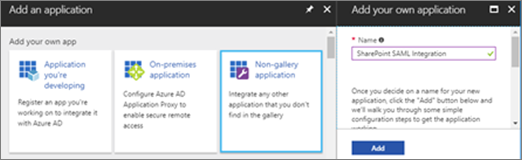

# <a name="using-azure-ad-for-sharepoint-server-authentication"></a><span data-ttu-id="f7d12-103">Azure AD を使用して SharePoint サーバーの認証</span><span class="sxs-lookup"><span data-stu-id="f7d12-103">Using Azure AD for SharePoint Server Authentication</span></span>

 <span data-ttu-id="f7d12-104">**の概要:**SharePoint サーバー 2016 Azure Active Directory でユーザーを認証する方法について説明します。</span><span class="sxs-lookup"><span data-stu-id="f7d12-104">**Summary:** Learn how to authenticate your SharePoint Server 2016 users with Azure Active Directory.</span></span>
  
> [!NOTE]
> <span data-ttu-id="f7d12-105">この資料は、カーク Evans、マイクロソフトのプリンシパル プログラム マネージャーの作業に基づいています。</span><span class="sxs-lookup"><span data-stu-id="f7d12-105">This article is based on the work of Kirk Evans, a Microsoft Principal Program Manager.</span></span> 

<blockquote>
<p><span data-ttu-id="f7d12-p101">この資料では、Azure Active Directory のグラフと対話するためのコード サンプルを参照します。コード サンプルをダウンロードすることができます[ここ](https://github.com/kaevans/spsaml11/tree/master/scripts)。</span><span class="sxs-lookup"><span data-stu-id="f7d12-p101">This article refers to code samples for interacting with Azure Active Directory Graph. You can download the code samples  [here](https://github.com/kaevans/spsaml11/tree/master/scripts).</span></span></p>
</blockquote>

<span data-ttu-id="f7d12-p102">SharePoint サーバー 2016年には、信頼できるが、他のユーザーを管理する別の id プロバイダーとそれらを認証することによって、ユーザーを管理しやすく、クレーム ベース認証を使用してユーザーを認証する機能が用意されています。たとえば、Active Directory ドメイン サービス (AD DS) を使用したユーザー認証を管理するのではなく Azure Active Directory (AD の Azure) を使用して認証するユーザーを有効にする可能性があります。こうと、ユーザー名で onmicrosoft.com サフィックスを持つクラウド専用のユーザーの認証、ユーザーは、オンプレミスのディレクトリと同期しその他のディレクトリからのゲスト ユーザーを招待します。多要素認証と高度なレポート作成機能など、Azure AD 機能を活用することもできます。</span><span class="sxs-lookup"><span data-stu-id="f7d12-p102">SharePoint Server 2016 provides the ability to authenticate users using claims-based authentication, making it easy to manage your users by authenticating them with different identity providers that you trust but someone else manages. For example, instead of managing user authentication through Active Directory Domain Services (AD DS), you could enable users to authenticate using Azure Active Directory (Azure AD). This enables authentication for cloud-only users with the onmicrosoft.com suffix in their username, users synchronized with an on-premises directory, and invited guest users from other directories. It also enables you to take advantage of Azure AD features such as multi-factor authentication and advanced reporting capabilities.</span></span>

> [!IMPORTANT]
> <span data-ttu-id="f7d12-p103">この資料で説明するソリューションは、SharePoint Server 2013 はでも使用できます。ただし、SharePoint Server 2013 がメイン ストリーム サポート終了に近づいていることに留意してください。詳細については、[マイクロソフト ライフ サイクル ポリシー](https://support.microsoft.com/en-us/lifecycle/search?alpha=SharePoint%20Server%202013) 」および「 [SharePoint 2013 製品のサービス ポリシーの更新](https://technet.microsoft.com/library/684173bb-e90a-4eb7-b268-b8d7458bc802(v=office.16).aspx)を参照してください。</span><span class="sxs-lookup"><span data-stu-id="f7d12-p103">The solution described in this article can also be used with SharePoint Server 2013; however, keep in mind that SharePoint Server 2013 is nearing the end of mainstream support. For more information, see [Microsoft Lifecycle Policy](https://support.microsoft.com/en-us/lifecycle/search?alpha=SharePoint%20Server%202013) and [Updated Product Servicing Policy for SharePoint 2013](https://technet.microsoft.com/library/684173bb-e90a-4eb7-b268-b8d7458bc802(v=office.16).aspx).</span></span>

<span data-ttu-id="f7d12-p104">この資料では、Azure AD、設置型ではなく、ユーザーを認証するために使用する方法について説明 AD DS です。この構成では、Azure AD は、SharePoint サーバーの 2016年の信頼できる id プロバイダーになります。この構成では、SharePoint サーバーの 2016年インストール自体で使用される AD DS の認証とは別のユーザー認証方法を追加します。、この資料を活用する必要があります WS フェデレーションとします。詳細については、 [Ws-federation の理解](https://go.microsoft.com/fwlink/p/?linkid=188052)を参照してください。</span><span class="sxs-lookup"><span data-stu-id="f7d12-p104">This article explains how you can use Azure AD to authenticate your users instead of your on-premises AD DS. In this configuration, Azure AD becomes a trusted identity provider for SharePoint Server 2016. This configuration adds a user authentication method that is separate from the AD DS authentication used by the SharePoint Server 2016 installation itself. To benefit from this article, you should be familiar with WS-Federation. For more information, see [Understanding WS-Federation](https://go.microsoft.com/fwlink/p/?linkid=188052).</span></span>


<span data-ttu-id="f7d12-p105">以前は、この構成を持つ必要がなど Azure アクセス制御サービス (ACS)、クラウド環境にフェデレーション サービスをホストしている Active Directory フェデレーション サービス (AD FS) を SAML 1.1 から SAML 2.0 トークンに変換します。Azure AD を今すぐ発行元の SAML 1.1 トークンを使用すると、この変換は必要ではありません。上の図では、この変換を実行する中間層の要件が不要になったことを示すこの構成では、SharePoint の 2016年ユーザーの認証のしくみを示しています。</span><span class="sxs-lookup"><span data-stu-id="f7d12-p105">Previously, this configuration would have required a federation service such as Azure Access Control Service (ACS) in the cloud or an environment that hosts Active Directory Federation Services (AD FS) to transform tokens from SAML 2.0 to SAML 1.1. This transformation is no longer required as Azure AD now enables issuing SAML 1.1 tokens. The diagram above shows how authentication works for SharePoint 2016 users in this configuration, demonstrating that there is no longer a requirement for an intermediary to perform this transformation.</span></span>

> [!NOTE]
> <span data-ttu-id="f7d12-p106">この構成では、Azure の仮想マシンまたは設置型の SharePoint ファームがホストされているかどうかを機能します。ユーザーを確認する追加のファイアウォール ポートを開くと Azure Active Directory をブラウザーからアクセスできることは不要です。</span><span class="sxs-lookup"><span data-stu-id="f7d12-p106">This configuration works whether the SharePoint farm is hosted in Azure virtual machines or on-premises. It does not require opening additional firewall ports other than ensuring users can access Azure Active Directory from their browser.</span></span>

<span data-ttu-id="f7d12-125">SharePoint 2016 のアクセシビリティ機能については、 [SharePoint サーバーの 2016年のユーザー補助ガイドライン](https://go.microsoft.com/fwlink/p/?LinkId=393123)を参照してください。</span><span class="sxs-lookup"><span data-stu-id="f7d12-125">For information about SharePoint 2016 accessibility, see [Accessibility Guidelines in SharePoint Server 2016](https://go.microsoft.com/fwlink/p/?LinkId=393123).</span></span>

## <a name="configuration-overview"></a><span data-ttu-id="f7d12-126">構成の概要</span><span class="sxs-lookup"><span data-stu-id="f7d12-126">Configuration overview</span></span>

<span data-ttu-id="f7d12-127">Azure AD を SharePoint サーバーの 2016年の id プロバイダーとして使用する環境を設定するのには、次の一般的な手順に従います。</span><span class="sxs-lookup"><span data-stu-id="f7d12-127">Follow these general steps to set up your environment to use Azure AD as a SharePoint Server 2016 identity provider.</span></span>

1. <span data-ttu-id="f7d12-128">新しい Azure AD ディレクトリか、既存のディレクトリを使用します。</span><span class="sxs-lookup"><span data-stu-id="f7d12-128">Create a new Azure AD directory or use your existing directory.</span></span>
2. <span data-ttu-id="f7d12-129">SSL を使用するのには、Azure AD のセキュリティで保護する web アプリケーションのゾーンが構成されていることを確認します。</span><span class="sxs-lookup"><span data-stu-id="f7d12-129">Ensure the zone for the web application that you want to secure with Azure AD is configured to use SSL.</span></span>
3. <span data-ttu-id="f7d12-130">Azure AD では、新しいエンタープライズ アプリケーションを作成します。</span><span class="sxs-lookup"><span data-stu-id="f7d12-130">Create a new enterprise application in Azure AD.</span></span>
4. <span data-ttu-id="f7d12-131">SharePoint サーバー 2016年には、新しい信頼できる id プロバイダーを構成します。</span><span class="sxs-lookup"><span data-stu-id="f7d12-131">Configure a new trusted identity provider in SharePoint Server 2016.</span></span>
5. <span data-ttu-id="f7d12-132">Web アプリケーションのアクセス許可を設定します。</span><span class="sxs-lookup"><span data-stu-id="f7d12-132">Set the permissions for the web application.</span></span>
6. <span data-ttu-id="f7d12-133">Azure AD では、SAML 1.1 トークンの発行ポリシーを追加します。</span><span class="sxs-lookup"><span data-stu-id="f7d12-133">Add a SAML 1.1 token issuance policy in Azure AD.</span></span>
7. <span data-ttu-id="f7d12-134">新しいプロバイダーを確認します。</span><span class="sxs-lookup"><span data-stu-id="f7d12-134">Verify the new provider.</span></span>

<span data-ttu-id="f7d12-135">次のセクションでは、これらのタスクを実行する方法について説明します。</span><span class="sxs-lookup"><span data-stu-id="f7d12-135">The following sections describe how to perform these tasks.</span></span>

## <a name="step-1-create-a-new-azure-ad-directory-or-use-your-existing-directory"></a><span data-ttu-id="f7d12-136">ステップ 1: 作成、新しい Azure AD ディレクトリか、既存のディレクトリを使用します。</span><span class="sxs-lookup"><span data-stu-id="f7d12-136">Step 1: Create a new Azure AD directory or use your existing directory</span></span>

<span data-ttu-id="f7d12-p107">Azure ポータル ([https://portal.azure.com](https://portal.azure.com)) では、新しいディレクトリを作成します。組織名、最初のドメイン名、および国や地域を提供します。</span><span class="sxs-lookup"><span data-stu-id="f7d12-p107">In the Azure Portal ([https://portal.azure.com](https://portal.azure.com)), create a new directory. Provide the organization name, initial domain name, and the country or region.</span></span>

 

 <span data-ttu-id="f7d12-p108">など、Microsoft Office 365 または、Microsoft Azure サブスクリプションに使用される 1 つのディレクトリがある場合は、そのディレクトリを代わりに使用することができます。ディレクトリにアプリケーションを登録するアクセス許可が必要です。</span><span class="sxs-lookup"><span data-stu-id="f7d12-p108">If you already have a directory such as the one used for Microsoft Office 365 or your Microsoft Azure subscription, you can use that directory instead. You must have permissions to register applications in the directory.</span></span>

## <a name="step-2-ensure-the-zone-for-the-web-application-that-you-want-to-secure-with-azure-ad-is-configured-to-use-ssl"></a><span data-ttu-id="f7d12-142">手順 2: は、SSL を使用するのには、Azure AD のセキュリティで保護する web アプリケーションのゾーンが構成されていることを確認します。</span><span class="sxs-lookup"><span data-stu-id="f7d12-142">Step 2: Ensure the zone for the web application that you want to secure with Azure AD is configured to use SSL</span></span>

<span data-ttu-id="f7d12-p109">[Azure 内の SharePoint サーバーの 2016年ファームの高可用性を実行](https://docs.microsoft.com/en-us/azure/architecture/reference-architectures/sharepoint)することで、リファレンス ・ アーキテクチャを使用してこの資料が記述されています。記事の付属するスクリプトを使用して[この資料](https://docs.microsoft.com/en-us/azure/architecture/reference-architectures/sharepoint)で説明するソリューションを展開するは、SSL を使用しないサイトを作成します。</span><span class="sxs-lookup"><span data-stu-id="f7d12-p109">This article was written using the reference architecture in [Run a high availability SharePoint Server 2016 farm in Azure](https://docs.microsoft.com/en-us/azure/architecture/reference-architectures/sharepoint). The article’s accompanying scripts used to deploy the solution described in [this article](https://docs.microsoft.com/en-us/azure/architecture/reference-architectures/sharepoint) create a site that does not use SSL.</span></span>  

<span data-ttu-id="f7d12-p110">SAML を使用するには、SSL を使用するアプリケーションを構成する必要があります。SSL を使用する SharePoint web アプリケーションが構成されていない場合は、SSL 用の web アプリケーションを構成するのには新しい自己署名証明書を作成するのには次の手順を使用します。この構成では、ラボ環境のだけを目的とし、本番用のものではありません。本番環境では、署名証明書を使用してください。</span><span class="sxs-lookup"><span data-stu-id="f7d12-p110">Using SAML requires the application be configured to use SSL. If your SharePoint web application is not configured to use SSL, use the following steps to create a new self-signed certificate to configure the web application for SSL. This configuration is only meant for a lab environment and is not intended for production. Production environments should use a signed certificate.</span></span>

1. <span data-ttu-id="f7d12-p111">**サーバーの全体管理**に移動 > **アプリケーション管理** > **Web アプリケーションの管理**では、SSL を使用するように拡張する必要がある web アプリケーション] をクリックします。Web アプリケーションを選択し、**移動できるようにするリボン**のボタンをクリックします。同じ URL を使用してくださいが、ポート 443 の SSL を使用する web アプリケーションを拡張します。</span><span class="sxs-lookup"><span data-stu-id="f7d12-p111">Go to **Central Administration** > **Application Management** > **Manage Web Applications**, and choose the web application that needs to be extended to use SSL. Select the web application and click the **Extend ribbon** button. Extend the web application to use the same URL but use SSL with port 443.</span></span></br><span data-ttu-id="f7d12-152"></span><span class="sxs-lookup"><span data-stu-id="f7d12-152"></span></span></br>
2. <span data-ttu-id="f7d12-153">IIS マネージャー で、[ **サーバー証明書**] をダブルクリックします。</span><span class="sxs-lookup"><span data-stu-id="f7d12-153">In IIS Manager, double-click **Server Certificates**.</span></span>
3. <span data-ttu-id="f7d12-p112">[**操作**] ウィンドウには、**自己署名証明書の作成**をクリックします。[証明書] ボックスで、表示名を指定します、証明書のフレンドリ名を入力し、[ **OK**] をクリックします。</span><span class="sxs-lookup"><span data-stu-id="f7d12-p112">In the **Actions** pane, click **Create Self-Signed Certificate**. Type a friendly name for the certificate in the Specify a friendly name for the certificate box, and then click **OK**.</span></span>
4. <span data-ttu-id="f7d12-156">**サイト バインドの編集**] ダイアログ ボックスで、ホスト名が確認、フレンドリ名と同じ次の図に示すようにします。</span><span class="sxs-lookup"><span data-stu-id="f7d12-156">From the **Edit Site Binding** dialog box, ensure the host name is the same as the friendly name, as illustrated in the following image.</span></span></br><span data-ttu-id="f7d12-157"></span><span class="sxs-lookup"><span data-stu-id="f7d12-157"></span></span></br>

<span data-ttu-id="f7d12-158">IIS でサイトのバインド用の証明書を構成する SharePoint ファーム内の web フロント エンド サーバーのそれぞれが必要です。</span><span class="sxs-lookup"><span data-stu-id="f7d12-158">Each of the web front end servers in the SharePoint farm will require configuring the certificate for the site binding in IIS.</span></span>


## <a name="step-3-create-a-new-enterprise-application-in-azure-ad"></a><span data-ttu-id="f7d12-159">手順 3: Azure AD で新しいエンタープライズ アプリケーションを作成します。</span><span class="sxs-lookup"><span data-stu-id="f7d12-159">Step 3: Create a new enterprise application in Azure AD</span></span>

1. <span data-ttu-id="f7d12-p113">Azure ポータル ([https://portal.azure.com](https://portal.azure.com)) では、Azure AD ディレクトリを開きます。**エンタープライズ ・ アプリケーション**をクリックし、[**新しいアプリケーション**] をクリックします。**非ギャラリー アプリケーション**を選択します。*SharePoint SAML の統合*などの名前を指定し、[**追加**] をクリックします。</span><span class="sxs-lookup"><span data-stu-id="f7d12-p113">In the Azure Portal ([https://portal.azure.com](https://portal.azure.com)), open your Azure AD directory. Click **Enterprise Applications**, then click **New application**. Choose **Non-gallery application**. Provide a name such as *SharePoint SAML Integration* and click **Add**.</span></span></br><span data-ttu-id="f7d12-164"></span><span class="sxs-lookup"><span data-stu-id="f7d12-164"></span></span></br>
2. <span data-ttu-id="f7d12-p114">アプリケーションを構成するのにはナビゲーション ウィンドウで 1 つの記号でリンクをクリックします。**SAML ベース サインオン**SAML の構成アプリケーションのプロパティを表示するには、**シングル ・ サインオン ・ モード**のドロップダウン リストを変更します。次のプロパティを構成します。</span><span class="sxs-lookup"><span data-stu-id="f7d12-p114">Click the Single sign-on link in the navigation pane to configure the application. Change the **Single Sign-on Mode** dropdown to **SAML-based Sign-on** to reveal the SAML configuration properties for the application. Configure with the following properties:</span></span></br>
    - <span data-ttu-id="f7d12-168">識別子:`urn:sharepoint:portal.contoso.local`</span><span class="sxs-lookup"><span data-stu-id="f7d12-168">Identifier: `urn:sharepoint:portal.contoso.local`</span></span>
    - <span data-ttu-id="f7d12-169">返信の URL:`https://portal.contoso.local/_trust/default.aspx`</span><span class="sxs-lookup"><span data-stu-id="f7d12-169">Reply URL: `https://portal.contoso.local/_trust/default.aspx`</span></span>
    - <span data-ttu-id="f7d12-170">サインオン URL:`https://portal.contoso.local/_trust/default.aspx`</span><span class="sxs-lookup"><span data-stu-id="f7d12-170">Sign-on URL: `https://portal.contoso.local/_trust/default.aspx`</span></span>
    - <span data-ttu-id="f7d12-171">ユーザー識別子。`user.userprincipalname`</span><span class="sxs-lookup"><span data-stu-id="f7d12-171">User Identifier: `user.userprincipalname`</span></span></br>
    - <span data-ttu-id="f7d12-172">注意: *portal.contoso.local*をセキュリティで保護する SharePoint サイトの URL に置き換えることによって、Url を変更します。</span><span class="sxs-lookup"><span data-stu-id="f7d12-172">Note: Remember to change the URLs by replacing *portal.contoso.local* with the URL of the SharePoint site you want to secure.</span></span></br>
3. <span data-ttu-id="f7d12-173">次の行を含むテーブルを (次の表 1 のような) を設定します。</span><span class="sxs-lookup"><span data-stu-id="f7d12-173">Set up a table (similar to Table 1 below) that includes the following rows:</span></span></br> 
    - <span data-ttu-id="f7d12-174">レルム</span><span class="sxs-lookup"><span data-stu-id="f7d12-174">Realm</span></span>
    - <span data-ttu-id="f7d12-175">SAML の署名証明書ファイルへの完全パス</span><span class="sxs-lookup"><span data-stu-id="f7d12-175">Full path to SAML signing certificate file</span></span>
    - <span data-ttu-id="f7d12-176">SAML シングル サインオン サービスの URL ( */wsfed*と*/saml2*を置き換え)</span><span class="sxs-lookup"><span data-stu-id="f7d12-176">SAML Single Sign-On service URL (replacing */saml2* with */wsfed*)</span></span>
    - <span data-ttu-id="f7d12-177">アプリケーション オブジェクトの id です。</span><span class="sxs-lookup"><span data-stu-id="f7d12-177">Application Object ID.</span></span> </br>
<span data-ttu-id="f7d12-178">*識別子*の値をテーブル (「表 1 の下) に*領域*のプロパティにコピーします。</span><span class="sxs-lookup"><span data-stu-id="f7d12-178">Copy the *Identifier* value into the *Realm* property into a table  (See Table 1 below.)</span></span>
4. <span data-ttu-id="f7d12-179">変更を保存します。</span><span class="sxs-lookup"><span data-stu-id="f7d12-179">Save your changes.</span></span>
5. <span data-ttu-id="f7d12-180">サインオンの構成] ページにアクセスする**(アプリケーション名) を構成する**] リンクをクリックします。</span><span class="sxs-lookup"><span data-stu-id="f7d12-180">Click the **Configure (app name)** link to access the Configure sign-on page.</span></span></br><span data-ttu-id="f7d12-181"></span><span class="sxs-lookup"><span data-stu-id="f7d12-181"></span></span></br> 
    -  <span data-ttu-id="f7d12-p115">SAML の署名証明書を .cer の拡張子が付いたファイルとしてダウンロードする**SAML の署名証明書の生**のリンクをクリックします。コピーし、テーブルにダウンロードしたファイルへの完全パスを貼り付けます。</span><span class="sxs-lookup"><span data-stu-id="f7d12-p115">Click the **SAML Signing Certificate - Raw** link to download the SAML Signing Certificate as a file with the .cer extension. Copy and paste the full path to the downloaded file into your table.</span></span>
    - <span data-ttu-id="f7d12-184">コピーし、SAML シングル サインオン サービスの URL リンクを貼り付けるには、URL の*/saml2*の部分を*/wsfed*に置き換えます。</span><span class="sxs-lookup"><span data-stu-id="f7d12-184">Copy and paste the SAML Single Sign-On Service URL link into your, replacing the */saml2* portion of the URL with */wsfed*.</span></span></br>
6.  <span data-ttu-id="f7d12-p116">アプリケーションの [**プロパティ**] ウィンドウに移動します。コピーし、手順 3 で設定したテーブルにオブジェクト ID の値を貼り付けます。</span><span class="sxs-lookup"><span data-stu-id="f7d12-p116">Navigate to the **Properties** pane for the application. Copy and paste the Object ID value into the table you set up in Step 3.</span></span></br><span data-ttu-id="f7d12-187">![アプリケーションのプロパティ] ウィンドウ](images/SAML11/fig8-propertiespane.png)</span><span class="sxs-lookup"><span data-stu-id="f7d12-187"></span></span></br>
7. <span data-ttu-id="f7d12-188">キャプチャした値を使用して、手順 3 で設定した表次の表 1 のようになるかどうかを確認します。</span><span class="sxs-lookup"><span data-stu-id="f7d12-188">Using the values you captured, make sure the table you set up in Step 3 resembles Table 1 below.</span></span>


| <span data-ttu-id="f7d12-189">表 1: 値の取得</span><span class="sxs-lookup"><span data-stu-id="f7d12-189">Table 1: Values captured</span></span>  |  |
|---------|---------|
|<span data-ttu-id="f7d12-190">レルム</span><span class="sxs-lookup"><span data-stu-id="f7d12-190">Realm</span></span> | `urn:sharepoint:portal.contoso.local` |
|<span data-ttu-id="f7d12-191">SAML の署名証明書ファイルへの完全パス</span><span class="sxs-lookup"><span data-stu-id="f7d12-191">Full path to SAML signing certificate file</span></span> | `C:/temp/SharePoint SAML Integration.cer`  |
|<span data-ttu-id="f7d12-192">SAML シングル サインオン サービスの URL (/saml2 は/wsfed に置き換えてください)</span><span class="sxs-lookup"><span data-stu-id="f7d12-192">SAML single sign-on service URL (replace /saml2 with /wsfed)</span></span> | `https://login.microsoftonline.com/b1726649-b616-460d-8d20-defab80d476c/wsfed` |
|<span data-ttu-id="f7d12-193">アプリケーションのオブジェクト ID</span><span class="sxs-lookup"><span data-stu-id="f7d12-193">Application Object ID</span></span> | `a812f48b-d1e4-4c8e-93be-e4808c8ca3ac` |

> [!IMPORTANT]
> <span data-ttu-id="f7d12-p117">URL に*/saml2*の値を*/wsfed*に置き換えます。*/Saml2*エンドポイントでは、SAML 2.0 トークンを処理します。*/Wsfed*エンドポイントでは、処理 SAML 1.1 トークンを有効にし、SharePoint 2016 SAML フェデレーションに必要です。</span><span class="sxs-lookup"><span data-stu-id="f7d12-p117">Replace the */saml2* value in the URL with */wsfed*. The */saml2* endpoint will process SAML 2.0 tokens. The */wsfed* endpoint enables processing SAML 1.1 tokens and is required for SharePoint 2016 SAML federation.</span></span>

## <a name="step-4-configure-a-new-trusted-identity-provider-in-sharepoint-server-2016"></a><span data-ttu-id="f7d12-197">ステップ 4: SharePoint サーバーの 2016年の新しい信頼できる id プロバイダーを構成します。</span><span class="sxs-lookup"><span data-stu-id="f7d12-197">Step 4: Configure a new trusted identity provider in SharePoint Server 2016</span></span>

<span data-ttu-id="f7d12-p118">サーバー 2016 の SharePoint サーバーにサインインし、2016年の SharePoint 管理シェルを開きます。$Realm、$wsfedurl、および表 1 から $filepath の値を入力し、新しい信頼できる id プロバイダーを構成するのには次のコマンドを実行します。</span><span class="sxs-lookup"><span data-stu-id="f7d12-p118">Sign into the SharePoint Server 2016 server and open the SharePoint 2016 Management Shell. Fill in the values of $realm, $wsfedurl, and $filepath from Table 1 and run the following commands to configure a new trusted identity provider.</span></span>

> [!TIP]
> <span data-ttu-id="f7d12-200">PowerShell を使用するにした場合、または PowerShell のしくみについてより詳しく知りたい場合は、 [SharePoint の PowerShell](https://docs.microsoft.com/en-us/powershell/sharepoint/overview?view=sharepoint-ps)を参照してください。</span><span class="sxs-lookup"><span data-stu-id="f7d12-200">If you're new to using PowerShell or want to learn more about how PowerShell works, see [SharePoint PowerShell](https://docs.microsoft.com/en-us/powershell/sharepoint/overview?view=sharepoint-ps).</span></span> 

```
$realm = "<Realm from Table 1>"
$wsfedurl="<SAML single sign-on service URL from Table 1>"
$filepath="<Full path to SAML signing certificate file from Table 1>"
$cert = New-Object System.Security.Cryptography.X509Certificates.X509Certificate2($filepath)
New-SPTrustedRootAuthority -Name "AzureAD" -Certificate $cert
$map = New-SPClaimTypeMapping -IncomingClaimType "http://schemas.xmlsoap.org/ws/2005/05/identity/claims/name" -IncomingClaimTypeDisplayName "name" -LocalClaimType "http://schemas.xmlsoap.org/ws/2005/05/identity/claims/upn"
$map2 = New-SPClaimTypeMapping -IncomingClaimType "http://schemas.xmlsoap.org/ws/2005/05/identity/claims/givenname" -IncomingClaimTypeDisplayName "GivenName" -SameAsIncoming
$map3 = New-SPClaimTypeMapping -IncomingClaimType "http://schemas.xmlsoap.org/ws/2005/05/identity/claims/surname" -IncomingClaimTypeDisplayName "SurName" -SameAsIncoming
$ap = New-SPTrustedIdentityTokenIssuer -Name "AzureAD" -Description "SharePoint secured by Azure AD" -realm $realm -ImportTrustCertificate $cert -ClaimsMappings $map,$map2,$map3 -SignInUrl $wsfedurl -IdentifierClaim "http://schemas.xmlsoap.org/ws/2005/05/identity/claims/name"
```

<span data-ttu-id="f7d12-201">次に、以下の手順を実行、アプリケーションの信頼できる id プロバイダーを有効にします。</span><span class="sxs-lookup"><span data-stu-id="f7d12-201">Next, follow these steps to enable the trusted identity provider for your application:</span></span>
1. <span data-ttu-id="f7d12-202">サーバーの全体管理では、 **Web アプリケーションの管理**に移動し、Azure AD を使用してセキュリティ保護する web アプリケーションを選択します。</span><span class="sxs-lookup"><span data-stu-id="f7d12-202">In Central Administration, navigate to **Manage Web Application** and select the web application that you wish to secure with Azure AD.</span></span> 
2. <span data-ttu-id="f7d12-203">リボンでは、[**認証プロバイダー** ] をクリックしを使用するゾーンを選択します。</span><span class="sxs-lookup"><span data-stu-id="f7d12-203">In the ribbon, click **Authentication Providers** and choose the zone that you wish to use.</span></span>
3. <span data-ttu-id="f7d12-204">**信頼できる Id プロバイダー**を選択し、登録した*AzureAD*をという名前を識別するプロバイダーを選択します。</span><span class="sxs-lookup"><span data-stu-id="f7d12-204">Select **Trusted Identity provider** and select the identify provider you just registered named *AzureAD*.</span></span>  
4. <span data-ttu-id="f7d12-205">サインイン ページの URL の設定では、**ユーザー設定のサインイン ページ**を選択し、"/_trust/"の値を提供します。</span><span class="sxs-lookup"><span data-stu-id="f7d12-205">On the sign-in page URL setting, select **Custom sign in page** and provide the value “/_trust/”.</span></span> 
5. <span data-ttu-id="f7d12-206">**[OK]** をクリックします。</span><span class="sxs-lookup"><span data-stu-id="f7d12-206">Click **OK**.</span></span>


## <a name="step-5-set-the-permissions"></a><span data-ttu-id="f7d12-208">手順 5: アクセス許可を設定します。</span><span class="sxs-lookup"><span data-stu-id="f7d12-208">Step 5: Set the permissions</span></span>

<span data-ttu-id="f7d12-209">Azure AD にログインし、SharePoint にアクセスするユーザーには、アプリケーションへのアクセスを与える必要があります。</span><span class="sxs-lookup"><span data-stu-id="f7d12-209">The users who will log into Azure AD and access SharePoint must be granted access to the application.</span></span> 

1. <span data-ttu-id="f7d12-p119">Azure ポータルでは、Azure AD ディレクトリを開きます。**エンタープライズ ・ アプリケーション**をクリックし、[**すべてのアプリケーション**] をクリックします。以前に作成したアプリケーションをクリックして (SharePoint SAML 統合)。</span><span class="sxs-lookup"><span data-stu-id="f7d12-p119">In the Azure Portal, open the Azure AD directory. Click **Enterprise Applications**, then click **All applications**. Click the application that you created previously (SharePoint SAML Integration).</span></span>
2. <span data-ttu-id="f7d12-213">**ユーザーとグループ**] をクリックします。</span><span class="sxs-lookup"><span data-stu-id="f7d12-213">Click **Users and Groups**.</span></span> 
3. <span data-ttu-id="f7d12-214">Azure AD を使用して SharePoint にログインするアクセス許可を持つグループまたはユーザーを追加する**ユーザーを追加**をクリックします。</span><span class="sxs-lookup"><span data-stu-id="f7d12-214">Click **Add user** to add a user or group who will have permissions to log into SharePoint using Azure AD.</span></span>
4. <span data-ttu-id="f7d12-215">ユーザーまたはグループを選択し、[**割り当て**] をクリックします。</span><span class="sxs-lookup"><span data-stu-id="f7d12-215">Select the user or group then click **Assign**.</span></span>
 
<span data-ttu-id="f7d12-p120">ユーザーは Azure AD は、のアクセス許可が与えられてが、また、SharePoint のアクセス許可を与える必要があります。Web アプリケーションにアクセスするのにアクセス許可を設定するのにには、次の手順を使用します。</span><span class="sxs-lookup"><span data-stu-id="f7d12-p120">The user has been granted permission in Azure AD, but also must be granted permission in SharePoint. Use the following steps to set the permissions to access the web application.</span></span>

1. <span data-ttu-id="f7d12-218">サーバーの全体管理では、**アプリケーション構成の管理**をクリックします。</span><span class="sxs-lookup"><span data-stu-id="f7d12-218">In Central Administration, click **Application Management**.</span></span>
2. <span data-ttu-id="f7d12-219">[ **アプリケーション構成の管理**] ページの [ **Web アプリケーション**] セクションで、[ **Web アプリケーションの管理**] をクリックします。</span><span class="sxs-lookup"><span data-stu-id="f7d12-219">On the **Application Management** page, in the **Web Applications** section, click **Manage web applications**.</span></span>
3. <span data-ttu-id="f7d12-220">適切な Web アプリケーションをクリックし、[ **ユーザー ポリシー**] をクリックします。</span><span class="sxs-lookup"><span data-stu-id="f7d12-220">Click the appropriate web application, and then click **User Policy**.</span></span>
4. <span data-ttu-id="f7d12-221">Web アプリケーションのポリシー]、 **[ユーザーの追加**をクリックします。</span><span class="sxs-lookup"><span data-stu-id="f7d12-221">In Policy for Web Application, click **Add Users**.</span></span></br><span data-ttu-id="f7d12-222"></span><span class="sxs-lookup"><span data-stu-id="f7d12-222"></span></span></br>
5. <span data-ttu-id="f7d12-223">[ **ユーザーの追加**] ダイアログ ボックスの [ **領域**] で適切な領域をクリックし、[ **次へ**] をクリックします。</span><span class="sxs-lookup"><span data-stu-id="f7d12-223">In the **Add Users** dialog box, click the appropriate zone in **Zones**, and then click **Next**.</span></span>
6. <span data-ttu-id="f7d12-224">**Web アプリケーションのポリシー** ] ダイアログ ボックスの [**ユーザーの選択**] セクションで、[**参照**] アイコンをクリックします。</span><span class="sxs-lookup"><span data-stu-id="f7d12-224">In the **Policy for Web Application** dialog box, in the **Choose Users** section, click the **Browse** icon.</span></span>
7. <span data-ttu-id="f7d12-225">[**検索**] ボックスで、ディレクトリ内のユーザーのサインイン名を入力し、[**検索**] をクリックします。</span><span class="sxs-lookup"><span data-stu-id="f7d12-225">In the **Find** textbox, type the sign-in name for a user in your directory and click **Search**.</span></span> </br><span data-ttu-id="f7d12-226">例: *demouser@blueskyabove.onmicrosoft.com*。</span><span class="sxs-lookup"><span data-stu-id="f7d12-226">Example: *demouser@blueskyabove.onmicrosoft.com*.</span></span>
8. <span data-ttu-id="f7d12-227">リスト ビューで [AzureAD] 見出しの下 name プロパティを選択して [**追加**] をクリックし、ダイアログ ボックスを閉じます**[ok]**をクリックします。</span><span class="sxs-lookup"><span data-stu-id="f7d12-227">Under the AzureAD heading in the list view, select the name property and click **Add** then click **OK** to close the dialog.</span></span>
9. <span data-ttu-id="f7d12-228">アクセス許可] では、**フル コントロール**をクリックします。</span><span class="sxs-lookup"><span data-stu-id="f7d12-228">In Permissions, click **Full Control**.</span></span></br><span data-ttu-id="f7d12-229"></span><span class="sxs-lookup"><span data-stu-id="f7d12-229"></span></span></br>
10. <span data-ttu-id="f7d12-230">[ **完了**]、[ **OK**] の順にクリックします。</span><span class="sxs-lookup"><span data-stu-id="f7d12-230">Click **Finish**, and then click **OK**.</span></span>

## <a name="step-6-add-a-saml-11-token-issuance-policy-in-azure-ad"></a><span data-ttu-id="f7d12-231">手順 6: Azure AD で SAML 1.1 トークンの発行ポリシーを追加します。</span><span class="sxs-lookup"><span data-stu-id="f7d12-231">Step 6: Add a SAML 1.1 token issuance policy in Azure AD</span></span>

<span data-ttu-id="f7d12-p121">ポータルで AD の Azure アプリケーションが作成されると、SAML 2.0 を使用して既定になります。SharePoint サーバー 2016年には、SAML 1.1 トークン形式が必要です。次のスクリプトは SAML 2.0 の既定のポリシーを削除し、問題の SAML 1.1 トークンに新しいポリシーを追加します。このコードでは、付属の[Azure Active Directory のグラフとの対話を示すサンプル](https://github.com/kaevans/spsaml11/tree/master/scripts)をダウンロードする必要があります。</span><span class="sxs-lookup"><span data-stu-id="f7d12-p121">When the Azure AD application is created in the portal, it defaults to using SAML 2.0. SharePoint Server 2016 requires the SAML 1.1 token format. The following script will remove the default SAML 2.0 policy and add a new policy to issue SAML 1.1 tokens. This code requires downloading the accompanying [samples demonstrating interacting with Azure Active Directory Graph](https://github.com/kaevans/spsaml11/tree/master/scripts).</span></span>


```
Import-Module <file path of Initialize.ps1> 
$objectid = "<Application Object ID from Table 1>"
$saml2policyid = Get-PoliciesAssignedToServicePrincipal -servicePrincipalId $objectid | ?{$_.displayName -EQ "TokenIssuancePolicy"} | select objectId
Remove-PolicyFromServicePrincipal -policyId $saml2policyid -servicePrincipalId $objectid
$policy = Add-TokenIssuancePolicy -DisplayName SPSAML11 -SigningAlgorithm "http://www.w3.org/2001/04/xmldsig-more#rsa-sha256" -TokenResponseSigningPolicy TokenOnly -SamlTokenVersion "1.1"
Set-PolicyToServicePrincipal -policyId $policy.objectId -servicePrincipalId $objectid
```

<span data-ttu-id="f7d12-236">Azure AD でトークンの発行ポリシーの詳細については、[ポリシーの操作のためのグラフの API リファレンス](https://msdn.microsoft.com/en-us/library/azure/ad/graph/api/policy-operations#create-a-policy)を参照してください。</span><span class="sxs-lookup"><span data-stu-id="f7d12-236">For more details on Token Issuance Policies with Azure AD, see the [Graph API reference for operations on policy](https://msdn.microsoft.com/en-us/library/azure/ad/graph/api/policy-operations#create-a-policy).</span></span>

## <a name="step-7-verify-the-new-provider"></a><span data-ttu-id="f7d12-237">手順 7: 新しいプロバイダーを確認します。</span><span class="sxs-lookup"><span data-stu-id="f7d12-237">Step 7: Verify the new provider</span></span>

<span data-ttu-id="f7d12-p122">前の手順で構成した web アプリケーションの URL にブラウザーを開きます。Azure AD へのサインインにリダイレクトされます。</span><span class="sxs-lookup"><span data-stu-id="f7d12-p122">Open a browser to the URL of the web application that you configured in the previous steps. You are redirected to sign into Azure AD.</span></span>


<span data-ttu-id="f7d12-241">サインイン状態を継続するかどうかが求められます。</span><span class="sxs-lookup"><span data-stu-id="f7d12-241">You are asked if you want to stay signed in.</span></span>


<span data-ttu-id="f7d12-243">最後に、Azure Active Directory のテナントのユーザーとしてログインしてサイトにアクセスできます。</span><span class="sxs-lookup"><span data-stu-id="f7d12-243">Finally, you can access the site logged in as a user from your Azure Active Directory tenant.</span></span>


## <a name="managing-certificates"></a><span data-ttu-id="f7d12-245">証明書の管理</span><span class="sxs-lookup"><span data-stu-id="f7d12-245">Managing certificates</span></span>
<span data-ttu-id="f7d12-p123">上記の手順 4 で信頼できる id プロバイダーに対して構成された署名証明書が有効期限の更新が必要であることを理解する重要です。証明書の書き換えでは、[フェデレーション シングル サインオン Azure Active Directory 内の証明書を管理](https://docs.microsoft.com/en-us/azure/active-directory/active-directory-sso-certs)についての資料を参照してください。Azure AD で証明書が書き換えられている場合後、は、ローカル ファイルへのダウンロードし、更新された署名証明書を信頼できる id プロバイダーを構成するのには次のスクリプトを使用してください。</span><span class="sxs-lookup"><span data-stu-id="f7d12-p123">It is important to understand that the signing certificate that was configured for the trusted identity provider in step 4 above has an expiration date and must be renewed. See the article [Manage certificates for federated single sign-on in Azure Active Directory](https://docs.microsoft.com/en-us/azure/active-directory/active-directory-sso-certs) for information on certificate renewal. Once the certificate has been renewed in Azure AD, download to a local file and use the following script to configure the trusted identity provider with the renewed signing certificate.</span></span> 

```
$filepath="<Full path to renewed SAML signing certificate file>"
$cert= New-Object System.Security.Cryptography.X509Certificates.X509Certificate2($filePath)
New-SPTrustedRootAuthority -Name "AzureAD" -Certificate $cert
Get-SPTrustedIdentityTokenIssuer "AzureAD" | Set-SPTrustedIdentityTokenIssuer -ImportTrustCertificate $cert
```


## <a name="additional-resources"></a><span data-ttu-id="f7d12-249">追加リソース</span><span class="sxs-lookup"><span data-stu-id="f7d12-249">Additional resources</span></span>

[<span data-ttu-id="f7d12-250">WS-Federation について</span><span class="sxs-lookup"><span data-stu-id="f7d12-250">Understanding WS-Federation</span></span>](https://go.microsoft.com/fwlink/p/?linkid=188052)
  
[<span data-ttu-id="f7d12-251">クラウド導入およびハイブリッド ソリューション</span><span class="sxs-lookup"><span data-stu-id="f7d12-251">Cloud adoption and hybrid solutions</span></span>](cloud-adoption-and-hybrid-solutions.md)
  
## <a name="join-the-discussion"></a><span data-ttu-id="f7d12-252">ディスカッションへの参加</span><span class="sxs-lookup"><span data-stu-id="f7d12-252">Join the discussion</span></span>

|<span data-ttu-id="f7d12-253">**お問い合わせ**</span><span class="sxs-lookup"><span data-stu-id="f7d12-253">**Contact us**</span></span>|<span data-ttu-id="f7d12-254">**説明**</span><span class="sxs-lookup"><span data-stu-id="f7d12-254">**Description**</span></span>|
|:-----|:-----|
|<span data-ttu-id="f7d12-255">**必要なソリューション**</span><span class="sxs-lookup"><span data-stu-id="f7d12-255">**What cloud adoption content do you need?**</span></span> <br/> |<span data-ttu-id="f7d12-p124">複数の Microsoft 製品やサービスにまたがるソリューションに関するコンテンツを作成しています。[MODAcontent@microsoft.com](mailto:cloudadopt@microsoft.com?Subject=[Cloud%20Adoption%20Content%20Feedback]:%20) に電子メールを送信して、サーバー間のソリューションに関するご意見や、特定のソリューションに関するご質問をお寄せください。</span><span class="sxs-lookup"><span data-stu-id="f7d12-p124">We are creating content for cloud adoption that spans multiple Microsoft cloud platforms and services. Let us know what you think about our cloud adoption content, or ask for specific content by sending email to [cloudadopt@microsoft.com](mailto:cloudadopt@microsoft.com?Subject=[Cloud%20Adoption%20Content%20Feedback]:%20).  </span></span><br/> |
|<span data-ttu-id="f7d12-258">**ソリューションのディスカッションへの参加**</span><span class="sxs-lookup"><span data-stu-id="f7d12-258">**Join the cloud adoption discussion**</span></span> <br/> |<span data-ttu-id="f7d12-p125">クラウドベースのソリューションに関して強い関心がある場合は、Cloud Adoption Advisory Board (CAAB) に参加して、大規模で活発な Microsoft コンテンツ開発者、業界プロフェッショナル、および世界中のお客様の大規模で活発なコミュニティとつながることを検討してください。参加するには、Microsoft Tech Community の [CAAB (Cloud Adoption Advisory Board) スペース](https://aka.ms/caab)のメンバーとしてご自分を追加し、[CAAB@microsoft.com](mailto:caab@microsoft.com?Subject=I%20just%20joined%20the%20Cloud%20Adoption%20Advisory%20Board!) 宛に電子メールを送信してください。[CAAB ブログ](https://blogs.technet.com/b/solutions_advisory_board/)でコミュニティ関連のコンテンツをだれでも読むことができます。ただし、CAAB のメンバーになると、新しいクラウド導入のリソースやソリューションについての非公開 Web セミナーへの招待が送られます。</span><span class="sxs-lookup"><span data-stu-id="f7d12-p125">If you are passionate about cloud-based solutions, consider joining the Cloud Adoption Advisory Board (CAAB) to connect with a larger, vibrant community of Microsoft content developers, industry professionals, and customers from around the globe. To join, add yourself as a member of the [CAAB (Cloud Adoption Advisory Board) space](https://aka.ms/caab) of the Microsoft Tech Community and send us a quick email at [CAAB@microsoft.com](mailto:caab@microsoft.com?Subject=I%20just%20joined%20the%20Cloud%20Adoption%20Advisory%20Board!). Anyone can read community-related content on the [CAAB blog](https://blogs.technet.com/b/solutions_advisory_board/). However, CAAB members get invitations to private webinars that describe new cloud adoption resources and solutions.  </span></span><br/> |
|<span data-ttu-id="f7d12-262">**記載されているアートの取得方法**</span><span class="sxs-lookup"><span data-stu-id="f7d12-262">**Get the art you see here**</span></span> <br/> |<span data-ttu-id="f7d12-p126">この記事にあるアートの編集可能なコピーが必要な方には、喜んでお送りします。アートの URL とタイトルを記述した電子メールを [cloudadopt@microsoft.com](mailto:cloudadopt@microsoft.com?subject=[Art%20Request]:%20) に送信してください。</span><span class="sxs-lookup"><span data-stu-id="f7d12-p126">If you want an editable copy of the art you see in this article, we'll be glad to send it to you. Email your request, including the URL and title of the art, to [cloudadopt@microsoft.com](mailto:cloudadopt@microsoft.com?subject=[Art%20Request]:%20).  </span></span><br/> |
   

