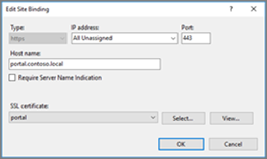
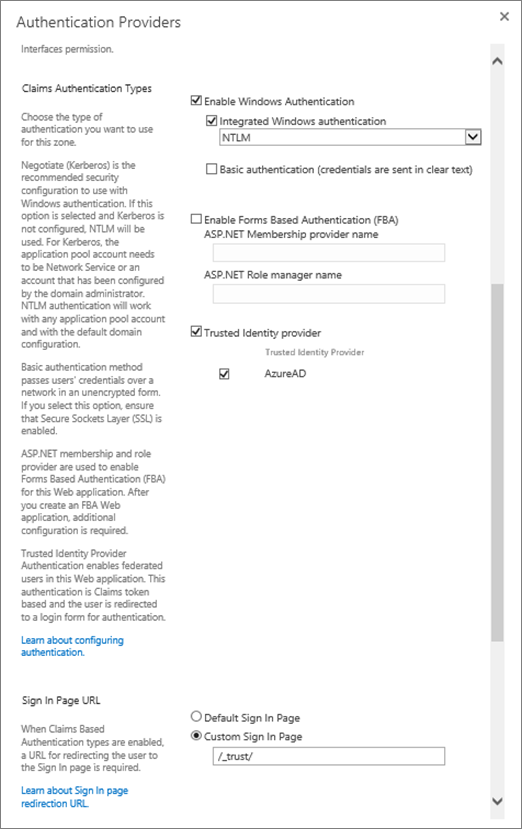
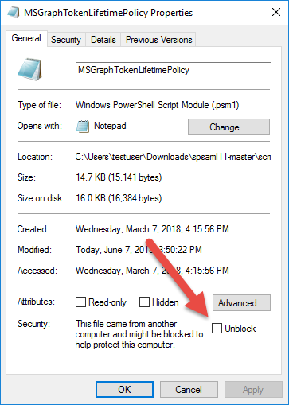
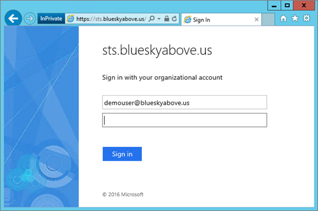
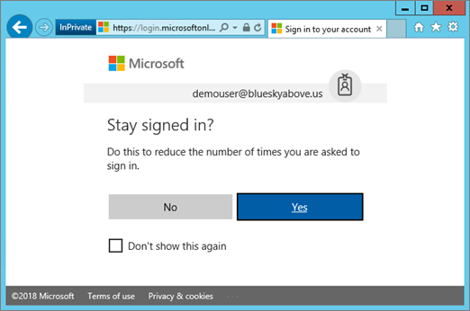

# <a name="using-azure-ad-for-sharepoint-server-authentication"></a><span data-ttu-id="720be-103">Azure AD for SharePoint サーバー認証の使用</span><span class="sxs-lookup"><span data-stu-id="720be-103">Using Azure AD for SharePoint Server Authentication</span></span>

 <span data-ttu-id="720be-104">**概要:** Azure Active Directory を使用して SharePoint Server 2016 ユーザーを認証する方法について説明します。</span><span class="sxs-lookup"><span data-stu-id="720be-104">**Summary:** Learn how to authenticate your SharePoint Server 2016 users with Azure Active Directory.</span></span> 

<blockquote>
<p><span data-ttu-id="720be-105">この記事では、Azure Active Directory のグラフと対話するためのコードサンプルを示します。</span><span class="sxs-lookup"><span data-stu-id="720be-105">This article refers to code samples for interacting with Azure Active Directory Graph.</span></span> <span data-ttu-id="720be-106">このコードサンプルは、[ここ](https://github.com/kaevans/spsaml11/tree/master/scripts)からダウンロードできます。</span><span class="sxs-lookup"><span data-stu-id="720be-106">You can download the code samples [here](https://github.com/kaevans/spsaml11/tree/master/scripts).</span></span></p>
</blockquote>

<span data-ttu-id="720be-107">SharePoint Server 2016 では、クレームベース認証を使用してユーザーを認証する機能が提供されています。これにより、ユーザーは、信頼できる別の id プロバイダーを使用して認証することにより、ユーザーを簡単に管理できます。</span><span class="sxs-lookup"><span data-stu-id="720be-107">SharePoint Server 2016 provides the ability to authenticate users using claims-based authentication, making it easy to manage your users by authenticating them with different identity providers that you trust but someone else manages.</span></span> <span data-ttu-id="720be-108">たとえば、Active Directory ドメインサービス (AD DS) を介してユーザー認証を管理する代わりに、Azure Active Directory (Azure AD) を使用してユーザーを認証できるようにすることができます。</span><span class="sxs-lookup"><span data-stu-id="720be-108">For example, instead of managing user authentication through Active Directory Domain Services (AD DS), you could enable users to authenticate using Azure Active Directory (Azure AD).</span></span> <span data-ttu-id="720be-109">これにより、ユーザー名に onmicrosoft.com サフィックスを持つクラウド専用ユーザー、オンプレミスディレクトリと同期されたユーザー、他のディレクトリからゲストユーザーを招待することができます。</span><span class="sxs-lookup"><span data-stu-id="720be-109">This enables authentication for cloud-only users with the onmicrosoft.com suffix in their username, users synchronized with an on-premises directory, and invited guest users from other directories.</span></span> <span data-ttu-id="720be-110">また、多要素認証や高度なレポート機能などの Azure AD の機能を活用することもできます。</span><span class="sxs-lookup"><span data-stu-id="720be-110">It also enables you to take advantage of Azure AD features such as multi-factor authentication and advanced reporting capabilities.</span></span>

> [!IMPORTANT]
> <span data-ttu-id="720be-111">この記事で説明するソリューションは、SharePoint Server 2013 でも使用できます。ただし、SharePoint Server 2013 は、メインストリームサポートの最後に近づいていることに注意してください。</span><span class="sxs-lookup"><span data-stu-id="720be-111">The solution described in this article can also be used with SharePoint Server 2013; however, keep in mind that SharePoint Server 2013 is nearing the end of mainstream support.</span></span> <span data-ttu-id="720be-112">詳細については、「 [Microsoft ライフサイクルポリシー](https://support.microsoft.com/en-us/lifecycle/search?alpha=SharePoint%20Server%202013) 」および「[更新された製品サービスポリシー (SharePoint 2013](https://technet.microsoft.com/library/684173bb-e90a-4eb7-b268-b8d7458bc802(v=office.16).aspx))」を参照してください。</span><span class="sxs-lookup"><span data-stu-id="720be-112">For more information, see [Microsoft Lifecycle Policy](https://support.microsoft.com/en-us/lifecycle/search?alpha=SharePoint%20Server%202013) and [Updated Product Servicing Policy for SharePoint 2013](https://technet.microsoft.com/library/684173bb-e90a-4eb7-b268-b8d7458bc802(v=office.16).aspx).</span></span>

<span data-ttu-id="720be-113">この記事では、オンプレミス AD DS の代わりに Azure AD を使用してユーザーを認証する方法について説明します。</span><span class="sxs-lookup"><span data-stu-id="720be-113">This article explains how you can use Azure AD instead of your on-premises AD DS to authenticate your users.</span></span> <span data-ttu-id="720be-114">この構成では、Azure AD は SharePoint Server 2016 の信頼できる id プロバイダーになります。</span><span class="sxs-lookup"><span data-stu-id="720be-114">In this configuration, Azure AD becomes a trusted identity provider for SharePoint Server 2016.</span></span> <span data-ttu-id="720be-115">この構成では、SharePoint Server 2016 のインストール自体で使用される AD DS 認証とは別のユーザー認証方法が追加されます。</span><span class="sxs-lookup"><span data-stu-id="720be-115">This configuration adds a user authentication method that is separate from the AD DS authentication used by the SharePoint Server 2016 installation itself.</span></span> <span data-ttu-id="720be-116">この記事を活用するには、WS-Federation を理解しておく必要があります。</span><span class="sxs-lookup"><span data-stu-id="720be-116">To benefit from this article, you should be familiar with WS-Federation.</span></span> <span data-ttu-id="720be-117">詳しくは、「[WS-Federation について](https://go.microsoft.com/fwlink/p/?linkid=188052)」をご覧ください。</span><span class="sxs-lookup"><span data-stu-id="720be-117">For more information, see [Understanding WS-Federation](https://go.microsoft.com/fwlink/p/?linkid=188052).</span></span> <span data-ttu-id="720be-118">オンプレミスの SharePoint と Azure Active Directory との統合の詳細については、[専用チュートリアル](https://docs.microsoft.com/azure/active-directory/saas-apps/sharepoint-on-premises-tutorial)を参照してください。</span><span class="sxs-lookup"><span data-stu-id="720be-118">For detailed information about integration of SharePoint on-premises with Azure Active Directory, see the [dedicated tutorial](https://docs.microsoft.com/azure/active-directory/saas-apps/sharepoint-on-premises-tutorial).</span></span>


<span data-ttu-id="720be-120">以前は、この構成には、クラウド内の Azure Access Control Service (ACS)、または Active Directory フェデレーションサービス (AD FS) をホストする環境で、SAML 2.0 から SAML 1.1 にトークンを変換するためのフェデレーションサービスが必要になりました。</span><span class="sxs-lookup"><span data-stu-id="720be-120">Previously, this configuration would have required a federation service such as Azure Access Control Service (ACS) in the cloud or an environment that hosts Active Directory Federation Services (AD FS) to transform tokens from SAML 2.0 to SAML 1.1.</span></span> <span data-ttu-id="720be-121">Azure AD が SAML 1.1 トークンの発行を有効にするため、この変換は不要になりました。</span><span class="sxs-lookup"><span data-stu-id="720be-121">This transformation is no longer required as Azure AD now enables issuing SAML 1.1 tokens.</span></span> <span data-ttu-id="720be-122">上記の図は、この構成における SharePoint 2016 ユーザーに対する認証のしくみを示しています。これは、仲介者がこの変換を実行する必要がなくなったことを示しています。</span><span class="sxs-lookup"><span data-stu-id="720be-122">The diagram above shows how authentication works for SharePoint 2016 users in this configuration, demonstrating that there is no longer a requirement for an intermediary to perform this transformation.</span></span>

> [!NOTE]
> <span data-ttu-id="720be-123">この構成は、SharePoint ファームが Azure 仮想マシンとオンプレミスのどちらでホストされているかにかかわらず機能します。</span><span class="sxs-lookup"><span data-stu-id="720be-123">This configuration works whether the SharePoint farm is hosted in Azure virtual machines or on-premises.</span></span> <span data-ttu-id="720be-124">ユーザーがブラウザーから Azure Active Directory にアクセスすることを保証する以外に、追加のファイアウォールポートを開く必要はありません。</span><span class="sxs-lookup"><span data-stu-id="720be-124">It does not require opening additional firewall ports other than ensuring users can access Azure Active Directory from their browser.</span></span>

<span data-ttu-id="720be-125">SharePoint 2016 アクセシビリティの詳細については、「 [Sharepoint Server 2016 のアクセシビリティガイドライン](https://go.microsoft.com/fwlink/p/?LinkId=393123)」を参照してください。</span><span class="sxs-lookup"><span data-stu-id="720be-125">For information about SharePoint 2016 accessibility, see [Accessibility Guidelines in SharePoint Server 2016](https://go.microsoft.com/fwlink/p/?LinkId=393123).</span></span>

## <a name="configuration-overview"></a><span data-ttu-id="720be-126">構成の概要</span><span class="sxs-lookup"><span data-stu-id="720be-126">Configuration overview</span></span>

<span data-ttu-id="720be-127">Azure AD を SharePoint Server 2016 id プロバイダーとして使用する環境をセットアップするには、次の一般的な手順を実行します。</span><span class="sxs-lookup"><span data-stu-id="720be-127">Follow these general steps to set up your environment to use Azure AD as a SharePoint Server 2016 identity provider.</span></span>

1. <span data-ttu-id="720be-128">新しい Azure AD ディレクトリを作成するか、既存のディレクトリを使用します。</span><span class="sxs-lookup"><span data-stu-id="720be-128">Create a new Azure AD directory or use your existing directory.</span></span>
2. <span data-ttu-id="720be-129">Azure AD でセキュリティ保護する web アプリケーションの領域が SSL を使用するように構成されていることを確認します。</span><span class="sxs-lookup"><span data-stu-id="720be-129">Ensure the zone for the web application that you want to secure with Azure AD is configured to use SSL.</span></span>
3. <span data-ttu-id="720be-130">Azure AD で新しいエンタープライズアプリケーションを作成します。</span><span class="sxs-lookup"><span data-stu-id="720be-130">Create a new enterprise application in Azure AD.</span></span>
4. <span data-ttu-id="720be-131">SharePoint Server 2016 で、新しい信頼できる id プロバイダーを構成します。</span><span class="sxs-lookup"><span data-stu-id="720be-131">Configure a new trusted identity provider in SharePoint Server 2016.</span></span>
5. <span data-ttu-id="720be-132">Web アプリケーションのアクセス許可を設定します。</span><span class="sxs-lookup"><span data-stu-id="720be-132">Set the permissions for the web application.</span></span>
6. <span data-ttu-id="720be-133">Azure AD に SAML 1.1 トークン発行ポリシーを追加します。</span><span class="sxs-lookup"><span data-stu-id="720be-133">Add a SAML 1.1 token issuance policy in Azure AD.</span></span>
7. <span data-ttu-id="720be-134">新しいプロバイダーを確認します。</span><span class="sxs-lookup"><span data-stu-id="720be-134">Verify the new provider.</span></span>

<span data-ttu-id="720be-135">次のセクションでは、これらのタスクを実行する方法について説明します。</span><span class="sxs-lookup"><span data-stu-id="720be-135">The following sections describe how to perform these tasks.</span></span>

## <a name="step-1-create-a-new-azure-ad-directory-or-use-your-existing-directory"></a><span data-ttu-id="720be-136">手順 1: 新しい Azure AD ディレクトリを作成するか、既存のディレクトリを使用する</span><span class="sxs-lookup"><span data-stu-id="720be-136">Step 1: Create a new Azure AD directory or use your existing directory</span></span>

<span data-ttu-id="720be-137">Azure Portal ([https://portal.azure.com](https://portal.azure.com)) で、新しいディレクトリを作成します。</span><span class="sxs-lookup"><span data-stu-id="720be-137">In the Azure Portal ([https://portal.azure.com](https://portal.azure.com)), create a new directory.</span></span> <span data-ttu-id="720be-138">組織名、最初のドメイン名、および国または地域を指定します。</span><span class="sxs-lookup"><span data-stu-id="720be-138">Provide the organization name, initial domain name, and the country or region.</span></span>

 

 <span data-ttu-id="720be-140">Microsoft Office 365 または Microsoft Azure サブスクリプションで使用されているディレクトリなどのディレクトリが既にある場合は、代わりにそのディレクトリを使用できます。</span><span class="sxs-lookup"><span data-stu-id="720be-140">If you already have a directory such as the one used for Microsoft Office 365 or your Microsoft Azure subscription, you can use that directory instead.</span></span> <span data-ttu-id="720be-141">ディレクトリにアプリケーションを登録する権限を持っている必要があります。</span><span class="sxs-lookup"><span data-stu-id="720be-141">You must have permissions to register applications in the directory.</span></span>

## <a name="step-2-ensure-the-zone-for-the-web-application-that-you-want-to-secure-with-azure-ad-is-configured-to-use-ssl"></a><span data-ttu-id="720be-142">手順 2: Azure AD でセキュリティ保護する web アプリケーションの領域が SSL を使用するように構成されていることを確認する</span><span class="sxs-lookup"><span data-stu-id="720be-142">Step 2: Ensure the zone for the web application that you want to secure with Azure AD is configured to use SSL</span></span>

<span data-ttu-id="720be-143">この記事は、「 [Azure の高可用性 SharePoint Server 2016 ファームを実行する](https://docs.microsoft.com/en-us/azure/architecture/reference-architectures/sharepoint)」の参照アーキテクチャを使用して記述されています。</span><span class="sxs-lookup"><span data-stu-id="720be-143">This article was written using the reference architecture in [Run a high availability SharePoint Server 2016 farm in Azure](https://docs.microsoft.com/en-us/azure/architecture/reference-architectures/sharepoint).</span></span> <span data-ttu-id="720be-144">[この記事](https://docs.microsoft.com/en-us/azure/architecture/reference-architectures/sharepoint)で説明しているソリューションの展開に使用される記事の付属スクリプトでは、SSL を使用しないサイトを作成します。</span><span class="sxs-lookup"><span data-stu-id="720be-144">The article’s accompanying scripts used to deploy the solution described in [this article](https://docs.microsoft.com/en-us/azure/architecture/reference-architectures/sharepoint) create a site that does not use SSL.</span></span>  

<span data-ttu-id="720be-145">SAML を使用するには、アプリケーションが SSL を使用するように構成されている必要があります。</span><span class="sxs-lookup"><span data-stu-id="720be-145">Using SAML requires the application be configured to use SSL.</span></span> <span data-ttu-id="720be-146">SharePoint web アプリケーションが SSL を使用するように構成されていない場合は、次の手順を使用して新しい自己署名証明書を作成し、SSL 用に web アプリケーションを構成します。</span><span class="sxs-lookup"><span data-stu-id="720be-146">If your SharePoint web application is not configured to use SSL, use the following steps to create a new self-signed certificate to configure the web application for SSL.</span></span> <span data-ttu-id="720be-147">この構成は、ラボ環境のみを対象としており、運用のためのものではありません。</span><span class="sxs-lookup"><span data-stu-id="720be-147">This configuration is only meant for a lab environment and is not intended for production.</span></span> <span data-ttu-id="720be-148">運用環境では、署名された証明書を使用する必要があります。</span><span class="sxs-lookup"><span data-stu-id="720be-148">Production environments should use a signed certificate.</span></span>

1. <span data-ttu-id="720be-149">サーバーの**全体管理** > の [**アプリケーション** > 構成の管理] に移動して、**web アプリケーションを管理**し、SSL を使用するように拡張する必要がある web アプリケーションを選択します。</span><span class="sxs-lookup"><span data-stu-id="720be-149">Go to **Central Administration** > **Application Management** > **Manage Web Applications**, and choose the web application that needs to be extended to use SSL.</span></span> <span data-ttu-id="720be-150">Web アプリケーションを選択し、[**リボンの拡張**] ボタンをクリックします。</span><span class="sxs-lookup"><span data-stu-id="720be-150">Select the web application and click the **Extend ribbon** button.</span></span> <span data-ttu-id="720be-151">同じ URL を使用し、ポート443で SSL を使用するように web アプリケーションを拡張します。</span><span class="sxs-lookup"><span data-stu-id="720be-151">Extend the web application to use the same URL but use SSL with port 443.</span></span><br/><span data-ttu-id="720be-152"></span><span class="sxs-lookup"><span data-stu-id="720be-152"></span></span><br/>
2. <span data-ttu-id="720be-153">IIS マネージャー で、[ **サーバー証明書**] をダブルクリックします。</span><span class="sxs-lookup"><span data-stu-id="720be-153">In IIS Manager, double-click **Server Certificates**.</span></span>
3. <span data-ttu-id="720be-154">[ **操作**] ウィンドウの [ **自己署名入り証明書の作成**] をクリックします。</span><span class="sxs-lookup"><span data-stu-id="720be-154">In the **Actions** pane, click **Create Self-Signed Certificate**.</span></span> <span data-ttu-id="720be-155">[ 証明書のフレンドリ名を指定してください] ボックスに証明書のフレンドリ名を入力して、[ **OK**] をクリックします。</span><span class="sxs-lookup"><span data-stu-id="720be-155">Type a friendly name for the certificate in the Specify a friendly name for the certificate box, and then click **OK**.</span></span>
4. <span data-ttu-id="720be-156">[**サイトバインドの編集**] ダイアログボックスで、次の図に示されているように、ホスト名がフレンドリ名と同じであることを確認します。</span><span class="sxs-lookup"><span data-stu-id="720be-156">From the **Edit Site Binding** dialog box, ensure the host name is the same as the friendly name, as illustrated in the following image.</span></span><br/><span data-ttu-id="720be-157"></span><span class="sxs-lookup"><span data-stu-id="720be-157"></span></span><br/>

<span data-ttu-id="720be-158">SharePoint ファーム内の各 web フロントエンドサーバーには、IIS でサイトバインドの証明書を構成する必要があります。</span><span class="sxs-lookup"><span data-stu-id="720be-158">Each of the web front end servers in the SharePoint farm will require configuring the certificate for the site binding in IIS.</span></span>


## <a name="step-3-create-a-new-enterprise-application-in-azure-ad"></a><span data-ttu-id="720be-159">手順 3: Azure AD で新しいエンタープライズアプリケーションを作成する</span><span class="sxs-lookup"><span data-stu-id="720be-159">Step 3: Create a new enterprise application in Azure AD</span></span>

1. <span data-ttu-id="720be-160">Azure Portal ([https://portal.azure.com](https://portal.azure.com)) で、azure AD ディレクトリを開きます。</span><span class="sxs-lookup"><span data-stu-id="720be-160">In the Azure Portal ([https://portal.azure.com](https://portal.azure.com)), open your Azure AD directory.</span></span> <span data-ttu-id="720be-161">[**エンタープライズアプリケーション**] をクリックし、[**新しいアプリケーション**] をクリックします。</span><span class="sxs-lookup"><span data-stu-id="720be-161">Click **Enterprise Applications**, then click **New application**.</span></span> <span data-ttu-id="720be-162">[**ギャラリー以外のアプリケーション**] を選択します。</span><span class="sxs-lookup"><span data-stu-id="720be-162">Choose **Non-gallery application**.</span></span> <span data-ttu-id="720be-163">*SHAREPOINT SAML 統合*などの名前を入力し、[**追加**] をクリックします。</span><span class="sxs-lookup"><span data-stu-id="720be-163">Provide a name such as *SharePoint SAML Integration* and click **Add**.</span></span><br/><span data-ttu-id="720be-164"></span><span class="sxs-lookup"><span data-stu-id="720be-164"></span></span><br/>
2. <span data-ttu-id="720be-165">ナビゲーションウィンドウで [シングルサインオン] リンクをクリックして、アプリケーションを構成します。</span><span class="sxs-lookup"><span data-stu-id="720be-165">Click the Single sign-on link in the navigation pane to configure the application.</span></span> <span data-ttu-id="720be-166">**シングルサインオンモード**ドロップダウンを **[Saml ベースのサインオン**] に変更して、アプリケーションの SAML 構成プロパティを表示します。</span><span class="sxs-lookup"><span data-stu-id="720be-166">Change the **Single Sign-on Mode** dropdown to **SAML-based Sign-on** to reveal the SAML configuration properties for the application.</span></span> <span data-ttu-id="720be-167">次のプロパティを使用して構成します。</span><span class="sxs-lookup"><span data-stu-id="720be-167">Configure with the following properties:</span></span><br/>
    - <span data-ttu-id="720be-168">識別子`urn:sharepoint:portal.contoso.local`</span><span class="sxs-lookup"><span data-stu-id="720be-168">Identifier: `urn:sharepoint:portal.contoso.local`</span></span>
    - <span data-ttu-id="720be-169">応答 URL:`https://portal.contoso.local/_trust/default.aspx`</span><span class="sxs-lookup"><span data-stu-id="720be-169">Reply URL: `https://portal.contoso.local/_trust/default.aspx`</span></span>
    - <span data-ttu-id="720be-170">サインオン URL:`https://portal.contoso.local/_trust/default.aspx`</span><span class="sxs-lookup"><span data-stu-id="720be-170">Sign-on URL: `https://portal.contoso.local/_trust/default.aspx`</span></span>
    - <span data-ttu-id="720be-171">ユーザー識別子:`user.userprincipalname`</span><span class="sxs-lookup"><span data-stu-id="720be-171">User Identifier: `user.userprincipalname`</span></span><br/>
    - <span data-ttu-id="720be-172">注: セキュリティで保護する SharePoint サイトの\*\* url を使用して、url を変更することを忘れないでください。</span><span class="sxs-lookup"><span data-stu-id="720be-172">Note: Remember to change the URLs by replacing *portal.contoso.local* with the URL of the SharePoint site you want to secure.</span></span><br/>
3. <span data-ttu-id="720be-173">次の行を含むテーブル (表1のような) を設定します。</span><span class="sxs-lookup"><span data-stu-id="720be-173">Set up a table (similar to Table 1 below) that includes the following rows:</span></span><br/> 
    - <span data-ttu-id="720be-174">Realm</span><span class="sxs-lookup"><span data-stu-id="720be-174">Realm</span></span>
    - <span data-ttu-id="720be-175">SAML 署名証明書ファイルへの完全なパス</span><span class="sxs-lookup"><span data-stu-id="720be-175">Full path to SAML signing certificate file</span></span>
    - <span data-ttu-id="720be-176">SAML シングルサインオンサービス URL (/に置き換えられる/ *saml2*を */ws給紙*)</span><span class="sxs-lookup"><span data-stu-id="720be-176">SAML Single Sign-On service URL (replacing */saml2* with */wsfed*)</span></span>
    - <span data-ttu-id="720be-177">アプリケーションオブジェクト ID。</span><span class="sxs-lookup"><span data-stu-id="720be-177">Application Object ID.</span></span> <br/>
<span data-ttu-id="720be-178">*識別子*の値を*Realm*プロパティにテーブルにコピーします (以下の表1を参照してください)。</span><span class="sxs-lookup"><span data-stu-id="720be-178">Copy the *Identifier* value into the *Realm* property into a table  (See Table 1 below.)</span></span>
4. <span data-ttu-id="720be-179">変更内容を保存します。</span><span class="sxs-lookup"><span data-stu-id="720be-179">Save your changes.</span></span>
5. <span data-ttu-id="720be-180">[ **Configure (app name)** ] リンクをクリックして、[サインオンの構成] ページにアクセスします。</span><span class="sxs-lookup"><span data-stu-id="720be-180">Click the **Configure (app name)** link to access the Configure sign-on page.</span></span><br/><span data-ttu-id="720be-181"></span><span class="sxs-lookup"><span data-stu-id="720be-181"></span></span><br/> 
    -  <span data-ttu-id="720be-182">Saml 署名証明書 **-Raw**リンクをクリックして、Saml 署名証明書を .cer 拡張子のファイルとしてダウンロードします。</span><span class="sxs-lookup"><span data-stu-id="720be-182">Click the **SAML Signing Certificate - Raw** link to download the SAML Signing Certificate as a file with the .cer extension.</span></span> <span data-ttu-id="720be-183">ダウンロードしたファイルへの完全なパスをコピーして、テーブルに貼り付けます。</span><span class="sxs-lookup"><span data-stu-id="720be-183">Copy and paste the full path to the downloaded file into your table.</span></span>
    - <span data-ttu-id="720be-184">SAML シングルサインオンサービス URL のリンクをコピーしてに貼り付け、URL の */saml2*部分を */ws給紙*で置き換えます。</span><span class="sxs-lookup"><span data-stu-id="720be-184">Copy and paste the SAML Single Sign-On Service URL link into your, replacing the */saml2* portion of the URL with */wsfed*.</span></span><br/>
6.  <span data-ttu-id="720be-185">アプリケーションの [**プロパティ**] ウィンドウに移動します。</span><span class="sxs-lookup"><span data-stu-id="720be-185">Navigate to the **Properties** pane for the application.</span></span> <span data-ttu-id="720be-186">オブジェクト ID の値をコピーして、手順3で設定したテーブルに貼り付けます。</span><span class="sxs-lookup"><span data-stu-id="720be-186">Copy and paste the Object ID value into the table you set up in Step 3.</span></span><br/><span data-ttu-id="720be-187">![アプリケーションの [プロパティ] ウィンドウ](media/SAML11/fig8-propertiespane.png)</span><span class="sxs-lookup"><span data-stu-id="720be-187"></span></span><br/>
7. <span data-ttu-id="720be-188">取得した値を使用して、手順3で設定したテーブルが次の表1のようになっていることを確認します。</span><span class="sxs-lookup"><span data-stu-id="720be-188">Using the values you captured, make sure the table you set up in Step 3 resembles Table 1 below.</span></span>


| <span data-ttu-id="720be-189">表 1: 取得した値</span><span class="sxs-lookup"><span data-stu-id="720be-189">Table 1: Values captured</span></span>  |  |
|---------|---------|
|<span data-ttu-id="720be-190">Realm</span><span class="sxs-lookup"><span data-stu-id="720be-190">Realm</span></span> | `urn:sharepoint:portal.contoso.local` |
|<span data-ttu-id="720be-191">SAML 署名証明書ファイルへの完全なパス</span><span class="sxs-lookup"><span data-stu-id="720be-191">Full path to SAML signing certificate file</span></span> | `C:/temp/SharePoint SAML Integration.cer`  |
|<span data-ttu-id="720be-192">SAML シングルサインオンサービスの URL (/に置き換えて、saml2 を/ws給紙)</span><span class="sxs-lookup"><span data-stu-id="720be-192">SAML single sign-on service URL (replace /saml2 with /wsfed)</span></span> | `https://login.microsoftonline.com/b1726649-b616-460d-8d20-defab80d476c/wsfed` |
|<span data-ttu-id="720be-193">アプリケーションオブジェクト ID</span><span class="sxs-lookup"><span data-stu-id="720be-193">Application Object ID</span></span> | `a812f48b-d1e4-4c8e-93be-e4808c8ca3ac` |

> [!IMPORTANT]
> <span data-ttu-id="720be-194">URL の */saml2*の値を */ws給紙*に置き換えます。</span><span class="sxs-lookup"><span data-stu-id="720be-194">Replace the */saml2* value in the URL with */wsfed*.</span></span> <span data-ttu-id="720be-195">*/Saml2*エンドポイントは、SAML 2.0 トークンを処理します。</span><span class="sxs-lookup"><span data-stu-id="720be-195">The */saml2* endpoint will process SAML 2.0 tokens.</span></span> <span data-ttu-id="720be-196">*/Ws給紙*エンドポイントを使用すると、saml 1.1 トークンが処理され、SHAREPOINT 2016 SAML フェデレーションに必要になります。</span><span class="sxs-lookup"><span data-stu-id="720be-196">The */wsfed* endpoint enables processing SAML 1.1 tokens and is required for SharePoint 2016 SAML federation.</span></span>

## <a name="step-4-configure-a-new-trusted-identity-provider-in-sharepoint-server-2016"></a><span data-ttu-id="720be-197">手順 4: SharePoint Server 2016 で新しい信頼できる id プロバイダーを構成する</span><span class="sxs-lookup"><span data-stu-id="720be-197">Step 4: Configure a new trusted identity provider in SharePoint Server 2016</span></span>

<span data-ttu-id="720be-198">SharePoint Server 2016 サーバーにサインインし、SharePoint 2016 管理シェルを開きます。</span><span class="sxs-lookup"><span data-stu-id="720be-198">Sign into the SharePoint Server 2016 server and open the SharePoint 2016 Management Shell.</span></span> <span data-ttu-id="720be-199">表1の $realm、$wsfedurl、および $filepath の値を入力し、次のコマンドを実行して、新しい信頼できる id プロバイダーを構成します。</span><span class="sxs-lookup"><span data-stu-id="720be-199">Fill in the values of $realm, $wsfedurl, and $filepath from Table 1 and run the following commands to configure a new trusted identity provider.</span></span>

> [!TIP]
> <span data-ttu-id="720be-200">PowerShell を初めて使用する場合や、PowerShell のしくみの詳細については、「 [SharePoint powershell](https://docs.microsoft.com/en-us/powershell/sharepoint/overview?view=sharepoint-ps)」を参照してください。</span><span class="sxs-lookup"><span data-stu-id="720be-200">If you're new to using PowerShell or want to learn more about how PowerShell works, see [SharePoint PowerShell](https://docs.microsoft.com/en-us/powershell/sharepoint/overview?view=sharepoint-ps).</span></span> 

```
$realm = "<Realm from Table 1>"
$wsfedurl="<SAML single sign-on service URL from Table 1>"
$filepath="<Full path to SAML signing certificate file from Table 1>"
$cert = New-Object System.Security.Cryptography.X509Certificates.X509Certificate2($filepath)
New-SPTrustedRootAuthority -Name "AzureAD" -Certificate $cert
$map = New-SPClaimTypeMapping -IncomingClaimType "http://schemas.xmlsoap.org/ws/2005/05/identity/claims/name" -IncomingClaimTypeDisplayName "name" -LocalClaimType "http://schemas.xmlsoap.org/ws/2005/05/identity/claims/upn"
$map2 = New-SPClaimTypeMapping -IncomingClaimType "http://schemas.xmlsoap.org/ws/2005/05/identity/claims/givenname" -IncomingClaimTypeDisplayName "GivenName" -SameAsIncoming
$map3 = New-SPClaimTypeMapping -IncomingClaimType "http://schemas.xmlsoap.org/ws/2005/05/identity/claims/surname" -IncomingClaimTypeDisplayName "SurName" -SameAsIncoming
$ap = New-SPTrustedIdentityTokenIssuer -Name "AzureAD" -Description "SharePoint secured by Azure AD" -realm $realm -ImportTrustCertificate $cert -ClaimsMappings $map,$map2,$map3 -SignInUrl $wsfedurl -IdentifierClaim "http://schemas.xmlsoap.org/ws/2005/05/identity/claims/name"
```

<span data-ttu-id="720be-201">次に、以下の手順に従って、アプリケーションに対して信頼できる id プロバイダーを有効にします。</span><span class="sxs-lookup"><span data-stu-id="720be-201">Next, follow these steps to enable the trusted identity provider for your application:</span></span>
1. <span data-ttu-id="720be-202">サーバーの全体管理で、[ **Web アプリケーションの管理**] に移動し、Azure AD でセキュリティ保護する web アプリケーションを選択します。</span><span class="sxs-lookup"><span data-stu-id="720be-202">In Central Administration, navigate to **Manage Web Application** and select the web application that you wish to secure with Azure AD.</span></span> 
2. <span data-ttu-id="720be-203">リボンで [**認証プロバイダー** ] をクリックし、使用する領域を選択します。</span><span class="sxs-lookup"><span data-stu-id="720be-203">In the ribbon, click **Authentication Providers** and choose the zone that you wish to use.</span></span>
3. <span data-ttu-id="720be-204">[**信頼できる id プロバイダー** ] を選択し、 *AzureAD*という名前で登録したプロバイダーを選択します。</span><span class="sxs-lookup"><span data-stu-id="720be-204">Select **Trusted Identity provider** and select the identify provider you just registered named *AzureAD*.</span></span>  
4. <span data-ttu-id="720be-205">[サインインページの URL] 設定で、[**カスタムサインインページ**] を選択し、値 "//trust/" を指定します。</span><span class="sxs-lookup"><span data-stu-id="720be-205">On the sign-in page URL setting, select **Custom sign in page** and provide the value "/_trust/".</span></span> 
5. <span data-ttu-id="720be-206">**[OK]** をクリックします。</span><span class="sxs-lookup"><span data-stu-id="720be-206">Click **OK**.</span></span>



> [!IMPORTANT]
> <span data-ttu-id="720be-208">表示されているように、カスタムのサインインページを "/" trust/"に設定するなど、すべての手順に従うことが重要です。</span><span class="sxs-lookup"><span data-stu-id="720be-208">It is important to follow all steps, including setting the custom sign in page to "/_trust/" as shown.</span></span> <span data-ttu-id="720be-209">すべての手順に従っていない限り、構成は正しく機能しません。</span><span class="sxs-lookup"><span data-stu-id="720be-209">The configuration will not work correctly unless all steps are followed.</span></span>

## <a name="step-5-set-the-permissions"></a><span data-ttu-id="720be-210">手順 5: アクセス許可を設定する</span><span class="sxs-lookup"><span data-stu-id="720be-210">Step 5: Set the permissions</span></span>

<span data-ttu-id="720be-211">Azure AD にログインし、SharePoint にアクセスするユーザーには、アプリケーションへのアクセス権が付与されている必要があります。</span><span class="sxs-lookup"><span data-stu-id="720be-211">The users who will log into Azure AD and access SharePoint must be granted access to the application.</span></span> 

1. <span data-ttu-id="720be-212">Azure Portal で Azure AD ディレクトリを開きます。</span><span class="sxs-lookup"><span data-stu-id="720be-212">In the Azure Portal, open the Azure AD directory.</span></span> <span data-ttu-id="720be-213">[**エンタープライズアプリケーション**] をクリックし、[**すべてのアプリケーション**] をクリックします。</span><span class="sxs-lookup"><span data-stu-id="720be-213">Click **Enterprise Applications**, then click **All applications**.</span></span> <span data-ttu-id="720be-214">以前に作成したアプリケーション (SharePoint SAML 統合) をクリックします。</span><span class="sxs-lookup"><span data-stu-id="720be-214">Click the application that you created previously (SharePoint SAML Integration).</span></span>
2. <span data-ttu-id="720be-215">[**ユーザーとグループ] を**クリックします。</span><span class="sxs-lookup"><span data-stu-id="720be-215">Click **Users and Groups**.</span></span> 
3. <span data-ttu-id="720be-216">Azure AD を使用して SharePoint にログインするためのアクセス許可を持つユーザーまたはグループを追加するには、[**ユーザーの追加**] をクリックします。</span><span class="sxs-lookup"><span data-stu-id="720be-216">Click **Add user** to add a user or group who will have permissions to log into SharePoint using Azure AD.</span></span>
4. <span data-ttu-id="720be-217">ユーザーまたはグループを選択し、[**割り当て**] をクリックします。</span><span class="sxs-lookup"><span data-stu-id="720be-217">Select the user or group then click **Assign**.</span></span>
 
<span data-ttu-id="720be-218">ユーザーには Azure AD でのアクセス許可が付与されていますが、SharePoint でアクセス許可を付与する必要もあります。</span><span class="sxs-lookup"><span data-stu-id="720be-218">The user has been granted permission in Azure AD, but also must be granted permission in SharePoint.</span></span> <span data-ttu-id="720be-219">以下のステップを使用して、Web アプリケーションにアクセスするためのアクセス許可を設定します。</span><span class="sxs-lookup"><span data-stu-id="720be-219">Use the following steps to set the permissions to access the web application.</span></span>

1. <span data-ttu-id="720be-220">サーバーの全体管理で、 **[アプリケーション構成の管理]** をクリックします。</span><span class="sxs-lookup"><span data-stu-id="720be-220">In Central Administration, click **Application Management**.</span></span>
2. <span data-ttu-id="720be-221">[ **アプリケーション構成の管理**] ページの [ **Web アプリケーション**] セクションで、[ **Web アプリケーションの管理**] をクリックします。</span><span class="sxs-lookup"><span data-stu-id="720be-221">On the **Application Management** page, in the **Web Applications** section, click **Manage web applications**.</span></span>
3. <span data-ttu-id="720be-222">適切な Web アプリケーションをクリックし、[ **ユーザー ポリシー**] をクリックします。</span><span class="sxs-lookup"><span data-stu-id="720be-222">Click the appropriate web application, and then click **User Policy**.</span></span>
4. <span data-ttu-id="720be-223">[Web アプリケーションのポリシー] で、[**ユーザーの追加**] をクリックします。</span><span class="sxs-lookup"><span data-stu-id="720be-223">In Policy for Web Application, click **Add Users**.</span></span><br/><span data-ttu-id="720be-224"></span><span class="sxs-lookup"><span data-stu-id="720be-224"></span></span><br/>
5. <span data-ttu-id="720be-225">[ **ユーザーの追加**] ダイアログ ボックスの [ **領域**] で適切な領域をクリックし、[ **次へ**] をクリックします。</span><span class="sxs-lookup"><span data-stu-id="720be-225">In the **Add Users** dialog box, click the appropriate zone in **Zones**, and then click **Next**.</span></span>
6. <span data-ttu-id="720be-226">[ **Web アプリケーションのポリシー** ] ダイアログボックスの [**ユーザーの選択**] セクションで、[**参照**] アイコンをクリックします。</span><span class="sxs-lookup"><span data-stu-id="720be-226">In the **Policy for Web Application** dialog box, in the **Choose Users** section, click the **Browse** icon.</span></span>
7. <span data-ttu-id="720be-227">[**検索**] テキストボックスに、ディレクトリ内のユーザーのサインイン名を入力し、[**検索**] をクリックします。</span><span class="sxs-lookup"><span data-stu-id="720be-227">In the **Find** textbox, type the sign-in name for a user in your directory and click **Search**.</span></span> <br/><span data-ttu-id="720be-228">例: *demouser@blueskyabove.onmicrosoft.com*。</span><span class="sxs-lookup"><span data-stu-id="720be-228">Example: *demouser@blueskyabove.onmicrosoft.com*.</span></span>
8. <span data-ttu-id="720be-229">リストビューの AzureAD 見出しの下で、[名前] プロパティを選択し、[**追加**]、[ **OK** ] の順にクリックしてダイアログを閉じます。</span><span class="sxs-lookup"><span data-stu-id="720be-229">Under the AzureAD heading in the list view, select the name property and click **Add** then click **OK** to close the dialog.</span></span>
9. <span data-ttu-id="720be-230">[アクセス許可] で、[**フルコントロール**] をクリックします。</span><span class="sxs-lookup"><span data-stu-id="720be-230">In Permissions, click **Full Control**.</span></span><br/><span data-ttu-id="720be-231"></span><span class="sxs-lookup"><span data-stu-id="720be-231"></span></span><br/>
10. <span data-ttu-id="720be-232">[ **完了**]、[ **OK**] の順にクリックします。</span><span class="sxs-lookup"><span data-stu-id="720be-232">Click **Finish**, and then click **OK**.</span></span>

## <a name="step-6-add-a-saml-11-token-issuance-policy-in-azure-ad"></a><span data-ttu-id="720be-233">手順 6: Azure AD で SAML 1.1 トークン発行ポリシーを追加する</span><span class="sxs-lookup"><span data-stu-id="720be-233">Step 6: Add a SAML 1.1 token issuance policy in Azure AD</span></span>

<span data-ttu-id="720be-234">Azure AD アプリケーションがポータルで作成されると、既定では SAML 2.0 が使用されます。</span><span class="sxs-lookup"><span data-stu-id="720be-234">When the Azure AD application is created in the portal, it defaults to using SAML 2.0.</span></span> <span data-ttu-id="720be-235">SharePoint Server 2016 には、SAML 1.1 トークン形式が必要です。</span><span class="sxs-lookup"><span data-stu-id="720be-235">SharePoint Server 2016 requires the SAML 1.1 token format.</span></span> <span data-ttu-id="720be-236">次のスクリプトは、既定の SAML 2.0 ポリシーを削除し、SAML 1.1 トークンを発行するための新しいポリシーを追加します。</span><span class="sxs-lookup"><span data-stu-id="720be-236">The following script will remove the default SAML 2.0 policy and add a new policy to issue SAML 1.1 tokens.</span></span> 

> <span data-ttu-id="720be-237">このコードでは、 [Azure Active Directory のグラフと対話](https://github.com/kaevans/spsaml11/tree/master/scripts)することを示す付属のサンプルをダウンロードする必要があります。</span><span class="sxs-lookup"><span data-stu-id="720be-237">This code requires downloading the accompanying [samples demonstrating interacting with Azure Active Directory Graph](https://github.com/kaevans/spsaml11/tree/master/scripts).</span></span> <span data-ttu-id="720be-238">GitHub から Windows デスクトップにスクリプトを ZIP ファイルとしてダウンロードする場合は、スクリプトモジュールファイルおよび`MSGraphTokenLifetimePolicy.psm1` `Initialize.ps1`スクリプトファイルのブロックを解除してください ([プロパティ] を右クリックし、[ブロック解除] をクリックし、[OK] をクリックします)。</span><span class="sxs-lookup"><span data-stu-id="720be-238">If you download the scripts as a ZIP file from GitHub to a Windows desktop, make sure to unblock the `MSGraphTokenLifetimePolicy.psm1` script module file and the `Initialize.ps1` script file (right-click Properties, choose Unblock, click OK).</span></span> 
<span data-ttu-id="720be-239"></span><span class="sxs-lookup"><span data-stu-id="720be-239"></span></span>

<span data-ttu-id="720be-240">サンプルスクリプトをダウンロードした後、次のコードを使用して新しい PowerShell スクリプトを作成します。プレースホルダーは、ローカル`Initialize.ps1`コンピューターにダウンロードされたファイルのパスに置き換えられます。</span><span class="sxs-lookup"><span data-stu-id="720be-240">Once the sample script is downloaded, create a new PowerShell script using the following code, replacing the placeholder with the file path of the downloaded `Initialize.ps1` on your local machine.</span></span> <span data-ttu-id="720be-241">Application オブジェクト ID プレースホルダーを、表1に入力したアプリケーションオブジェクト ID に置き換えます。</span><span class="sxs-lookup"><span data-stu-id="720be-241">Replace the application object ID placeholder with the application object ID that you entered in Table 1.</span></span> <span data-ttu-id="720be-242">作成したら、PowerShell スクリプトを実行します。</span><span class="sxs-lookup"><span data-stu-id="720be-242">Once created, execute the PowerShell script.</span></span> 

```
function AssignSaml11PolicyToAppPrincipal
{
    Param(
        [Parameter(Mandatory=$true)]
        [string]$pathToInitializeScriptFile, 
        [Parameter(Mandatory=$true)]
        [string]$appObjectid
    )

    $folder = Split-Path $pathToInitializeScriptFile
    Push-Location $folder

    #Loads the dependent ADAL module used to acquire tokens
    Import-Module $pathToInitializeScriptFile 

    #Gets the existing token issuance policy
    $existingTokenIssuancePolicy = Get-PoliciesAssignedToServicePrincipal -servicePrincipalId $appObjectid | ?{$_.type -EQ "TokenIssuancePolicy"} 
    Write-Host "The following TokenIssuancePolicy policies are assigned to the service principal." -ForegroundColor Green
    Write-Host $existingTokenIssuancePolicy -ForegroundColor White
    $policyId = $existingTokenIssuancePolicy.objectId

    #Removes existing token issuance policy
    Write-Host "Only a single policy can be assigned to the service principal. Removing the existing policy with ID $policyId" -ForegroundColor Green
    Remove-PolicyFromServicePrincipal -policyId $policyId -servicePrincipalId $appObjectid

    #Creates a new token issuance policy and assigns to the service principal
    Write-Host "Adding the new SAML 1.1 TokenIssuancePolicy" -ForegroundColor Green
    $policy = Add-TokenIssuancePolicy -DisplayName SPSAML11 -SigningAlgorithm "http://www.w3.org/2001/04/xmldsig-more#rsa-sha256" -TokenResponseSigningPolicy TokenOnly -SamlTokenVersion "1.1"
    Write-Host "Assigning the new SAML 1.1 TokenIssuancePolicy $policy.objectId to the service principal $appObjectid" -ForegroundColor Green
    Set-PolicyToServicePrincipal -policyId $policy.objectId -servicePrincipalId $appObjectid
    Pop-Location
}

#Only edit the following two variables
$pathToInitializeScriptFile = "<file path of Initialize.ps1>"
$appObjectid = "<Application Object ID from Table 1>"

AssignSaml11PolicyToAppPrincipal $pathToInitializeScriptFile $appObjectid
```
> [!IMPORTANT]
> <span data-ttu-id="720be-243">PowerShell スクリプトが署名されていないため、実行ポリシーを設定するように求めるメッセージが表示される場合があります。</span><span class="sxs-lookup"><span data-stu-id="720be-243">The PowerShell scripts are not signed and you may be prompted to set the execution policy.</span></span> <span data-ttu-id="720be-244">実行ポリシーの詳細については、「[実行ポリシーについ](http://go.microsoft.com/fwlink/?LinkID=135170)て」を参照してください。</span><span class="sxs-lookup"><span data-stu-id="720be-244">For more information on execution policies, see [About Execution Policies](http://go.microsoft.com/fwlink/?LinkID=135170).</span></span> <span data-ttu-id="720be-245">また、サンプルスクリプトに含まれているコマンドを正常に実行するために、管理者特権のコマンドプロンプトを開く必要がある場合があります。</span><span class="sxs-lookup"><span data-stu-id="720be-245">Additionally, you may need to open an elevated command prompt to successfully execute the commands contained in the sample scripts.</span></span>

<span data-ttu-id="720be-246">これらの PowerShell コマンドの例は、Graph API に対してクエリを実行する方法の例です。</span><span class="sxs-lookup"><span data-stu-id="720be-246">These sample PowerShell commands are examples of how to execute queries against the Graph API.</span></span> <span data-ttu-id="720be-247">Azure AD でのトークン発行ポリシーの詳細については、「 [GRAPH API reference for operations on policy](https://msdn.microsoft.com/en-us/library/azure/ad/graph/api/policy-operations#create-a-policy)」を参照してください。</span><span class="sxs-lookup"><span data-stu-id="720be-247">For more details on Token Issuance Policies with Azure AD, see the [Graph API reference for operations on policy](https://msdn.microsoft.com/en-us/library/azure/ad/graph/api/policy-operations#create-a-policy).</span></span>

## <a name="step-7-verify-the-new-provider"></a><span data-ttu-id="720be-248">手順 7: 新しいプロバイダーを確認する</span><span class="sxs-lookup"><span data-stu-id="720be-248">Step 7: Verify the new provider</span></span>

<span data-ttu-id="720be-249">前の手順で構成した web アプリケーションの URL に対してブラウザーを開きます。</span><span class="sxs-lookup"><span data-stu-id="720be-249">Open a browser to the URL of the web application that you configured in the previous steps.</span></span> <span data-ttu-id="720be-250">Azure AD にサインインするようにリダイレクトされます。</span><span class="sxs-lookup"><span data-stu-id="720be-250">You are redirected to sign into Azure AD.</span></span>



<span data-ttu-id="720be-252">サインインしたままにするかどうかを確認するメッセージが表示されます。</span><span class="sxs-lookup"><span data-stu-id="720be-252">You are asked if you want to stay signed in.</span></span>



<span data-ttu-id="720be-254">最後に、Azure Active Directory テナントから、ユーザーとしてログインしているサイトにアクセスできます。</span><span class="sxs-lookup"><span data-stu-id="720be-254">Finally, you can access the site logged in as a user from your Azure Active Directory tenant.</span></span>


## <a name="managing-certificates"></a><span data-ttu-id="720be-256">証明書の管理</span><span class="sxs-lookup"><span data-stu-id="720be-256">Managing certificates</span></span>
<span data-ttu-id="720be-257">上記の手順4で信頼できる id プロバイダーに対して構成されている署名証明書には有効期限があり、更新する必要があることを理解しておくことが重要です。</span><span class="sxs-lookup"><span data-stu-id="720be-257">It is important to understand that the signing certificate that was configured for the trusted identity provider in step 4 above has an expiration date and must be renewed.</span></span> <span data-ttu-id="720be-258">証明書の更新については、「 [Azure Active Directory でフェデレーションシングルサインオンの証明書を管理](https://docs.microsoft.com/en-us/azure/active-directory/active-directory-sso-certs)する」を参照してください。</span><span class="sxs-lookup"><span data-stu-id="720be-258">See the article [Manage certificates for federated single sign-on in Azure Active Directory](https://docs.microsoft.com/en-us/azure/active-directory/active-directory-sso-certs) for information on certificate renewal.</span></span> <span data-ttu-id="720be-259">Azure AD で証明書が更新されたら、ローカルファイルにダウンロードし、次のスクリプトを使用して、更新された署名証明書を使用して信頼できる id プロバイダーを構成します。</span><span class="sxs-lookup"><span data-stu-id="720be-259">Once the certificate has been renewed in Azure AD, download to a local file and use the following script to configure the trusted identity provider with the renewed signing certificate.</span></span> 

```
$filepath="<Full path to renewed SAML signing certificate file>"
$cert= New-Object System.Security.Cryptography.X509Certificates.X509Certificate2($filePath)
New-SPTrustedRootAuthority -Name "AzureAD" -Certificate $cert
Get-SPTrustedIdentityTokenIssuer "AzureAD" | Set-SPTrustedIdentityTokenIssuer -ImportTrustCertificate $cert
```
## <a name="configuring-one-trusted-identity-provider-for-multiple-web-applications"></a><span data-ttu-id="720be-260">複数の web アプリケーションに対して1つの信頼できる id プロバイダーを構成する</span><span class="sxs-lookup"><span data-stu-id="720be-260">Configuring one trusted identity provider for multiple web applications</span></span>
<span data-ttu-id="720be-261">構成は単一の web アプリケーションに対して機能しますが、複数の web アプリケーションに同じ信頼できる id プロバイダーを使用する場合は、追加の構成が必要です。</span><span class="sxs-lookup"><span data-stu-id="720be-261">The configuration works for a single web application, but needs additional configuration if you intend to use the same trusted identity provider for multiple web applications.</span></span> <span data-ttu-id="720be-262">たとえば、URL `https://portal.contoso.local`を使用するように web アプリケーションを拡張し、ユーザーを`https://sales.contoso.local`認証するためにも使用するとします。</span><span class="sxs-lookup"><span data-stu-id="720be-262">For example, assume we had extended a web application to use the URL `https://portal.contoso.local` and now want to authenticate the users to `https://sales.contoso.local` as well.</span></span> <span data-ttu-id="720be-263">これを行うには、id プロバイダーを更新して WReply パラメーターに従って、応答 URL を追加するように Azure AD のアプリケーション登録を更新する必要があります。</span><span class="sxs-lookup"><span data-stu-id="720be-263">To do this, we need to update the identity provider to honor the WReply parameter and update the application registration in Azure AD to add a reply URL.</span></span>

1. <span data-ttu-id="720be-264">Azure Portal で Azure AD ディレクトリを開きます。</span><span class="sxs-lookup"><span data-stu-id="720be-264">In the Azure Portal, open the Azure AD directory.</span></span> <span data-ttu-id="720be-265">[**アプリの登録**] をクリックし、[**すべてのアプリケーションの表示**] をクリックします。</span><span class="sxs-lookup"><span data-stu-id="720be-265">Click **App registrations**, then click **View all applications**.</span></span> <span data-ttu-id="720be-266">以前に作成したアプリケーション (SharePoint SAML 統合) をクリックします。</span><span class="sxs-lookup"><span data-stu-id="720be-266">Click the application that you created previously (SharePoint SAML Integration).</span></span>
2. <span data-ttu-id="720be-267">[**設定**] をクリックします。</span><span class="sxs-lookup"><span data-stu-id="720be-267">Click **Settings**.</span></span>
3. <span data-ttu-id="720be-268">[設定] ブレードで、[ **url の応答**] をクリックします。</span><span class="sxs-lookup"><span data-stu-id="720be-268">In the settings blade, click **Reply URLs**.</span></span> 
4. <span data-ttu-id="720be-269">その URL に追加する web アプリケーション`/_trust/default.aspx`の url (など`https://sales.contoso.local/_trust/default.aspx`) を追加し、[**保存**] をクリックします。</span><span class="sxs-lookup"><span data-stu-id="720be-269">Add the URL for the additional web application with `/_trust/default.aspx` appended to the URL (such as `https://sales.contoso.local/_trust/default.aspx`) and click **Save**.</span></span> 
5. <span data-ttu-id="720be-270">SharePoint server で、 **sharepoint 2016 管理シェル**を開き、以前に使用した信頼できる id トークンの発行元の名前を使用して、次のコマンドを実行します。</span><span class="sxs-lookup"><span data-stu-id="720be-270">On the SharePoint server, open the **SharePoint 2016 Management Shell** and execute the following commands, using the name of the trusted identity token issuer that you used previously.</span></span>

```
$t = Get-SPTrustedIdentityTokenIssuer "AzureAD"
$t.UseWReplyParameter=$true
$t.Update()
```
6. <span data-ttu-id="720be-271">サーバーの全体管理で、web アプリケーションに移動し、既存の信頼できる id プロバイダーを有効にします。</span><span class="sxs-lookup"><span data-stu-id="720be-271">In Central Administration, go to the web application and enable the existing trusted identity provider.</span></span> <span data-ttu-id="720be-272">サインインページの URL も、カスタムのサインインページ`/_trust/`として構成することを忘れないでください。</span><span class="sxs-lookup"><span data-stu-id="720be-272">Remember to also configure the sign-in page URL as a custom sign in page `/_trust/`.</span></span>
7. <span data-ttu-id="720be-273">サーバーの全体管理で、web アプリケーションをクリックし、[**ユーザーポリシー**] を選択します。</span><span class="sxs-lookup"><span data-stu-id="720be-273">In Central Administration, click the web application and choose **User Policy**.</span></span> <span data-ttu-id="720be-274">この記事で前述したように、適切なアクセス許可を持つユーザーを追加します。</span><span class="sxs-lookup"><span data-stu-id="720be-274">Add a user with the appropriate permissions as demonstrated previously in this article.</span></span>

## <a name="fixing-people-picker"></a><span data-ttu-id="720be-275">ユーザー選択ウィンドウの修正</span><span class="sxs-lookup"><span data-stu-id="720be-275">Fixing People Picker</span></span>
<span data-ttu-id="720be-276">ユーザーは Azure AD から id を使用して SharePoint 2016 にログインできるようになりましたが、ユーザーエクスペリエンスの向上にはまだ機会があります。</span><span class="sxs-lookup"><span data-stu-id="720be-276">Users can now log into SharePoint 2016 using identities from Azure AD, but there are still opportunities for improvement to the user experience.</span></span> <span data-ttu-id="720be-277">たとえば、ユーザーの検索では、ユーザー選択ウィンドウに複数の検索結果が表示されます。</span><span class="sxs-lookup"><span data-stu-id="720be-277">For instance, searching for a user presents multiple search results in the people picker.</span></span> <span data-ttu-id="720be-278">クレームマッピングで作成された3つのクレームの種類ごとに検索結果があります。</span><span class="sxs-lookup"><span data-stu-id="720be-278">There is a search result for each of the 3 claim types that were created in the claim mapping.</span></span> <span data-ttu-id="720be-279">ユーザー選択ウィンドウを使用してユーザーを選択するには、ユーザー名を正確に入力し、クレーム結果の**名前**を選択する必要があります。</span><span class="sxs-lookup"><span data-stu-id="720be-279">To choose a user using the people picker, you must type their user name exactly and choose the **name** claim result.</span></span>


<span data-ttu-id="720be-281">検索する値に検証はありません。これにより、スペルミスやユーザーが、**姓**の要求など、誤ったクレームの種類を誤って選択してしまう可能性があります。</span><span class="sxs-lookup"><span data-stu-id="720be-281">There is no validation on the values you search for, which can lead to misspellings or users accidentally choosing the wrong claim type to assign such as the **SurName** claim.</span></span> <span data-ttu-id="720be-282">これにより、ユーザーがリソースに正常にアクセスできなくなることがあります。</span><span class="sxs-lookup"><span data-stu-id="720be-282">This can prevent users from successfully accessing resources.</span></span>

<span data-ttu-id="720be-283">このシナリオを支援するために、SharePoint 2016 用のカスタムクレームプロバイダーを提供する[AzureCP](https://yvand.github.io/AzureCP/)という名前のオープンソースソリューションがあります。</span><span class="sxs-lookup"><span data-stu-id="720be-283">To assist with this scenario, there is an open-source solution called [AzureCP](https://yvand.github.io/AzureCP/) that provides a custom claims provider for SharePoint 2016.</span></span> <span data-ttu-id="720be-284">Azure AD Graph を使用して、ユーザーが入力して検証を実行する対象を解決します。</span><span class="sxs-lookup"><span data-stu-id="720be-284">It will use the Azure AD Graph to resolve what users enter and perform validation.</span></span> <span data-ttu-id="720be-285">詳細については、「 [AzureCP](https://yvand.github.io/AzureCP/)」を参照してください。</span><span class="sxs-lookup"><span data-stu-id="720be-285">Learn more at [AzureCP](https://yvand.github.io/AzureCP/).</span></span> 

## <a name="additional-resources"></a><span data-ttu-id="720be-286">追加リソース</span><span class="sxs-lookup"><span data-stu-id="720be-286">Additional resources</span></span>

[<span data-ttu-id="720be-287">WS-Federation について</span><span class="sxs-lookup"><span data-stu-id="720be-287">Understanding WS-Federation</span></span>](https://go.microsoft.com/fwlink/p/?linkid=188052)
  
[<span data-ttu-id="720be-288">クラウド導入およびハイブリッド ソリューション</span><span class="sxs-lookup"><span data-stu-id="720be-288">Cloud adoption and hybrid solutions</span></span>](cloud-adoption-and-hybrid-solutions.md)
  
## <a name="join-the-discussion"></a><span data-ttu-id="720be-289">ディスカッションへの参加</span><span class="sxs-lookup"><span data-stu-id="720be-289">Join the discussion</span></span>

|<span data-ttu-id="720be-290">**お問い合わせ**</span><span class="sxs-lookup"><span data-stu-id="720be-290">**Contact us**</span></span>|<span data-ttu-id="720be-291">**説明**</span><span class="sxs-lookup"><span data-stu-id="720be-291">**Description**</span></span>|
|:-----|:-----|
|<span data-ttu-id="720be-292">**必要なソリューション**</span><span class="sxs-lookup"><span data-stu-id="720be-292">**What cloud adoption content do you need?**</span></span> <br/> |<span data-ttu-id="720be-p136">複数の Microsoft クラウド プラットフォームおよびサービスにまたがるクラウド導入のコンテンツを作成しています。クラウド導入のコンテンツについてのご意見や特定のコンテンツの依頼を、電子メールで [cloudadopt@microsoft.com](mailto:cloudadopt@microsoft.com?Subject=[Cloud%20Adoption%20Content%20Feedback]:%20) 宛にお寄せください。</span><span class="sxs-lookup"><span data-stu-id="720be-p136">We are creating content for cloud adoption that spans multiple Microsoft cloud platforms and services. Let us know what you think about our cloud adoption content, or ask for specific content by sending email to [cloudadopt@microsoft.com](mailto:cloudadopt@microsoft.com?Subject=[Cloud%20Adoption%20Content%20Feedback]:%20).  </span></span><br/> |
|<span data-ttu-id="720be-295">**ソリューションのディスカッションへの参加**</span><span class="sxs-lookup"><span data-stu-id="720be-295">**Join the cloud adoption discussion**</span></span> <br/> |<span data-ttu-id="720be-p137">クラウドベースのソリューションに関して強い関心がある場合は、Cloud Adoption Advisory Board (CAAB) に参加して、大規模で活発な Microsoft コンテンツ開発者、業界プロフェッショナル、および世界中のお客様の大規模で活発なコミュニティとつながることを検討してください。参加するには、Microsoft Tech Community の [CAAB (Cloud Adoption Advisory Board) スペース](https://aka.ms/caab)のメンバーとしてご自分を追加し、[CAAB@microsoft.com](mailto:caab@microsoft.com?Subject=I%20just%20joined%20the%20Cloud%20Adoption%20Advisory%20Board!) 宛に電子メールを送信してください。[CAAB ブログ](https://blogs.technet.com/b/solutions_advisory_board/)でコミュニティ関連のコンテンツをだれでも読むことができます。ただし、CAAB のメンバーになると、新しいクラウド導入のリソースやソリューションについての非公開 Web セミナーへの招待が送られます。</span><span class="sxs-lookup"><span data-stu-id="720be-p137">If you are passionate about cloud-based solutions, consider joining the Cloud Adoption Advisory Board (CAAB) to connect with a larger, vibrant community of Microsoft content developers, industry professionals, and customers from around the globe. To join, add yourself as a member of the [CAAB (Cloud Adoption Advisory Board) space](https://aka.ms/caab) of the Microsoft Tech Community and send us a quick email at [CAAB@microsoft.com](mailto:caab@microsoft.com?Subject=I%20just%20joined%20the%20Cloud%20Adoption%20Advisory%20Board!). Anyone can read community-related content on the [CAAB blog](https://blogs.technet.com/b/solutions_advisory_board/). However, CAAB members get invitations to private webinars that describe new cloud adoption resources and solutions.  </span></span><br/> |
|<span data-ttu-id="720be-300">**記載されているアートの取得方法**</span><span class="sxs-lookup"><span data-stu-id="720be-300">**Get the art you see here**</span></span> <br/> |<span data-ttu-id="720be-p138">この記事にあるアートの編集可能なコピーが必要な方には、喜んでお送りします。アートの URL とタイトルを記述した電子メールを [cloudadopt@microsoft.com](mailto:cloudadopt@microsoft.com?subject=[Art%20Request]:%20) に送信してください。</span><span class="sxs-lookup"><span data-stu-id="720be-p138">If you want an editable copy of the art you see in this article, we'll be glad to send it to you. Email your request, including the URL and title of the art, to [cloudadopt@microsoft.com](mailto:cloudadopt@microsoft.com?subject=[Art%20Request]:%20).  </span></span><br/> |
   

