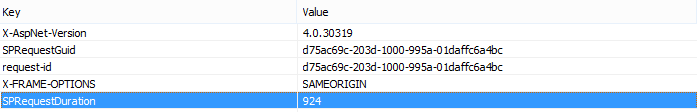

# コンテンツ クエリ Web パーツではなくコンテンツ検索 Web パーツを使用して SharePoint Online でのパフォーマンスを向上させるUsing Content Search Web Part instead of Content Query Web Part to improve performance in SharePoint Online

この資料では、コンテンツ クエリ Web パーツを SharePoint Server 2013 と SharePoint Online のコンテンツ検索 Web パーツで置き換えることによってパフォーマンスを向上させる方法について説明します。This article describes how to increase performance by replacing the Content Query Web Part with the Content Search Web Part in SharePoint Server 2013 and SharePoint Online.
  
SharePoint Server 2013 と SharePoint Online の最も強力な新機能の 1 つは、コンテンツ検索 Web パーツ (CSWP) です。この Web パーツは、ユーザーに示されている結果を迅速に取得するのには、検索インデックスを使用します。ユーザーのパフォーマンスを向上させるためにではなく、コンテンツ クエリ Web パーツ (CQWP)、ページのコンテンツ検索 Web パーツを使用します。One of the most powerful new features of SharePoint Server 2013 and SharePoint Online is the Content Search Web Part (CSWP). This Web Part uses the search index to quickly retrieve results which are shown to the user. Use the Content Search Web Part instead of the Content Query Web Part (CQWP) in your pages to improve performance for your users.
  
コンテンツ クエリ Web パーツにコンテンツ検索 Web パーツを使用するほとんどの場合、SharePoint Online のページ読み込みのパフォーマンスを大幅に向上されます。右のクエリを取得するのには少し追加の構成がありますが、パフォーマンスを向上させるとすれば、ユーザーは。Using a Content Search Web Part over a Content Query Web Part will almost always result in significantly better page load performance on SharePoint Online. There is a little additional configuration to get the right query, but the rewards are improved performance and happier users.
  
## コンテンツ クエリ Web パーツではなくコンテンツ検索 Web パーツを使用してから取得したパフォーマンスの向上を比較します。Comparing the performance gain you get from using Content Search Web Part instead of Content Query Web Part

次の例では、コンテンツ クエリ Web パーツではなくコンテンツ検索 Web パーツを使用すると表示される相対的なパフォーマンス上の利点を示しています。効果は、複雑なサイト構造と非常に広範なコンテンツ クエリではわかりやすい。The following examples show the relative performance gains you may receive when you use a Content Search Web Part instead of a Content Query Web Part. The effects are more obvious with a complex site structure and very broad content queries.
  
この例のサイトには、次の特徴があります。This example site has the following characteristics:
  
- サブサイトの 8 レベルです。8 levels of subsites.
    
- 「フルーツ」のカスタム コンテンツ タイプを使用して一覧表示します。Lists using a custom "fruit" content type.
    
- Web パーツでコンテンツのクエリは全体を見て、「フルーツ」のコンテンツ タイプのすべての項目を返すことです。In the Web Part, the content query is broad, returning all items with the content type of "fruit".
    
- のみ 8 のサイト間で 50 の項目を使用します。効果がもより顕著になるサイトのより多くのコンテンツを持つ。The example only uses 50 items across the 8 sites. The effects will be even more pronounced for sites with more content.
    
コンテンツ クエリ Web パーツの結果のスクリーン ショットを次に示します。Here is a screen shot of the results of the Content Query Web Part.
  

  
Internet Explorer では、F12 開発者ツールの [**ネットワーク**] タブを使用して、応答ヘッダーの詳細を確認します。次のスクリーン ショットでは、このページの読み込みの**SPRequestDuration**の値は、924 ミリ秒です。In Internet Explorer, use the **Network** tab of the F12 developer tools to look at the details for the response header. In the following screen shot, the value for the **SPRequestDuration** for this page load is 924 milliseconds. 
  

  
 **SPRequestDuration**では、ページを準備するのにはサーバー上で実行された作業量を示します。検索 Web パーツでコンテンツ クエリ Web パーツでコンテンツを大幅に切り替え、ページのレンダリングにかかる時間が減少します。対照的に、同等でコンテンツ検索 Web パーツをページには、106 時間をミリ秒単位でこのスクリーン ショットに示すように、 **SPRequestDuration**値が含まれて同じ数の結果を返します。**SPRequestDuration** indicates the amount of work that is done on the server to prepare the page. Switching Content by Query Web Parts with Content by Search Web Parts dramatically reduces the time it takes to render the page. By contrast, a page with an equivalent Content Search Web Part, returning the same number of results has an **SPRequestDuration** value of 106 milliseconds as shown in this screen shot: 
  

  
## SharePoint のオンライン コンテンツの検索 Web パーツを追加します。Adding a Content Search Web Part in SharePoint Online

コンテンツ検索 Web パーツを追加する、正規のコンテンツ クエリ Web パーツに似ています。セクションでは、 [SharePoint のコンテンツ検索 Web パーツを構成する](https://support.office.com/article/Configure-a-Content-Search-Web-Part-in-SharePoint-0dc16de1-dbe4-462b-babb-bf8338c36c9a) *」、コンテンツ検索 Web パーツの追加」* を参照してください。Adding a Content Search Web Part is very similar to a regular Content Query Web Part. See the section  *"Add a Content Search Web Part"*  in [Configure a Content Search Web Part in SharePoint](https://support.office.com/article/Configure-a-Content-Search-Web-Part-in-SharePoint-0dc16de1-dbe4-462b-babb-bf8338c36c9a).
  
## コンテンツ検索 Web パーツの適切な検索クエリを作成します。Creating the right search query for your Content Search Web Part

コンテンツ検索 Web パーツを追加すると、検索を絞り込むし、目的のアイテムを取得できます。これを行う方法の詳細については、 [SharePoint のコンテンツ検索 Web パーツの構成](https://support.office.com/article/Configure-a-Content-Search-Web-Part-in-SharePoint-0dc16de1-dbe4-462b-babb-bf8338c36c9a)での *「コンテンツ検索 Web パーツでの高度なクエリを構成することでコンテンツ表示を」* のセクションを参照してください。Once you have added a Content Search Web Part, you can refine the search and return the items you want. For detailed instructions on how to do this, see the section,  *"Display content by configuring an advanced query in a Content Search Web Part"*  in [Configure a Content Search Web Part in SharePoint](https://support.office.com/article/Configure-a-Content-Search-Web-Part-in-SharePoint-0dc16de1-dbe4-462b-babb-bf8338c36c9a).
  
## クエリを構築およびテスト ツールQuery building and testing tool

ビルドし、複雑なクエリをテストするツール、Codeplex で[検索クエリ ツール](https://sp2013searchtool.codeplex.com/)を参照してください。For a tool to build and test complex queries, see the [Search Query Tool](https://sp2013searchtool.codeplex.com/) on Codeplex. 
  

