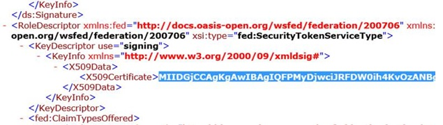

# <a name="using-microsoft-azure-active-directory-for-sharepoint-2013-authentication"></a><span data-ttu-id="c06f4-103">SharePoint 2013 認証に Microsoft Azure Active Directory を使用する</span><span class="sxs-lookup"><span data-stu-id="c06f4-103">Using Microsoft Azure Active Directory for SharePoint 2013 authentication</span></span>

 <span data-ttu-id="c06f4-104">**概要:** Azure Access Control Service を使用して、SharePoint Server 2013 ユーザーを Azure Active Directory で認証する方法について説明します。</span><span class="sxs-lookup"><span data-stu-id="c06f4-104">**Summary:** Learn how to use the Azure Access Control Service to authenticate your SharePoint Server 2013 users with Azure Active Directory.</span></span>
  
<span data-ttu-id="c06f4-p101">異なる ID プロバイダーを使用してユーザーを認証すると、ユーザーの管理がより簡単になります。信頼性のある、他人が管理する ID プロバイダーを使用できると非常に便利です。たとえば、クラウドで SharePoint Server 2013 にアクセスするユーザーの認証と、オンプレミス環境の SharePoint 2013 ユーザー用の認証にそれぞれ別のものを使用できます。Azure Access Control Service を使用すると、こうした選択が可能になります。</span><span class="sxs-lookup"><span data-stu-id="c06f4-p101">It can be easier to manage your users by authenticating them with different identity providers. Consider how convenient it can be to use an identity provider that you trust, but someone else manages. For example, you could have one type of authentication for users who access SharePoint Server 2013 in the cloud and another for SharePoint 2013 users in your on-premises environment. The Azure Access Control Service makes these choices possible.</span></span> 
  
<span data-ttu-id="c06f4-p102">この記事では、Azure Access Control Service を使用して SharePoint 2013 ユーザーを、オンプレミスの Active Directory ではなく Azure AD で認証する方法について説明します。この構成の場合、Azure AD が SharePoint 2013 に対する信頼できる ID プロバイダーとなります。この構成では、SharePoint 2013 インストール自体で使用される Active Directory 認証とは別のユーザー認証方式が追加されます。この記事を活用するには、WS-Federation を理解しておく必要があります。詳しくは、「[WS-Federation について](https://go.microsoft.com/fwlink/p/?linkid=188052)」をご覧ください。</span><span class="sxs-lookup"><span data-stu-id="c06f4-p102">This article explains how you can use the Azure Access Control Service to authenticate your SharePoint 2013 users with Azure AD, instead of your on-premises Active Directory. In this configuration, Azure AD becomes a trusted identity provider for SharePoint 2013. This configuration adds a user authentication method that is separate from Active Directory authentication used by the SharePoint 2013 installation itself. To benefit from this article, you should be familiar with WS-Federation. For more information, see [Understanding WS-Federation](https://go.microsoft.com/fwlink/p/?linkid=188052).</span></span>
  
<span data-ttu-id="c06f4-114">次の図は、この構成における SharePoint 2013 ユーザーに対する認証のしくみを示しています。</span><span class="sxs-lookup"><span data-stu-id="c06f4-114">The following figure shows how authentication works for SharePoint 2013 users in this configuration.</span></span>
  

  
<span data-ttu-id="c06f4-116">この記事で使用されている例は、Azure CoE (Center of Excellence) の Microsoft 設計者である Kirk Evans によって提供されています。</span><span class="sxs-lookup"><span data-stu-id="c06f4-116">The example used in this article is provided by Kirk Evans, Microsoft Architect for the Azure Center of Excellence.</span></span> 
  
<span data-ttu-id="c06f4-117">SharePoint 2013 のアクセシビリティについては、「[SharePoint 2013 のアクセシビリティ](https://go.microsoft.com/fwlink/p/?LinkId=393123)」をご覧ください。</span><span class="sxs-lookup"><span data-stu-id="c06f4-117">For information about SharePoint 2013 accessibility, see [Accessibility for SharePoint 2013](https://go.microsoft.com/fwlink/p/?LinkId=393123).</span></span>
  
## <a name="configuration-overview"></a><span data-ttu-id="c06f4-118">構成の概要</span><span class="sxs-lookup"><span data-stu-id="c06f4-118">Configuration overview</span></span>

<span data-ttu-id="c06f4-119">以下の一般的な手順を使用して、Azure AD を SharePoint 2013 ID プロバイダーとして使用する環境をセットアップします。</span><span class="sxs-lookup"><span data-stu-id="c06f4-119">Follow these general steps to set up your environment to use Azure AD as a SharePoint 2013 identity provider.</span></span>
  
1. <span data-ttu-id="c06f4-120">新しい Azure AD テナントと名前空間を作成します。</span><span class="sxs-lookup"><span data-stu-id="c06f4-120">Create a new Azure AD tenant and namespace.</span></span>
    
2. <span data-ttu-id="c06f4-121">WS-Federation ID プロバイダーを追加します。</span><span class="sxs-lookup"><span data-stu-id="c06f4-121">Add a WS-Federation identity provider.</span></span>
    
3. <span data-ttu-id="c06f4-122">SharePoint を証明書利用者アプリケーションとして追加します。</span><span class="sxs-lookup"><span data-stu-id="c06f4-122">Add SharePoint as a relying party application.</span></span>
    
4. <span data-ttu-id="c06f4-123">SSL に使用する自己署名入り証明書を作成します。</span><span class="sxs-lookup"><span data-stu-id="c06f4-123">Create a self-signed certificate to use for SSL.</span></span>
    
5. <span data-ttu-id="c06f4-124">クレームベース認証の規則グループを作成します。</span><span class="sxs-lookup"><span data-stu-id="c06f4-124">Create a rule group for claims-based authentication.</span></span>
    
6. <span data-ttu-id="c06f4-125">X.509 証明書を構成します。</span><span class="sxs-lookup"><span data-stu-id="c06f4-125">Configure the X.509 certificate.</span></span>
    
7. <span data-ttu-id="c06f4-126">クレーム マッピングを作成します。</span><span class="sxs-lookup"><span data-stu-id="c06f4-126">Create a claim mapping.</span></span>
    
8. <span data-ttu-id="c06f4-127">新しい ID プロバイダー用に SharePoint を構成します。</span><span class="sxs-lookup"><span data-stu-id="c06f4-127">Configure SharePoint for the new identity provider.</span></span>
    
9. <span data-ttu-id="c06f4-128">アクセス許可を設定します。</span><span class="sxs-lookup"><span data-stu-id="c06f4-128">Set the permissions.</span></span>
    
10. <span data-ttu-id="c06f4-129">新しいプロバイダーを確認します。</span><span class="sxs-lookup"><span data-stu-id="c06f4-129">Verify the new provider.</span></span>
    
## <a name="create-azure-ad-tenant-and-namespace"></a><span data-ttu-id="c06f4-130">Azure AD テナントと名前空間の作成</span><span class="sxs-lookup"><span data-stu-id="c06f4-130">Create Azure AD tenant and namespace</span></span>

<span data-ttu-id="c06f4-p103">以下のステップを使用して、新しい Azure AD テナントと、関連する名前空間を作成します。この例の場合、「blueskyabove」という名前空間を使用します。</span><span class="sxs-lookup"><span data-stu-id="c06f4-p103">Use the following steps to create a new Azure AD tenant and an associated namespace. In this example, we use the namespace "blueskyabove."</span></span> 
  
1. <span data-ttu-id="c06f4-133">Azure 管理ポータルで、[ **Active Directory**] をクリックしてから新しい Azure AD テナントを作成します。</span><span class="sxs-lookup"><span data-stu-id="c06f4-133">In the Azure Management Portal, click **Active Directory**, and then create a new Azure AD tenant.</span></span>
    
2. <span data-ttu-id="c06f4-134">[ **Access Control 名前空間**] をクリックし、新しい名前空間を作成します。</span><span class="sxs-lookup"><span data-stu-id="c06f4-134">Click **Access Control Namespaces**, and create a new namespace.</span></span> 
    
3. <span data-ttu-id="c06f4-p104">下部にあるバーで [ **管理**] をクリックします。これにより、 https://blueskyabove.accesscontrol.windows.net/v2/mgmt/web が開くはずです。</span><span class="sxs-lookup"><span data-stu-id="c06f4-p104">Click **Manage** on the bottom bar. This should open this location, https://blueskyabove.accesscontrol.windows.net/v2/mgmt/web.</span></span>
    
4. <span data-ttu-id="c06f4-p105">Windows PowerShell を開きます。Windows PowerShell 用に Microsoft Online Services モジュールを使用します。このモジュールは、Azure for Windows PowerShell コマンドレットをインストールするための前提条件です。</span><span class="sxs-lookup"><span data-stu-id="c06f4-p105">Open Windows PowerShell. Use the Microsoft Online Services Module for Windows PowerShell, which is a prerequisite for installing the Azure for Windows PowerShell cmdlets.</span></span>
    
5. <span data-ttu-id="c06f4-139">Windows PowerShell コマンド プロンプトで、 `Connect-Msolservice` コマンドを入力してから、資格情報を入力します。</span><span class="sxs-lookup"><span data-stu-id="c06f4-139">From the Windows PowerShell command prompt, type the command:  `Connect-Msolservice`, and then type your credentials.</span></span>
    
    > [!NOTE]
    > <span data-ttu-id="c06f4-140">Azure for Windows PowerShell コマンドレットの使用方法について詳しくは、「[Windows PowerShell による Azure AD の管理](https://go.microsoft.com/fwlink/p/?LinkId=393124)」をご覧ください。</span><span class="sxs-lookup"><span data-stu-id="c06f4-140">For additional information about how to use Azure for Windows PowerShell cmdlets, see [Manage Azure AD using Windows PowerShell](https://go.microsoft.com/fwlink/p/?LinkId=393124).</span></span> 
  
6. <span data-ttu-id="c06f4-141">Windows PowerShell コマンド プロンプトで、以下のコマンドを入力します。</span><span class="sxs-lookup"><span data-stu-id="c06f4-141">From a Windows PowerShell command prompt, type the following commands:</span></span>
    
  ```
  Import-Module MSOnlineExtended -Force
  ```

  ```
  $replyUrl = New-MsolServicePrincipalAddresses -Address "https://blueskyabove.accesscontrol.windows.net/"
  ```

  ```
  New-MsolServicePrincipal -ServicePrincipalNames @("https://blueskyabove.accesscontrol.windows.net/") -DisplayName "BlueSkyAbove ACS Namespace" -Addresses $replyUrl
  ```

    <span data-ttu-id="c06f4-142">次の図は、出力結果を示しています。</span><span class="sxs-lookup"><span data-stu-id="c06f4-142">The following figure illustrates the output result.</span></span>
    
     
  
## <a name="add-a-ws-federation-identity-provider-to-the-namespace"></a><span data-ttu-id="c06f4-144">名前空間への WS-Federation IP プロバイダーの追加</span><span class="sxs-lookup"><span data-stu-id="c06f4-144">Add a WS-Federation identity provider to the namespace</span></span>

<span data-ttu-id="c06f4-145">以下のステップを使用して、新しい WS-Federation ID プロバイダーを blueskyabove 名前空間に追加します。</span><span class="sxs-lookup"><span data-stu-id="c06f4-145">Use the following steps to add a new WS-Federation identity provider to the blueskyabove namespace.</span></span>
  
1. <span data-ttu-id="c06f4-146">Azure 管理ポータルでは、 **Active Directory**にアクセス > **アクセス制御名前空間**では、**新規インスタンスの作成**] をクリックし、し、[**管理**] をクリックします。</span><span class="sxs-lookup"><span data-stu-id="c06f4-146">From the Azure management portal, go to **Active Directory** > **Access Control Namespaces**, click **Create a new instance**, and then click **Manage**.</span></span>
    
2. <span data-ttu-id="c06f4-147">Azure アクセス制御ポータルの [ **Id プロバイダー**] をクリックします > **追加**、次の図に示すようにします。</span><span class="sxs-lookup"><span data-stu-id="c06f4-147">From the Azure Access Control portal, click **Identity Providers** > **Add**, as illustrated in the following figure.</span></span>
    
     ![Azure の [ID プロバイダー] ダイアログ ボックス](images/Identity.jpg)
  
3. <span data-ttu-id="c06f4-149">次の図に示されているように、[ **WS-Federation ID プロバイダー**] をクリックしてから [ **次へ**] をクリックします。</span><span class="sxs-lookup"><span data-stu-id="c06f4-149">Click **WS-Federation identity provider**, as illustrated in the following figure, and then click **Next**.</span></span>
    
     
  
4. <span data-ttu-id="c06f4-p106">表示名とログオン リンク テキストを記入し、[ **保存**] をクリックします。WS-Federation メタデータの URL には、https://accounts.accesscontrol.windows.net/blueskyabove.onmicrosoft.com/FederationMetadata/2007-06/FederationMetadata.xml と入力します。以下の図にこの設定が示されています。</span><span class="sxs-lookup"><span data-stu-id="c06f4-p106">Fill out the display name and logon link text, and then click **Save**. For the WS-Federation metadata URL, type https://accounts.accesscontrol.windows.net/blueskyabove.onmicrosoft.com/FederationMetadata/2007-06/FederationMetadata.xml. The following figure illustrates the setting.</span></span>
    
     
  
## <a name="add-sharepoint-as-a-relying-party-application"></a><span data-ttu-id="c06f4-155">証明書利用者アプリケーションとしての SharePoint の追加</span><span class="sxs-lookup"><span data-stu-id="c06f4-155">Add SharePoint as a relying party application</span></span>

<span data-ttu-id="c06f4-156">以下のステップを実行して、SharePoint を証明書利用者アプリケーションとして追加します。</span><span class="sxs-lookup"><span data-stu-id="c06f4-156">Use the following steps to add SharePoint as a relying party application.</span></span>
  
<span data-ttu-id="c06f4-157">証明書利用者アプリケーションの設定について詳しくは、「[証明書利用者アプリケーション](https://go.microsoft.com/fwlink/p/?LinkId=393125)」をご覧ください。</span><span class="sxs-lookup"><span data-stu-id="c06f4-157">For additional information about relying party application settings, see [Relying Party Applications](https://go.microsoft.com/fwlink/p/?LinkId=393125).</span></span>
  
1. <span data-ttu-id="c06f4-158">Azure Access Control ポータルで、次の図に示されているように [ **証明書利用者アプリケーション**]、[ **追加**] の順にクリックします。</span><span class="sxs-lookup"><span data-stu-id="c06f4-158">From the Azure Access Control portal, click **Relying party applications**, and then click **Add**, as illustrated in the following figure.</span></span>
    
     
  
## <a name="create-a-self-signed-certificate-to-use-for-ssl"></a><span data-ttu-id="c06f4-160">SSL に使用するための自己署名入り証明書の作成</span><span class="sxs-lookup"><span data-stu-id="c06f4-160">Create a self-signed certificate to use for SSL</span></span>

<span data-ttu-id="c06f4-161">以下のステップを実行して、SSL を使用した保護された通信に使用する新しい自己署名入り証明書を作成します。</span><span class="sxs-lookup"><span data-stu-id="c06f4-161">Use the following steps to create a new, self-signed certificate to use for secure communications over SSL.</span></span>
  
1. <span data-ttu-id="c06f4-162">次の図に示されているように、PublishingSite と同じ URL を使用するものの、ポート 443 で SSL を使用するように Web アプリケーションを拡張します。</span><span class="sxs-lookup"><span data-stu-id="c06f4-162">Extend the web application to use the same URL as PublishingSite, but use SSL with port 443, as illustrated in the following figure.</span></span>
    
     
  
2. <span data-ttu-id="c06f4-164">IIS マネージャー で、[ **サーバー証明書**] をダブルクリックします。</span><span class="sxs-lookup"><span data-stu-id="c06f4-164">In IIS Manager, double-click **Server Certificates**.</span></span>
    
3. <span data-ttu-id="c06f4-p107">[ **操作**] ウィンドウの [ **自己署名入り証明書の作成**] をクリックします。[ **証明書のフレンドリ名を指定してください**] ボックスに証明書のフレンドリ名を入力して、[ **OK**] をクリックします。</span><span class="sxs-lookup"><span data-stu-id="c06f4-p107">In the **Actions** pane, click **Create Self-Signed Certificate**. Type a friendly name for the certificate in the **Specify a friendly name for the certificate** box, and then click **OK**.</span></span>
    
4. <span data-ttu-id="c06f4-167">[ **サイト バインドの編集**] ダイアログ ボックスで、次の図に示されているように、ホスト名がフレンドリ名と同じであることを確認します。</span><span class="sxs-lookup"><span data-stu-id="c06f4-167">From the **Edit Site Binding** dialog box, ensure the host name is the same as the friendly name, as illustrated in the following figures.</span></span>
    
     
  
     ![[バインドの編集] ボックスに入力したホスト名](images/SelfSignedCert1.jpg)
  
5. <span data-ttu-id="c06f4-170">Azure 管理ポータルで、構成対象の仮想マシンをクリックして [ **エンドポイント**] をクリックします。</span><span class="sxs-lookup"><span data-stu-id="c06f4-170">From the Azure management portal, click the virtual machine that you want to configure, and then click **Endpoints**.</span></span>
    
6. <span data-ttu-id="c06f4-171">[ **追加**]、[ **-->**] ([次へ]) の順にクリックします。</span><span class="sxs-lookup"><span data-stu-id="c06f4-171">Click **Add**, and then click **-->** (for Next).</span></span>
    
7. <span data-ttu-id="c06f4-172">[ **名前**] に、エンドポイントの名前を入力します。</span><span class="sxs-lookup"><span data-stu-id="c06f4-172">In **Name**, type a name for the endpoint.</span></span>
    
8. <span data-ttu-id="c06f4-p108">[ **パブリック ポート**] と [ **プライベート ポート**] には、使用するポート番号を入力し、チェックマークをクリックして完了します。これらの番号は異なっていても問題ありません。この記事の目的上、ここでは以下の図に示されているように 443 を使用しています。</span><span class="sxs-lookup"><span data-stu-id="c06f4-p108">In **Public Port** and **Private Port**, type the port numbers that you want to use, and then click the check mark to complete. These numbers can be different. For the purposes of this article, we are using 443, as illustrated in the following figure.</span></span>
    
     
  
    > [!NOTE]
    > <span data-ttu-id="c06f4-177">Azure の仮想マシンにエンドポイントを追加する方法について詳しくは、「[仮想マシンに対してエンドポイントを設定する方法](https://go.microsoft.com/fwlink/p/?LinkId=393126)」をご覧ください。</span><span class="sxs-lookup"><span data-stu-id="c06f4-177">For additional information about how to add an endpoint to a virtual machine in Azure, see [How to Set Up Endpoints to a Virtual Machine](https://go.microsoft.com/fwlink/p/?LinkId=393126).</span></span> 
  
9. <span data-ttu-id="c06f4-178">Access Control Services ポータルから、次の図に示されているように、証明書利用者を追加します。</span><span class="sxs-lookup"><span data-stu-id="c06f4-178">From the Access Control services portal, add a relying party, as illustrated in the following figure.</span></span>
    
     
  
## <a name="create-a-rule-group-for-claims-based-authentication"></a><span data-ttu-id="c06f4-180">クレーム ベース認証のための規則グループの作成</span><span class="sxs-lookup"><span data-stu-id="c06f4-180">Create a rule group for claims-based authentication</span></span>

<span data-ttu-id="c06f4-181">以下のステップを使用して、クレーム ベース認証を制御するための新しい規則グループを作成します。</span><span class="sxs-lookup"><span data-stu-id="c06f4-181">Use the following steps to create a new rule group to control claims-based authentication.</span></span>
  
1. <span data-ttu-id="c06f4-182">左側のウィンドウで、[ **規則グループ**] 、[ **追加**] の順にクリックします。</span><span class="sxs-lookup"><span data-stu-id="c06f4-182">In the left pane, click **Rule groups**, and then click **Add**.</span></span>
    
2. <span data-ttu-id="c06f4-p109">規則グループの名前を入力して [ **保存**] をクリックし、次に [ **生成**] をクリックします。この記事の目的上、次の図に示されているように、ここでは「 **Default Rule Group for. spvms.cloudapp.net** 」と入力します。</span><span class="sxs-lookup"><span data-stu-id="c06f4-p109">Type a name for the rule group, click **Save**, and then click **Generate**. For the purposes of this article, we are using **Default Rule Group for. spvms.cloudapp.net**, as illustrated in the following figure.</span></span>
    
     
  
     ![[生成] を選択した後の規則](images/GenerateRules.jpg)
  
    > [!NOTE]
    > <span data-ttu-id="c06f4-187">規則グループの作成方法について詳しくは、「[規則グループと規則](https://go.microsoft.com/fwlink/p/?LinkId=393128)」をご覧ください。</span><span class="sxs-lookup"><span data-stu-id="c06f4-187">For additional information about how to create rule groups, see [Rule Groups and Rules](https://go.microsoft.com/fwlink/p/?LinkId=393128).</span></span> 
  
3. <span data-ttu-id="c06f4-p110">変更する規則グループをクリックし、次に変更するクレーム規則をクリックします。この記事の目的上、次の図に示されているように、ここでは **name** を **upn** として渡すクレーム規則をグループに追加します。</span><span class="sxs-lookup"><span data-stu-id="c06f4-p110">Click the rule group that you want to change, and then click the claim rule that you want to change. For the purposes of this article, we add a claim rule to the group to pass **name** as **upn**, as illustrated by the following figure.</span></span>
    
     
  
4. <span data-ttu-id="c06f4-191">次の図に示されているように、 **upn** という名前のクレーム規則を削除し、 **Name Claim to UPN** 規則を中止します。</span><span class="sxs-lookup"><span data-stu-id="c06f4-191">Delete the existing claim rule named **upn**, and leave the **Name Claim to UPN** rule, as illustrated by the following figure.</span></span>
    
     
  
## <a name="configure-the-x509-certificate"></a><span data-ttu-id="c06f4-193">X.509 証明書の構成</span><span class="sxs-lookup"><span data-stu-id="c06f4-193">Configure the X.509 certificate</span></span>

<span data-ttu-id="c06f4-194">以下のステップを使用して、トークンの署名に使用する X.509 証明書を構成します。</span><span class="sxs-lookup"><span data-stu-id="c06f4-194">Use the following steps to configure the X.509 certificate to use for token signing.</span></span>
  
1. <span data-ttu-id="c06f4-195">Access Control Service ウィンドウの [ **開発**] で、[ **アプリケーション統合**] をクリックします。</span><span class="sxs-lookup"><span data-stu-id="c06f4-195">In the Access Control Service pane, under **Development**, click **Application integration**.</span></span>
    
2. <span data-ttu-id="c06f4-196">[ **エンドポイント参照**] で、Azure に関連付けられている **Federation.xml** を特定し、ブラウザーのアドレス バーにその場所をコピーします。</span><span class="sxs-lookup"><span data-stu-id="c06f4-196">In **Endpoint Reference**, locate the **Federation.xml** that is associated with your Azure tenant, and then copy the location in the address bar of a browser.</span></span>
    
3. <span data-ttu-id="c06f4-197">**Federation.xml** ファイルで **RoleDescriptor** セクションを特定し、次の図に示されているように、 _<X509Certificate>_ 要素の情報をコピーします。</span><span class="sxs-lookup"><span data-stu-id="c06f4-197">In the **Federation.xml** file, locate the **RoleDescriptor** section, and copy the information from the _<X509Certificate>_ element, as illustrated in the following figure.</span></span>
    
     
  
4. <span data-ttu-id="c06f4-199">ドライブ C:\\ のルートに、 **Certificates** という名前のフォルダーを作成します。</span><span class="sxs-lookup"><span data-stu-id="c06f4-199">From the root of drive C:\\, create a folder named **Certificates**.</span></span>
    
5. <span data-ttu-id="c06f4-200">X509Certificate 情報を、フォルダー C:\\Certificates に **AcsTokenSigning.cer** というファイル名で保存します。</span><span class="sxs-lookup"><span data-stu-id="c06f4-200">Save the X509Certificate information to the folder C:\\Certificates with the file name, **AcsTokenSigning.cer**.</span></span>
    
    > [!NOTE]
    > <span data-ttu-id="c06f4-201">このファイル名は, .cer 拡張子を付けて保存する必要があります。</span><span class="sxs-lookup"><span data-stu-id="c06f4-201">The file name must be saved with a .cer extension.</span></span> 
  
     
  
## <a name="create-a-claim-mapping-by-using-windows-powershell"></a><span data-ttu-id="c06f4-203">Windows PowerShell によるクレーム マッピングの作成</span><span class="sxs-lookup"><span data-stu-id="c06f4-203">Create a claim mapping by using Windows PowerShell</span></span>

<span data-ttu-id="c06f4-204">以下のステップを使用して、Windows PowerShell によってクレーム マッピングを作成します。</span><span class="sxs-lookup"><span data-stu-id="c06f4-204">Use the following steps to create a claim mapping by using Windows PowerShell.</span></span>
  
<span data-ttu-id="c06f4-205">次のメンバーシップがあることを確認してください。</span><span class="sxs-lookup"><span data-stu-id="c06f4-205">Verify that you have the following memberships:</span></span>
  
1. <span data-ttu-id="c06f4-206">SQL Server インスタンスにおける **securityadmin** 固定サーバー ロール。</span><span class="sxs-lookup"><span data-stu-id="c06f4-206">**securityadmin** fixed server role on the SQL Server instance.</span></span>
    
2. <span data-ttu-id="c06f4-207">更新されるすべてのデータベースに対する **db_owner** 固定データベース ロール。</span><span class="sxs-lookup"><span data-stu-id="c06f4-207">**db_owner** fixed database role on all databases that will be updated.</span></span>
    
3. <span data-ttu-id="c06f4-208">Windows PowerShell コマンドレットを実行するサーバーでの Administrators グループ。</span><span class="sxs-lookup"><span data-stu-id="c06f4-208">Administrators group on the server on which you are running the Windows PowerShell cmdlets.</span></span>
    
<span data-ttu-id="c06f4-209">管理者は **Add-SPShellAdmin** コマンドレットを使用して、SharePoint 2013のコマンドレットを使用する権限を付与できます。</span><span class="sxs-lookup"><span data-stu-id="c06f4-209">An administrator can use the **Add-SPShellAdmin** cmdlet to grant permissions to use SharePoint 2013 cmdlets.</span></span>
  
> [!NOTE]
> <span data-ttu-id="c06f4-p111">アクセス許可がない場合、セットアップ管理者または SQL Server 管理者に連絡してアクセス許可を要求してください。Windows PowerShell アクセス許可について詳しくは、「[Add-SPShellAdmin](http://technet.microsoft.com/library/2ddfad84-7ca8-409e-878b-d09cb35ed4aa.aspx)」をご覧ください。</span><span class="sxs-lookup"><span data-stu-id="c06f4-p111">If you do not have permissions, contact your Setup administrator or SQL Server administrator to request permissions. For additional information about Windows PowerShell permissions, see [Add-SPShellAdmin](http://technet.microsoft.com/library/2ddfad84-7ca8-409e-878b-d09cb35ed4aa.aspx).</span></span> 
  
1. <span data-ttu-id="c06f4-212">[ **スタート**] メニューから、[ **すべてのプログラム**] をクリックします。</span><span class="sxs-lookup"><span data-stu-id="c06f4-212">From the **Start** menu, click **All Programs**.</span></span>
    
2. <span data-ttu-id="c06f4-213">[ **Microsoft SharePoint 2013 製品**] をクリックします。</span><span class="sxs-lookup"><span data-stu-id="c06f4-213">Click **Microsoft SharePoint 2013 Products**.</span></span>
    
3. <span data-ttu-id="c06f4-214">[ **SharePoint 2013 管理シェル**] をクリックします。</span><span class="sxs-lookup"><span data-stu-id="c06f4-214">Click **SharePoint 2013 Management Shell**.</span></span>
    
4. <span data-ttu-id="c06f4-215">Windows PowerShell コマンド プロンプトで、クレーム マッピングを作成するための次のコマンドを入力します。</span><span class="sxs-lookup"><span data-stu-id="c06f4-215">At the Windows PowerShell command prompt, type the following commands to create a claim mapping:</span></span>
    
  ```
  $cert = New-Object System.Security.Cryptography.X509Certificates.X509Certificate2("c:\\certificates\\AcsTokenSigning.cer")
  ```

  ```
  New-SPTrustedRootAuthority -Name "ACS BlueSkyAbove Token Signing" -Certificate $cert
  ```

  ```
  $map = New-SPClaimTypeMapping -IncomingClaimType "http://schemas.xmlsoap.org/ws/2005/05/identity/claims/upn" -IncomingClaimTypeDisplayName "UPN" -SameAsIncoming
  ```

  ```
  $map2 = New-SPClaimTypeMapping -IncomingClaimType "http://schemas.xmlsoap.org/ws/2005/05/identity/claims/givenname" -IncomingClaimTypeDisplayName "GivenName" -SameAsIncoming
  ```

  ```
  $map3 = New-SPClaimTypeMapping -IncomingClaimType "http://schemas.xmlsoap.org/ws/2005/05/identity/claims/surname" -IncomingClaimTypeDisplayName "SurName" -SameAsIncoming
  ```

  ```
  $realm = "urn:sharepoint:spvms"
  ```

  ```
  $ap = New-SPTrustedIdentityTokenIssuer -Name "ACS Provider" -Description "SharePoint secured by SAML in ACS" -realm $realm -ImportTrustCertificate $cert -ClaimsMappings $map,$map2,$map3 -SignInUrl "https://blueskyabove.accesscontrol.windows.net/v2/wsfederation" -IdentifierClaim "http://schemas.xmlsoap.org/ws/2005/05/identity/claims/upn"
  ```

## <a name="configure-sharepoint-for-the-new-identity-provider"></a><span data-ttu-id="c06f4-216">新しい ID プロバイダー用の SharePoint の構成</span><span class="sxs-lookup"><span data-stu-id="c06f4-216">Configure SharePoint for the new identity provider</span></span>

<span data-ttu-id="c06f4-217">以下のステップを使用して、ご使用の SharePoint インストール環境を、Azure AD の新しい ID プロバイダーに対して構成します。</span><span class="sxs-lookup"><span data-stu-id="c06f4-217">Use the following steps to configure your SharePoint installation to the new identity provider for Azure AD.</span></span>
  
1. <span data-ttu-id="c06f4-218">この手順を実行するユーザー アカウントが、ファーム管理者 SharePoint グループのメンバーであることを確認してください。</span><span class="sxs-lookup"><span data-stu-id="c06f4-218">Verify that the user account that is performing this procedure is a member of the Farm Administrators SharePoint group.</span></span>
    
2. <span data-ttu-id="c06f4-219">サーバーの全体管理 のホーム ページで [ **アプリケーション構成の管理**] をクリックします。</span><span class="sxs-lookup"><span data-stu-id="c06f4-219">In Central Administration, on the home page, click **Application Management**.</span></span>
    
3. <span data-ttu-id="c06f4-220">[ **アプリケーション構成の管理**] ページの [ **Web アプリケーション**] セクションで、[ **Web アプリケーションの管理**] をクリックします。</span><span class="sxs-lookup"><span data-stu-id="c06f4-220">On the **Application Management** page, in the **Web Applications** section, click **Manage web applications**.</span></span>
    
4. <span data-ttu-id="c06f4-221">適切な Web アプリケーションをクリックします。</span><span class="sxs-lookup"><span data-stu-id="c06f4-221">Click the appropriate web application.</span></span>
    
5. <span data-ttu-id="c06f4-222">リボンの [ **認証プロバイダー**] をクリックします。</span><span class="sxs-lookup"><span data-stu-id="c06f4-222">From the ribbon, click **Authentication Providers**.</span></span>
    
6. <span data-ttu-id="c06f4-p112">[ **領域**] で、領域の名前をクリックします。たとえば、[ **既定**] などです。</span><span class="sxs-lookup"><span data-stu-id="c06f4-p112">Under **Zone**, click the name of the zone. For example, **Default**.</span></span>
    
7. <span data-ttu-id="c06f4-p113">[ **認証の編集**] ページの [ **クレーム認証の種類**] セクションで [ **信頼できる ID プロバイダー**] を選択し、プロバイダーの名前をクリックします。この記事では、「 **ACS Provider** 」をクリックします。次に、[ **OK**] をクリックします。</span><span class="sxs-lookup"><span data-stu-id="c06f4-p113">On the **Edit Authentication** page, in the **Claims Authentication Types** section, select **Trusted Identity provider**, and then click the name of your provider, which for purposes of this article is **ACS Provider**. Click **OK**.</span></span>
    
8. <span data-ttu-id="c06f4-227">次の図は、 **Trusted Provider** の設定を示しています。</span><span class="sxs-lookup"><span data-stu-id="c06f4-227">The following figure illustrates the **Trusted Provider** setting.</span></span>
    

  
## <a name="set-the-permissions"></a><span data-ttu-id="c06f4-229">アクセス許可の設定</span><span class="sxs-lookup"><span data-stu-id="c06f4-229">Set the permissions</span></span>

<span data-ttu-id="c06f4-230">以下のステップを使用して、Web アプリケーションにアクセスするためのアクセス許可を設定します。</span><span class="sxs-lookup"><span data-stu-id="c06f4-230">Use the following steps to set the permissions to access the web application.</span></span>
  
1. <span data-ttu-id="c06f4-231">サーバーの全体管理のホーム ページで、[ **アプリケーション構成の管理**] をクリックします。</span><span class="sxs-lookup"><span data-stu-id="c06f4-231">In Central Administration, on the home page, click **Application Management**.</span></span>
    
2. <span data-ttu-id="c06f4-232">[ **アプリケーション構成の管理**] ページの [ **Web アプリケーション**] セクションで、[ **Web アプリケーションの管理**] をクリックします。</span><span class="sxs-lookup"><span data-stu-id="c06f4-232">On the **Application Management** page, in the **Web Applications** section, click **Manage web applications**.</span></span>
    
3. <span data-ttu-id="c06f4-233">適切な Web アプリケーションをクリックし、[ **ユーザー ポリシー**] をクリックします。</span><span class="sxs-lookup"><span data-stu-id="c06f4-233">Click the appropriate web application, and then click **User Policy**.</span></span>
    
4. <span data-ttu-id="c06f4-234">[ **Web アプリケーションのポリシー**] で [ **ユーザーの追加**] をクリックします。</span><span class="sxs-lookup"><span data-stu-id="c06f4-234">In **Policy for Web Application**, click **Add Users**.</span></span>
    
5. <span data-ttu-id="c06f4-235">[ **ユーザーの追加**] ダイアログ ボックスの [ **領域**] で適切な領域をクリックし、[ **次へ**] をクリックします。</span><span class="sxs-lookup"><span data-stu-id="c06f4-235">In the **Add Users** dialog box, click the appropriate zone in **Zones**, and then click **Next**.</span></span>
    
6. <span data-ttu-id="c06f4-236">[ **ユーザーの追加**] ダイアログ ボックスに、user2@blueskyabove.onmicrosoft.com (ACS Provider) と入力します。</span><span class="sxs-lookup"><span data-stu-id="c06f4-236">In the **Add Users** dialog box, typeuser2@blueskyabove.onmicrosoft.com (ACS Provider).</span></span>
    
7. <span data-ttu-id="c06f4-237">[ **アクセス許可**] で、[ **フル コントロール**] をクリックします。</span><span class="sxs-lookup"><span data-stu-id="c06f4-237">In **Permissions**, click **Full Control**.</span></span>
    
8. <span data-ttu-id="c06f4-238">[ **完了**]、[ **OK**] の順にクリックします。</span><span class="sxs-lookup"><span data-stu-id="c06f4-238">Click **Finish**, and then click **OK**.</span></span>
    
<span data-ttu-id="c06f4-239">次の図は、既存の Web アプリケーションの [ **ユーザーの追加**] セクションを示しています。</span><span class="sxs-lookup"><span data-stu-id="c06f4-239">The following figure illustrates the **Add Users** section of an existing web application.</span></span>
  

  
## <a name="verify-the-new-provider"></a><span data-ttu-id="c06f4-241">新しいプロバイダーの確認</span><span class="sxs-lookup"><span data-stu-id="c06f4-241">Verify the new provider</span></span>

<span data-ttu-id="c06f4-242">以下のステップを使用して、新しい認証プロバイダーがサインイン プロンプトに表示されていることを確認し、新しい ID プロバイダーが動作していることを確かめます。</span><span class="sxs-lookup"><span data-stu-id="c06f4-242">Use the following steps to verify that the new identity provider is working by ensuring that the new authentication provider appears on the sign-in prompt.</span></span>
  
1. <span data-ttu-id="c06f4-243">次の図に示されているように、 **Blue Sky Above** という新しいプロバイダーを使用してサインインします。</span><span class="sxs-lookup"><span data-stu-id="c06f4-243">Sign in by using the new provider named **Blue Sky Above**, as illustrated in the following figure.</span></span>
    
     
  
## <a name="additional-resources"></a><span data-ttu-id="c06f4-245">その他の技術情報</span><span class="sxs-lookup"><span data-stu-id="c06f4-245">Additional resources</span></span>

[<span data-ttu-id="c06f4-246">WS-Federation について</span><span class="sxs-lookup"><span data-stu-id="c06f4-246">Understanding WS-Federation</span></span>](https://go.microsoft.com/fwlink/p/?linkid=188052)
  
[<span data-ttu-id="c06f4-247">クラウド導入およびハイブリッド ソリューション</span><span class="sxs-lookup"><span data-stu-id="c06f4-247">Cloud adoption and hybrid solutions</span></span>](cloud-adoption-and-hybrid-solutions.md)
  
## <a name="join-the-discussion"></a><span data-ttu-id="c06f4-248">ディスカッションへの参加</span><span class="sxs-lookup"><span data-stu-id="c06f4-248">Join the discussion</span></span>

|<span data-ttu-id="c06f4-249">**お問い合わせ**</span><span class="sxs-lookup"><span data-stu-id="c06f4-249">**Contact us**</span></span>|<span data-ttu-id="c06f4-250">**説明**</span><span class="sxs-lookup"><span data-stu-id="c06f4-250">**Description**</span></span>|
|:-----|:-----|
|<span data-ttu-id="c06f4-251">**必要なソリューション**</span><span class="sxs-lookup"><span data-stu-id="c06f4-251">**What cloud adoption content do you need?**</span></span> <br/> |<span data-ttu-id="c06f4-p114">複数の Microsoft 製品やサービスにまたがるソリューションに関するコンテンツを作成しています。[MODAcontent@microsoft.com](mailto:cloudadopt@microsoft.com?Subject=[Cloud%20Adoption%20Content%20Feedback]:%20) に電子メールを送信して、サーバー間のソリューションに関するご意見や、特定のソリューションに関するご質問をお寄せください。</span><span class="sxs-lookup"><span data-stu-id="c06f4-p114">We are creating content for cloud adoption that spans multiple Microsoft cloud platforms and services. Let us know what you think about our cloud adoption content, or ask for specific content by sending email to [cloudadopt@microsoft.com](mailto:cloudadopt@microsoft.com?Subject=[Cloud%20Adoption%20Content%20Feedback]:%20).  </span></span><br/> |
|<span data-ttu-id="c06f4-254">**ソリューションのディスカッションへの参加**</span><span class="sxs-lookup"><span data-stu-id="c06f4-254">**Join the cloud adoption discussion**</span></span> <br/> |<span data-ttu-id="c06f4-p115">クラウド ・ ベースのソリューションに熱心である場合、クラウド採用アドバイザリー ボード (CAAB) Microsoft コンテンツ開発者、業界の専門家、および世界中のお客様より大規模で活気のあるコミュニティに接続するために参加を検討してください。参加するには、マイクロソフトのテクニカル コミュニティの[CAAB (クラウド導入の諮問委員会) の空き領域](https://aka.ms/caab)のメンバーとして自分自身を追加し、 [CAAB@microsoft.com](mailto:caab@microsoft.com?Subject=I%20just%20joined%20the%20Cloud%20Adoption%20Advisory%20Board!)でのクイック メールを送信します。[CAAB のブログ](https://blogs.technet.com/b/solutions_advisory_board/)上のコミュニティに関連するコンテンツをだれでも読み取ることができます。ただし、CAAB のメンバーは、新しいクラウド導入リソースとソリューションについて説明するプライベートのウェビナーへの招待を取得します。</span><span class="sxs-lookup"><span data-stu-id="c06f4-p115">If you are passionate about cloud-based solutions, consider joining the Cloud Adoption Advisory Board (CAAB) to connect with a larger, vibrant community of Microsoft content developers, industry professionals, and customers from around the globe. To join, add yourself as a member of the [CAAB (Cloud Adoption Advisory Board) space](https://aka.ms/caab) of the Microsoft Tech Community and send us a quick email at [CAAB@microsoft.com](mailto:caab@microsoft.com?Subject=I%20just%20joined%20the%20Cloud%20Adoption%20Advisory%20Board!). Anyone can read community-related content on the [CAAB blog](https://blogs.technet.com/b/solutions_advisory_board/). However, CAAB members get invitations to private webinars that describe new cloud adoption resources and solutions.  </span></span><br/> |
|<span data-ttu-id="c06f4-258">**記載されているアートの取得方法**</span><span class="sxs-lookup"><span data-stu-id="c06f4-258">**Get the art you see here**</span></span> <br/> |<span data-ttu-id="c06f4-p116">参照してくださいアートの編集可能なコピーを実行する場合に、私たちに送信するようになります。[Cloudadopt@microsoft.com](mailto:cloudadopt@microsoft.com?subject=[Art%20Request]:%20)に、アートのタイトルと URL を含む、要求を電子メールで送信します。</span><span class="sxs-lookup"><span data-stu-id="c06f4-p116">If you want an editable copy of the art you see in this article, we'll be glad to send it to you. Email your request, including the URL and title of the art, to [cloudadopt@microsoft.com](mailto:cloudadopt@microsoft.com?subject=[Art%20Request]:%20).  </span></span><br/> |
   

